# CVE-2022-44667 和 CVE-2022-44668 漏洞分析 - 先知社区

CVE-2022-44667 和 CVE-2022-44668 漏洞分析

- - -

此文分析两个漏洞  
Windows DirectMusicPortDownload Double Free - CVE-2022-44668  
Windows DirectMusicPortDownload Integer Overflow - CVE-2022-44667

## **背景知识**

dmusic.dll 提供了与 DirectMusic 音乐和音频功能相关的函数和资源，它是 DirectMusic API 的一部分。  
DirectMusic API：DirectMusic 是 Windows 平台上的一套多媒体音乐技术，旨在支持音乐、音效和交互式音频在游戏和多媒体应用程序中的使用。  
DirectMusic：核心服务 DLL 是一个动态链接库 (DLL)，它是 Windows 操作系统 DirectX 多媒体 API 的 DirectMusic 组件的一部分。  
dmusic.dll 包含了用于创建、播放、编辑和管理音乐的函数和资源，它为开发人员提供了一套接口，使他们能够在应用程序中实现音乐的播放、合成和控制等功能。  
DirectMusic 核心服务 DLL 提供了在 DirectMusic 应用程序中管理和播放 MIDI 和数字音频数据的基本服务。它包含管理 MIDI 和音频设备、合成器和声卡的功能，以及加载和播放 MIDI 和音频数据的功能。  
然后介绍一下 COM 组件，因为此漏洞需要通过 COM 组件进行触发。  
COM 对象通过接口公开其功能，接口是成员函数的集合。COM 组件之间的所有通信都通过接口进行，组件提供的所有服务都通过其接口公开。调用方只能访问接口成员函数。内部状态对调用方不可用，除非它在接口中公开。  
其中区分 COM 组件的标识为 GUID 又称之为全局唯一标识符，有 16 个字节；其接口是强类型。每个接口都有其自己唯一的接口标识符（名为 IID）也就是 Interface IDentifier；还有针对类的 CLSID 其标识 COM 对象的 GUID 称为 CLSID 其在注册表的位置如下图所示。  
COM 库在接到客户程序的请求后会根据给定的 GUID 到注册表中检索 COM 对象的注册条目，并以此来定位 COM 对象。

[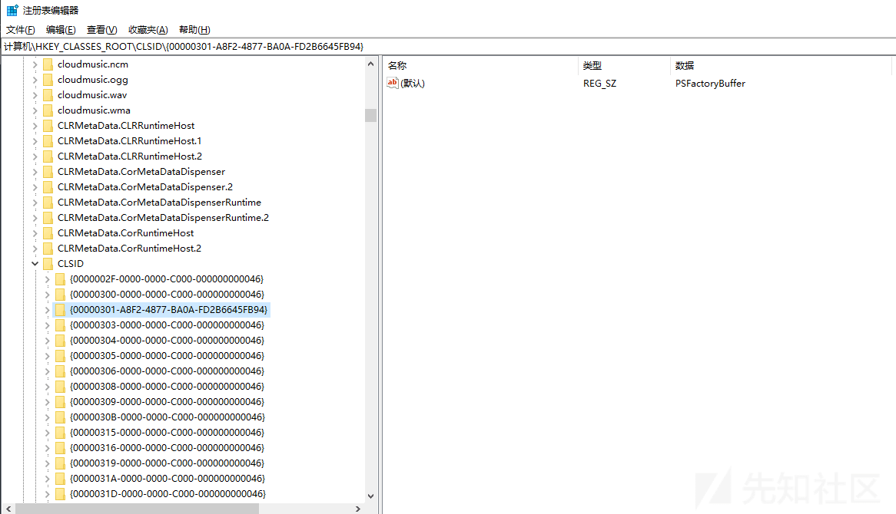](https://xzfile.aliyuncs.com/media/upload/picture/20240204002802-334d7b40-c2b1-1.png)

## **漏洞分析 CVE-2022-44667**

在 dmusic.dll 库中发现一个漏洞。攻击者可以利用此漏洞通过特制的应用程序导致整数溢出。因此当加载和解析 DLS 文件时，IDirectMusicPort COM 组件中可能发生越界写操作。其漏洞存在下述 COM 类的实现中  
CLSID：IDirectMusicCollection (480FF4B0-28B2-11D1-BEF7-00C04FBF8FEF)  
Interface: IDirectMusicPort；Server: C:\\WINDOWS\\System32\\dmusic.dll

[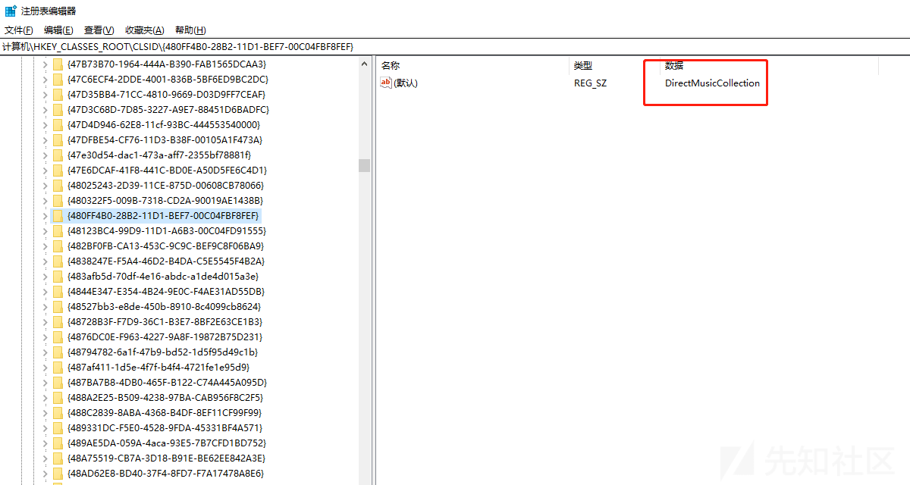](https://xzfile.aliyuncs.com/media/upload/picture/20240204002840-4a25d614-c2b1-1.png)

此 COM 类是 DirectMusic 的一部分，DLS 文件包含不同的块和列表  
如 Collection, Wave Pool, Wave File, List of Instrument, List of Region, List of Articulators 等  
DLS 文件的结构微软也是有文档涉及到的

[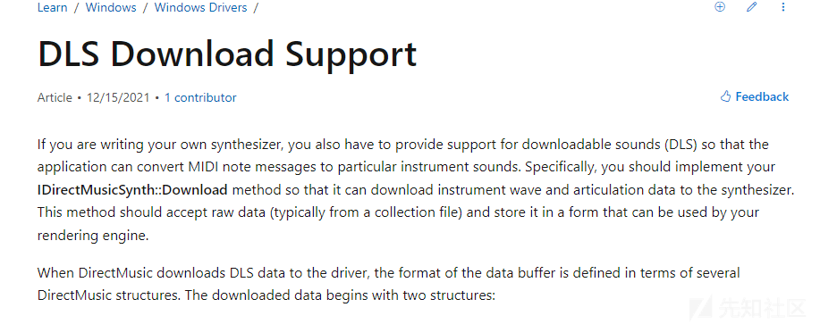](https://xzfile.aliyuncs.com/media/upload/picture/20240204002850-50159b5e-c2b1-1.png)

比如上述一文中提到 IDirectMusicSynth::Download 方法，它的功能是可以将乐器和音频数据下载到合成器。而且此方法应该接受原始数据 (通常来自集合文件)，并将其存储在呈现引擎可以使用的形式中。当 DirectMusic 将 DLS 数据下载到驱动程序时，数据缓冲区的格式是根据几个 DirectMusic 结构定义的。  
下载的数据以两个结构开始：DMUS\_DOWNLOADINFO：描述正在下载的信息的固定大小的标头。DMUS\_OFFSETTABLE：标头之后的偏移量表，描述下载数据中各种信息块的偏移量。  
偏移表后面是实际数据，可以用下列任意一种开头:DMUS\_INSTRUMENT-描述 DLS 的结构。DMUS\_WAVEDATA 一种包含 PCM 格式的波数据块的结构。  
Dmusic.dll 的 DLS 文件中的每个块和列表都有自己独特的结构。且 DLS 数据格式在内核模式和用户模式下是相同的在此漏洞中，我们将重点关注 Articulators 列表的解析。DLS 文件还包含不同的块和列表，如 Collection, Wave Pool, Wave File, List of Instrument, List of Region, List of Articulators 等。  
在此漏洞首先来看一些 CArticulation::Load 函数。这个函数负责从 DLS 文件加载数据。

[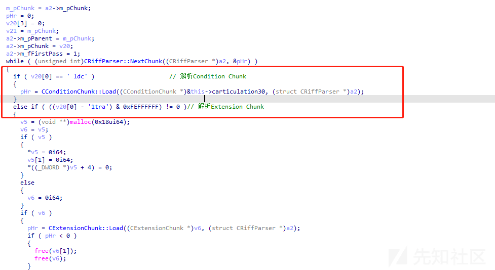](https://xzfile.aliyuncs.com/media/upload/picture/20240204002859-55c97cf0-c2b1-1.png)

从上图可以看出 CArticulation::Load 函数使用 tag 对数据块进行解析；而其中一个数据块就是 Articulators List；此函数还从 Articulators 列表中提取相关数据并将其存储在 m\_ArticData 中。这是从 DLS 文件中读取的 8 个字节实现的，而 DLS 文件表示 CONNECTIONLIST；其 CONNECTIONLIST 定义的结构体如下

```plain
struct _CONNECTIONLIST
{
  ULONG cbSize;
  ULONG cConnections;
};
```

[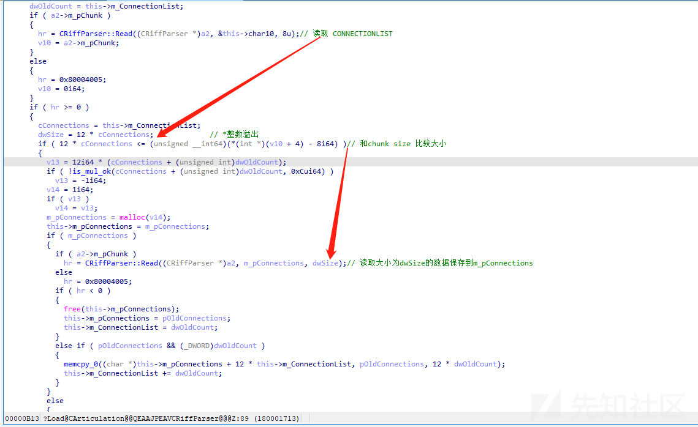](https://xzfile.aliyuncs.com/media/upload/picture/20240204002919-61b40ef4-c2b1-1.png)

在往下看会发现 dwSize 被赋值为 12*cConnections 此处的类型是 DWORD 但是代码中没有考虑到 cConnections 很大的时候就会超过 DWORD 的大小。然后在往下代码进行判断 12*cConnections 是否小于等于 cksize - 8, cksize - 8 就是 Articulation List 的大小。如果满足的话将分配一个大小为 12\*cConnections 的内存空间。在往下走就在下图的代码逻辑中其实可以看见此处是有对乘法的结果溢出检测的但是只是检测了\_int64(无符号整数) 中的溢出；所以乘法不会溢出。

[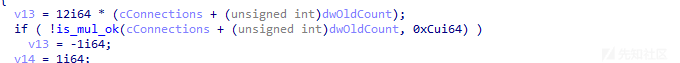](https://xzfile.aliyuncs.com/media/upload/picture/20240204002933-69ba0f40-c2b1-1.png)

分配了内存区域之后代码将数据读入新分配的 m\_pConnections 内存区域，其大小为 dwSize。但 m\_pConnections 内存区域分配的大小比 dwSize 大得多，大小不够触发不了崩溃。  
继续来看另一个函数 CInstrObj::Size 来计算 InstrObj 的总大小，包括 ExtensionChunkList, ArticulationList, RegionList 和 CopyrightChunk。

[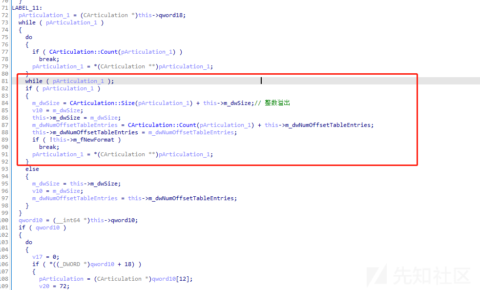](https://xzfile.aliyuncs.com/media/upload/picture/20240204002953-75beb642-c2b1-1.png)

代码中有一段循环的逻辑是为了计算 Articulators 的全部大小，在循环中都会调用 CArticulation::Size 函数获取当前 Articulator 的大小；然后将这个大小加到 this->m\_dwSize 中。  
但是 m\_dwSize = CArticulation::Size(pArticulation\_1) + this->m\_dwSize 这里的 m\_dwSize 和 this->m\_dwSize 都是 DWORD 类型；但 CArticulation::Size 函数却是可以返回一个\_int64 值。所以此时是可能会发送整数溢出。  
然后在 CDirectMusicPortDownload::DownloadP 函数中使用了 CInstrObj::Size 函数来确定 InstrObj 的大小。分配内存来存储 InstrObj。

[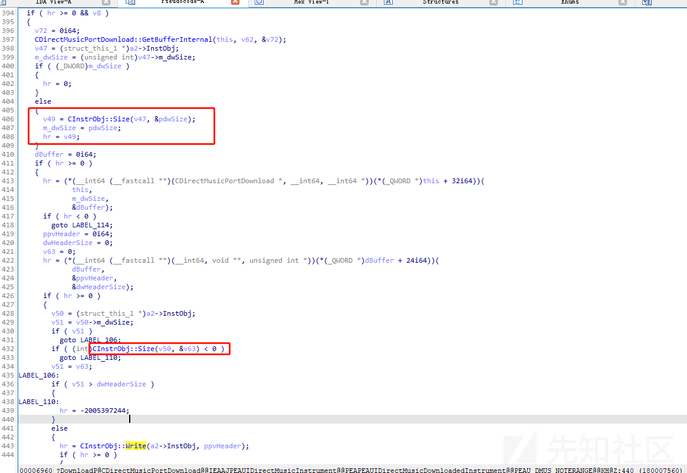](https://xzfile.aliyuncs.com/media/upload/picture/20240204003012-80c138b2-c2b1-1.png)

v49 的值代表了通过 size 函数得到 InstrObj 的总大小；然后在往下通过调用（这里是有一个虚函数表需要去里边找到对应指针的函数）CDirectMusicPortDownload::AllocateBuffer 函数分配一个名为 dBuffer 的缓冲区大小为 pdwSize。然后使用 CDownloadBuffer::GetBuffer 函数将 dBuffer 拆分为 ppvHeader 和 dwHeaderSize。  
在往下 ppvHeader 的值传入到 CInstrObj::Write 中去了；CInstrObj::Write(a2->InstObj, ppvHeader)  
而在其中又调用了 CArticulation::Write 函数

[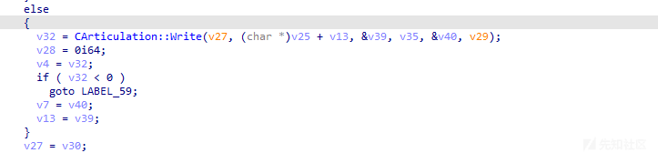](https://xzfile.aliyuncs.com/media/upload/picture/20240204003020-85bdf5da-c2b1-1.png)

[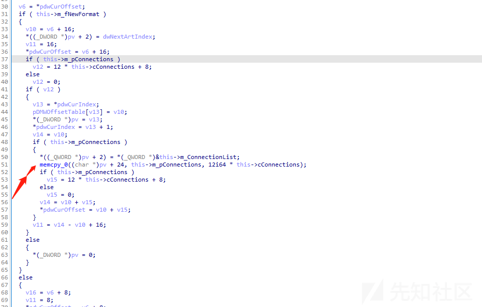](https://xzfile.aliyuncs.com/media/upload/picture/20240204003023-87e007fe-c2b1-1.png)

继续看数据发现其从 m\_pConnections 复制到 pv + 24 这里。这代表的其实是在 CDirectMusicPortDownload::DownloadP 函数中分配的内存区域 ppvHeader。所以就明了；因为之前计算 InstObj 的总大小有整数溢出，这就导致 ppvHeader 分配的内存放不下 InstrObj 的数据。所以 CArticulation:: write 函数就有一个越界写。

## **CVE-2022-44668**

此漏洞的过程相较上一个就比较简单了。还是在 dmusic.dll 文件中的，攻击者可以利用此漏洞通过特制应用程序导致 double free。因此当加载和分析 DLS 文件时，IDirectMusicPort COM 组件中可能会出现 double free。攻击者可以利用此漏洞在受害者的机器上远程执行代码。  
直接看一下关键漏洞点的位置 CDirectMusicSynthPort::Unload 函数；当此函数走到下图入口点时 pIDMDownload->lpVtbl->Release；此处就是 CDownloadBuffer::Release。通过 CDownloadBuffer::Release 函数释放 CDownloadBuffer \*pIDMDownload 的内存。然后在往下走就是 v7 中；通过 CUserModeSynth::Unload 使用 FreeHandle 回调卸载函数来释放 CDownloadBuffer 的内存。

[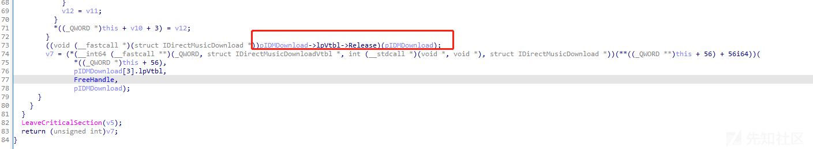](https://xzfile.aliyuncs.com/media/upload/picture/20240204003206-c4d61a54-c2b1-1.png)

在 CDownloadBuffer::Release 函数中代码包含一个 FreeHandle 的函数它会去释放 CDownloadBuffer 类

[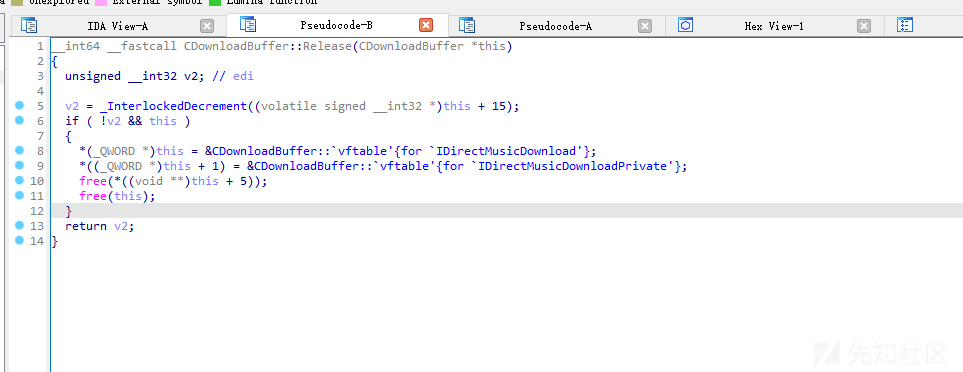](https://xzfile.aliyuncs.com/media/upload/picture/20240204003214-c9a242c4-c2b1-1.png)  
在 FreeHandle 函数中没有检查；所以最后利用就可以让 m\_pvBuffer 会在 CDownloadBuffer::Release 释放一次再到 FreeHandle 释放第二次，造成 double free

[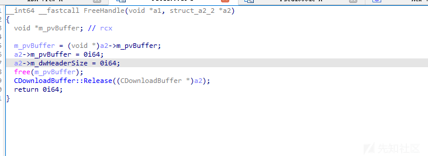](https://xzfile.aliyuncs.com/media/upload/picture/20240204003222-ce491fa0-c2b1-1.png)

可以通过如下代码（自己简单修改）生成测试 dls 用例进行漏洞调试分析；缺少引用的话就到这里找就行；[https://github.com/milliet/DDReader/tree/master；](https://github.com/milliet/DDReader/tree/master%EF%BC%9B)

```plain
#include <windows.h>
#include <dmusicc.h>
#include <dmusici.h>

#pragma comment(lib, "dmusic.lib")

void GenerateDLS(const wchar_t* dlsFileName) {
    IDirectMusicLoader8* pLoader = nullptr;
    IDirectMusicComposer8* pComposer = nullptr;
    IDirectMusicSegment8* pSegment = nullptr;
    CoInitialize(nullptr);
    CoCreateInstance(CLSID_DirectMusicLoader, nullptr, CLSCTX_INPROC,
        IID_IDirectMusicLoader8, (void**)&pLoader);
    CoCreateInstance(CLSID_DirectMusicComposer, nullptr, CLSCTX_INPROC,
        IID_IDirectMusicComposer8, (void**)&pComposer);
    pComposer->ComposeSegmentFromShape(&pSegment, 1, 1, DMUS_SHAPET_FALLING);
    pLoader->SaveObjectToFile(CLSID_DirectMusicSegment, IID_IDirectMusicSegment8,
       pSegment, dlsFileName, DMUS_SEGF_DEFAULT);
    pLoader->Release();
    pComposer->Release();
    pSegment->Release();
    CoUninitialize();
}

int main() {
    const wchar_t* dlsFileName = L"test.dls";
    GenerateDLS(dlsFileName);

    return 0;
}
```
