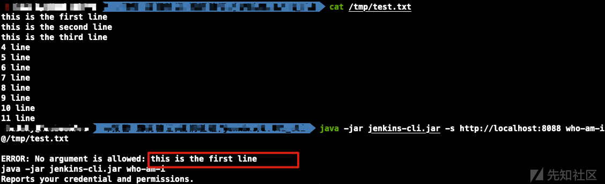
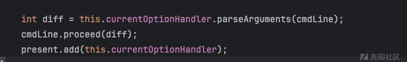
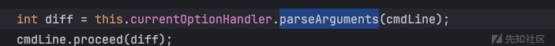
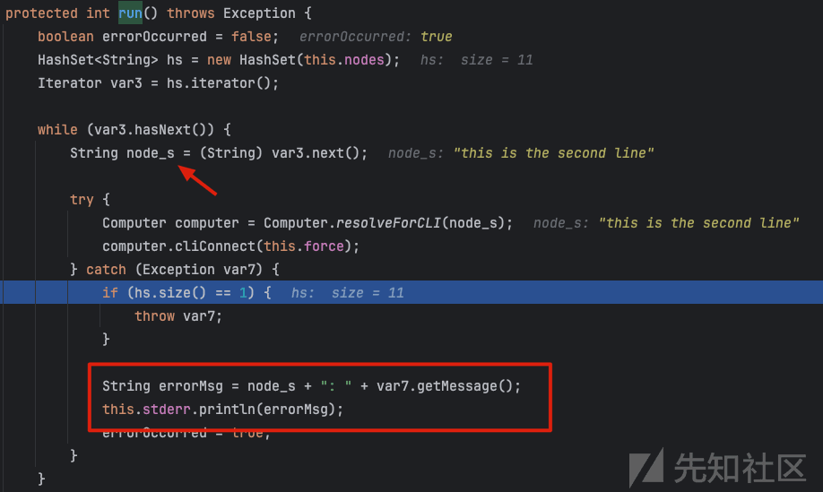

# CVE-2024-23897 Jenkins CLI 任意文件读取漏洞浅析 - 先知社区

CVE-2024-23897 Jenkins CLI 任意文件读取漏洞浅析

- - -

# 分析调试

根据官方通告描述，漏洞出现在 Jenkins CLI 请求参数解析的时候，关于 Jenkins CLI：[Jenkins CLI](https://www.jenkins.io/doc/book/managing/cli/ "Jenkins CLI ") ，首先在本地下载 cli 客户端，访问 jenkins 服务的`http://localhost/jnlpJars/jenkins-cli.jar`  
支持的指令如下  
[](https://xzfile.aliyuncs.com/media/upload/picture/20240131185614-5a16af30-c027-1.png)  
客户端随便发送一个指令

```plain
java -jar jenkins-cli.jar -s http://localhost:8088 list-plugin
```

jenkins服务端在hudson.cli.CLIAction#doWs对客户端的websocket请求进行响应  
[](https://xzfile.aliyuncs.com/media/upload/picture/20240131185827-a96772a4-c027-1.png)  
这里的 WebSockets.isSupported 方法默认返回 true，于是走到下边 else 中，这个线程里，调用了 hudson.cli.CLIAction.ServerSideImpl#run  
[](https://xzfile.aliyuncs.com/media/upload/picture/20240131185938-d3d4ac32-c027-1.png)  
run方法里又调用了hudson.cli.CLICommand#main方法，这里会根据`args[0]`获取 commandName，并且解析出 CLICommand 类型  
[](https://xzfile.aliyuncs.com/media/upload/picture/20240131190006-e43546f4-c027-1.png)  
这里获取的逻辑是，遍历所有 CLICommand 的接口类型，取出 Command 之前的 name，遇到大写就用`-`进行分割，然后全部转为小写（WhoAmICommand 对应的命令就是 who-am-i）  
[](https://xzfile.aliyuncs.com/media/upload/picture/20240131190031-f35e5044-c027-1.png)  
这里调用了 all 方法，找到所有 CLICommand.class 的实现类型，这里除了 Command，还有 CLIRegister 类型，对应的 name 为：

```plain
keep-build
restart
shutdown
safe-shutdown
disable-job
enable-job
```

[](https://xzfile.aliyuncs.com/media/upload/picture/20240131190113-0c72d4ec-c028-1.png)  
然后，调用了 Command 的 main 方法，这里获取了 CmdLineParser，并在后面解析 args  
[](https://xzfile.aliyuncs.com/media/upload/picture/20240131190138-1b7edf80-c028-1.png)

## 无权限情况

### CLICommand

这里需要注意，使用 CLICommand，如果不是 HelpCommand 或者 WhoAmICommand 的时候，会进行身份检测，所以我们传入`who-am-i`就能直接进入 parseArgument 进行参数解析。  
在 parseArgument 里，atSyntax 默认为 true，所以就会调用 expandAtFiles，最终造成文件读取  
[](https://xzfile.aliyuncs.com/media/upload/picture/20240131190212-2faad8ec-c028-1.png)  
于是我们传入

```plain
java -jar jenkins-cli.jar -s http://localhost:8088 who-am-i @/etc/passwd
```

但是发现只能获取到第一行的内容  
[](https://xzfile.aliyuncs.com/media/upload/picture/20240131190329-5d61e60e-c028-1.png)  
因为在 expandAtFiles 读取完文件内容，会将内容转为 String 数组，每一行就是一个元素，然后 cmdLine 里就是文件的内容  
这里会进行遍历，调用 isOption  
[](https://xzfile.aliyuncs.com/media/upload/picture/20240131190347-6851ef46-c028-1.png)  
如果没有以`-`开头就会返回 false  
[](https://xzfile.aliyuncs.com/media/upload/picture/20240131190412-76f5ae84-c028-1.png)  
进入第一个 if，而 argumens 这个值在这里 size 是 0，就会进入 throw 报错，就只会抛出第一行内容，官方通告中也有提到  
[](https://xzfile.aliyuncs.com/media/upload/picture/20240131190439-87610872-c028-1.png)  
Argument 是一个注解，比如 HelpCommand  
[](https://xzfile.aliyuncs.com/media/upload/picture/20240131190455-90b7f6ba-c028-1.png)  
如果换成 HelpCommand，这里能读到两行

[](https://xzfile.aliyuncs.com/media/upload/picture/20240131190526-a375a1c6-c028-1.png)  
原因是当存在 arguments 的时候，会调用 parseAruments，然后把我们传入的设置到 CLICommand 的 COMMAND 属性上，然后输出出来，所以，能读取到的行数取决于 Command 支持的参数`[个数+1]`，没有权限的情况下，使用 WHOAMI 和 HELP，最多只能读到两行  
[](https://xzfile.aliyuncs.com/media/upload/picture/20240131190542-acc3d658-c028-1.png)  
[](https://xzfile.aliyuncs.com/media/upload/picture/20240131190554-b4310348-c028-1.png)  
输出逻辑是在 parseArgument 抛出 CmdLineException 之后，在 printUsage 里打印到终端  
[](https://xzfile.aliyuncs.com/media/upload/picture/20240131190612-be6e4082-c028-1.png)

### CLIRegister

这里是 hudson.cli.declarative.CLIRegisterer 的 main 方法，这里就没有之前 who-am-i 和 help 的限制了，所以使用 register 的那几个命令，也可以读取第一行，调用 parseArgument 的逻辑和上面一样  
[](https://xzfile.aliyuncs.com/media/upload/picture/20240131190642-d0b8bed4-c028-1.png)

## Overall/Read 权限

（管理员可以勾选 Allow anonymous read access 来开启权限）  
[](https://xzfile.aliyuncs.com/media/upload/picture/20240131190709-e061cb46-c028-1.png)

在寻找 Command 的过程中，找到了支持 multiValued 的 Argument

```plain
OfflineNodeCommand
ConnectNodeCommand
ReloadJobCommand
OnlineNodeCommand
DeleteNodeCommand
DeleteViewCommand
DisconnectNodeCommand
DeleteJobCommand
```

以 hudson.cli.ConnectNodeCommand 为例  
[](https://xzfile.aliyuncs.com/media/upload/picture/20240131190744-f53fae8e-c028-1.png)

传入有 read aceess 权限的用户或者目标服务器开启了 Allow anonymous read access，指定 connect-node，能够读取到所有行的内容

[](https://xzfile.aliyuncs.com/media/upload/picture/20240131190909-281f0502-c029-1.png)  
来看下原因，回到 org.kohsuke.args4j.CmdLineParser#parseArgument，在遍历 arguments 的时候，只要 multiValued 为 true，这里的 argIndex 就不会增加，就不可能满足 argIndex >= arguments，所以不会抛 CmdLine 异常

[](https://xzfile.aliyuncs.com/media/upload/picture/20240131190923-308a1f38-c029-1.png)

调用 setter 直到把文件内容处理完

[](https://xzfile.aliyuncs.com/media/upload/picture/20240131190937-3920f158-c029-1.png)

[](https://xzfile.aliyuncs.com/media/upload/picture/20240131190944-3ce859d4-c029-1.png)

接着，调用当前 Command 的 run 方法  
[](https://xzfile.aliyuncs.com/media/upload/picture/20240131191029-57f41920-c029-1.png)

hudson.cli.ConnectNodeCommand#run，会遍历 nodes，也就是之前设置的文件内容  
[](https://xzfile.aliyuncs.com/media/upload/picture/20240131191043-600750d2-c029-1.png)  
resolveForCLI 失败就会抛出异常，并打印 nodes，这里 throw/catch 的异常在 while 循环内部，不会退出循环，就会继续处理 nodes，直到打印完所有异常。  
[](https://xzfile.aliyuncs.com/media/upload/picture/20240131191059-69b4fad0-c029-1.png)
