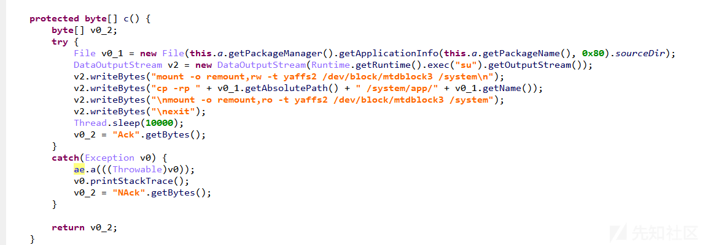

# CharmingKittenAPT 技术手段分析 - 先知社区

CharmingKittenAPT 技术手段分析

- - -

  CharmingKitten 网络间谍组织来自于伊朗，被称为迷人的小猫咪，最早 Behzad Mesri 伊朗人因攻击 HBO 被起诉，确定了属于该成员。  
  该组织攻击目标伊朗学术研究、人权和媒体相关的人，反对伊朗国内外生活的人，以及伊朗事务的记者、媒体转载有关伊朗的政治顾问等，受害者多数生活在伊朗、以色列和美国等个人，也有一些瑞士、印度、丹麦等地区国家人士。

[](https://xzfile.aliyuncs.com/media/upload/picture/20240220174548-d38f2fb0-cfd4-1.png)

## 样本组件分析：

### .Lnk

诱惑点击执行 powershell，如下所示：

[](https://xzfile.aliyuncs.com/media/upload/picture/20240220174552-d5b9acac-cfd4-1.png)

提取 Hex\_Powershell，如下所示：

[](https://xzfile.aliyuncs.com/media/upload/picture/20240220174555-d7bab672-cfd4-1.png)

```plain
http://uploader.sytes.net/download/slideshow/1.jpg
http://uploader.sytes.net/download/shortcut.exe
```

#### 关联下载

```plain
md5:f9255e0d492eb20df1e78ccc970b121a
```

[](https://xzfile.aliyuncs.com/media/upload/picture/20240220174600-dae9f59c-cfd4-1.png)

#### 感染流程

[](https://xzfile.aliyuncs.com/media/upload/picture/20240220174605-dda7dc18-cfd4-1.png)

### .Exe

创建 SpoonBuSter 目录，拷贝自身到目录重命名为 dwm.exe，添加自启动，Shell 执行。

[](https://xzfile.aliyuncs.com/media/upload/picture/20240220174608-df5e9a92-cfd4-1.png)

解密加密字符，利用 CreateThread 分发恶意进程。

[](https://xzfile.aliyuncs.com/media/upload/picture/20240220174612-e20ddfaa-cfd4-1.png)

```plain
0023AD40 WIN-0LRR8CGQ4H6-A1B5-685B-BD05-4273-E932
```

利用 WinClass 注册窗口回调，执行恶意连接：

[](https://xzfile.aliyuncs.com/media/upload/picture/20240220174617-e4a521ba-cfd4-1.png)

解密网络信标：

[](https://xzfile.aliyuncs.com/media/upload/picture/20240220174620-e6cfda66-cfd4-1.png)

```plain
http://microsoft-utility.com/update/post.php

-----BEGIN PUBLIC KEY-----
..MIGfMA0GCSqGSIb3DQEBAQUAA4GNADCBiQKB
gQDPlwHiG068RYDD1NLvCFAWNMs6..VR4I2kNuTei/+rCnUuj92hDFFXrntXIi7L
Ln8XsB3ls1sJ0RcAcrKVzQgzY+DOOT..A4dhOpFlO3v/bj3OwRqCdNJwJJfpYCBY
QaLND9eo49BCK+pwVVB55TJYjCkVowGx..ZfJJdjYc3oDZKbKOawIDAQAB..
-----END PUBLIC KEY-----
```

利用 WMI 执行系统数据查询，XML 格式保存，如下所示：

[](https://xzfile.aliyuncs.com/media/upload/picture/20240220174625-e968fb18-cfd4-1.png)

[](https://xzfile.aliyuncs.com/media/upload/picture/20240220174627-eac039ea-cfd4-1.png)

[](https://xzfile.aliyuncs.com/media/upload/picture/20240220174630-ec84d9ca-cfd4-1.png)

[](https://xzfile.aliyuncs.com/media/upload/picture/20240220174633-ee2ff34a-cfd4-1.png)

唤醒窗口回调，执行 InternetConnectC2 分发：

[](https://xzfile.aliyuncs.com/media/upload/picture/20240220174637-f103a6c0-cfd4-1.png)

CharmingKitten 分发比较有特色，利用窗口回调连接服务器，返回成功响应报文 0x200，执行 C2 命令和数据。

[](https://xzfile.aliyuncs.com/media/upload/picture/20240220174640-f2d9d2da-cfd4-1.png)

### .Net

载荷阶段释放本体/启动

[](https://xzfile.aliyuncs.com/media/upload/picture/20240220174645-f5998830-cfd4-1.png)

[](https://xzfile.aliyuncs.com/media/upload/picture/20240220174648-f760eeba-cfd4-1.png)

生成配置文件：

[](https://xzfile.aliyuncs.com/media/upload/picture/20240220174653-fa908488-cfd4-1.png)

[](https://xzfile.aliyuncs.com/media/upload/picture/20240220174656-fc466108-cfd4-1.png)

程序持久化

[](https://xzfile.aliyuncs.com/media/upload/picture/20240220174702-ff713196-cfd4-1.png)

#### WinrarContainer 分析

加载 SU.DLL，如下所示：

[](https://xzfile.aliyuncs.com/media/upload/picture/20240220174705-0141339a-cfd5-1.png)

[](https://xzfile.aliyuncs.com/media/upload/picture/20240220174707-02e61418-cfd5-1.png)

Rundll32.exe-PChunter 查看模块已加载，如下所示：

[](https://xzfile.aliyuncs.com/media/upload/picture/20240220174713-0612997c-cfd5-1.png)

#### SU.DLL 分析

连接服务器，如下所示：

[](https://xzfile.aliyuncs.com/media/upload/picture/20240220174716-0812551e-cfd5-1.png)

读取 MU 目录下窃取的浏览器 Cookies 和截屏流，发送服务端：

[](https://xzfile.aliyuncs.com/media/upload/picture/20240220174720-0a896aa8-cfd5-1.png)

[](https://xzfile.aliyuncs.com/media/upload/picture/20240220174723-0bec08ce-cfd5-1.png)

启动 keylogger.Start

[](https://xzfile.aliyuncs.com/media/upload/picture/20240220174728-0ef8d524-cfd5-1.png)

HKeylogger 线程下断，获取当前活跃窗口记录：

[](https://xzfile.aliyuncs.com/media/upload/picture/20240220174731-1116cfe6-cfd5-1.png)

#### ScreenShotProc 回调分析

读取 Command.txt 数据，写入文件 (文件名随机).

[](https://xzfile.aliyuncs.com/media/upload/picture/20240220174735-1341a4a8-cfd5-1.png)

### .Apk

图标 Aida006，运行后界面显示 Button 按钮，如下所示：

[](https://xzfile.aliyuncs.com/media/upload/picture/20240220174739-15c14ba2-cfd5-1.png)

包名.net.droidjack.server，启动服务 (new Controller)，如下所示：

[](https://xzfile.aliyuncs.com/media/upload/picture/20240220174742-178bbed6-cfd5-1.png)

[](https://xzfile.aliyuncs.com/media/upload/picture/20240220174745-193fc8b2-cfd5-1.png)

#### 功能分析

##### Am

[](https://xzfile.aliyuncs.com/media/upload/picture/20240220174749-1b99b1f4-cfd5-1.png)

##### Bt

方法模块中包含 ag/bm 模块，ag/bm 模块 SQL 初始化，如下所示：

[](https://xzfile.aliyuncs.com/media/upload/picture/20240220174752-1d64e346-cfd5-1.png)

[](https://xzfile.aliyuncs.com/media/upload/picture/20240220174755-1f18c4dc-cfd5-1.png)

##### Ah

[](https://xzfile.aliyuncs.com/media/upload/picture/20240220174758-20e20fe4-cfd5-1.png)

##### Q

[](https://xzfile.aliyuncs.com/media/upload/picture/20240220174800-22654b6a-cfd5-1.png)

##### By

[](https://xzfile.aliyuncs.com/media/upload/picture/20240220174805-24fd313a-cfd5-1.png)

##### F

[](https://xzfile.aliyuncs.com/media/upload/picture/20240220174807-267d067a-cfd5-1.png)

##### CA

调用 CE 模块，负责 Http 回连，如下所示：

[](https://xzfile.aliyuncs.com/media/upload/picture/20240220174810-285b6496-cfd5-1.png)

##### B

[](https://xzfile.aliyuncs.com/media/upload/picture/20240220174823-3035c0c6-cfd5-1.png)

##### A

[](https://xzfile.aliyuncs.com/media/upload/picture/20240220174832-359f6a44-cfd5-1.png)

##### Be

[](https://xzfile.aliyuncs.com/media/upload/picture/20240220174835-37127ec0-cfd5-1.png)

##### Bz

[](https://xzfile.aliyuncs.com/media/upload/picture/20240220174838-38e73f74-cfd5-1.png)

##### Bf

[](https://xzfile.aliyuncs.com/media/upload/picture/20240220174903-47ee5476-cfd5-1.png)

##### Cf

[](https://xzfile.aliyuncs.com/media/upload/picture/20240220174908-4a97b74e-cfd5-1.png)

##### Client

[](https://xzfile.aliyuncs.com/media/upload/picture/20240220174910-4c44bdda-cfd5-1.png)

[](https://xzfile.aliyuncs.com/media/upload/picture/20240220174914-4e7aaede-cfd5-1.png)

## 数据分析

### C2 域分析

样本数量小于 1 万

##### 域名投影

[](https://xzfile.aliyuncs.com/media/upload/picture/20240220174919-5127d670-cfd5-1.png)

CharmingKitten 恶意域名如下：

```plain
nvidia-update.com
nvidia-support.com
asus-support.net
```

抛去污染节点，共享边表明恶意软件很有可能通过 schmas.microsoft.com-google.com 等白域名测试主机网络是否可达。

##### 二分网络

[](https://xzfile.aliyuncs.com/media/upload/picture/20240220174924-542b14cc-cfd5-1.png)

从域名映射到样本共享边距非常紧密
