# DarkHydrus 技术手段分析 - 先知社区

DarkHydrus 技术手段分析

- - -

[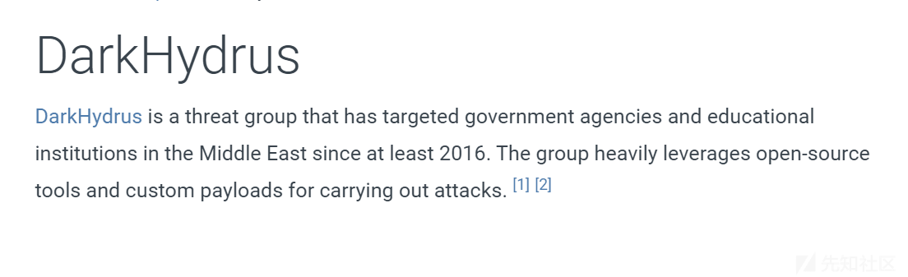](https://xzfile.aliyuncs.com/media/upload/picture/20240221085025-33776a40-d053-1.jpeg)

  DarkHyDrus 有“黑暗之蛇”的别称，疑似来自于亚洲网络间谍组织，至少从 2016 年起就开始针对中东的政府机构和教育机构，该组织大力利用开源工具和定制有效负载进行攻击。

### 组件分析

[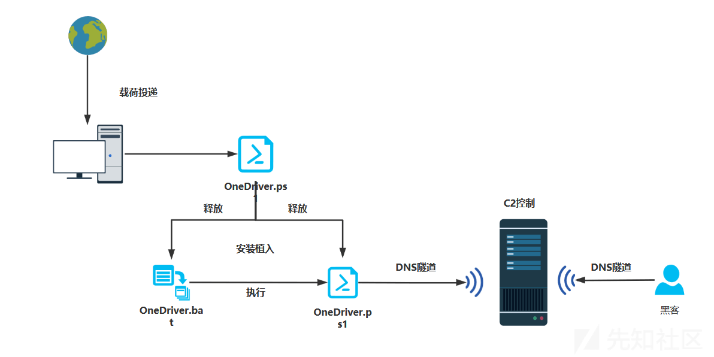](https://xzfile.aliyuncs.com/media/upload/picture/20240221084616-9f11ad02-d052-1.png)

#### Powershell

执行 xx.iqy 格式文件，下载 releasenotes.txt

[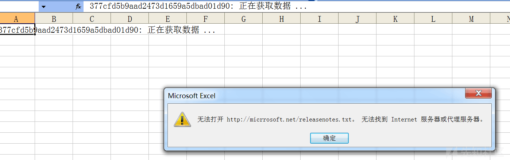](https://xzfile.aliyuncs.com/media/upload/picture/20240221084620-a11f1242-d052-1.png)

执行 cmd 调用 Powershell 下载 winupdate.ps1，如下所示：

[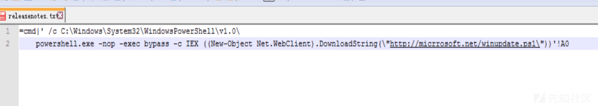](https://xzfile.aliyuncs.com/media/upload/picture/20240221084630-a76c209a-d052-1.png)

Powershell 是经过压缩后的 base64，如下所示：

[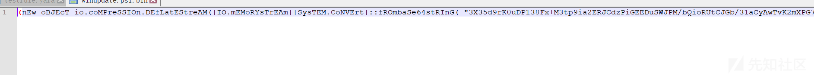](https://xzfile.aliyuncs.com/media/upload/picture/20240221084633-a9370c50-d052-1.png)

解密后 powershell 如下所示：

[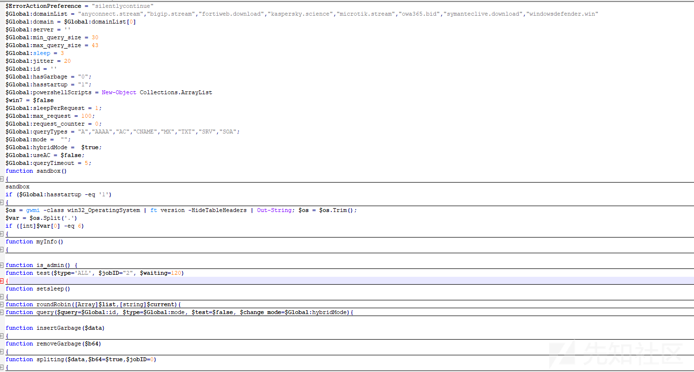](https://xzfile.aliyuncs.com/media/upload/picture/20240221084637-ab529c16-d052-1.png)

反虚拟机，WMI 接口查询 BIOS/VBOX/Vm 等

[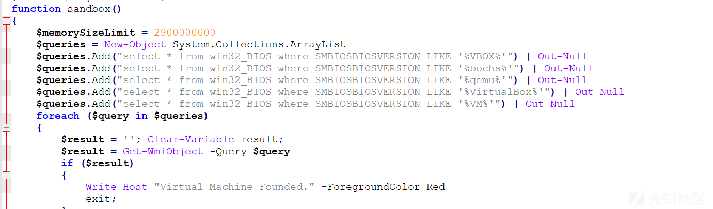](https://xzfile.aliyuncs.com/media/upload/picture/20240221084640-acfbf864-d052-1.png)

检测物理内存以及 Wireshark/Sysinternals 进程

[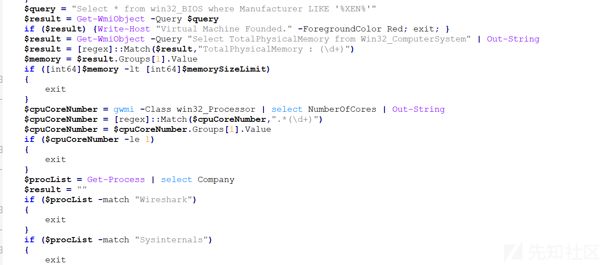](https://xzfile.aliyuncs.com/media/upload/picture/20240221084644-afc5bb2a-d052-1.png)

   
释放.bat 和 ps1，利用.bat 执行 OneDriver.ps1，如下所示：

[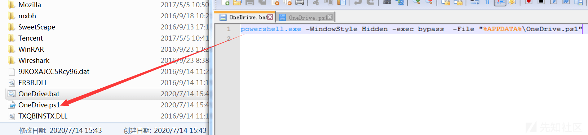](https://xzfile.aliyuncs.com/media/upload/picture/20240221084648-b1b82864-d052-1.png)

OneDriver.ps1 相对于本体只是减去了启动执行代码，创建 OneDriver 快捷方式，持久化。

[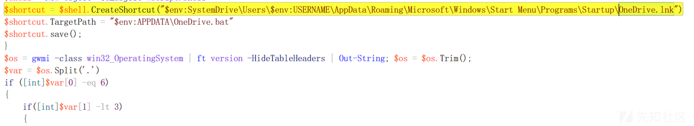](https://xzfile.aliyuncs.com/media/upload/picture/20240221084651-b3a0c578-d052-1.png)

  初始化网络配置，使用了自定义的 DNS 隧道，有效域名使用卡巴，微软等字符串，C2 连接成功后，采集系统信息 base64 编码，通过 DNS 隧道发送服务器。

[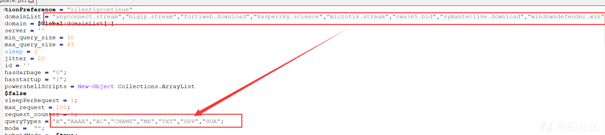](https://xzfile.aliyuncs.com/media/upload/picture/20240221084655-b5bede44-d052-1.png)

[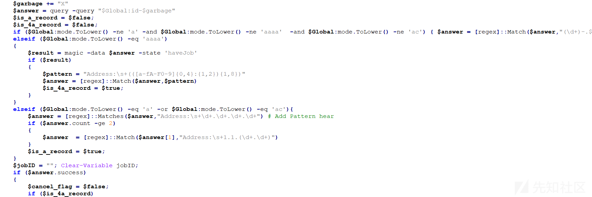](https://xzfile.aliyuncs.com/media/upload/picture/20240221084657-b73c21b4-d052-1.png)

```plain
anyconnect[.]stream
bigip[.]stream
fortiweb[.]download
kaspersky[.]science
microtik[.]stream
owa365[.]bid
symanteclive[.]download
windowsdefender[.]win
```

功能模块梳理

[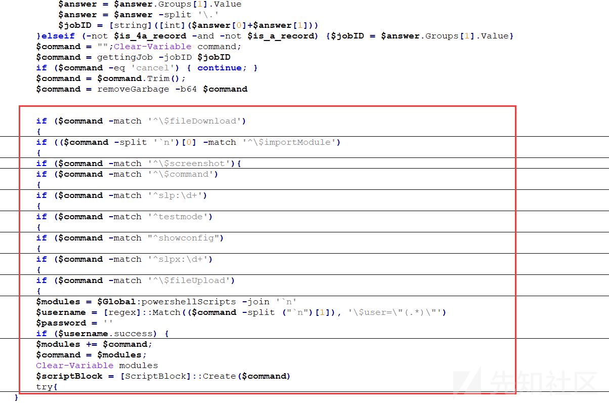](https://xzfile.aliyuncs.com/media/upload/picture/20240221084702-b9ed7912-d052-1.png)

| 指令  | 功能  |
| --- | --- |
| $fileDownload | 上传指定内容 |
| $importModule | 将指定的 PowerShell 模块添加到当前脚本 |
| $screenshot | 代码中 iex $command，不能确定为截屏 |
| $command | 运行 powershell |
| $slp:\\d+ | 睡眠  |
| $testmode | DNS 解析模块 |
| $showconfig | 载荷当前配置上传 |
| $slpx:\\d+ | DNS 请求时长设置 |
| $fileUpload | 下载 payload 写入本地 |

  通过.lqy 载荷投递，触发 web 远程下载，Powershell 进行主机感染，自定义 DNS 隧道 C2 命令控制，完成目标主机入侵。

#### Exe

函数并不从入口点执行，main 函数之前执行 shellcode，如下所示：

[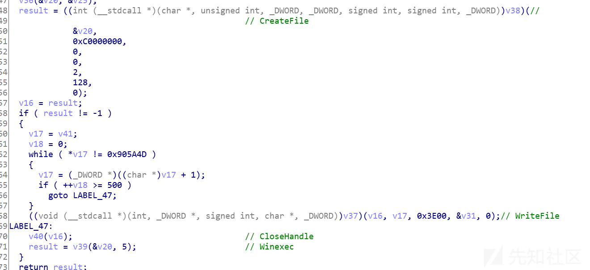](https://xzfile.aliyuncs.com/media/upload/picture/20240221084706-bc98fea2-d052-1.png)

Tmep 下创建文件，WinExec 执行

[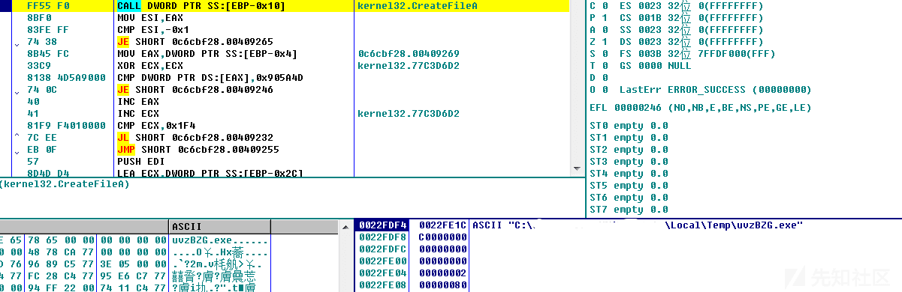](https://xzfile.aliyuncs.com/media/upload/picture/20240221084709-be1e4b9c-d052-1.png)

   
释放 Aspack 加壳程序

[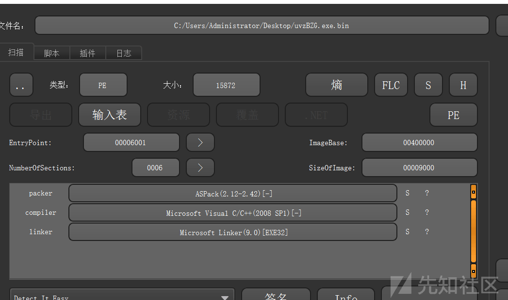](https://xzfile.aliyuncs.com/media/upload/picture/20240221084712-bff46118-d052-1.png)

是否需要提权，根据系统版保存结构体偏移。

[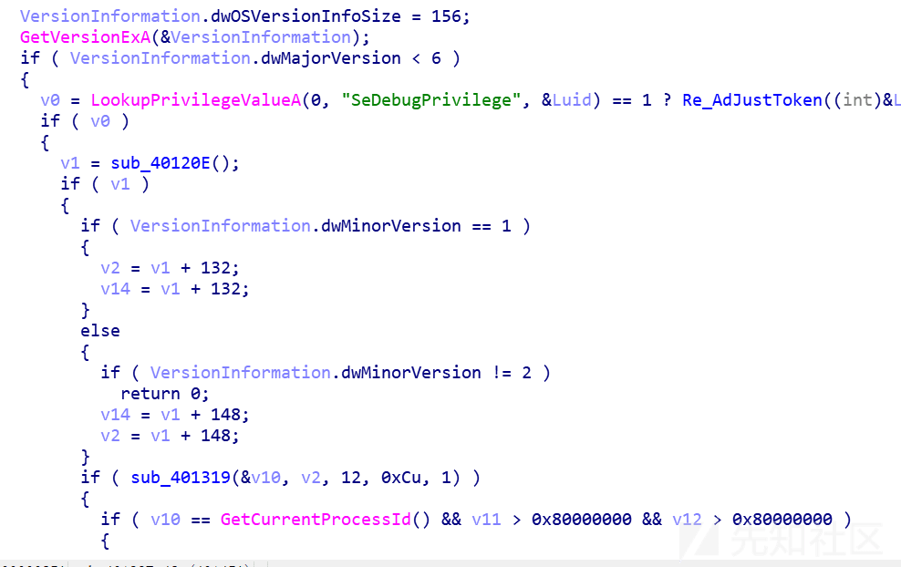](https://xzfile.aliyuncs.com/media/upload/picture/20240221084714-c1649996-d052-1.png)

[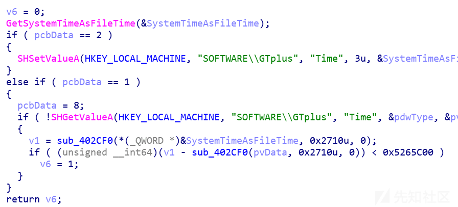](https://xzfile.aliyuncs.com/media/upload/picture/20240221084717-c3162368-d052-1.png)

   
注册表设置

[](https://xzfile.aliyuncs.com/media/upload/picture/20240221084717-c3162368-d052-1.png)

内存数据解密

[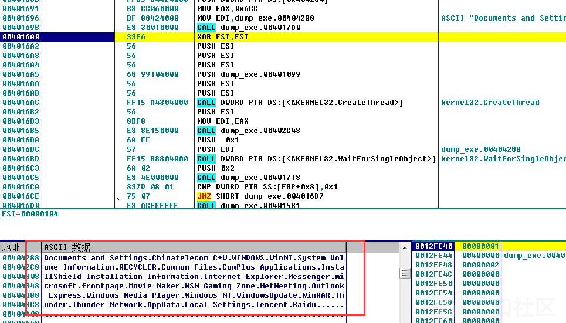](https://xzfile.aliyuncs.com/media/upload/picture/20240221084720-c4e79d70-d052-1.png)

   
为每一个非光驱，已知磁盘设备创建单独的线程，用于递归遍历感染。

[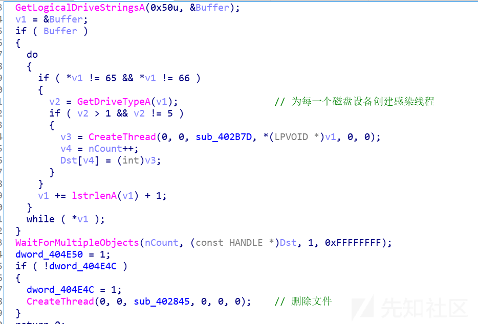](https://xzfile.aliyuncs.com/media/upload/picture/20240221084723-c7005084-d052-1.png)

分发的线程两个感染动作，分别针对 exe 和 rar

[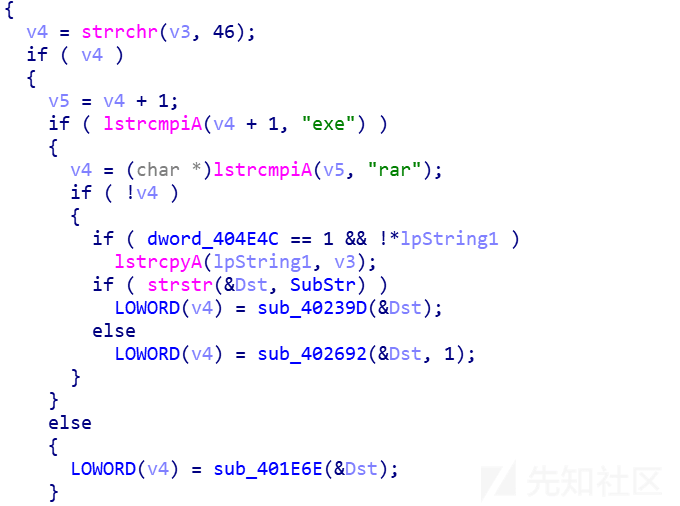](https://xzfile.aliyuncs.com/media/upload/picture/20240221084726-c853e0d6-d052-1.png)

   
  Winrar.exe 被重定向至 temp 目录下，重命名为{随机数}.exe，进行压缩包感染，解压后感染 exe，重新打包，利用 CreateProcess 执行 WinRar 指令。

[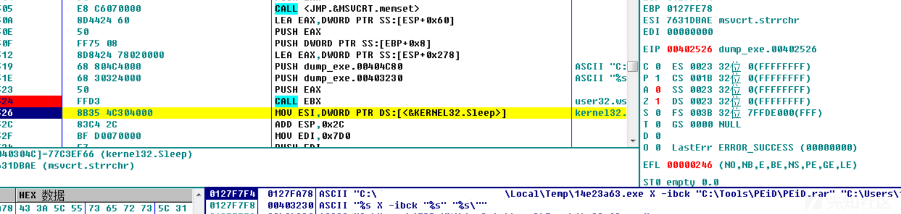](https://xzfile.aliyuncs.com/media/upload/picture/20240221084728-c9d10f24-d052-1.png)

```plain
WinRar 命令
%s X -ibck \"%s\" \"%s\\\
"%s M %s -r -o+ -ep1 \"%s\" \"%s\\*\"
```

exe 感染，第一次写入 shllcode，大小 625 字节，用于 Api 动态寻址，第二次写入样本本体，大小 0x3A00，如下所示：

[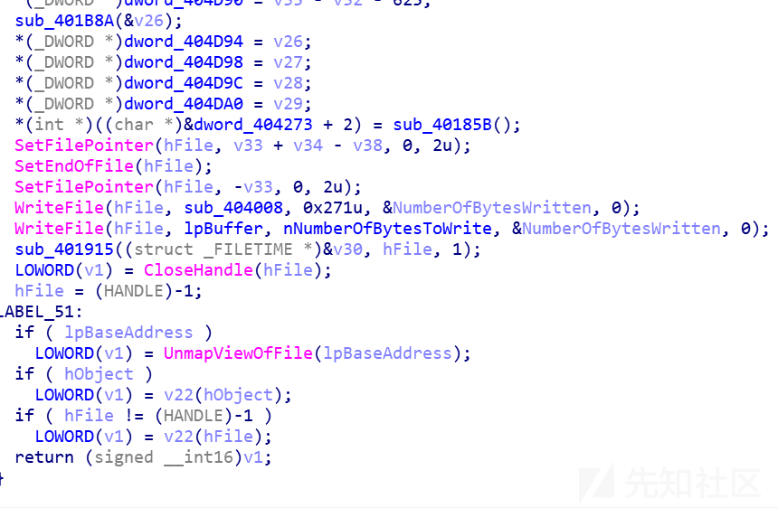](https://xzfile.aliyuncs.com/media/upload/picture/20240221084732-cbdc49dc-d052-1.png)

   
创建线程用于请求网络和文件下载，如下所示：

[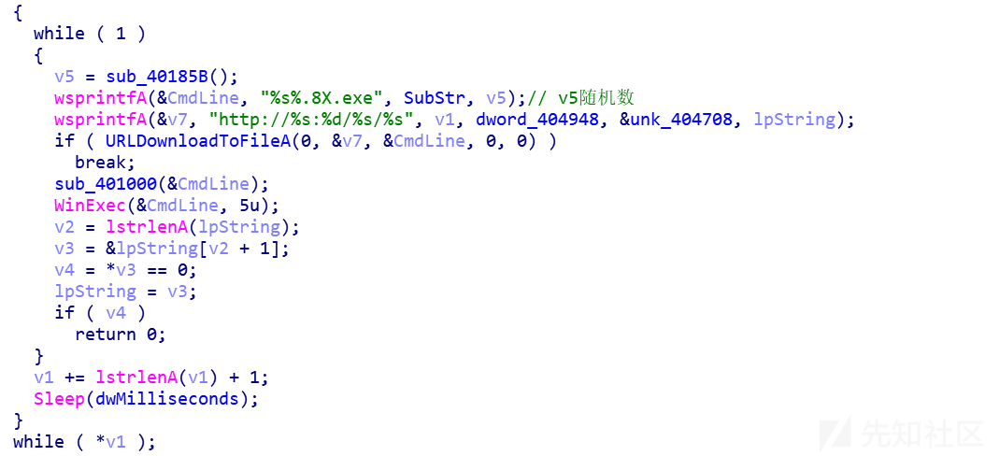](https://xzfile.aliyuncs.com/media/upload/picture/20240221084734-cd50d184-d052-1.png)

[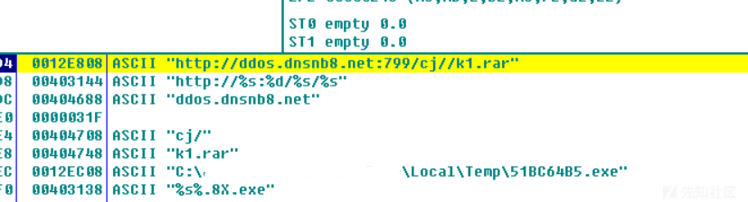](https://xzfile.aliyuncs.com/media/upload/picture/20240221084736-cea6898e-d052-1.png)

```plain
http://ddos.dnsnb8.net:799/cj//k1.rar
```

下载 k1.rar 到本地{随机数}.exe，FileMap 将文件映射到内存，解密数据，WinExec 执行文件。

[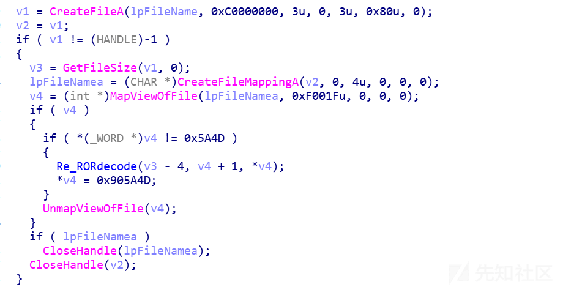](https://xzfile.aliyuncs.com/media/upload/picture/20240221084741-d1814cb6-d052-1.png)

   
Bat 删除文件收尾工作

[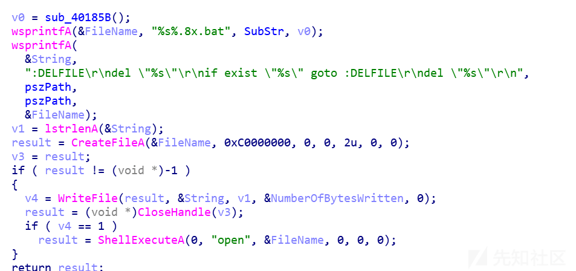](https://xzfile.aliyuncs.com/media/upload/picture/20240221084743-d2ac897a-d052-1.png)

[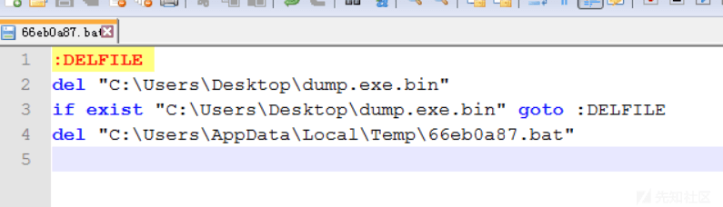](https://xzfile.aliyuncs.com/media/upload/picture/20240221084746-d422f960-d052-1.png)

  Exe 组件属于杀伤链第五个环节安装植入，蠕虫传播类型下载器，对于单纯下载器来说更具有危害，造成大量文件被恶意感染。

#### .Net

Net 组件和 Powershell 功能一样，自定义 DNS 隧道代理进行 C2 通信。

[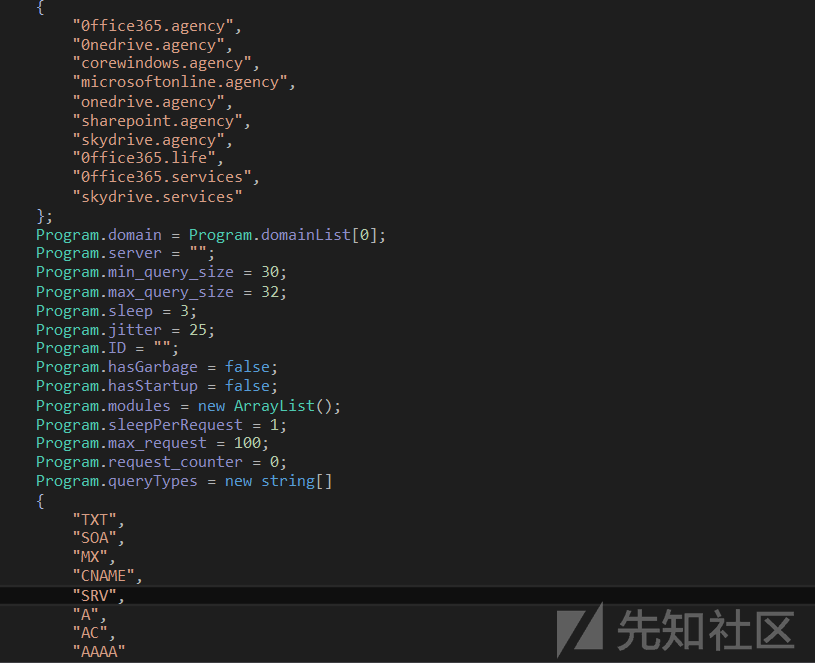](https://xzfile.aliyuncs.com/media/upload/picture/20240221084749-d67665d0-d052-1.png)

##### DNS 隧道

刷新 DNS 解析缓存，主机从本地域查找 dns 缓存，如果查询不到，请根域等待最终解析结果。

[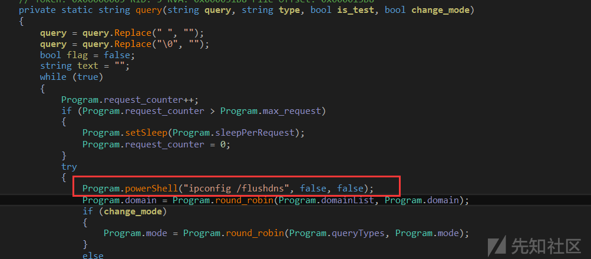](https://xzfile.aliyuncs.com/media/upload/picture/20240221084753-d86ba62a-d052-1.png)

构造 Windows nslookup 解析指令，如下所示：

[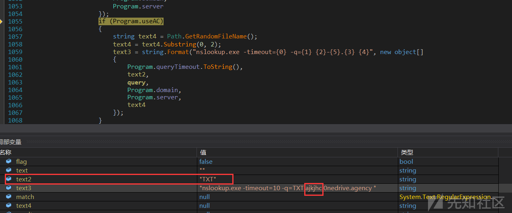](https://xzfile.aliyuncs.com/media/upload/picture/20240221084755-d9be81d2-d052-1.png)

[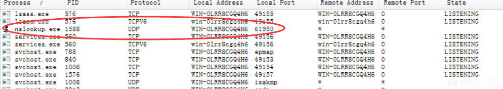](https://xzfile.aliyuncs.com/media/upload/picture/20240221084759-dc10dc0a-d052-1.png)

   
参数-q=TXT 请求域名文本信息，域名格式{固定字符}.List.

[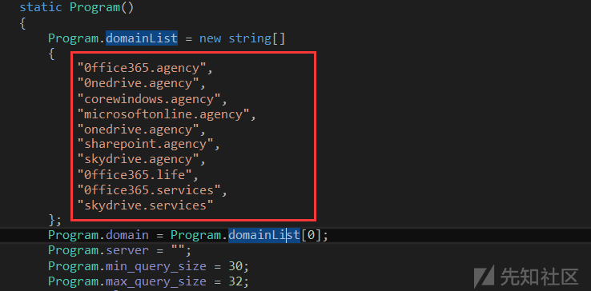](https://xzfile.aliyuncs.com/media/upload/picture/20240221084802-de2af142-d052-1.png)

固定格式，676f6f646c75636b.gogle.co

[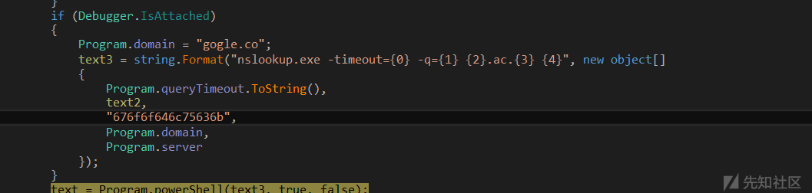](https://xzfile.aliyuncs.com/media/upload/picture/20240221084806-e024cb94-d052-1.png)

[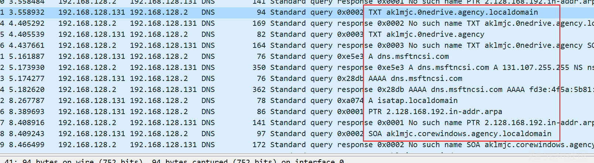](https://xzfile.aliyuncs.com/media/upload/picture/20240221084808-e194e72a-d052-1.png)

[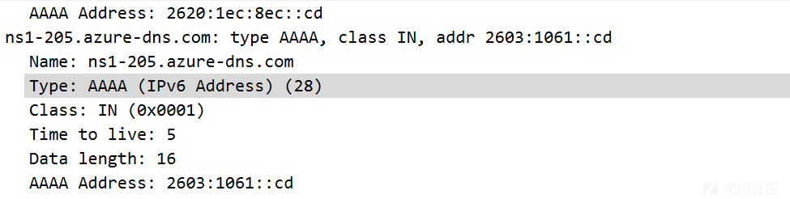](https://xzfile.aliyuncs.com/media/upload/picture/20240221084810-e2e3ca2e-d052-1.png)  
   
解析请求返回状态，成功失败

[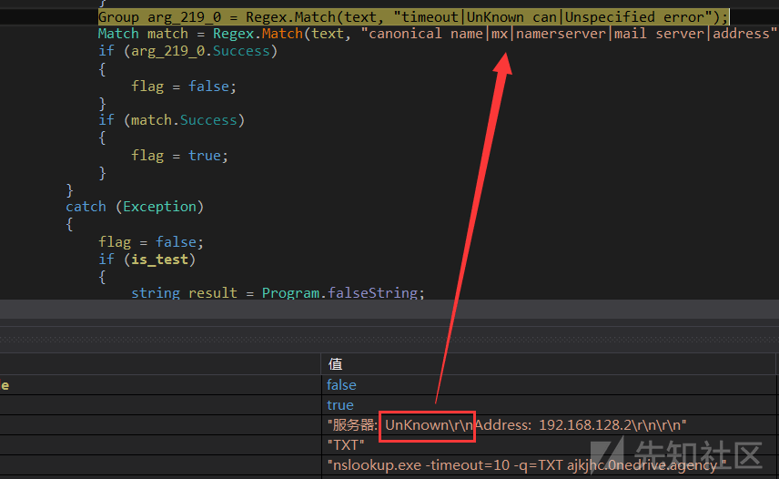](https://xzfile.aliyuncs.com/media/upload/picture/20240221084818-e7a6e21c-d052-1.png)

通过正则来匹配返回域纪录，DNS 回包 C2 指令和数据，TXT 请求会包含很多信息，如下所示

[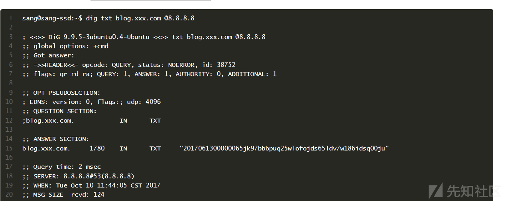](https://xzfile.aliyuncs.com/media/upload/picture/20240221084822-e9985b8c-d052-1.png)

```plain
Address:\\s+(\\d+.\\d+.\\d+.\\d+)
Address:\\s+(([a-fA-F0-9]{0,4}:{1,2}){1,8})
Address:\\s+(([a-fA-F0-9]{0,4}:{1,4}[\\w|:]+){1,8})
```

循环遍历 List 可用域名，Wmi 获取本地域，主机名，给予管理员权限获取域列表。

[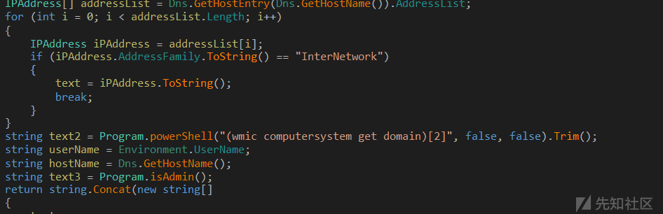](https://xzfile.aliyuncs.com/media/upload/picture/20240221084826-ec7e3830-d052-1.png)

DNS 包解析和构建，如下所示：

[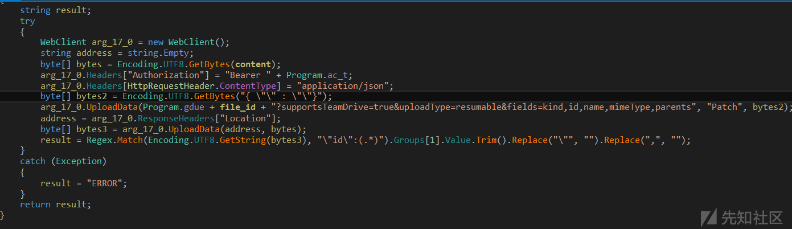](https://xzfile.aliyuncs.com/media/upload/picture/20240221084829-edf9b6a8-d052-1.png)

[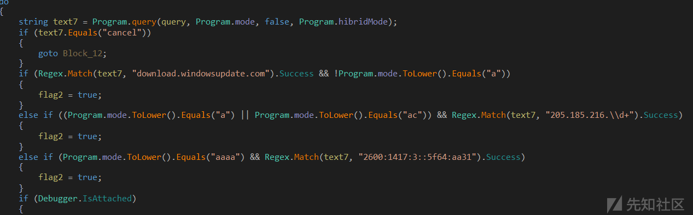](https://xzfile.aliyuncs.com/media/upload/picture/20240221084832-f00c3592-d052-1.png)

[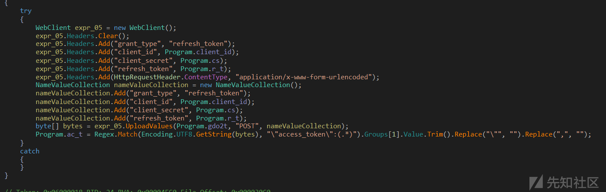](https://xzfile.aliyuncs.com/media/upload/picture/20240221084835-f187267a-d052-1.png)

magic 函数使用正则解析 DNS 查询类型 MZ/TXT 等回包，如下所示：

[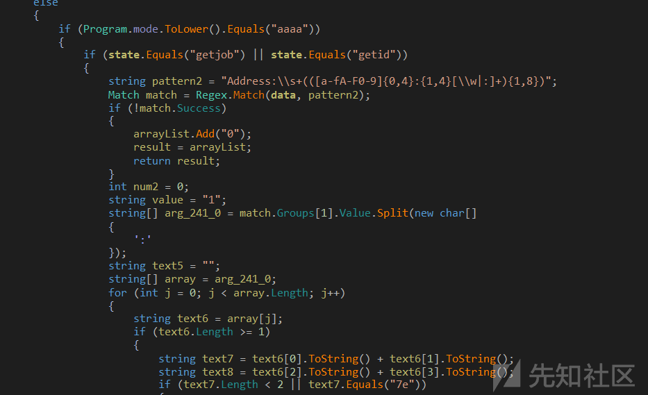](https://xzfile.aliyuncs.com/media/upload/picture/20240221084846-f852a2b8-d052-1.png)

客户端解析 DNS 回应包 C2 指令和数据，保存 command 命令执行 C2 功能。

[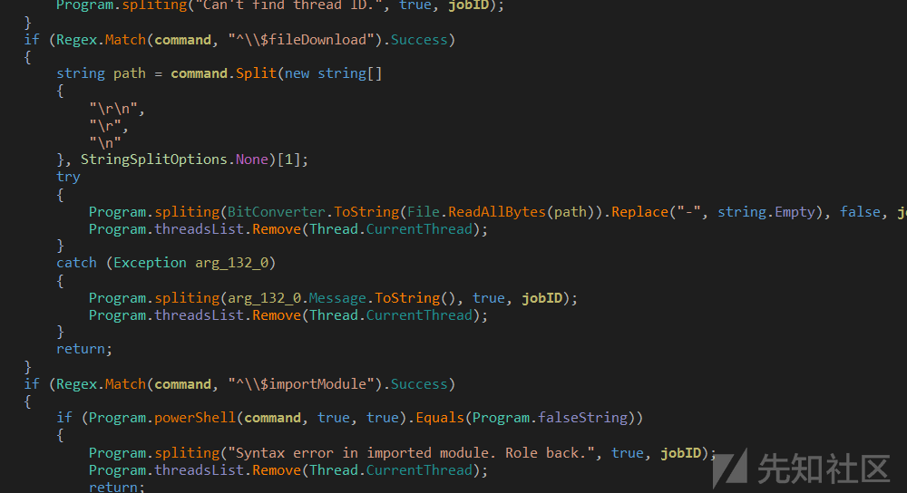](https://xzfile.aliyuncs.com/media/upload/picture/20240221084854-fd225f54-d052-1.png)

### 总结

  通过样本分析未发现加密传输，明文进行传输，DNS 隧道流量检测根据上文分析细节取关键字符如 List 列表和 C2 检测，请求频率 (睡眠) 都可以流量检测。  
  2017 年思科 Talos 团队发现一起名为 DNSMessenger 的攻击，该恶意软件的所有命令与控制通信都经过 DNS TXT 类型查询和响应，上述攻击手法类似，通过 TXT 查询和响应，通过回包来穿透内网。

### IOC

```plain
0c6cbf288d94a85d0fb9e727db492300
6267BBC7BEC7BEB134A92F6F9E523B4F
bd764192e951b5afd56870d2084bccfd
953a753dd4944c9a2b9876b090bf7c00
B3432432B49EFCC4B5AB1C00C84827AC
A164A2341F4F54DBD0FA881E5C067C1A
```
