# 「Ghidra」一个自用的 Ghidra 脚本分享 - 先知社区

「Ghidra」一个自用的 Ghidra 脚本分享

- - -

# ghidra\_scripts\_cha11

> Ghidra 变强术，一个 Ghidra 脚本库
> 
> 项目地址：[https://github.com/Cha111Ng1/ghidra\_scripts\_cha11](https://github.com/Cha111Ng1/ghidra_scripts_cha11)

# 前言

-   以下脚本均在 Mac 下完成，对其他系统可能存在不适配性能，这里提供代码，仅供参考，大家可根据自己的需求自行修改，涉及 Python 库自行安装，这些功能都是平常个人使用频率较高的，刷题嘎嘎香。
    
-   所有 Python 代码均基于 Python3，如无法使用请参考《Ghidra 之 什么？为啥你的 Ghidra 是 Python3》[https://mp.weixin.qq.com/s/c8LMwNIK3CEVDA3FJo-lLg切换默认Python（默认的是jpython）。](https://mp.weixin.qq.com/s/c8LMwNIK3CEVDA3FJo-lLg%E5%88%87%E6%8D%A2%E9%BB%98%E8%AE%A4Python%EF%BC%88%E9%BB%98%E8%AE%A4%E7%9A%84%E6%98%AFjpython%EF%BC%89%E3%80%82)
    

## 导入脚本文件夹

[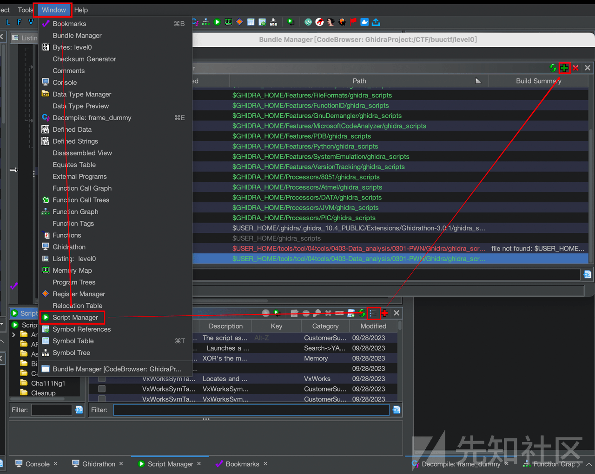](https://xzfile.aliyuncs.com/media/upload/picture/20240224003602-a1f89274-d269-1.png)

## 勾选脚本

[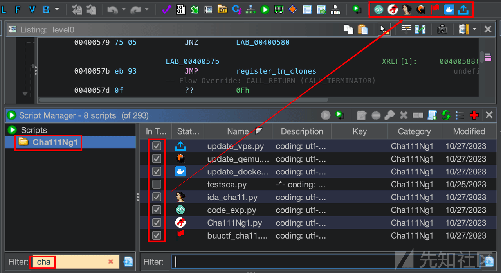](https://xzfile.aliyuncs.com/media/upload/picture/20240224003612-a7c27ef4-d269-1.png)

## 菜单栏路径

[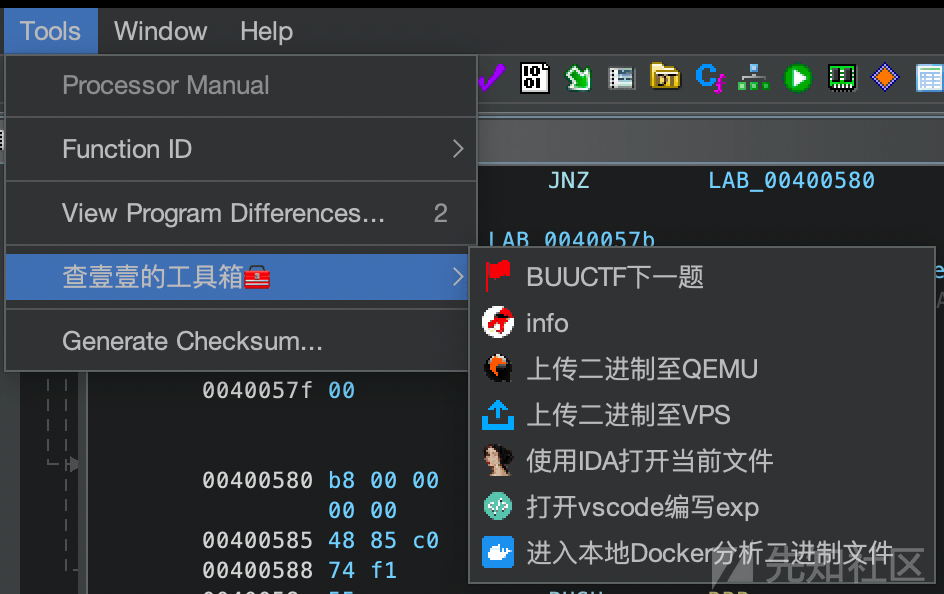](https://xzfile.aliyuncs.com/media/upload/picture/20240224003621-ad3f7382-d269-1.png)

# Ghidra 自动化操作

在使用 Ghidra 的过程中会存在一些重复性的工作，该模块有助于节约生命。

## Cha111Ng1.py

一个查看当前二进制文件信息的脚本（这里对不齐！！！希望你是个强迫症）

### 运行效果

[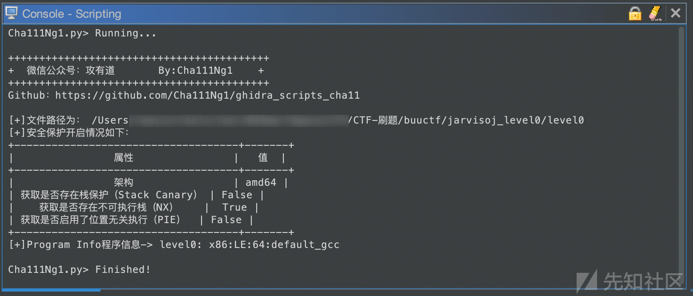](https://xzfile.aliyuncs.com/media/upload/picture/20240224003632-b3a7995c-d269-1.png)

## buuctf\_cha11.py

BUUCTF 刷题脚本，半自动下载题目，开启靶机，提交 flag，关闭靶场，查找资料

### 脚本需修改

飞书安装路径或钉钉安装路径，以及 BUUCTF 登录凭证信息，BUUCTF 题根目录

[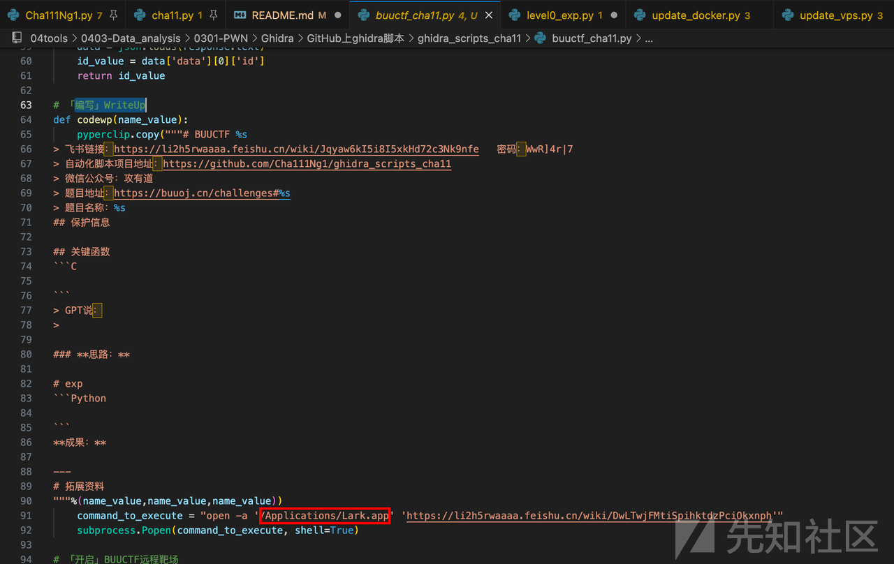](https://xzfile.aliyuncs.com/media/upload/picture/20240224003642-b9dfd334-d269-1.png)

[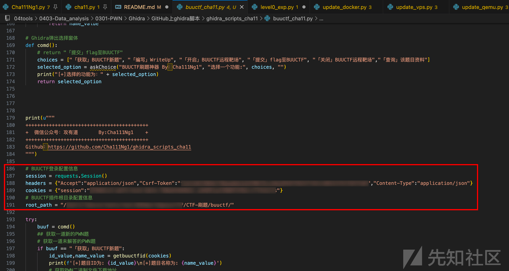](https://xzfile.aliyuncs.com/media/upload/picture/20240224003650-beb738ca-d269-1.png)

### 运行效果

[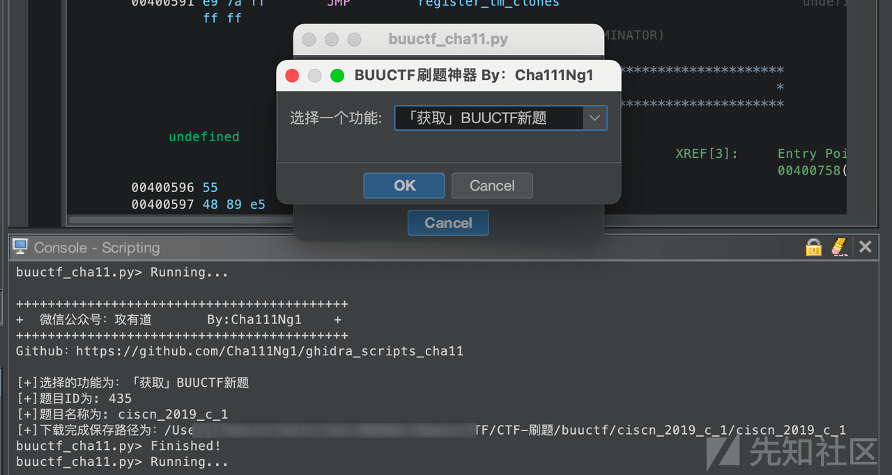](https://xzfile.aliyuncs.com/media/upload/picture/20240224003659-c3ede99c-d269-1.png)

[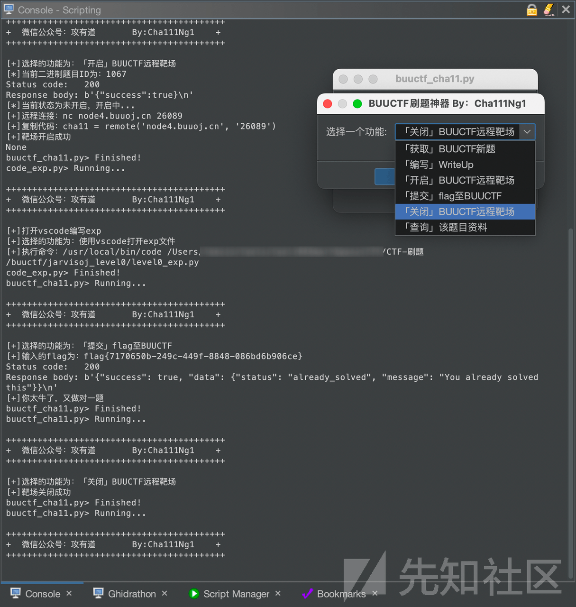](https://xzfile.aliyuncs.com/media/upload/picture/20240224003709-c9abcb92-d269-1.png)

## code\_exp.py

### 脚本需修改

你可能需修改为你 vscode 的安装路径

### 运行效果

[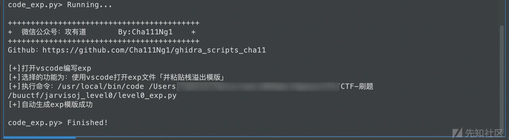](https://xzfile.aliyuncs.com/media/upload/picture/20240224003723-d238fcee-d269-1.png)

[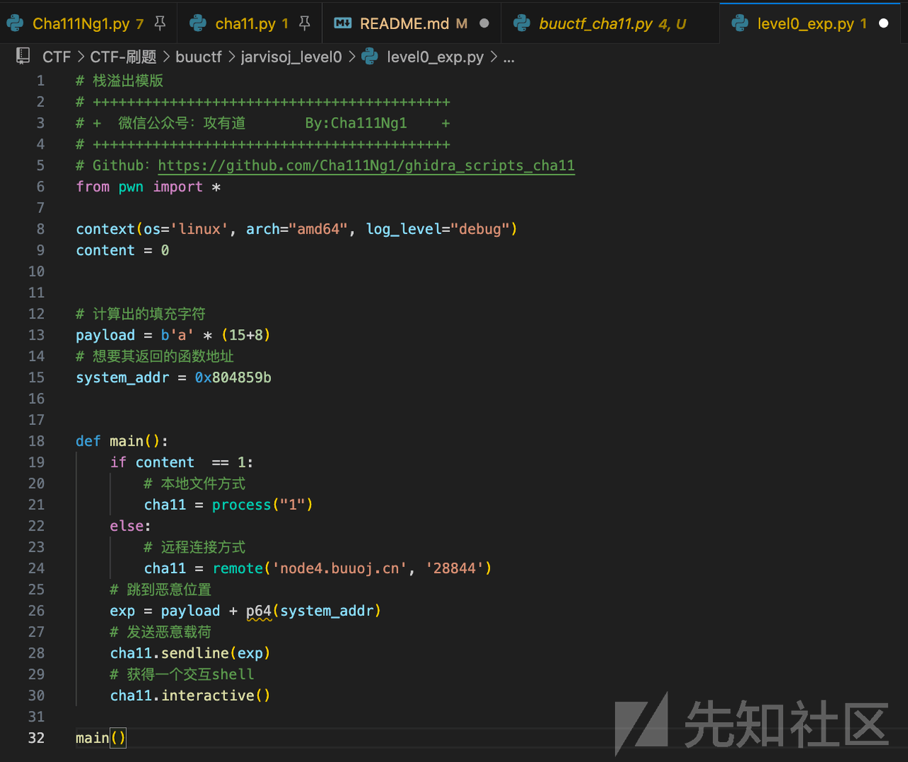](https://xzfile.aliyuncs.com/media/upload/picture/20240224003732-d7a4fc14-d269-1.png)

## ida\_cha11.py

自动使用 32/64 位 IDA 打开二进制文件进行分

### 脚本需修改

修改为你 IDA 的安装路径

### 运行效果

[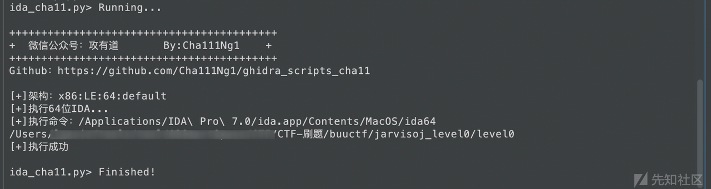](https://xzfile.aliyuncs.com/media/upload/picture/20240224003742-dd8c4178-d269-1.png)

## update\_docker.py

进入 docker 容器分析，其中需要配置的内容有，设置你的容器 ID，以及创建容器时，做好文件夹和端口的映射，我这里使用的 docker 容器是 pwntools，大家可以参考，不过 M1 环境下的 docker 里面的 gdb 无法使用，后面我选择了 QEMU

```plain
docker run -tid --cap-add=SYS_PTRACE --security-opt seccomp=unconfined --name cha11pwn2 -p 1337:1337 -v /Users/root/tools/tool/03SmartSpace/CTF/CTF-刷题:/home/pwntools/ pwntools/pwntools
```

### 脚本需修改

创建容器后，代码中修改位置图中第 59 行，修改为你的容器 ID 或名称

[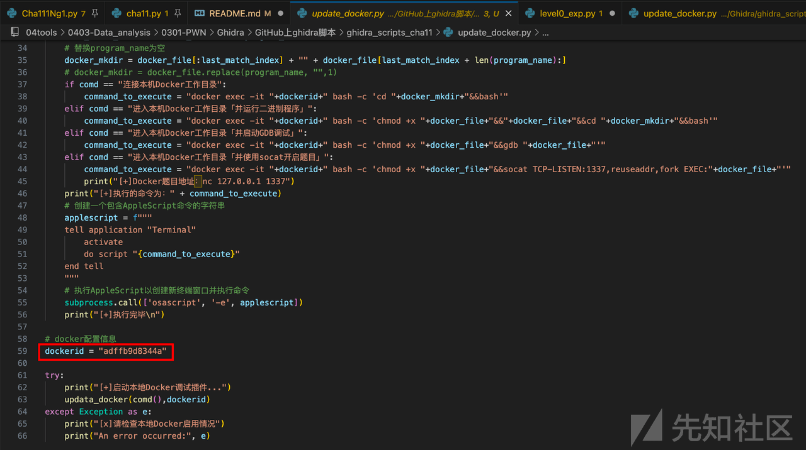](https://xzfile.aliyuncs.com/media/upload/picture/20240224003754-e4789ec8-d269-1.png)

### 运行效果

[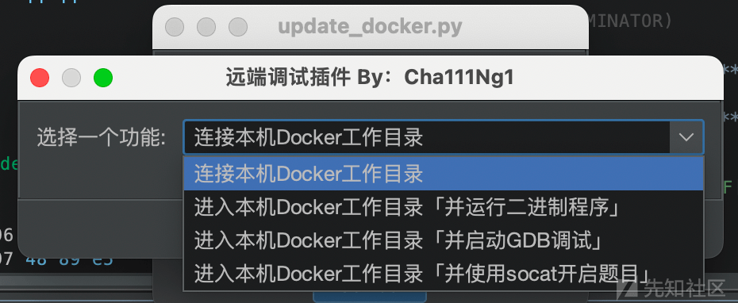](https://xzfile.aliyuncs.com/media/upload/picture/20240224003803-e9dbf798-d269-1.png)

## update\_qemu.py

进入 qemu 虚拟机分析，M1 配置 qemu 安装 x86 虚拟机相关教程请参见：[https://mp.weixin.qq.com/s/jMFMYB1aZaljZ\_HtKZxPKg](https://mp.weixin.qq.com/s/jMFMYB1aZaljZ_HtKZxPKg)

### 脚本需修改

参考 update\_vps.py

### 运行效果

[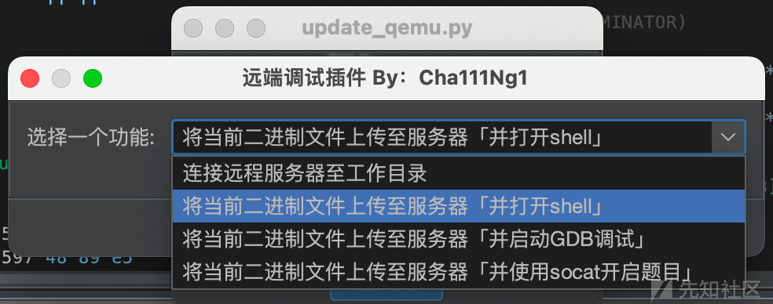](https://xzfile.aliyuncs.com/media/upload/picture/20240224003813-f0180282-d269-1.png)

## update\_vps.py

上传至 VPS 分析

### 脚本需修改

[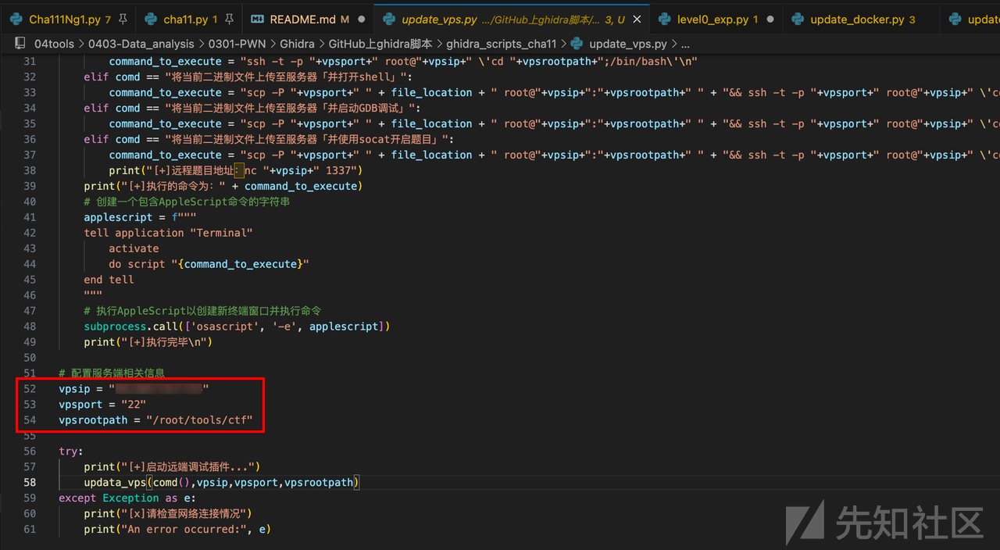](https://xzfile.aliyuncs.com/media/upload/picture/20240224003826-f7ab265a-d269-1.png)

### 运行效果

[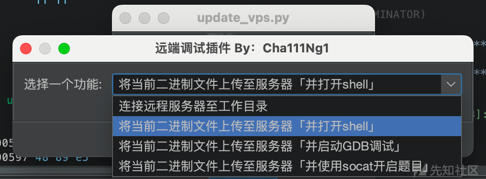](https://xzfile.aliyuncs.com/media/upload/picture/20240224003834-fcc5fc96-d269-1.png)

# Ghidra 自动化分析

敬请期待...

- - -

# 拓展资料

《GhidraAPI 文档》

《Ghidra 之 什么？为啥你的 Ghidra 是 Python3》：[https://mp.weixin.qq.com/s/c8LMwNIK3CEVDA3FJo-lLg](https://mp.weixin.qq.com/s/c8LMwNIK3CEVDA3FJo-lLg)

《Ghidra 之 什么？你的 M1 为啥可以 gdb》：[https://mp.weixin.qq.com/s/jMFMYB1aZaljZ\_HtKZxPKg](https://mp.weixin.qq.com/s/jMFMYB1aZaljZ_HtKZxPKg)
