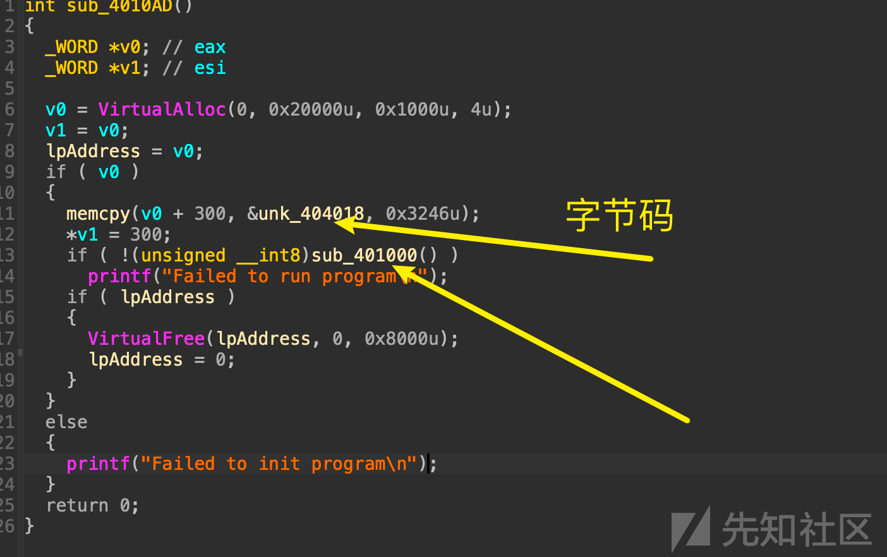

# HTC CTF 国际赛-RE 题目复现 - 先知社区

HTC CTF 国际赛-RE 题目复现

- - -

国际内部赛，一共 4 道题，总结其中两道，剩下的比较简单

# IDA 条件断点的妙用，z3 突破复杂运算

不知道你是否使用过 IDA 的条件断点呢？在 IDA 进阶使用中，它的很多功能都有大作用，比如：ida-trace 来跟踪调用流程。同时 IDA 的断点功能也十分强大，配合 IDA-python 的输出语句能够大杀特杀！  
那么本文就介绍一下这个功能点，并附带习题，使用 z3 来秒解题目。  
条件断点  
什么是条件断点呢？  
条件断点（Conditional Breakpoint）是一种在代码调试过程中设置的断点，它可以根据特定的条件暂停程序的执行。当程序执行到设置了条件断点的代码行时，如果该条件为真，则程序会暂停执行；如果该条件为假，则程序会继续执行。这种调试技术常用于复杂的程序调试，能够帮助程序员更快地发现程序中的错误，并提高调试的效率。条件断点可以应用于多种编程语言和开发环境中，如 C++、Java、Python 等。  
与普通的断点大差不差，不同点在于，程序运行到条件断点处时，不会让程序暂停，而是继续执行，并执行我们设置好的脚本。  
接下来让我们分析这道题目

## 初次分析

### main 函数

flag 的格式

[](https://xzfile.aliyuncs.com/media/upload/picture/20240201202747-4ee34f20-c0fd-1.png)  
打开 main 函数，发现使用了 SIMD 指令赋值了一些关键数据

[](https://xzfile.aliyuncs.com/media/upload/picture/20240201202757-54a112da-c0fd-1.png)  
继续分析

[](https://xzfile.aliyuncs.com/media/upload/picture/20240201202805-59b70428-c0fd-1.png)  
看来 cry1 和 cry2 是很关键的函数  
密文：

[](https://xzfile.aliyuncs.com/media/upload/picture/20240201202819-618b72d8-c0fd-1.png)

### cry1

发现对我们的输入 flag，进行一些转换：  
比如：位置顺序和对我们的 flag 异或一个固定的值。  
异或的值是由上下文决定的，但是总是单字节固定

[](https://xzfile.aliyuncs.com/media/upload/picture/20240201202837-6c49632e-c0fd-1.png)  
将输入的 flag 运算完后，转换为 一个 int 类型的矩阵

[](https://xzfile.aliyuncs.com/media/upload/picture/20240201202847-725249c0-c0fd-1.png)  
初次分析到此结束

### cry2

[](https://xzfile.aliyuncs.com/media/upload/picture/20240201202903-7bfa964e-c0fd-1.png)

[](https://xzfile.aliyuncs.com/media/upload/picture/20240201202909-7f6db360-c0fd-1.png)

## 条件断点妙用

经过动调，我发现关键的加密就这三个汇编指令。  
意思：取 flag->与一个固定的矩阵相乘->输出加密之后的矩阵  
如果我们能够打印，加密前的 flag 和相乘的矩阵元素，就可以逆推明文啦  
主要是不清楚，矩阵相乘的顺序，可能是打乱的，那样只能这样来做。  
使用了：条件断点

[](https://xzfile.aliyuncs.com/media/upload/picture/20240201202927-8a35e38a-c0fd-1.png)  
这三个断点依次使用下面 3 个条件输出  
主要是这两个命令：  
get\_reg\_value("rbx") 获取 rbx 寄存器的值  
idc.get\_wide\_dword() 获取某地址的值（4 字节读取）

```plain
print("[rbx] = ",hex(idc.get_wide_dword(get_reg_value("rbx"))))

print("rax = ",hex(get_reg_value("rax")),"[rdi]= ",hex(idc.get_wide_dword(get_reg_value("rdi"))))

print("output，rax = ",hex(get_reg_value("rax")),"\n")
```

[](https://xzfile.aliyuncs.com/media/upload/picture/20240201202951-989973ce-c0fd-1.png)

然后 edit breakpoint

[](https://xzfile.aliyuncs.com/media/upload/picture/20240201203004-a0668b8c-c0fd-1.png)

[](https://xzfile.aliyuncs.com/media/upload/picture/20240201203009-a33e0ab0-c0fd-1.png)  
OK，见证奇迹的时刻到了，运行程序，成功输出：

[](https://xzfile.aliyuncs.com/media/upload/picture/20240201203019-a924f484-c0fd-1.png)

## 推导

因为密文说 16 字节的，我们将真正的密文提取出来和我们输入假 flag 产生的密文也提取出来，进行对比

```plain
密文
unsigned int data[16] = {
    0x00000436, 0x000002B4, 0x000002AF, 0x00000312, 0x000002EA, 0x00000253, 0x0000020A, 0x0000028E, 
    0x000001C6, 0x0000015C, 0x0000017C, 0x0000017A, 0x0000069E, 0x000004AE, 0x000004B1, 0x00000522
};

假 flag 输出的结果密文
unsigned int data[16] = {
    0x00000466, 0x000002F9, 0x00000329, 0x0000046E, 0x00000290, 0x00000184, 0x000001E4, 0x0000023A, 
    0x00000183, 0x000000C1, 0x0000011E, 0x00000122, 0x00000646, 0x00000467, 0x000004F7, 0x000005EA
};

这是根据条件输出得到的规律；

x1*1+x2*5+x3*4+x4*3=0x436
y1*1+y2*5+y3*4+y4*3=0x2B4
z1*1+z2*5+z3*4+z4*3=0x2AF
n1*1+n2*5+n3*4+n4*3=0x312

x1*2+x2*1+x3*2+x4*3=0x2EA
y1*2+y2*1+y3*2+y4*3=0x253
z1*2+z2*1+z3*2+z4*3=0x20A
n1*2+n2*1+n3*2+n4*3=0x28E

x1*2+x2+x3+x4=0x1c6
y1*2+y2+y3+y4=0x15c
z1*2+z2+z3+z4=0x17c
n1*2+n2+n3+n4=0x17a

x1*3+x2*5+x3*4+x4*7=0x69e
y1*3+y2*5+y3*4+y4*7=0x4ae
z1*3+z2*5+z3*4+z4*7=0x4b1
n1*3+n2*5+n3*4+n4*7=0x522
```

[](https://xzfile.aliyuncs.com/media/upload/picture/20240201203043-b773a292-c0fd-1.png)

## z3 解密

解密脚本：

```plain
from z3 import *

# 定义变量
x = [Int(f'x{i}') for i in range(1, 5)]
y = [Int(f'y{i}') for i in range(1, 5)]
z = [Int(f'z{i}') for i in range(1, 5)]
n = [Int(f'n{i}') for i in range(1, 5)]

# 定义目标值
goal = [
    0x466,
    0x2f9,
    0x329,
    0x46e,
    0x290,
    0x184,
    0x1e4,
    0x23a,
    0x183,
    0xc1,
    0x11e,
    0x122,
    0x646,
    0x467,
    0x4f7,
    0x5ea
]

# 定义约束条件
constraints = [
    x[0]*1 + x[1]*5 + x[2]*4 + x[3]*3 == goal[0],
    y[0]*1 + y[1]*5 + y[2]*4 + y[3]*3 == goal[1],
    z[0]*1 + z[1]*5 + z[2]*4 + z[3]*3 == goal[2],
    n[0]*1 + n[1]*5 + n[2]*4 + n[3]*3 == goal[3],
    x[0]*2 + x[1]*1 + x[2]*2 + x[3]*3 == goal[4],
    y[0]*2 + y[1]*1 + y[2]*2 + y[3]*3 == goal[5],
    z[0]*2 + z[1]*1 + z[2]*2 + z[3]*3 == goal[6],
    n[0]*2 + n[1]*1 + n[2]*2 + n[3]*3 == goal[7],
    x[0]*2 + x[1] + x[2] + x[3] == goal[8],
    y[0]*2 + y[1] + y[2] + y[3] == goal[9],
    z[0]*2 + z[1] + z[2] + z[3] == goal[10],
    n[0]*2 + n[1] + n[2] + n[3] == goal[11],
    x[0]*3 + x[1]*5 + x[2]*4 + x[3]*7 == goal[12],
    y[0]*3 + y[1]*5 + y[2]*4 + y[3]*7 == goal[13],
    z[0]*3 + z[1]*5 + z[2]*4 + z[3]*7 == goal[14],
    n[0]*3 + n[1]*5 + n[2]*4 + n[3]*7 == goal[15]
]

# 创建求解器
solver = Solver()

# 添加约束条件
solver.add(constraints)

# 求解
if solver.check() == sat:
    model = solver.model()
    for i in range(1, 5):
        print(f'x{i} = {model[x[i-1]]}')
        print(f'y{i} = {model[y[i-1]]}')
        print(f'z{i} = {model[z[i-1]]}')
        print(f'n{i} = {model[n[i-1]]}')
else:
    print('无解')
```

得到的结果，将其按照数组来填充

[](https://xzfile.aliyuncs.com/media/upload/picture/20240201203113-c9a77e3e-c0fd-1.png)  
得到

```plain
这是真 flag 解密后的结果：
x1 = 100
y1 = 89
z1 = 119
n1 = 92

x2 = 66
y2 = 5
z2 = 69
n2 = 4

x3 = 84
y3 = 83
z3 = 4
n3 = 104

x4 = 104
y4 = 82
z4 = 69
n4 = 86

100,89,119,92,66,5,69,4,84,83,4,104,104,82,69,86

这是假 flag 解密后的结果：
x1 = 60
y1 = 1
z1 = 47
n1 = 4

x2 = 88
y2 = 87
z2 = 86
n2 = 95

x3 = 89
y3 = 13
z3 = 14
n3 = 94
x4 = 90
y4 = 91
z4 = 92
n4 = 93

60,1,47,4,88,87,86,95,89,13,14,94,90,91,92,93
```

按照我的思路来填充结果数组；

[](https://xzfile.aliyuncs.com/media/upload/picture/20240201203138-d8531df8-c0fd-1.png)

因为刚才说了，异或的值不清楚，但是一直为单字节固定值，所以使用 Cybe 的爆破功能。  
根据程序的验证功能可知，flag 以 Sn@K 开头，所以找到了真正的 flag  
但是顺序发生了变化，下面是假 flag 生成密文解密之后的结果，发现密文变化了

```plain
Sn@ku2r3cd3__era
Sn@k78906ba15432

Sn@k0123456789ab
经过交换后的结果：
Sn@k78906ba15432

按照我们构造的 flag 交换顺序后的字符串来恢复
恢复
Sn@k3_are_cu2r3
```

[](https://xzfile.aliyuncs.com/media/upload/picture/20240201203200-e568c60a-c0fd-1.png)  
成功验证！

[](https://xzfile.aliyuncs.com/media/upload/picture/20240201203210-eb591e66-c0fd-1.png)

# NOR-Machine 小型虚拟机逆向

## NOR-CPU 介绍

该题采用了老外的 NOR 虚拟机思想  
用一条指令来实现其他各种复杂的加密，虽然项目已经 12 年 ago，但是思想却值得我们学习，深刻理解二进制。

[](https://xzfile.aliyuncs.com/media/upload/picture/20240129163642-8733a65a-be81-1.png)  
正如作者的宣言：

```plain
Build a CPU with Only One Instruction
```

[https://github.com/yuan-xy/NOR-CPU](https://github.com/yuan-xy/NOR-CPU)

下面介绍一下这种 CPU 如何实现，并附带一个例题来深刻理解，相信读完对你一定会有帮助。

NOR 是作者定义的位运算符，它的运算如下：

```plain
===== ========
         Input  Output
         ===== ========
          A B  A NOR B
         ----- --------
          0 0     1
          0 1     0
          1 0     0
          1 1     0
         ===== ========
```

其他的位运算，都能用 NOR 指令来实现：

```plain
NOT(a) = NOR(a, a)
AND(a, b) = NOT(OR(NOT(a), NOT(b)))
OR(a, b) = NOT(NOR(a, b))
XOR(a, b) = OR(AND(a, NOT(b)), AND(NOT(a), b)))
```

当然其他位运算，也能实现 NOR 指令

```plain
NOR(a, b) = NOT(OR(a, b))
```

我们了解了最根本的运算后，接下来定义 CPU 的地址、寄存器和段相关信息  
我们将有一个 2^16（65536 或 0xFFFF）个单元的线性存储器组织  
有效地址范围从 0（0x0000）到 65535（0xFFFF），每个地址 16 位。  
不像 RISC 和 CISC 类架构，NOR-CPU 没有像他们那样复杂的指令组成，比如：opcode 和操作码的区分。  
因为 NOR-CPU 只有一个指令 NOR  
我们的指令将只包含三个参数-NOR 的参数。每个指令将驻留在存储器中的三个连续单元中。

```plain
mem[mem[IP + 2]] = NOR(mem[mem[IP + 0]], mem[mem[IP + 1]])
```

有 3 个段：寄存器段、数据段和代码段

```plain
mem[0], mem[1], mem[2], mem[3], ..., mem[65534], mem[65535]
                 IP , SHIFT_REG, REG0,   Code segment ..., Data segment ...
```

IP 寄存器：用于指向当前正在执行的地址，用线性地址 0 表示  
SHIFT\_REG 寄存器：与 NOR 运行息息相关，该寄存器将包含最后一次向左循环移位的 NOR 运算的结果。用线性地址 1 表示  
REG0 寄存器：存储临时值，用线性地址 2 表示  
REGn 寄存器：后续的寄存器按需扩展，用线性地址 n 表示

```plain
NOR-CPU 运行和文件时的状态有区别吗？
The memory layout and the object file layout is exactly the same.
```

so 我们的理论介绍完了，如何实现呢，又如何运行呢？  
使用 Ruby 语言表示基本骨架

```plain
def nor(a, b)
  ~(a | b) & 0xFFFF
end
while true do
  i = mem[IP]
  a = mem[i + 0] 
  b = mem[i + 1] 
  r = mem[i + 2] 
  mem[ip] = i + 3
  f = nor(mem[a], mem[b]) 
  mem[r] = f
end
```

更详细的可以去 GitHub 找一下这个项目，本文就不浪费太多篇幅来介绍啦，总之这是一个强大又有意思的 CPU 构建想法。

## 实战演示

这是一道使用 NOR-Machine 实现的 CTF 题目，main 函数只是作为虚拟机初始化函数

[](https://xzfile.aliyuncs.com/media/upload/picture/20240129163931-ec0cea82-be81-1.png)

跟进 VM 运行函数：sub\_401000

```plain
int sub_71000()
{
  unsigned __int16 *mem; // ebx
  int result; // eax
  int id; // edx
  int arg1; // ecx
  int arg0; // esi
  int arg2; // edi

  mem = (unsigned __int16 *)lpAddress;
  for ( result = 1; *mem != 0xFFFF; result = 1 )
  {
    if ( mem[4] == 1 )
    {
      mem[4] = 0;
      printf("%c", mem[3]);
      mem = (unsigned __int16 *)lpAddress;
    }
    if ( mem[6] == 1 )
    {
      mem[6] = 0;
      scanf("%c", mem + 5);
      mem = (unsigned __int16 *)lpAddress;
    }
    id = *mem;
    arg1 = mem[id + 1];
    arg0 = mem[id];
    arg2 = mem[id + 2];
    *mem = id + 3;
    LOWORD(arg1) = ~(mem[arg0] | mem[arg1]);
    mem[arg2] = arg1;
    mem[1] = __ROL2__(arg1, 1);
  }
  return result;
}
```

一看就是 VM 类型，使用脚本来提取，然后逆向字节码

[](https://xzfile.aliyuncs.com/media/upload/picture/20240129164002-fe541e5e-be81-1.png)  
这是 opcode，字节码

```plain
a = [64, 26, 64, 26, 7, 0, 7, 0, 7, 0, 3, ...] # Bytecode in the PE file
li = []
mem = [0] * 300
mem[0] = 300
num = 0

def rol1(x):
    return ((x << 1) + (((1 << 15) & x) >> 15)) & 0xffff

for i in range(0, len(a), 2):
    li.append((a[i+1] << 8) + a[i])
mem += li
mem += [0] * 100000

k = 'a' * 26

for i in range(0, len(li), 3):
    if mem[4] == 1:
        mem[4] = 0
        print(chr(mem[3]))
    if mem[6] == 1:
        mem[6] = 0
        mem[5] = ord(k[num])
        num += 1
        print('mem[5] <-- inp')
    try:
        id = mem[0]
        arg1 = mem[id + 1]
        arg0 = mem[id]
        arg2 = mem[id + 2]
        mem[0] = id + 3
        temp = arg1
        arg1 = ~(mem[arg0] | mem[arg1]) & 0xffff
        mem[arg2] = arg1
        mem[1] = rol1(arg1)
        print('mem[{}] <-- ~(mem[{}] ({}) | mem[{}]) ({}) (Val = {}, id = {}, {})'.format(hex(arg2), hex(arg0), hex(mem[arg0]), hex(temp), hex(mem[temp]), hex(arg1), id, hex(id)))

    except Exception as e:
        print(e)
        print(hex(arg0), hex(arg1), hex(arg2))
        exit(0)
```

得到输出

```plain
...
mem[5] <-- inp    # 26th input character
mem[0x7] <-- ~(mem[0x5] (0x61) | mem[0x5]) (0x61) (Val = 0xff9e, id = 1009, 0x3f1)
mem[0x1a3c] <-- ~(mem[0x7] (0xff9e) | mem[0x7]) (0xff9e) (Val = 0x61, id = 1012, 0x3f4)
mem[0x7] <-- ~(mem[0x3fd] (0x400) | mem[0x3fd]) (0x400) (Val = 0xfbff, id = 1015, 0x3f7)
mem[0x0] <-- ~(mem[0x7] (0xfbff) | mem[0x7]) (0xfbff) (Val = 0x400, id = 1018, 0x3fa)
mem[0x3fe] <-- ~(mem[0x1a23] (0x61) | mem[0x1a23]) (0x61) (Val = 0xff9e, id = 1024, 0x400)
mem[0x3ff] <-- ~(mem[0x1a0e] (0x57) | mem[0x1a0e]) (0x57) (Val = 0xffa8, id = 1027, 0x403)
mem[0x7] <-- ~(mem[0x40c] (0x40f) | mem[0x40c]) (0x40f) (Val = 0xfbf0, id = 1030, 0x406)
mem[0x0] <-- ~(mem[0x7] (0xfbf0) | mem[0x7]) (0xfbf0) (Val = 0x40f, id = 1033, 0x409)
mem[0x40d] <-- ~(mem[0x1a23] (0x61) | mem[0x1a23]) (0x61) (Val = 0xff9e, id = 1039, 0x40f)
mem[0x40e] <-- ~(mem[0x3ff] (0xffa8) | mem[0x3ff]) (0xffa8) (Val = 0x57, id = 1042, 0x412)
mem[0x7] <-- ~(mem[0x40d] (0xff9e) | mem[0x40e]) (0x57) (Val = 0x20, id = 1045, 0x415)
mem[0x7] <-- ~(mem[0x7] (0xffdf) | mem[0x7]) (0xffdf) (Val = 0xffdf, id = 1048, 0x418)
mem[0x3ff] <-- ~(mem[0x7] (0xffdf) | mem[0x7]) (0xffdf) (Val = 0x20, id = 1051, 0x41b)
mem[0x7] <-- ~(mem[0x424] (0x427) | mem[0x424]) (0x427) (Val = 0xfbd8, id = 1054, 0x41e)
mem[0x0] <-- ~(mem[0x7] (0xfbd8) | mem[0x7]) (0xfbd8) (Val = 0x427, id = 1057, 0x421)
mem[0x425] <-- ~(mem[0x1a0e] (0x57) | mem[0x1a0e]) (0x57) (Val = 0xffa8, id = 1063, 0x427)
mem[0x426] <-- ~(mem[0x3fe] (0xff9e) | mem[0x3fe]) (0xff9e) (Val = 0x61, id = 1066, 0x42a)
mem[0x7] <-- ~(mem[0x425] (0xffa8) | mem[0x426]) (0x61) (Val = 0x16, id = 1069, 0x42d)
mem[0x7] <-- ~(mem[0x7] (0xffe9) | mem[0x7]) (0xffe9) (Val = 0xffe9, id = 1072, 0x430)
mem[0x3fe] <-- ~(mem[0x7] (0xffe9) | mem[0x7]) (0xffe9) (Val = 0x16, id = 1075, 0x433)
mem[0x7] <-- ~(mem[0x3fe] (0x16) | mem[0x3ff]) (0x20) (Val = 0xffc9, id = 1078, 0x436)
mem[0x1a0d] <-- ~(mem[0x7] (0xffc9) | mem[0x7]) (0xffc9) (Val = 0x36, id = 1081, 0x439)
mem[0x7] <-- ~(mem[0x1a0d] (0x36) | mem[0x1ee]) (0x0) (Val = 0xffc9, id = 1084, 0x43c)
mem[0x1ee] <-- ~(mem[0x7] (0xffc9) | mem[0x7]) (0xffc9) (Val = 0x36, id = 1087, 0x43f)
...
```

0x1ee 处就像在检查一个标志  
如果输入的 flag 正确，会将其置为 0，否则就是非零，修改一下脚本

```plain
a = [64, 26, 64, 26, 7, 0, 7, 0, 7, 0, 3, ...] #字节码
li = []
mem = [0] * 300
mem[0] = 300
num = 0def rol1(x):
    return ((x << 1) + (((1 << 15) & x) >> 15)) & 0xfffffor i in range(0, len(a), 2):
    li.append((a[i+1] << 8) + a[i])
mem += li
mem += [0] * 100000for t in range(256):
    mem = [0] * 300
    mem[0] = 300
    num = 0for i in range(0, len(a), 2):
        li.append((a[i + 1] << 8) + a[i])
    mem += li
    mem += [0] * 100000# Change these values to bruteforce each char# ===========================================
    k = list("a" * 26)
    k[0] = chr(t)
    modifiedID = 0x43f  # modifiedID is the line number that it modifies the value at 0x1ee.# For example this is the set that I bruteforce the first char. I'm too lazy to write a script that can bruteforce all character at one time :p# ===========================================for i in range(0, len(li), 3):
        if mem[4] == 1:
            mem[4] = 0# print(chr(mem[3]))if mem[6] == 1:
            mem[6] = 0
            mem[5] = ord(k[num])
            num += 1# print('mem[5] <-- inp')try:
            id = mem[0]
            arg1 = mem[id + 1]
            arg0 = mem[id]
            arg2 = mem[id + 2]
            mem[0] = id + 3
            temp = arg1
            arg1 = ~(mem[arg0] | mem[arg1]) & 0xffff
            mem[arg2] = arg1
            mem[1] = rol1(arg1)
            # print('mem[{}] <-- ~(mem[{}] ({}) | mem[{}]) ({}) (Val = {}, id = {}, {})'.format(hex(arg2), hex(arg0), hex(mem[arg0]), hex(temp), hex(mem[temp]), hex(arg1), id, hex(id)))if id == modifiedID:
                if mem[0x1a0d] == 0:
                    print(chr(t))
                breakexcept Exception as e:
            print(e)
            print(hex(arg0), hex(arg1), hex(arg2))
            exit(0)
```

得到 flag：

```plain
flag{WE1rd_v1R7UaL_M@chINE_Ev3R}
```

感谢阅读～
