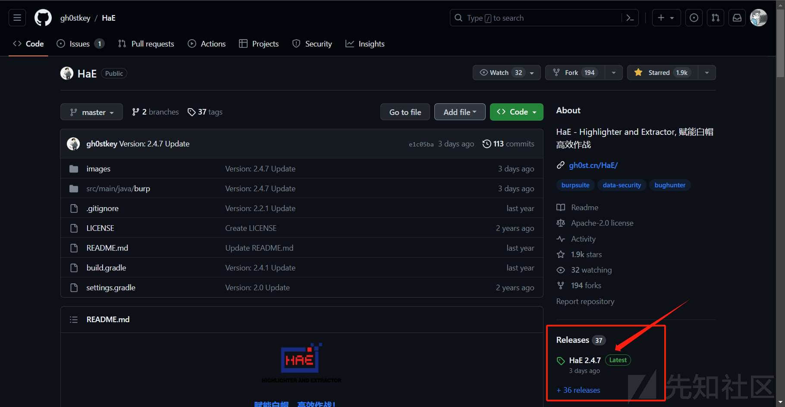
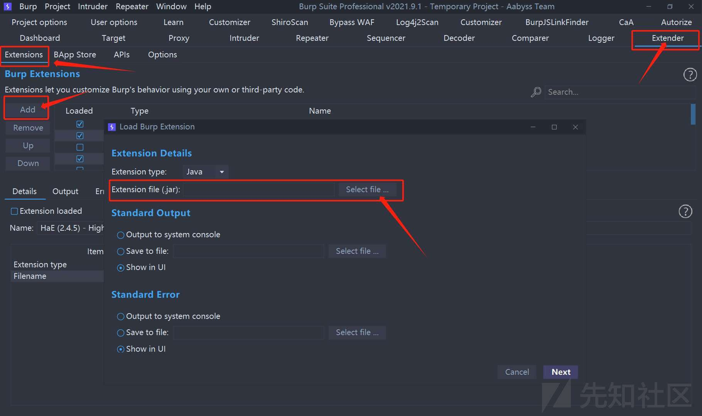
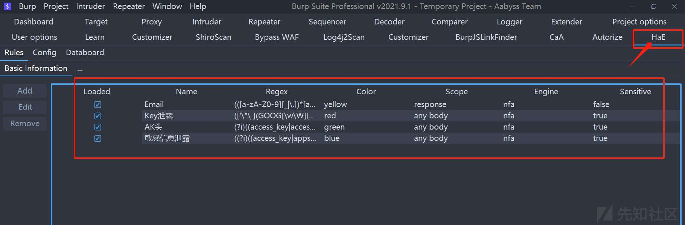
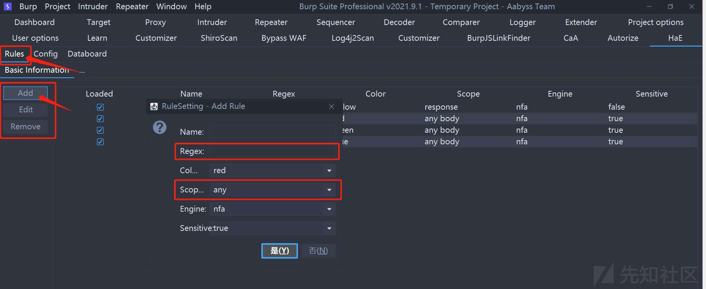
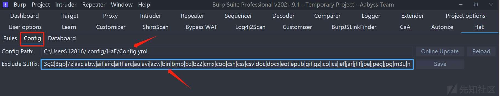
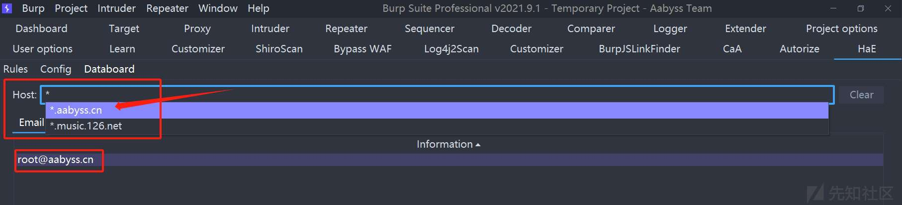

# HaE 入门到精通：三条影响你一生的 HaE 规则 - 先知社区

HaE 入门到精通：三条影响你一生的 HaE 规则

- - -

# 0# 概述

最近一段时间项目也比较多，再加上最近还在维护开源项目，所以挺忙的。  
乘着国庆时间，好好放松一下，顺便借着国庆期间更新一下自己许久未更新的博客哈哈~  
本篇文章，我们将深入学习著名 BurpSuite 工具的插件 `HaE` 的使用和拓展，希望这三条影响你一生的 HaE 规则能给你带来帮助~

[](https://xzfile.aliyuncs.com/media/upload/picture/20240213091324-15b792ec-ca0d-1.jpg)

在此，祝各位师傅们国庆节快乐！！！为国之安全而奋斗，为信息安全而发声！

# 1# HaE 介绍

`HaE` 是基于 BurpSuite Java 插件 API 开发的请求高亮标记与信息提取的辅助型框架式插件，该插件可以通过自定义正则的方式匹配响应报文或请求报文，并对满足正则匹配的报文进行信息高亮与提取。

现代化 Web 应用走上前后端分离开发模式，这就导致在日常测试时候会有许多的流量，如果你想要尽可能全面的对一个 Web 应用进行测试评估，将花费大量精力浪费在无用的报文上；HaE 的出现正是为了解决这一类似场景，借助 HaE 你可以有效的减少测试的时间，将更多的精力放在有价值、有意义的报文上，提高漏洞挖掘效率。

开源地址：[https://github.com/gh0stkey/HaE](https://github.com/gh0stkey/HaE)

## 1.1# 如何装载 HaE？

首先，先访问 Github 开源项目地址，下载打包好的 Release

[](https://xzfile.aliyuncs.com/media/upload/picture/20240213091357-29547ec8-ca0d-1.jpg)

然后打开 BurpSuite，选择 `Extender` -> `Extensions` -> `Add` -> `Select File`

[](https://xzfile.aliyuncs.com/media/upload/picture/20240213091404-2de0fef8-ca0d-1.jpg)

选择你刚才下载的 `HaE.jar` 文件后，点击 `Next`，就安装成功了，接下来面板里面会多出来一个 `HaE` 的标签页

[](https://xzfile.aliyuncs.com/media/upload/picture/20240213091413-33455632-ca0d-1.jpg)

默认是会自带一条名为 `Email` 的正则匹配（用来匹配数据包中是否有符合 Email 格式的数据，如果有，自动给相应的数据包标记上颜色）

## 1.2# 如何使用 HaE？

我看很多人写 HaE 的使用，都是草草带过，包括我刚开始使用，也是对它的使用一脸懵逼，那今天我们就好好掰扯掰扯

HaE 主要由三块部分组成：

-   Rules（规则信息管理）：管理匹配特定信息的正则表达式
-   Config（配置信息管理）：配置文件和忽略后缀名的管理
-   Databoard（数据集合面板）：对匹配到的信息进行集中查询和管理

先说 `Rules` 规则信息管理，我们点击 `Add` ，界面如下：

[](https://xzfile.aliyuncs.com/media/upload/picture/20240213091423-38d2164e-ca0d-1.jpg)

通过左侧的三个按钮 `Add`/`Edit`/`Remove` 可以对正则条目进行添加、编辑、删除  
在点击 `Add` 添加后，会弹出一个窗口，填写信息如下：

-   Name：规则名字，建议啥规则就起啥名，后期不会搞混
-   Regex：正则匹配式，填入需要匹配数据的正则表达式【由于 Java 正则表达式的库并没有 Python 的优雅或方便，在使用正则的，HaE 要求使用者必须使用 `()` 将所需提取的表达式内容包含；例如你要匹配一个 Shiro 应用的响应报文，正常匹配规则为 `rememberMe=delete`，如果你要提取这段内容的话就需要变成`(rememberMe=delete)`】
-   Color：颜色，选择匹配成功的数据包条目显示的颜色
-   Scope：匹配数据包的哪部分内容，`header` 就是数据包头部，`body` 就是数据包实体内容，`response` 就是响应数据包，`request` 就是请求数据包
-   Engine：正则引擎，`NFA` 和 `DFA`的具体信息可看这篇文章： [https://blog.csdn.net/weixin\_43541528/article/details/123790687](https://blog.csdn.net/weixin_43541528/article/details/123790687)
-   Sensitive：该正则匹配式是否对匹配的数据大小写敏感

再说 `Config` 配置信息管理，界面如下：

[](https://xzfile.aliyuncs.com/media/upload/picture/20240213091444-45ab9d22-ca0d-1.jpg)

主要是两条内容：

-   Config Path：配置文件的存储路径（一般不需要改）
-   Exclude Suffix：排除后缀，对相关后缀名的数据内容进行排除

接着说 `Databoard` 数据集合面板，界面如下：

[](https://xzfile.aliyuncs.com/media/upload/picture/20240213091453-4aeab0c0-ca0d-1.jpg)

当 `HaE` 插件捕获到匹配正则表达式的数据包后，可以在 `Databoard` 数据集合面板里面直接查询捕获到的相关数据内容，省去一个个翻找数据包内容的烦恼

# 2# 为 AccessKey 补充 HaE 规则

之前我在 `TWiki` 上发表过一篇文章： [云业务 AccessKey 标识特征整理](https://wiki.teamssix.com/CloudService/more/)  
该文章获得了不少朋友的关注，具体可以点击以上链接查看

但我在文章里面的正则表达式，无法直接用在 `HaE` 插件当中  
和 `HaE` 插件的开发者 `@key` 师傅沟通过后，我明白了问题所在  
和黑暗的大门内部群的 `@sky` 师傅研究了一下，把完善好的正则规则放出来：

## 2.1# 亚马逊云

```plain
(AKIA[A-Za-z0-9]{16})
```

## 2.2# Google Cloud

```plain
(GOOG[\w\W]{10,30})
```

## 2.3# Microsoft Azure

```plain
(AZ[A-Za-z0-9]{34,40}$)
```

## 2.4# IBM Cloud

```plain
(IBM[A-Za-z0-9]{10,40})
```

或者是以下规则：

```plain
([a-zA-Z0-9]{8}(-[a-zA-Z0-9]{4}){3}-[a-zA-Z0-9]{12}$)
```

## 2.5# Oracle Cloud

```plain
(OCID[A-Za-z0-9]{10,40})
```

## 2.6# 阿里云

```plain
(LTAI[A-Za-z0-9]{12,20})
```

## 2.7# 腾讯云

```plain
(AKID[A-Za-z0-9]{13,20})
```

## 2.8# 华为云

```plain
(AK[\w\W]{10,62})
```

或者是以下规则：

```plain
([A-Z0-9]{20}$)
```

## 2.9# 百度云

```plain
(AK[A-Za-z0-9]{10,40})
```

## 2.10# 京东云

```plain
(JDC_[A-Z0-9]{28,32})
```

## 字节跳动火山引擎

```plain
(AKLT[a-zA-Z0-9-_]{0,252})
```

## 2.11# UCloud

```plain
(UC[A-Za-z0-9]{10,40})
```

## 2.12# 青云

```plain
(QY[A-Za-z0-9]{10,40})
```

## 2.13# 金山云

```plain
(AKLT[a-zA-Z0-9-_]{16,28})
```

## 2.14# 联通云

```plain
(LTC[A-Za-z0-9]{10,60})
```

## 2.15# 移动云

```plain
(YD[A-Za-z0-9]{10,60})
```

## 2.16# 电信云

```plain
(CTC[A-Za-z0-9]{10,60})
```

## 2.17# 一云通

```plain
(YYT[A-Za-z0-9]{10,60})
```

## 2.18# 用友云

```plain
(YY[A-Za-z0-9]{10,40})
```

## 2.19# 南大通用云

```plain
(CI[A-Za-z0-9]{10,40})
```

## 2.20# G-Core Labs

```plain
(gcore[A-Za-z0-9]{10,30})
```

你以为这样就结束里了吗？NoNoNo

# 3# 三条影响你一生的 HaE 规则

上面只是开胃小菜，和朋友 `@NaTsUk0` 一起研究了一下，又写出三条集合的规则：

AccessKey 泄露匹配式 1：

```plain
((?i)((access_key|access_token|admin_pass|admin_user|algolia_admin_key|algolia_api_key|alias_pass|alicloud_access_key|amazon_secret_access_key|amazonaws|ansible_vault_password|aos_key|api_key|api_key_secret|api_key_sid|api_secret|api.googlemaps AIza|apidocs|apikey|apiSecret|app_debug|app_id|app_key|app_log_level|app_secret|appkey|appkeysecret|application_key|appsecret|appspot|auth_token|authorizationToken|authsecret|aws_access|aws_access_key_id|aws_bucket|aws_key|aws_secret|aws_secret_key|aws_token|AWSSecretKey|b2_app_key|bashrc password|bintray_apikey|bintray_gpg_password|bintray_key|bintraykey|bluemix_api_key|bluemix_pass|browserstack_access_key|bucket_password|bucketeer_aws_access_key_id|bucketeer_aws_secret_access_key|built_branch_deploy_key|bx_password|cache_driver|cache_s3_secret_key|cattle_access_key|cattle_secret_key|certificate_password|ci_deploy_password|client_secret|client_zpk_secret_key|clojars_password|cloud_api_key|cloud_watch_aws_access_key|cloudant_password|cloudflare_api_key|cloudflare_auth_key|cloudinary_api_secret|cloudinary_name|codecov_token|config|conn.login|connectionstring|consumer_key|consumer_secret|credentials|cypress_record_key|database_password|database_schema_test|datadog_api_key|datadog_app_key|db_password|db_server|db_username|dbpasswd|dbpassword|dbuser|deploy_password|digitalocean_ssh_key_body|digitalocean_ssh_key_ids|docker_hub_password|docker_key|docker_pass|docker_passwd|docker_password|dockerhub_password|dockerhubpassword|dot-files|dotfiles|droplet_travis_password|dynamoaccesskeyid|dynamosecretaccesskey|elastica_host|elastica_port|elasticsearch_password|encryption_key|encryption_password|env.heroku_api_key|env.sonatype_password|eureka.awssecretkey)[a-z0-9_ .\-,]{0,25})(=|>|:=|\|\|:|<=|=>|:).{0,5}['\"\ ]([0-9a-zA-Z\-_=]{8,64})['\"\ ])
```

AccessKey 泄露匹配式 2：

```plain
(['\"\ ](GOOG[\w\W]{10,30})['\"\ ]|(['\"\ ]AZ[A-Za-z0-9]{34,40}['\"\ ])|(['\"\ ]AKID[A-Za-z0-9]{13,20}['\"\ ])|(['\"\ ]AKIA[A-Za-z0-9]{16}['\"\ ])|(['\"\ ][a-zA-Z0-9]{8}(-[a-zA-Z0-9]{4}){3}-[a-zA-Z0-9]{12}['\"\ ])|(['\"\ ]OCID[A-Za-z0-9]{10,40}['\"\ ])|(['\"\ ]LTAI[A-Za-z0-9]{12,20}['\"\ ])|(['\"\ ][A-Z0-9]{20}$['\"\ ])|(['\"\ ]JDC_[A-Z0-9]{28,32}['\"\ ])|(['\"\ ]AK[A-Za-z0-9]{10,40}['\"\ ])|(['\"\ ]UC[A-Za-z0-9]{10,40}['\"\ ])|(['\"\ ]QY[A-Za-z0-9]{10,40}['\"\ ])|(['\"\ ]AKLT[a-zA-Z0-9-_]{16,28}['\"\ ])|(['\"\ ]LTC[A-Za-z0-9]{10,60}['\"\ ])|(['\"\ ]YD[A-Za-z0-9]{10,60}['\"\ ])|(['\"\ ]CTC[A-Za-z0-9]{10,60}['\"\ ])|(['\"\ ]YYT[A-Za-z0-9]{10,60}['\"\ ])|(['\"\ ]YY[A-Za-z0-9]{10,40}['\"\ ])|(['\"\ ]CI[A-Za-z0-9]{10,40}['\"\ ])|(['\"\ ]gcore[A-Za-z0-9]{10,30}['\"\ ]))
```

敏感信息泄漏匹配式：

```plain
((?i)((access_key|appsecret|app_secret|access_token|password|secretkey|accesskey|accesskeyid|accesskeysecret|secret_key|pwd|test_user|admin_pass|admin_user|algolia_admin_key|algolia_api_key|alias_pass|alicloud_access_key|amazon_secret_access_key|amazonaws|ansible_vault_password|aos_key|api_key|api_key_secret|api_key_sid|api_secret|api.googlemaps AIza|apidocs|apikey|apiSecret|app_debug|app_id|app_key|app_log_level|app_secret|appkey|appkeysecret|application_key|appsecret|appspot|auth_token|authorizationToken|authsecret|aws_access|aws_access_key_id|aws_bucket|aws_key|aws_secret|aws_secret_key|aws_token|AWSSecretKey|b2_app_key|bashrc password|bintray_apikey|bintray_gpg_password|bintray_key|bintraykey|bluemix_api_key|bluemix_pass|browserstack_access_key|bucket_password|bucketeer_aws_access_key_id|bucketeer_aws_secret_access_key|built_branch_deploy_key|bx_password|cache_driver|cache_s3_secret_key|cattle_access_key|cattle_secret_key|certificate_password|ci_deploy_password|client_secret|client_zpk_secret_key|clojars_password|cloud_api_key|cloud_watch_aws_access_key|cloudant_password|cloudflare_api_key|cloudflare_auth_key|cloudinary_api_secret|cloudinary_name|codecov_token|config|conn.login|connectionstring|consumer_key|consumer_secret|credentials|cypress_record_key|database_password|database_schema_test|datadog_api_key|datadog_app_key|db_password|db_server|db_username|dbpasswd|dbpassword|dbuser|deploy_password|digitalocean_ssh_key_body|digitalocean_ssh_key_ids|docker_hub_password|docker_key|docker_pass|docker_passwd|docker_password|dockerhub_password|dockerhubpassword|dot-files|dotfiles|droplet_travis_password|dynamoaccesskeyid|dynamosecretaccesskey|elastica_host|elastica_port|elasticsearch_password|encryption_key|encryption_password|env.heroku_api_key|env.sonatype_password|eureka.awssecretkey)[a-z0-9_.]{0,25})(=|>|:=|:|<=|=>|:).{0,5}['\"\ ]([0-9a-zA-Z-_=]{12,64})['\"\ ])
```

希望这三条 `HaE` 规则能帮助到你~

# 4# 总结

随着企业上云和云业务的上升趋势和业务指向性，在日常的渗透测试过程中，Web 暴露面的敏感信息泄露频率和利用姿势越来越多，利用 `HaE` 插件，可快速从 BurpSuite 接受的数据包当中匹配出对应的敏感信息，能更快将目标“斩于马下”

本篇主要分享了 `HaE` 插件的使用和相关规则的拓展，如果师傅们有更好、更新的 `HaE` 插件规则，欢迎和我交流和学习哈哈~
