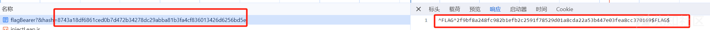

# Hacker101 CTF Android challenges write up（一） - 先知社区

Hacker101 CTF Android challenges write up（一）

- - -

#### 本文是关于 Hacker101 CTF 中 Android 题的 wp 以及自己的一些思路

-   [Hacker101](https://www.hacker101.com/ "Hacker101")是一个免费的网络安全学习网站，由[HackerOne](https://www.hackerone.com/ "HackerOne")负责。HackerOne 相当于国外有名的 src 平台，有能力的师傅可以去看看。

### H1 Thermostat

-   下载下来是个挺小的 apk，看题目名好像是个温度计，提示有两处 flag。先安装一下，由下图可以看出有个温度显示面板，下面可以用加减或者拖动来调节温度。通过这看不出来什么，拖入 Jadx 查看代码逻辑。  
    [](https://xzfile.aliyuncs.com/media/upload/picture/20240127101112-5804d8aa-bcb9-1.png)
-   从 amf.xml 图可以看出，只有 ThermostatActivity 一个 Activity 被定义，这里就只看这一个 Activity 即可。  
    [](https://xzfile.aliyuncs.com/media/upload/picture/20240127103404-89acf844-bcbc-1.png)
-   首先，分析 ThermostatActivity，并没有发现什么和 flag 有关的代码。接着搜索 flag，看看能不能从关键词中找出点线索。由于 flag 关键词还是比较多的，尤其是其他包中，这里需要检索一下，主要找 com.hacker101.level11 目录下的，结果找到下图中的两个线索。  
    [](https://xzfile.aliyuncs.com/media/upload/picture/20240127104719-6388e860-bcbe-1.png)
-   跟入 PayloadRequest 函数，接收一个 JSON 对象作为参数，生成有效载荷，并设置请求的参数和头部信息。请求的 URL 是固定的，错误监听器会在请求失败时返回特定的错误信息。
    
    ```plain
    public PayloadRequest(JSONObject jSONObject, final Response.Listener<String> listener) throws Exception {
          super(1, "https://d7299d*****4704859cc2cc8382.ctf.hacker101.com/", new Response.ErrorListener() { // from class: com.hacker101.level11.PayloadRequest.1
              @Override // com.android.volley.Response.ErrorListener
              public void onErrorResponse(VolleyError volleyError) {
                  Response.Listener.this.onResponse("Connection failed");
              }
          });
          this.mListener = listener;
          this.mParams = new HashMap<>();
          String buildPayload = buildPayload(jSONObject);
          this.mParams.put("d", buildPayload);
          this.mHeaders = new HashMap<>();
          MessageDigest messageDigest = MessageDigest.getInstance("MD5");
          messageDigest.update("^FLAG^911074676b0d1ed58ba09ca5755930daf7266886bbcf32ca8f785f6e5c631eb9$FLAG$".getBytes());
          messageDigest.update(buildPayload.getBytes());
          this.mHeaders.put("X-MAC", Base64.encodeToString(messageDigest.digest(), 0));
          this.mHeaders.put("X-Flag", "^FLAG^ab34de7822af3f9f75b311e0dcca2d1db34b5e63aa4fbb7386696a547405405a$FLAG$");}
    ```
    
-   然后看一下该函数的引用，在中有对此函数的引用，那关键点应该就在这了。  
    [](https://xzfile.aliyuncs.com/media/upload/picture/20240127110505-ded359ae-bcc0-1.png)
    -   setDefaults 函数，这个方法用于设置默认值。它首先将目标温度和当前温度设置为特定的值，然后创建一个包含 "cmd" 键值对的 JSON 对象。接下来，它创建一个 PayloadRequest 对象，并将其添加到请求队列中。当请求成功返回时，通过回调函数更新目标温度和当前温度。
        
        ```plain
        private void setDefaults(final ThermostatModel thermostatModel) throws Exception {
          thermostatModel.setTargetTemperature(77);
          thermostatModel.setCurrentTemperature(76);
          JSONObject jSONObject = new JSONObject();
          jSONObject.put("cmd", "getTemp");
          volleyQueue.add(new PayloadRequest(jSONObject, new Response.Listener<String>() { // from class: com.hacker101.level11.ThermostatActivity.2
              @Override // com.android.volley.Response.Listener
              public void onResponse(String str) {
                  thermostatModel.setTargetTemperature(70);
                  thermostatModel.setCurrentTemperature(73);
              }
          }));
        }
        ```
        
    -   从图一也可以看出，当前温度是 73，证明已经从 76 改为 73，则 onResponse 是正常进行的，请求顺利完成。
    -   那我们就抓包看一下具体的网络请求。从 PayloadRequest 也可以看出一个 flag 经过 MD5 和 Base64，然后作为值添加到 X-MAC 中。另一直接作为明文添加到 X-Flag 中。从下面的抓包也可以看出，当当然只抓包只能获取一个明文 flag，另一个 md5 编码后难以解码，只有通过查看真实代码才可以得出两个 flag。  
        [](https://xzfile.aliyuncs.com/media/upload/picture/20240127111917-dae52c44-bcc2-1.png)  
        [](https://xzfile.aliyuncs.com/media/upload/picture/20240127111944-eacda032-bcc2-1.png)
-   综上，flag 为：911074676b0d1ed58ba09ca5755930daf7266886bbcf32ca8f785f6e5c631eb9 和 ab34de7822af3f9f75b311e0dcca2d1db34b5e63aa4fbb7386696a547405405a。经过验证 flag 正确。  
    [](https://xzfile.aliyuncs.com/media/upload/picture/20240127112455-a4064a22-bcc3-1.png)
-   可以看出，每此不同的环境得到的 app 是不同的，因为修改了 app 请求中的 flag 值，

### Intentional Exercise

-   首先还是安装看一下大致是个什么 app。首先该 app 也是只有一个界面，然后有个可点击的 Flag。  
    [](https://xzfile.aliyuncs.com/media/upload/picture/20240127122549-26436cce-bccc-1.png)  
    点击之后出现 Invalid request。  
    [](https://xzfile.aliyuncs.com/media/upload/picture/20240127122523-16b35846-bccc-1.png)
-   好的，拖入 Jadx 查看源代码。这段代码根据传入的 Intent 中的数据 URI 构建一个 URL，并根据特定规则添加查询参数。然后，它使用 SHA-256 算法计算 URL 及其他数据的哈希值，并将带有哈希值的 URL 加载到 WebView 中进行显示。
    
    ```plain
    Uri data = getIntent().getData();
          String str = "https://09f0e1735ea21fef3ae3c1578d677f09.ctf.hacker101.com/appRoot";
          String str2 = BuildConfig.FLAVOR;
          if (data != null) {
              str2 = data.toString().substring(28);
              str = str + str2;
          }
          if (!str.contains("?")) {
              str = str + "?";
          }
          try {
              MessageDigest messageDigest = MessageDigest.getInstance("SHA-256");
              messageDigest.update("s00p3rs3cr3tk3y".getBytes(StandardCharsets.UTF_8));
              messageDigest.update(str2.getBytes(StandardCharsets.UTF_8));
              webView.loadUrl(str + "&hash=" + String.format("%064x", new BigInteger(1, messageDigest.digest())));
          } catch (NoSuchAlgorithmException e) {
              e.printStackTrace();
          }
    ```
    
-   考虑到也是关于请求的，先抓包看看结果。因为是在 Android 设备上使用 Webview，所以我们可以直接抓包拿到 url 在电脑上进行操作，还更方便。  
    [](https://xzfile.aliyuncs.com/media/upload/picture/20240127125007-8b6667e8-bccf-1.png)
-   直接 F12 查看。首先可以看出，在点击 Flag 之前，url 是 ctf.hacker101.com/appRoot?&hash=\*\*，点击 Flag 请求的 URL 是 ctf.hacker101.com/appRoot/flagBearer。  
    [](https://xzfile.aliyuncs.com/media/upload/picture/20240127125123-b894aed2-bccf-1.png)
-   当讲第一个 url 的 hash 加到 flag 请求的 URL 后，响应不再是 Invalid request 而且 Invalid hash，我们可以猜测本题的关键就是代码中的 hash 值。  
    [](https://xzfile.aliyuncs.com/media/upload/picture/20240127125501-3a6fc5fe-bcd0-1.png)
    
-   继续分析代码
    
    -   从下面的代码可以看出 s00p3rs3cr3tk3y 和 str2 的组合经过 sha256 的编码放入 URL 参数 hash 后面。所以下一步要继续找 str2 的值。
        
        ```plain
        essageDigest messageDigest = MessageDigest.getInstance("SHA-256");
              messageDigest.update("s00p3rs3cr3tk3y".getBytes(StandardCharsets.UTF_8));
              messageDigest.update(str2.getBytes(StandardCharsets.UTF_8));
              webView.loadUrl(str + "&hash=" + String.format("%064x", new BigInteger(1, messageDigest.digest())));
        ```
        
    -   首先往前看，str 与 str2 进行相加，而对 str（ctf.hacker101.com/appRoot）是知道的，而且之前抓包也知道二者相加后的值（ctf.hacker101.com/appRoot/flagBearer），就可以反推出来 str 为**/flagBearer**。
    -   找个在线工具对**s00p3rs3cr3tk3y/flagBearer**进行 Sha256 编码。  
        [](https://xzfile.aliyuncs.com/media/upload/picture/20240127131947-b079f8ca-bcd3-1.png)
    -   将编码结果作为 hash 的值进行请求。成功获取 Flag。  
        [](https://xzfile.aliyuncs.com/media/upload/picture/20240127132056-d96126c8-bcd3-1.png)
    -   验证 Flag。正确  
        [](https://xzfile.aliyuncs.com/media/upload/picture/20240127132151-f9df0262-bcd3-1.png)
-   方法 2
    -   如下图，由 intent 过滤器指定的 url 是：[http://level13.hacker101.com](http://level13.hacker101.com/) ，不包含字符串/flagBearer。而且 str2 = data.toString().substring(28);的结果导致 str2 为空，所以就不能得到**s00p3rs3cr3tk3y/flagBearer**再进行 sha256 编码。  
        [](https://xzfile.aliyuncs.com/media/upload/picture/20240127132516-745c4388-bcd4-1.png)
    -   而本 app 没有对 url 进行验证，这就说明我们可以设置启动的 Intent 的 URL 数据。这里直接使用 ADB 的命令即可。开始使用下面的命令，发现 app 的 web 跳转到起始页，还是没有 Flag。
        
        ```plain
        adb shell am start -W -a "android.intent.action.VIEW" -d "http://level13.hacker101.com" com.hacker101.level13
        ```
        
    -   结合之前的经验，是没有加上/flagBearer 这一获取 flag 的路径。修改 adb 命令，发现 appweb 界面加载到 flag。成功。[参考资料](https://medium.com/bugbountywriteup/the-zaheck-of-android-deep-links-a5f57dc4ae4c "参考资料")
        
        ```plain
        adb shell am start -W -a "android.intent.action.VIEW" -d "http://level13.hacker101.com/flagBearer" com.hacker101.level13
        ```
        

### Oauthbreaker

#### 安装

-   打开是个简单的界面，只有一个认证的按钮，然后点击后会跳转到手机浏览器，web 界面有个验证 app 的 button，点击后就会再次跳转到 app，显示成功验证。
-   发现 hacker 101 的安卓题怎么都和 web 关系这么多。难道是因为以前的 app 应用都是 web 改的？

#### 源码分析

-   照旧拖入 Jadx 查看源码。主要代码是下面的 onClick 代码。这是个点击事件的回调函数。在点击按钮时，构建一个特定的 URL 并通过隐式 Intent 启动一个新的 Activity 来打开该 URL。
    
    ```plain
    public void onClick(View view) {
          if (view.getId() != R.id.button) {
              return;
          }
          String str = null;
          try {
              str = "https://0b6**ded40f29af68fb3b108c.ctf.hacker101.com/oauth?redirect_url=" + URLEncoder.encode(this.authRedirectUri, StandardCharsets.UTF_8.toString()) + "login&response_type=token&scope=all";
          } catch (UnsupportedEncodingException e) {
              e.printStackTrace();
          }
          Intent intent = new Intent("android.intent.action.VIEW");
          intent.setData(Uri.parse(str));
          startActivity(intent);
      }
    }
    ```
    
-   接下来的关键还是找到这个 url，然后用 web 直接访问，查看网络包的具体内容。这次直接省略抓包的过程，因为 click 后会跳转到手机浏览器，这里直接从浏览器复制 url。[https://0b65a\*\*f29af68fb3b108c.ctf.hacker101.com/oauth?redirect\_url=oauth%3A%2F%2Ffinal%2Flogin&response\_type=token&scope=all](https://0b65a**f29af68fb3b108c.ctf.hacker101.com/oauth?redirect_url=oauth%3A%2F%2Ffinal%2Flogin&response_type=token&scope=all)  
    [](https://xzfile.aliyuncs.com/media/upload/picture/20240127153851-1dd3fa66-bce7-1.png)
-   使用 Chrome 直接进入上面那个网址，当 F12 的时候看到响应中除了显示出来的还有其他内容，比如这个 token，而且看样子符合 hack101 的 flag 样式，就尝试提交一下，发现不对。 
    [](https://xzfile.aliyuncs.com/media/upload/picture/20240127154414-ddd967f6-bce7-1.png)
-   接着看 MainActivity 代码，从上面的 onCLick 函数可以看到，最终的 url 中位置的值是 this.authRedirectUri，而在 onCreate 函数中有对这个值的相关处理，代码如下。从之前获取的真实 url 看 this.authRedirectUri 的值依旧没变，是"oauth://final/"，原因是当前 Intent 是 MainActivity，其定义中的 data 没有**redirect\_uri**参数，所以在 if 判断语句中 data.getQueryParameter("redirect\_uri") 返回的是空。因为两个 url 只有 final 和 login 的不同，那就先简单尝试一下 login 的结果。结果如下图，出现了 flag 的样式，提交一下，成功。证明找到了第一个 flag。
    
    ```plain
    public void onCreate(Bundle bundle) {
          super.onCreate(bundle);
          setContentView(R.layout.activity_main);
          this.authRedirectUri = "oauth://final/";
          try {
              Uri data = getIntent().getData();
              if (data != null && data.getQueryParameter("redirect_uri") != null) {
                  this.authRedirectUri = data.getQueryParameter("redirect_uri");
              }
          } catch (Exception unused) {
          }
          this.button = (Button) findViewById(R.id.button);
          this.button.setOnClickListener(this);
      }
    ```
    
    [](https://xzfile.aliyuncs.com/media/upload/picture/20240127160406-a4a40f1a-bcea-1.png)

#### flag2

-   MainActivity 的代码 Intent intent = new Intent("android.intent.action.VIEW");会启动 Browser 这个 Activity（amf.xml 文件中定义了 Browser 的 Intent 的过滤器）。
-   来看一下 BrowserActivity。主要代码如下
    
    ```plain
    public void onCreate(Bundle bundle) {
          super.onCreate(bundle);
          setContentView(R.layout.activity_browser);
          String str = "https://0b65afadf874ded40f29af68fb3b108c.ctf.hacker101.com/authed";
          try {
              Uri data = getIntent().getData();
              if (data != null && data.getQueryParameter("uri") != null) {
                  str = data.getQueryParameter("uri");
              }
          } catch (Exception unused) {
          }
          WebView webView = (WebView) findViewById(R.id.webview);
          webView.setWebViewClient(new SSLTolerentWebViewClient(webView));
          webView.getSettings().setJavaScriptEnabled(true);
          webView.addJavascriptInterface(new WebAppInterface(getApplicationContext()), "iface");
          webView.loadUrl(str);
      }
    ```
    
-   该函数的作用是在 Browser Activity 中创建一个 WebView 并加载指定的 URL。其中关键的是 **webView.getSettings().setJavaScriptEnabled(true);**。这行代码允许 web 执行任意的 js 代码，这是比较危险的。webView.addJavascriptInterface(new WebAppInterface(getApplicationContext()), "iface")：在 WebView 中添加一个 JavaScript 接口，即 WebAppInterface，用于通过接口与应用程序的 Java 代码进行交互。
-   接着查看一下 WebAppInterface 的具体定义。分析一下下面这个函数的具体功能，从函数名可以看出这是获取 flag 的 path，而且返回值是**str.html**,更像是一个包含 flag 的 html 文件的地址。  
    [](https://xzfile.aliyuncs.com/media/upload/picture/20240127162220-30a8a67c-bced-1.png)
-   将其转换为 python 代码（chatgpt 就可以完成，这里就不放代码了。太长了），直接运行输出结果。最终得到一个 html 的地址：**48ce217fea4529a070a9d3e3c87db512b1596d413e580f7b2e1eab65f3948ab8.html**  
    [](https://xzfile.aliyuncs.com/media/upload/picture/20240127163459-f4e57a82-bcee-1.png)
-   直接将 html 拼接到原有的 URL 后就可以得到第二个 flag。  
    [](https://xzfile.aliyuncs.com/media/upload/picture/20240127163745-57ff9184-bcef-1.png)
-   提交，结果正确。  
    [](https://xzfile.aliyuncs.com/media/upload/picture/20240127163810-67014330-bcef-1.png)
