# I Doc View /doc/upload 文件读取漏洞分析 - 先知社区

I Doc View /doc/upload 文件读取漏洞分析

- - -

# I Doc View /doc/upload分析

## 鉴权绕过

直接访问/doc/upload，会提示：请先登录，或通过 token 来访问

  
传入 token 参数，会提示：不存在该应用

[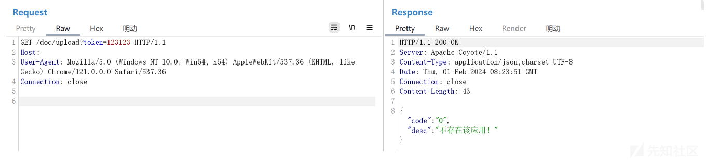](https://xzfile.aliyuncs.com/media/upload/picture/20240202165006-0ff49ef8-c1a8-1.png)  
定位代码，可以发现调用了 this.appService.getByToken(token) 来获取 appPo，其不存在就会提示：不存在该应用

[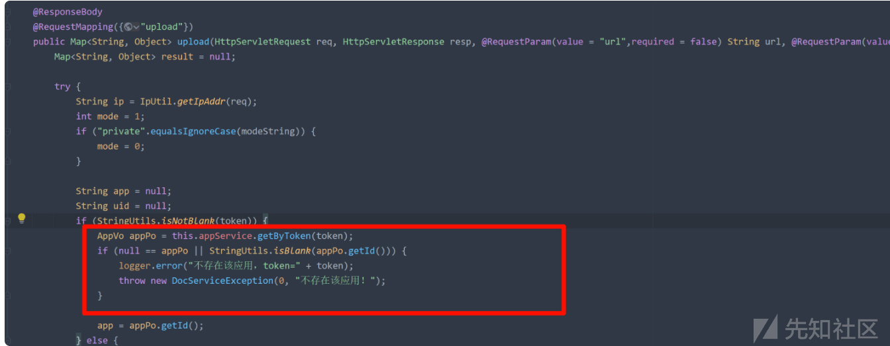](https://xzfile.aliyuncs.com/media/upload/picture/20240202165019-17b09994-c1a8-1.png)  
查看 this.appService.getByToken 方法，其调用了 this.appDao.getByToken(token) 方法

[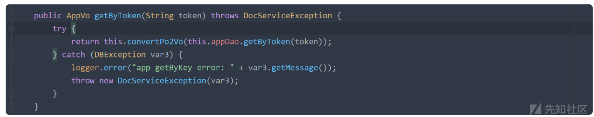](https://xzfile.aliyuncs.com/media/upload/picture/20240202165029-1da6af3c-c1a8-1.png)  
appDao 有 2 个实现类，AppDaoMySQLImpl 和 AppDaoImpl

  
它们的 getByToken 方法都是从 app 表中获取根据 token 值进行查询，一个是 mysql、一个是 mongodb

[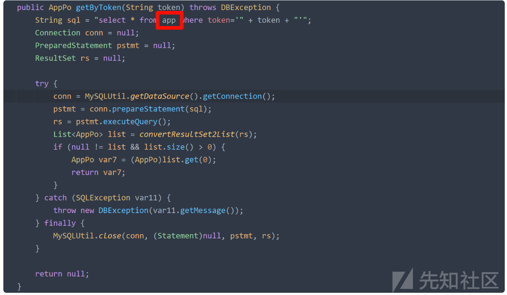](https://xzfile.aliyuncs.com/media/upload/picture/20240202165053-2c75f806-c1a8-1.png)

[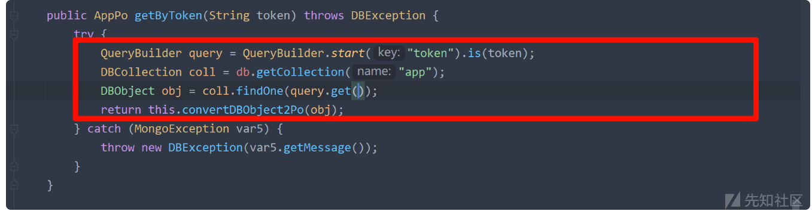](https://xzfile.aliyuncs.com/media/upload/picture/20240202165101-31073e16-c1a8-1.png)  
在数据库初始化文件中，可以看到 app 表中存在 token 值为 testtoken 的数据

[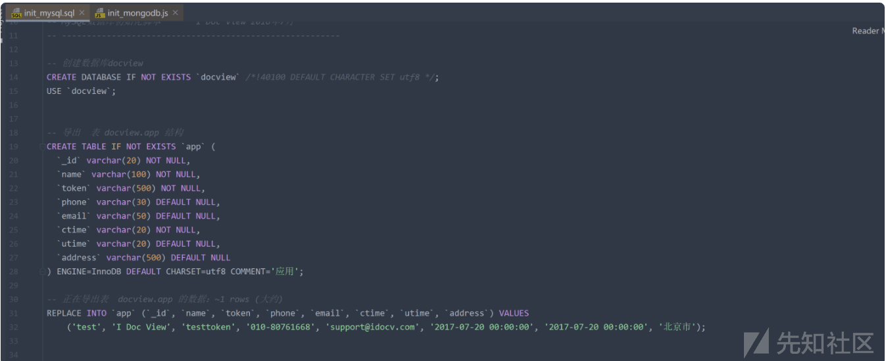](https://xzfile.aliyuncs.com/media/upload/picture/20240202165125-3f27f6c0-c1a8-1.png)

[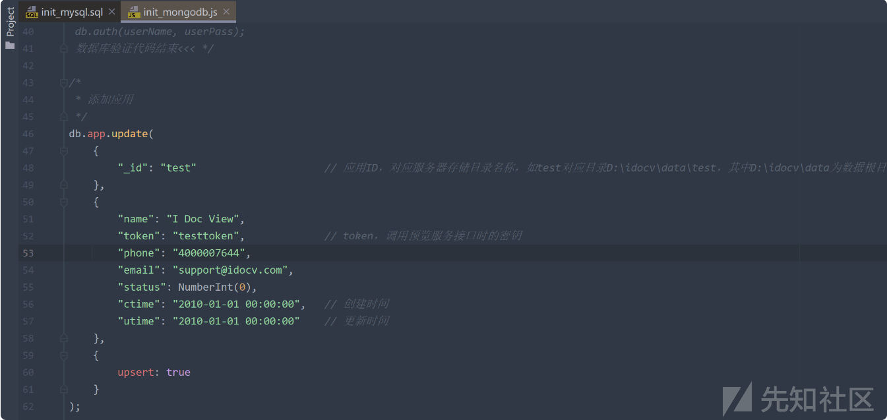](https://xzfile.aliyuncs.com/media/upload/picture/20240202165133-43c80bac-c1a8-1.png)  
传入？token=testtoken，满足条件了

[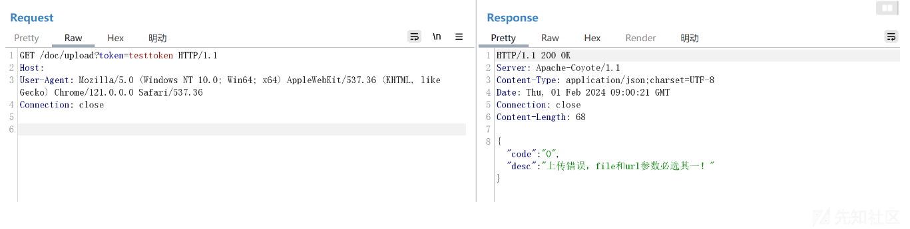](https://xzfile.aliyuncs.com/media/upload/picture/20240202165143-4a1c6412-c1a8-1.png)

## 文件上传？

继续往下看，接受文件上传请求，会调用 this.docService.add 方法

[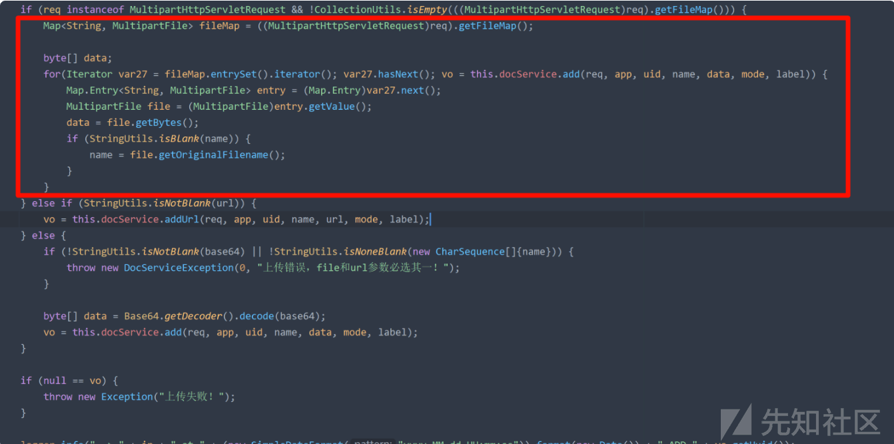](https://xzfile.aliyuncs.com/media/upload/picture/20240202165202-5549f192-c1a8-1.png)  
在 this.docService.add 方法中会调用 this.addDoc 方法

[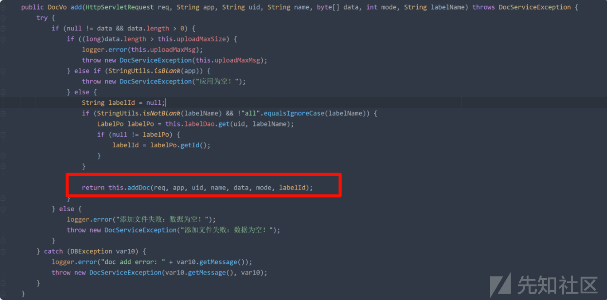](https://xzfile.aliyuncs.com/media/upload/picture/20240202165214-5ca8bce8-c1a8-1.png)  
this.addDoc 方法中会调用 FileUtils.writeByteArrayToFile 方法写入文件

[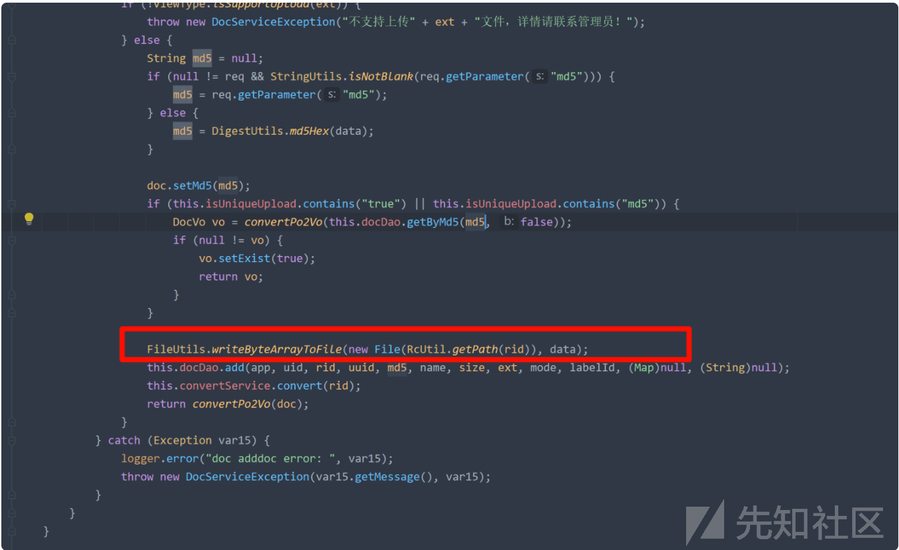](https://xzfile.aliyuncs.com/media/upload/picture/20240202165228-649121e8-c1a8-1.png)

[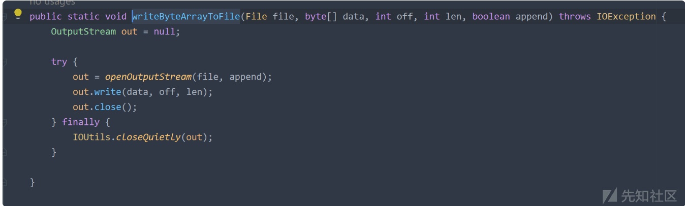](https://xzfile.aliyuncs.com/media/upload/picture/20240202165236-697b79ba-c1a8-1.png)  
文件的保存路径是 RcUtil.getPath(rid) 生成的，rid 前面有生成

[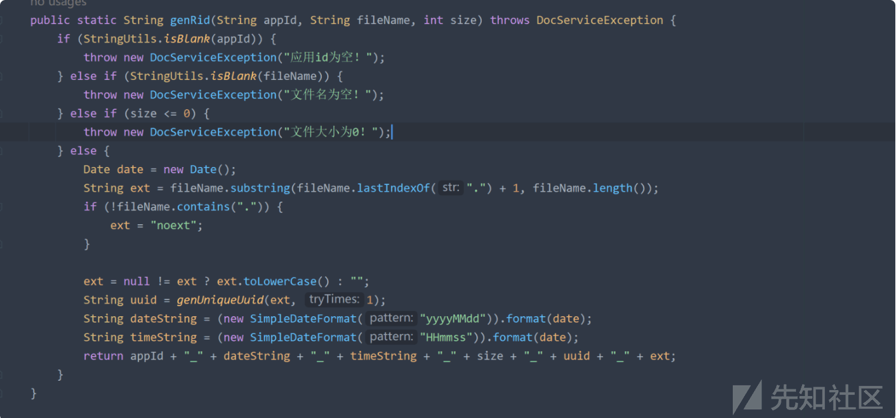](https://xzfile.aliyuncs.com/media/upload/picture/20240202165301-7860c142-c1a8-1.png)  
getPath 返回内容

  
getDirectoryByRid 返回内容

[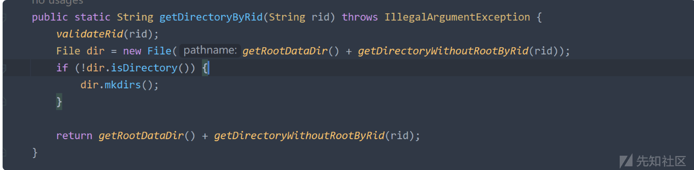](https://xzfile.aliyuncs.com/media/upload/picture/20240202165327-87d8eba4-c1a8-1.png)

[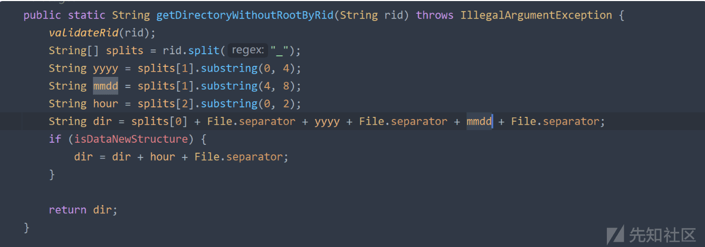](https://xzfile.aliyuncs.com/media/upload/picture/20240202165335-8cd06c04-c1a8-1.png)  
getFileNameByRid 返回内容

[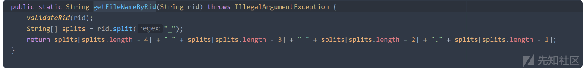](https://xzfile.aliyuncs.com/media/upload/picture/20240202165346-93629010-c1a8-1.png)  
上传请求

[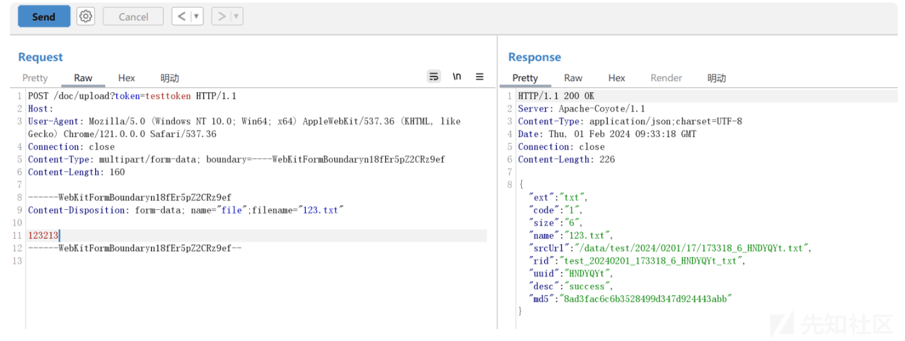](https://xzfile.aliyuncs.com/media/upload/picture/20240202165357-99fb9840-c1a8-1.png)

[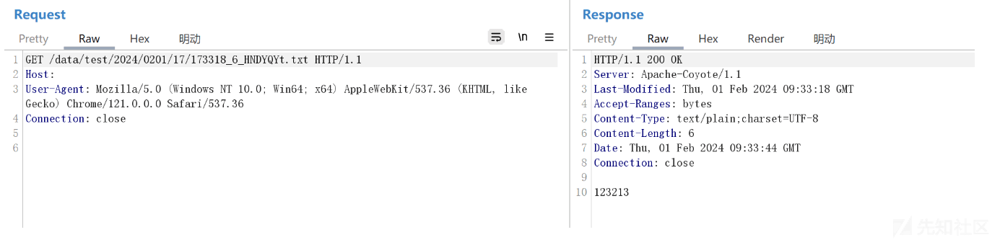](https://xzfile.aliyuncs.com/media/upload/picture/20240202165404-9e25c184-c1a8-1.png)  
不过这个无法 getshell，能上传和解析 html

## 文件读取

当不是上传请求时，接受 url 参数，调用 this.docService.addUrl 方法

[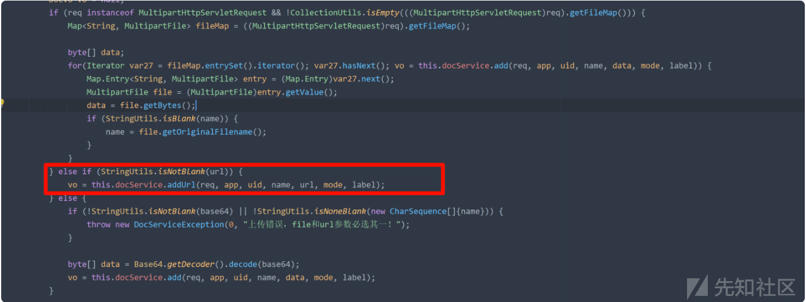](https://xzfile.aliyuncs.com/media/upload/picture/20240202165424-a9b06158-c1a8-1.png)  
在 this.docService.addUrl 方法最后，在判断 data 不为空后，会调用 this.add 方法

[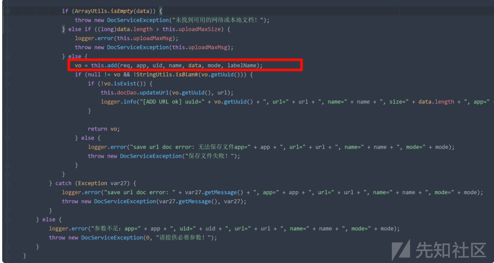](https://xzfile.aliyuncs.com/media/upload/picture/20240202165435-b08e03a4-c1a8-1.png)  
同样的也会保存文件到本地，data 就是文件内容

[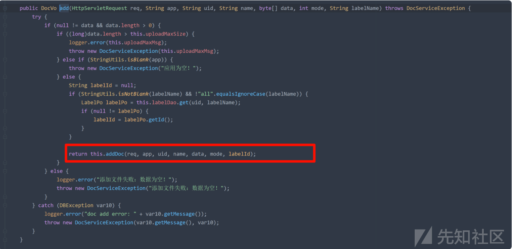](https://xzfile.aliyuncs.com/media/upload/picture/20240202165445-b674c8d4-c1a8-1.png)  
看下 data 是怎么赋值的，如果传入的 url 匹配 (file:///?)?(\\w{1}:.+)，那么就会利用 url.replaceFirst(localPathRegex, "$2");获取其第二个捕获组的内容作为文件名，读取文件内容

[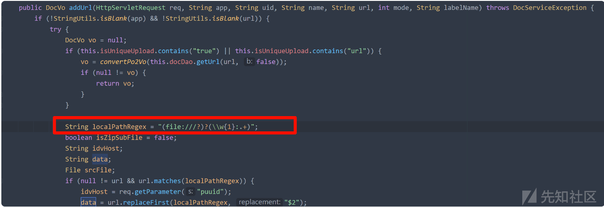](https://xzfile.aliyuncs.com/media/upload/picture/20240202165459-bebedb7e-c1a8-1.png)

[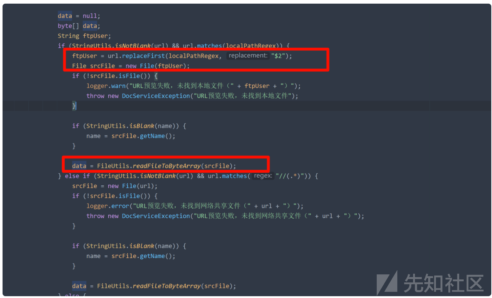](https://xzfile.aliyuncs.com/media/upload/picture/20240202165507-c35f6a9a-c1a8-1.png)  
这里就能够读取服务器上的任意文件，比如 C:/windows/win.ini

[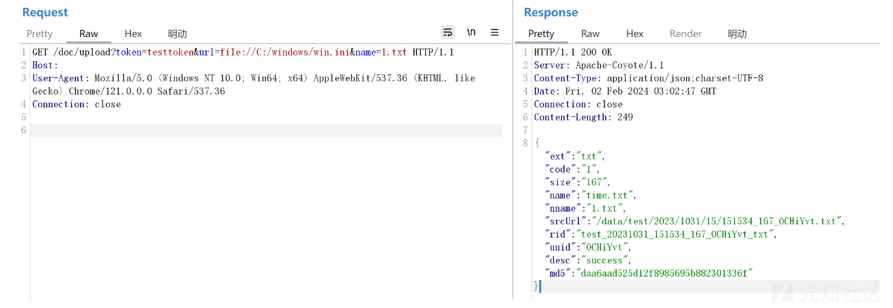](https://xzfile.aliyuncs.com/media/upload/picture/20240202165520-cb9b3aea-c1a8-1.png)

[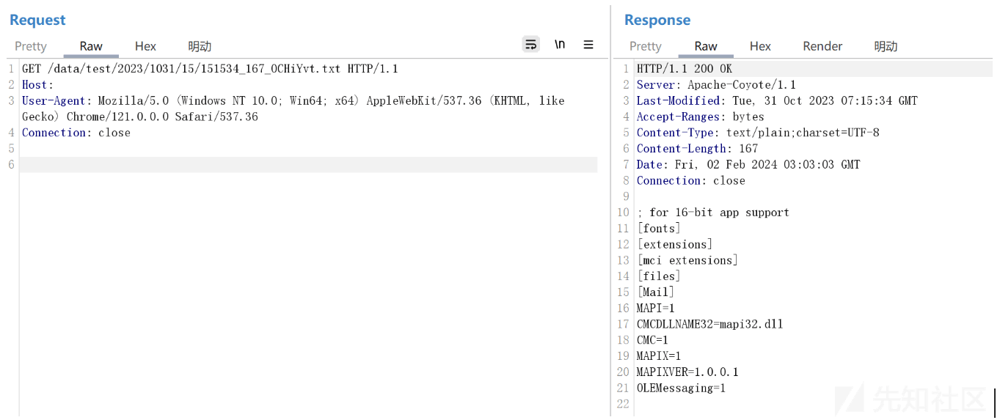](https://xzfile.aliyuncs.com/media/upload/picture/20240202165529-d06acf22-c1a8-1.png)  
如果传入的 url 是以//开头的，就是读取网络共享文件的内容

[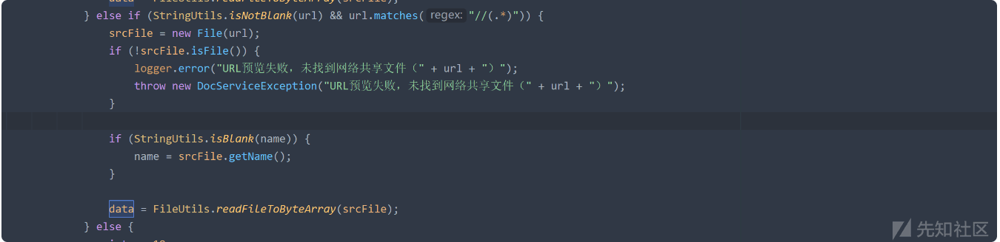](https://xzfile.aliyuncs.com/media/upload/picture/20240202165555-e04c7cce-c1a8-1.png)  
如果传入的 url 是以 ftp 开头，就是读取 ftp 服务上的文件内容

[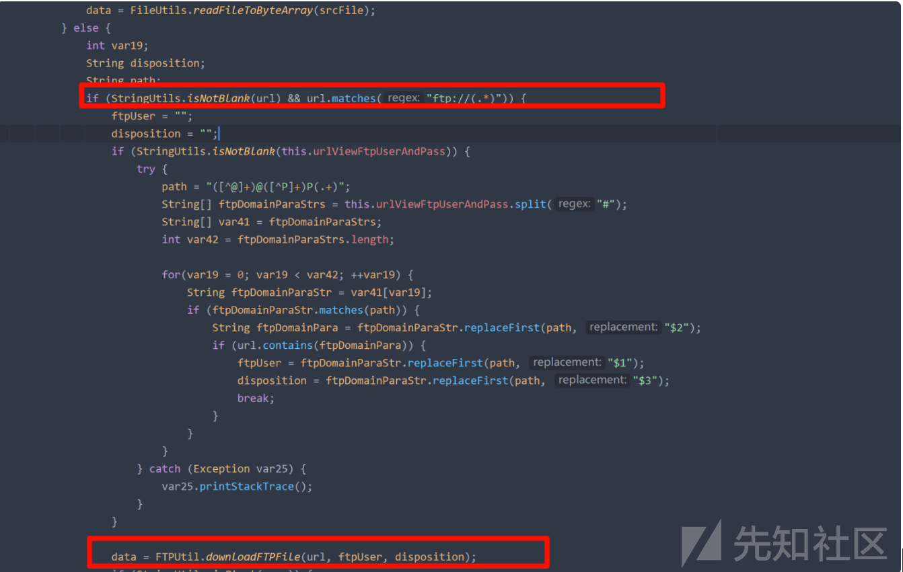](https://xzfile.aliyuncs.com/media/upload/picture/20240202165643-fcbcad34-c1a8-1.png)  
还有就是访问 http 或 https 的 web 服务

[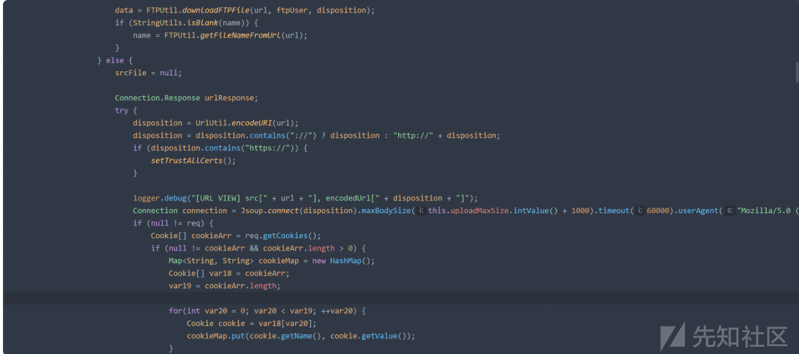](https://xzfile.aliyuncs.com/media/upload/picture/20240202165655-03ef622c-c1a9-1.png)  
data 为请求的返回值
