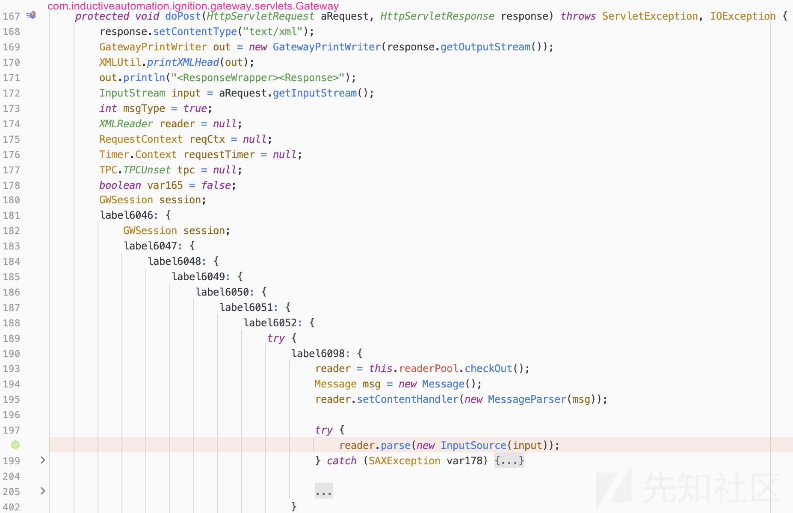

# Inductive Automation Ignition 反序列化分析 CVE-2023–50220 - 先知社区

Inductive Automation Ignition 反序列化分析 CVE-2023–50220

- - -

[](https://xzfile.aliyuncs.com/media/upload/picture/20240205231952-02493d38-c43a-1.png)

漏洞利用条件：管理员后台权限  
漏洞影响版本：Inductive Automation Ignition < 8.1.35  
本文分析版本：ignition-8.1.30

## 前言

**Inductive Automation Ignition** 是一个用于工业自动化的综合性平台，它提供了可扩展的解决方案，用于监控、控制、数据收集和分析。**Ignition** 为工业自动化提供了一套灵活且强大的工具，使用户能够构建符合其特定需求的自动化系统。

## 漏洞分析

漏洞作者在挖洞的时候，看到 **/system/gateway** 端点存在 **XML** 解析，这里使用了 **reader.setContentHandler()** 设置了对应的解析器，为 **com.inductiveautomation.ignition.gateway.servlets.gateway.MessageParser** 。因此，挖掘者在想：是否还有其他可以被利用的 **XML** 解析器？

[](https://xzfile.aliyuncs.com/media/upload/picture/20240205232004-09abc94c-c43a-1.png)

于是，在找 **XML** 解析器的过程中，发现了 **com.inductiveautomation.ignition.gateway.history.HistoryFlavor.Base64XmlReader** 。

[](https://xzfile.aliyuncs.com/media/upload/picture/20240205232012-0e632066-c43a-1.png)

这个 **Base64XmlReader** 类在解析 **XML** 数据的过程中，存在反序列化操作。现在我们来回溯找漏洞触发点。

[](https://xzfile.aliyuncs.com/media/upload/picture/20240205232019-12c4a68e-c43a-1.png)

从 **Base64XmlReader** 向上回溯，最终会发现漏洞起始点在 **StoreAndForwardRoutes#importData()** 中，且 **StoreAndForwardRoutes#mount()** 为该方法注册了对应的 **Web** 请求路由，为 **/store\_forward\_import/:storeName** 。下图是完整的回溯过程 (从图片底部向上看代码)，不过多赘述。

[](https://xzfile.aliyuncs.com/media/upload/picture/20240205232034-1b80d0ae-c43a-1.png)

通过系统自带的 **js** 文件，我们得知该方法完整的请求路由为 **/data/status/store\_forward\_import/:storeName** 。通过构造如下请求，我们发现可以命中漏洞入口点。

```plain
POST /data/status/store_forward_import/test HTTP/1.1
Host: 192.168.77.131:8088
Accept: application/json, text/plain, */*
User-Agent: Mozilla/5.0 (Macintosh; Intel Mac OS X 10_15_7) AppleWebKit/537.36 (KHTML, like Gecko) Chrome/121.0.0.0 Safari/537.36
Referer: http://192.168.77.131:8088/web/config/network.gan?3
Accept-Language: zh-CN,zh;q=0.9
Cookie: JSESSIONID=node01vct2fes1su7nzhs7uuiqdmjp10.node0
Connection: close
Content-Type: multipart/form-data; boundary=--------437556657
Content-Length: 184

----------437556657
Content-Disposition: form-data; name="file"; filename="test.xml"

<?xml version="1.0"?>
----------437556657--
```

但是上面的请求并不能成功触发漏洞。因为程序要求我们传入的 **storeName** ，必须存在于系统中。在默认环境下为 **sample\_sqlite\_database** 。

[](https://xzfile.aliyuncs.com/media/upload/picture/20240205232048-23ced936-c43a-1.png)

接着，要求 **XML** 数据中要有 **data** 标签。该标签得有 **flavor、subtype** 两个属性，程序会通过这两个属性去获取对应的 **Flavor** 。这里，我们想要获取的是 **HistoryFlavor** ，所以这里应该设置 **flavor="**datasourcedata**"、subtype=""** 。

[](https://xzfile.aliyuncs.com/media/upload/picture/20240205232055-284ac3da-c43a-1.png)

通过查看 **HistoryFlavor** 的代码，我们发现程序会把序列化数据 **base64** 编码后，存储在 **base64** 标签中。

[](https://xzfile.aliyuncs.com/media/upload/picture/20240205232134-3f9f425e-c43a-1.png)

构造如下数据，成功触发反序列化：

```plain
POST /data/status/store_forward_import/sample_sqlite_database HTTP/1.1
Host: 192.168.77.131:8088
Accept: application/json, text/plain, */*
Referer: http://192.168.77.131:8088/web/config/network.gan?3
Accept-Language: zh-CN,zh;q=0.9
Cookie: JSESSIONID=node01rs3wf9uyqaahilz1x3b789hi1.node0
Connection: close
Content-Type: multipart/form-data; boundary=--------437556657
Content-Length: 594

----------437556657
Content-Disposition: form-data; name="file"; filename="test.xml"

<?xml version="1.0"?>
<data flavor="__datasourcedata__" subtype="">
    <base64>序列化数据 base64 编码</base64>
</data>
----------437556657--
```

## 漏洞利用

**Inductive Automation Ignition** 应用中存在 **jython-ia-2.7.2.1.jar** 依赖，所以这里可以尝试 **ysoserial** 中的 **Jython1** 反序列化链。但是这里直接利用会失败，原因在于 **jython-ia-2.7.2.1.jar** 里面对 **org.python.core.PyFunction** 做了一些改动，新增了一个 **readResolve()** 方法。而这个方法体里面直接抛出异常，导致反序列化无法利用该类 (如果一个类实现了 **java.io.Serializable** 接口，并重写了 **readResolve()** 方法。反序列化该类的时候，就会主动调用这个 **readResolve()** 方法)。

[](https://xzfile.aliyuncs.com/media/upload/picture/20240205232146-46c739ce-c43a-1.png)

此时思路转向寻找 **PyFunction** 的替代类，漏洞作者发现了 **org.python.core.PyMethod** 类。这个类的功能和 **PyFunction** 是类似的，这样就又把反序列化链串起来了。可以参考网上公开的 [**Jython2**](https://github.com/frohoff/ysoserial/pull/200/files) 链，稍微改造下即可。

[](https://xzfile.aliyuncs.com/media/upload/picture/20240205232154-4b5a57d2-c43a-1.png)

## 补丁分析

**Inductive Automation Ignition 8.1.35** 版本已经修复了上述漏洞，直接使用 **POC** 会发现已经无法利用。通过查看日志文件，可以得到如下结果：

```plain
INFO   | jvm 1    | W [g.CompositeClassRejectListFilter] [08:45:47]: Serial class 'org.python.core.PyMethod' REJECTED by Platform pattern 'org.python.core.PyMethod' for security. Set log level to DEBUG to log additional details for future events. store-forward-name=NewConnection, route-group=status, route-path=/store_forward_import/:storeName
```

很明显，应该是增加了反序列化过滤器。通过 **diff** 代码，我们发现 **8.1.35** 版本的启动类中新增了 **CompositeClassRejectListFilter** 类。该类用来禁止反序列化黑名单中的类。

[](https://xzfile.aliyuncs.com/media/upload/picture/20240205232205-51fa0c86-c43a-1.png)

具体黑名单如下，里面就有我们之前使用的 **org.python.core.PyMethod** 类。

```plain
public static final ClassMatchers PLATFORM_CLASS_MATCHERS = ClassMatchers.fromPatterns(new String[]{"bsh.**", "clojure.lang.PersistentArrayMap", "clojure.inspector.proxy$javax.swing.table.AbstractTableModel$ff19274a", "com.mchange.v2.c3p0.PoolBackedDataSource", "com.mchange.v2.c3p0.impl.PoolBackedDataSourceBase", "com.vaadin.data.util.NestedMethodProperty", "com.vaadin.data.util.PropertysetItem", "com.sun.proxy.**", "com.sun.syndication.feed.impl.ObjectBean", "java.security.CodeSource", "net.sf.json.JSONObject", "org.apache.click.**", "org.apache.commons.beanutils.BeanComparator", "org.apache.commons.collections.Transformer", "org.apache.commons.collections.functors.ChainedTransformer", "org.apache.commons.collections.functors.ConstantTransformer", "org.apache.commons.collections.functors.InstantiateTransformer", "org.apache.commons.collections.map.LazyMap", "org.apache.commons.collections.functors.InvokerTransformer", "org.apache.commons.collections.keyvalue.TiedMapEntry", "org.apache.commons.collections4.comparators.TransformingComparator", "org.apache.commons.collections4.functors.InvokerTransformer", "org.apache.commons.collections4.functors.ChainedTransformer", "org.apache.commons.collections4.functors.ConstantTransformer", "org.apache.commons.collections4.functors.InstantiateTransformer", "org.apache.commons.fileupload.disk.DiskFileItem", "org.apache.commons.io.output.DeferredFileOutputStream", "org.apache.commons.io.output.ThresholdingOutputStream", "org.apache.myfaces.context.servlet.FacesContextImpl", "org.apache.myfaces.context.servlet.FacesContextImplBase", "org.apache.myfaces.el.CompositeELResolver", "org.apache.myfaces.el.unified.FacesELContext", "org.apache.myfaces.view.facelets.el.ValueExpressionMethodExpression", "org.apache.wicket.util.upload.DiskFileItem", "org.apache.wicket.util.io.DeferredFileOutputStream", "org.apache.wicket.util.io.ThresholdingOutputStream", "org.codehaus.groovy.runtime.ConvertedClosure", "org.codehaus.groovy.runtime.MethodClosure", "org.hibernate.engine.spi.TypedValue", "org.hibernate.tuple.component.AbstractComponentTuplizer", "org.hibernate.tuple.component.PojoComponentTuplizer", "org.hibernate.type.AbstractType", "org.hibernate.type.ComponentType", "org.hibernate.type.Type", "org.hibernate.EntityMode", "org.jboss.weld.interceptor.builder.InterceptionModelBuilder", "org.jboss.weld.interceptor.builder.MethodReference", "org.jboss.weld.interceptor.proxy.DefaultInvocationContextFactory", "org.jboss.weld.interceptor.proxy.InterceptorMethodHandler", "org.jboss.weld.interceptor.reader.ClassMetadataInterceptorReference", "org.jboss.weld.interceptor.reader.DefaultMethodMetadata", "org.jboss.weld.interceptor.reader.ReflectiveClassMetadata", "org.jboss.weld.interceptor.reader.SimpleInterceptorMetadata", "org.jboss.weld.interceptor.spi.instance.InterceptorInstantiator", "org.jboss.weld.interceptor.spi.metadata.InterceptorReference", "org.jboss.weld.interceptor.spi.metadata.MethodMetadata", "org.jboss.weld.interceptor.spi.model.InterceptionModel", "org.jboss.weld.interceptor.spi.model.InterceptionType", "org.jboss.interceptor.builder.InterceptionModelBuilder", "org.jboss.interceptor.builder.MethodReference", "org.jboss.interceptor.proxy.DefaultInvocationContextFactory", "org.jboss.interceptor.proxy.InterceptorMethodHandler", "org.jboss.interceptor.reader.ClassMetadataInterceptorReference", "org.jboss.interceptor.reader.DefaultMethodMetadata", "org.jboss.interceptor.reader.ReflectiveClassMetadata", "org.jboss.interceptor.reader.SimpleInterceptorMetadata", "org.jboss.interceptor.spi.instance.InterceptorInstantiator", "org.jboss.interceptor.spi.metadata.InterceptorReference", "org.jboss.interceptor.spi.metadata.MethodMetadata", "org.jboss.interceptor.spi.model.InterceptionType", "org.jboss.interceptor.spi.model.InterceptionModel", "org.mozilla.javascript.**", "org.python.core.BuiltinFunctions", "org.python.core.PyBytecode", "org.python.core.PyFunction", "org.python.core.PyMethod", "org.springframework.beans.factory.ObjectFactory", "org.springframework.aop.framework.AdvisedSupport", "org.springframework.aop.target.SingletonTargetSource", "sun.security.krb5.internal.KRBError", "sun.rmi.server.UnicastRef", "sun.rmi.transport.LiveRef", "sun.rmi.transport.tcp.TCPEndpoint", "java.rmi.server.RemoteObject", "java.rmi.server.RemoteRef", "java.rmi.server.UnicastRemoteObject", "sun.rmi.server.ActivationGroupImpl", "sun.rmi.server.UnicastServerRef"});
```

## 参考文章

[https://petrusviet.medium.com/cve-2023-50220-inductive-automation-ignition-xml-deserialization-to-rce-7b395412c6cf](https://petrusviet.medium.com/cve-2023-50220-inductive-automation-ignition-xml-deserialization-to-rce-7b395412c6cf)
