# JA 指纹识全系讲解（上） - 先知社区

JA 指纹识全系讲解（上）

- - -

## 前言

近期在学习 Burp Suite 的反制时发现 **Wfox** 前辈写的[反制爬虫之 Burp Suite RCE](https://paper.seebug.org/1696/)一文，文末处介绍了使用 JA3 指纹识别 Burp Suite 流量的方法，简单研究后发现实战中易用性较强，故借此机会完整介绍一下 JA 指纹的全系列，并拓展到实践中

## 什么是 JA 指纹

JA 指纹是一种对传输层（SSL/TLS）进行指纹识别的方法，由 John Althouse、Jeff Atkinson 和 Josh Atkins 三位安全研究员在 2017 年 6 月首次发布在 Github，JA 系列指纹可以被看作是一种 IOC（通俗一点叫入侵指标）

> IOC：是指有助于识别攻击是否已经发生或正在进行的数据，它就像是一件物证，侦探可能会收集物证用于确定谁出现在犯罪现场

像是我们平常使用的海内外威胁情报平台、网空测绘平台、WAF 类安全产品都是以 IOC 作为数据支撑的，但是支持 JA 指纹的产品和平台较少，除了在产品侧的应用，JA 指纹也被用在识别 C2、V2ray 这类特殊流量上

如果以传统的 IP 和域名两个维度去检测，会漏掉一些隐匿程度较好的恶意流量，现在大部分 C2 和服务端之间都是使用 TLS 加密的，但如果使用 JA 指纹，哪怕无法解密恶意流量的内容，不能掌握 C2 的 IP 和域名，依然可以识别出恶意流量

但是 JA 指纹也不是万能的，它依然是可以被改变的，但是需要对客户端的 TLS 握手特征进行修改，难度较大，也会变相提升攻击成本，也是因为这个特性，JA 指纹更多被用在黑名单场景上，如果在白名单场景使用就会有误报率过高这样的问题

下面将介绍 JA 指纹的四个分支，这四个分支各有侧重点，被应用在不同的场景中

-   JA3：对 TLS 客户端进行被动识别
-   JA3s：对 TLS 服务端进行被动识别，可以看作是 JA3 的服务端版
-   JAM：对 TLS 服务端进行主动识别，可以看作是 JA3 和 JA3s 的融合
-   JA4+：JA4+ 是一个指纹合集，包括 JA4、JA4S、JA4H、JA4L、JA4X、JA4SSH，可以对多个检测维度进行指纹识别  
    \## JA3

上面我们说过，JA3 指纹的计算是在传输层完成的，具体一点说，是在 SSL/TLS 握手过程中的第一阶段完成的，也就是 Client Hello，先来介绍一下它的报文结构

## Client Hello 报文结构

在 WireShark 中，我们可以使用以下规则过滤处 Client Hello 报文

```plain
ssl.handshake.type == 1
```

Client Hello 报文结构如下：

-   客户端版本（Version）：按优先级列出客户端支持的协议版本，首选客户端希望支持的最新协议版本
-   客户端随机数（Random）：引入一个新的随机因素，增加安全性，用于生成密钥
-   会话 ID（Session ID）：如果客户端第一次连接到服务器，那么这个字段就会保持为空，一般用于会话恢复
-   加密套件（Cipher Suites）：给服务器发送自己已知的密码套件列表，服务端会从中选出一种来作为双方共同的加密套件
-   扩展包（Extension）：其他参数（如服务器名称，填充，支持的签名算法等）可以作为扩展名使用  
    [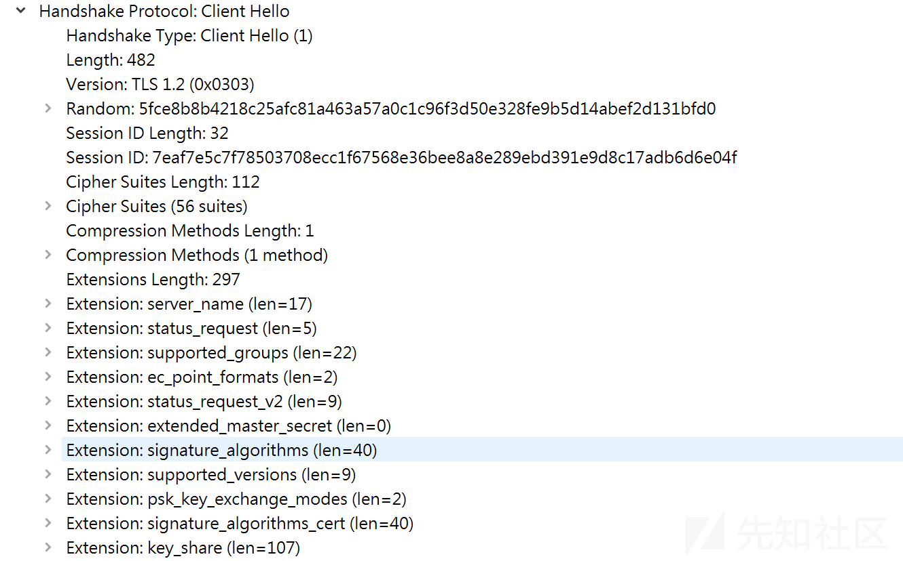](https://xzfile.aliyuncs.com/media/upload/picture/20240215163013-70945dd2-cbdc-1.png)  
    JA3 指纹就是使用 TLS Version、Cipher Suite、Extension、EllipticCurves(Supported\_Groups)、Elliptic Curve Point Formats(ec\_point\_formats) 这五项参数计算出来的

JA3 计算最早使用的是 EllipticCurves 和 Curve Point Formats，但随着 TLS 的发展（标准从 RFC4492 转为 RFC8422），发现这两个命名不能满足实际的需求了，于是分别改为 Supported\_Groups 和 ec\_point\_formats，现在我们接触到的基本都是这两种命名  
[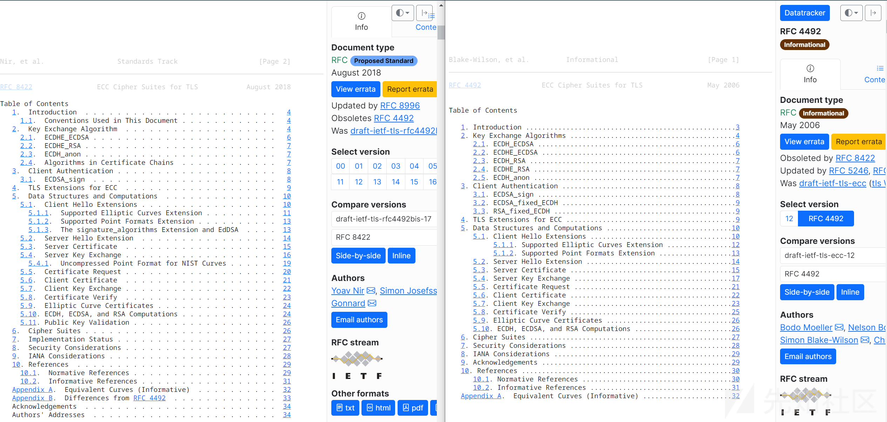](https://xzfile.aliyuncs.com/media/upload/picture/20240215163046-844c9d08-cbdc-1.png)

## JA3 计算原理

JA3 的计算较为简洁，就是**将刚才说到的五项参数的数值都转为十进制，相同项的参数使用`-`串联，然后使用`,`进行分隔（如果不存在 TLS Extension，后三项直接留空即可）**

-   TLS Version
    
    ```plain
    0x0303 -> 771
    ```
    
    [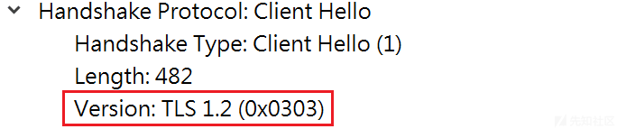](https://xzfile.aliyuncs.com/media/upload/picture/20240215163120-983f04ae-cbdc-1.png)
    
-   Cipher Suite
    
    ```plain
    0x1302 -> 4866
    4866-4865-4867-49196-49195-52393-49200-52392-49199-159-52394-163-158-162-49188-49192-49187-49191-107-106-103-64-49198-49202-49197-49201-49190-49194-49189-49193-49162-49172-49161-49171-57-56-51-50-49157-49167-49156-49166-157-156-61-60-53-47-49160-49170-22-19-49155-49165-10-255
    ```
    

[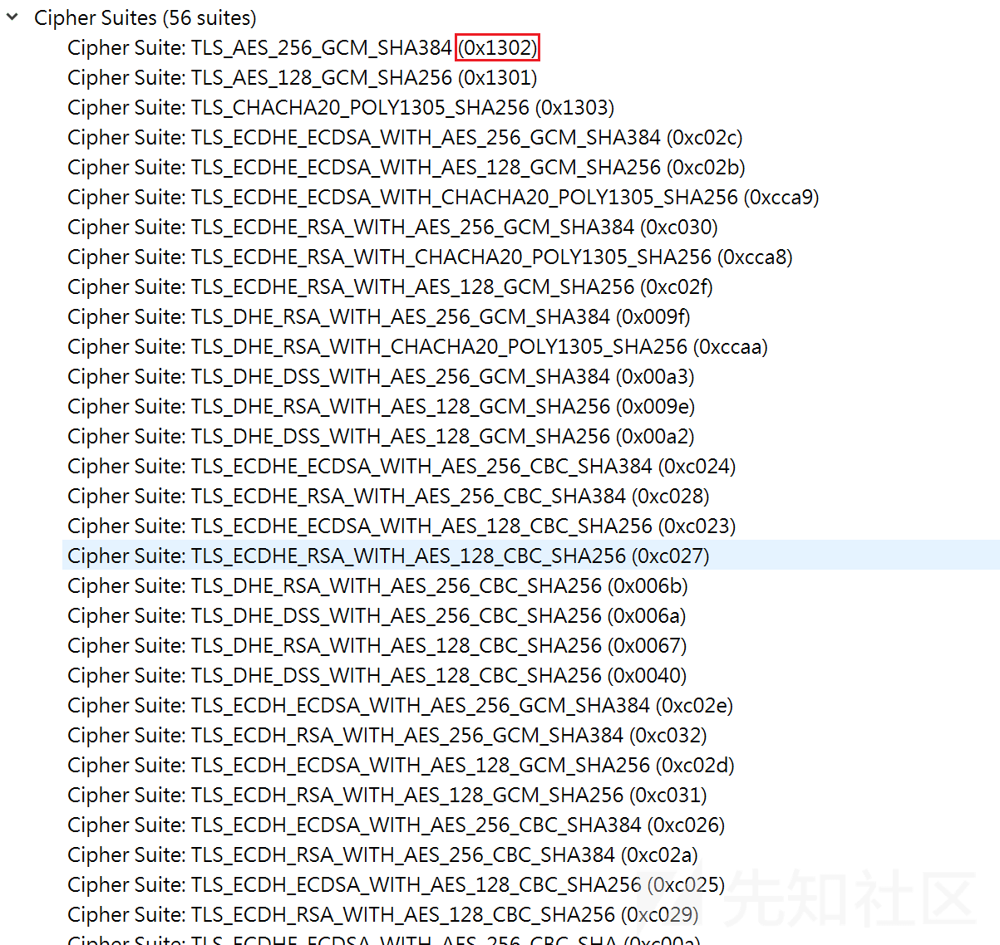](https://xzfile.aliyuncs.com/media/upload/picture/20240215163155-ad37b6c6-cbdc-1.png)

-   Extension-Type
    
    ```plain
    0-5-10-11-17-23-13-43-45-50-51
    ```
    
    [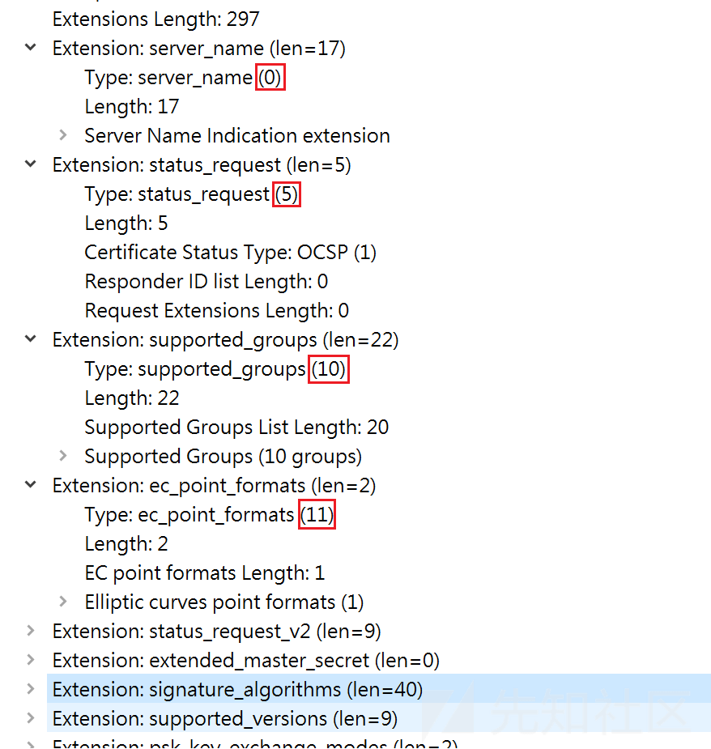](https://xzfile.aliyuncs.com/media/upload/picture/20240215163223-bdc9d032-cbdc-1.png)
    
-   Supported\_Groups
    
    ```plain
    29-23-24-25-30-256-257-258-259-260
    ```
    
    [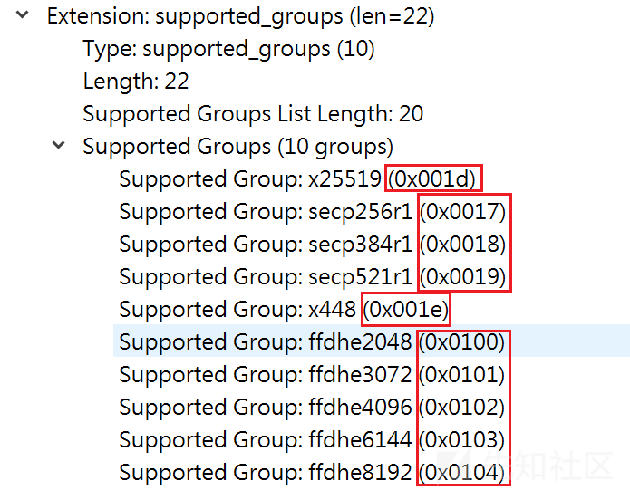](https://xzfile.aliyuncs.com/media/upload/picture/20240215163252-cf7d3526-cbdc-1.png)
    
-   ec\_point\_formats
    
    ```plain
    0
    ```
    
    [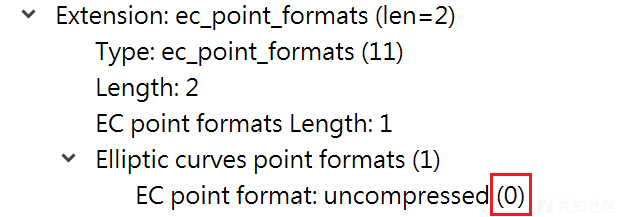](https://xzfile.aliyuncs.com/media/upload/picture/20240215163318-debbd93e-cbdc-1.png)  
    之后我们把这些数据按照规则拼接起来
    

```plain
771,4866-4865-4867-49196-49195-52393-49200-52392-49199-159-52394-163-158-162-49188-49192-49187-49191-107-106-103-64-49198-49202-49197-49201-49190-49194-49189-49193-49162-49172-49161-49171-57-56-51-50-49157-49167-49156-49166-157-156-61-60-53-47-49160-49170-22-19-49155-49165-10-255,0-5-10-11-17-23-13-43-45-50-51,29-23-24-25-30-256-257-258-259-260,0|
```

最终加密形成 32 位 MD5，就是这条报文的 JA3 指纹

```plain
dc86f13deee08e265833d3d9c6ae5694
```

如果还不理解，可以参考一下 @Ravi Teja 制作的图例  
[](https://xzfile.aliyuncs.com/media/upload/picture/20240215163356-f57fb0aa-cbdc-1.gif)

## JA3 的优化

起初是想收集一下 Chrome 的 JA3 指纹的，结果发现 Wireshark 计算出的 MD5（Wireshark 中的 MD5 只是计算后显示出来的，真实报文里并不包含）每次都是不一样的，这就问题很大了  
[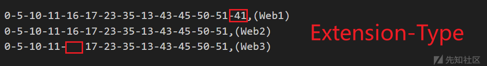](https://xzfile.aliyuncs.com/media/upload/picture/20240215164230-27a4ae0e-cbde-1.png)

按照研究员博客中所说，JA3 只受客户端版本的影响，照这样的说法 JA3 是不会随意变化的，后来仔细查阅资料后发现是 Google 在 Chrome 中引入了 [GREASE](https://chromestatus.com/feature/5124606246518784)（生成随机扩展并维持可扩展性）这项机制，简单来说就是在发送请求时在 JA3 算子处加入随机值，导致最终计算出的 JA3 指纹也是随机的  
[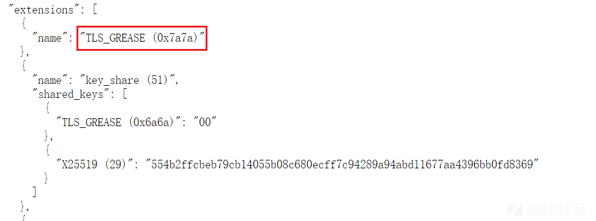](https://xzfile.aliyuncs.com/media/upload/picture/20240215163431-0a40ca56-cbdd-1.png)  
通过观察多组不同的 JA3 指纹，发现都是 Extension 这项不同，因此去掉第三项的检测（留空），以剩下的四项作为算子  
[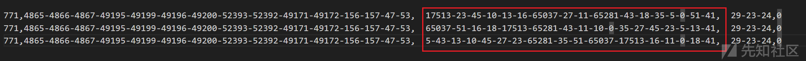](https://xzfile.aliyuncs.com/media/upload/picture/20240215163459-1b1b7c86-cbdd-1.png)  
这样优化后使得 JA3 从现在的无法检测变为可以检测，但对比早期无 GREASE 机制时检测精度固然会下降，属于是不得已之策，后面会专门写一篇落地应用相关的内容，从代码层面实现这个优化

### GREASE 机制

GREASE 是 Generate Random Extensions And Sustain Extensibility 的缩写，在 RFC8701 中被正式定义，主要的用处是通过设计一种机制，来防止 TLS 协议在将来进行扩展的时候受到阻碍

在 TLS 中 Cipher Suite 和 Extension 等字段会有一些保留值，留待之后的版本使用，GREASE 机制就是对这些参数分别限定了一些保留值，但这些保留值是没有意义的，比如用于 CipherSuites 和 ALPN 两项的拓展值有：

```plain
{0x0A,0x0A}, {0x1A,0x1A}, {0x2A,0x2A}, {0x3A,0x3A}, {0x4A,0x4A}, {0x5A,0x5A}, {0x6A,0x6A}, {0x7A,0x7A}, {0x8A,0x8A}, {0x9A,0x9A}, {0xAA,0xAA}, {0xBA,0xBA}, {0xCA,0xCA}, {0xDA,0xDA}, {0xEA,0xEA}, {0xFA,0xFA}
```

同时，协议中也规定了客户端如何处理 GREAES 值和服务端接收到 GREAES 值后如何使用  
[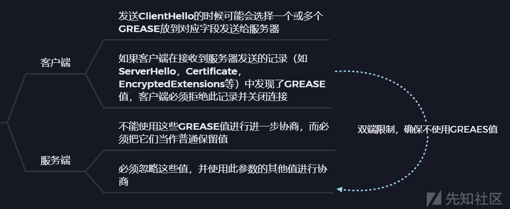](https://xzfile.aliyuncs.com/media/upload/picture/20240215163531-2dec2946-cbdd-1.png)

# JA3s

上文我们说过，JA3s 就是服务端版的 JA3，它是使用 SSL/TLS 握手过程中的 Server Hello 报文（SSL/TLS 握手过程中的第二阶段）来进行计算的，我们先来看一下 Server Hello 的报文结构

## Server Hello 报文结构

在 WireShark 中，我们可以使用以下规则过滤处 Server Hello 报文

```plain
ssl.handshake.type == 2
```

Server Hello 报文结构如下：

-   服务端版本（Version）：和服务端最终协商使用的版本
-   服务端随机数（Random）：引入一个新的随机因素，增加安全性，用于生成密钥
-   会话 ID（Session ID）：与本次连接相对应的会话的标识
-   加密套件（Cipher Suites）：由服务端选择一个 Client Hello 提供的加密套件
-   扩展包（Extension）：拓展列表，由 Client Hello 给出的扩展才能出现在这个列表中  
    [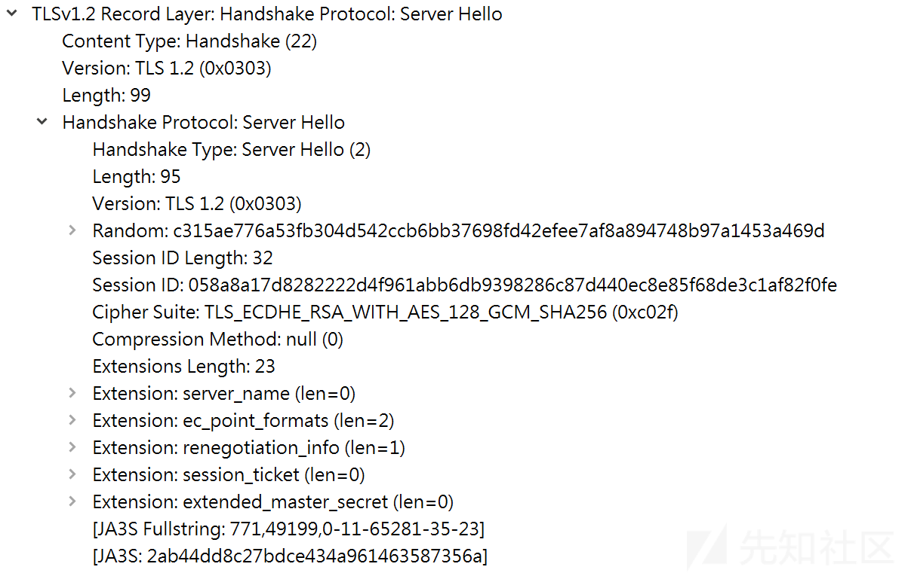](https://xzfile.aliyuncs.com/media/upload/picture/20240215163557-3d795776-cbdd-1.png)

## JA3s 计算原理

具体算法与 JA3 完全一致，就是参与计算的内容不一样，JA3s 是由 TLS Version、Cipher Suite、Extension 三项计算出来的

-   TLS Version
    
    ```plain
    0x0303 -> 771
    ```
    
    [](https://xzfile.aliyuncs.com/media/upload/picture/20240215163626-4e8e1ee8-cbdd-1.png)
-   Cipher Suite
    
    ```plain
    0xc02f -> 49199
    ```
    
-   Extension-Type
    
    ```plain
    0-11-65281-35-23
    ```
    
    [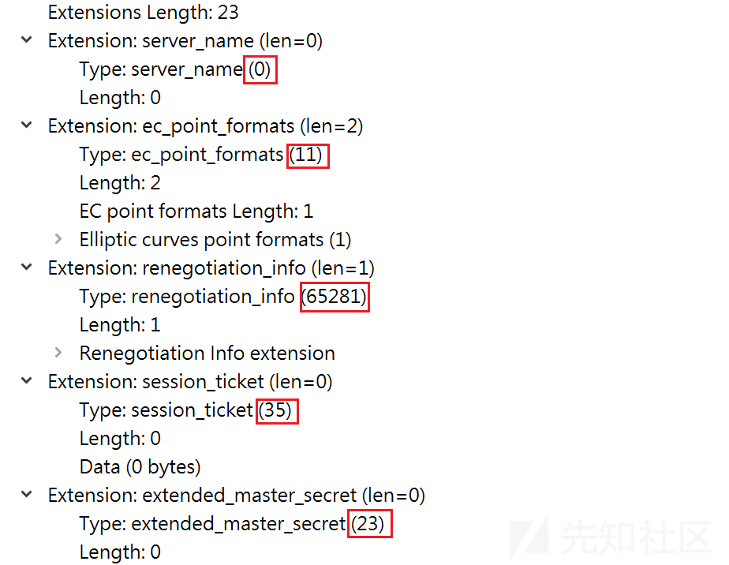](https://xzfile.aliyuncs.com/media/upload/picture/20240215163738-796d4a08-cbdd-1.png)

之后我们把这些数据按照规则拼接起来

```plain
771,49199,0-11-65281-35-23
```

计算出 32 位的 MD5，就是这条报文的 JA3s 指纹

```plain
2ab44dd8c27bdce434a961463587356a
```

## JARM

JAM 可以看作是 JA3 和 JA3s 的融合版本，它与 JA3 和 JA3s 相比，个人认为有两点最大的区别，即**主动和双向**，下面我们来详细解释一下：

-   主动：主动是探测方式上的主动，与 JA3 和 JA3s 的被动探测相比，JAM 主动向服务端发送 Client Hello 报文，而不是被动接受报文，它更像是一个扫描工具
-   双向：双向体现在计算维度上，JA3 和 JA3s 都是对单项的报文进行计算，而 JAM 的计算是同时结合 Client Hello 报文和 Server Hello 报文进行计算

## JARM 获取

JAM 同样也是开源的，并且 JAM 单独给出了一个计算指定网站的脚本，Github 地址如下：

```plain
https://github.com/salesforce/jarm/blob/master/jarm.py
```

这里我们对`baidu.com`和`weibo.com`的 JAM 指纹进行计算，我们需要先创建一个 txt 把它们放入里面，再用`-i`指令运行（直接在`jarm.py`后跟扫描目标也可以），还可以使用`-v`参数列出进行模糊哈希前的参数  
[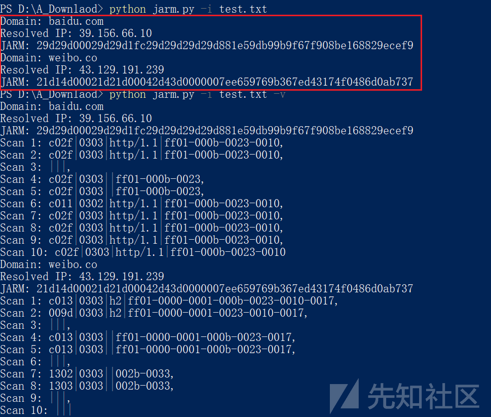](https://xzfile.aliyuncs.com/media/upload/picture/20240215163845-a197d048-cbdd-1.png)

更多操作见以下参数

```plain
-h, --help 显示帮助信息并退出
  -i INPUT, --input INPUT
                        提供要扫描的 IP 地址或域名列表，每行一个域名或 IP 地址。
                        可选：用逗号分隔指定要扫描的端口（如 8.8.4.4,853）。
  -p PORT, --port PORT 输入要扫描的端口（默认为 443）
  -v，--verbose 冗余模式：在散列前显示 JARM 结果
  -V, --version 打印出版本并退出
  -o OUTPUT, --output OUTPUT
                        提供文件名，将结果输出/附加到 CSV 文件
  -j, --json 输出 ndjson（输出到文件或 stdout；覆盖 --output 默认值为 CSV）
  -P PROXY, --proxy PROXY
                        要使用 SOCKS5 代理，请提供地址：端口
```

下面我们来简单的分析一下程序是如何实现的，它首先定义了十个数组，用于配置 Client Hello 报文，每个数组代表一个特定的 TLS 握手配置，包括目标主机、目标端口、TLS 版本、密码套件列表、密码套件顺序、是否使用 GREASE、应用层协议协商（ALPN）、是否支持特定的 TLS 版本以及 TLS 扩展的顺序  
[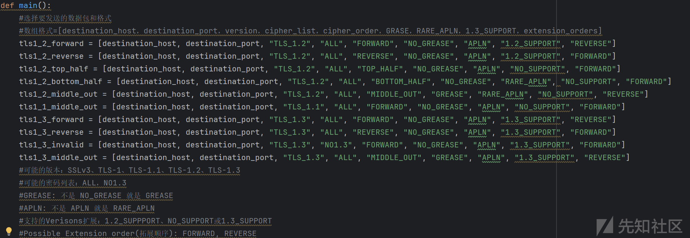](https://xzfile.aliyuncs.com/media/upload/picture/20240215163912-b19042a0-cbdd-1.png)

之后这些数组被添加到`queue`队列中，通过`while`循环进行处理，之后这十个数组会被`packet_building`函数构建为特征不同的数据包，之后通过`send_packet`函数发送，最终的结果（十个与之对应的 Server Hello 报文）由`read_packet`函数进行处理  
[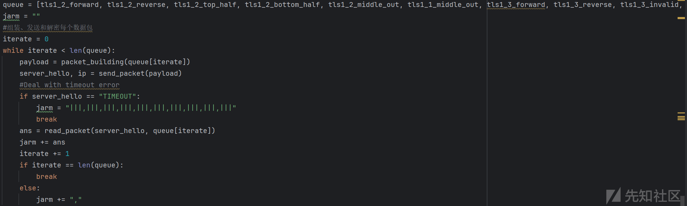](https://xzfile.aliyuncs.com/media/upload/picture/20240215163954-cb0cc514-cbdd-1.png)

比较值得一提的是，程序还使用了一个`choose_grease()`函数修复了前代 JA3/3s 收到 GREAES 影响的问题，具体如何应用的可以跟踪`choose_grease()`函数自行查看，这里就不再赘述  
[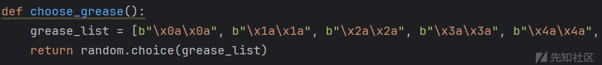](https://xzfile.aliyuncs.com/media/upload/picture/20240215164016-d81f84f8-cbdd-1.png)

## JARM 计算原理

JARM 指纹是一种模糊哈希，一共 62 位，前 30 位是基于 Server Hello 选择的 Cipher Suites 和 TLS Version 经过私有算法计算出来的，后 32 位是基于 Extensions 经过 SHA256 计算出来的  
[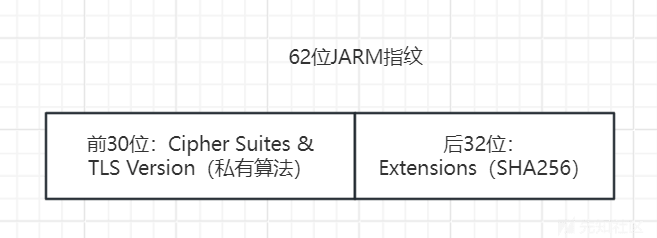](https://xzfile.aliyuncs.com/media/upload/picture/20240215164044-e8d1ff06-cbdd-1.png)

上述计算原理在 Blog 中只给出了简单的原理，并没有做细节的介绍，这里我将通过程序中的源码分析出具体的加密过程，仅供参考，这里我们根据`result`回推  
[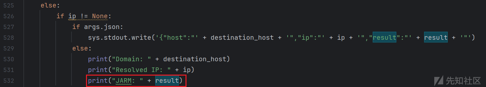](https://xzfile.aliyuncs.com/media/upload/picture/20240215164104-f4749cc4-cbdd-1.png)

可以发现`result`是由`jarm_hash`函数加密而来  
[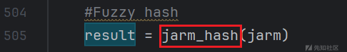](https://xzfile.aliyuncs.com/media/upload/picture/20240215164126-015902cc-cbde-1.png)

继续跟踪`jarm_hash`函数可以发现，当原始格式的 JARM 指纹为全部空时，将返回 62 个 0，不为空时分为四个部分（用`|`隔开）  
[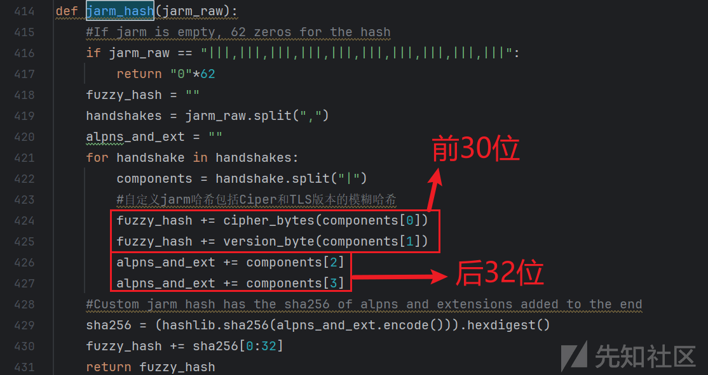](https://xzfile.aliyuncs.com/media/upload/picture/20240215164146-0d7f3616-cbde-1.png)

我们可以使用`-v`参数打开冗余模式看到未计算前的结果

```plain
服务器返回的加密套件 | 服务器返回选择使用的 TLS 协议版本 |  TLS 扩展 ALPN 协议信息 | TLS 扩展列表
```

[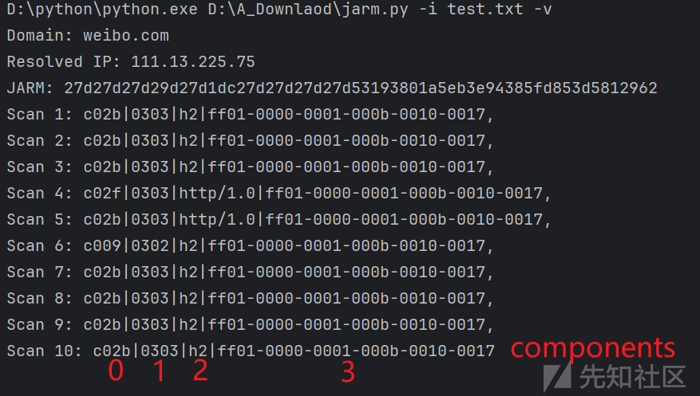](https://xzfile.aliyuncs.com/media/upload/picture/20240215164205-191ac8e6-cbde-1.png)

从这里我们便可以窥见它的算法结构，使用了`cipher_bytes`函数、`version_byte`函数、SHA256 三种方法，分别计算 Cipher Suites、TLS Version、Extensions 三项维度，计算出结果后，依次拼接到`fuzzy_hash`中，形成最后的 JARM 指纹  
[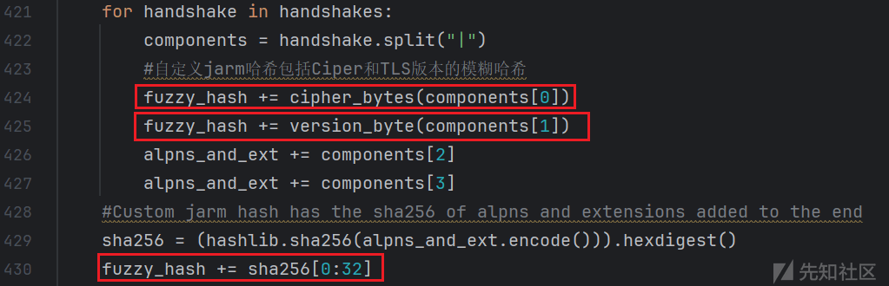](https://xzfile.aliyuncs.com/media/upload/picture/20240215164251-340de0a2-cbde-1.png)

### 前 30 位计算

根据 Blog 可知，JARM 前 30 位的结构如下  
[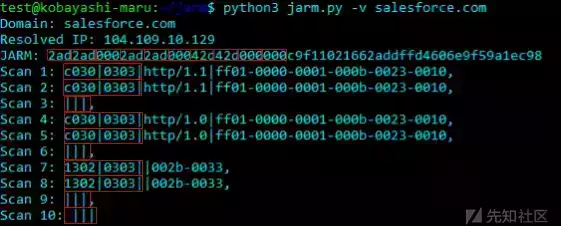](https://xzfile.aliyuncs.com/media/upload/picture/20240215164317-439b9b72-cbde-1.webp)

这里我们使用抓包对程序的探测流量进行分析，可以发现`components`第 0 项和第 1 项的原格式  
[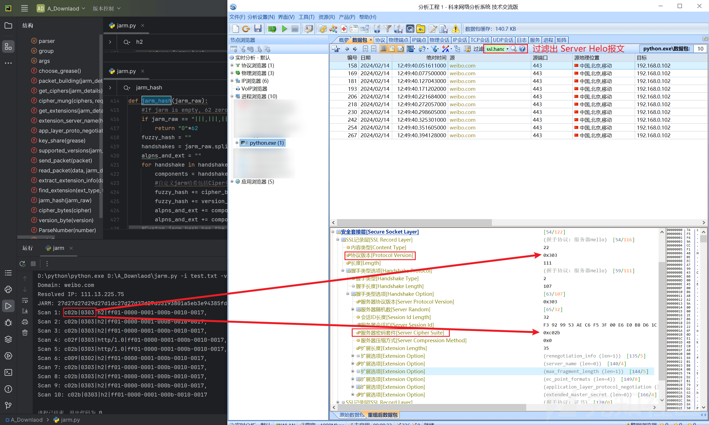](https://xzfile.aliyuncs.com/media/upload/picture/20240215164341-51dbf29a-cbde-1.png)

我们先来分析`cipher_bytes`函数是如何实现的，它的功能是计算`components`的第 0 项（Cipher Suites），首先遍历 list 中的每个字节，将其转换为十六进制字符串，并与 cipher 进行比较，如果为空就返回 00，反之则返回十六进制字符串（去掉`0x`）  
[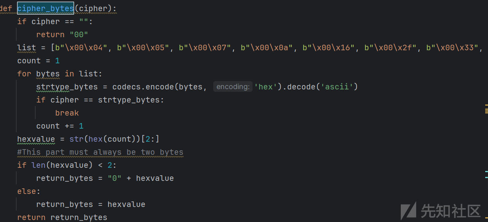](https://xzfile.aliyuncs.com/media/upload/picture/20240215164401-5dcbfa1e-cbde-1.png)

其次是`version_byte`函数，它的功能是计算`components`的第 1 项（TLS Version），如果没有获取到 Version 则返回 0，反之则返回`abcdef`其中一个  
[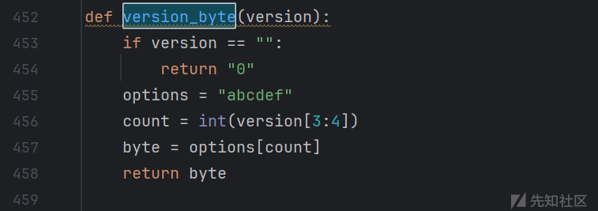](https://xzfile.aliyuncs.com/media/upload/picture/20240215164421-69ff25fe-cbde-1.png)

### 后 32 位计算

后 32 个字符是由 TLS 扩展 ALPN 协议信息和 TLS 扩展列表通过 SHA256 哈希并截取而来，首先拼接`components`的第 2 项和第 3 项到`alpns_and_ext`参数，经过 SHA256 后再拼接到`fuzzy_hash`中，形成完整的 JARM 指纹  
[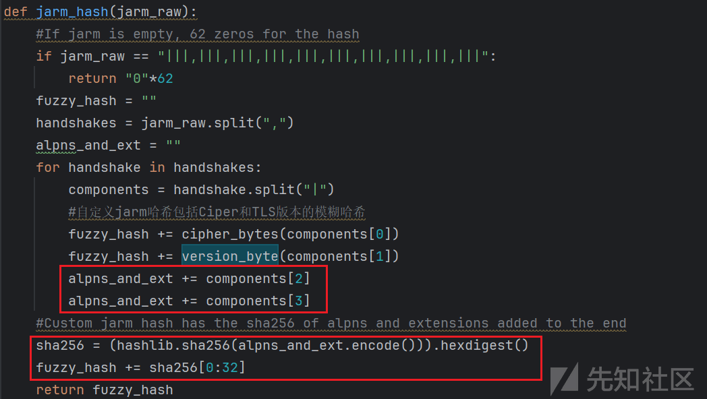](https://xzfile.aliyuncs.com/media/upload/picture/20240215164439-746f1076-cbde-1.png)

## JARM 的短板

在 Blog 中，作者也给出了 JARM 的应用场景，也就是对 C2 的主动探测和识别，并给出了常见 C2 的 JARM 指纹  
[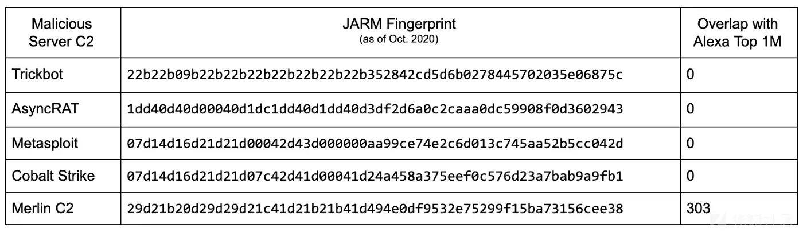](https://xzfile.aliyuncs.com/media/upload/picture/20240215164502-829ddf92-cbde-1.webp)

FOFA 是支持 JARM 指纹搜索的，我们使用结合产品语法对 Cobalt Strike 服务端进行搜集（这里的是早期版本的指纹，保有量少是正常情况）发现只有 13 台机器可以被确定是 Cobalt Strike 的服务端

```plain
jarm="07d14d16d21d21d07c42d41d00041d24a458a375eef0c576d23a7bab9a9fb1" && category="其他安全产品"
```

[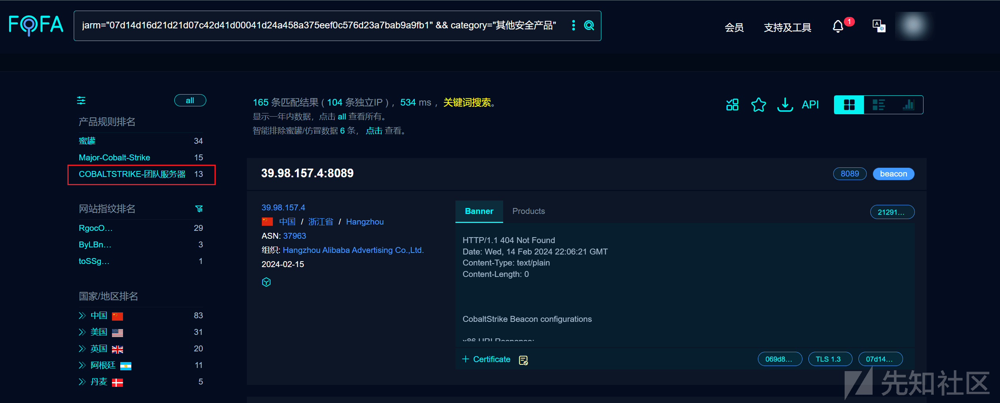](https://xzfile.aliyuncs.com/media/upload/picture/20240215164529-926babde-cbde-1.png)

如果单以 JARM 作为依据搜索，则会出现许多不相关的服务，说明实际情况下，JARM 并不与某一 C2 唯一对应，只能对某一类 TLS 服务器进行探测，对于不同类型的 C2 服务器来说，它们的 JARM 也会随着版本或基础库的变化而变化  
[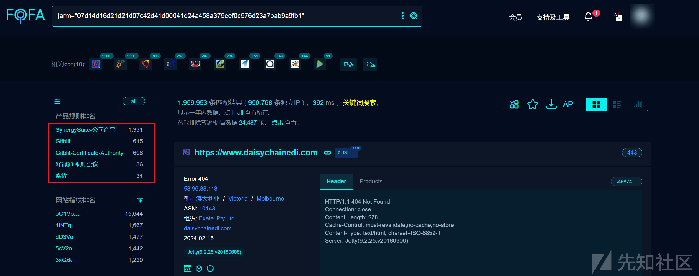](https://xzfile.aliyuncs.com/media/upload/picture/20240215164549-9e54659e-cbde-1.png)

在 Blog 中，研究员也说明了这个问题，它们的解决方案是可以根据其他特征指标进行研判，例如存活时长、名称、托管提供商、证书颁发机构等，所以客观来说，JARM 只是丰富了 IOC 的维度，并提供了一个主动探测的手段，在对某些 APT/勒索/恶意 组织进行资产拓线时，JARM 也许是一个不错的指标，若对此方向感兴趣可以参考[《FOFA 资产拓线实战系列：响尾蛇 APT 组织》](https://mp.weixin.qq.com/s?__biz=MzkyNzIwMzY4OQ==&mid=2247489202&idx=1&sn=3bb931ee03b8eac819a4302060a4a9da&chksm=c22afeb4f55d77a26d4aeee0c6eb3d1da47077ebe88bdb8554068cb4dd73d5f200f711712755&scene=178&cur_album_id=3274530984667119626#rd)一文
