# JADX 安全性研究 - 先知社区

JADX 安全性研究

- - -

研究了 apktool - [https://xz.aliyun.com/t/13354](https://xz.aliyun.com/t/13354)，怎么能不研究一下 jadx~

本文会分析 JADX 的历史漏洞，并对其安全性进行研究

## 历史漏洞

找了一下历史漏洞  
[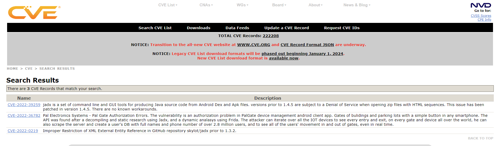](https://cdn.nlark.com/yuque/0/2024/png/21398751/1705645807600-fc0be333-d3d6-4aac-8ae4-458d240c9992.png#averageHue=%23dddad8&clientId=uab4c64a4-1924-4&from=paste&height=370&id=uf5f91625&originHeight=555&originWidth=1893&originalType=binary&ratio=1.5&rotation=0&showTitle=false&size=81580&status=done&style=none&taskId=u01c9efb9-4543-49a1-98ed-04cff7bf547&title=&width=1262)  
其中 CVE-2022-39259 和 CVE-2022-0219 是 JADX 本身的问题  
果不其然 JADX 也存在过 XXE 漏洞（CVE-2022-0219） - [https://huntr.com/bounties/0d093863-29e8-4dd7-a885-64f76d50bf5e/](https://huntr.com/bounties/0d093863-29e8-4dd7-a885-64f76d50bf5e/)  
回到修复前的版本，查看 XML 解析部分  
[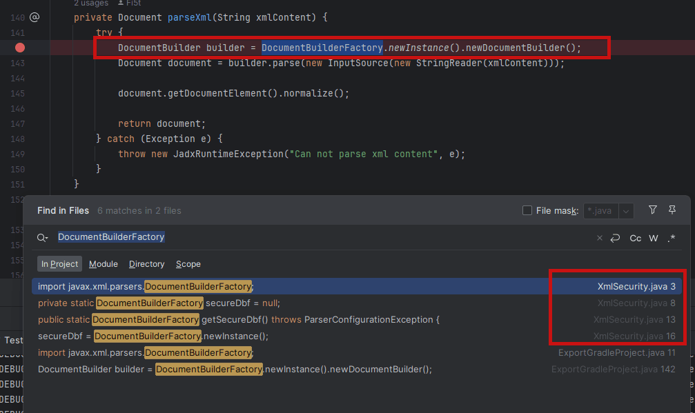](https://cdn.nlark.com/yuque/0/2024/png/21398751/1705993199725-0c0e5c30-94bc-4259-a18d-6a4139a2c1c8.png#averageHue=%23272a30&clientId=u4e8a070e-6809-4&from=paste&height=399&id=udad2e23b&originHeight=599&originWidth=1007&originalType=binary&ratio=1.5&rotation=0&showTitle=false&size=112928&status=done&style=none&taskId=u2f1c6021-c1ce-49f2-bb88-143973660d2&title=&width=671.3333333333334)  
发现其实 XmlSecurity 在这个时候已经实现了，但是在实际解析的时候没有调用 orz

所以修复是通过 [https://github.com/Haxatron/jadx/commit/c6a78c0d6dc990a4a0f8962d51823aa6ca3aefd2](https://github.com/Haxatron/jadx/commit/c6a78c0d6dc990a4a0f8962d51823aa6ca3aefd2)  
调用了自己实现的 XmlSecurity，安全限制的代码为

```plain
public static DocumentBuilderFactory getSecureDbf() throws ParserConfigurationException {
    synchronized (XmlSecurity.class) {
        if (secureDbf == null) {
            secureDbf = DocumentBuilderFactory.newInstance();
            secureDbf.setFeature("http://apache.org/xml/features/disallow-doctype-decl", true);
            secureDbf.setFeature("http://apache.org/xml/features/nonvalidating/load-external-dtd", false);
            secureDbf.setFeature("http://xml.org/sax/features/external-general-entities", false);
            secureDbf.setFeature("http://xml.org/sax/features/external-parameter-entities", false);
            secureDbf.setFeature("http://apache.org/xml/features/dom/create-entity-ref-nodes", false);
            secureDbf.setXIncludeAware(false);
            secureDbf.setExpandEntityReferences(false);
        }
    }
    return secureDbf;
}
```

其中包含了禁用外部 DTD 加载、外部通用实体等操作  
并且需要解析 XML 的地方也调用的是安全方法，没有再自定义实现其他的解析 XML 的方法  
[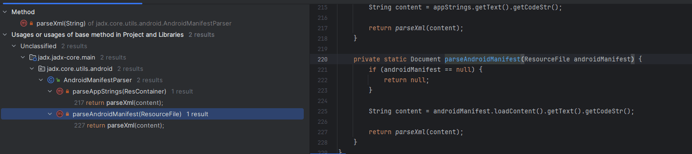](https://cdn.nlark.com/yuque/0/2024/png/21398751/1705987068045-0887c09e-495f-4a72-bf2d-9cd07ac4663e.png#averageHue=%2325282e&clientId=u31084274-dcbd-4&from=paste&height=217&id=u5e085325&originHeight=326&originWidth=1458&originalType=binary&ratio=1.5&rotation=0&showTitle=false&size=80069&status=done&style=none&taskId=u5c89a5dc-d920-4e61-9217-3b40c562f10&title=&width=972)  
看起来这部分确实修补完善了

## 路径穿越任意文件覆盖寻找

那 JADX 上是否会存在路径穿越任意文件覆盖漏洞呢 就像 APKTool 一样，搭建好本地的环境之后进行动态调试  
构造了恶意 APK 发现名字变成了  
[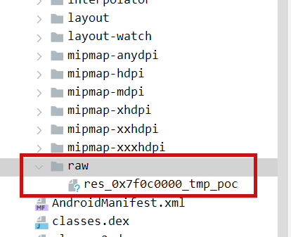](https://cdn.nlark.com/yuque/0/2024/png/21398751/1705821766749-f374751a-d01f-4316-a3c3-1a883d5f2f39.png#averageHue=%23f4edec&clientId=u2d2bc521-4b24-4&from=paste&height=270&id=u0590e6e9&originHeight=337&originWidth=414&originalType=binary&ratio=1.25&rotation=0&showTitle=false&size=15529&status=done&style=none&taskId=u9cacc4c8-a260-4836-855c-0afef2ed0ae&title=&width=331.2)  
全局搜索调用  
[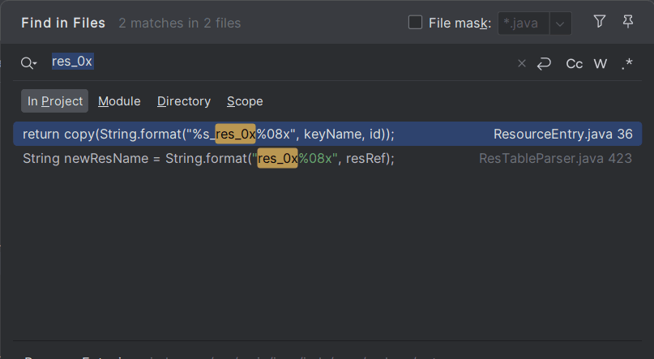](https://cdn.nlark.com/yuque/0/2024/png/21398751/1705821797446-fd0ed63d-83df-453d-9888-e3f44cdac8e0.png#averageHue=%232e3137&clientId=u2d2bc521-4b24-4&from=paste&height=354&id=ue240f1fa&originHeight=443&originWidth=807&originalType=binary&ratio=1.25&rotation=0&showTitle=false&size=40587&status=done&style=none&taskId=u90dbea9e-bf12-4d3e-98c0-93e948d4df0&title=&width=645.6)  
可以看到调用点是 getResAlias 方法

```plain
private String getResAlias(int resRef, String origKeyName, @Nullable FieldNode constField) {
    String name;
    if (constField == null || constField.getTopParentClass().isSynthetic()) {
        name = origKeyName;
    } else {
        name = getBetterName(root.getArgs().getResourceNameSource(), origKeyName, constField.getName());
    }
    Matcher matcher = VALID_RES_KEY_PATTERN.matcher(name);
    if (matcher.matches()) {
        return name;
    }
    // Making sure origKeyName compliant with resource file name rules
    String cleanedResName = cleanName(matcher);
    String newResName = String.format("res_0x%08x", resRef);
    if (cleanedResName.isEmpty()) {
        return newResName;
    }
    // autogenerate key name, appended with cleaned origKeyName to be human-friendly
    return newResName + "_" + cleanedResName.toLowerCase();
}
```

我们构造的恶意 payload 会在这个地方被过滤  
[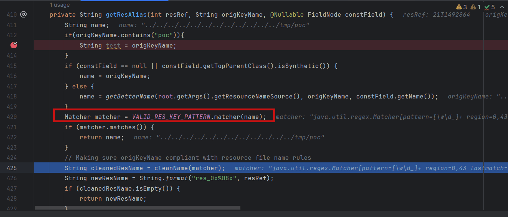](https://cdn.nlark.com/yuque/0/2024/png/21398751/1705827313310-2f6ad31b-6b48-4fcb-a8fa-f5714372c48a.png#averageHue=%2321242b&clientId=u2d2bc521-4b24-4&from=paste&height=467&id=u7986dab7&originHeight=584&originWidth=1359&originalType=binary&ratio=1.25&rotation=0&showTitle=false&size=124805&status=done&style=none&taskId=u5f3a7ddf-949a-4adc-b794-f42e35eeb2e&title=&width=1087.2)  
过滤规则为

```plain
private static final Pattern VALID_RES_KEY_PATTERN = Pattern.compile("[\\w\\d_]+");
```

解释一下这个模式的含义：  
\[\\w\\d\_\]+: 这部分表示匹配一个或多个字符，其中包括以下内容：

-   \\w: 表示任何字母、数字或下划线。相当于字符类\\w。
-   \\d: 表示任何数字。相当于字符类\\d。
-   \_: 表示下划线字符本身。

因此，整个模式表示匹配由字母、数字或下划线组成的一个或多个字符的字符串。在 Java 中，这个正则表达式通常用于验证字符串是否符合特定的命名规则，例如变量名或键名。  
返回修正后的结果  
[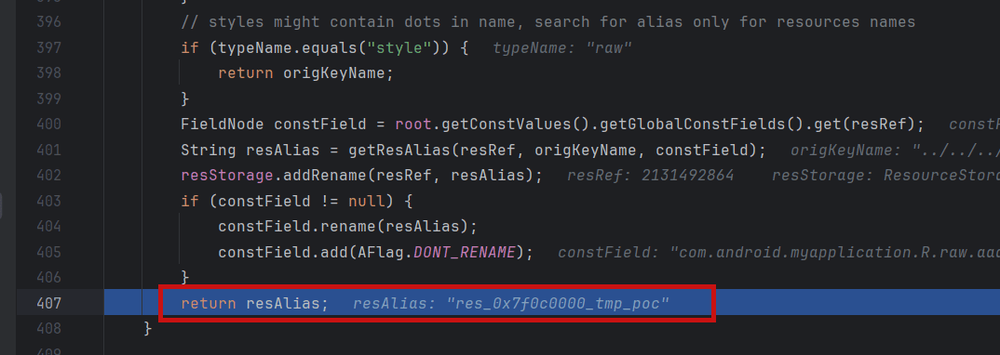](https://cdn.nlark.com/yuque/0/2024/png/21398751/1705827514566-aebdcb16-bd65-4121-9f4d-37afa23c0e92.png#averageHue=%2321252d&clientId=u2d2bc521-4b24-4&from=paste&height=306&id=u2c2ca673&originHeight=382&originWidth=1074&originalType=binary&ratio=1.25&rotation=0&showTitle=false&size=79120&status=done&style=none&taskId=u2eaa435e-549e-4cc4-b649-bac91c8c601&title=&width=859.2)  
所以这部分的目录穿越是被限制了，往回看调用该方法的地方

```plain
private String getResName(String typeName, int resRef, String origKeyName) {
    if (this.useRawResName) {
        return origKeyName;
    }
    String renamedKey = resStorage.getRename(resRef);
    if (renamedKey != null) {
        return renamedKey;
    }
    // styles might contain dots in name, search for alias only for resources names
    if (typeName.equals("style")) {
        return origKeyName;
    }
    FieldNode constField = root.getConstValues().getGlobalConstFields().get(resRef);
    String resAlias = getResAlias(resRef, origKeyName, constField);
    resStorage.addRename(resRef, resAlias);
    if (constField != null) {
        constField.rename(resAlias);
        constField.add(AFlag.DONT_RENAME);
    }
    return resAlias;
}
```

除了 getResAlias 方法外，还有三个地方会直接返回 origKeyName，我们分别看一下这三个地方是否存在漏洞

### useRawResName 属性

[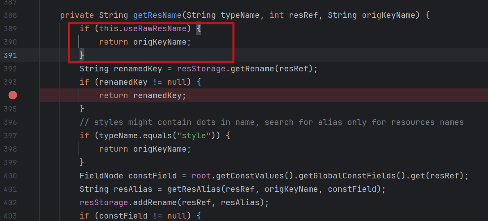](https://cdn.nlark.com/yuque/0/2024/png/21398751/1705898017104-ef3364ef-7019-4f39-a1af-e8726edf2360.png#averageHue=%23212226&clientId=u2d2bc521-4b24-4&from=paste&height=545&id=u7807c9b9&originHeight=545&originWidth=1203&originalType=binary&ratio=1.25&rotation=0&showTitle=false&size=94792&status=done&style=none&taskId=uc5f527db-32e3-41ae-bffe-3bd664510c1&title=&width=1203)  
当 this.useRawResName 为 true 的时候，就会直接返回原始的名字，所以我们查看调用  
第一处是初始化 ResTableParser，调用默认传入的是 false  
[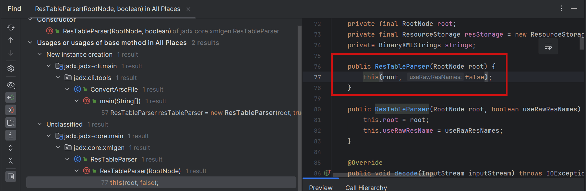](https://cdn.nlark.com/yuque/0/2024/png/21398751/1705898111158-bb6f5594-2d2b-4764-b4bb-00fefef09046.png#averageHue=%23292c30&clientId=u2d2bc521-4b24-4&from=paste&height=590&id=u80fd071a&originHeight=590&originWidth=1807&originalType=binary&ratio=1.25&rotation=0&showTitle=false&size=184162&status=done&style=none&taskId=u5311af62-f672-4fde-8020-569c1a198db&title=&width=1807)  
第二处调用传入是 true，但是看起来是一个测试方法

```plain
public static void main(String[] args) throws IOException {
    .......
    for (Path resFile : inputPaths) {
        LOG.info("Processing {}", resFile);
        ResTableParser resTableParser = new ResTableParser(root, true);
```

所以这里的利用基本上是没办法了，除非有人在集成 jadx 的时候自作聪明的传入了 true

### renamedKey 重命名

[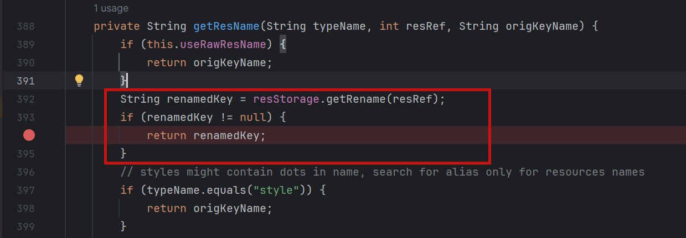](https://cdn.nlark.com/yuque/0/2024/png/21398751/1705899270478-b94a2e3c-aded-436a-877c-1506236d34f6.png#averageHue=%23202226&clientId=u2d2bc521-4b24-4&from=paste&height=431&id=uae79f5cc&originHeight=431&originWidth=1239&originalType=binary&ratio=1.25&rotation=0&showTitle=false&size=66590&status=done&style=none&taskId=uc02c4d79-7509-4238-bf74-5040794437e&title=&width=1239)  
当这个 name 对应的 resRef 在 resStorage 已经存在的时候 就会直接返回它之前的名字  
这个方法为

```plain
public String getRename(int id) {
    return renames.get(id);
}
```

renames 是一个 Map

```plain
private final Map<Integer, String> renames = new HashMap<>();
```

什么情况下 resStorage 会存在 resRef  
[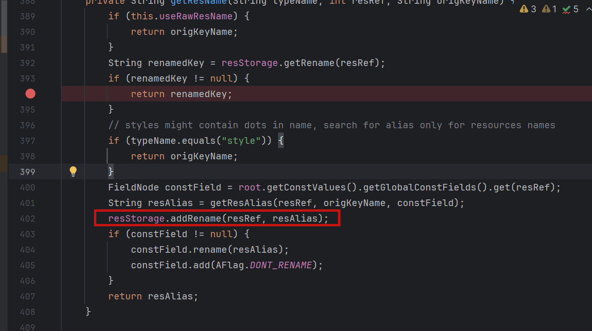](https://cdn.nlark.com/yuque/0/2024/png/21398751/1705899440163-53f95f9e-6d04-4cd7-ba6e-e7dcaf7c1cff.png#averageHue=%23202226&clientId=ubdf54456-1a11-4&from=paste&height=702&id=uf021c5df&originHeight=702&originWidth=1254&originalType=binary&ratio=1&rotation=0&showTitle=false&size=115079&status=done&style=none&taskId=ua3cc5902-0b31-4688-b937-71e6a36a8a9&title=&width=1254)  
对于每一个元素获取了 resAlias 之后 都会以 put 的方式存储到 renames 里面去，getResAlias 方法就是前面我们提到的过滤方法，所以这里即便重复，也是获取的过滤后的名称，无法实现路径穿越

### style 类型

[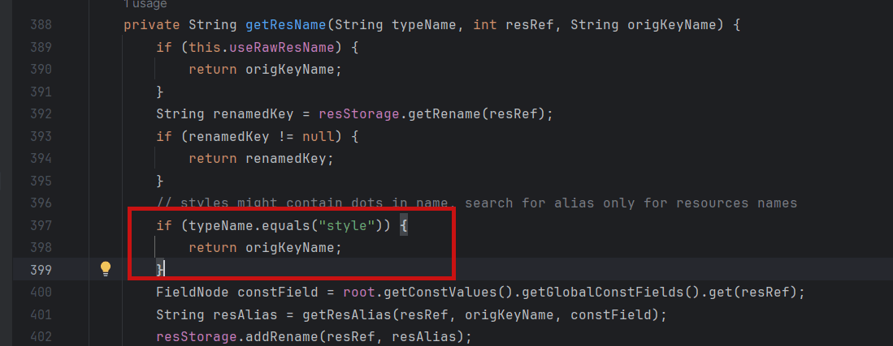](https://cdn.nlark.com/yuque/0/2024/png/21398751/1705828056273-fcd8ae2d-abf6-4905-98fd-8d252ee4308a.png#averageHue=%23202226&clientId=u2d2bc521-4b24-4&from=paste&height=342&id=u6bdd6030&originHeight=427&originWidth=1099&originalType=binary&ratio=1.25&rotation=0&showTitle=false&size=73756&status=done&style=none&taskId=u03322895-d853-4aa5-9c15-a5c71387327&title=&width=879.2)  
这里的注释说因为类型为 style 的文件可能文件名会包含 点，所以不需要过滤就直接返回，那我们可以控制 style 文件来实现目录穿越吗

#### 控制 type 为 style 的文件内容

[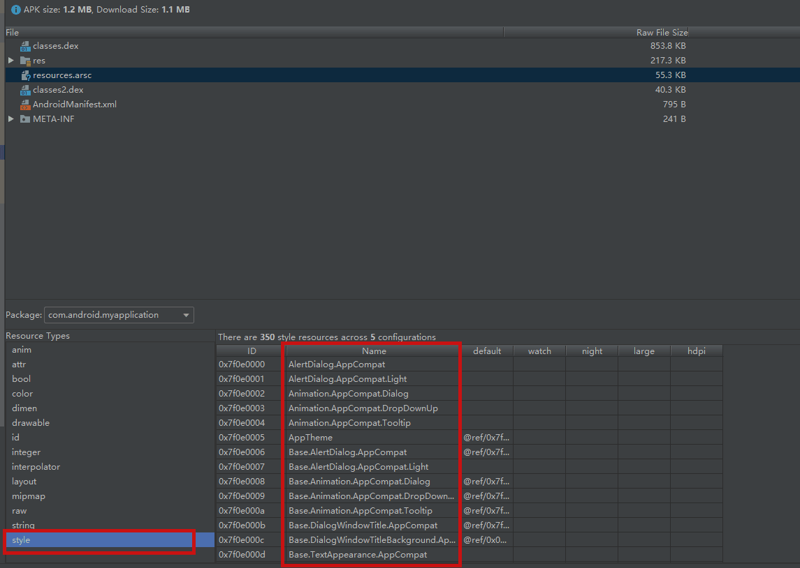](https://cdn.nlark.com/yuque/0/2024/png/21398751/1705899919200-750d170f-5fe9-4b37-9256-fd1e6932b383.png#averageHue=%233b4043&clientId=ubdf54456-1a11-4&from=paste&height=815&id=udf08e8eb&originHeight=815&originWidth=1145&originalType=binary&ratio=1&rotation=0&showTitle=false&size=61539&status=done&style=none&taskId=u3c75d00e-e672-4a0b-8a14-15e9b44e876&title=&width=1145)  
这里的 name 到时候就会直接被 return，问题在于这里的 name 即便我们控制了 也无法造成实质上的危害  
[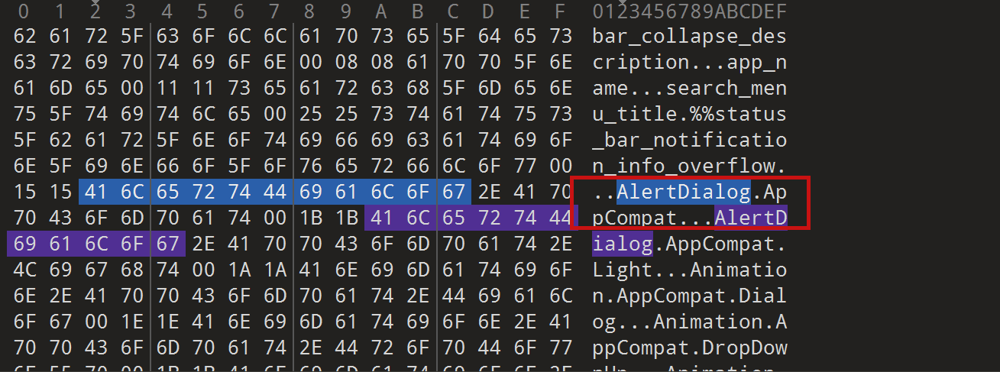](https://cdn.nlark.com/yuque/0/2024/png/21398751/1705900057502-462f4e8a-bde3-47ea-8fb6-6c7dcab94c22.png#averageHue=%23272521&clientId=ubdf54456-1a11-4&from=paste&height=487&id=u16ae35e6&originHeight=487&originWidth=1309&originalType=binary&ratio=1&rotation=0&showTitle=false&size=80355&status=done&style=none&taskId=ua51982e8-a764-40a6-a5ff-9b982aec370&title=&width=1309)  
我们修改这部分  
[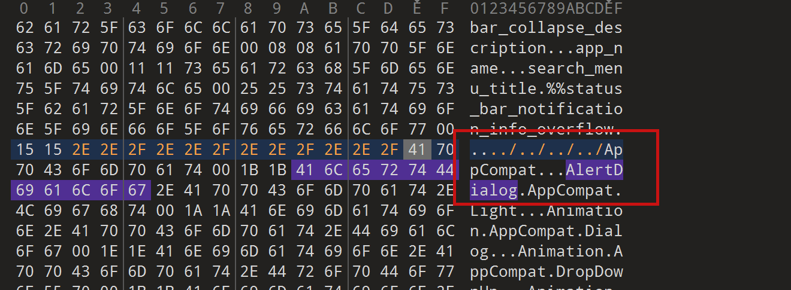](https://cdn.nlark.com/yuque/0/2024/png/21398751/1705900078222-2261bed5-33c4-4e0f-86fa-f60651aff275.png#averageHue=%23272521&clientId=ubdf54456-1a11-4&from=paste&height=485&id=u149eea08&originHeight=485&originWidth=1320&originalType=binary&ratio=1&rotation=0&showTitle=false&size=77914&status=done&style=none&taskId=u6f9e0a00-8076-438b-a970-1a0214a47c4&title=&width=1320)  
现在这部分变成了  
[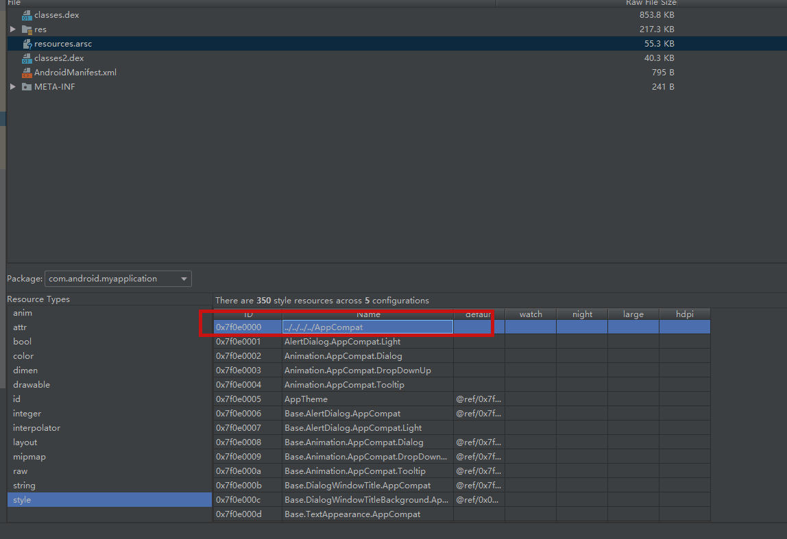](https://cdn.nlark.com/yuque/0/2024/png/21398751/1705900144355-b94e0fc9-2667-4a47-9c8f-ffd2fefaadf8.png#averageHue=%233b4045&clientId=ubdf54456-1a11-4&from=paste&height=787&id=u2e884299&originHeight=787&originWidth=1148&originalType=binary&ratio=1&rotation=0&showTitle=false&size=58056&status=done&style=none&taskId=ube2557dd-7f04-4682-95c0-b62c9cbc9c8&title=&width=1148)  
使用 JDAX，可以看到因为我们控制的不是整个文件的名字 而是 style 加载的 name，所以无法实现攻击  
[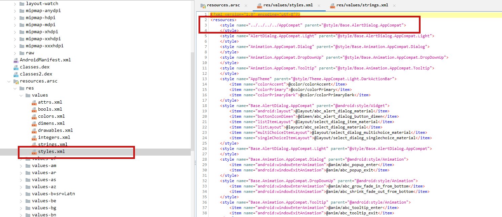](https://cdn.nlark.com/yuque/0/2024/png/21398751/1705900259248-306f4ec8-0222-416e-a8cf-a1158fd781a0.png#averageHue=%23fbf7f5&clientId=ubdf54456-1a11-4&from=paste&height=647&id=u32a036d5&originHeight=647&originWidth=1492&originalType=binary&ratio=1&rotation=0&showTitle=false&size=124226&status=done&style=none&taskId=ua16be4ed-e945-4f77-96df-c4b2ca38a36&title=&width=1492)

## 将 raw 文件的类型改为 style（鸡肋的安全问题）

这部分需要分析 resources.arsc 文件结构  
resources.arsc 是 Android 编译后生成的产物，是一个二进制文件，主要用来建立资源映射关系，其内部结构的定义在 ResourceTypes.h 文件中有详细的描述，文件的详细结构图已经有人画好了  
[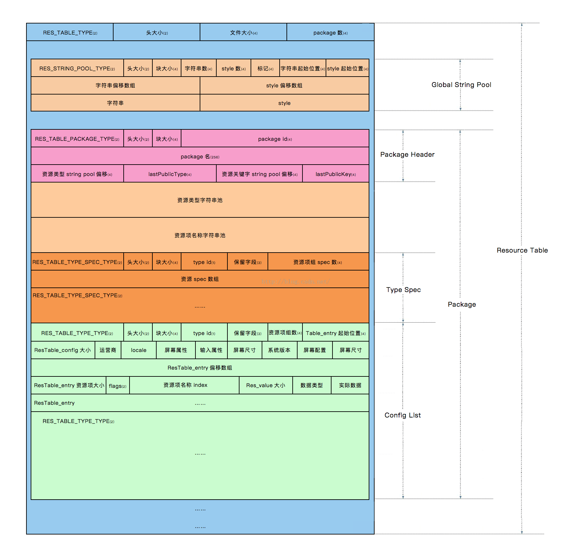](https://cdn.nlark.com/yuque/0/2024/png/21398751/1705908477850-d5410f36-9449-49f3-8eb1-62d5ac750d07.png#averageHue=%23f7b780&clientId=ua24469d6-bd66-4&from=paste&id=ue11619a2&originHeight=1706&originWidth=1796&originalType=url&ratio=1&rotation=0&showTitle=false&size=321083&status=done&style=none&taskId=u08922317-e844-4ba4-ac6d-1fdf017042c&title=)  
这里的二进制文件我们使用 010editor 进行分析，可以下载一个 AndroidResource.bt 模板方便查看结构  
[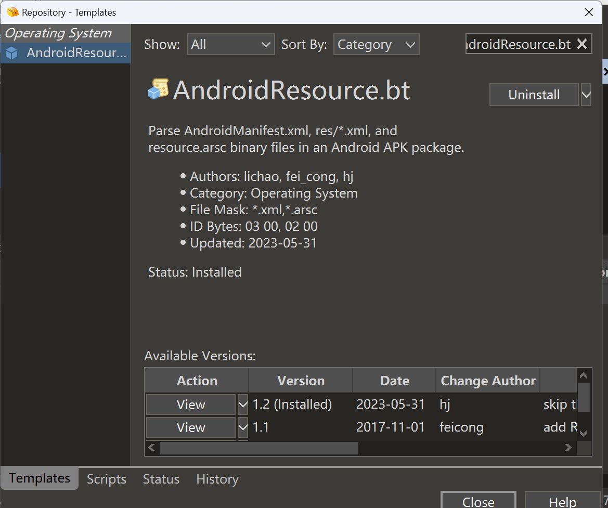](https://cdn.nlark.com/yuque/0/2024/png/21398751/1705995140749-d7b306e4-0ddd-418c-96f9-fe4272fdbfbb.png#averageHue=%23373632&clientId=u560a1082-7a09-4&from=paste&height=977&id=u11309048&originHeight=977&originWidth=1169&originalType=binary&ratio=1&rotation=0&showTitle=false&size=77334&status=done&style=none&taskId=u772771a8-0599-4358-9468-b4a4c882507&title=&width=1169)  
resources.arsc 在文件中的分布采用的是小端存储的分布方式，文件的每一个部分都由一个 chunk 结构打头，通过 chunk 中的 type 可以知道这一个 chunk 是什么类型，从而进行不同的解析。  
对应关系在 ResourceTypes.h [https://cs.android.com/android/platform/superproject/+/master:frameworks/base/libs/androidfw/include/androidfw/ResourceTypes.h](https://cs.android.com/android/platform/superproject/+/master:frameworks/base/libs/androidfw/include/androidfw/ResourceTypes.h)  
比如一开始的 0002  
[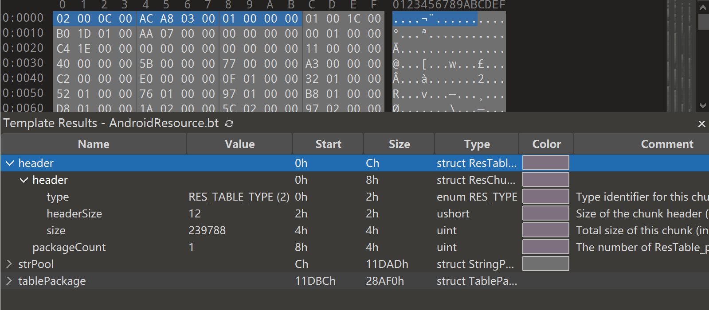](https://cdn.nlark.com/yuque/0/2024/png/21398751/1705995163083-9d62db27-6319-48d0-9069-50f54d15b03f.png#averageHue=%233a3833&clientId=u560a1082-7a09-4&from=paste&height=700&id=uc6bb0dcc&originHeight=700&originWidth=1599&originalType=binary&ratio=1&rotation=0&showTitle=false&size=93046&status=done&style=none&taskId=udc0e940e-e4db-464e-b015-147c4bfd60f&title=&width=1599)  
对应的就是 RES\_TABLE\_TYPE  
[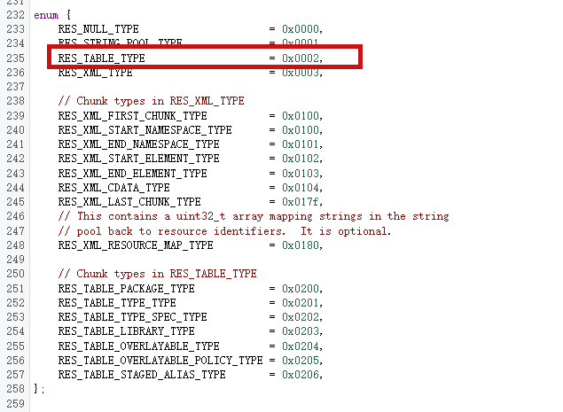](https://cdn.nlark.com/yuque/0/2024/png/21398751/1705995388544-04f947c6-d83e-4d4c-b0e2-2fc0a049b3a9.png#averageHue=%23f5f1f1&clientId=u560a1082-7a09-4&from=paste&height=465&id=u83ea63cf&originHeight=465&originWidth=635&originalType=binary&ratio=1&rotation=0&showTitle=false&size=16080&status=done&style=none&taskId=u25e89a48-1cff-4b0c-b017-7df4b406174&title=&width=635)  
这里 010editor 的模板也为我们解析了  
[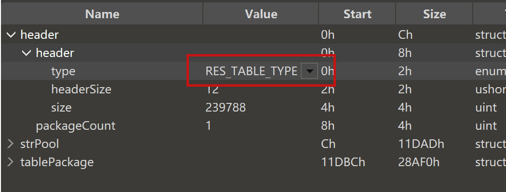](https://cdn.nlark.com/yuque/0/2024/png/21398751/1705995426215-b8aabb35-68fa-47a4-b642-06aa8037fbe2.png#averageHue=%23464340&clientId=u560a1082-7a09-4&from=paste&height=401&id=u5d50aaca&originHeight=401&originWidth=1050&originalType=binary&ratio=1&rotation=0&showTitle=false&size=26089&status=done&style=none&taskId=ud9ace0a8-b6d7-4e99-bb78-148c21560c7&title=&width=1050)  
找到我们想要修改的 attack\_file 的类型（这里的文件类型和它的文件内容所在的区块不是在一起的，但是会存在映射关系，如果没有 010editor 的模板，手动去找很难找到，模板寻找的原理是通过起始位置和偏移量去计算的）  
[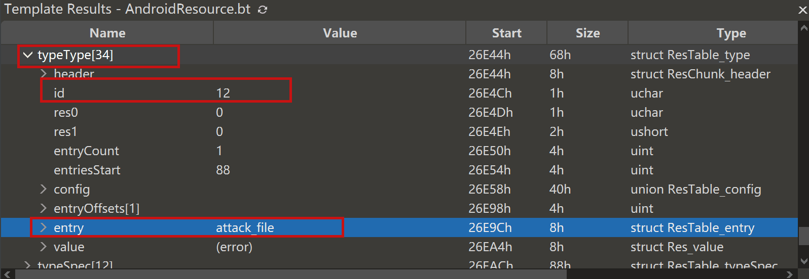](https://cdn.nlark.com/yuque/0/2024/png/21398751/1705998190621-565a0132-bbbb-46cd-be8f-daae09cb7cbe.png#averageHue=%233d3b37&clientId=u560a1082-7a09-4&from=paste&height=552&id=u0e13474c&originHeight=552&originWidth=1596&originalType=binary&ratio=1&rotation=0&showTitle=false&size=53890&status=done&style=none&taskId=u8e1b3339-db28-4cd5-8cf6-e185785278b&title=&width=1596)  
id 值会对应其类型 id 为 12 也就是 0c,0c 就是指 raw 类型  
[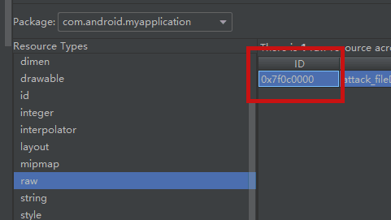](https://cdn.nlark.com/yuque/0/2024/png/21398751/1705998251719-b4bd720f-643b-4f90-b073-49bf57c3be85.png#averageHue=%233e434a&clientId=u560a1082-7a09-4&from=paste&height=271&id=ue5844653&originHeight=271&originWidth=481&originalType=binary&ratio=1&rotation=0&showTitle=false&size=10893&status=done&style=none&taskId=u32cc32d8-302b-4a62-b2f7-f3bb0cb2535&title=&width=481)  
跟 AndroidStudio 的 APK 分析器得到的 ID 是对应的  
将这部分对应修改为 0E，0E 就是指 style 类型，最后得到  
[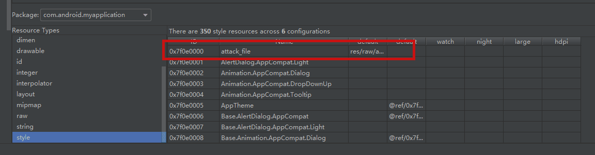](https://cdn.nlark.com/yuque/0/2024/png/21398751/1705998372117-35956af4-8350-4583-a75f-ab4831cd4d58.png#averageHue=%233d4145&clientId=u560a1082-7a09-4&from=paste&height=301&id=uaca78c30&originHeight=301&originWidth=1152&originalType=binary&ratio=1&rotation=0&showTitle=false&size=31401&status=done&style=none&taskId=ua2c65ebd-3f8a-48ec-85bb-3e631c02629&title=&width=1152)  
修改之后重新打包，这个时候 debug 也可以看到 jadx 把我们当作了 style  
[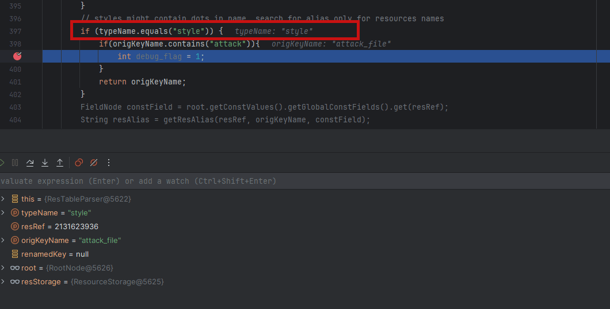](https://cdn.nlark.com/yuque/0/2024/png/21398751/1705998612678-2f936af4-0bad-4216-bf9a-54cc44ff79a8.png#averageHue=%23272a30&clientId=u560a1082-7a09-4&from=paste&height=538&id=u6114e521&originHeight=538&originWidth=1060&originalType=binary&ratio=1&rotation=0&showTitle=false&size=68867&status=done&style=none&taskId=ue82b5914-adf8-4888-b71b-ad0ca86e8b8&title=&width=1060)  
构造一个 ../../hfile，JADX解析之后变成了  
[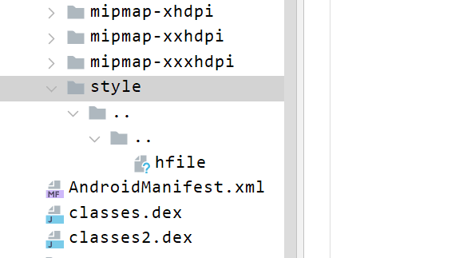](https://cdn.nlark.com/yuque/0/2024/png/21398751/1706006075756-c37393b7-08bd-404c-9c87-eea1ad50c67c.png#averageHue=%23f7f6f5&clientId=u560a1082-7a09-4&from=paste&height=323&id=u5518cd55&originHeight=323&originWidth=575&originalType=binary&ratio=1&rotation=0&showTitle=false&size=12497&status=done&style=none&taskId=u629618d2-a315-40b6-917e-59c0babac2d&title=&width=575)  
但是这个时候好像是保存在内存里面，找不到这个文件，所以我选直接保存  
[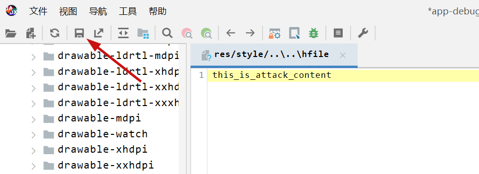](https://cdn.nlark.com/yuque/0/2024/png/21398751/1706006110973-67a9c3ce-2281-4029-a880-263865868364.png#averageHue=%23f5f3ef&clientId=u560a1082-7a09-4&from=paste&height=351&id=u6ceb493e&originHeight=351&originWidth=963&originalType=binary&ratio=1&rotation=0&showTitle=false&size=29001&status=done&style=none&taskId=ucb343d55-bd4e-4e00-b51c-763a78acb35&title=&width=963)  
保存之后变成了  
[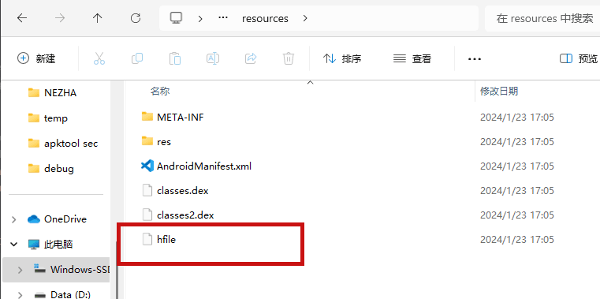](https://cdn.nlark.com/yuque/0/2024/png/21398751/1706005886105-f7558c2d-0933-4f6c-ac2a-1ad3e48edd5d.png#averageHue=%23faf8f7&clientId=u560a1082-7a09-4&from=paste&height=379&id=u45ff034a&originHeight=379&originWidth=761&originalType=binary&ratio=1&rotation=0&showTitle=false&size=25481&status=done&style=none&taskId=u90211782-808e-473b-b2ad-a7cae7b4b89&title=&width=761)  
激动的手颤抖的心~  
和 Red256 一起开起了香槟（事实证明不应该半场开香槟~  
尝试进行更大的路径穿越，因为在对代码 debug 调试的过程中发现 jadx 是会先运行到 temp 目录下生成一个临时文件夹 路径大概是这样的

> C:\\Users\\用户名\\AppData\\Local\\Temp\\jadx-instance-5750059918677153939

按照我们前面的理论，虽然这里是临时文件夹 但是如果能够正常穿越出来，那么就能在这个文件夹被删除之前让恶意文件逃逸出来，实现任意文件的覆盖  
所以构造一个 ..........\\hiiiiiiii，让它刚好能穿越到 Temp 目录下 来逃脱被删除的命运  
结果试了好几次不行，最后发现导出的时候会报错，nmd  
[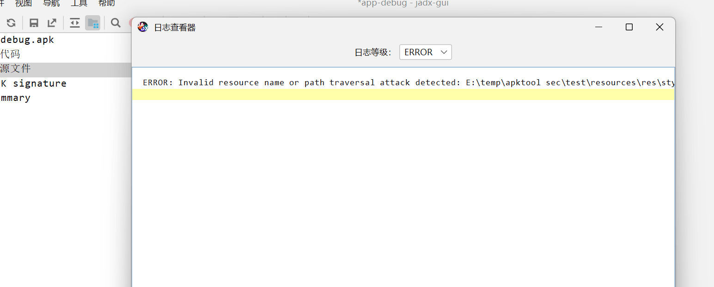](https://cdn.nlark.com/yuque/0/2024/png/21398751/1706006426386-28601e9b-af20-46f9-9bce-b874ad860651.png#averageHue=%23f8f8f7&clientId=u560a1082-7a09-4&from=paste&height=623&id=uf0b49e96&originHeight=623&originWidth=1545&originalType=binary&ratio=1&rotation=0&showTitle=false&size=33719&status=done&style=none&taskId=uce0d380b-32e5-498e-b2b4-13ce336bbe0&title=&width=1545)  
完整报错为

> ERROR: Invalid resource name or path traversal attack detected: E:\\temp\\apktool sec\\test\\resources\\res\\style..........\\hiiiiiiiiiiiii

搜索代码里面的检测方法为  
[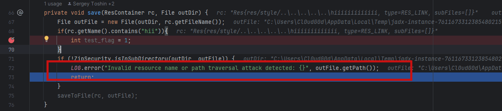](https://cdn.nlark.com/yuque/0/2024/png/21398751/1706006537159-10c3b0d4-ad9b-47ce-bd79-0ea7fe2d9672.png#averageHue=%2321262f&clientId=u560a1082-7a09-4&from=paste&height=265&id=u6331a4a1&originHeight=265&originWidth=1198&originalType=binary&ratio=1&rotation=0&showTitle=false&size=68842&status=done&style=none&taskId=u364dbed4-0b04-4a15-aa19-31793d7572e&title=&width=1198)  
具体的检测代码为

```plain
private static boolean isInSubDirectoryInternal(File baseDir, File file) {
    File current = file;
    while (true) {
        if (current == null) {
            return false;
        }
        if (current.equals(baseDir)) {
            return true;
        }
        current = current.getParentFile();
    }
}
```

将需要保存的路径跟根路径进行对比，如果不相同 则获取保存路径的父目录 继续对比，直到相同 或者目录为 null  
Java 是强类型语言 这里的 equals 没啥绕过的可能性，前面的 baseDir 也无法自定义，一眼为寄  
所以最后这个就是一个只能够覆盖 resources 文件夹下的任意文件的鸡肋问题，报告给 skylot 后在 JADX 的最新版本上已经对该问题进行了修复  
[https://github.com/skylot/jadx/commit/d86449a8ea26381d0ce6fafaed7deb7542dfd70b](https://github.com/skylot/jadx/commit/d86449a8ea26381d0ce6fafaed7deb7542dfd70b)

## 参考链接

-   [https://github.com/Haxatron/CVE-2022-0219](https://github.com/Haxatron/CVE-2022-0219)
-   [https://juejin.cn/post/6844903911602683918](https://juejin.cn/post/6844903911602683918)
-   [https://huntr.com/bounties/0d093863-29e8-4dd7-a885-64f76d50bf5e/](https://huntr.com/bounties/0d093863-29e8-4dd7-a885-64f76d50bf5e/)
-   [https://blog.yorek.xyz/android/3rd-library/andresguard/#2-resourcesarsc](https://blog.yorek.xyz/android/3rd-library/andresguard/#2-resourcesarsc)
-   [https://www.jianshu.com/p/60ce4bf20f72](https://www.jianshu.com/p/60ce4bf20f72)
