# JavaScript 混淆防护与调试技术探析 - 先知社区

JavaScript 混淆防护与调试技术探析

- - -

JavaScript 逆向在 CTF 和挖洞的过程中都碰得比较多，本篇文章将帮助读者从 0 开始学习 Js 的使用、Js 的混淆与加密、Js 的反调试、以及最后会进行 Js 逆向实战

- - -

# JavaScript 的渊源

## Just for Client

JavsScript 被开发的初衷就是为了能直接在客户端运行

-   JavaScript 最初是由 Brendan Eich 于 1995 年为 Netscape 浏览器开发的，目的是为了让网页能够具有交互性。当时，Web 浏览器只能显示静态文本和图像，而 JavaScript 的出现使得网页能够实现**动态效果**
    
    这里的动态效果并非是指如今`CS`或`BS`架构实现的动态网站，而是指通过 JavaScript 实现的网页动态效果，例如：
    
    -   鼠标悬停在某个元素上时，显示提示信息
    -   用户提交表单后进行数据验证
    -   页面加载完成后动态加载内容

### in Browser - BS Arch

JavaScript 在浏览器渲染页面的过程中解析步骤如下：

-   `<script>`标签：当 HTML 解析器遇到`<script>`时，根据`<script>`标签的属性`async`、`defer`或无，决定如何加载和执行 JavaScript
    
-   JavaScript 引擎处理：JavaScript 引擎（如 Chrome 的 v8 引擎）根据`<script>`的加载方式处理 JavaScript 代码
    
    -   无`async`或`defer`：立即加载并执行 JavaScript，这可能会阻断 HTML 的解析
        
    -   `async`属性：JavaScript 异步加载，同时 HTML 解析器继续解析 HTML
        
        一旦 JavaScript 加载完成，它会立即执行，可能在 HTML 解析完成之前
        
    -   `defer`属性：也是 JavaScript 异步加载，但只在 HTML 文档完成解析完成后按顺序执行
        

[](https://mayss.oss-cn-beijing.aliyuncs.com/image/js.png)

在这个过程中，除开 JavaScript 本身的攻击面，还有 Js 引擎的攻击面，比如 Google Chrome V8 CVE-2024-0517 漏洞

详细可以看**知道创宇 404 实验室翻译组**的文章：[https://paper.seebug.org/3113/#51](https://paper.seebug.org/3113/#51)

### in App - CS Arch

在 App 中，JavaScript 能玩的就比较多了

在 IOS 下，有`ShadowRocket、Quantumulu X`这些能注入 JS 修改请求和响应的工具，它们的工作流程大致如下

[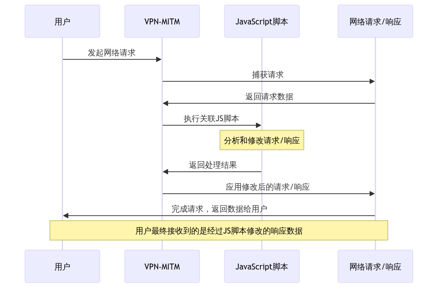](https://mayss.oss-cn-beijing.aliyuncs.com/image/xres.png)

在这种架构下，如上述提到的两种工具可以进行 MITM 中间人攻击，这时候能实现的就比较多了

比较多的就是通过注入 JS 去除 APP 开屏广告、冗余功能和绕过一些限制

以笔者在大学期间对某款校园卡 APP 的广告删除和校园卡手机号登录限制的绕过写的 JS 脚本为例

```plain
if($response.status!=200)
    $done({});
try {
    body = JSON.parse($response.body);
} catch(e) {
    $done({});
}    
action = $request.url.split("?",2)[0].split("net/",2)[1];
switch(action) {
    case "v2/banner/getBanner": // 去广告位
            body["data"] = {};
            backData(body);
        break;
    case "v2/base/schoolBusinessList": // 去校园卡限制
            tmp = body["data"]
            tmp.forEach((item,index)=>{
                tmp[index]["power"] = 1;
            });
            body["data"] = tmp;
            $notification.post("操作已完成", "", "你现在可以关闭代理了")
            backData(body);
        break;
    // 去话题，评论，视频
    case "v2/topic/getTopictList":
    case "v2/topic/getTopicComment2":
    case "v2/topic/getNextTopicVideo":
    case "v2/topic/getTopicDetail":
            body["data"] = [];
            backData(body);
        break;
    case "v2/base/homebutton": // 首页按钮净化
            button = [];
            tmp = body["data"];
            tmp.forEach((item)=>{
                item.botton.forEach((item2)=>{
                    switch(item2.bt_name){
                        case "开门":case "洗衣机": 
                        case "直饮水": case "洗澡":
                            button.push(item2);
                        break;
                        case "充值":
                            item2["bt_name"] = "电费充值";
                            item2["business_code"] = "dian"
                            button.push(item2);
                        break;
                    }
                });
            });
            body["data"] = [{
                "botton" : button,
                "group_name" : "自定义"
            }];
            backData(body);
        break;
}
function backData(data){
    $done({
        status : 200,
        headers : $response.headers,
        body : JSON.stringify(data)
    })
}
```

这款 APP 限制了只允许使用校园卡手机号进行登录，不登录的话热水、开门禁等功能都用不了，而校园卡的资费又比较贵，于是分析后编写了这段代码绕过了登录限制以及去除没用的功能和广告，它的执行流程如下

[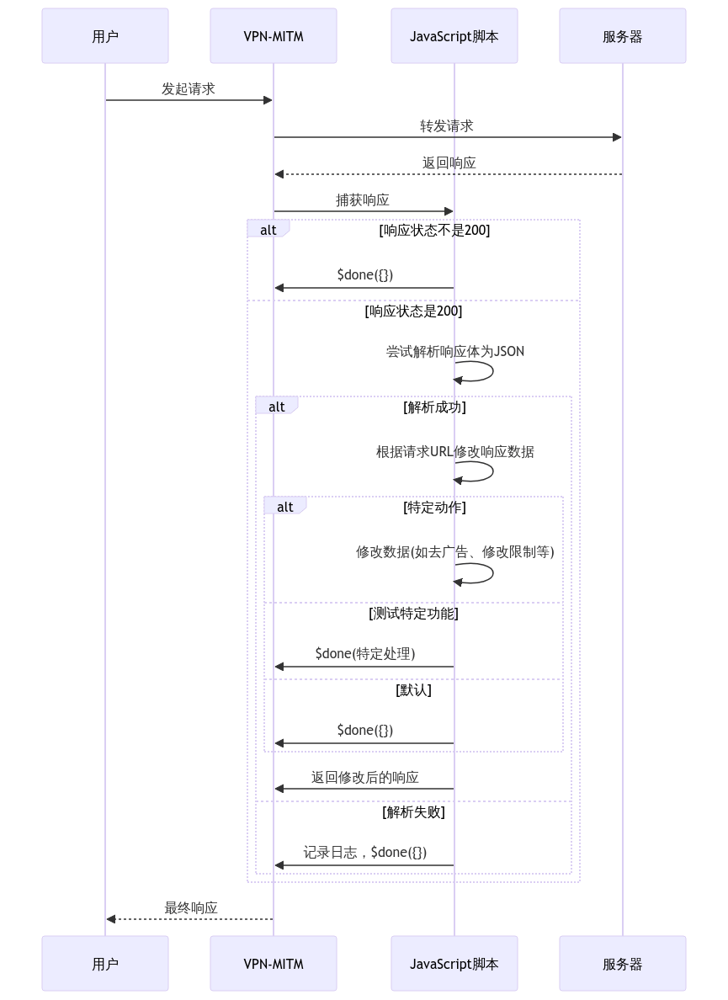](https://mayss.oss-cn-beijing.aliyuncs.com/image/mitm.png))

- - -

JavaScript 还有相当多的应用领域，这里只提及我们用得比较多的场景

# JavaScript Obfuscation - 混淆

JavaScript Obfuscation（混淆）是通过一系列的技术手段降低 JavaScript 代码的可读性和易分析性，目的是为了阻止逆向工程和防止代码被盗用，保护了 JS 代码。

如果不做处理则完全公开透明，任何人都可以读、分析、复制、盗用，甚至篡改源码与数据，这是网站开发者不愿意看到的。

## Js 压缩 - 混淆的起源

早期的 JavaScript 代码因功能有限、逻辑简明且体积较小，无需特别保护

但随着技术的发展，JS 承担的功能越来越多，文件体积增大

为了优化用户体验，开发者们想了很多办法去减小 JS 文件体积，以加快 HTTP 传输速度

JS 压缩（Minification）技术应运而生

常见的 JS 压缩方法有很多：

### 删除不影响代码执行的字符串

空格、换行和注释会增加文件的体积，删除这些字符可以减小文件体积

[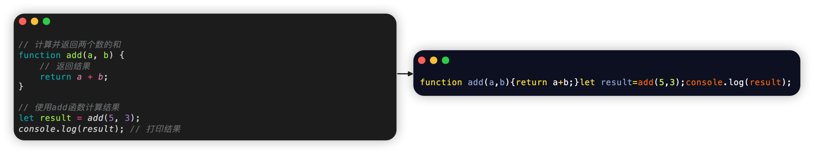](https://mayss.oss-cn-beijing.aliyuncs.com/image/image-20240223202147389.png)

### 替换局部变量名

替换 JavaScript 代码中的局部变量名为更短的名称，以达到减少文件大小的目的。

这种方法通常由自动化工具执行，以避免手动重命名导致的错误。

[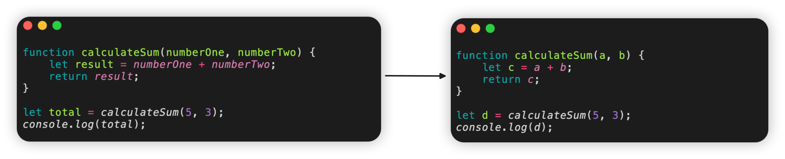](https://mayss.oss-cn-beijing.aliyuncs.com/image/image-20240223202225024.png)

### 合并 JS 文件

将多个 JS 文件合并成一个文件，这样做减少了 HTTP 请求的数量，进一步提高了页面加载速度。但这种方法需要注意依赖管理，确保脚本按正确的顺序执行。

[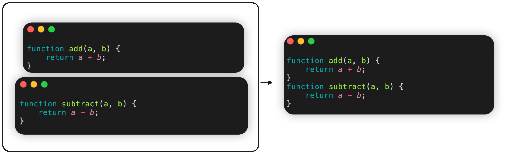](https://mayss.oss-cn-beijing.aliyuncs.com/image/image-20240223201959848.png)

### 移除死代码

删除那些实际上在应用程序中从未被调用或使用的代码。

[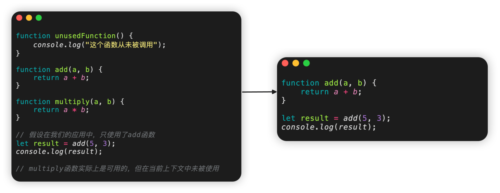](https://mayss.oss-cn-beijing.aliyuncs.com/image/image-20240223202652073.png)

在实际开发中，手动识别和移除死代码可能非常耗时且容易出错。不过有一些工具和技术可以自动帮助开发者完成这项工作，最常见的包括：**Webpack Tree Shaking**、**UglifyJS/Terser**、**Google Closure Compiler**

### 使用短语法

-   使用逻辑运算符简化条件表达式

通过逻辑运算符（如`&&`和`||`）可以简化某些条件表达式，压缩代码量

[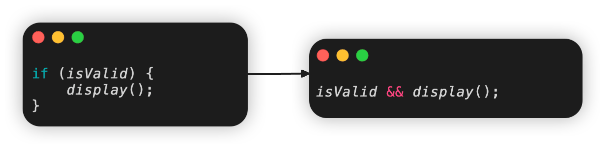](https://mayss.oss-cn-beijing.aliyuncs.com/image/image-20240224133119509.png)

-   使用模板字符串代替字符串连接

模板字符串提供了一种更简洁的方式来构造字符串

[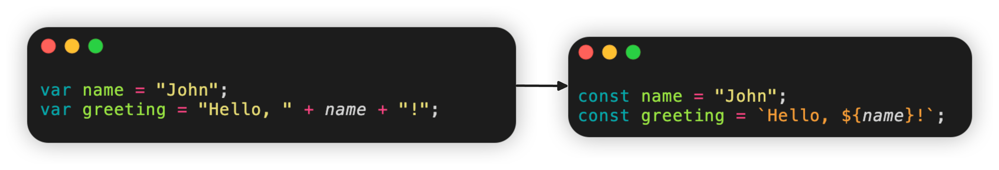](https://mayss.oss-cn-beijing.aliyuncs.com/image/image-20240224133337133.png)

-   使用箭头函数简化函数表达式

箭头函数提供了一种更简洁的方式来编写函数表达式，特别是对于单行函数体。

[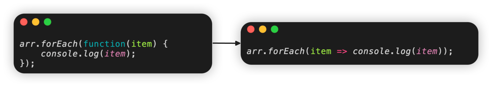](https://mayss.oss-cn-beijing.aliyuncs.com/image/image-20240224133450358.png)

-   使用默认参数值

[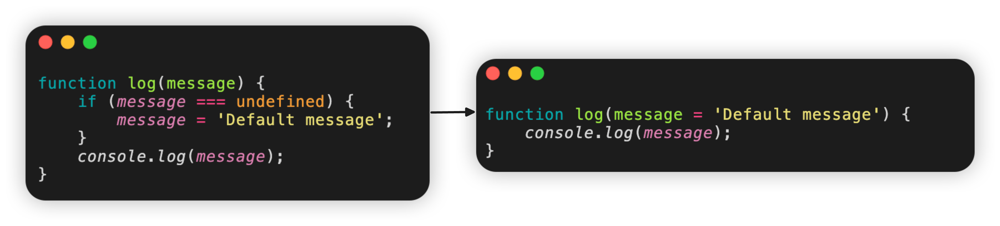](https://mayss.oss-cn-beijing.aliyuncs.com/image/image-20240224133601888.png)

-   使用解构赋值

[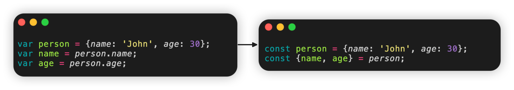](https://mayss.oss-cn-beijing.aliyuncs.com/image/image-20240224133732436.png)

### 预编译模板

假设我们有一个简单的模板，用于显示用户信息，在预编译过程中，这个模板会被转换成 JavaScript 函数：

[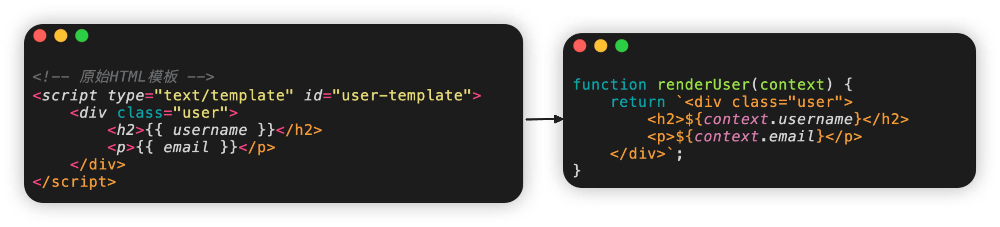](https://mayss.oss-cn-beijing.aliyuncs.com/image/image-20240224134040277.png)

### 使用 CDN 引入 js

比较常见的就是 jQuery、Vue 等框架的使用，通过 cdn 引入就可以很好的减少代码体积

[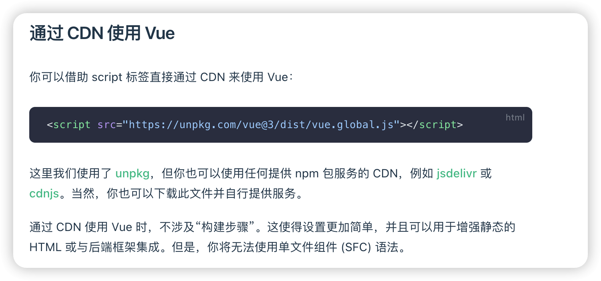](https://mayss.oss-cn-beijing.aliyuncs.com/image/image-20240224134316078.png)

- - -

Js 压缩的手段起初只是为了减小 Js 文件大小，但这种方法间接的降低了代码的可读性，也对 js 代码产生了一定的保护作用

但随着主流浏览器开发者工具提供了格式化 Js 代码的功能，这种通过压缩的方式来保护代码的方式开始变得微不足道

[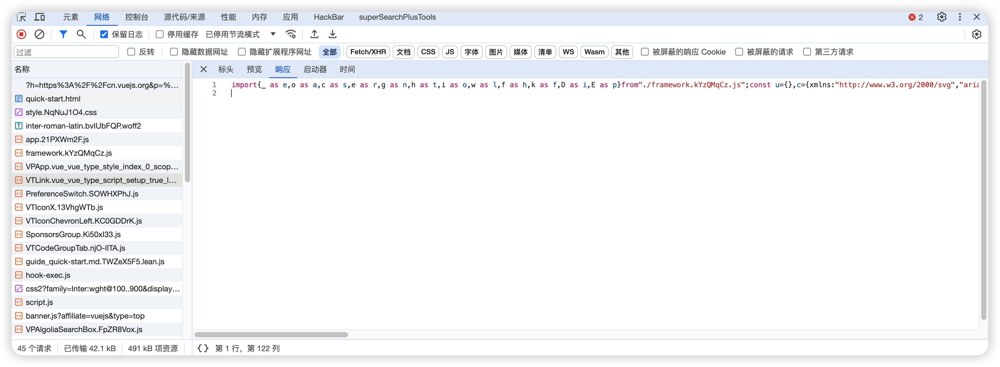](https://mayss.oss-cn-beijing.aliyuncs.com/image/image-20240224134755752.png)

[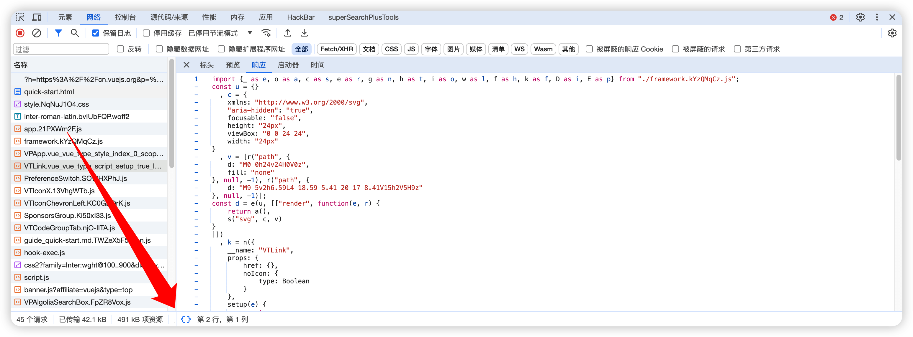](https://mayss.oss-cn-beijing.aliyuncs.com/image/image-20240224134815473.png)

## Obfuscator 混淆

混淆的目的在于保护代码，那么如何保护代码？其实归纳起来就两点：

-   使 Js 代码不可读，让攻击者无法理解代码功能，也无法篡改任何功能。
-   使 Js 代码不可调试，代码不可读之后，攻击者往往会进行动态跟踪调试，以期逆向还原出原始代码，或分析出程序功能。

### 使代码不可读

#### 变量名和函数名替换

将变量名和函数名替换为无意义的字符序列

这段代码定义了一个函数`calculateTotalPrice`，用于计算购物车中商品的总价格，并打印出来

```plain
function calculateTotalPrice(prices) {
    let total = 0;
    for (let i = 0; i < prices.length; i++) {
        total += prices[i];
    }
    console.log("Total Price: " + total);
}

const prices = [10, 20, 30];
calculateTotalPrice(prices);
```

通过将变量名和函数名替换为无意义的字符串进行混淆后：

```plain
function a(b) {
    let c = 0;
    for (let d = 0; d < b.length; d++) {
        c += b[d];
    }
    console.log("Total Price: " + c);
}

const e = [10, 20, 30];
a(e);
```

#### 字符串加密

将代码中的字符串进行加密，然后在运行时解密。例如，将`"admin"`加密为一串乱码，在代码执行时再解密回原始字符串。

加密方式的选择则有很多，可以使用 AES 等加密算法，但这种方式只是增加了逆向工程的难度，而不是为了保护敏感数据的安全。对于需要保护的敏感信息，应该确保它们永远不会出现在客户端代码中。

#### 改变代码结构

改变代码结构，比如使用`IIFE`封装代码块，减少全局变量的使用，使得代码结构更加复杂

原始代码，实现了很简单的输出

```plain
function greet(name) {
    console.log("Hello, " + name + "!");
}

function farewell(name) {
    console.log("Goodbye, " + name + "!");
}

greet("Alice");
farewell("Bob");
```

混淆后的代码：

```plain
(function() {
    var actions = {
        greet: function(name) {
            console.log("Hello, " + name + "!");
        },
        farewell: function(name) {
            console.log("Goodbye, " + name + "!");
        }
    };

    // 使用随机选择来决定执行哪个动作，实际上这里的条件可以更复杂
    var action = Math.random() < 0.5 ? 'greet' : 'farewell';
    actions[action](action === 'greet' ? 'Alice' : 'Bob');
})();
```

使用一个即时执行的函数表达式（IIFE）来封装原有的`greet`和`farewell`函数，这样可以隐藏它们的实现细节，减少全局作用域污染。

#### 插入死代码（无用代码）

在代码中插入不会被执行的代码片段，以增加逆向工程的难度

这里所见即所得，就不用代码来演示了

#### 控制流混淆

通过修改代码的控制流（如循环、条件判断），用更加复杂的逻辑来替代原有的直接逻辑，使代码的执行路径难以追踪

假如有一个简单的函数，用户判断数字是否为正数，并返回布尔值

```plain
function isPositive(number) {
    return number > 0;
}

console.log(isPositive(3)); // 输出：true
console.log(isPositive(-1)); // 输出：false
```

通过控制流混淆后代码如下：

```plain
function isPositive(number) {
    var result;
    switch (number % 2) {
        case 0:
            result = number > 0;
            break;
        case 1:
            for (var i = 0; i < 1; i++) {
                result = number > 0;
            }
            break;
        default:
            result = false; // 实际上永远不会执行到这里
    }
    return result;
}

console.log(isPositive(3)); // 输出：true
console.log(isPositive(-1)); // 输出：false
```

-   引入了一个`switch`语句，基于`number % 2`的结果（即数字除以 2 的余数）来决定执行路径。这里的`switch`条件是一个人为设置的复杂逻辑，实际上与判断数字是否为正数无关，增加了理解代码的难度。
-   在`case 1:`中，使用了一个循环结构，虽然循环体只会执行一次，但这种非直接的执行方式使得控制流更加复杂。
-   `default`分支实际上是不会被执行的，但它的存在使得控制流看起来更加复杂。

#### 使用高级算法和技术

如代理混淆（将函数调用转换为代理调用）、抽象语法树（AST）变形等，这些方法通常需要专门的工具支持

假设一个简单的计算数字之和的功能

```plain
function add(a, b) {
    return a + b;
}

console.log(add(2, 3)); // 输出：5
```

使用高级算法和技术混淆后

```plain
var _0x23bf=['log'];(function(_0x4bd822,_0x2bd6f7){var _0x1b3c22=function(_0x5a5d38){while(--_0x5a5d38){_0x4bd822['push'](_0x4bd822['shift']());}};_0x1b3c22(++_0x2bd6f7);}(_0x23bf,0x1b3));var _0x4b3c=function(_0x4bd822,_0x2bd6f7){_0x4bd822=_0x4bd822-0x0;var _0x1b3c22=_0x23bf[_0x4bd822];return _0x1b3c22;};function add(_0x4e08d8,_0x598716){return _0x4e08d8+_0x598716;}console[_0x4b3c('0x0')](add(0x2,0x3));
```

这种混淆方法也是目前用的比较多的一种方法，但这种方式会导致算法的时间复杂度变高

- - -

### 使代码不可调试

#### 无限 debugger

```plain
<!DOCTYPE html>
<html lang="en">
<head>
    <meta charset="UTF-8">
    <title>反调试</title>
</head>
<body>
<script type="text/javascript" src="undebug.js"></script>
hello
</body>
</html>
```

```plain
var c = new RegExp("1");
c.toString = function () {
    setInterval(function() {
        debugger
    }, 1000);
}
console.log(c);
```

打开 f12 就会触发 debugger 断点 然后无限循环 使代码不可调试

[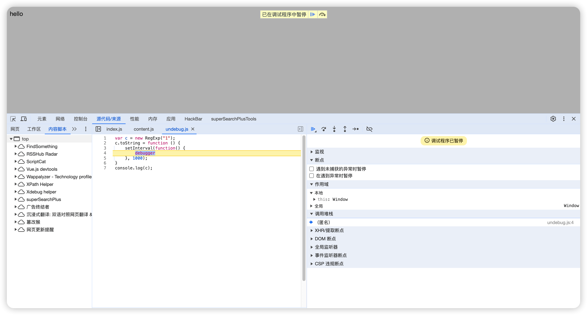](https://mayss.oss-cn-beijing.aliyuncs.com/image/image-20240224153518003.png)

#### 内存耗尽

这是一种更隐蔽的反调试手段，代码运行造成的内存占用会越来越大，很快会使浏览器崩溃。

```plain
var startTime = new Date();
debugger;
var endTime = new Date();
var isDev = endTime - startTime > 100;
var stack = [];

if (isDev) {
    while (true) {
        stack.push(this);
        console.log(stack.length, this);
    }
}
```

- - -

针对不同的场景也有不同的混淆方式，使代码不可读和使代码不可调试之间是相辅相成的

#### 反直觉

将 JavaScript 反调试代码隐藏在 PNG 图片中是一种更高级和复杂的反调试技术。

这种方法涉及到将 JavaScript 代码或者特定的标记嵌入到 PNG 图片的元数据或像素数据中，然后在页面加载图片时，通过 JavaScript 提取并执行这些隐藏的代码。

这种方式的实现方式就是利用 HTML Canvas 2D Context 获取二进制数据的特性，通过图片存储脚本数据，比较反直觉

[https://html.spec.whatwg.org/multipage/](https://html.spec.whatwg.org/multipage/)

## Deobfuscator - 反混淆

[https://dev-coco.github.io/Online-Tools/JavaScript-Deobfuscator.html](https://dev-coco.github.io/Online-Tools/JavaScript-Deobfuscator.html)

[https://deobfuscate.relative.im/](https://deobfuscate.relative.im/)

[https://beautifier.io/](https://beautifier.io/)

在线的反混淆工具比较多，但效果感觉都挺一般

### GPTnb！

以上面提到了通过高级算法和技术混淆后的代码为例，这些在线工具都只能给出代码可能的逻辑（结果更像伪代码）

在大模型时代，Js 反混淆的这个命题的最优解还是大模型，通过 chatgpt 进行测试，结果有些出乎意料

[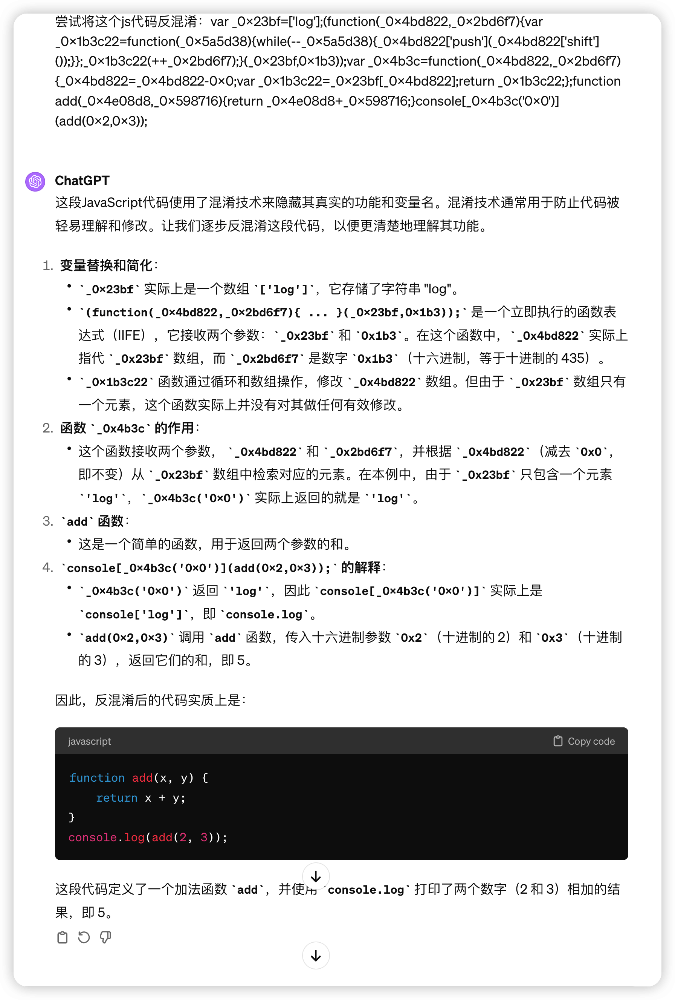](https://mayss.oss-cn-beijing.aliyuncs.com/image/image-20240224162148265.png)

反混淆的代码还原度达到了惊人的 98%，gpt 牛逼！！

这里还提一个 chrome 的小 tips，以无限 debugger 的测试页面为例

打开 f12，在`源代码/来源`中选中 debugger 字符，右击选择`向忽略列表添加脚本`

[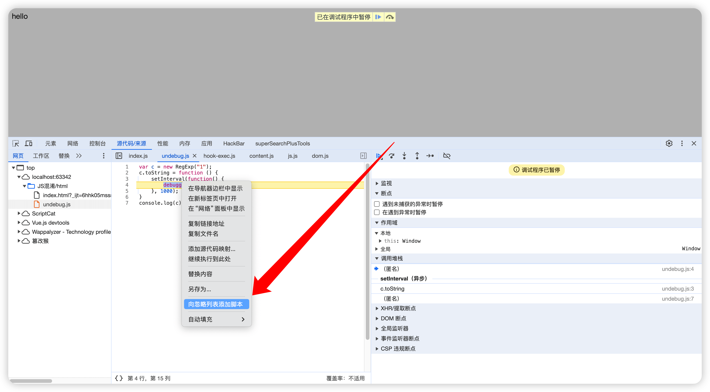](https://mayss.oss-cn-beijing.aliyuncs.com/image/image-20240224162414664.png)

这个时候我们调试代码，将不会被 debugger 阻断

[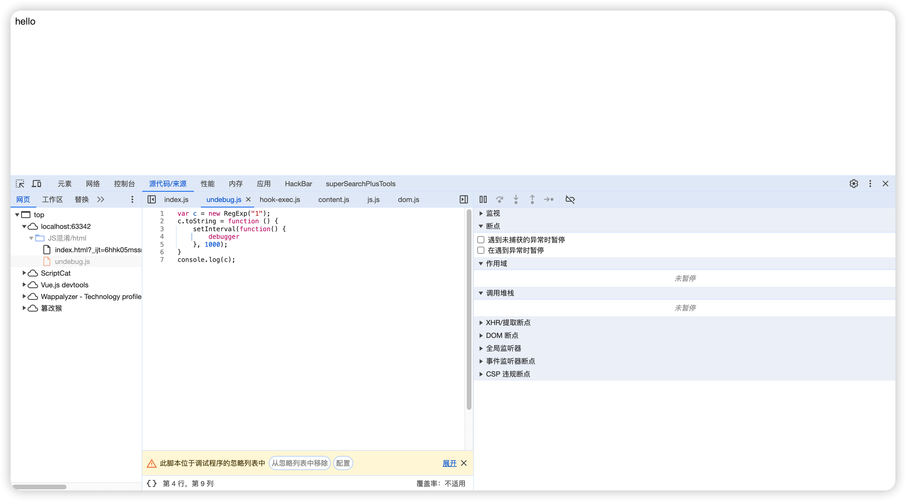](https://mayss.oss-cn-beijing.aliyuncs.com/image/image-20240224162604965.png)

### DevTools

上面讲的工具和 GPT 都只能提供辅助，真反混淆还得依赖 DevTools 一步一步来

调试分为静态调试和动态调试，先做个区分

-   静态调试：静态调试是通过分析代码的结构和逻辑来理解其功能。这种方法不需要运行代码，只需要对代码进行分析和理解。例如，可以通过反汇编工具将二进制的可执行文件翻译成汇编代码，通过对代码的分析来破解软件。
-   动态调试：动态调试则是在代码运行时进行的。通过设置断点，单步执行，观察变量的值变化等方式，来理解代码的运行过程和逻辑。动态调试可以有效应对多数混淆措施，从中还原出运行逻辑，是逆向分析的关键手段。前面说的反调试便是阻拦动态调试。

# 实战

## 百度翻译接口 \[2024.2.24\]

在未登录状态下翻译 可以看到`v2transapi`接口 其中`query`参数是我们传递的单词

[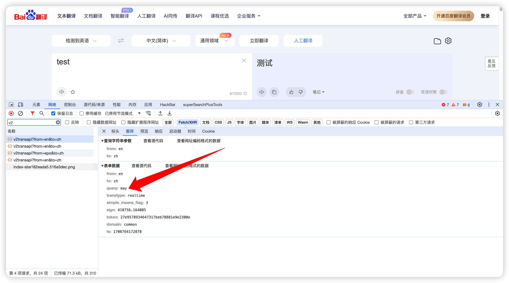](https://mayss.oss-cn-beijing.aliyuncs.com/image/image-20240224164557196.png)

经过多次翻译测试，发现只有`sign`和`ts`参数随着`query`字段变化而变化，`transtype`的值会根据翻译触发方式在`realtime`和`enter`之间切换

为了弄清楚`sign`的生成方式，我们在`源代码/来源`中全局搜索，因为`sign`本身也是个常见参数，我们可以搜索`sign:`或`sign=`缩小范围

在 3 个文件中匹配到 16 个，不算太多，我们依次打断点进行测试

[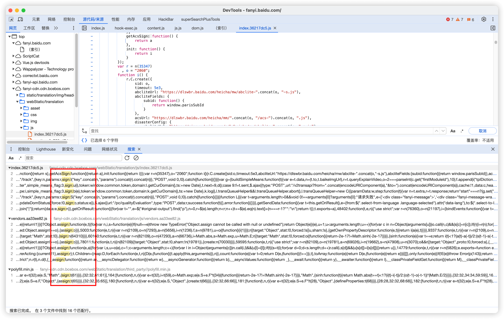](https://mayss.oss-cn-beijing.aliyuncs.com/image/image-20240224164944752.png)

只有断点下在`index.36217dc5.js`中的`sign: b(e)`位置时断点被触发，那这个 js 文件就是我们分析的主要文件了

[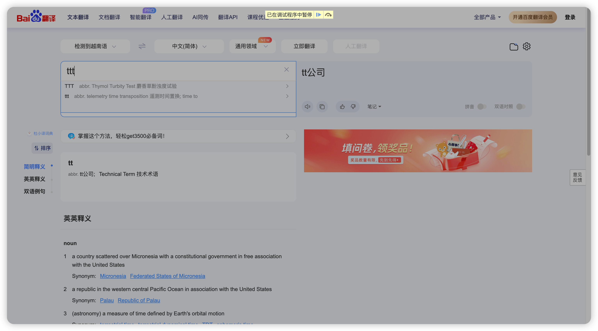](https://mayss.oss-cn-beijing.aliyuncs.com/image/image-20240224165327291.png)

[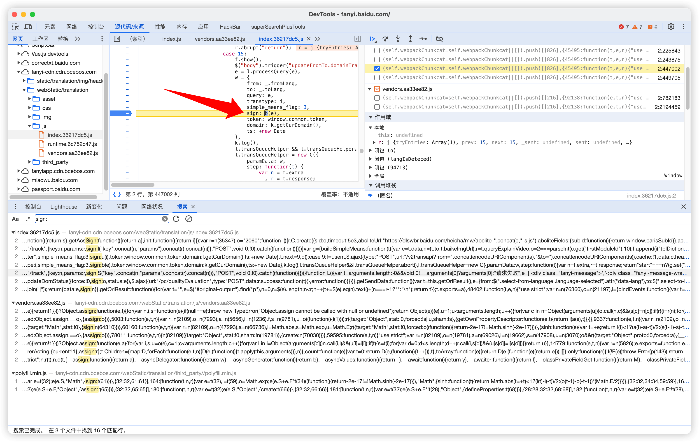](https://mayss.oss-cn-beijing.aliyuncs.com/image/image-20240224165350966.png)

步入，发现参数`t`的值为我们`query`传入的值

[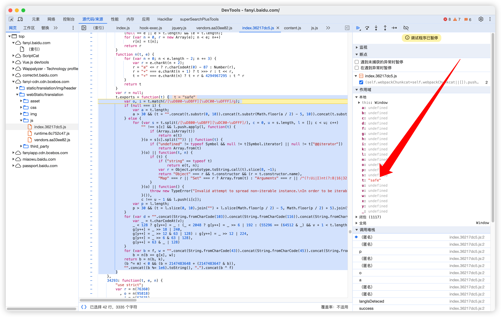](https://mayss.oss-cn-beijing.aliyuncs.com/image/image-20240224184501048.png)

把这段函数抽出来，写一个`IIFE`，放到 js 文件中交给`nodejs`执行，运行报错，告诉我们`r`未定义

```plain
a = function(t) { ... }
const query="safe"
console.log(a(query))
```

[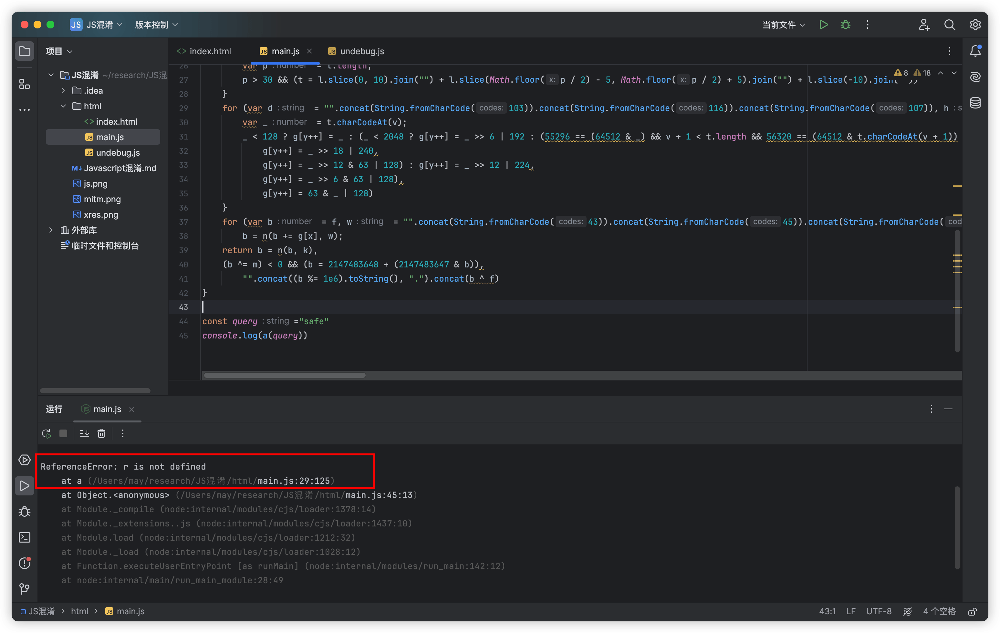](https://mayss.oss-cn-beijing.aliyuncs.com/image/image-20240224184708131.png)

继续调试寻找`r`，步入到这一步的时候看到 r 被赋值给`window[d]`,值为`320305.131321201`

[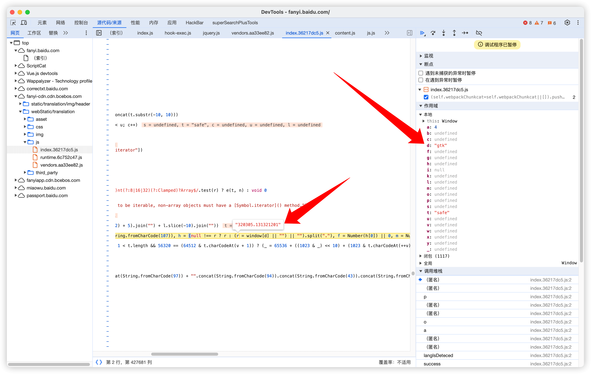](https://mayss.oss-cn-beijing.aliyuncs.com/image/image-20240224185351661.png)

我们通过`nodejs`运行的脚本，没有`window`这个全局对象，所以我们直接硬编码写入`r`

[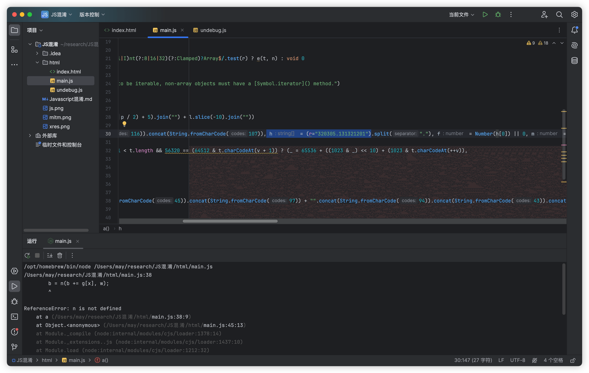](https://mayss.oss-cn-beijing.aliyuncs.com/image/image-20240224190235257.png)

再运行，报错`n`未定义，我们继续调试寻找`n`

在面板中找到`n`，鼠标悬于上方可以直接跳转到函数声明的位置

[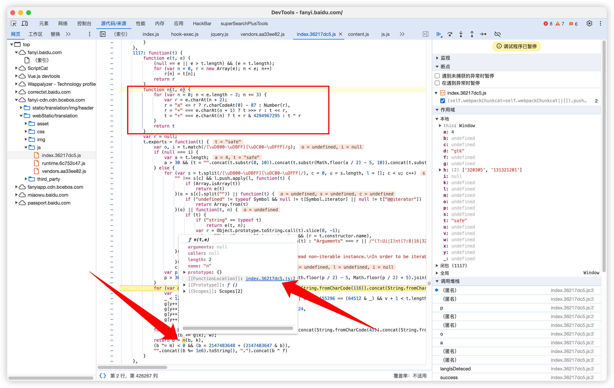](https://mayss.oss-cn-beijing.aliyuncs.com/image/image-20240224190008518.png)

[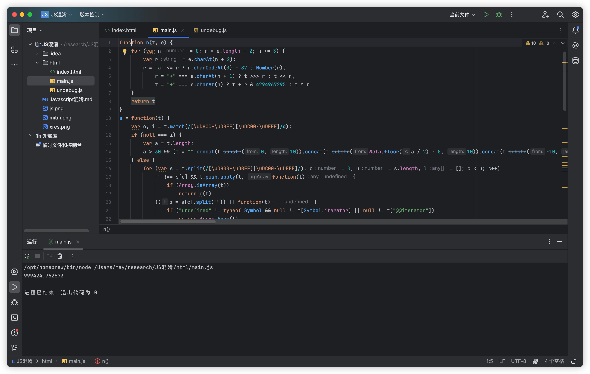](https://mayss.oss-cn-beijing.aliyuncs.com/image/image-20240224190311763.png)

把`n`函数放到脚本中来，运行得到`999424.762673`，与网络面板中的`sign`值一致

[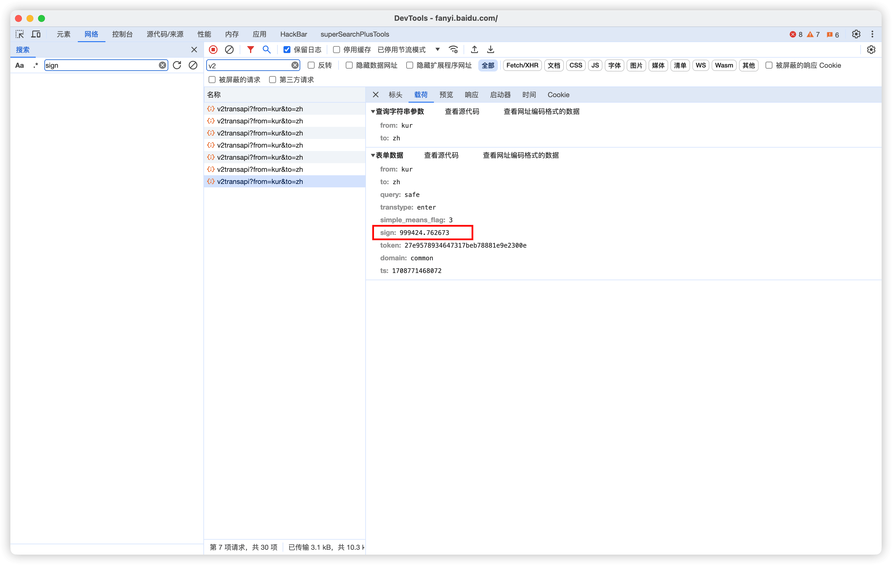](https://mayss.oss-cn-beijing.aliyuncs.com/image/image-20240224190452819.png)

最终脚本如下，调整`query`即可得到请求`v2transapi`接口所需的`payload`，经过测试`ts`值不影响翻译

```plain
function n(t, e) {
    for (var n = 0; n < e.length - 2; n += 3) {
        var r = e.charAt(n + 2);
        r = "a" <= r ? r.charCodeAt(0) - 87 : Number(r),
            r = "+" === e.charAt(n + 1) ? t >>> r : t << r,
            t = "+" === e.charAt(n) ? t + r & 4294967295 : t ^ r
    }
    return t
}
a = function(t) {
    var o, i = t.match(/[\uD800-\uDBFF][\uDC00-\uDFFF]/g);
    if (null === i) {
        var a = t.length;
        a > 30 && (t = "".concat(t.substr(0, 10)).concat(t.substr(Math.floor(a / 2) - 5, 10)).concat(t.substr(-10, 10)))
    } else {
        for (var s = t.split(/[\uD800-\uDBFF][\uDC00-\uDFFF]/), c = 0, u = s.length, l = []; c < u; c++)
            "" !== s[c] && l.push.apply(l, function(t) {
                if (Array.isArray(t))
                    return e(t)
            }(o = s[c].split("")) || function(t) {
                if ("undefined" != typeof Symbol && null != t[Symbol.iterator] || null != t["@@iterator"])
                    return Array.from(t)
            }(o) || function(t, n) {
                if (t) {
                    if ("string" == typeof t)
                        return e(t, n);
                    var r = Object.prototype.toString.call(t).slice(8, -1);
                    return "Object" === r && t.constructor && (r = t.constructor.name),
                        "Map" === r || "Set" === r ? Array.from(t) : "Arguments" === r || /^(?:Ui|I)nt(?:8|16|32)(?:Clamped)?Array$/.test(r) ? e(t, n) : void 0
                }
            }(o) || function() {
                throw new TypeError("Invalid attempt to spread non-iterable instance.\nIn order to be iterable, non-array objects must have a [Symbol.iterator]() method.")
            }()),
            c !== u - 1 && l.push(i[c]);
        var p = l.length;
        p > 30 && (t = l.slice(0, 10).join("") + l.slice(Math.floor(p / 2) - 5, Math.floor(p / 2) + 5).join("") + l.slice(-10).join(""))
    }
    for (var d = "".concat(String.fromCharCode(103)).concat(String.fromCharCode(116)).concat(String.fromCharCode(107)), h = (r="320305.131321201").split("."), f = Number(h[0]) || 0, m = Number(h[1]) || 0, g = [], y = 0, v = 0; v < t.length; v++) {
        var _ = t.charCodeAt(v);
        _ < 128 ? g[y++] = _ : (_ < 2048 ? g[y++] = _ >> 6 | 192 : (55296 == (64512 & _) && v + 1 < t.length && 56320 == (64512 & t.charCodeAt(v + 1)) ? (_ = 65536 + ((1023 & _) << 10) + (1023 & t.charCodeAt(++v)),
            g[y++] = _ >> 18 | 240,
            g[y++] = _ >> 12 & 63 | 128) : g[y++] = _ >> 12 | 224,
            g[y++] = _ >> 6 & 63 | 128),
            g[y++] = 63 & _ | 128)
    }
    for (var b = f, w = "".concat(String.fromCharCode(43)).concat(String.fromCharCode(45)).concat(String.fromCharCode(97)) + "".concat(String.fromCharCode(94)).concat(String.fromCharCode(43)).concat(String.fromCharCode(54)), k = "".concat(String.fromCharCode(43)).concat(String.fromCharCode(45)).concat(String.fromCharCode(51)) + "".concat(String.fromCharCode(94)).concat(String.fromCharCode(43)).concat(String.fromCharCode(98)) + "".concat(String.fromCharCode(43)).concat(String.fromCharCode(45)).concat(String.fromCharCode(102)), x = 0; x < g.length; x++)
        b = n(b += g[x], w);
    return b = n(b, k),
    (b ^= m) < 0 && (b = 2147483648 + (2147483647 & b)),
        "".concat((b %= 1e6).toString(), ".").concat(b ^ f)
}

const query = "abandon";
console.log(`from=en&to=zh&query=${query}&simple_means_flag=3&sign=${a(query)}&token=27e9578934647317beb78881e9e2300e&domain=common&ts=1708512893507`)
```

接口逆出来后就可以编写脚本实现翻译了

## 有道翻译接口\[2024.2.24\]

过程其实差不多 都是断点动态调试 只是发现密文再到解密的过程比较费时间

先分析一下请求，进行一次翻译会有三个`xhr`请求

第一个`key`请求携带了`sign`和`mysticTime`这两个会变化的参数

响应了固定的三个`key`值

[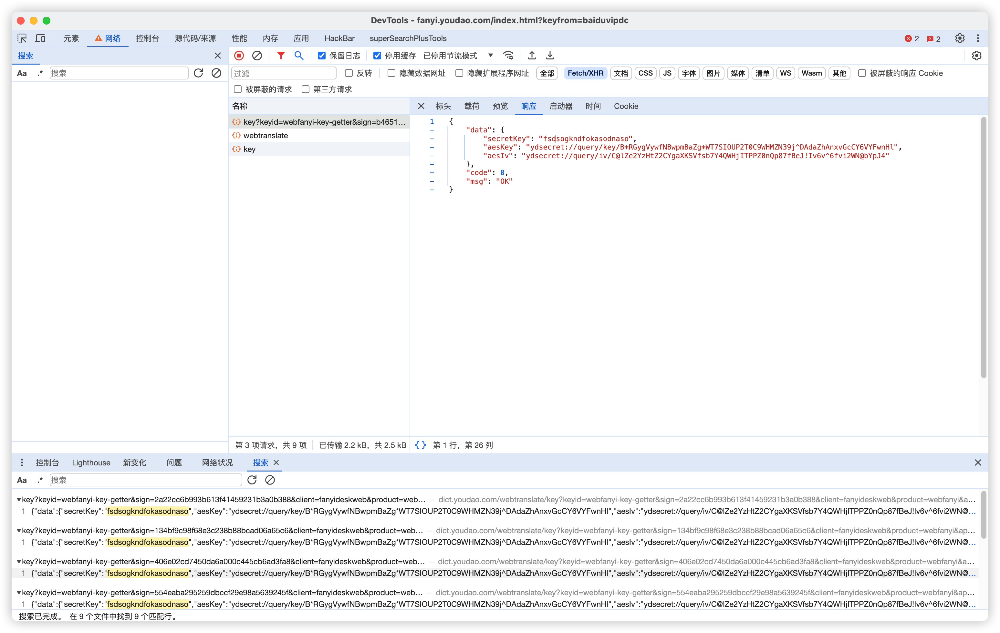](https://mayss.oss-cn-beijing.aliyuncs.com/image/image-20240224215955119.png)

第二个`webtranslate`接口请求也只携带了`sign`和`mysticTime`，响应的应该就是加密后的翻译结果

[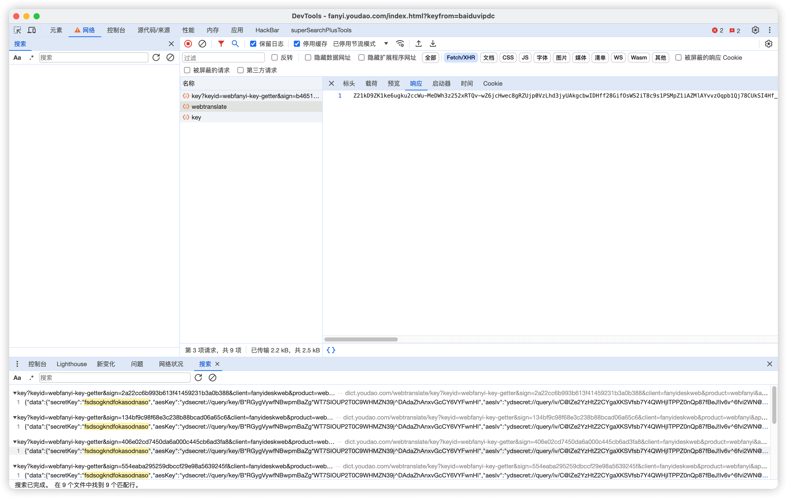](https://mayss.oss-cn-beijing.aliyuncs.com/image/image-20240224220152288.png)

最后这个请求携带了翻译的内容 响应了 OK

[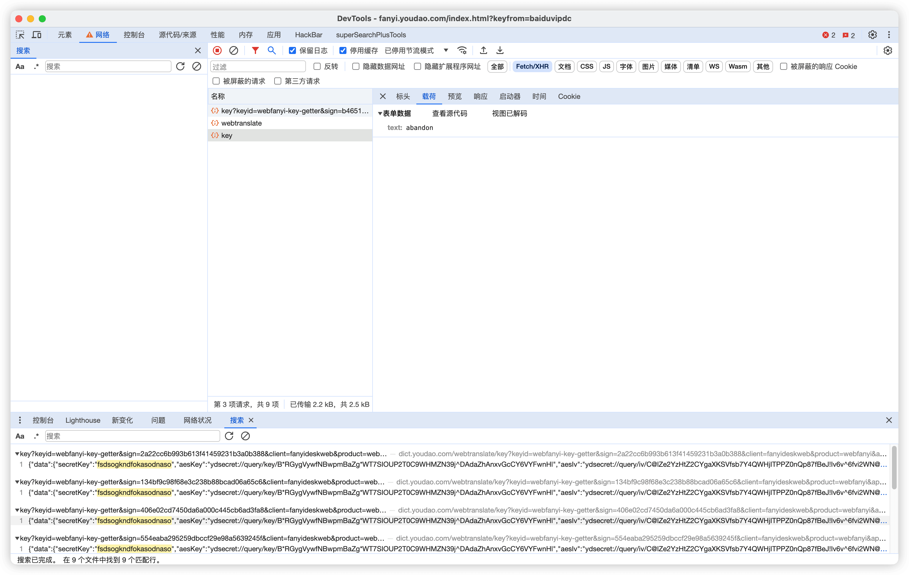](https://mayss.oss-cn-beijing.aliyuncs.com/image/image-20240224220440679.png)

多次请求发现只有`sign`和`mysticTime`是变化的，前者长度`32`可能是个`md5`，后者很明显是时间戳

[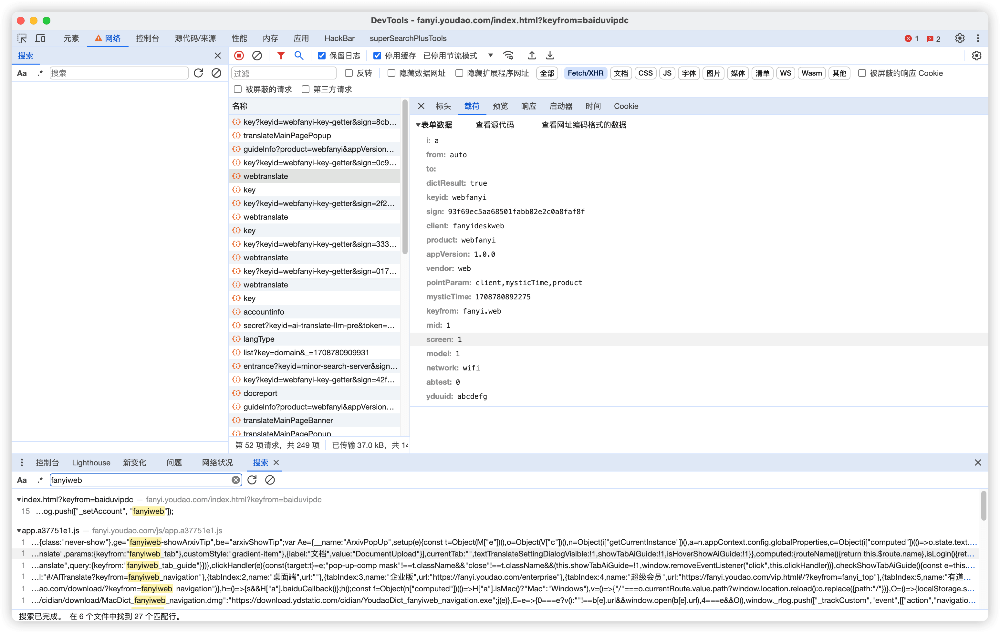](https://mayss.oss-cn-beijing.aliyuncs.com/image/image-20240224213517439.png)

既然是`md5`，那我们全局搜索的关键字就用 md5 或者`createhash`，很快就定位到了关键位置

[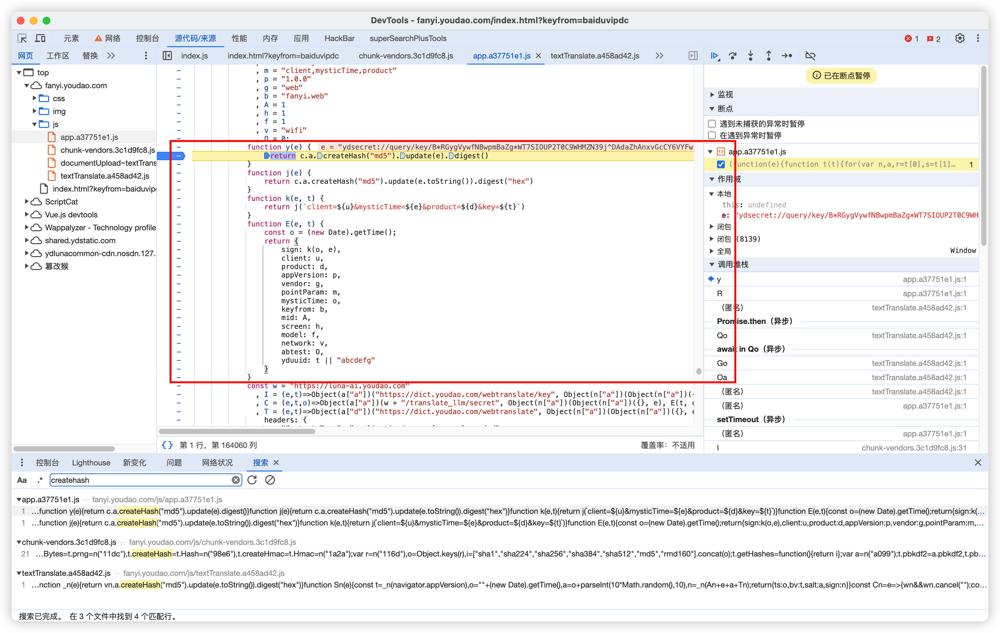](https://mayss.oss-cn-beijing.aliyuncs.com/image/image-20240224213935302.png)

`e`是个固定值`ydsecret://query/key/B*RGygVywfNBwpmBaZg*WT7SIOUP2T0C9WHMZN39j^DAdaZhAnxvGcCY6VYFwnHl`

`k`函数传入`o`和`e`就生成了`sign`，`o`就是`(new Data).getTime()`生成的时间戳

编写代码生成 sign

```plain
const u = "fanyideskweb",
      d = "webfanyi"

const crypto = require('crypto')

function c(e) {
    return crypto.createHash("md5").update(e.toString()).digest("hex")
}

function sign(e, t) {
    return c(`client=${u}&mysticTime=${e}&product=${d}&key=${t}`)
}

const e = "ydsecret://query/iv/C@lZe2YzHtZ2CYgaXKSVfsb7Y4QWHjITPPZ0nQp87fBeJ!Iv6v^6fvi2WN@bYpJ4";
const t = (new Date()).getTime();

console.log(sign(e, t));
```

继续调试 步入到密文的位置

[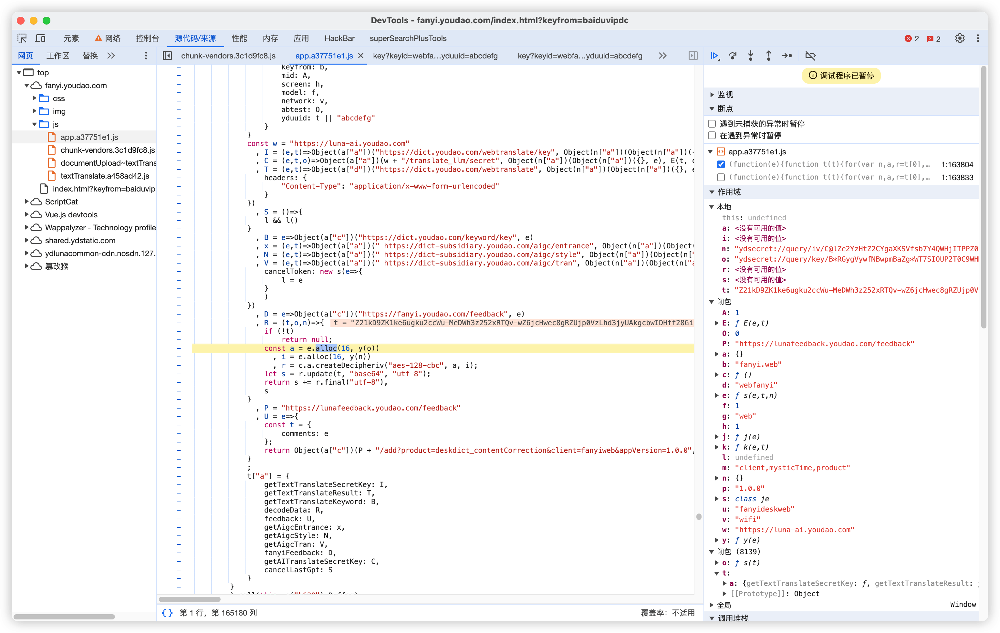](https://mayss.oss-cn-beijing.aliyuncs.com/image/image-20240224221925006.png)

成功拿到密文 就可以拿 key 进行 aes 解密了
