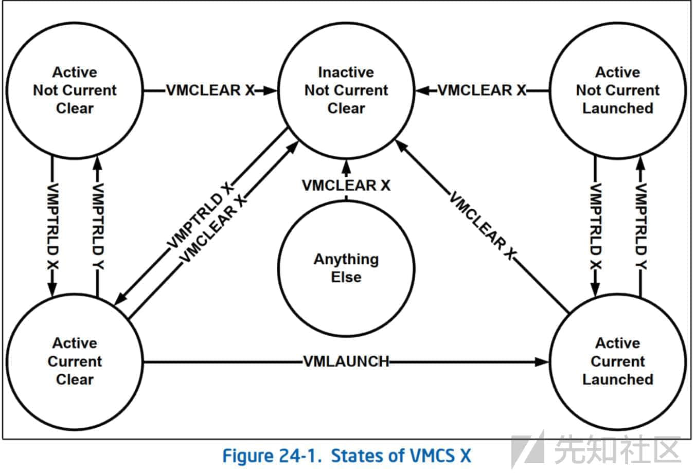

# KVM 循序渐进耳之原理篇 - 先知社区

KVM 循序渐进耳之原理篇

- - -

### 前言：

  基础篇主要是搭建应用层调试环境和了解虚拟化和 KVM 代码，本篇承上启下 INIT、VMXON 和 VMCS 等分享。

### QEMU：

#### 环境：

Centos6 2.6.32-754.35.1.el6.x86\_64

QEMU PC emulator version 0.12.1 (qemu-kvm-0.12.1.2-2.506.el6\_10.8)

#### QUEM-KVM Pre Environment:

./configure 如果遇到未安装 libpic，centos 安装如下：

```plain
yum install pciutils-devel
# apt-get
apt-get install libpic libpic-devel
```

编译后有几个可执行文件比较重要：

-   qemu-kvm-0.12.1.2/x86\_64-softmmu/qemu-system-x86\_64
    
-   qemu-kvm-0.12.1.2/qemu-io
    
-   qemu-kvm-0.12.1.2/qemu-nbd
    
-   qemu-kvm-0.12.1.2/qemu-img
    

可以拷贝上述文件到/usr/bin 下，或者建立软连接或者使用 make install(建议)。

  如果使用的本文的环境，make 几乎不会出问题。如果版本不匹配可能会遇到编译错误，需要加 gcc 选项或源码修改。遇到复杂依赖环境，可以先 yum 安装 qemu-kvm lib 等，然后卸载 rmmod kvm/kvm-intel，编译自己qemu-kvm源码，可能会解决部分奇怪的依赖。

#### QUEM-KVM Init VM Analyze:

  qemu-system-x86\_64 拉起可用的 Centos5-iso.x64-VM 节点，这里最小的 centos6-x86\_64(vnc 和网卡配置不描述)：

-   创建 Qemu 镜像，指令如下：

```plain
qemu-img create -f qcow2 centos6_vm1.img 10G  -- qcow2 类型 实际大小没有 10G。
```

-   网卡配置和 VNC 这里不描述，创建虚拟机指令：

```plain
qemu-system-x86_64 -m 512 -smp 1 --enable-kvm  -boot d -hda /kvm_vm/centos6_vm1.img -cdrom /root/CentOS-6.10-x86_64-minimal.iso
```

-   注意使用 make install 不会出现这个问题，qemu: could not load pc bios 'bios.bin'(这些都可以再 Makefile 去搞)。

```plain
find / -name bios.bin
查找结果：/xxx/qemu-kvm-0.12.1.2/pc-bios/bios.bin
执行：cp /root/qemu-kvm-0.12.1.2/pc-bios/bios.bin /usr/share/seabios/
```

  拷贝到/usr/share/seabios/和/usr/bin 或者其目录仍然会报错，看看源码 qemu\_find\_file 负责查找文件，拼接绝对路径：

```plain
vl.c 文件 qemu_find_file 函数中添加 fprintf：
4703 行：snprintf(buf, len, "%s/%s%s", data_dir, subdir, name);
添加：fprintf(stderr, "[+]bios path: %s\n", buf);
```

  上传修改后 vl.c，重新打包编译拷贝到/usr/bin/，执行输出如下：

```plain
make clean
make
cp  /.../.../qemu-system-x86_64 /usr/bin/
qemu-system-x86_64 -m 512 -smp 1 --enable-kvm  -boot d -hda /kvm_vm/centos6_vm1.img -cdrom /root/CentOS-6.10-x86_64-minimal.iso
```

  输出路径'/usr/local/share/qemu/bios.bin'，指令启动成功，但是 qemu 界面黑屏。启动输出 Log 信息，vapic.bin 没有找到，解决方式和 bios.bin：

```plain
cp /root/qemu-kvm-0.12.1.2/pc-bios/bios.bin /usr/local/share/qemu/(没有目录就创建)
cp /root/qemu-kvm-0.12.1.2/pc-bios/vapic.bin /usr/local/share/qemu/
还有依赖否则会黑屏，建议使用 make & make install。
```

  上述手动比较麻烦，可以直接使用 make install。重新编译先 make uninstall 卸载，这里为了方便手动将依赖的变量进行拷贝和使用 (比较麻烦)，qemu-kvm 可用环境已经完成，下面分析 qemu-system-x86\_64 如何创建/执行虚拟 VM 节点：

  vl.c-main 函数，从 for(;;) 开始解析参数，这里不具体介绍，从 kvm 判断开始，如下：

```plain
if (kvm_enabled()) {
        int ret;

        ret = kvm_init(smp_cpus);
        if (ret < 0) {
#if defined(KVM_UPSTREAM) || defined(CONFIG_NO_CPU_EMULATION)
            fprintf(stderr, "failed to initialize KVM\n");
            exit(1);
#endif
            fprintf(stderr, "Could not initialize KVM, will disable KVM support\n");
            kvm_allowed = 0;
        }
    }
```

  kvm\_init 源码什么都没做，直接 return 0

```plain
static inline int kvm_init(int smp_cpus)
{
    return 0;
}
```

  通过配置方案模块初始化来调用 kvm\_init(),还有初始化事件/socket/内存等代码，Qemu-kvm 管理。Qemu-kvm 并非 kvm 内核代码，使用--enable-kvm 开启 kvm 支持，kvm 模块也需要修改才可以，下载对应的 Linux 源码，只需要编译 kvm 模块即可，不然每次修改 kvm 都需要编译内核直接累死。

#### KVM-12 Issue:

KVM-12 版本编译问题这里也总结，12 版本初始化接口改变如下：

```plain
module_init(kvm_init) kvm_init_debug --> kvm_init_msr_list --> page_to_pfn
module_exit(kvm_exit)
// VT 检测和初始化
EXPORT_SYMBOL_GPL(kvm_init_arch);  
EXPORT_SYMBOL_GPL(kvm_exit_arch);
```

  kvm-12 编译完成后，insmod kvm.ko 安装，/dev/下找不到但是 lsmod | grep kvm 模块已被加载，添加调试信息发现 kvm\_init 以后没有进入 kvm\_init\_arch，初始化再 vmx\_init 中，所以还需要执行 insmod kvm-intel.ko：

```plain
insmod kvm.ko
insmod kvm-intel.ko or insmod kvm-amd.ko
```

  kernel 2.6.32 编译 kvm-24 ./configure 会遇到错误：cannot locate gcc 3.x. please install it or specify with --qemu-cc

```plain
yum -y install compat-gcc-*
yum -y install SDL-devel
```

  Centos5 kernel v2.6.18 环境下 Libkvm 通过 ioctl 创建虚拟机 VM Entry Error: 0x80000022，VM entry: failure due to MSR loading，VMentry Msr 加载失败。分析 VMCS-VM Entry\_Setup 入手，读取了 IA32\_VMX\_ENTRY\_CTLS(0x484) 寄存器的数据，运算后写入 VM\_ENTRY\_CONTROLS(0x4012)。

```plain
// VM-Entry Controls for MSRs
vmcs_write32_fixedbits(MSR_IA32_VMX_ENTRY_CTLS_MSR,VM_ENTRY_CONTROLS, 0);
// VM-Entry Controls for Event Injection
vmcs_write32(VM_ENTRY_INTR_INFO_FIELD, 0);  /* 22.2.1 */ 这里是 0，未开启
```

  通过打印 VM\_ENTRY\_CONTROLS 写入的值是 0x11ff，0~8bit 和 12bit 必须为 1，二进制数据如下，没有发现错误，如下：

```plain
0x11ff = 0001000111111111
```

  因为是 x64，更改为 0x13ff，将 9bit 置为 1，环境是 64bit=1，如果 x86 第 9 bit 必须为 0，如下：

```plain
0x13ff = 0001001111111111
unsigned int vm_entryctl_requested = 0;
vm_entryctl_requested |= 516;
vmcs_write32_fixedbits(MSR_IA32_VMX_ENTRY_CTLS_MSR,VM_ENTRY_CONTROLS,vm_entryctl_requested);
```

  VM-entry failure due to Msr loading，1 or 2 其他导致，如果是 PAE cr0.pg=1 cr4.pae=1 ia32efer=0。

```plain
A VM entry to a guest that does not use PAE paging does not check the validity of any PDPTEs.
```

  如果 Guest x32 非 PAE 则不做检查，x64 PAE：

```plain
flags = vmcs_readl(GUEST_RFLAGS);vcpu->rmode.save_iopl = (flags & IOPL_MASK) >> IOPL_SHIFT;// X86_EFLAGS_VM = 00010111// IOPL_MASK = 0011000000000000flags |= IOPL_MASK | X86_EFLAGS_VM;vmcs_writel(GUEST_RFLAGS, flags);vmcs_writel(GUEST_CR4, vmcs_readl(GUEST_CR4) | CR4_VME_MASK);
```

  arch/x86/include/asm/pgtable.h:605: 错误：隐式声明函数‘IS\_ENABLED’,按照谷歌说法：IS\_ENABLED 宏 Linux 3.1 之后才引入，kconfig.h 头文件中定义，3.1 内核之前引用都会报错。  
  **rflag 是 v86 模式，kvm 低版本 vmcs 只填充了 16/32.....，vm 虚拟节点也是对 v86 最初支持，并未对 64bit 做处理，拉起 Guest-x64 会有问题。文章还是将排错过程梳理下来，遇到问题从手册排查代码简单思路。**

### KVM\_INIT

#### 检测

-   使用 cpuid(1):ecx.vmx\[bit 5\]标志位检测是否支持 VMX，如下所示：

```plain
static __init int cpu_has_kvm_support(void)
{
  unsigned long ecx = cpuid_ecx(1);
  return test_bit(5, &ecx); /* CPUID.1:ECX.VMX[bit 5] -> VT */
}
```

**See: DISCOVERING SUPPORT FOR VMX**

-   CR4.VMXE =1 , 如果再 BIOS 上开启 VMX 还需要设置 lock 和 1/2bit(如果是 0 会导致一般保护异常)，代码如下：

```plain
static __init int vmx_disabled_by_bios(void)
{
  u64 msr;
  rdmsrl(MSR_IA32_FEATURE_CONTROL, msr);
  return (msr & 5) == 1; /* locked but not enabled */
}
```

**See: ENABLING AND ENTERING VMX OPERATION**

#### VMXON

-   kvm\_init 执行了 kvm\_enable，创建 vmxon 区域是 alloc\_kvm\_area()，创建过程中初始化 vmxon 结构 (alloc\_vmcs\_cpu 函数中赋值区域)，revision\_identifier 字段要与 msr\_vmx\_base 一致，且有保留字段需要为 0。
    
-   vmcs\_descriptor/vmx\_on 全局变量，vmcs\_descriptor 结构被 setup\_vmcs\_descriptor 函数初始化，然后申请过程中给 vmxon 赋值。
    

```plain
static __init void setup_vmcs_descriptor(void)
{
  u32 vmx_msr_low, vmx_msr_high;
  rdmsr(MSR_IA32_VMX_BASIC_MSR, vmx_msr_low, vmx_msr_high);
  vmcs_descriptor.size = vmx_msr_high & 0x1fff;
  vmcs_descriptor.order = get_order(vmcs_descriptor.size);
  vmcs_descriptor.revision_id = vmx_msr_low;
};
```

-   高版本应该可以检测'PpyH'来探测否支持 hyper 虚拟化，进入 VMX ROOT:

```plain
rdmsrl(MSR_IA32_FEATURE_CONTROL, old);
if ((old & 5) == 0)
  /* enable and lock */
  wrmsrl(MSR_IA32_FEATURE_CONTROL, old | 5);
//see: VMX-FIXED BITS IN CR4
write_cr4(read_cr4() | CR4_VMXE); /* FIXME: not cpu hotplug safe */
asm volatile ("vmxon %0" : : "m"(phys_addr) : "memory", "cc");
```

#### 总结

-   VMX

```plain
1. 检测 CPUID 是否支持 VMX
2. CR4.VMXE[bit 13] = 1，否则 VMXON 执行会出现 invalid-opcode 异常。
3. VMX root 模式下不可以清除 CR4，必须 vmoff 之后才可以清除 cr4.VMXE[bit 13] = 0;
4. VMXon 由 MSR 控制，IA32_FEATURE_CONTROL MSR (MSR address 3AH)，逻辑处理器恢复时候会清 0。
```

-   BIOS：

```plain
1. Msr.bit 0 lock：清除的话 VMXON 会导致常规保护异常，设置了 WRMSR 将导致通用保护异常。Bios 可以设置该位禁用 VMX,1 或者 2 的时候才可以启动。
2. bit 1-smx 中启用 VMXON。
3. bit 2-smx 外启用 VMXON。
```

  **Cpuid 检测和 CR4.VMXE &BIOS 开启 vmx 支持，创建 vmxon(4kbyte 对齐)，读取 ia32vmxbase 初始化 vmxon 结构，设置 cr0/cr4，通过 vmxon 指令进入 vmx，也就是 vmx root 模式。**

### KVM\_VMCS：

#### 概念：

  官方概念：VMX non-root operation and VMX transitions are controlled by a data structure called a virtual-machine control structure (VMCS).

  VMCS(Virtual Machine Control Structures)，VMM 可以支持多个节点 VM 使用不同的 VMCS，指针必须再 4KB(page) 字节边界上对齐。  
Guest 0 表述 VM 节点和 VMM 之间关系如下：

-   VMXON 进入 VMX ROOT，VMOFF 退出。
    
-   VMX root 可以执行 VMX 指令，VMlaunch 进入 vmx non root(Guest0)，这个过程叫做 VMEntry。
    
-   Guest 0 执行敏感指令-I/O-中断等动作，non root 切换 root 模式这个过程叫做 VMExit。
    
-   Guest 0 虚拟节点，有用户层和内核层。guest 0 用户层系统调用由 guest 0 内核层负责处理。guest 0 内核层陷入会发生 VMExit 由 VMM 模拟处理。
    

  VM Exit 和 VM Entry 切换多任务 (Guest)，环境上下文如何保存呢？VMCS 就是为了解决该问题。既然是保存上线文，Guest-Host 两点一线，vmcs 应该具备必要的几个区域，分别记录 Guest-host 切换过程中的数据和状态，保证下次进入可以正确执行，这几个区域概述如下：

[](https://xzfile.aliyuncs.com/media/upload/picture/20240131173918-9aeb302c-c01c-1.jpg)

#### VMCS 代码分析：

1) Ioctl: KVM\_CREATE\_VCPU，申请 vmcs\_page 初始化 (初始化版本标识/退出指示):

```plain
static struct vmcs *alloc_vmcs_cpu(int cpu)
{
  int node = cpu_to_node(cpu);
  struct page *pages;
  struct vmcs *vmcs;
  pages = alloc_pages_node(node, GFP_KERNEL, vmcs_descriptor.order);
  if (!pages)
    return 0;

  vmcs = page_address(pages);
  memset(vmcs, 0, vmcs_descriptor.size);
  vmcs->revision_id = vmcs_descriptor.revision_id; /* vmcs revision id */
  return vmcs;
}
```

**31.6 PREPARATION AND LAUNCHING A VIRTUAL MACHINE**

2) VMREAD/VMWRITE/VMCLEAR三个指令用来操作VMCS，使用vmclear初始化Guest-vmcs区域，启动状态设置为clear，该指令还会检测vmcs是否有效指针。

```plain
vmcs_clear(vmcs);
asm volatile ("vmclear %1; setna %0"
        : "=m"(error) : "m"(phys_addr) : "cc", "memory" );
```

\_\_vcpu\_load 执行 vmptrld 指令，使用新的 guest-vmcs 物理地址来初始化 working-VMCS。

```plain
if (per_cpu(current_vmcs, cpu) != vcpu->vmcs) {
  u8 error;
  per_cpu(current_vmcs, cpu) = vcpu->vmcs;
  asm volatile ("vmptrld %1; setna %0"
            : "=m"(error) : "m"(phys_addr) : "cc" );
  if (error)
    printk(KERN_ERR "kvm: vmptrld %p/%llx fail\n",
            vcpu->vmcs, phys_addr);
}
```

##### Init TSS:

```plain
page = kmap_atomic(p1, KM_USER0);
memset(page, 0, PAGE_SIZE);
*(u16*)(page + 0x66) = TSS_BASE_SIZE + TSS_REDIRECTION_SIZE;
kunmap_atomic(page, KM_USER0);

page = kmap_atomic(p2, KM_USER0);
memset(page, 0, PAGE_SIZE);
kunmap_atomic(page, KM_USER0);

page = kmap_atomic(p3, KM_USER0);
memset(page, 0, PAGE_SIZE);
*(page + RMODE_TSS_SIZE - 2 * PAGE_SIZE - 1) = ~0;
kunmap_atomic(page, KM_USER0);
```

##### Guest-State Fields

Guest-state area 分为寄存器和非寄存器两种状态，寄存器设置如下：

-   控制寄存器：cr0/cr3/cr4 cr0 处理器各种模式和标志位，cr3 页目录。

```plain
vmcs_writel(GUEST_CR3, 0);
```

-   调试寄存器：dr7

```plain
//todo: dr0 = dr1 = dr2 = dr3 = 0; dr6 = 0xffff0ff0
vmcs_writel(GUEST_DR7, 0x400);
```

-   寄存器：rsp/rip/rflags

```plain
vmcs_writel(GUEST_RFLAGS, 0x02);
vmcs_writel(GUEST_RIP, 0xfff0);
vmcs_writel(GUEST_RSP, 0);
```

-   段选择子：cs/ss/ds/es/fs/gs

```plain
vmcs_write16(GUEST_CS_SELECTOR, 0xf000);
vmcs_writel(GUEST_CS_BASE, 0x000f0000);
vmcs_write32(GUEST_CS_LIMIT, 0xffff);
vmcs_write32(GUEST_CS_AR_BYTES, 0x9b);

#define SEG_SETUP(seg) do {                 \
    vmcs_write16(GUEST_##seg##_SELECTOR, 0);    \
    vmcs_writel(GUEST_##seg##_BASE, 0);     \
    vmcs_write32(GUEST_##seg##_LIMIT, 0xffff);  \
    vmcs_write32(GUEST_##seg##_AR_BYTES, 0x93);     \
  } while (0)
SEG_SETUP(DS);
SEG_SETUP(ES);
SEG_SETUP(FS);
SEG_SETUP(GS);
SEG_SETUP(SS);
```

-   段描述符：ldtr/tr (32bit gdtr)

```plain
vmcs_write16(GUEST_TR_SELECTOR, 0);
vmcs_writel(GUEST_TR_BASE, 0);
vmcs_write32(GUEST_TR_LIMIT, 0xffff);
vmcs_write32(GUEST_TR_AR_BYTES, 0x008b);

vmcs_write16(GUEST_LDTR_SELECTOR, 0);
vmcs_writel(GUEST_LDTR_BASE, 0);
vmcs_write32(GUEST_LDTR_LIMIT, 0xffff);
vmcs_write32(GUEST_LDTR_AR_BYTES, 0x00082);

vmcs_writel(GUEST_GDTR_BASE, 0);
vmcs_write32(GUEST_GDTR_LIMIT, 0xffff);

vmcs_writel(GUEST_IDTR_BASE, 0);
vmcs_write32(GUEST_IDTR_LIMIT, 0xffff);
```

-   非寄存器状态 (活跃状态/中断能力状态/延迟调试异常状态)，如下：

```plain
vmcs_write32(GUEST_ACTIVITY_STATE, 0);  
vmcs_write32(GUEST_INTERRUPTIBILITY_INFO, 0);  
vmcs_write32(GUEST_PENDING_DBG_EXCEPTIONS, 0);
```

##### Host-State Fields

  操作的寄存器几乎一样，当 Vmentry 保存，Vmexit 加载状态且运行设置好的 HOST\_RIP，VMX root 入口点 kvm\_vmx\_return。

```plain
vmcs_writel(HOST_CR0, read_cr0());  /* 22.2.3 */
vmcs_writel(HOST_CR4, read_cr4());  /* 22.2.3, 22.2.5 */
vmcs_writel(HOST_CR3, read_cr3());  /* 22.2.3  FIXME: shadow tables */

vmcs_write16(HOST_CS_SELECTOR, __KERNEL_CS);  /* 22.2.4 */
vmcs_write16(HOST_DS_SELECTOR, __KERNEL_DS);  /* 22.2.4 */
vmcs_write16(HOST_ES_SELECTOR, __KERNEL_DS);  /* 22.2.4 */
vmcs_write16(HOST_FS_SELECTOR, read_fs());    /* 22.2.4 */
vmcs_write16(HOST_GS_SELECTOR, read_gs());    /* 22.2.4 */
vmcs_write16(HOST_SS_SELECTOR, __KERNEL_DS);  /* 22.2.4 */

#ifdef __x86_64__
    rdmsrl(MSR_FS_BASE, a);
    vmcs_writel(HOST_FS_BASE, a); /* 22.2.4 */
    rdmsrl(MSR_GS_BASE, a);
    vmcs_writel(HOST_GS_BASE, a); /* 22.2.4 */
#else
    vmcs_writel(HOST_FS_BASE, 0); /* 22.2.4 */
    vmcs_writel(HOST_GS_BASE, 0); /* 22.2.4 */
#endif

vmcs_write16(HOST_TR_SELECTOR, GDT_ENTRY_TSS*8);  /* 22.2.4 */

get_idt(&dt);
vmcs_writel(HOST_IDTR_BASE, dt.base);   /* 22.2.4 */


vmcs_writel(HOST_RIP, (unsigned long)kvm_vmx_return); /* 22.2.5 */

rdmsr(MSR_IA32_SYSENTER_CS, host_sysenter_cs, junk);
vmcs_write32(HOST_IA32_SYSENTER_CS, host_sysenter_cs);
rdmsrl(MSR_IA32_SYSENTER_ESP, a);
vmcs_writel(HOST_IA32_SYSENTER_ESP, a);   /* 22.2.3 */
rdmsrl(MSR_IA32_SYSENTER_EIP, a);
vmcs_writel(HOST_IA32_SYSENTER_EIP, a);   /* 22.2.3 */
```

##### VM-execution control Fields

-   Pin-Based VM-Execution Controls 基于针脚虚拟化管理异步中断事件，代码如下：

```plain
vmcs_write32_fixedbits(MSR_IA32_VMX_PINBASED_CTLS_MSR,
        PIN_BASED_VM_EXEC_CONTROL,
        PIN_BASED_EXT_INTR_MASK   /* 20.6.1 */
        | PIN_BASED_NMI_EXITING   /* 20.6.1 */
);
```

  代码中 PIN\_BASED\_EXT\_INTR\_MASK | PIN\_BASED\_NMI\_EXITING 其实二进制 1001，也就开启了 External-interrputexiting 和 NMI exiting，外部中断和不可屏蔽中断都可以导致 VM exits。

-   Processor-Based VM-Execution Controls 基于处理器虚拟化管理同步中断事件，代码如下：

```plain
vmcs_write32_fixedbits(MSR_IA32_VMX_PROCBASED_CTLS_MSR,
        CPU_BASED_VM_EXEC_CONTROL,
        CPU_BASED_HLT_EXITING         /* 20.6.2 */
        | CPU_BASED_CR8_LOAD_EXITING    /* 20.6.2 */
        | CPU_BASED_CR8_STORE_EXITING   /* 20.6.2 */
        | CPU_BASED_UNCOND_IO_EXITING   /* 20.6.2 */
        | CPU_BASED_INVDPG_EXITING
        | CPU_BASED_MOV_DR_EXITING
        | CPU_BASED_USE_TSC_OFFSETING   /* 21.3 */
);
```

  分为 primary/secondary 两个 VM 执行控制，负责的不同。primary 负责 CR3/CR8/ INVLPG/I O bitmaps/HLT/MTF等产生退出时间，而secondary负责x2 APIC/EPT/RDTSCP/INVPCID等。

-   Exception Bitmap 异常位图处理。

```plain
vmcs_write32(EXCEPTION_BITMAP, 1 << PF_VECTOR);
```

-   I/O-Bitmap Addresses I/O 位图设置，注意一点必须要在 4kb 页对齐位置。

```plain
vmcs_write64(IO_BITMAP_A, 0);   // 0000H through 7FFFH
vmcs_write64(IO_BITMAP_B, 0);     // 8000H through FFFFH
```

-   Time-Stamp Counter Offset and Multiplier 时间戳偏移值

```plain
rdtscll(tsc);
vmcs_write64(TSC_OFFSET, -tsc);
```

-   Guest/Host Masks and Read Shadows for CR0 and CR4 虚拟机屏蔽和读 cr0/cr4 隐藏。

```plain
vmcs_writel(CR0_GUEST_HOST_MASK, KVM_GUEST_CR0_MASK);
vmcs_writel(CR4_GUEST_HOST_MASK, KVM_GUEST_CR4_MASK);
__set_cr0(vcpu, 0x60000010); // enter rmode
__set_cr4(vcpu, 0);
```

-   CR3-Target Controls  
      一组 4 个 cr3，如果当 vmx non-root 也就是 Guest 操作 mov cr3,xxx，赋值不会导致 vmexit 操作，如果 cr3 目标值为 0，那么 mov 的时候就会导致 vmexit 事件，KVM 下面代码 write 写入的是 0，所以再 mvx non-root 下对 cr3 赋值将会导致 VMexit 事件。

```plain
mcs_write32(CR3_TARGET_COUNT, 0);           /* 22.2.1 */
```

-   MSR-Bitmap Address Msr  
      位图地址，再 Processor-Based VM-Execution Controls 且 primary 的第 28bit=1 才启用。  
      启动 vmx non-root 执行 rdmsr/wrmsr 将会发生 vmexits 事件，而且需要对 msr bitmap 做处理，申请 guest/host msr(4kb 页对齐),设置 VM 进入/退出加载地址。

```plain
// 0x0000200a vm 进入 msr 加载地址
vmcs_writel(VM_ENTRY_MSR_LOAD_ADDR,
  virt_to_phys(vcpu->guest_msrs + NR_BAD_MSRS));
vmcs_writel(VM_EXIT_MSR_STORE_ADDR,
  virt_to_phys(vcpu->guest_msrs + NR_BAD_MSRS));
vmcs_writel(VM_EXIT_MSR_LOAD_ADDR,
  virt_to_phys(vcpu->host_msrs + NR_BAD_MSRS));
```

-   KVM1.0 没有对 APIC 做支持

```plain
vmcs_writel(VIRTUAL_APIC_PAGE_ADDR, 0);
vmcs_writel(TPR_THRESHOLD, 0);  // TRP 需要开启 21bit=1 才起效
```

##### VM-Exit Control

```plain
vmcs_write32_fixedbits(MSR_IA32_VMX_EXIT_CTLS_MSR, VM_EXIT_CONTROLS,
  (HOST_IS_64 << 9));  /* 22.2,1, 20.7.1 */
vmcs_write32(VM_EXIT_MSR_STORE_COUNT, nr_good_msrs); /* 22.2.2 */
vmcs_write32(VM_EXIT_MSR_LOAD_COUNT, nr_good_msrs);  /* 22.2.2 */
vmcs_write32(VM_ENTRY_MSR_LOAD_COUNT, nr_good_msrs); /* 22.2.2 */
```

##### VM-Entry Control

```plain
vmcs_write32_fixedbits(MSR_IA32_VMX_ENTRY_CTLS_MSR,VM_ENTRY_CONTROLS, 0);
vmcs_write32(VM_ENTRY_INTR_INFO_FIELD, 0);  /* 22.2.1 */
```

#### 总结

  Vmcs 整个表完善填充比较复杂，VMlanch 时候需要过一致性检测，否则进入 vmx non-root 会失败。剩下的是初始化 MMU 内存虚拟化 (后面描述)。

  KVM 调用 VMLaunch 使用 Ioctl: KVM\_RUN，执行了 vmlaunch 指令后，guest-vmcs 从 clear 变为 launched，设置条件都会导致 guest 发生 vmexit，从而可以实现化一个最小化的 vt，当然还要设置很多 Host-VMM 处理才可以完整运行。

#### 书籍推荐：

《NewBluePill 深入理解硬件虚拟机》

《QEMU/KVM 源码解析应用》
