# Lazarus APT 组织针对海事研究组织进行网络攻击活动 - 先知社区

Lazarus APT 组织针对海事研究组织进行网络攻击活动

- - -

# 前言概述

前不久，美国总统拜登签署加强海事网络安全的行政命令，该行政命令增强了美国土安全部直接应对海上网络安全威胁的权力，包括通过网络安全标准确保美国港口网络和系统的安全，旨在通过制定加强该领域网络防御的新要求来改善海事安全，同时扩大美国海岸警卫队应对网络安全事件的权限，明确赋予海岸警卫队七项权利。

近日，国外安全研究人员曝光了一例朝鲜 Lazarus APT 组织通过供应链攻击其他国家国防部门潜艇开发计划的研究材料，笔者跟踪分析了该此攻击活动，并详细分析了此次攻击活动中下载使用的攻击武器 NukeSped 恶意软件。

# 攻击活动

Lazarus APT 组织通过对海事研究组织的网站的维护和维修供应商进行渗透测试，通过补丁管理系统 PMS 下发安装 NukeSped 恶意软件进行商业机密窃密活动，国外安全研究人员对该攻击活动进行了溯源分析，笔者根据国外研究人员提供的相关信息对该攻击活动进行了简单的还原。  
第一步：Lazarus APT 组织通过渗透测试网站供应商，窃取的 SSH 密钥访问目标 Web 服务器。  
第二步：进入 Web 网络服务器后，Lazarus APT 组织使用 curl 从 C2 服务器检索下载 Ngrok 工具和使用 Base64 编码的 Python 下载器脚本。  
第三步：利用 SSH 在整个网络中进行横向移动，并使用 TCP Dump 收集网络数据并窃取员工的帐户登录凭据信息。  
第四步：Lazarus APT 通过窃取到的员工帐户登录凭据访问安全经理邮箱，熟悉了解补丁管理系统 PMS，然后通过 PMS 服务提供商请求部署新补丁，安装 NukeSped 恶意软件进行商业机密窃密活动。  
整个攻击活动流程，如下所示：  
[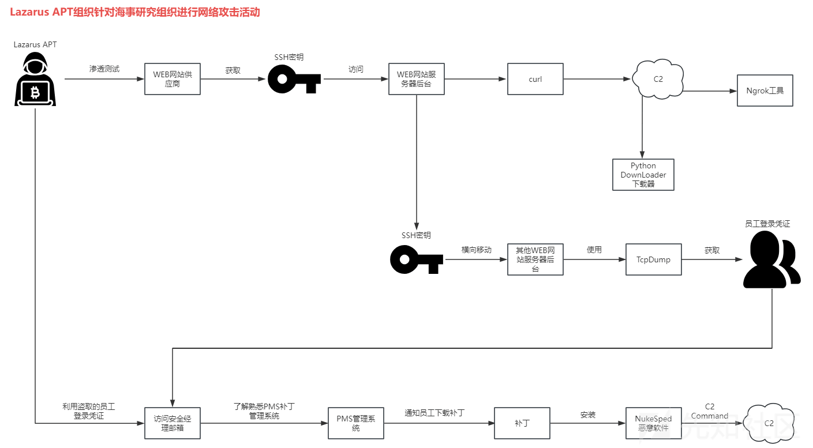](https://xzfile.aliyuncs.com/media/upload/picture/20240227203116-1a2b1820-d56c-1.png)

# 样本分析

1.样本使用如下异或算法，解密样本中的加密字符串，如下所示：  
  
2.通过 LoadLibraryA 加载所需要的解密出来的 DLL 模块，如下所示：  
[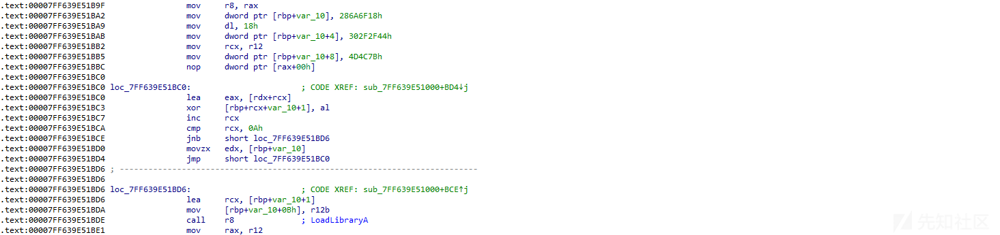](https://xzfile.aliyuncs.com/media/upload/picture/20240227203201-350c4ab0-d56c-1.png)  
3.调用 WSAStartup 初始化网络请求，如下所示：  
[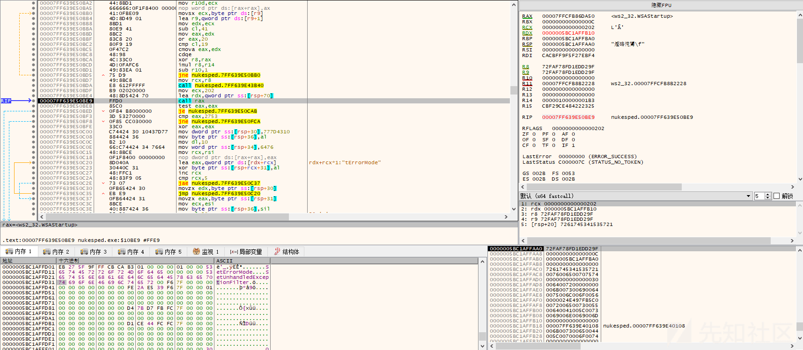](https://xzfile.aliyuncs.com/media/upload/picture/20240227203219-3f721ae8-d56c-1.png)  
4.获取黑客远程服务器 C2 地址，如下所示：  
[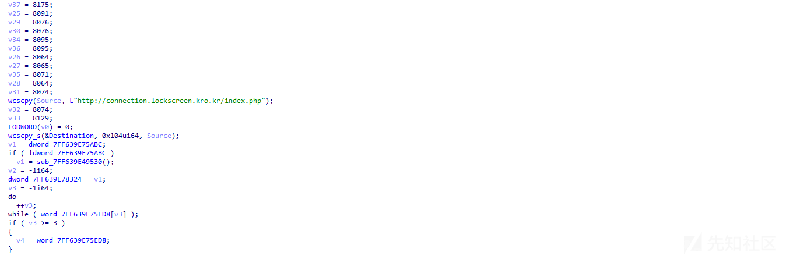](https://xzfile.aliyuncs.com/media/upload/picture/20240227203234-485bb9ac-d56c-1.png)  
5.计算拼接远程服务器请求 URL 连接，如下所示：  
  
6.添加 HTTP 请求标头，如下所示：  
[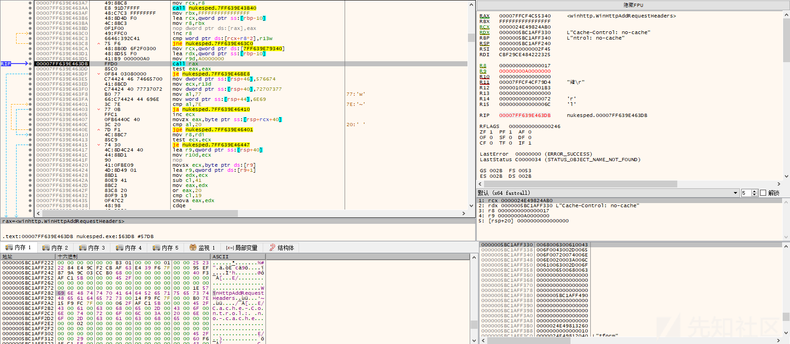](https://xzfile.aliyuncs.com/media/upload/picture/20240227203301-589395ce-d56c-1.png)  
添加的 HTTP 标头列表信息：  
Cache-Control: no-cache  
Accept: */*  
Content-Type: application/x-www-form-urlencoded  
Content-Length: 41  
7.通过 URL 链接向黑客远程服器发送 HTTP 请求，如下所示：  
[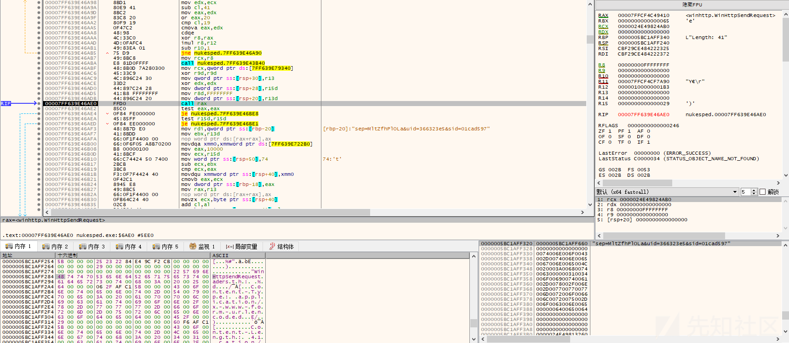](https://xzfile.aliyuncs.com/media/upload/picture/20240227203319-638e51b2-d56c-1.png)  
8.将请求数据写入 HTTP 服务器，如下所示：  
[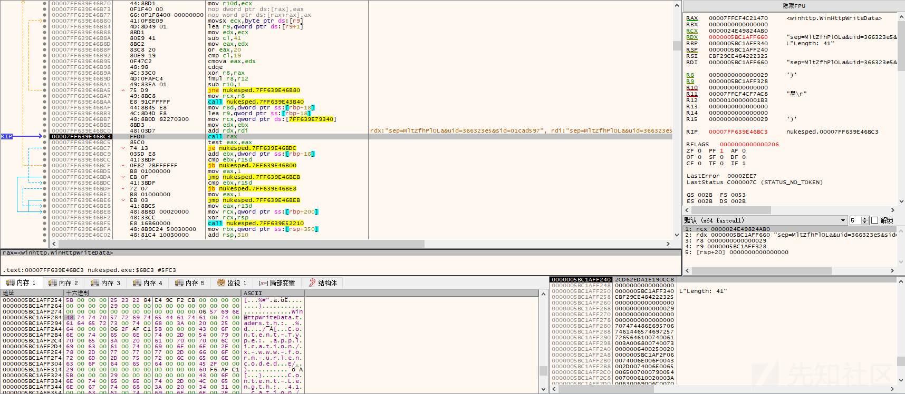](https://xzfile.aliyuncs.com/media/upload/picture/20240227203336-6d374dae-d56c-1.png)  
9.获取 HTTP 请求响应状态，如下所示：  
[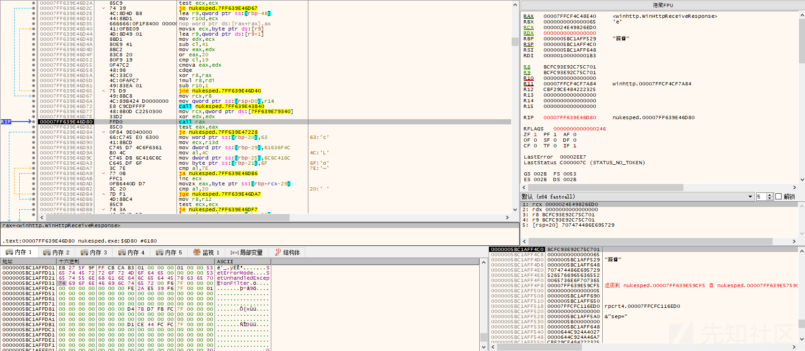](https://xzfile.aliyuncs.com/media/upload/picture/20240227203403-7d9d4dba-d56c-1.png)  
10.获取服务器资源，返回服务器数据，如下所示：  
[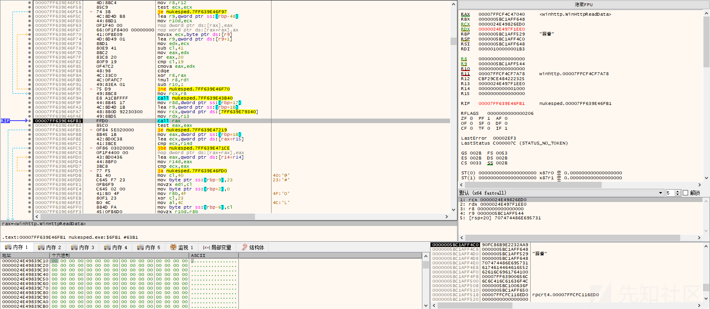](https://xzfile.aliyuncs.com/media/upload/picture/20240227203417-85b51032-d56c-1.png)  
11.获取相关信息，向黑客服务器发送 HTTP 数据请求命令，如下所示：  
[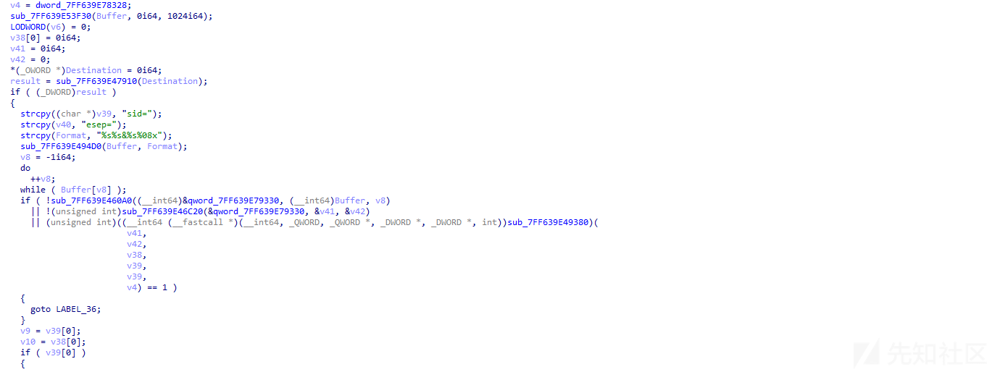](https://xzfile.aliyuncs.com/media/upload/picture/20240227203432-8ee1fa1c-d56c-1.png)  
12.通过不同的返回命令，执行不同的操作，如下所示：  
[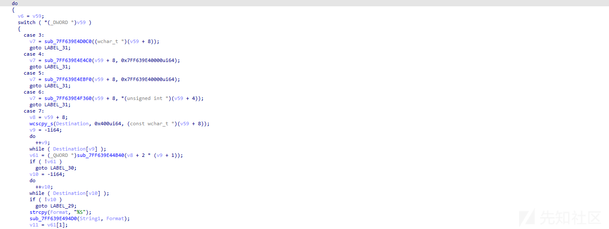](https://xzfile.aliyuncs.com/media/upload/picture/20240227203450-996d5832-d56c-1.png)  
执行文件的上传、下载、读写操作，以及进程相关操作等，与此前 Lazarus APT 组织攻击活动中使用的 FallChill 恶意软件非常相似。

# 关联分析

查询黑客服务器 C2 域名 connection.lockscreen.kro.kr，显示为可疑域名，同时关联到上面的 NukeSped 恶意软件样本与该域名通信，如下所示：  
[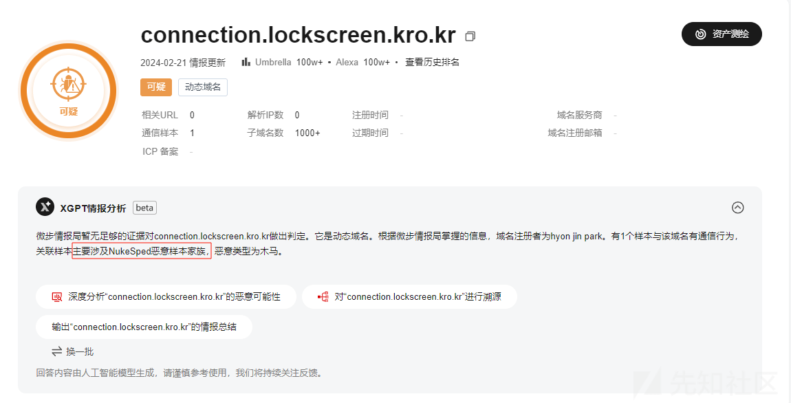](https://xzfile.aliyuncs.com/media/upload/picture/20240227203516-a92e00d2-d56c-1.png)  
关联到的 NukeSped 样本就是上面详细分析的攻击样本，如下所示：  
[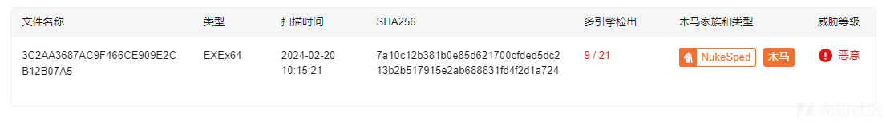](https://xzfile.aliyuncs.com/media/upload/picture/20240227203533-b31e5d12-d56c-1.png)  
2018 年，Lazarus APT 组织针对全球各地的银行以及其他金融公司进行攻击活动，通过建立一些虚假的合法网站，上传一些带有木马功能的交易应用软件，借助邮件传播到目标公司内部，受害者下载安装这些第三方应用软件，感染 FallChill 恶意软件，该攻击活动被称为 Operation AppleJeus。  
2019 年，该组织利用 NukeSped 进行攻击活动，NukeSped 的主要功能结构和此前 Lazarus APT 组织的另一款远控工具 FallChill 相似。  
此次攻击活动 Lazarus APT 组织同样使用了 NukeSped 恶意软件进行攻击，同时使用的域名 URL 等特征与此前攻击活动相类似，所以将此次攻击活动归因到 Lazarus APT 组织。

# 威胁情报

[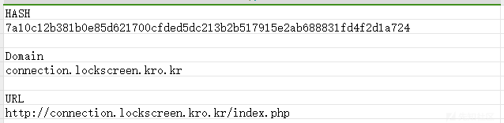](https://xzfile.aliyuncs.com/media/upload/picture/20240227203611-c999d9ea-d56c-1.png)

# 总结结尾

APT 是全球企业面临的最大的安全威胁之一，需要安全厂商密切关注，未来 APT 组织还会持续不断的发起网络攻击活动，同时也会持续更新攻击武器，开发新的恶意软件变种，研究各种新的攻击技术，使用新的攻击手法，进行更复杂的攻击活动，这将会不断增加安全威胁分析和情报人员分析溯源与应急响应的难度，安全研究人员需要不断提升自己的安全分析能力，更好的应对未来各种威胁挑战，安全对抗会持续升级，这是一个长期的过程。
