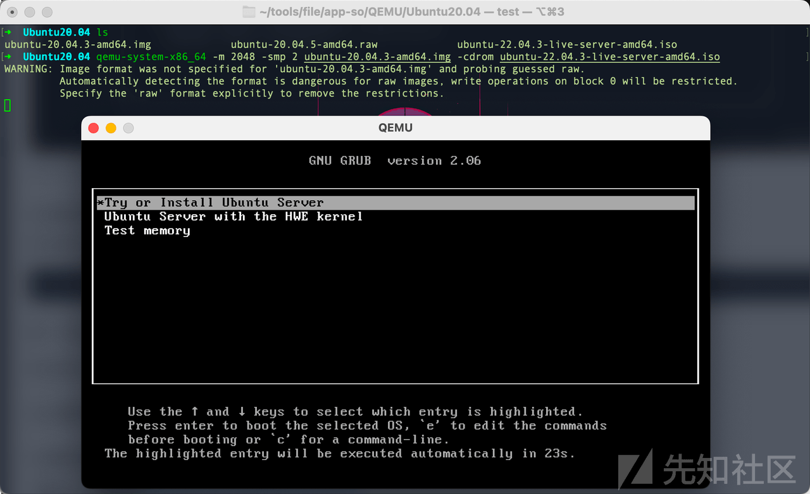
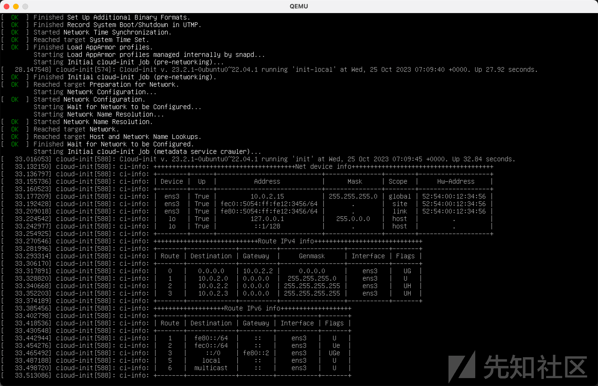

# M1 芯片下玩 pwn，GDB 调试的一些尝试「qemu」 - 先知社区

M1 芯片下玩 pwn，GDB 调试的一些尝试「qemu」

- - -

> 在 M1 芯片下了一些方式 gdb 调试方式，结果并不是很理想，今天用 QEMU 实现一下，它的优点是？
> 
> \-> QEMU 是一个支持跨平台虚拟化的虚拟机，QEMU 的优势是可以跨指令集，VMware 和 Virtualbox 之类的工具通常只能在 x86 计算机上虚拟出一个 x86 计算机，而 QEMU 支持在 x86 上虚拟出一个 ARM 计算机。

# 准备工作

## qemu 环境安装

```plain
brew install qemu
```

由于自己用的是苹果 m1 的芯片，因此选用 qemu-system-aarch64 的 arm 结构。

## 创建空的镜像

以下方式均可，我这里使用的是.img

```plain
$ qemu-img create ubuntu-20.04.5-amd64.img 20G
$ qemu-img create -f raw ubuntu-20.04.5-amd64.raw 20G
$ qemu-img create -f raw ubuntu-20.04.5-amd64.qcow2 20G
```

## 下载 ubuntu 系统镜像

```plain
https://cn.ubuntu.com/download/alternative-downloads
```

# 安装

建一个文件夹，把刚刚创建的空镜和 ubuntu 系统镜像移入

```plain
qemu-system-x86_64 -m 2048 -smp 2 --enable-kvm ubuntu-20.04.5-amd64.img -cdrom ubuntu-22.04.3-live-server-amd64.iso
或者（两条命令取决于你的镜像后缀）
qemu-system-x86_64 -m 2048 -smp 2 --enable-kvm ubuntu-20.04.5-amd64.raw -cdrom ubuntu-22.04.3-live-server-amd64.iso
```

我使用的命令

```plain
qemu-system-x86_64 -m 2048 -smp 2 ubuntu-20.04.5-amd64.img -cdrom ubuntu-22.04.3-live-server-amd64.iso
```

[](https://xzfile.aliyuncs.com/media/upload/picture/20240224003020-d5c7be3c-d268-1.png)

跟随步骤配置安装：（命令行界面安装 Ubuntu：[https://zhuanlan.zhihu.com/p/578074736）](https://zhuanlan.zhihu.com/p/578074736%EF%BC%89)

[](https://xzfile.aliyuncs.com/media/upload/picture/20240224003030-dc248026-d268-1.png)

输入账号密码进入使用：

之后关闭窗口，重新开启虚拟机

```plain
# 启动测试
qemu-system-x86_64 -m 2048 -smp 2 ubuntu-20.04.3-amd64.img
# 端口转发，方便 ssh 连接
qemu-system-x86_64 -m 2048 -smp 2 -net user,hostfwd=tcp::2222-:22 -net nic  ubuntu-20.04.3-amd64.img
```

## 远程连接

如果你想为 QEMU 虚拟机设置多个端口转发，可以在`-net user`选项中使用多个`hostfwd`参数。每个`hostfwd`参数对应一个端口的转发规则。以下是如何设置多个端口转发的示例：

```plain
qemu-system-x86_64 -m 2048 -smp 2 -net user,hostfwd=tcp::2222-:22,hostfwd=tcp::8080-:80 -net nic ubuntu-20.04.3-amd64.img
```

在上面的命令中，我添加了一个额外的`hostfwd`参数，将主机的端口 8080 映射到虚拟机的端口 80。

你可以按照相同的模式添加任意数量的`hostfwd`参数，以实现更多端口的转发。每个`hostfwd`参数的格式是`hostfwd=tcp::<主机端口>-:<虚拟机端口>`，其中`<主机端口>`是主机上要监听的端口，`<虚拟机端口>`是虚拟机内部的目标端口。这样你可以配置虚拟机以接受主机上的不同端口请求并将它们转发到不同的虚拟机内部端口。

# 快照与挂起

QEMU 可以使用以下命令来创建和恢复快照：

### 「关机状态」**创建快照：**

```plain
qemu-img snapshot -c snapshot_name vm_disk.qcow2
```

其中，snapshot\_name 是快照名称，vm\_disk.qcow2 是磁盘镜像文件名。创建快照后，可以在虚拟机中继续运行应用程序和操作系统。

### 「关机状态」**恢复快照：**

```plain
qemu-img snapshot -a snapshot_name vm_disk.qcow2
```

其中，snapshot\_name 是快照名称，vm\_disk.qcow2 是磁盘镜像文件名。恢复快照后，虚拟机将回到快照创建时的状态。

QEMU 还提供了一些其他的快照管理命令，如删除快照、列出快照等，用户可以根据自己的需求进行选择。

### 「开机状态」创建快照：

快捷键`option+control+2`进入 QEMU monitor 命令行

```plain
# 挂起虚拟机，这会将虚拟机的当前状态保存到名为 snapshot_name 的快照中。
savevm snapshot_name
# 要恢复虚拟机的运行状态，可以使用以下命令，这将加载名为 snapshot_name 的快照，将虚拟机恢复到该快照的状态。
loadvm snapshot_name
```

下面是如何启动虚拟机并加载快照的示例命令

```plain
qemu-system-x86_64 -m 2048 -smp 2 -net user,hostfwd=tcp::2222-:22 -net nic -incoming "exec:qemu-system-x86_64 -m 2048 -smp 2 -net user,hostfwd=tcp::2222-:22 -net nic -loadvm snapshot_name" ubuntu-20.04.3-amd64.img
```

在这个命令中，使用了 `-incoming` 参数，后面跟着一个引号括起的子命令，该子命令用于加载快照。你需要替换 `snapshot_name` 为你实际创建的快照的名称。这个命令将启动虚拟机并加载指定的快照，从而恢复到快照保存的状态。

由于`.img`不支持快照，需要转换为`.qcow2`

```plain
qemu-img convert -f raw -O qcow2 ubuntu-20.04.3-amd64.img ubuntu-20.04.3-amd64.qcow2
```

然后继续启动即可（注意后缀）：`qemu-system-x86_64 -m 2048 -smp 2 -net user,hostfwd=tcp::2222-:22,hostfwd=tcp::8080-:80 -net nic ubuntu-20.04.3-amd64.qcow2`

> 拓展资料：扩大虚拟大小
> 
> ```plain
> qemu-img resize your_disk_image.qcow2 100G
> ```

# Ghidra 变强术

可借鉴一下以下脚本，实现懒人调试，后面可能会整理一个起来放 GitHub 上面。

```plain
# coding: utf-8
# 将二进制文件，上传至 QEMU 虚拟机，开启调试、执行、创建题目
#@author 查壹壹
#@category Cha111Ng1
#@keybinding
#@toolbar qemu.png

import subprocess

print(u"""
++++++++++++++++++++++++++++++++++++++++++
+  微信公众号：攻有道       By:Cha111Ng1    +
++++++++++++++++++++++++++++++++++++++++++
    """)

def comd():
    choices = ["连接远程服务器至工作目录", "将当前二进制文件上传至服务器「并打开 shell」", "将当前二进制文件上传至服务器「并启动 GDB 调试」", "将当前二进制文件上传至服务器「并使用 socat 开启题目」"]
    # 使用 askChoice 显示选项`askChoices("test","test",choices)`设置多选
    selected_option = askChoice("远端调试插件 By：Cha111Ng1", "选择一个功能:", choices, "")
    print("[+]选择的功能为：" + selected_option)
    return selected_option

def updata_vps(comd):
    # 定义要执行的命令
    current_program = getCurrentProgram()
    program_name = current_program.getDomainFile().getName()
    file_location = current_program.getExecutablePath()
    if comd == "连接远程服务器至工作目录":
        command_to_execute = "ssh -t -p 2222 cha111ng1@kmac.local \'cd /home/cha111ng1/tools/ctf;/bin/bash\'\n"
    elif comd == "将当前二进制文件上传至服务器「并打开shell」":
        command_to_execute = "scp -P 2222 " + file_location + " cha111ng1@kmac.local:/home/cha111ng1/tools/ctf " + "&& ssh -t -p 2222 cha111ng1@kmac.local \'cd /home/cha111ng1/tools/ctf&&chmod +x "+program_name+";/bin/bash\'\n"
    elif comd == "将当前二进制文件上传至服务器「并启动GDB调试」":
        command_to_execute = "scp -P 2222 " + file_location + " cha111ng1@kmac.local:/home/cha111ng1/tools/ctf " + "&& ssh -t -p 2222 cha111ng1@kmac.local \'cd /home/cha111ng1/tools/ctf&&chmod +x "+program_name+"&&gdb "+program_name+";/bin/bash\'\n"
    elif comd == "将当前二进制文件上传至服务器「并使用socat开启题目」":
        command_to_execute = "scp -P 2222 " + file_location + " cha111ng1@kmac.local:/home/cha111ng1/tools/ctf " + "&& ssh -t -p 2222 cha111ng1@kmac.local \'cd /home/cha111ng1/tools/ctf&&chmod +x "+program_name+"&&socat TCP-LISTEN:1337,reuseaddr,fork EXEC:./"+program_name+";/bin/bash\'\n"
        print("[+]远程题目地址：nc kmac.local 1337")
    print("[+]执行的命令为：" + command_to_execute)
    # 创建一个包含AppleScript命令的字符串
    applescript = f"""
    tell application "Terminal"
        activate
        do script "{command_to_execute}"
    end tell
    """
    # 执行AppleScript以创建新终端窗口并执行命令
    subprocess.call(['osascript', '-e', applescript])
    print("[+]执行完毕\n")

try:
    print("[+]启动远端调试插件...")
    updata_vps(comd())
except Exception as e:
    print("[x]请检查网络连接情况")
    print("An error occurred:", e)
```
