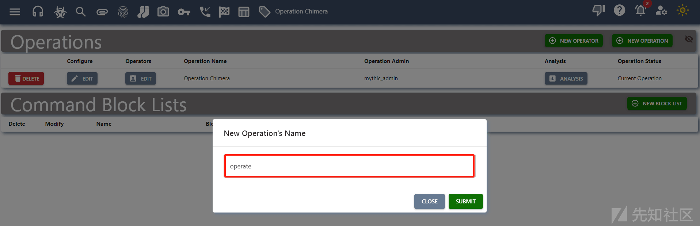
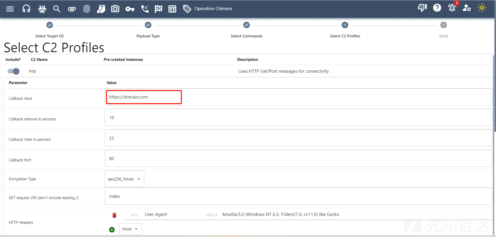
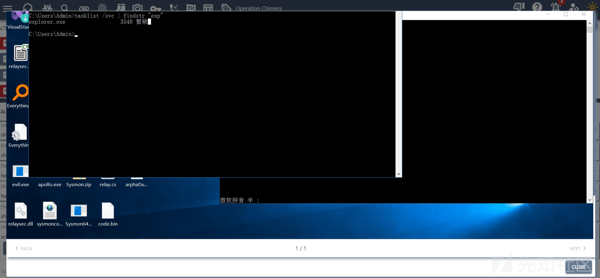

# Mythic C2 学习 - 先知社区

Mythic C2 学习

- - -

#### 基础

##### 用户相关的操作

Mythic 是一个多人运动的框架，所以我们可以使用管理员账户来添加其他的用户，选择右上角的用户图标。

[](https://xzfile.aliyuncs.com/media/upload/picture/20240205120343-8da8ee28-c3db-1.png)  
点击 NEW OPERATOR 进行添加用户。

[](https://xzfile.aliyuncs.com/media/upload/picture/20240205120348-90826fde-c3db-1.png)  
Mythic 可以对一个目标或一组进行权限管控，这里我的理解是相当于一个组，这个组里面有那些成员。

这里点击 Operation Chimera。这里的 Operation Chimera 就是一个组。

[](https://xzfile.aliyuncs.com/media/upload/picture/20240205120353-9376e986-c3db-1.png)  
我们也可以创建一个组，这里选择 New Operation，这里给定一个名字为 operate。

[](https://xzfile.aliyuncs.com/media/upload/picture/20240205120358-969fa7d8-c3db-1.png)  
然后我们可以给这个组中添加一个成员。

但是需要注意的是我们需要切换到这个组中，可以点击 MAKE CURRENT。

[](https://xzfile.aliyuncs.com/media/upload/picture/20240205120409-9d288534-c3db-1.png)  
选择 EDIT 添加成员。

[](https://xzfile.aliyuncs.com/media/upload/picture/20240205120419-a32e597c-c3db-1.png)  
这里我们可以添加如上图的这些成员，Role 表示权限的意思，就是说这些用户具有什么权限。Lead 表示管理员权限，具有添加/删除用户和更改用户的权限，operator 是普通用户权限，spectators 只能看不能操作。

这里我们给定 relaysec 为管理员账户。

[](https://xzfile.aliyuncs.com/media/upload/picture/20240205120424-a63cb050-c3db-1.png)  
然后退出 使用 relaysec 进行登录，选择 MAKE CURRENT 可以切换组。

[](https://xzfile.aliyuncs.com/media/upload/picture/20240205120433-ab487868-c3db-1.png)  
此时我们可以去创建一个 exe。

需要注意的是这里我们使用的是 operate 这个组创建的，此时我们是没有 Beacon 的，也就是说我们是看不到 Operation Chimera 组中的 Beacon 的。

[](https://xzfile.aliyuncs.com/media/upload/picture/20240205120438-ae632fac-c3db-1.png)  
如下图：

[](https://xzfile.aliyuncs.com/media/upload/picture/20240205120442-b0fb217a-c3db-1.png)  
当我们切换回 Operation Chimera 组中的时候，才可以看到之前通过 Operation Chimera 创建的 Beacon 上线的。

[](https://xzfile.aliyuncs.com/media/upload/picture/20240205120447-b3f5f080-c3db-1.png)  
那么如果是普通用户权限的话是无法更改组的。

这里我们创建了另一个用户为 relaysec\_user 登录之后尝试将 relaysec 这个用户从组中移除掉。

[](https://xzfile.aliyuncs.com/media/upload/picture/20240205120455-b82cb63e-c3db-1.png)  
点击 Update 会发现报错了。

[](https://xzfile.aliyuncs.com/media/upload/picture/20240205120459-baf4723a-c3db-1.png)  
我们还可以为每个用户可以执行那些命令进行限制，比如说我们给 relaysec\_user 这个用户设置它不能执行 shell 这个命令。

[](https://xzfile.aliyuncs.com/media/upload/picture/20240205120504-bdb841c2-c3db-1.png)  
然后选择 EDIT 进行修改，需要注意的是我们更改是 Operation Chimera 这个组中的 relaysec\_user 这个用户。

[](https://xzfile.aliyuncs.com/media/upload/picture/20240205120509-c0a0b3d8-c3db-1.png)  
登录上去之后需要切换到 Operation Chimera 组中。

然后尝试使用 shell 执行命令。

可以看到这里是无法执行命令的。

[](https://xzfile.aliyuncs.com/media/upload/picture/20240205120514-c3811c6e-c3db-1.png)  
如果使用 run 的话是可以正常执行命令的。

[](https://xzfile.aliyuncs.com/media/upload/picture/20240205120518-c6357afe-c3db-1.png)  
如上就是用户的操作了。

##### C2 Profile

选择类似于耳机的图标。

如下图就是我们安装的所有的代理和 C2 Profile 的信息。

[](https://xzfile.aliyuncs.com/media/upload/picture/20240205120523-c9153eda-c3db-1.png)  
如果我们需要访问 C2 配置的话，我们可以点击向下箭头的 View/Edit Config。

[](https://xzfile.aliyuncs.com/media/upload/picture/20240205120528-cbdfb4b0-c3db-1.png)  
如下图：

配置是一个 JSON 格式的文件，允许管理员配置服务器的标头以及端口，或是否启用 TLS，如果要启动 SSL 的话那么可以将 use\_ssl 设置 true，如果 key path 以及 cert path 是存在的，那么 Mythic 会将这些文件作为 HTTP2 C2 配置文件，如果没有的话，会自动生成签名证书。

[](https://xzfile.aliyuncs.com/media/upload/picture/20240205120533-cf2846e6-c3db-1.png)  
这里我们可以选择启动这个配置。

[](https://xzfile.aliyuncs.com/media/upload/picture/20240205120538-d1f29570-c3db-1.png)  
启动之后：

[](https://xzfile.aliyuncs.com/media/upload/picture/20240205120542-d499e1e8-c3db-1.png)

##### Payloads

这里是我们创建的所有的 payload，可以点击 Download 进行下载。

[](https://xzfile.aliyuncs.com/media/upload/picture/20240205120547-d7a5a8e0-c3db-1.png)  
我们可以选择 ACTIONS 或 Create Payload 来创建一个 Payload。

选择 Generate New Payload。

[](https://xzfile.aliyuncs.com/media/upload/picture/20240205120553-dac9c2b8-c3db-1.png)  
这里我们可以选择多种操作系统，比如 Linux，Windows MacOS。

这里我们选择 Linux 操作系统。

[](https://xzfile.aliyuncs.com/media/upload/picture/20240205120557-dd7c8662-c3db-1.png)  
这里我们选择 medusa C2，它支持 python2 或者 python3，以及支持加密操作，这里加密操作的话使用的是 python cryptography 库来进行加密操作。

[](https://xzfile.aliyuncs.com/media/upload/picture/20240205120602-e01e657a-c3db-1.png)  
我们选择 NEXT。

这里的话我们选择那些命令，这里选择全部。

[](https://xzfile.aliyuncs.com/media/upload/picture/20240205120606-e3124742-c3db-1.png)  
最终需要选择 C2 配置文件，这里我们选择上面演示过的 HTTP C2 配置文件。

这里的回调地址，我们填写你的 IP 地址，关键在于你使用 HTTPS 还是使用 HTTP，如果使用 HTTPS 的话那么端口需要指定为 443，这里的回调地址也可以填写 CDN 的地址，可以通过 CDN 进行回调。

需要注意的是我们需要在 Http Profile C2 这里将 SSL 设置为 true。

这里除了配置回调地址以及端口之外还可以配置代理的日期 请求方式等等。

[](https://xzfile.aliyuncs.com/media/upload/picture/20240205120614-e76e7888-c3db-1.png)  
我们选择 NEXT。

最终会生成 medusa.py 文件。

[](https://xzfile.aliyuncs.com/media/upload/picture/20240205120618-ea3045d8-c3db-1.png)  
生成的 payload 就在 Payloads 功能中。

[](https://xzfile.aliyuncs.com/media/upload/picture/20240205120627-ef5751dc-c3db-1.png)  
然后我们将它拉到 Linux 机器中进行执行。

可以看到成功上线。

[](https://xzfile.aliyuncs.com/media/upload/picture/20240205120633-f2d388bc-c3db-1.png)  
我们切换到 Payloads 功能这里，我们可以对我们生成的 Payload 进行配置。

[](https://xzfile.aliyuncs.com/media/upload/picture/20240205120639-f659651a-c3db-1.png)

[](https://xzfile.aliyuncs.com/media/upload/picture/20240205120642-f86f6994-c3db-1.png)  
Apollo 是一个基于 C# 的代理，仅在 Windows 上运行，具有内置的进程迁移命令、mimikatz 和程序集执行等功能。基于 Python 的 Medusa 可在 Windows、Linux 和 MacOS 上运行，但缺少 Windows 特定的功能，尽管它包含执行任意 Python 代码的能力。Poseidon 是用 Go 编写的，面向 Linux 和 MacOS，并具有一些 MacOS 特定的功能，例如 `launchd` 持久性。

在 C2 通道方面，它们都支持 http(s) C2 配置文件，而只有 Apollo 支持 SMB C2 在环境内部进行通信。Poseidon 拥有自己的基于 TCP 的环境内 C2 通信配置文件，并支持 Websocket。

我们可以通过 Mythic C2 Profile 来进行安装其他通信管道。  
[https://github.com/MythicC2Profiles](https://github.com/MythicC2Profiles)  
我们可以执行 link 命令来选择先前连接到的已知主机，或者定义新的主机。

[](https://xzfile.aliyuncs.com/media/upload/picture/20240205120658-01d08ab8-c3dc-1.png)

##### SOCKS5

Apollo 和 Medusa 都是支持 SOCKS5 代理的，我们可以通过 socks 命令进行代理，需要注意的是 socks5 代理的端口，必须是 7000-7010 之间，我们可以通过.env 中的 MYTHIC\_SERVER\_DYNAMIC\_PORTS 选项进行更改。

需要注意的是 Mythic 仅支持 Socks5 代理使用 TCP，而不支持 UDP。

[](https://xzfile.aliyuncs.com/media/upload/picture/20240205120704-0580248e-c3dc-1.png)  
如下通过 socks 命令创建代理。

[](https://xzfile.aliyuncs.com/media/upload/picture/20240205120710-08d6fbb2-c3dc-1.png)  
我们选择类似于袜子的图标打开 SOCKS5 选项，类似于 CobaltStrike 中的 SOCKS。

可以看到成功创建 SOCKS 代理，这里我们可以尝试使用 SOCKS CAP 进行测试。

[](https://xzfile.aliyuncs.com/media/upload/picture/20240205120716-0c37efdc-c3dc-1.png)  
可以看到成功连接，但是需要注意的是我们需要将 beacon 设置为 Sleep 0，这样的话代理就会快一点，要不然可能会连不上。

[](https://xzfile.aliyuncs.com/media/upload/picture/20240205120720-0f202c82-c3dc-1.png)

[](https://xzfile.aliyuncs.com/media/upload/picture/20240205120726-1242610a-c3dc-1.png)

#### 进阶使用

##### 生成 bin 文件

生成 shellcode.bin 文件 通过白加黑方式上线。

选择 Create Payload，在这里选择 Shellcode。

[](https://xzfile.aliyuncs.com/media/upload/picture/20240205120731-15740c70-c3dc-1.png)  
后面就和创建 EXE 时是一样的了。

通过白加黑上线。

[](https://xzfile.aliyuncs.com/media/upload/picture/20240205120736-1871cdf4-c3dc-1.png)

[](https://xzfile.aliyuncs.com/media/upload/picture/20240205120738-19e3248a-c3dc-1.png)

##### Upload 功能

Upload 功能可以上传文件，类似于 Cobalt Strike。

[](https://xzfile.aliyuncs.com/media/upload/picture/20240205120748-1fb3548e-c3dc-1.png)

##### Powershell 上传

使用 powershell\_import 功能可以导入 powershell 文件。

点击 TASK 上传。

[](https://xzfile.aliyuncs.com/media/upload/picture/20240205120753-2280928a-c3dc-1.png)

##### Powershell 使用

这里我们上传了一个 PowerUpSQL.ps1 脚本。

尝试使用脚本中的命令执行。  
powershell Get-SQLInstanceDomain -Verbose

##### secret\_token 命令

这个命令主要是和 CobaltStrike 中的窃取令牌是一样的，它需要传递一个参数也就是进程的 PID，如果不传递参数的话，那么默认进程为 winlogon.exe。

就比如说你拿到的机器里面有域管的进程，那么你就可以进行窃取，然后横向即可。

##### spawnto\_x86 以及 spawnto\_x64

这两个命令和 CobaltStrike 中的 spawn 命令是一样的都是派生一个会话。

##### shinject 命令

这个命令主要是将 shellcode 注入到其他进程中来进行上线操作，和 inject 命令对比来说更加的 OPSEC，因为如果使用 inject 命令去注入进程的话，那么如果注入不成功可能导致自身的 Beacon 下线，那么如果使用 shinject 就算注入不成功，也不会导致自身的 Beacon 下线。

##### screenshot\_inject 命令

这个命令主要用于屏幕截图。

```plain
screenshot_inject pid count interval
```

```plain
screenshot_inject 3548 1 1
```

当我们执行完这个命令之后，点击 VIEW SCREENSHOSTS。

[](https://xzfile.aliyuncs.com/media/upload/picture/20240205120823-34697a7a-c3dc-1.png)

[](https://xzfile.aliyuncs.com/media/upload/picture/20240205120826-36485abe-c3dc-1.png)

##### screenshot 命令

截取当前屏幕。

[](https://xzfile.aliyuncs.com/media/upload/picture/20240205120831-38ed9144-c3dc-1.png)

##### rm 命令

删除指定文件。

```plain
rm [path]
```

##### rev2self 命令

这个命令主要是应用于我们如果窃取其他令牌了，那么就通过这个命令进行恢复。

```plain
rev2self
```

##### pth 命令

PTH 主要用于 Hash 传递。其实和 Cobalt Strike 差不多。

```plain
pth -Domain [domain] -User [user] -NTLM [ntlm] [-AES128 [aes128] -AES256 [aes256] -Run [cmd.exe]]
```

##### psinject 命令

这个命令可以在指定的进程中执行 powershell 命令。

例如：

```plain
psinject 3548 whoami
```

[](https://xzfile.aliyuncs.com/media/upload/picture/20240205120848-439f6b12-c3dc-1.png)

##### net\_dclist 命令

这个命令主要是用于获取当前域或者指定域的域控制器。

```plain
net_dclist
net_dclist domain
```

##### keylog\_inject 命令

这个命令用户键盘记录，需要指定进程的 PID。

```plain
keylog_inject [pid]
```

##### blockdlls 命令

这个命令用于阻止非 Microsoft DLL 加载到我们的 Beacon 当中。

```plain
blockdlls
```

[](https://xzfile.aliyuncs.com/media/upload/picture/20240205120858-492ae32c-c3dc-1.png)

##### assembly\_inject

将 dotnet 加载到目标进程中，然后加载进程并执行。

```plain
assembly_inject[pid][assembly][args]
```

#### C2 Profile 相关

##### Athena

安装：

```plain
sudo ./mythic-cli install github https://github.com/MythicAgents/Athena
```

[](https://xzfile.aliyuncs.com/media/upload/picture/20240205120908-4f7870aa-c3dc-1.png)  
装好之后点击 Payload 可以看到。

[](https://xzfile.aliyuncs.com/media/upload/picture/20240205120912-51e08864-c3dc-1.png)  
选择 CreatePayload 创建，选择 athena。

[](https://xzfile.aliyuncs.com/media/upload/picture/20240205120917-54aadb4e-c3dc-1.png)  
这些参数我们待会再说，先点击 NEXT。

最终会生成一个 zip 文件。

[](https://xzfile.aliyuncs.com/media/upload/picture/20240205120922-57df5d3a-c3dc-1.png)  
我们解压可以看到里面有一个 exe 文件，当我们执行的时候就会回调到我们的 Mythic 中。

但是文件确实是很大的。

[](https://xzfile.aliyuncs.com/media/upload/picture/20240205120927-5a9e13b8-c3dc-1.png)  
可以看到返回我们的 Beacon。

[](https://xzfile.aliyuncs.com/media/upload/picture/20240205120932-5d826fa2-c3dc-1.png)  
这里我们不仅可以直接使用 EXE，也可以使用它的源码，在他的源码基础上进行更改。

下面的参数我们主要注意的是 Obfuscate，如果勾选上的话，那么就会使用 Obfuscate 对我们的载荷进行加密处理。还有就是你生成的是 Debug 版本还是 Release 版本。

[](https://xzfile.aliyuncs.com/media/upload/picture/20240205120937-60a3eeae-c3dc-1.png)
