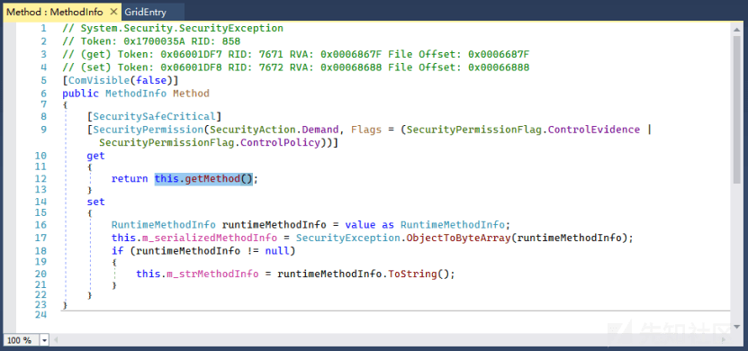
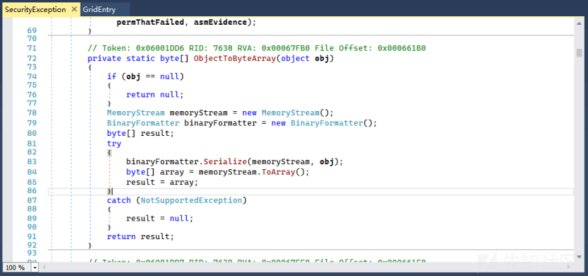
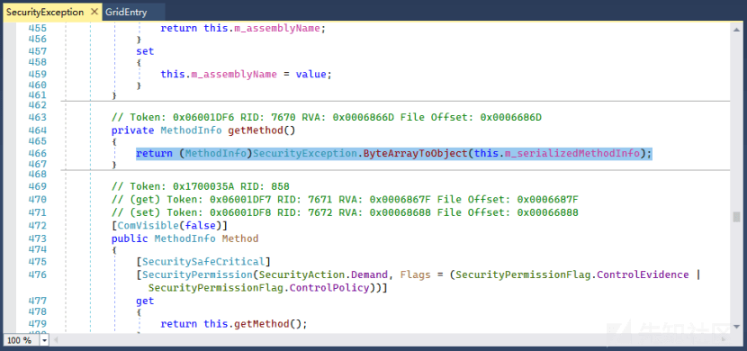
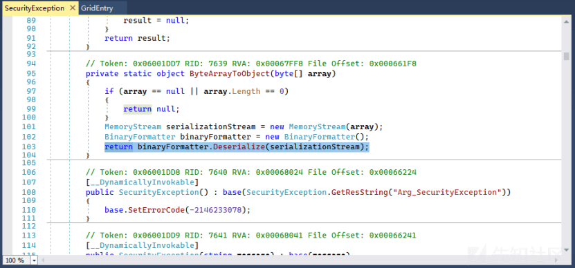
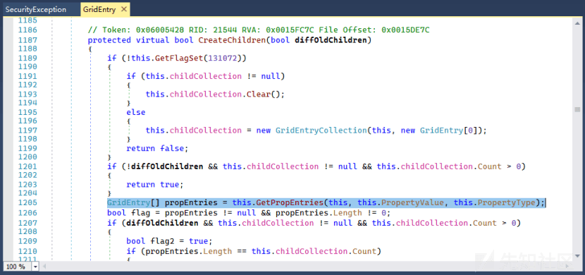
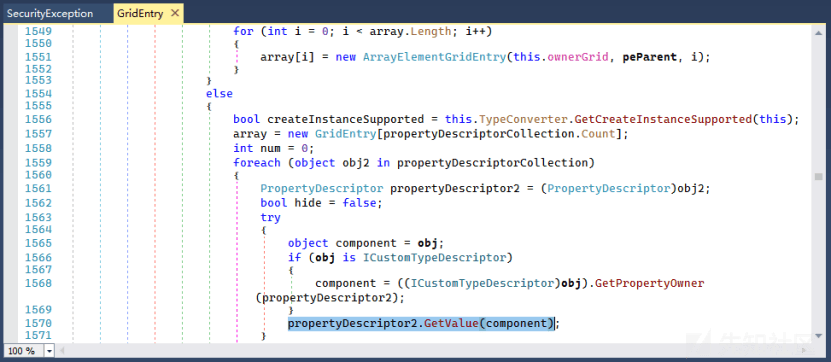
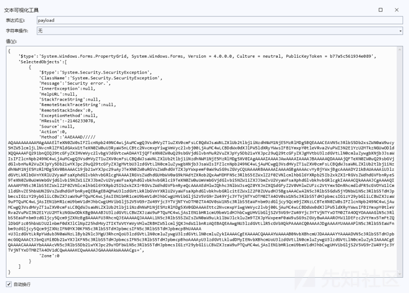
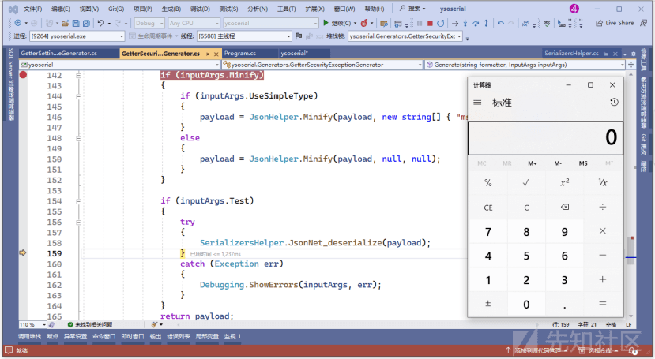

# .NET 反序列化漏洞最新 gadget 链 GetterSecurityException - 先知社区

.NET 反序列化漏洞最新 gadget 链 GetterSecurityException

- - -

# GetterSecurityException gadget

> 细致解读 2023 年 Hexacon 会议上发表的 .NET 反序列化最新链路的白皮书，本次介绍 GetterSecurityException gadget，System.Security.SecurityException 位于 mscorlib.dll 程序集，用于应用程序尝试执行需要特定权限的操作时，因权限不足或与 CAS 策略冲突时导致的异常错误信息。

- - -

## 链路 1 SecurityException

SecurityException 类的 Method 成员，对象访问器 Getter 调用了内部方法 this.getMethod()，修改器 Setter 通过 ObjectToByteArray 方法转换为字节，如下图所示  
[](https://xzfile.aliyuncs.com/media/upload/picture/20231102105614-62ac1ea2-792b-1.png)  
通过反编译 ObjectToByteArray 得知，内部使用 BinaryFormatter.Serialize 将对象序列化成一个 MemoryStream，并通过 ToArray 方法返回 byte\[\]类型，如下图所示  
[](https://xzfile.aliyuncs.com/media/upload/picture/20231102105625-694f45a4-792b-1.png)  
因此访问 SecurityException 对象的 Method 属性时触发的 getMethod() 方法，一定是通过 BinaryFormatter 格式化器反序列化对象，打开后发现调用了 ByteArrayToObject，如下图所示  
[](https://xzfile.aliyuncs.com/media/upload/picture/20231102105649-77abda68-792b-1.png)  
从方法名知道 ByteArrayToObject 正好与 Setter 里的 ObjectToByteArray 相反，用于反序列化操作，如下图所示  
[](https://xzfile.aliyuncs.com/media/upload/picture/20231102105705-81772a2a-792b-1.png)  
因此攻击者控制 Method 属性通过 setter 赋值的方式添加 BinaryFormatter 攻击载荷，便能在调用 getter 时触发反序列化漏洞。

## 链路 2 PropertyGrid

System.Windows.Forms.PropertyGrid 是 Windows Forms 中的一个控件，通常用于创建属性窗格，便于用户直观地查看和编辑对象的属性值。这个 gadget 是通过修改器 setter 设置 SelectedObjects 属性时触发的，该 setter 很复杂并且包含大量代码，重要的是 Refresh() 方法，Refresh 方法触发 RefreshProperties、UpdateSelection、CreateChildren 这一系列的多个方法的调用，然后进入 GridEntry.GetPropEntries，如下图所示  
[](https://xzfile.aliyuncs.com/media/upload/picture/20231102105757-a08f2cd2-792b-1.png)  
该方法内部迭代对象的成员，并通过 PropertyDescriptor2.GetValue 方法获取每个成员值，这个过程会调用每个成员的访问器 getter，如下图所示  
[](https://xzfile.aliyuncs.com/media/upload/picture/20231102105813-a9f0292a-792b-1.png)

## 编码实践

根据上述两条链路的原理性分析，我们可以尝试着构造用于恶意反序列化的攻击代码，结合 Ysoserial.Net 的代码实现如下

```plain
payload = @"{
    '$type':'System.Windows.Forms.PropertyGrid, System.Windows.Forms, Version = 4.0.0.0, Culture = neutral, PublicKeyToken = b77a5c561934e089',
    'SelectedObjects':[" + sePayload + @"]}";
```

PropertyGrid 类 的 SelectedObjects 属性是一个数组，由包含了攻击载荷的变量 sePayload 构建的，sePayload 变量定义的代码如下

```plain
string sePayload = @"{
    '$type':'System.Security.SecurityException',
    'ClassName':'System.Security.SecurityException',
    'Message':'Security error.',
    'InnerException':null,
    'HelpURL':null,
    'StackTraceString':null,
    'RemoteStackTraceString':null,
    'RemoteStackIndex':0,
    'ExceptionMethod':null,
    'HResult':-2146233078,
    'Source':null,
    'Action':0,
    'Method':'" + b64encoded + @"',
    'Zone':0
}";
```

Method 是一组进行 Base64 编码后基于 BinaryFormatter 生成的攻击载荷，原理前文已经分析过，此处不再赘述，调试时打印出完整的 Payload，如下贴图所示  
[](https://xzfile.aliyuncs.com/media/upload/picture/20231102110050-0794842c-792c-1.png)  
最后通过上面这段 JSON.NET 代码完成整条攻击链路的反序列化，成功启动本地计算器进程，如下图所示  
[](https://xzfile.aliyuncs.com/media/upload/picture/20231102110114-15e159c4-792c-1.png)
