# NET 环境下的多款同源 RAT 对比 - 先知社区

NET 环境下的多款同源 RAT 对比

- - -

## 概述

前段时间，笔者发布了一篇《QuasarRAT 与 AsyncRAT 同源对比及分析》文章，文章发布后，还是获得了不少小伙伴的关注，同时还从其他渠道收到了小伙伴的私信：

[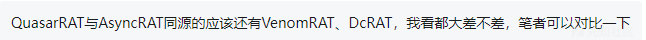](https://xzfile.aliyuncs.com/media/upload/picture/20240301215639-868da6d6-d7d3-1.png)

首先，非常感谢大家的关注及厚爱，其次，针对小伙伴提到的内容，我准备以此为切入口详细研究对比一下。

为了能够更全面的对比分析，笔者准备从如下角度开展研究工作：

-   下载 VenomRAT 项目、DcRAT 项目、在野 DcRAT 样本及在野 VenomRAT 样本、xRAT 项目进行对比分析；
-   尝试对上述样本配置信息及通信数据进行解密，并对解密算法进行对比；

通过分析，笔者发现上述 VenomRAT 项目、DcRAT 项目、在野 DcRAT 样本及在野 VenomRAT 样本使用的配置信息加密算法均相同，以《AsyncRAT 加解密技术剖析》文章中“配置信息解密”章节中描述的解密流程作为基础解密算法标准，梳理各样本针对配置信息解密算法的区别如下：

-   VenomRAT：PBKDF2 算法运算中，salt 字符串值为：VenomByVenom
-   DcRAT：PBKDF2 算法运算中，salt 字符串值为：DcRatByqwqdanchun
-   在野 DcRAT：PBKDF2 算法运算中，salt 值为函数参数传入；
-   在野 VenomRAT 样本
    -   配置信息中的 Key 数据将用于 PBKDF2 算法的输入，通过迭代计算生成两个加密密钥，一个用于 aes 运算，密钥长度**16 字节**，一个用于 HMACSHA256 哈希值计算，密钥长度**64 字节**；
    -   PBKDF2 算法运算中，salt 十六进制值为：**BFEB1E56FBCD973BB219022430A57843003D5644D21E62B9D4F180E7E6C33941**
-   xRAT：解密算法不同
    -   将 key 字符串的**MD5 值**作为 AES 算法 key；
    -   待解密字符串的前**16 个字节**为 AES 算法的 iv 值，后续字节为加密数据；

## VenomRAT

为了能够更好的对 VenomRAT 进行研究，笔者的第一想法就是看看网络中是否能够下载类似于 QuasarRAT 项目的具备控制端的 VenomRAT 程序。通过一系列网络调研，笔者确实是下载了好几个 VenomRAT 项目，起初还觉得很顺利，直到使用的时候，笔者才发现下载的 VenomRAT 项目**均携带了木马**。

为了能够继续对 VenomRAT 进行研究，笔者通过一系列努力，能够比较坎坷的使用 VenomRAT 某个版本，运行截图如下：

[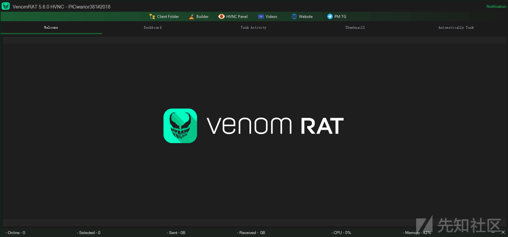](https://xzfile.aliyuncs.com/media/upload/picture/20240301215653-8f033b64-d7d3-1.png)

### 生成 VenomRAT 端木马

在 GUI 界面中选择【Builder】菜单即可对 VenomRAT 端木马进行自定义配置，支持自定义配置的内容有：

-   IP/DNS标签页：外联IP、外联端口、Pastebin、Group Name、互斥对象名
-   Startup：自启动信息、启用反虚拟机选项、禁用任务管理器选项、启用蓝屏选项
-   Assembly：属性信息、图标信息

相关截图如下：

[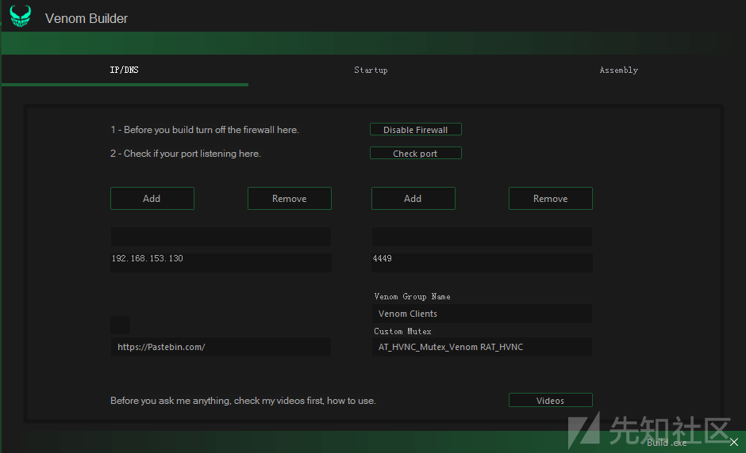](https://xzfile.aliyuncs.com/media/upload/picture/20240301215707-9763bcc0-d7d3-1.png)

### 木马上线

在受控主机中运行 VenomRAT 端木马程序，即可成功实现木马上线，上线后即可实现对受控主机的远控管理，相关截图如下：

[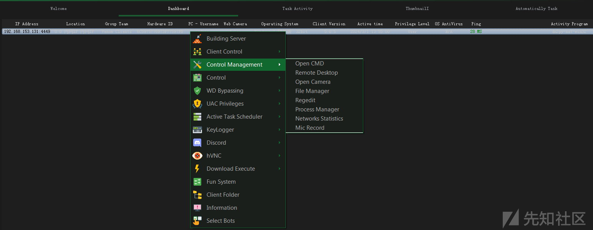](https://xzfile.aliyuncs.com/media/upload/picture/20240301215722-a06db6ea-d7d3-1.png)

### 配置信息解密

通过分析，笔者发现，VenomRAT 端木马的反编译代码结构与 AsyncRATClient 端木马的反编译代码结构相同，均在 Client 命令空间的 Settings 类中存在大量的加密配置信息数据，相关截图如下：

[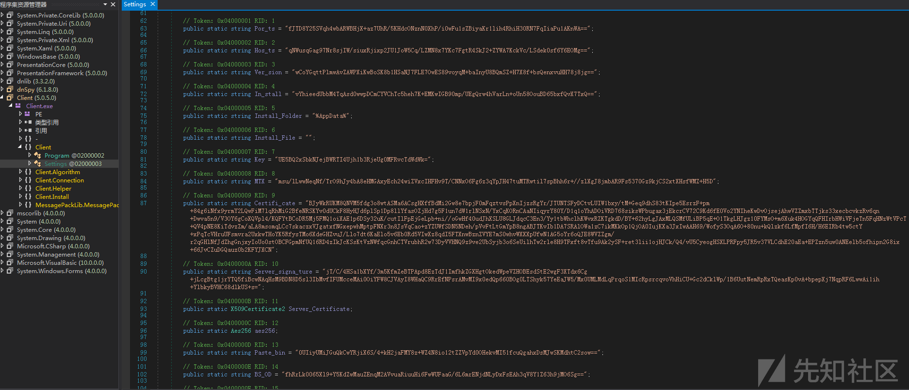](https://xzfile.aliyuncs.com/media/upload/picture/20240301215736-a8afc42e-d7d3-1.png)

尝试基于《AsyncRAT 加解密技术剖析》文章中提到的自动化解密脚本，并对解密脚本做简单的修改，可成功对上述配置信息进行解密，解密后截图如下：

[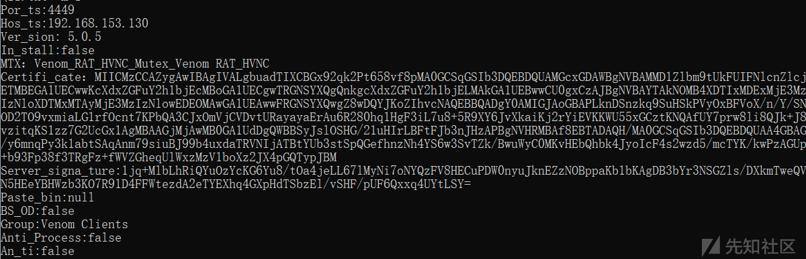](https://xzfile.aliyuncs.com/media/upload/picture/20240301215751-b1b762fc-d7d3-1.png)

### 通信数据解密

对 VenomRAT 木马上线过程及远程控制过程进行流量抓取分析，发现其通信数据与 AsyncRAT 木马通信数据一致，均分为两层：

-   第一层加密：调用 TLS 对通信数据进行加密；
-   第二层加密：调用 gzip 对通信载荷及传输模块进行加密；

相关截图如下：

[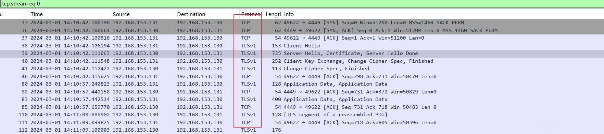](https://xzfile.aliyuncs.com/media/upload/picture/20240301215806-bab7cefa-d7d3-1.png)

为了进一步探究其通信模型，笔者准备从如下角度进行 TLS 通信解密尝试：

-   尝试基于《适用于不支持指定密钥套件的 NET 程序的 TLS 解密方法》文章中提到的修改 TLS 密钥套件的方法，修改其 TLS 通信过程中使用的密钥套件；
-   尝试基于《AsyncRAT 加解密技术剖析》文章中提到的私钥提取方法及通信解密方法，对 VenomRAT 木马 TLS 通信数据包进行解密；

TLS 通信解密后截图如下：

[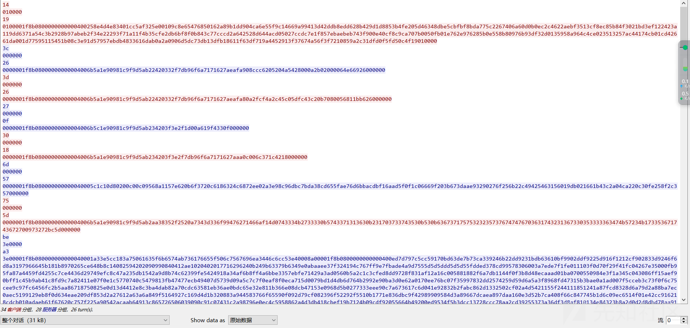](https://xzfile.aliyuncs.com/media/upload/picture/20240301215821-c3566ac6-d7d3-1.png)

通过分析，发现其 TLS 解密后的通信数据结构与 AsyncRAT 木马 TLS 解密后的通信数据结构极其相似，因此，尝试基于《AsyncRAT 通信模型剖析及自动化解密脚本实现》文章中提供的通信解密程序对其进行批量解密，发现可成功对其进行解密，相关截图如下：

[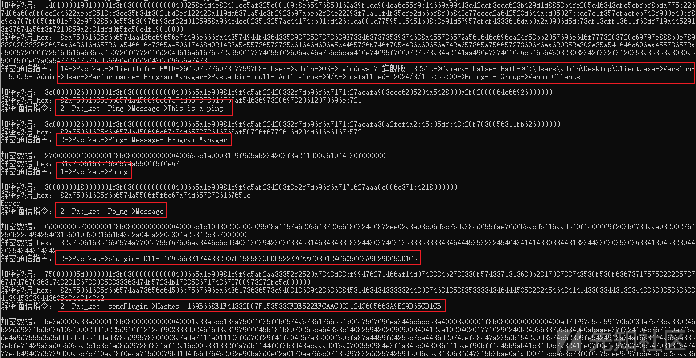](https://xzfile.aliyuncs.com/media/upload/picture/20240301215835-cbba6546-d7d3-1.png)

## DcRAT

在对 DcRAT 项目的查找过程中，笔者发现也不是很顺利，因为笔者发现网络中曝光的 DcRAT 与 github 上 DcRAT 项目中的木马代码结构不一样，但是在进一步分析过程中，笔者发现其均使用了相同的配置信息解密算法，因此，笔者准备分别对其进行研究对比。

通过运行 github 上的 DcRAT 项目，可成功打开 DcRAT 控制端，相关截图如下：

[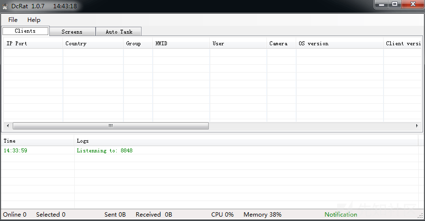](https://xzfile.aliyuncs.com/media/upload/picture/20240301215848-d3bcf92a-d7d3-1.png)

### 生成 DcRAT 端木马

在 GUI 界面中选择【File】->【Builder】菜单即可对 DcRAT 端木马进行自定义配置，支持自定义配置的内容有：

-   外联 IP、外联端口、Pastebin、Group Name、互斥对象名
-   自启动信息、启用反虚拟机选项、禁用任务管理器选项、启用蓝屏选项
-   属性信息、图标信息

相关截图如下：

[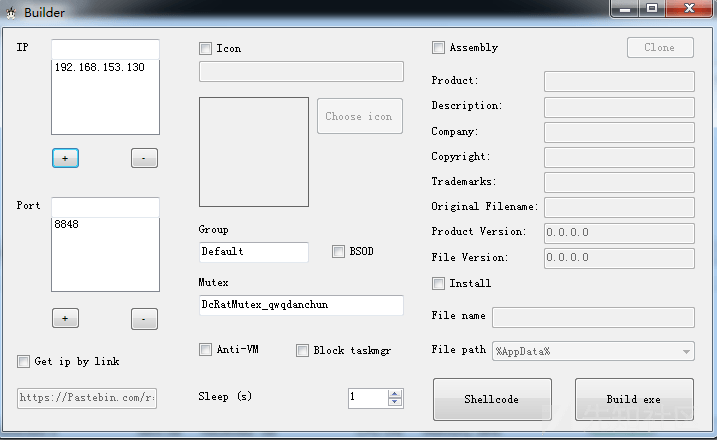](https://xzfile.aliyuncs.com/media/upload/picture/20240301215903-dcbaa73e-d7d3-1.png)

### 木马上线

在受控主机中运行 DcRAT 端木马程序，即可成功实现木马上线，上线后即可实现对受控主机的远控管理，相关截图如下：

[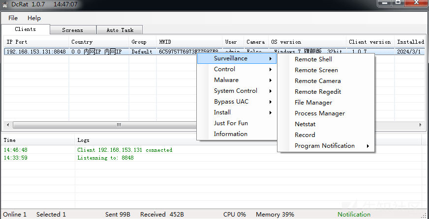](https://xzfile.aliyuncs.com/media/upload/picture/20240301215917-e521850a-d7d3-1.png)

### 配置信息解密

通过分析，笔者发现，DcRAT 端木马的反编译代码结构与 AsyncRATClient 端木马的反编译代码结构也相同，均在 Client 命令空间的 Settings 类中存在大量的加密配置信息数据，相关截图如下：

[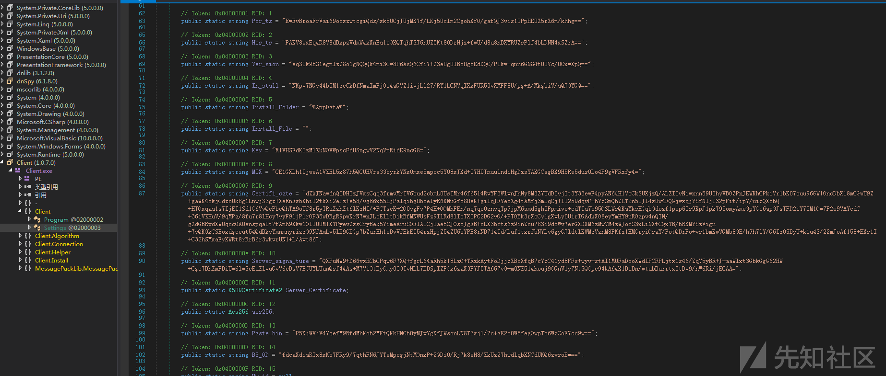](https://xzfile.aliyuncs.com/media/upload/picture/20240301215932-edc03dc8-d7d3-1.png)

使用相同的配置信息解密方法，并对解密脚本做简单的修改，可成功对上述配置信息进行解密，解密后截图如下：

[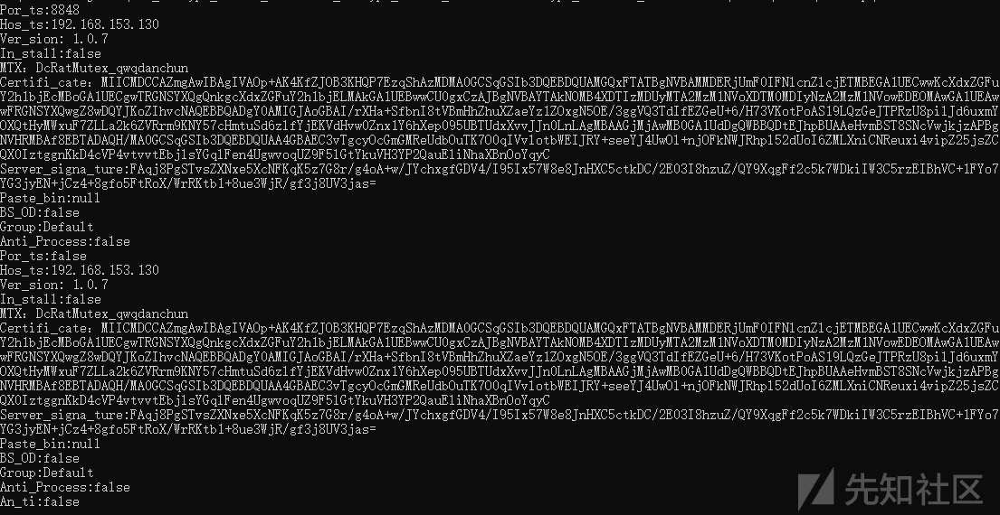](https://xzfile.aliyuncs.com/media/upload/picture/20240301215947-f6f3cbd0-d7d3-1.png)

### 通信数据解密

对 DcRAT 木马上线过程及远程控制过程进行流量抓取分析，发现其通信数据也与 AsyncRAT 木马通信数据一致，相关截图如下：

[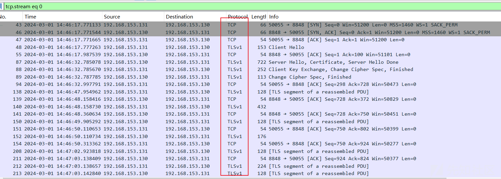](https://xzfile.aliyuncs.com/media/upload/picture/20240301220005-01a01d40-d7d4-1.png)

因此，使用相同的 TLS 通信数据解密方法，可成功对其 TLS 通信数据进行解密，解密后截图如下：

[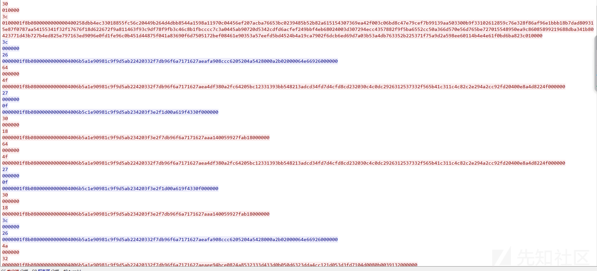](https://xzfile.aliyuncs.com/media/upload/picture/20240301220019-0a36f320-d7d4-1.png)

使用相同的通信解密程序对其 TLS 解密后通信数据进行批量解密，发现可成功对其进行解密，相关截图如下：

[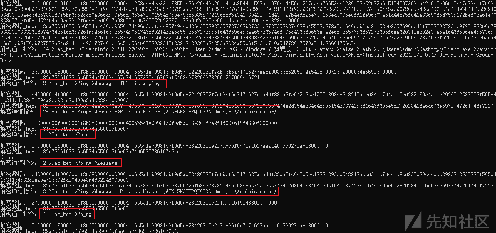](https://xzfile.aliyuncs.com/media/upload/picture/20240301220035-1360a126-d7d4-1.png)

## 在野 DcRAT 样本剖析

为了能够全面的对 DcRAT 进行分析，笔者从网络中下载了一个最新曝光的 DcRAT 木马，相关曝光信息如下：

[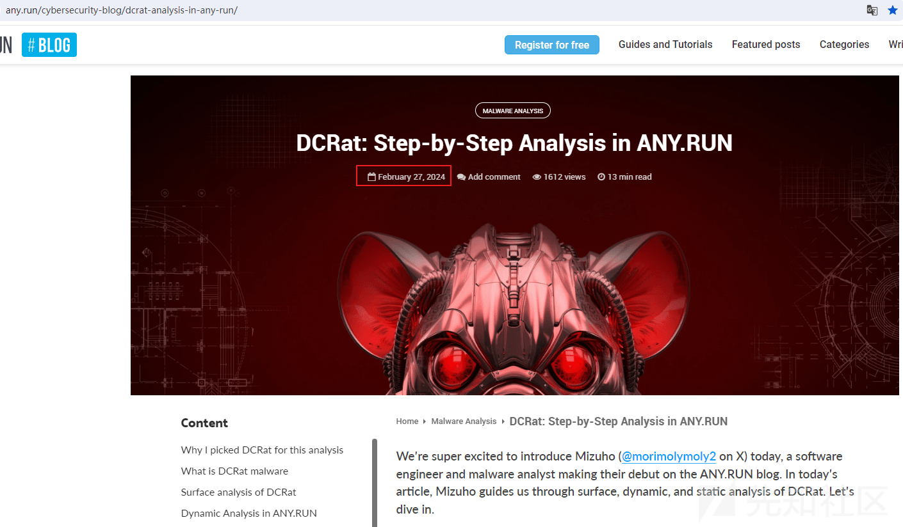](https://xzfile.aliyuncs.com/media/upload/picture/20240301220051-1d398078-d7d4-1.png)

对其进行简单分析，笔者发现此在野 DcRAT 样本的反编译代码结构与 DcRAT 项目中的木马反编译代码结构不同，相关截图如下：

[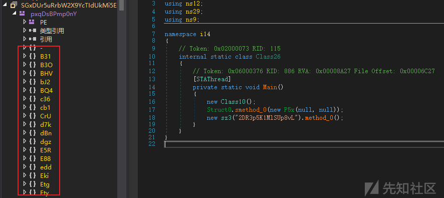](https://xzfile.aliyuncs.com/media/upload/picture/20240301220107-2678287e-d7d4-1.png)

### 配置信息解密

进一步对其进行分析，笔者发现此样本调用的配置信息解密函数与 AsyncRATClient 端木马调用的配置信息解密函数相同，相关截图如下：

[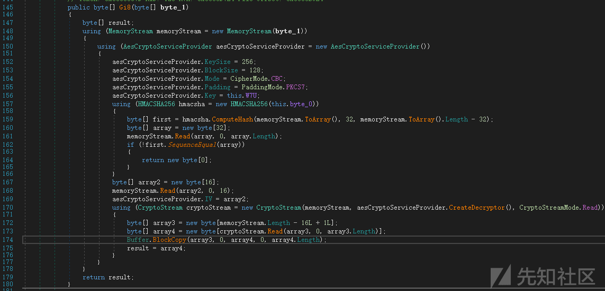](https://xzfile.aliyuncs.com/media/upload/picture/20240301220122-2f355478-d7d4-1.png)

尝试使用相同的配置信息解密方法，并对解密脚本做简单的修改，可成功对样本中的配置信息内容进行解密，相关截图如下：

[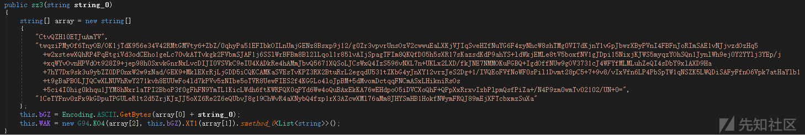](https://xzfile.aliyuncs.com/media/upload/picture/20240301220135-3777ddf4-d7d4-1.png)

[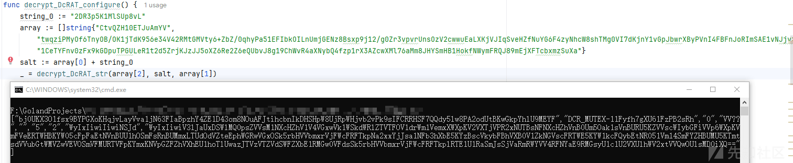](https://xzfile.aliyuncs.com/media/upload/picture/20240301220152-41241b38-d7d4-1.png)

解密后的数据中还包含 base64 编码信息，可手动对其进行二次处理，相关操作如下：

```plain
原始字符串：
"twqziPMyOf6TnyOB/OK1jTdK956e34V42RMtGMVty6+ZbZ/0qhyPa51EFIbkOILnUmjGENz8Bsxp9j12/g0Zr3vpvrUnsOzV2cwwuEaLXKjVJIqSveHZfNuYG6F4zyNhcW8shTMg0VI7dKjnY1vGpJbwrXByPVnI4FBFnJoRImSAE1vNJjvzdOzHq5+w2xstewXQhRP4PqEtgiVd3odCEho1geLc70vkATTvkgk2FVbmSJAF1j6SSlWrBFBm8Bl2lLqol1r85lvAIjSpagTFIm8QKQfD05h5sXR17sKazsdKdP9ahYS+ldWkjEMLe8tV5boxfNV1gJDpi15NixjKJWS5myqzYOhSQn1JynlWh9ej0Y2YYlj3YEp/j+xqWYvOvnHPVdOt928Z9+jep98h0SxvkGnrNxLvcDIJI0VSVkC9eIU4XADkRe4hAMmJbvQ5671XQSoLJCsWxQ4IzS596vNXL7n+UKLx2LXD/fkJNE7NMMOKuFGBQ+IgdOffNUw9gOV3731cJ4WFYfMLMLuhZeQI4sDbY9xlAXD9Ha+7hY7Dx9sk3u9ybZZ0DP0nxW2w9zNad/GEX9+MklEXrRjLjGDD5iCQKCAMKaSVEsTvKPZ3RX2BtuRrL2egqdU531tZKbG4yJnXY12vrzJeS2Dg+1/IVQEoFVfNoWF0sPil1Dvmt28pC5+7+9v8/vIxVfn6LP4PbSpTW1qNSZK5LWQDiSAFyFfnO6Vpk7atHaYlb1+t9gBaPBOLJJQCwXLNUVhRwY271kvh8EUUwFo4ld7kPVv5zNIbe5oTVR8UewFIES2f4KGGLo4loJpBM+5dMvomDctqqFNCmASxLHikniRsOs+5ci4I0hig0khqu1JYM8hNxrlaTPI2BboP3f0gFhFN9YmTL1KicLWdh6ftKWRFQX0qPYd6Ww4oQuBAxEkKA76wEHdpoO5iDVCXoQhF+QPpXxRrxvIzbPlpmQsfPiZa+/N4P9zm0wmTv02102/UN+0="
解密后字符串：
["bj0UKX3O1fsx9BYPGXoKHqjvLayVva1jN63FIaBpzhY4ZE1D43om8NOuAFJtihcbnIkDHSHpW8UjRpWHjvb2vPk9sIFCRRHSF7QQdy5lw8PA2odUtBKwGkpYhlU9MEYF","DCR_MUTEX-11Fyfh7gXU61FzPB2sRh","0","VV??","","5","2","WyIxIiwiIiwiNSJd","WyIxIiwiV3lJaUxDSWlMQ0psZVVsM1NXcHZhV1V4VGxwVk1WSkdWRlZTVTFOV1drWm1VemxXWXpKV2VXTjVPR2xNUTBsNFNXcHZhVnB0Um5Oak1sVnBURU5KZVVscWIybGFiVVp6WXpKVmFVeERTWHBKYW05cFpFaEtNVnBUU1hOSmFsRnBUMmxLTUdOdVZteEphWGRwVGxOSk5rbHVVbmxrVjFWcFRFTkpNa2xxYjJsa1NFb3hXbE5KYzBscVkybFBhVXB0V1ZkNGVscFRTWE5KYW1kcFQybEtNR051Vm14SmFYZHBUMU5KTmtsdVVubGtWMVZwVEVOSmVFMURTVFpKYmxKNVpGZFZhVXhEU1hoTlUwazJTVzVTZVdSWFZXbE1RMGw0VFdsSk5rbHVVbmxrVjFWcFRFTkplRTE1U1RaSmJsSjVaRmRWYVV4RFNYaE9RMGsyU1c1U2VXUlhWV2xtVVQwOUlsMD0iXQ=="]
二次处理后结果：
["bj0UKX3O1fsx9BYPGXoKHqjvLayVva1jN63FIaBpzhY4ZE1D43om8NOuAFJtihcbnIkDHSHpW8UjRpWHjvb2vPk9sIFCRRHSF7QQdy5lw8PA2odUtBKwGkpYhlU9MEYF","DCR_MUTEX-11Fyfh7gXU61FzPB2sRh","0","VV??","","5","2","["1","","5"]","["1","["","","{"0":"{SYSTEMDRIVE}/Users/","1":"false","2":"false","3":"true","4":"true","5":"true","6":"true","7":"false","8":"true","9":"true","10":"true","11":"true","12":"true","13":"true","14":"true"}"]"]"]

*****************************************************************

原始字符串：
"6DuJThqLqhXMRndyjcrpSvR+NowgfgPUfadTAPLT7RzQEaQ3bZTS2B69cJ+6b9gMItPpYbJufWtQMjS77Qehab2Q+nE+hYfWDfb+T9kHg8KoSt+NAc00NmL95jbxX5qWdMKBiNsSTppEM/HD93PwYFKZCrLv7VhGHiQP8GV5/h8KKSZ+93DQTyTyXIU9kKzo6EM/bmELphag+kIO5kj28pRQY9kCOtzWU5LxezAmxJdrcp+EGjpZSgMpeynFIZE9"
解密后字符串：
["0","XPkWC3v1QKzwU0J5dAKeTsPBsYp18q5mbMsCqw5G1NTNQgIkoqWSj2GpAinnN33kONVHHGPqEEnGZBvMQFMRTmCiGDCHIS37Ts8DKAchbqOfP9P8xbXIqlQlKxBEEHhv"]

*****************************************************************

原始字符串：
zCEl5MLNt1nWGMDkINJb16lVnQwVhHlbE0ON/jzps092WYVbsn8xXBFE1kAEM8FE6Zu4vZdIFAVDmeASNmk+Cal/saaZFTYrBzpD6gHAmeV/2nzMJLz3TeS9r66FgUt0rP/vImvRIfwAfOjcSrkD1sdkzQFiIyDJZ3lO3QnF4FxspW89vlhx6OBIISdDgT0h

解密后字符串：
[["http://019214cm.nyashland.top/","EternalLineLowgameDefaultsqlbaseasyncuniversal"]]
```

### 外联通信

通过分析，发现此在野 DcRAT 样本的外联通信方式与 DcRAT 项目中的木马外联通信方式不同：

-   此在野 DcRAT 样本使用 HTTP 请求作为外联通信方式；
-   DcRAT 项目中的木马使用 TLS 作为外联通信方式；

相关截图如下：

[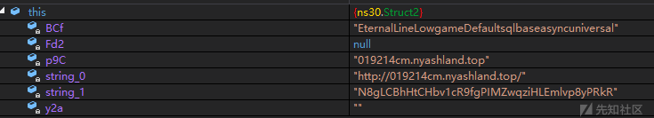](https://xzfile.aliyuncs.com/media/upload/picture/20240301220210-4c019c56-d7d4-1.png)

[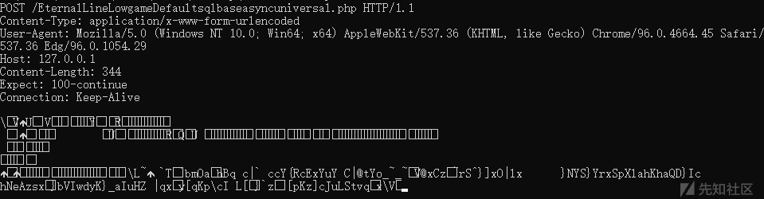](https://xzfile.aliyuncs.com/media/upload/picture/20240301220226-5591ee92-d7d4-1.png)

## 在野 VenomRAT 样本剖析

为了能够全面的对 VenomRAT 进行分析，笔者又从网络中下载了一个 VenomRAT 木马，相关信息如下：

[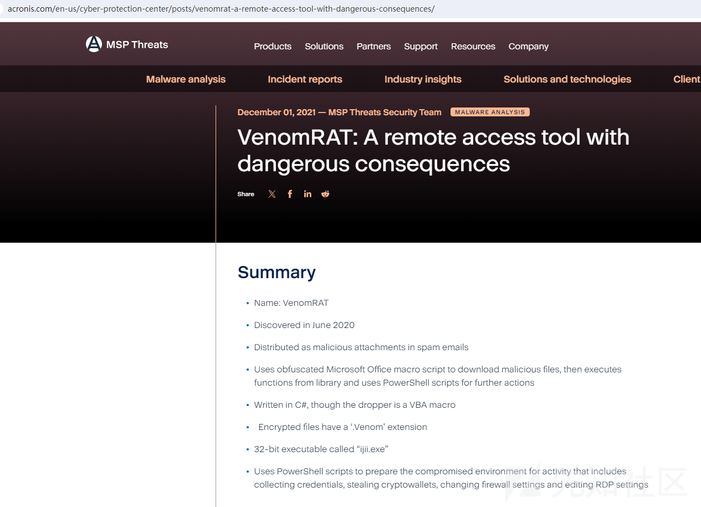](https://xzfile.aliyuncs.com/media/upload/picture/20240301220241-5ed15d80-d7d4-1.png)

[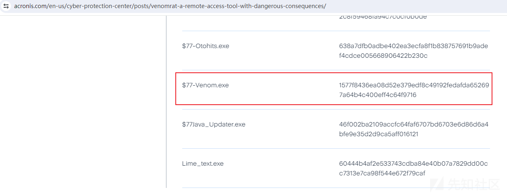](https://xzfile.aliyuncs.com/media/upload/picture/20240301220258-68e75bf8-d7d4-1.png)

### 样本分析

通过分析，笔者发现此样本并非实际 VenomRAT 木马实体，进一步分析，笔者发现当此样本运行后，此样本将在内存中释放 VenomRAT 木马实体，相关截图如下：

[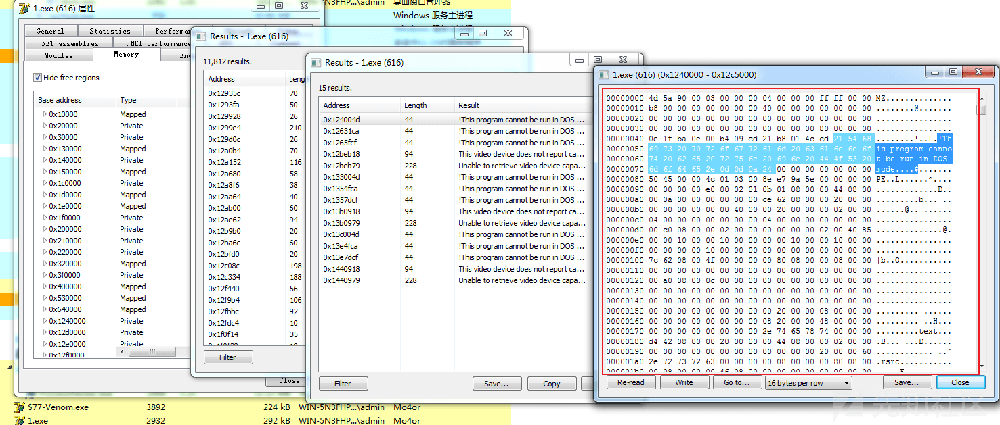](https://xzfile.aliyuncs.com/media/upload/picture/20240301220313-71b6ab26-d7d4-1.png)

使用 de4dot 对其去混淆，然后使用 dnspy 查看 VenomRAT 木马实体的反编译代码，发现 VenomRAT 木马实体的反编译代码与 VenomRAT 项目中的木马反编译代码相同，相关截图如下：

[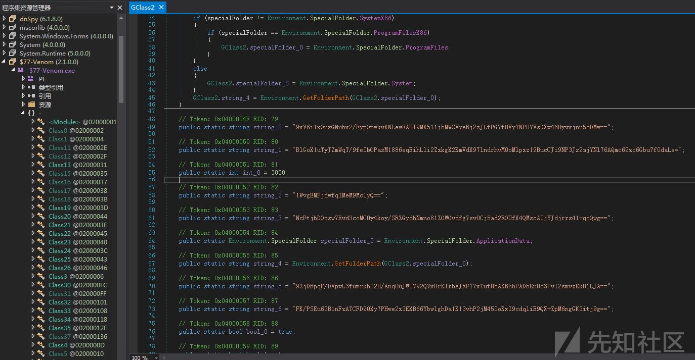](https://xzfile.aliyuncs.com/media/upload/picture/20240301220329-7afd2246-d7d4-1.png)

### 配置信息解密

使用相同的配置信息解密方法，并对解密脚本做简单的修改，可成功对上述配置信息进行解密，解密后截图如下：

[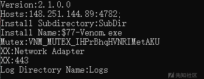](https://xzfile.aliyuncs.com/media/upload/picture/20240301220343-8358a258-d7d4-1.png)

## xRAT

在之前的《QuasarRAT 与 AsyncRAT 同源对比及分析》文章中，笔者曾对 QuasarRAT 工具的版本进行过梳理，梳理内容如下：QuasarRAT 工具的早期版本名称为 xRAT，xRAT 于 2014 年 7 月 8 日发布 xRAT v2.0.0.0 RELEASE1 版本，后续于 2015 年 8 月 23 日发布 Quasar v1.0.0.0 版本。

通过运行 github 上的 xRAT 项目，可成功打开 xRAT 控制端，相关截图如下：

[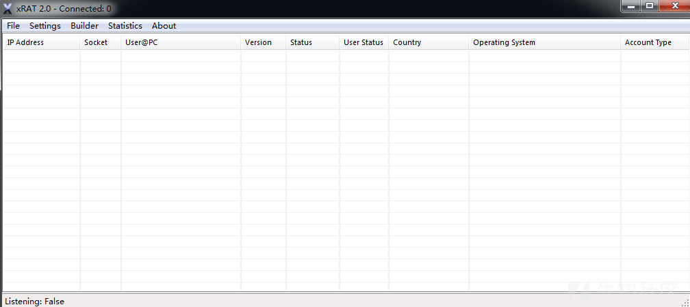](https://xzfile.aliyuncs.com/media/upload/picture/20240301220357-8c1d871e-d7d4-1.png)

### 生成 xRAT 端木马

在 GUI 界面中选择【Builder】菜单即可对 xRAT 端木马进行自定义配置，支持自定义配置的内容有：

-   Connection：IP/Hostname、Port、Password、Reconnect Delay；
-   Install：Mutex、Install Client 选项、Install Name、Install Path、Install Subfolder、Example Path、Registry Key Name；
-   Assembly Information：属性信息；
-   Additional Settings：启用管理员权限选项、修改图标、启用键盘记录选项；

相关截图如下：

[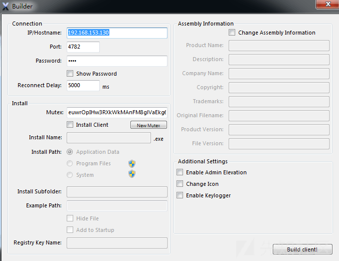](https://xzfile.aliyuncs.com/media/upload/picture/20240301220413-954efc3c-d7d4-1.png)

### 木马上线

在受控主机中运行 xRAT 端木马程序，即可成功实现木马上线，上线后即可实现对受控主机的远控管理，相关截图如下：

[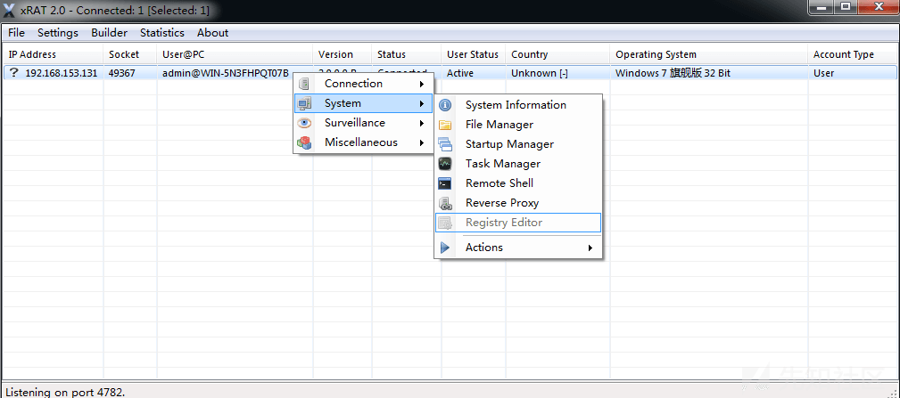](https://xzfile.aliyuncs.com/media/upload/picture/20240301220429-9ef0f254-d7d4-1.png)

### 配置信息解密

通过分析，笔者发现，xRAT 端木马的反编译代码结构与 AsyncRATClient 端木马的反编译代码结构也基本相同，相关截图如下：

[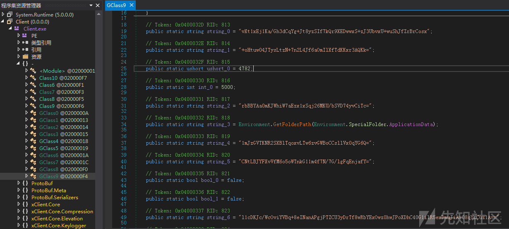](https://xzfile.aliyuncs.com/media/upload/picture/20240301220446-a938234a-d7d4-1.png)

通过对其配置信息解密算法解密分析，发现其解密算法整体逻辑相同，但还是存在多处不同点，因此，尝试修改解密算法对其进行解密，发现可成功解密，解密后截图如下：

[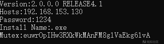](https://xzfile.aliyuncs.com/media/upload/picture/20240301220504-b40d5c36-d7d4-1.png)

修改后的解密脚本代码如下：

[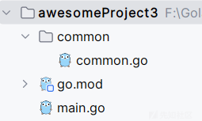](https://xzfile.aliyuncs.com/media/upload/picture/20240301220520-bd83ff04-d7d4-1.png)

-   main.go

```plain
package main

import (
    "awesomeProject3/common"
    "encoding/hex"
    "fmt"
    "strings"
)

func main() {
    file_in := "C:\\Users\\admin\\Desktop\\11.txt"

    key := ""
    strs := common.FileToSlice(file_in)
    for _, str := range strs {
        if strings.Contains(str, "public static string string_8 = ") {
            key = strings.Split(strings.Split(str, ` = "`)[1], `";`)[0]
        }
    }
    for _, str := range strs {
        if strings.Contains(str, "public static string string_0 = ") {
            Version := strings.Split(strings.Split(str, ` = "`)[1], `";`)[0]
            fmt.Print("Version:")
            decrypt_xRAT_str(key, common.Base64_Decode(Version))
        } else if strings.Contains(str, "public static string string_1 = ") {
            Hosts := strings.Split(strings.Split(str, ` = "`)[1], `";`)[0]
            fmt.Print("Hosts:")
            decrypt_xRAT_str(key, common.Base64_Decode(Hosts))
        } else if strings.Contains(str, "public static string string_2 = ") {
            Password := strings.Split(strings.Split(str, ` = "`)[1], `";`)[0]
            fmt.Print("Password:")
            decrypt_xRAT_str(key, common.Base64_Decode(Password))
        } else if strings.Contains(str, "public static string string_5 = ") {
            Install_Name := strings.Split(strings.Split(str, ` = "`)[1], `";`)[0]
            fmt.Print("Install Name:")
            decrypt_xRAT_str(key, common.Base64_Decode(Install_Name))
        } else if strings.Contains(str, "public static string string_6 = ") {
            Mutex := strings.Split(strings.Split(str, ` = "`)[1], `";`)[0]
            fmt.Print("Mutex:")
            decrypt_xRAT_str(key, common.Base64_Decode(Mutex))
        }
    }
}

func decrypt_xRAT_str(key string, input []byte) {
    aeskey, _ := hex.DecodeString(common.CalculateMD5(key))

    aes_iv := input[:16]
    encode_data := input[16:]

    output, _ := common.Aes_z_Decrypt(encode_data, aeskey, aes_iv)
    fmt.Println(string(output))
    //fmt.Println(hex.EncodeToString(output))
}
```

-   common.go

```plain
package common

import (
    "bufio"
    "crypto/aes"
    "crypto/cipher"
    "crypto/md5"
    "encoding/base64"
    "encoding/hex"
    "fmt"
    "os"
)

func Aes_z_Decrypt(input, key, iv []byte) (output, newiv []byte) {
    output, err := aes_decrypt_cbc(input, key, iv)
    //fmt.Println(hex.EncodeToString(output))
    if err != nil {
        panic(err)
    }
    newiv = append(newiv, input[len(input)-16:]...)
    return
}
func aes_decrypt_cbc(data []byte, key []byte, iv []byte) ([]byte, error) {
    data_new := []byte{}
    data_new = append(data_new, iv...)
    data_new = append(data_new, data...)

    block, err := aes.NewCipher(key)
    if err != nil {
        return nil, err
    }

    if len(data_new) < aes.BlockSize {
        return nil, fmt.Errorf("加密数据太短")
    }

    iv = data_new[:aes.BlockSize]
    data_new = data_new[aes.BlockSize:]

    if len(data_new)%aes.BlockSize != 0 {
        return nil, fmt.Errorf("加密数据长度不是块大小的整数倍")
    }

    mode := cipher.NewCBCDecrypter(block, iv)
    mode.CryptBlocks(data_new, data_new)

    data_new = pkcs5UnPadding(data_new)

    return data_new, nil
}

func pkcs5UnPadding(ciphertext []byte) []byte {
    length := len(ciphertext)
    unpadding := int(ciphertext[length-1])
    return ciphertext[:(length - unpadding)]
}

func Base64_Decode(encodedMessage string) []byte {
    decodedMessage, err := base64.StdEncoding.DecodeString(encodedMessage)
    if err != nil {
        fmt.Println("Base64_Decode Error:", err)
        return nil
    }
    return decodedMessage
}

func CalculateMD5(input string) string {
    hasher := md5.New()
    hasher.Write([]byte(input))
    md5Hash := hex.EncodeToString(hasher.Sum(nil))
    return md5Hash
}

func FileToSlice(file string) []string {
    fil, _ := os.Open(file)
    defer fil.Close()
    var lines []string
    scanner := bufio.NewScanner(fil)
    for scanner.Scan() {
        lines = append(lines, scanner.Text())
    }
    return lines
}
```

### 通信数据解密

对 xRAT 木马上线过程及远程控制过程进行流量抓取分析，发现其通信数据与其他木马的通信数据不同，xRAT 木马通信数据使用 socket 套接字进行通信，并未使用 TLS 进行通信，相关截图如下：

[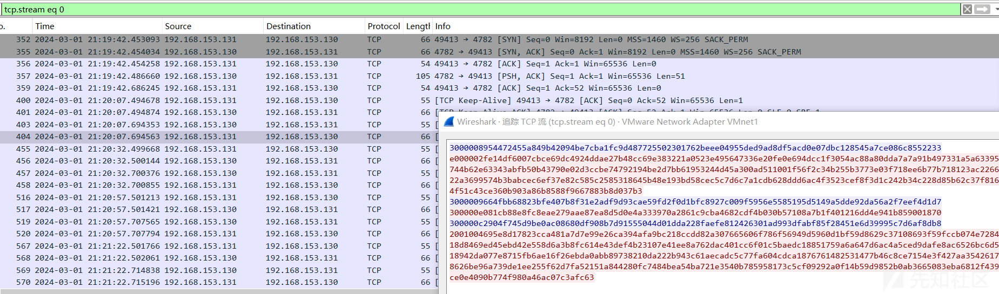](https://xzfile.aliyuncs.com/media/upload/picture/20240301220540-c96cdd72-d7d4-1.png)

进一步对其进行研究分析，发现其通信数据解密流程如下：

-   AES 解密：将配置信息中的 Password 作为`decrypt_xRAT_str(key string, input []byte)`函数的 key 参数，将加密载荷数据作为 input 参数；
-   QuickLZ 解压缩：使用 QuickLZ 解压算法对 AES 解密后的数据进行解压缩；

通信数据解密案例如下：

```plain
#通信数据载荷
300000  #载荷数据大小
8954472455a849b42094be7cba1fc9d487725502301762beee04955ded9ad8df5acd0e07dbc128545a7ce086c8552233    #加密载荷数据

#AES 解密后数据
4F130000000600000000000080020000000A00

#QuickLZ 解压缩后数据
020000000A00
```
