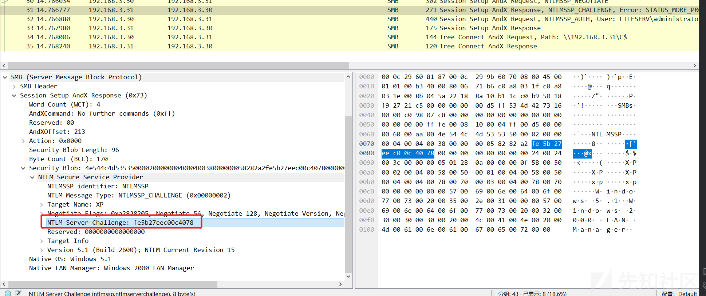
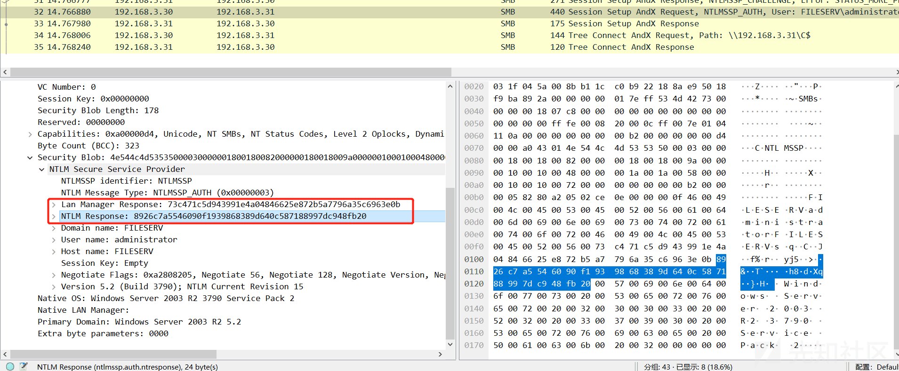
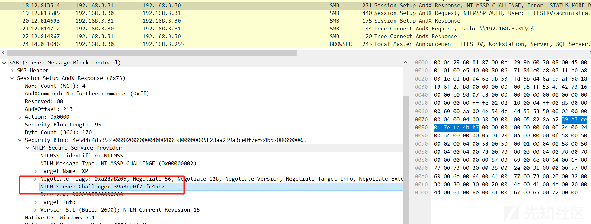
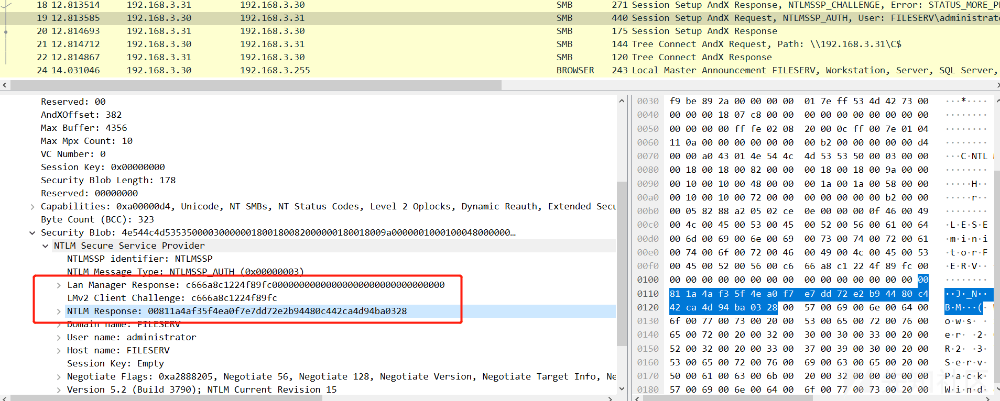
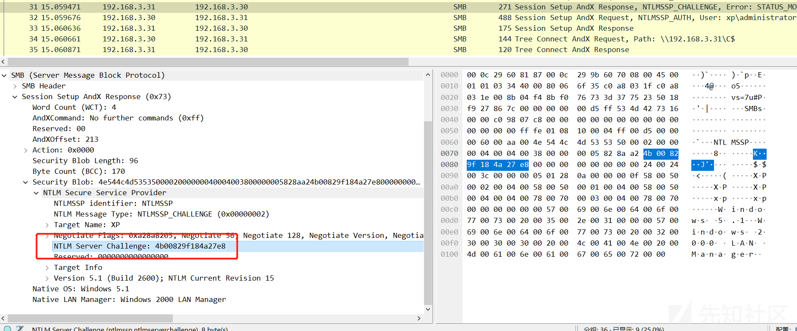
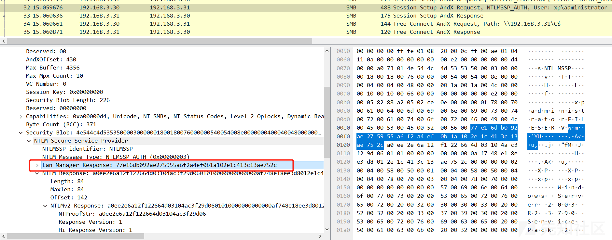
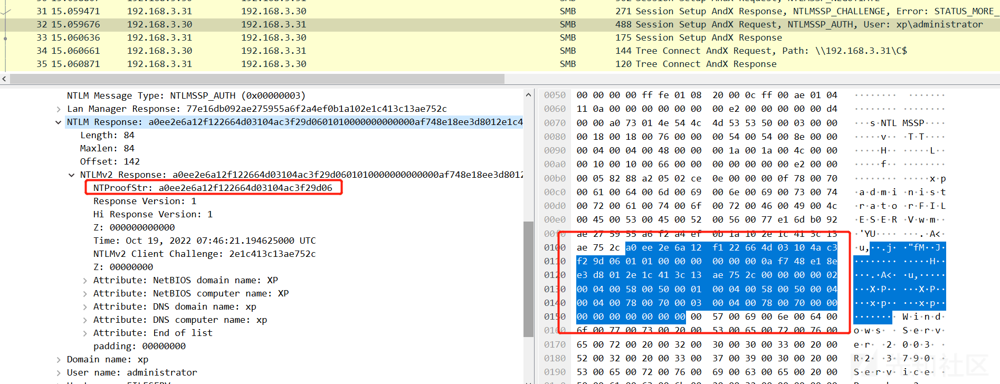

# NTLM 认证详解 - 先知社区

NTLM 认证详解


# 0x01 NTLM 简介

NTLM 是 NT LAN Manager 的简称，NT(New Technology) 是 Windows 发布的桌面操作系统简称。NTLM 协议提供身份认证功能，也支持提供会话安全（传递消息的签名以及加密）。

NTLM 协议的身份认证机制是 challenge-response，由 Server 发送 challenge（8 字节随机数），Client 根据自己密钥、Server 的 challenge 以及其他一些信息，计算出 response，发送至 Server，Server 则根据相同算法计算，比较 response 是否一致来决定认证是否通过。

NTLM 会话安全，Client 在返回的 response 中，可能会附带上自己的 challenge（8 字节随机数），之后 Sever 和 Client 会基于相同的信息（包含 ServerChallenge、ClientChallenge、Temp）计算出 Session key 用于签名以及加密。

NTLM 协议本身无传输层支持，因此 NTLM 是嵌入式协议，一般如嵌入 SMB、HTTP 等，传输层使用 TCP、UDP 均可，只是使用 UDP 时，Client 不会发送`NEGOTIATE_MESSAGE`，先由 Server 发送`CHALLENGE_MESSAGE`。

‍

# 0x02 Message

## 2.1 Message 种类

NTLM 涉及的 Message 为 3 个：

*   NEGOTIATE\_MESSAGE
*   CHALLENGE\_MESSAGE
*   AUTHENTICATE\_MESSAGE

消息中会有一些固定的结构体，具体参考官方文档的`2.2.2 NTLM Structures`，NTLM 所有数据都是以**小端**存放。

‍

### 2.1.1 NEGOTIATE\_MESSAGE

| 0   | 1   | 2   | 3   | 4   | 5   | 6   | 7   | 8   | 9   | A   | B   | C   | D   | E   | F   | 0   | 1   | 2   | 3   | 4   | 5   | 6   | 7   | 8   | 9   | A   | B   | C   | D   | E   | F   |
| --- | --- | --- | --- | --- | --- | --- | --- | --- | --- | --- | --- | --- | --- | --- | --- | --- | --- | --- | --- | --- | --- | --- | --- | --- | --- | --- | --- | --- | --- | --- | --- |
| Signature |     |     |     |     |     |     |     |     |     |     |     |     |     |     |     |     |     |     |     |     |     |     |     |     |     |     |     |     |     |     |     |
| ... |     |     |     |     |     |     |     |     |     |     |     |     |     |     |     |     |     |     |     |     |     |     |     |     |     |     |     |     |     |     |     |
| MessageType |     |     |     |     |     |     |     |     |     |     |     |     |     |     |     |     |     |     |     |     |     |     |     |     |     |     |     |     |     |     |     |
| NegotiateFlags |     |     |     |     |     |     |     |     |     |     |     |     |     |     |     |     |     |     |     |     |     |     |     |     |     |     |     |     |     |     |     |
| DomainNameFields |     |     |     |     |     |     |     |     |     |     |     |     |     |     |     |     |     |     |     |     |     |     |     |     |     |     |     |     |     |     |     |
| ... |     |     |     |     |     |     |     |     |     |     |     |     |     |     |     |     |     |     |     |     |     |     |     |     |     |     |     |     |     |     |     |
| WorkstationFields |     |     |     |     |     |     |     |     |     |     |     |     |     |     |     |     |     |     |     |     |     |     |     |     |     |     |     |     |     |     |     |
| ... |     |     |     |     |     |     |     |     |     |     |     |     |     |     |     |     |     |     |     |     |     |     |     |     |     |     |     |     |     |     |     |
| Version |     |     |     |     |     |     |     |     |     |     |     |     |     |     |     |     |     |     |     |     |     |     |     |     |     |     |     |     |     |     |     |
| ... |     |     |     |     |     |     |     |     |     |     |     |     |     |     |     |     |     |     |     |     |     |     |     |     |     |     |     |     |     |     |     |
| Payload (variable) |     |     |     |     |     |     |     |     |     |     |     |     |     |     |     |     |     |     |     |     |     |     |     |     |     |     |     |     |     |     |     |
| ... |     |     |     |     |     |     |     |     |     |     |     |     |     |     |     |     |     |     |     |     |     |     |     |     |     |     |     |     |     |     |

*   DomainName：客户端域名，索引字段，需要设置**NTLMSSP\_NEGOTIATE\_OEM\_DOMAIN\_SUPPLIED**，否则本字段无效。
*   Workstation：客户端工作组名，索引字段，需要设置**NTLMSSP\_NEGOTIATE\_OEM\_WORKSTATION\_SUPPLIED**，否则本字段无效。

‍

### 2.1.2 CHALLENGE\_MESSAGE

| 0   | 1   | 2   | 3   | 4   | 5   | 6   | 7   | 8   | 9   | A   | B   | C   | D   | E   | F   | 0   | 1   | 2   | 3   | 4   | 5   | 6   | 7   | 8   | 9   | A   | B   | C   | D   | E   | F   |
| --- | --- | --- | --- | --- | --- | --- | --- | --- | --- | --- | --- | --- | --- | --- | --- | --- | --- | --- | --- | --- | --- | --- | --- | --- | --- | --- | --- | --- | --- | --- | --- |
| Signature |     |     |     |     |     |     |     |     |     |     |     |     |     |     |     |     |     |     |     |     |     |     |     |     |     |     |     |     |     |     |     |
| ... |     |     |     |     |     |     |     |     |     |     |     |     |     |     |     |     |     |     |     |     |     |     |     |     |     |     |     |     |     |     |     |
| MessageType |     |     |     |     |     |     |     |     |     |     |     |     |     |     |     |     |     |     |     |     |     |     |     |     |     |     |     |     |     |     |     |
| TargetNameFields |     |     |     |     |     |     |     |     |     |     |     |     |     |     |     |     |     |     |     |     |     |     |     |     |     |     |     |     |     |     |     |
| ... |     |     |     |     |     |     |     |     |     |     |     |     |     |     |     |     |     |     |     |     |     |     |     |     |     |     |     |     |     |     |     |
| NegotiateFlags |     |     |     |     |     |     |     |     |     |     |     |     |     |     |     |     |     |     |     |     |     |     |     |     |     |     |     |     |     |     |     |
| ServerChallenge |     |     |     |     |     |     |     |     |     |     |     |     |     |     |     |     |     |     |     |     |     |     |     |     |     |     |     |     |     |     |     |
| ... |     |     |     |     |     |     |     |     |     |     |     |     |     |     |     |     |     |     |     |     |     |     |     |     |     |     |     |     |     |     |     |
| Reserved |     |     |     |     |     |     |     |     |     |     |     |     |     |     |     |     |     |     |     |     |     |     |     |     |     |     |     |     |     |     |     |
| ... |     |     |     |     |     |     |     |     |     |     |     |     |     |     |     |     |     |     |     |     |     |     |     |     |     |     |     |     |     |     |     |
| TargetInfoFields |     |     |     |     |     |     |     |     |     |     |     |     |     |     |     |     |     |     |     |     |     |     |     |     |     |     |     |     |     |     |     |
| ... |     |     |     |     |     |     |     |     |     |     |     |     |     |     |     |     |     |     |     |     |     |     |     |     |     |     |     |     |     |     |     |
| Version |     |     |     |     |     |     |     |     |     |     |     |     |     |     |     |     |     |     |     |     |     |     |     |     |     |     |     |     |     |     |     |
| ... |     |     |     |     |     |     |     |     |     |     |     |     |     |     |     |     |     |     |     |     |     |     |     |     |     |     |     |     |     |     |     |
| Payload (variable) |     |     |     |     |     |     |     |     |     |     |     |     |     |     |     |     |     |     |     |     |     |     |     |     |     |     |     |     |     |     |     |
| ... |     |     |     |     |     |     |     |     |     |     |     |     |     |     |     |     |     |     |     |     |     |     |     |     |     |     |     |     |     |     |

*   TargetName：服务器端名称，索引字段，需要设置**NTLMSSP\_REQUEST\_TARGET**，否则本字段无效。
*   ServerChallenge：服务端随机产生的挑战值，占 8 字节。
*   TargetInfo：服务器信息，索引字段，需要设置**NTLMSSP\_NEGOTIATE\_TARGET\_INFO**，否则本字段无效；该字段在 NTLM v2 Authentication 中用于计算`NtChallengeResponse`；数据结构类型是**AV\_PAIR**。

‍

### 2.1.3 AUTHENTICATE\_MESSAGE

| 0   | 1   | 2   | 3   | 4   | 5   | 6   | 7   | 8   | 9   | A   | B   | C   | D   | E   | F   | 0   | 1   | 2   | 3   | 4   | 5   | 6   | 7   | 8   | 9   | A   | B   | C   | D   | E   | F   |
| --- | --- | --- | --- | --- | --- | --- | --- | --- | --- | --- | --- | --- | --- | --- | --- | --- | --- | --- | --- | --- | --- | --- | --- | --- | --- | --- | --- | --- | --- | --- | --- |
| Signature |     |     |     |     |     |     |     |     |     |     |     |     |     |     |     |     |     |     |     |     |     |     |     |     |     |     |     |     |     |     |     |
| ... |     |     |     |     |     |     |     |     |     |     |     |     |     |     |     |     |     |     |     |     |     |     |     |     |     |     |     |     |     |     |     |
| MessageType |     |     |     |     |     |     |     |     |     |     |     |     |     |     |     |     |     |     |     |     |     |     |     |     |     |     |     |     |     |     |     |
| LmChallengeResponseFields |     |     |     |     |     |     |     |     |     |     |     |     |     |     |     |     |     |     |     |     |     |     |     |     |     |     |     |     |     |     |     |
| ... |     |     |     |     |     |     |     |     |     |     |     |     |     |     |     |     |     |     |     |     |     |     |     |     |     |     |     |     |     |     |     |
| NtChallengeResponseFields |     |     |     |     |     |     |     |     |     |     |     |     |     |     |     |     |     |     |     |     |     |     |     |     |     |     |     |     |     |     |     |
| ... |     |     |     |     |     |     |     |     |     |     |     |     |     |     |     |     |     |     |     |     |     |     |     |     |     |     |     |     |     |     |     |
| DomainNameFields |     |     |     |     |     |     |     |     |     |     |     |     |     |     |     |     |     |     |     |     |     |     |     |     |     |     |     |     |     |     |     |
| ... |     |     |     |     |     |     |     |     |     |     |     |     |     |     |     |     |     |     |     |     |     |     |     |     |     |     |     |     |     |     |     |
| UserNameFields |     |     |     |     |     |     |     |     |     |     |     |     |     |     |     |     |     |     |     |     |     |     |     |     |     |     |     |     |     |     |     |
| ... |     |     |     |     |     |     |     |     |     |     |     |     |     |     |     |     |     |     |     |     |     |     |     |     |     |     |     |     |     |     |     |
| WorkstationFields |     |     |     |     |     |     |     |     |     |     |     |     |     |     |     |     |     |     |     |     |     |     |     |     |     |     |     |     |     |     |     |
| ... |     |     |     |     |     |     |     |     |     |     |     |     |     |     |     |     |     |     |     |     |     |     |     |     |     |     |     |     |     |     |     |
| EncryptedRandomSessionKeyFields |     |     |     |     |     |     |     |     |     |     |     |     |     |     |     |     |     |     |     |     |     |     |     |     |     |     |     |     |     |     |     |
| ... |     |     |     |     |     |     |     |     |     |     |     |     |     |     |     |     |     |     |     |     |     |     |     |     |     |     |     |     |     |     |     |
| NegotiateFlags |     |     |     |     |     |     |     |     |     |     |     |     |     |     |     |     |     |     |     |     |     |     |     |     |     |     |     |     |     |     |     |
| Version |     |     |     |     |     |     |     |     |     |     |     |     |     |     |     |     |     |     |     |     |     |     |     |     |     |     |     |     |     |     |     |
| ... |     |     |     |     |     |     |     |     |     |     |     |     |     |     |     |     |     |     |     |     |     |     |     |     |     |     |     |     |     |     |     |
| MIC (16 bytes) |     |     |     |     |     |     |     |     |     |     |     |     |     |     |     |     |     |     |     |     |     |     |     |     |     |     |     |     |     |     |     |
| ... |     |     |     |     |     |     |     |     |     |     |     |     |     |     |     |     |     |     |     |     |     |     |     |     |     |     |     |     |     |     |     |
| ... |     |     |     |     |     |     |     |     |     |     |     |     |     |     |     |     |     |     |     |     |     |     |     |     |     |     |     |     |     |     |     |
| Payload (variable) |     |     |     |     |     |     |     |     |     |     |     |     |     |     |     |     |     |     |     |     |     |     |     |     |     |     |     |     |     |     |     |
| ... |     |     |     |     |     |     |     |     |     |     |     |     |     |     |     |     |     |     |     |     |     |     |     |     |     |     |     |     |     |     |

*   LmChallengeResponseFields：存储的是**LmChallengeResponse**数据，是索引字段，参考 2.2.5。
*   NtChallengeResponseFields：存储的是**NtChallengeResponse**数据，是索引字段，参考 2.2.5。
*   DomainNameFields：存储的是**DomainName**，是索引字段，参考 2.2.5。
*   UserNameFields：存储的是**UserName**，是索引字段，参考 2.2.5。
*   WorkstationFields：存储的是**Workstation**，是索引字段，参考 2.2.5。
*   EncryptedRandomSessionKeyFields：存储的是**EncryptedRandomSessionKey**，是索引字段，需要设置**NTLMSSP\_NEGOTIATE\_KEY\_EXCH**，否则本字段无效。
*   MIC：存储的是完整性校验数据，包含了三个 MESSAGE 数据，使用 ExportedSessionKey 进行 HMAC\_MD5。

‍

## 2.2 共有字段

### 2.2.1 Signature

固定 8 字节 ASCII 字符串：('N', 'T', 'L', 'M', 'S', 'S', 'P', '\\0')。

‍

### 2.2.2 MessageType

Message 类型，占 4 字节，三种分别对应为：

*   NEGOTIATE\_MESSAGE：0x00000001
*   CHALLENGE\_MESSAGE：0x00000002
*   AUTHENTICATE\_MESSAGE：0x00000003

### 2.2.3 NegotiateFlags

NegotiateFlags 字段占 4 字节，是`NEGOTIATE`结构体，结构如下。

| 0   | 1   | 2   | 3   | 4   | 5   | 6   | 7   | 8   | 9   | A   | B   | C   | D   | E   | F   | 0   | 1   | 2   | 3   | 4   | 5   | 6   | 7   | 8   | 9   | A   | B   | C   | D   | E   | F   |
| --- | --- | --- | --- | --- | --- | --- | --- | --- | --- | --- | --- | --- | --- | --- | --- | --- | --- | --- | --- | --- | --- | --- | --- | --- | --- | --- | --- | --- | --- | --- | --- |
| W   | V   | U   | r1  | r2  | r3  | T   | r4  | S   | R   | r5  | Q   | P   | r6  | O   | N   | M   | r7  | L   | K   | J   | r8  | H   | r9  | G   | F   | E   | D   | r1 0 | C   | B   | A   |

各字段含义见官方文档的`2.2.2.5 NEGOTIATE`，以下显示的具体值为实际值，网络中的数据流以小端存放。

*   W(0x80000000)：别名为**NTLMSSP\_NEGOTIATE\_56**，Wirshark 中显示为**Negotiate 56**；影响`SealKey`的计算，计算中会引用`ExportedSessionKey`的前 7 字节。
*   V(0x40000000)：别名为**NTLMSSP\_NEGOTIATE\_KEY\_EXCH**，Wireshark 中显示为**Negotiate Key Exchange**；影响`ExportedSessionKey`的计算，如果设置该位，并且设置了**NTLMSSP\_NEGOTIATE\_SEAL**或**NTLMSSP\_NEGOTIATE\_SIGN**任意一个，则是由 Client 生成随机的 16 字节`ExportedSessionKey`，然后使用`KeyExchangeKey`作为 RC4 的密钥加密发送至服务端，不设置则`ExportedSessionKey`\=`KeyExchangeKey`。
*   U(0x20000000)：别名为**NTLMSSP\_NEGOTIATE\_128**，Wireshark 中显示为**Negotiate 128**；影响`SealKey`的计算，计算中会引用`ExportedSessionKey`的全部 16 字节。
*   T(0x02000000)：别名为**NTLMSSP\_NEGOTIATE\_VERSION**，Wireshark 中显示为**Negotiate Version**；设置该位表示在 Message（三种 Message 均有 Version）中的 Version 字段是有值的。
*   S(0x00800000)：别名为**NTLMSSP\_NEGOTIATE\_TARGET\_INFO**，Wireshark 中显示为**Negotiate Target** **Info**；设置该位表示在**CHALLENGE\_MESSAGE**种的 TargetInfoFields 是有值的。
*   R(0x00400000)：别名为**NTLMSSP\_REQUEST\_NON\_NT\_SESSION\_KEY**，Wireshark 中显示为**Request Non-NT Session**；设置该位表示仅只用 LM Hash。（PS：基本不会遇到了)
*   Q(0x00100000)：别名为**NTLMSSP\_NEGOTIATE\_IDENTIFY**，Wireshark 中显示为**Negotiate Identify**；设置该位，表示请求`identify level token`(官方解释：A security token resulting from authentication that represents the authenticated user but does not allow the service holding the token to impersonate that user to other resources.应该是不允许持有 token 的服务端冒充用户访问其他资源)
*   P(0x00080000)：别名为**NTLMSSP\_NEGOTIATE\_EXTENDED\_SESSIONSECURITY**，Wireshark 中显示为**Negotiate Extended Security**；设置该位，表示使用 NTLM v2 的会话安全特性，这个特性 NTLM v2 本身就是支持的，所以对 NTLM v2 基本没影响，主要是告诉使用 NTLM v1 的需要支持会话安全特性，即计算 Session Key，对消息签名与加密。
*   O(0x00020000)：别名为**NTLMSSP\_TARGET\_TYPE\_SERVER**，Wireshark 中显示为**Target Type Server**；设置该位，表示**CHALLENGE\_MESSAGE**中的 TargetNameFields 是服务器名。
*   N(0x00010000)：别名为**NTLMSSP\_TARGET\_TYPE\_DOMAIN**，Wireshark 中显示为**Target Type Domain**；设置该位，表示**CHALLENGE\_MESSAGE**中的 TargetNameFields 是域名。
*   M(0x00008000)：别名为**NTLMSSP\_NEGOTIATE\_ALWAYS\_SIGN**，Wireshark 中显示为**Negotiate Always Sign**；设置该位，表示**AUTHENTICATE\_MESSAGE**中的 MIC 是签名信息，并且要求**NEGOTIATE\_MESSAGE**和**CHALLENGE\_MESSAGE**中均设置该位。（PS：但实际签名或者加密主要看**NTLMSSP\_NEGOTIATE\_SIGN**和**NTLMSSP\_NEGOTIATE\_SEAL**，而 Always Sign 一般会设置为 1）
*   L(0x00002000)：别名为**NTLMSSP\_NEGOTIATE\_OEM\_WORKSTATION\_SUPPLIED**，Wireshark 中显示为**Negotiate OEM Workstation Supplied**；该位在 Windows NT 中已经不再支持，因此无效。
*   K(0x00001000)：别名为**NTLMSSP\_NEGOTIATE\_OEM\_DOMAIN\_SUPPLIED**，Wireshark 中显示为**Negotiate OEM Domain Supplied**；该位在 Windows NT 中已经不再支持，因此无效。
*   J(0x00000800)：Wireshark 中显示为**Negotiate Anonymous**；表示匿名登录。
*   H(0x00000200)：别名为**NTLMSSP\_NEGOTIATE\_NTLM**，Wireshark 中显示为**Negotiate NTLM Key**；官方说是使用 NTLM v1 的会话安全时设置该标志位，实际测试使用 NTLM v2 时也设置了，暂时理解为使用 NTLM 即设置该标志位。
*   G(0x00000080)：别名为**NTLMSSP\_NEGOTIATE\_LM\_KEY**，Wireshark 中显示为**Negotiate Lan Manager Key**；设置该位，表示使用 LM Hash 和 LmChallengeResponse 来计算`KeyExchangeKey`和`SealKey`，具体参考方法`KXKEY`和`SEALKEY`。如果已经设置了**NTLMSSP\_NEGOTIATE\_EXTENDED\_SESSIONSECURITY**，则本标记位无效。
*   F(0x00000040)：别名为**NTLMSSP\_NEGOTIATE\_DATAGRAM**，Wireshark 中显示为**Negotiate Datagram**；设置该位表示使用的 UDP。
*   E(0x00000020)：别名为**NTLMSSP\_NEGOTIATE\_SEAL**，Wireshark 中显示为**Negotiate Seal**；该位需要与**NTLMSSP\_NEGOTIATE\_KEY\_EXCH**一起使用，并且设置了该位则必须设置**NTLMSSP\_NEGOTIATE\_128**和**NTLMSSP\_NEGOTIATE\_56**其中一个。
*   D(0x00000010)：别名为**NTLMSSP\_NEGOTIATE\_SIGN**，Wireshark 中显示为**Negotiate Sign**；该位需要与**NTLMSSP\_NEGOTIATE\_KEY\_EXCH**一起使用。
*   C(0x00000004)：别名为**NTLMSSP\_REQUEST\_TARGET**，Wireshark 中显示为**Request Target**；设置该位，表示**CHALLENGE\_MESSAGE**的**TargetName**字段有值。
*   B(0x00000002)：别名为**NTLM\_NEGOTIATE\_OEM**，Wireshark 中显示为**Negotiate OEM**；
*   A(0x00000001)：别名为**NTLMSSP\_NEGOTIATE\_UNICODE**，Wireshark 中显示为**Negotiate Unicode**；

A 与 B 组合结果如下：

*   A = 1，使用 UNICODE 编码
*   A = 0 ,B = 1，使用 OEM 编码
*   A = 0 , B = 0，协议返回 SEC\_E\_INVALID\_TOKEN

‍

### 2.2.4 Version

| 0   | 1   | 2   | 3   | 4   | 5   | 6   | 7   | 8   | 9   | A   | B   | C   | D   | E   | F   | 0   | 1   | 2   | 3   | 4   | 5   | 6   | 7   | 8   | 9   | A   | B   | C   | D   | E   | F   |
| --- | --- | --- | --- | --- | --- | --- | --- | --- | --- | --- | --- | --- | --- | --- | --- | --- | --- | --- | --- | --- | --- | --- | --- | --- | --- | --- | --- | --- | --- | --- | --- |
| ProductMajorVersion |     |     |     |     |     |     |     | ProductMinorVersion |     |     |     |     |     |     |     | ProductBuild |     |     |     |     |     |     |     |     |     |     |     |     |     |     |     |
| Reserved |     |     |     |     |     |     |     |     |     |     |     |     |     |     |     |     |     |     |     |     |     |     |     | NTLMRevisionCurrent |     |     |     |     |     |     |

*   ProductMajorVersion：占 1 字节，操作系统主版本，如 Windows 10 就是 0x0a。
*   ProductMinorVersion：占 1 字节
*   ProductBuild：占 2 字节
*   NTLMRevisionCurrent：占 1 字节，表示当前 NTLMSSP 版本。

NTLMRevisionCurrent 当前是 0x0F，对应常量是**NTLMSSP\_REVISION\_W2K3**。

‍

### 2.2.5 索引字段与 Payload 字段

索引字段类似于 Golang 中的 String，实际数据存储于 Payload 中，在字段位存储的是索引信息，分为三部分：

1.  Length：字段数据的长度
2.  Max Length：字段数据的最大长度，一般与 Length 相同，数据接收时忽略该字段。
3.  Offset：字段数据相距 Message 首地址的偏移量，数据在 Payload 中。

‍

## 2.3 数据结构

完整的数据结构参考官方文档的`2.2.2 NTLM Structures`

‍

### 2.3.1 AV\_PAIR

AV\_PAIR 表示的是 attribute/value pair，结构体如下所示：

| 0   | 1   | 2   | 3   | 4   | 5   | 6   | 7   | 8   | 9   | A   | B   | C   | D   | E   | F   | 0   | 1   | 2   | 3   | 4   | 5   | 6   | 7   | 8   | 9   | A   | B   | C   | D   | E   | F   |
| --- | --- | --- | --- | --- | --- | --- | --- | --- | --- | --- | --- | --- | --- | --- | --- | --- | --- | --- | --- | --- | --- | --- | --- | --- | --- | --- | --- | --- | --- | --- | --- |
| AvId |     |     |     |     |     |     |     |     |     |     |     |     |     |     |     | AvLen |     |     |     |     |     |     |     |     |     |     |     |     |     |     |     |
| Value (variable) |     |     |     |     |     |     |     |     |     |     |     |     |     |     |     |     |     |     |     |     |     |     |     |     |     |     |     |     |     |     |     |
| ... |     |     |     |     |     |     |     |     |     |     |     |     |     |     |     |     |     |     |     |     |     |     |     |     |     |     |     |     |     |     |

*   AvId：2 字节，表示 value 字段的类型。
*   AvLen：2 字节，表示 value 字段的长度。
*   Value：可变长数据，根据 AvId 的值，存储对应的数据。

AvId 值的范围与含义：

| Value | Meaning |
| --- | --- |
| MsvAvEOL 0x0000 | Indicates that this is the last**AV\_PAIR**in the list.**AvLen**MUST be 0. This type of information MUST be present in the[**AV pair**](#gt_5158aff7-f968-422b-a78f-6cbb653e7b2a)list. |
| MsvAvNbComputerName 0x0001 | The server's NetBIOS computer name. The name MUST be in Unicode, and is not null-terminated. This type of information MUST be present in the AV\_pair list. |
| MsvAvNbDomainName 0x0002 | The server's NetBIOS[**domain name**](#gt_45a1c9f1-0263-49a8-97c7-7aca1a99308c). The name MUST be in Unicode, and is not null-terminated. This type of information MUST be present in the AV\_pair list. |
| MsvAvDnsComputerName 0x0003 | The[**fully qualified domain name (FQDN)**](#gt_1769aec9-237e-44ed-9014-1abb3ec6de6e) of the computer. The name MUST be in Unicode, and is not null-terminated. |
| MsvAvDnsDomainName 0x0004 | The FQDN of the domain. The name MUST be in Unicode, and is not null-terminated. |
| MsvAvDnsTreeName 0x0005 | The FQDN of the[**forest**](#gt_fd104241-4fb3-457c-b2c4-e0c18bb20b62). The name MUST be in Unicode, and is not null-terminated.[<13>](#Appendix_A_13 "Product behavior note 13") |
| MsvAvFlags 0x0006 | A 32-bit value indicating server or client configuration. 0x00000001: Indicates to the client that the account authentication is constrained. 0x00000002: Indicates that the client is providing message integrity in the MIC field (section 2.2.1.3) in the AUTHENTICATE\_MESSAGE.[<14>](#Appendix_A_14 "Product behavior note 14") 0x00000004: Indicates that the client is providing a target SPN generated from an untrusted source.[<15>](#Appendix_A_15 "Product behavior note 15") |
| MsvAvTimestamp 0x0007 | A**FILETIME**structure ([\[MS-DTYP\]](http://xz.aliyun.com/t/%5bMS-DTYP%5d.pdf#Section_cca2742956894a16b2b49325d93e4ba2)section 2.3.3) in little-endian byte order that contains the server local time. This structure is always sent in the CHALLENGE\_MESSAGE.[<16>](#Appendix_A_16 "Product behavior note 16") |
| MsvAvSingleHost 0x0008 | A[Single\_Host\_Data (section 2.2.2.2)](#Section_f221c061cc40447195dad2ff71c85c5b)structure. The**Value**field contains a platform-specific blob, as well as a**MachineID**created at computer startup to identify the calling machine.[<17>](#Appendix_A_17 "Product behavior note 17") |
| MsvAvTargetName 0x0009 | The SPN of the target server. The name MUST be in Unicode and is not null-terminated.[<18>](#Appendix_A_18 "Product behavior note 18") |
| MsvAvChannelBindings 0x000A | A channel bindings hash. The**Value**field contains an MD5 hash ([\[RFC4121\]](https://go.microsoft.com/fwlink/?LinkId=90459)section 4.1.1.2) of a gss\_channel\_bindings\_struct ([\[RFC2744\]](https://go.microsoft.com/fwlink/?LinkId=125716)section 3.11). An all-zero value of the hash is used to indicate absence of channel bindings.[<19>](#Appendix_A_19 "Product behavior note 19") |

‍

### 2.3.2 LM\_RESPONSE

仅包含 1 个字段，适用于 NTLM v1 认证。

Response(24 bytes)：**LmChallengeResponse**，三个 DES 密文拼接，所以是 24 字节。

‍

### 2.3.3 LMv2\_RESPONSE

包含 2 个字段，适用于 NTLM v2 认证。

Response(16 bytes)：**LmChallengeResponse**，是 HMAC\_MD5 计算的结果，所以是 16 字节。

ChallengeFromClient(8 bytes)：客户端生成的 8 字节随机值。

‍

### 2.3.4 NTLM v1 Response

仅包含 1 个字段，适用于 NTLM v1 认证。

Response(24 bytes)：**NtChallengeResponse**，三个 DES 密文拼接，所以是 24 字节。

‍

### 2.3.5 NTLM v2 Response

包含 2 个字段，适用于 NTLM v2 认证。

Response(16 bytes)：**NTChallengeResponse**，是 HMAC\_MD5 计算的结果，所以是 16 字节，对应 NTLM v2 伪代码中的 NTProofStr 变量。

NTLMv2\_CLIENT\_CHALLENGE：也是个结构体，存储的是**ClientChallenge**，对应 NTLM v2 伪代码中的 temp 变量。

‍

### 2.3.6 NTLMv2\_CLIENT\_CHALLENGE

| 0   | 1   | 2   | 3   | 4   | 5   | 6   | 7   | 8   | 9   | A   | B   | C   | D   | E   | F   | 0   | 1   | 2   | 3   | 4   | 5   | 6   | 7   | 8   | 9   | A   | B   | C   | D   | E   | F   |
| --- | --- | --- | --- | --- | --- | --- | --- | --- | --- | --- | --- | --- | --- | --- | --- | --- | --- | --- | --- | --- | --- | --- | --- | --- | --- | --- | --- | --- | --- | --- | --- |
| RespType |     |     |     |     |     |     |     | HiRespType |     |     |     |     |     |     |     | Reserved1 |     |     |     |     |     |     |     |     |     |     |     |     |     |     |     |
| Reserved2 |     |     |     |     |     |     |     |     |     |     |     |     |     |     |     |     |     |     |     |     |     |     |     |     |     |     |     |     |     |     |     |
| TimeStamp |     |     |     |     |     |     |     |     |     |     |     |     |     |     |     |     |     |     |     |     |     |     |     |     |     |     |     |     |     |     |     |
| ... |     |     |     |     |     |     |     |     |     |     |     |     |     |     |     |     |     |     |     |     |     |     |     |     |     |     |     |     |     |     |     |
| ChallengeFromClient |     |     |     |     |     |     |     |     |     |     |     |     |     |     |     |     |     |     |     |     |     |     |     |     |     |     |     |     |     |     |     |
| ... |     |     |     |     |     |     |     |     |     |     |     |     |     |     |     |     |     |     |     |     |     |     |     |     |     |     |     |     |     |     |     |
| Reserved3 |     |     |     |     |     |     |     |     |     |     |     |     |     |     |     |     |     |     |     |     |     |     |     |     |     |     |     |     |     |     |     |
| AvPairs (variable) |     |     |     |     |     |     |     |     |     |     |     |     |     |     |     |     |     |     |     |     |     |     |     |     |     |     |     |     |     |     |     |
| ... |     |     |     |     |     |     |     |     |     |     |     |     |     |     |     |     |     |     |     |     |     |     |     |     |     |     |     |     |     |     |

*   RespType：占 1 字节，表示当前 challenge response 类型，必须为 0x01。
*   HiRespType：占 1 字节，表示支持的 challenge response 类型的最大版本，必须为 0x01。
*   Reserved：保留字段均为 0。
*   TimeStamp：时间戳
*   ChallengeFromClient：客户端生成的 8 字节随机值。
*   AvPairs：AV\_PAIR，存储的是 Server Name，并以 MsvAvEOL 类型的 AV\_PAIR 结尾。

‍

# 0x03 NTLM 认证

## 3.1 LM Hash, NTLM Hash, Net-NTLM Hash

*   LM Hash：下文 NTLM v1 伪代码中 LMOWFv1 函数计算出来的结果，即 ResponseKeyLM。
*   NTLM Hash：下文 NTLM v1 伪代码中 NTOWFv1 函数计算出来的结果，即 ResponseKeyNT。
*   Net-NTLM Hash：下文 NTLM v1/v2 伪代码中 NtChallengeResponse 变量，结构则是 NTLM v1 Response 或 NTLM v2 Response 其中一个。

PS：

1.  Net-NTLM Hash 就是客户端响应服务端挑战的回复数据，只是利用 NTLM Hash 计算的，所以称之为 Net-NTLM Hash（微软官方好像并没有这种名称）。由于 LM 废弃，所以就没有了 Net-LM Hash 的说法了。
2.  Net-NTLM Hash 实际分 v1 和 v2，v1 是利用 NTLM Hash 计算，v2 则是利用 NTLMv2 Hash，NTLMv2 Hash 是通过 NTOWFv2 函数计算（但其中也有 NTLM Hash 参与计算）
3.  NTDS.dit、SAM 存储的 LM Hash 和 NTLM Hash 就是 v1 版本的。
4.  NTOWFv2 和 LMOWFv2 是同一个函数，参数需要 NTLM Hash。

## 3.2 配置 NTLM 版本

通过 gpedit.msc->计算机配置->Windows 设置->安全设置->本地策略->安全选项->网络安全:LAN 管理器身份验证级别

| 值   | 设置  | 描述  |
| --- | --- | --- |
| 0   | 发送 LM & NTLM 响应 | 客户端使用 LM 和 NTLM 身份验证，从不使用 NTLMv2 会话安全性。域控制器接受 LM、NTLM 和 NTLMv2 身份验证。 |
| 1   | 发送 LM & NTLM - 如果协商，请使用 NTLMv2 会话安全性 | 客户端使用 LM 和 NTLM 身份验证，如果服务器支持，则使用 NTLMv2 会话安全性。域控制器接受 LM、NTLM 和 NTLMv2 身份验证。 |
| 2   | 仅发送 NTLM 响应 | 客户端仅使用 NTLM 身份验证，如果服务器支持 NTLMv2 会话安全性，则使用 NTLMv2 会话安全性。域控制器接受 LM、NTLM 和 NTLMv2 身份验证。 |
| 3   | 仅发送 NTLMv2 响应 | 客户端仅使用 NTLMv2 身份验证，如果服务器支持 NTLMv2 会话安全性，则使用 NTLMv2 会话安全性。域控制器接受 LM、NTLM 和 NTLMv2 身份验证。 |
| 4   | 仅发送 NTLMv2 响应/拒绝 LM | 客户端仅使用 NTLMv2 身份验证，如果服务器支持 NTLMv2 会话安全性，则使用 NTLMv2 会话安全性。域控制器拒绝 LM，只接受 NTLM 和 NTLMv2 身份验证。 |
| 5   | 仅发送 NTLMv2 响应/拒绝 LM & NTLM | 客户端仅使用 NTLMv2 身份验证，如果服务器支持 NTLMv2 会话安全性，则使用 NTLMv2 会话安全性。域控制器拒绝 LM 和 NTLM，只接受 NTLMv2 身份验证。 |

值对应的是注册表`HKLM\SYSTEM\CurrentControlSet\Control\Lsa`的**LmCompatibilityLevel**。

如果配置为 0，不启用 NTLM v2 的会话安全特性，LM\_RESPONSE 和 NTLM v1 RESPONSE 则分别是使用 LM Hash 和 NTLM Hash 对 Server Challenge 执行 DESL 加密算法（算法见下文），如果配置为 1，则是启用 NTLM v2 的会话安全特性，那么 LM\_RESPONSE 就是 8 字节的 Client Challenge+16 字节 NULL，NTLM v1 RESPONSE 则是使用 NTLM Hash 对 Server Challenge+Client Challenge 的 MD5 值得前 8 字节执行 DESL 算法。

但实际测试时发现 Windows Server 2003/2008，即使配置的是0，当其作为Server端时，依然是启用了NTLM v2 的会话安全特性，当其作为 Client 端时，才是不启用 NTLM v2 会话安全特性的。

‍

## 3.3 NTLM v1

伪代码如下

```plain

 -- Functions Used:
 --   Z(M)- Defined in section 6.

 Define NTOWFv1(Passwd, User, UserDom) as MD4(UNICODE(Passwd))
 EndDefine

 Define LMOWFv1(Passwd, User, UserDom) as
        ConcatenationOf( DES( UpperCase( Passwd)[0..6],"KGS!@#$%"),
                  DES( UpperCase( Passwd)[7..13],"KGS!@#$%")) 
 EndDefine

 Set ResponseKeyNT to NTOWFv1(Passwd, User, UserDom)
 Set ResponseKeyLM to LMOWFv1( Passwd, User, UserDom )

 Define ComputeResponse(NegFlg, ResponseKeyNT, ResponseKeyLM, 
 CHALLENGE_MESSAGE.ServerChallenge, ClientChallenge, Time, ServerName)
 As
 If (User is set to "" AND Passwd is set to "")
     -- Special case for anonymous authentication
     Set NtChallengeResponseLen to 0
     Set NtChallengeResponseMaxLen to 0
     Set NtChallengeResponseBufferOffset to 0
     Set LmChallengeResponse to Z(1)
 ElseIf
 If (NTLMSSP_NEGOTIATE_EXTENDED_SESSIONSECURITY flag is set in NegFlg) 
         Set NtChallengeResponse to DESL(ResponseKeyNT, 
         MD5(ConcatenationOf(CHALLENGE_MESSAGE.ServerChallenge, 
         ClientChallenge))[0..7])
         Set LmChallengeResponse to ConcatenationOf{ClientChallenge, 
         Z(16)}
     Else 
         Set NtChallengeResponse to DESL(ResponseKeyNT, 
         CHALLENGE_MESSAGE.ServerChallenge)
         If (NoLMResponseNTLMv1 is TRUE)
             Set LmChallengeResponse to NtChallengeResponse
         Else 
             Set LmChallengeResponse to DESL(ResponseKeyLM, 
             CHALLENGE_MESSAGE.ServerChallenge)
         EndIf
     EndIf
 EndIf

 Set SessionBaseKey to MD4(NTOWF)
```

`Z(M)`：生成 M 个 NULL 字节。

`DESL(K, D)`：K 是 16 字节加密密钥，D 是 8 字节明文数据，加密方式如下

```plain
ConcatenationOf(   DES(K[0..6], D), \
 DES(K[7..13],   D), DES( \
 ConcatenationOf(K[14..15],   Z(5)), D))
```

‍

### 3.3.1 LMOWFv1(LM Hash)

伪代码中的`ResponseKeyLM`，通过 LMOWFv1 进行计算，结果即 LM Hash。

1.  计算需要用户密码`Passwd`，并转换为大写，长度需要为 14 字节，不足的补`\x00`，超过的删除。
2.  14 字节的密钥分成 2 组，每组 7 字节，作为 DES 的密钥，对`KGS!@#$%`进行加密。
3.  两组 DES 密文拼接在一起，即 LM Hash。

PS：DES 密钥的有效位是 56bit，即 7 字节，但每 7bit 会生成一个奇偶校验位，因此会从 7 字节变为 8 字节，具体参考代码中的`des_7key28key`

```plain
#encoding:utf-8
import hashlib,binascii
from Crypto.Cipher import DES

def des_7key28key(passwd):
    #bytes 转成二进制字符串，补齐 56 位
    key_bin_str = bin(int.from_bytes(passwd,byteorder='big',signed=False))[2:].rjust(56,'0')
    new_key = b''
    for i in range(0,56,7):
        #每 7bit 加 1bit 奇偶校验位
        one_byte = key_bin_str[i:i+7]
        if one_byte.count('1') % 2 == 0:
            new_byte = one_byte+'1'
        else:
            new_byte = one_byte+'0'
        new_key = new_key + bytes.fromhex(hex(int(new_byte,2))[2:].rjust(2,'0'))
    return new_key

def lm_hash(password:str):
    data = "KGS!@#$%".encode('utf-8')
    password = password.upper().encode("utf-8")
    if len(password) < 14:
        password += b'\x00'*(14-len(password))
    des1 = DES.new(des_7key28key(password[0:7]),DES.MODE_ECB)
    des2 = DES.new(des_7key28key(password[7:14]),DES.MODE_ECB)
    hash = des1.encrypt(data)+des2.encrypt(data)
    return hash
```

PS：要有 LM Hash，需要设置注册表`HKLM\SYSTEM\CurrentControlSet\Control\Lsa`的**NoLmHash**的值为 0。

‍

### 3.3.2 NTOWFv1(NTLM Hash)

伪代码中的 ResponseKeyNT，通过 NTOWFv1 进行计算，结果即为 NTLM Hash。

1.  计算需要用户密码`Passwd`，转十六进制，再转 Unicode(utf-16le)
2.  使用 MD4 进行 hash。

```plain
import hashlib
def ntlm_hash(password):
    hash = hashlib.new("md4",password.encode("utf-16le")).digest()
    return hash
```

‍

### 3.3.3 Response

#### 3.3.3.1 不启用 NTLM v2 会话安全

伪代码中 NTLMSSP\_NEGOTIATE\_EXTENDED\_SESSIONSECURITY 未设置的逻辑部分，分别使用 LM Hash 和 NTLM Hash 对 Server Challenge 执行 DESL 加密，因此 NTLM v1 的 challenge 是 8 字节的（只有 Server Challenge）

```plain
import hashlib,binascii
from Crypto.Cipher import DES

def desl(password,data):
    if len(password) != 16:
        raise Exception("password length is not 16")
    des1 = DES.new(des_7key28key(password[0:7]),DES.MODE_ECB)
    des2 = DES.new(des_7key28key(password[7:14]),DES.MODE_ECB)
    des3 = DES.new(des_7key28key(password[14:]+b'\x00'*5),DES.MODE_ECB)
    cipher = des1.encrypt(data)+des2.encrypt(data)+des3.encrypt(data)
    return cipher

def ntlmv1_response(hash,server_challenge):
    return desl(hash,server_challenge)

def ntlmv1(passwd:str,server_challenge:str):
    lmhash = lm_hash(passwd)
    ntlmhash = ntlm_hash(passwd)
    server_challenge = binascii.a2b_hex(server_challenge)
    lm_response = ntlmv1_response(lmhash,server_challenge)
    ntlm_reponse = ntlmv1_response(ntlmhash,server_challenge)
    SessionBaseKey  = hashlib.new("md4",ntlmhash).digest()
    return lm_response,ntlm_reponse,SessionBaseKey
```

‍

##### 3.3.3.1.1 栗子

环境：192.168.3.30(Windows Server 2003) 使用 net use 访问 192.168.3.31(Windows XP) 的 C$，两边 LmCompatibilityLevel 值均设置为 0。XP 上的用户为 administrator/admin，并且 gpedit.msc->计算机配置->Windows 设置->安全设置->本地策略->安全选项->网络访问：本地账户的共享和安全模型设置为经典

Server Challenge:

[](https://xzfile.aliyuncs.com/media/upload/picture/20231124120912-3958b668-8a7f-1.png)

LM Response 和 NTLM Response(Net-NTLM Hash)：

[](https://xzfile.aliyuncs.com/media/upload/picture/20231124120933-463e23a4-8a7f-1.png)

‍

Python 代码验证：

```plain
def main():
    password = "admin"
    server_challenge = "fe5b27eec00c4078"
    lm_response,ntlm_reponse,SessionBaseKey = ntlmv1(password,server_challenge)
    print(binascii.b2a_hex(lm_response)) #b'73c471c5d943991e4a04846625e872b5a7796a35c6963e0b'
    print(binascii.b2a_hex(ntlm_reponse)) #b'8926c7a5546090f1939868389d640c587188997dc948fb20'
```

##### 3.3.3.1.2 hashcat

NTLMv1 的 mode 值为 5500，hash 的格式是\[username\]::\[domain name\]:LM Hash:NTLM Hash:ServerChallenge。计算只有 NTLM Hash、ServerChallenge 是必须的，hashcat 并不会将 LM Hash 参与计算。

```plain
hashcat.exe -m 5500 --hash-info
hashcat (v6.2.4) starting in hash-info mode

Hash Info:
==========

Hash mode #5500
  Name................: NetNTLMv1 / NetNTLMv1+ESS
  Category............: Network Protocols
  Slow.Hash...........: No
  Password.Len.Min....: 0
  Password.Len.Max....: 256
  Salt.Type...........: Embedded
  Salt.Len.Min........: 0
  Salt.Len.Max........: 256
  Kernel.Type(s)......: pure, optimized
  Example.Hash.Format.: plain
  Example.Hash........: ::5V4T:ada06359242920a500000000000000000000000000000000:0556d5297b5daa70eaffde82ef99293a3f3bb59b7c9704ea:9c23f6c094853920
  Example.Pass........: hashcat
  Benchmark.Mask......: ?b?b?b?b?b?b?b

hashcat.exe -m 5500 -a 3 :::73c471c5d943991e4a04846625e872b5a7796a35c6963e0b:8926c7a5546090f1939868389d640c587188997dc948fb20:fe5b27eec00c4078 ?l?l?l?l?l
```

‍

#### 3.3.3.2 启用 NTLM v2 会话安全

伪代码中 NTLMSSP\_NEGOTIATE\_EXTENDED\_SESSIONSECURITY 设置的逻辑部分，此时客户端也会产生 8 字节 challenge，由 LM\_RESPONSE 存储，通过补 16 字节 NULL 补齐 24 字节，NTLM Response 则是使用 NTLM Hash 对 ServerChallenge+ClientChallenge 的 MD5 值的前 8 字节执行 DESL 加密，因此 NTLM v1 session 的 challenge 是 16 字节。

```plain
import hashlib,binascii
from Crypto.Cipher import DES

def desl(password,data):
    if len(password) != 16:
        raise Exception("password length is not 16")
    des1 = DES.new(des_7key28key(password[0:7]),DES.MODE_ECB)
    des2 = DES.new(des_7key28key(password[7:14]),DES.MODE_ECB)
    des3 = DES.new(des_7key28key(password[14:]+b'\x00'*5),DES.MODE_ECB)
    cipher = des1.encrypt(data)+des2.encrypt(data)+des3.encrypt(data)
    return cipher

def ntlmv1_response(hash,server_challenge):
    return desl(hash,server_challenge)

def ntlmv1_session(passwd:str,server_challenge:str,client_challenge:str):
    ntlmhash = ntlm_hash(passwd)
    server_challenge = binascii.a2b_hex(server_challenge)
    client_challenge = binascii.a2b_hex(client_challenge)
    challenge = server_challenge+client_challenge
    challenge_md5 = hashlib.md5(challenge).digest()
    lm_response = client_challenge+16*b'\x00'
    ntlm_reponse = ntlmv1_response(ntlmhash,challenge_md5[0:8])
    SessionBaseKey  = hashlib.new("md4",ntlmhash).digest()
    return lm_response,ntlm_reponse,SessionBaseKey
```

‍

##### 3.3.3.2.1 栗子

环境同上，只是将 LmCompatibilityLevel 值均设置为 1。

Server Challenge:

[](https://xzfile.aliyuncs.com/media/upload/picture/20231124121247-b98922b4-8a7f-1.png)

Client Challenge 和 NTLM Response(Net-NTLM Hash)：

[](https://xzfile.aliyuncs.com/media/upload/picture/20231124121309-c6c88712-8a7f-1.png)

Python 代码验证：

```plain
def main():
    password = "admin"
    server_challenge = "39a3ce0f7efc4bb7"
    client_challenge = "c666a8c1224f89fc"
    lm_response,ntlm_reponse,SessionBaseKey = ntlmv1_session(password,server_challenge,client_challenge)
    print(binascii.b2a_hex(lm_response)) #b'c666a8c1224f89fc00000000000000000000000000000000'
    print(binascii.b2a_hex(ntlm_reponse)) 

#b'00811a4af35f4ea0f7e7dd72e2b94480c442ca4d94ba0328'
```

##### 3.3.3.2.2 hashcat

NTLMv1 的 mode 值为 5500，hash 的格式是\[username\]::\[domain name\]:LM Hash:NTLM Hash:ServerChallenge。计算只有 LM Hash（Client Challenge）、NTLM Hash、ServerChallenge 是必须的。

```plain
hashcat.exe -m 5500 -a 3 :::c666a8c1224f89fc00000000000000000000000000000000:00811a4af35f4ea0f7e7dd72e2b94480c442ca4d94ba0328:39a3ce0f7efc4bb7 ?l?l?l?l?l
```

‍

## 3.4 NTLM v2

伪代码如下

```plain
Define NTOWFv2(Passwd, User, UserDom) as HMAC_MD5( 
 MD4(UNICODE(Passwd)), UNICODE(ConcatenationOf( Uppercase(User), 
 UserDom ) ) )
 EndDefine

 Define LMOWFv2(Passwd, User, UserDom) as NTOWFv2(Passwd, User, 
 UserDom)
 EndDefine

 Set ResponseKeyNT to NTOWFv2(Passwd, User, UserDom)
 Set ResponseKeyLM to LMOWFv2(Passwd, User, UserDom)

 Define ComputeResponse(NegFlg, ResponseKeyNT, ResponseKeyLM,
 CHALLENGE_MESSAGE.ServerChallenge, ClientChallenge, Time, ServerName)
 As
 If (User is set to "" && Passwd is set to "")
     -- Special case for anonymous authentication
     Set NtChallengeResponseLen to 0
     Set NtChallengeResponseMaxLen to 0
     Set NtChallengeResponseBufferOffset to 0
     Set LmChallengeResponse to Z(1)
 Else
     Set temp to ConcatenationOf(Responserversion, HiResponserversion,
     Z(6), Time, ClientChallenge, Z(4), ServerName, Z(4))
     Set NTProofStr to HMAC_MD5(ResponseKeyNT, 
     ConcatenationOf(CHALLENGE_MESSAGE.ServerChallenge,temp))
     Set NtChallengeResponse to ConcatenationOf(NTProofStr, temp)
     Set LmChallengeResponse to ConcatenationOf(HMAC_MD5(ResponseKeyLM, 
     ConcatenationOf(CHALLENGE_MESSAGE.ServerChallenge, ClientChallenge)),
     ClientChallenge )
 EndIf

 Set SessionBaseKey to HMAC_MD5(ResponseKeyNT, NTProofStr)
 EndDefine
```

‍

### 3.4.1 NTOWFv2

伪代码中的 ResponseKeyNT 和 ResponseKeyLM，以 NTLM Hash 为密钥，对用户名（大写）和域名（非域则工作组名称）执行 HMAC\_MD5。其中 NTLM Hash 仍然是关键，相比 NTLM Hash，则还包含了用户名和域名信息。

```plain
import hashlib,hmac
def ntlmv2_hash(password,username,domain):
    ntlmhash = ntlm_hash(password)
    username = username.upper().encode('utf-16le')
    domain = domain.encode('utf-16le')
    ntlmv2hash = hmac.new(ntlmhash,username+domain,hashlib.md5).digest()
    return ntlmv2hash
```

‍

### 3.4.2 Response

NTLM v2 Response 中除了 hash 数据，还有一些明文数据，字段解释参考`2.3.6 NTLMv2_CLIENT_CHALLENGE`，其中 ServerName 可能是多个 AV\_PAIR 数据，并且以`MsvAvEOL`结尾；其中 hash 数据称为 NTProofStr，明文数据称为 temp；NTProofStr 是以 NTLM v2 Hash 为密钥，对 temp 数据执行 HAMC\_MD5。

LM v2 Response，同样是以 NTLM v2 Hash 为密钥，对 Server Challenge+Client Challenge 执行 HMAC\_MD5，并在后面拼接 Clinet Challenge。

```plain
import hashlib,hmac,binascii
def ntlmv2(passwd,username,domain,server_challenge,client_challenge,timestamp,avpairs):
    ntlmhash = ntlm_hash(passwd)
    ntlmv2hash = ntlmv2_hash(passwd,username,domain)
    server_challenge = binascii.a2b_hex(server_challenge)
    client_challenge = binascii.a2b_hex(client_challenge)
    timestamp = binascii.a2b_hex(timestamp)
    RespType_HiRespType_Reserved = binascii.a2b_hex("0101000000000000")
    temp = RespType_HiRespType_Reserved+timestamp+client_challenge+b'\x00'*4
    for avpair in avpairs:
        temp = temp + avpair
    temp = temp + b'\x00'*4
    NTProofStr = hmac.new(ntlmv2hash,server_challenge+temp,hashlib.md5).digest()
    ntlmv2_response = NTProofStr+temp
    lmv2_response = hmac.new(ntlmv2hash,server_challenge+client_challenge,hashlib.md5).digest()+client_challenge
    SessionBaseKey  = hmac.new(ntlmv2hash,NTProofStr,hashlib.md5).digest()
    return lmv2_response,ntlmv2_response,SessionBaseKey
```

‍

#### 3.4.2.1 栗子

环境同上，只是将 LmCompatibilityLevel 值均设置为 5。

Server Challenge:

[](https://xzfile.aliyuncs.com/media/upload/picture/20231124121716-5a0fa168-8a80-1.png)

LM v2 Response:

[](https://xzfile.aliyuncs.com/media/upload/picture/20231124121731-63222b36-8a80-1.png)

NTLM v2 Response:

[](https://xzfile.aliyuncs.com/media/upload/picture/20231124121745-6b6cf884-8a80-1.png)

Python 代码验证：

```plain
def main():
    passwd = "admin"
    username = "administrator"
    domain = "xp"
    server_challenge = "4b00829f184a27e8"
    client_challenge = "2e1c413c13ae752c"
    timestamp = "0af748e18ee3d801"
    avpairs = [av_pair(2,"XP"),av_pair(1,"XP"),av_pair(4,"xp"),av_pair(3,"xp"),av_pair(0,"")]
    lmv2_response,ntlmv2_response,SessionBaseKey = ntlmv2(passwd,username,domain,server_challenge,client_challenge,timestamp,avpairs)
    hexdump(lmv2_response)
    hexdump(ntlmv2_response)
```

结果：

```plain
00000000: 77 E1 6D B0 92 AE 27 59  55 A6 F2 A4 EF 0B 1A 10  w.m...'YU.......
00000010: 2E 1C 41 3C 13 AE 75 2C                           ..A<..u,
00000000: A0 EE 2E 6A 12 F1 22 66  4D 03 10 4A C3 F2 9D 06  ...j.."fM..J....
00000010: 01 01 00 00 00 00 00 00  0A F7 48 E1 8E E3 D8 01  ..........H.....
00000020: 2E 1C 41 3C 13 AE 75 2C  00 00 00 00 02 00 04 00  ..A<..u,........
00000030: 58 00 50 00 01 00 04 00  58 00 50 00 04 00 04 00  X.P.....X.P.....
00000040: 78 00 70 00 03 00 04 00  78 00 70 00 00 00 00 00  x.p.....x.p.....
00000050: 00 00 00 00                                       ....
```

‍

#### 3.4.2.2 hashcat

NTLMv1 的 mode 值为 5600，hash 的格式是 username::domain:ServerChallenge:NTProofStr:temp。  
PS：没有找到对 LM v2 Response 的暴破

```plain
hashcat (v6.2.4) starting in hash-info mode

Hash Info:
==========

Hash mode #5600
  Name................: NetNTLMv2
  Category............: Network Protocols
  Slow.Hash...........: No
  Password.Len.Min....: 0
  Password.Len.Max....: 256
  Salt.Type...........: Embedded
  Salt.Len.Min........: 0
  Salt.Len.Max........: 256
  Kernel.Type(s)......: pure, optimized
  Example.Hash.Format.: plain
  Example.Hash........: 0UL5G37JOI0SX::6VB1IS0KA74:ebe1afa18b7fbfa6:aab8bf8675658dd2a939458a1077ba08:010100000000000031c8aa092510945398b9f7b7dde1a9fb00000000f7876f2b04b700
  Example.Pass........: hashcat
  Benchmark.Mask......: ?b?b?b?b?b?b?b
hashcat.exe -m 5600 -a 3 administrator::xp:4b00829f184a27e8:a0ee2e6a12f122664d03104ac3f29d06:01010000000000000af748e18ee3d8012e1c413c13ae752c0000000002000400580050000100040058005000040004007800700003000400780070000000000000000000 ?l?l?l?l?l
```

‍

# 0x04 会话安全

## 4.1 ExportedSessionKey

NTLM 本身提供了会话安全的特性，在前面的 NTLMv1 和 NTLMv2 的伪代码中，最后都生成了一个`SessionBaseKey`，从名称中可以看出这是会话安全的基础 Key，通过它生成`KeyExchangeKey`，再通过`KeyExchangeKey`生成`ExportedSessionKey`（**PS:ExportedSessionKey 用于生成会话安全的 SIGNKEY、SEALKEY，以及作为生成 MIC 的 HMAC\_MD5 的密钥。** ），此时分两种情况：

1.  如果设置了 NegotiateFlags 的`NTLMSSP_NEGOTIATE_KEY_EXCH`，并且配合设置了`NTLMSSP_NEGOTIATE_SIGN`或`NTLMSSP_NEGOTIATE_SEAL`的任意一个，表示启用会话安全，并进行密钥交换，那么`ExportedSessionKey`是由客户端生成的 16 字节随机值，由`KeyExchangeKey`作为密钥进行 RC4 加密，加密值存入`AUTHENTICATE_MESSAGE.EncryptedRandomSessionKey`。
2.  如果没有设置 NTLMSSP\_NEGOTIATE\_KEY\_EXCH，`KeyExchangeKey`就作为`ExportedSessionKey`

具体可以参考微软官方-NTLM 协议的`3.1.5.1.2 Client Receives a CHALLENGE_MESSAGE from the Server`节中的伪代码。

```plain
Set KeyExchangeKey to KXKEY(SessionBaseKey, LmChallengeResponse,
     CHALLENGE_MESSAGE.ServerChallenge)
 If (NTLMSSP_NEGOTIATE_KEY_EXCH bit is set in 
 CHALLENGE_MESSAGE.NegotiateFlags
   AND (NTLMSSP_NEGOTIATE_SIGN OR NTLMSSP_NEGOTIATE_SEAL are set in
 CHALLENGE_MESSAGE.NegotiateFlags))
      Set ExportedSessionKey to NONCE(16)
      Set AUTHENTICATE_MESSAGE.EncryptedRandomSessionKey to 
      RC4K(KeyExchangeKey, ExportedSessionKey)
 Else 
      Set ExportedSessionKey to KeyExchangeKey
      Set AUTHENTICATE_MESSAGE.EncryptedRandomSessionKey to NIL
 Endif

 Set ClientSigningKey to SIGNKEY(NegFlg, ExportedSessionKey, "Client")
 Set ServerSigningKey to SIGNKEY(NegFlg, ExportedSessionKey, "Server")
 Set ClientSealingKey to SEALKEY(NegFlg, ExportedSessionKey, "Client")
 Set ServerSealingKey to SEALKEY(NegFlg, ExportedSessionKey, "Server")


 RC4Init(ClientHandle, ClientSealingKey)
 RC4Init(ServerHandle, ServerSealingKey)

 Set MIC to HMAC_MD5(ExportedSessionKey, ConcatenationOf(
    NEGOTIATE_MESSAGE, CHALLENGE_MESSAGE, AUTHENTICATE_MESSAGE))
 Set AUTHENTICATE_MESSAGE.MIC to MIC
```

## 4.2 KXKEY

KXKEY 是生成`KeyExchangeKey`的函数，根据使用的 NTLM 版本和 NegotiateFlags 的设置会有不同的算法。

### 4.2.1 NTLMv1 不启用 v2 会话安全

伪代码：

```plain
Define KXKEY(SessionBaseKey, LmChallengeResponse, ServerChallenge) as
 If ( NTLMSSP_NEGOTIATE_LMKEY flag is set in NegFlg) 
      Set KeyExchangeKey to ConcatenationOf(DES(LMOWF[0..6],
      LmChallengeResponse[0..7]), 
      DES(ConcatenationOf(LMOWF[7], 0xBDBDBDBDBDBD),  
      LmChallengeResponse[0..7]))  
 Else
      If ( NTLMSSP_REQUEST_NON_NT_SESSION_KEY flag is set in NegFlg) 
         Set KeyExchangeKey to ConcatenationOf(LMOWF[0..7], Z(8)), 
      Else
         Set KeyExchangeKey to SessionBaseKey
      Endif
 Endif
 EndDefine
```

这个是分类情况最多的，分三种：

1.  设置了`NTLMSSP_NEGOTIATE_LMKEY`，分别使用`LM Hash`的前 7 字节和`0xBDBDBDBDBDBD`作为 DES 密钥，加密`LmChallengeResponse`的前 8 字节。
2.  未设置`NTLMSSP_NEGOTIATE_LMKEY`，但设置了`NTLMSSP_REQUEST_NON_NT_SESSION_KEY`，直接使用`LM Hash`的前 8 字节，拼接 8 字节 0x00。
3.  上述都未设置的，使用`SessionBaseKey`作为`KeyExchangeKey`

Python 代码：

```plain
def kxkey_ntlmv1_LMKEY(lm_hash,lm_response):
    des1 = DES.new(des_7key28key(lm_hash[0:7]),DES.MODE_ECB)
    des2 = DES.new(des_7key28key(lm_hash[7:8]+b'\xbd'*6),DES.MODE_ECB)
    KeyExchangekey = des1.encrypt(lm_response[0:8])+des2.encrypt(lm_response[0:8])
    return KeyExchangekey

def kxkey_ntlmv1_NON_NT_SESSION(lm_hash):
    return lm_hash[0:8]+b'\x00'*8
```

‍

### 4.2.2 NTLMv1 启用 v2 会话安全

伪代码：

```plain
Define KXKEY(SessionBaseKey, LmChallengeResponse, ServerChallenge) as
      Set KeyExchangeKey to HMAC_MD5(SessionBaseKey, ConcatenationOf(ServerChallenge, LmChallengeResponse [0..7]))
 EndDefine
```

使用`SessionBaseKey`作为密钥，对`ServerChallenge`+`ClientChallenge`执行`HMAC_MD5`。PS：在 NTLMv1 启用 v2 会话安全的情况下，`LmChallengeResponse`的前 8 字节即`ClientChallenge`

‍

Python 代码：

```plain
def kxkey_ntlmv1_WITH_NT_SESSION(sessionbasekey,lm_response,server_challenge):
    server_challenge = binascii.a2b_hex(server_challenge)
    KeyExchangekey = hmac.new(sessionbasekey,server_challenge+lm_response[0:8],hashlib.md5).digest()
    return KeyExchangekey
```

‍

### 4.2.3 NTLM v2

`SessionBaseKey`作为`KeyExchangeKey`

‍

## 4.3 SIGNKEY

用于计算完整性的，直接搬运官方的伪代码了：

```plain
Define SIGNKEY(NegFlg, ExportedSessionKey, Mode) as
 If (NTLMSSP_NEGOTIATE_EXTENDED_SESSIONSECURITY flag is set in NegFlg) 
      If (Mode equals "Client")
           Set SignKey to MD5(ConcatenationOf(ExportedSessionKey, 
           "session key to client-to-server signing key magic  
           constant"))
      Else
           Set SignKey to MD5(ConcatenationOf(ExportedSessionKey, 
           "session key to server-to-client signing key magic
           constant"))
      Endif
 Else 
      Set  SignKey to NIL
 Endif
 EndDefine
```

‍

## 4.4 SEALKEY

用于加密数据的，直接搬运官方的伪代码了：

```plain
Define SEALKEY(NegFlg, ExportedSessionKey, Mode) as
 If (NTLMSSP_NEGOTIATE_EXTENDED_SESSIONSECURITY flag is set in NegFlg)
      If ( NTLMSSP_NEGOTIATE_128 is set in NegFlg) 
           Set SealKey to ExportedSessionKey
      ElseIf ( NTLMSSP_NEGOTIATE_56 flag is set in NegFlg) 
          Set SealKey to ExportedSessionKey[0..6]
      Else 
          Set SealKey to ExportedSessionKey[0..4]
      Endif

      If (Mode equals "Client")
          Set SealKey to MD5(ConcatenationOf(SealKey, "session key to
          client-to-server sealing key magic constant"))
      Else
          Set SealKey to MD5(ConcatenationOf(SealKey, "session key to
          server-to-client sealing key magic constant"))
      Endif
 ElseIf ( (NTLMSSP_NEGOTIATE_LM_KEY is set in NegFlg) or
          ( (NTLMSSP_NEGOTIATE_DATAGRAM is set in NegFlg)
             and (NTLMRevisionCurrent >= NTLMSSP_REVISION_W2K3) ) ) 

      If (NTLMSSP_NEGOTIATE_56 flag is set in NegFlg)
           Set SealKey to ConcatenationOf(ExportedSessionKey[0..6], 0xA0)
      Else
           Set SealKey to ConcatenationOf(ExportedSessionKey[0..4], 0xE5,
           0x38, 0xB0)
      EndIf
 Else
      Set SealKey to ExportedSessionKey
 Endif       
 EndDefine
```

‍

# 0x05 小结

## 5.1 Hash 与 NET Hash

本文主要是为了理解其他文章中提到的 LM Hash、NTLM Hash、NET-NTLM Hash，现在明确了 LM Hash 和 NTLM Hash 是根据用户明文密码计算出来的 hash 值，文章里常见的通过 mimikatz dump 出来的 hash 值，是用于计算 AUTHENTICATE\_MESSAGE 中 RESPONSE 所需要的数据；NET 开头的即 Response 的数据。

‍

## 5.2 MIC

MIC 是 AUTHENTICATE\_MESSAGE 中的字段，但是计算了三个 MESSAGE 的 hash，并且使用的是`ExportedSessionKey`作为密钥的 HMAC\_MD5，因此 MIC 可以保证三个消息的数据不被篡改。但 NTLMv1 没有标志位表明会附带 MIC，存在被清除的可能，而 NTLMv2 则在 Response 结构体中包含了 AV\_PAIR，其中 AvId 为 0x06(MsvAvFlags)，Value 为 0x02，表示 AUTHENTICATE\_MESSAGE 中会附带 MIC 信息，而 AV\_PAIR 的数据是参与 Response 计算的，因此 NTProofStr 保护 AV\_PAIR(MsvAvFlags)，MsvAvFlags(0x02) 保护 MIC，MIC 保护三个 MESSAGE 的完整性。

除了 MIC，AV\_PAIR 还可以包含 Client 的名称，从而帮助 Server 端确认发送方的 IP 是否跟 AV\_PAIR 中的 Client 名称对应。

‍

## 5.3 ChannelBinding

NTLM 是嵌入其他协议的，而其他协议还可以通过 TLS 来进行加密传输，如 HTTPS 和 LDAPS，NTLMv2 是允许 Client 端将 Server 端证书的 Hash 值存入 AUTHENTICATE\_MESSAGE 中的，即 AV\_PAIR.AvId 为 0x0A(MsvAvChannelBindings)，值是 Server 端证书的 hash 值，同上 AV\_PAIR 的数据是被 NTProofStr 保护的，所以无法修改，那么 Server 端就可以根据 Client 端发送的证书 Hash 跟自己的比较，如果不同则表明存在中间人攻击，会拒绝请求。

‍

## 5.4 攻击方法

### 5.4.1 Pass The Hash

如果知道了 NTLM Hash，那么就能根据其值来计算 NTLM Response，即可通过认证。这个攻击就很容易理解了。

‍

### 5.4.2 NTLM Relay

攻击者需要在 Client 和 Server 中间，攻击者分别对 Client 充当伪 Server，对 Server 充当伪 Client，主要是能让 Client 向伪 Server 发起认证，那么攻击者仅需要将 Server 发起的挑战以伪 Server 的身份向 Client 发起挑战，由 Client 自己计算好 Response，攻击者发给 Server 即可通过认证。

‍

# 0x06 Python 代码

```plain
#encoding:utf-8
import hashlib,binascii,hmac
from Crypto.Cipher import DES,ARC4
from hexdump import hexdump

def des_7key28key(passwd):
    #bytes 转成二进制字符串，补齐 56 位
    key_bin_str = bin(int.from_bytes(passwd,byteorder='big',signed=False))[2:].rjust(56,'0')
    new_key = b''
    for i in range(0,56,7):
        #每 7bit 加 1bit 奇偶校验位
        one_byte = key_bin_str[i:i+7]
        if one_byte.count('1') % 2 == 0:
            new_byte = one_byte+'1'
        else:
            new_byte = one_byte+'0'
        new_key = new_key + bytes.fromhex(hex(int(new_byte,2))[2:].rjust(2,'0'))
    return new_key

def ntlm_hash(password):
    hash = hashlib.new("md4",password.encode("utf-16le")).digest()
    return hash

def ntlmv2_hash(password,username,domain):
    ntlmhash = ntlm_hash(password)
    username = username.upper().encode('utf-16le')
    domain = domain.encode('utf-16le')
    ntlmv2hash = hmac.new(ntlmhash,username+domain,hashlib.md5).digest()
    return ntlmv2hash

def lm_hash(password:str):
    data = "KGS!@#$%".encode('utf-8')
    password = password.upper().encode("utf-8")
    if len(password) < 14:
        password += b'\x00'*(14-len(password))
    des1 = DES.new(des_7key28key(password[0:7]),DES.MODE_ECB)
    des2 = DES.new(des_7key28key(password[7:14]),DES.MODE_ECB)
    hash = des1.encrypt(data)+des2.encrypt(data)
    return hash

def desl(password,data):
    if len(password) != 16:
        raise Exception("password length is not 16")
    des1 = DES.new(des_7key28key(password[0:7]),DES.MODE_ECB)
    des2 = DES.new(des_7key28key(password[7:14]),DES.MODE_ECB)
    des3 = DES.new(des_7key28key(password[14:]+b'\x00'*5),DES.MODE_ECB)
    cipher = des1.encrypt(data)+des2.encrypt(data)+des3.encrypt(data)
    return cipher

def ntlmv1_response(hash,server_challenge):
    return desl(hash,server_challenge)

def av_pair(avid:int,value:str):
    avid = avid.to_bytes(2,byteorder='little',signed=False)
    value = value.encode('utf-16le')
    avlen = len(value).to_bytes(2,byteorder='little',signed=False)
    return avid+avlen+value


def ntlmv1(passwd:str,server_challenge:str):
    lmhash = lm_hash(passwd)
    ntlmhash = ntlm_hash(passwd)
    server_challenge = binascii.a2b_hex(server_challenge)
    lm_response = ntlmv1_response(lmhash,server_challenge)
    ntlm_reponse = ntlmv1_response(ntlmhash,server_challenge)
    SessionBaseKey  = hashlib.new("md4",ntlmhash).digest()
    return lm_response,ntlm_reponse,SessionBaseKey


def ntlmv1_session(passwd:str,server_challenge:str,client_challenge:str):
    ntlmhash = ntlm_hash(passwd)
    server_challenge = binascii.a2b_hex(server_challenge)
    client_challenge = binascii.a2b_hex(client_challenge)
    challenge = server_challenge+client_challenge
    challenge_md5 = hashlib.md5(challenge).digest()
    lm_response = client_challenge+16*b'\x00'
    ntlm_reponse = ntlmv1_response(ntlmhash,challenge_md5[0:8])
    SessionBaseKey  = hashlib.new("md4",ntlmhash).digest()
    return lm_response,ntlm_reponse,SessionBaseKey

def ntlmv2(passwd,username,domain,server_challenge,client_challenge,timestamp,avpairs):
    ntlmhash = ntlm_hash(passwd)
    ntlmv2hash = ntlmv2_hash(passwd,username,domain)
    server_challenge = binascii.a2b_hex(server_challenge)
    client_challenge = binascii.a2b_hex(client_challenge)
    timestamp = binascii.a2b_hex(timestamp)
    RespType_HiRespType_Reserved = binascii.a2b_hex("0101000000000000")
    temp = RespType_HiRespType_Reserved+timestamp+client_challenge+b'\x00'*4
    for avpair in avpairs:
        temp = temp + avpair
    temp = temp + b'\x00'*4
    NTProofStr = hmac.new(ntlmv2hash,server_challenge+temp,hashlib.md5).digest()
    ntlmv2_response = NTProofStr+temp
    lmv2_response = hmac.new(ntlmv2hash,server_challenge+client_challenge,hashlib.md5).digest()+client_challenge
    SessionBaseKey  = hmac.new(ntlmv2hash,NTProofStr,hashlib.md5).digest()
    return lmv2_response,ntlmv2_response,SessionBaseKey

def kxkey_ntlmv1_LMKEY(lm_hash,lm_response):
    des1 = DES.new(des_7key28key(lm_hash[0:7]),DES.MODE_ECB)
    des2 = DES.new(des_7key28key(lm_hash[7:8]+b'\xbd'*6),DES.MODE_ECB)
    KeyExchangekey = des1.encrypt(lm_response[0:8])+des2.encrypt(lm_response[0:8])
    return KeyExchangekey

def kxkey_ntlmv1_NON_NT_SESSION(lm_hash):
    return lm_hash[0:8]+b'\x00'*8

def kxkey_ntlmv1_WITH_NT_SESSION(sessionbasekey,lm_response,server_challenge):
    server_challenge = binascii.a2b_hex(server_challenge)
    KeyExchangekey = hmac.new(sessionbasekey,server_challenge+lm_response[0:8],hashlib.md5).digest()
    return KeyExchangekey


def responsetest():
    passwd = "admin"
    username = "administrator"
    domain = "xp"
    server_challenge = "4b00829f184a27e8"
    client_challenge = "2e1c413c13ae752c"
    timestamp = "0af748e18ee3d801"
    avpairs = [av_pair(2,"XP"),av_pair(1,"XP"),av_pair(4,"xp"),av_pair(3,"xp"),av_pair(0,"")]
    lmv2_response,ntlmv2_response,SessionBaseKey = ntlmv2(passwd,username,domain,server_challenge,client_challenge,timestamp,avpairs)
    hexdump(lmv2_response)
    hexdump(ntlmv2_response)
    print(binascii.b2a_hex(ntlmv2_response))
    #ntlm v1 with v2 session test
    password = "admin"
    server_challenge = "39a3ce0f7efc4bb7"
    client_challenge = "c666a8c1224f89fc"
    lm_response,ntlm_reponse,SessionBaseKey = ntlmv1_session(password,server_challenge,client_challenge)
    print(binascii.b2a_hex(lm_response))
    print(binascii.b2a_hex(ntlm_reponse))
    #ntlm v1 test
    password = "admin"
    server_challenge = "fe5b27eec00c4078"
    lm_response,ntlm_reponse,SessionBaseKey = ntlmv1(password,server_challenge)
    print(binascii.b2a_hex(lm_response))
    print(binascii.b2a_hex(ntlm_reponse))

def sessiontest():
    passwd = "Password"
    username = "User"
    domain = "Domain"
    server_name = "Server"
    workstation_name = "COMPUTER"
    RandomSessionKey = "UUUUUUUUUUUUUUUU"
    client_challenge = "aaaaaaaaaaaaaaaa"
    server_challenge = "0123456789abcdef"
    lmhash = lm_hash(passwd)
    ntlmhash = ntlm_hash(passwd)
    #ntlmv2
    timestamp = "0000000000000000"
    avpairs = [av_pair(2,domain),av_pair(1,server_name),av_pair(0,"")]
    lmv2_response,ntlmv2_response,SessionBaseKey = ntlmv2(passwd,username,domain,server_challenge,client_challenge,timestamp,avpairs)
    hexdump(SessionBaseKey)
    hexdump(lmv2_response)
    hexdump(ntlmv2_response)
    rc4 = ARC4.new(SessionBaseKey)
    cipher = rc4.encrypt(RandomSessionKey.encode('utf-8'))
    hexdump(cipher)

    #ntlmv1 with v2 session
    lm_response,ntlm_reponse,SessionBaseKey = ntlmv1_session(passwd,server_challenge,client_challenge)
    hexdump(ntlmhash)
    kxkey = kxkey_ntlmv1_WITH_NT_SESSION(SessionBaseKey,lm_response,server_challenge)
    hexdump(kxkey)
    hexdump(SessionBaseKey)
    hexdump(lm_response)
    hexdump(ntlm_reponse)
    #ntlmv1
    lm_response,ntlm_reponse,SessionBaseKey = ntlmv1(passwd,server_challenge)
    hexdump(SessionBaseKey)
    hexdump(lm_response)
    hexdump(ntlm_reponse)
    kxkey_LMKEY = kxkey_ntlmv1_LMKEY(lmhash,lm_response)
    hexdump(kxkey_LMKEY)
    kxkey_NON_NT_SESSION = kxkey_ntlmv1_NON_NT_SESSION(lmhash)
    hexdump(kxkey_NON_NT_SESSION)
    hexdump(SessionBaseKey)
    rc4 = ARC4.new(kxkey_LMKEY)
    cipher = rc4.encrypt(RandomSessionKey.encode('utf-8'))
    hexdump(cipher)
    rc4 = ARC4.new(kxkey_NON_NT_SESSION)
    cipher = rc4.encrypt(RandomSessionKey.encode('utf-8'))
    hexdump(cipher)
    rc4 = ARC4.new(SessionBaseKey)
    cipher = rc4.encrypt(RandomSessionKey.encode('utf-8'))
    hexdump(cipher)
```

‍

# 0x07 impacket 中的代码

## 7.1 Message 种类

```plain
#ntlm.py
#NEGOTIATE_MESSAGE
class NTLMAuthNegotiate(Structure):

    structure = (
        ('','"NTLMSSP\x00'),
        ('message_type','<L=1'),
        ('flags','<L'),
        ('domain_len','<H-domain_name'),
        ('domain_max_len','<H-domain_name'),
        ('domain_offset','<L=0'),
        ('host_len','<H-host_name'),
        ('host_maxlen','<H-host_name'),
        ('host_offset','<L=0'),
        ('os_version',':'),
        ('host_name',':'),
        ('domain_name',':'))

#CHALLENGE_MESSAGE
class NTLMAuthChallenge(Structure):

    structure = (
        ('','"NTLMSSP\x00'),
        ('message_type','<L=2'),
        ('domain_len','<H-domain_name'),
        ('domain_max_len','<H-domain_name'),
        ('domain_offset','<L=40'),
        ('flags','<L=0'),
        ('challenge','8s'),
        ('reserved','8s=""'),
        ('TargetInfoFields_len','<H-TargetInfoFields'),
        ('TargetInfoFields_max_len','<H-TargetInfoFields'),
        ('TargetInfoFields_offset','<L'),
        ('VersionLen','_-Version','self.checkVersion(self["flags"])'), 
        ('Version',':'),
        ('domain_name',':'),
        ('TargetInfoFields',':'))

#AUTHENTICATE_MESSAGE
class NTLMAuthChallengeResponse(Structure):

    structure = (
        ('','"NTLMSSP\x00'),
        ('message_type','<L=3'),
        ('lanman_len','<H-lanman'),
        ('lanman_max_len','<H-lanman'),
        ('lanman_offset','<L'),
        ('ntlm_len','<H-ntlm'),
        ('ntlm_max_len','<H-ntlm'),
        ('ntlm_offset','<L'),
        ('domain_len','<H-domain_name'),
        ('domain_max_len','<H-domain_name'),
        ('domain_offset','<L'),
        ('user_len','<H-user_name'),
        ('user_max_len','<H-user_name'),
        ('user_offset','<L'),
        ('host_len','<H-host_name'),
        ('host_max_len','<H-host_name'),
        ('host_offset','<L'),
        ('session_key_len','<H-session_key'),
        ('session_key_max_len','<H-session_key'),
        ('session_key_offset','<L'),
        ('flags','<L'),
        ('VersionLen','_-Version','self.checkVersion(self["flags"])'), 
        ('Version',':=""'),
        ('MICLen','_-MIC','self.checkMIC(self["flags"])'),
        ('MIC',':=""'),
        ('domain_name',':'),
        ('user_name',':'),
        ('host_name',':'),
        ('lanman',':'),
        ('ntlm',':'),
        ('session_key',':'))
```

‍

## 7.2 DES 相关

```plain
#ntlm.py
def __expand_DES_key(key):
    # Expand the key from a 7-byte password key into a 8-byte DES key
    if not isinstance(key, bytes):
        key = bytes(key)
    key  = bytearray(key[:7]).ljust(7, b'\x00')
    s = bytearray()
    s.append(((key[0] >> 1) & 0x7f) << 1)
    s.append(((key[0] & 0x01) << 6 | ((key[1] >> 2) & 0x3f)) << 1)
    s.append(((key[1] & 0x03) << 5 | ((key[2] >> 3) & 0x1f)) << 1)
    s.append(((key[2] & 0x07) << 4 | ((key[3] >> 4) & 0x0f)) << 1)
    s.append(((key[3] & 0x0f) << 3 | ((key[4] >> 5) & 0x07)) << 1)
    s.append(((key[4] & 0x1f) << 2 | ((key[5] >> 6) & 0x03)) << 1)
    s.append(((key[5] & 0x3f) << 1 | ((key[6] >> 7) & 0x01)) << 1)
    s.append((key[6] & 0x7f) << 1)
    return bytes(s)

def __DES_block(key, msg):
    cipher = DES.new(__expand_DES_key(key),DES.MODE_ECB)
    return cipher.encrypt(msg)

def ntlmssp_DES_encrypt(key, challenge):
    answer  = __DES_block(key[:7], challenge)
    answer += __DES_block(key[7:14], challenge)
    answer += __DES_block(key[14:], challenge)
    return answer
```

*   \_\_expand\_DES\_key：将 7 字节的密钥扩展为 8 字节 DES 所需要的密钥，这个应该是没考虑奇偶位的
*   \_\_DES\_block：单纯的 DES 加密
*   ntlmssp\_DES\_encrypt：伪代码中的 DESL

‍

## 7.3 LM Hash 和 NTLM Hash

```plain
#ntlm.py
def compute_lmhash(password):
    # This is done according to Samba's encryption specification (docs/html/ENCRYPTION.html)
    password = password.upper()
    lmhash  = __DES_block(b(password[:7]), KNOWN_DES_INPUT)
    lmhash += __DES_block(b(password[7:14]), KNOWN_DES_INPUT)
    return lmhash

def compute_nthash(password):
    # This is done according to Samba's encryption specification (docs/html/ENCRYPTION.html)
    try:
        password = str(password).encode('utf_16le')
    except UnicodeDecodeError:
        import sys
        password = password.decode(sys.getfilesystemencoding()).encode('utf_16le')

    hash = MD4.new()
    hash.update(password)
    return hash.digest()
```

‍

## 7.4 NTLM v1

```plain
#ntlm.py
def LMOWFv1(password, lmhash = '', nthash=''):
    if lmhash != '':
       return lmhash
    return compute_lmhash(password)

def NTOWFv1(password, lmhash = '', nthash=''):
    if nthash != '':
       return nthash
    return compute_nthash(password)   

def get_ntlmv1_response(key, challenge):
    return ntlmssp_DES_encrypt(key, challenge)

def generateSessionKeyV1(password, lmhash, nthash):
    hash = MD4.new()
    hash.update(NTOWFv1(password, lmhash, nthash))
    return hash.digest()

def computeResponseNTLMv1(flags, serverChallenge, clientChallenge, serverName, domain, user, password, lmhash='',
                          nthash='', use_ntlmv2=USE_NTLMv2):
    if user == '' and password == '':
        # Special case for anonymous authentication
        lmResponse = ''
        ntResponse = ''
    else:
        lmhash = LMOWFv1(password, lmhash, nthash)
        nthash = NTOWFv1(password, lmhash, nthash)
        if flags & NTLMSSP_NEGOTIATE_LM_KEY:
           ntResponse = ''
           lmResponse = get_ntlmv1_response(lmhash, serverChallenge)
        elif flags & NTLMSSP_NEGOTIATE_EXTENDED_SESSIONSECURITY:
           md5 = hashlib.new('md5')
           chall = (serverChallenge + clientChallenge)
           md5.update(chall)
           ntResponse = ntlmssp_DES_encrypt(nthash, md5.digest()[:8])
           lmResponse = clientChallenge + b'\x00'*16
        else:
           ntResponse = get_ntlmv1_response(nthash,serverChallenge)
           lmResponse = get_ntlmv1_response(lmhash, serverChallenge)

    sessionBaseKey = generateSessionKeyV1(password, lmhash, nthash)
    return ntResponse, lmResponse, sessionBaseKey
```

*   LMOWFv1 和 NTOWFv1：就是计算 LM Hash 和 NTLM Hash
*   get\_ntlmv1\_response：将 LM Hash 或 NTLM Hash 作为密钥对 serverChallenge 执行 DESL 加密，即不启用会话安全的 NTLMv1 Response
*   generateSessionKeyV1：计算 NTLMv1 的 sessionBaseKey，虽然参数有 lmhash，但实际不使用
*   computeResponseNTLMv1：计算 NTLMv1 Response，会根据 flags 的情况来判断是计算的是无会话安全的 NTLMv1 Response 还是启用会话安全的 NTLMv1 Response，当然还考虑了更老版本的只用 LM Hash 的情况

PS：computeResponseNTLMv1 中的`serverName`​、`domain`​、`use_ntlmv2`​都是未使用的参数，加了略显累赘，不知道含义，另外 user 字段其实也没有存在的必要，仅判断了是否为空，password 和 nthash 传一个即可，lmhash 基本不用了。

## 7.5 NTLM v2

```plain
#ntlm.py
def hmac_md5(key, data):
    import hmac
    h = hmac.new(key, digestmod=hashlib.md5)
    h.update(data)
    return h.digest()

def NTOWFv2( user, password, domain, hash = ''):
    if hash != '':
       theHash = hash 
    else:
       theHash = compute_nthash(password)
    return hmac_md5(theHash, user.upper().encode('utf-16le') + domain.encode('utf-16le'))

def LMOWFv2( user, password, domain, lmhash = ''):
    return NTOWFv2( user, password, domain, lmhash)

def computeResponseNTLMv2(flags, serverChallenge, clientChallenge, serverName, domain, user, password, lmhash='',
                          nthash='', use_ntlmv2=USE_NTLMv2):

    responseServerVersion = b'\x01'
    hiResponseServerVersion = b'\x01'
    responseKeyNT = NTOWFv2(user, password, domain, nthash)

    av_pairs = AV_PAIRS(serverName)
    # In order to support SPN target name validation, we have to add this to the serverName av_pairs. Otherwise we will
    # get access denied
    # This is set at Local Security Policy -> Local Policies -> Security Options -> Server SPN target name validation
    # level
    if TEST_CASE is False:
        av_pairs[NTLMSSP_AV_TARGET_NAME] = 'cifs/'.encode('utf-16le') + av_pairs[NTLMSSP_AV_HOSTNAME][1]
        if av_pairs[NTLMSSP_AV_TIME] is not None:
           aTime = av_pairs[NTLMSSP_AV_TIME][1]
        else:
           aTime = struct.pack('<q', (116444736000000000 + calendar.timegm(time.gmtime()) * 10000000) )
           av_pairs[NTLMSSP_AV_TIME] = aTime
        serverName = av_pairs.getData()
    else:
        aTime = b'\x00'*8

    temp = responseServerVersion + hiResponseServerVersion + b'\x00' * 6 + aTime + clientChallenge + b'\x00' * 4 + \
           serverName + b'\x00' * 4

    ntProofStr = hmac_md5(responseKeyNT, serverChallenge + temp)

    ntChallengeResponse = ntProofStr + temp
    lmChallengeResponse = hmac_md5(responseKeyNT, serverChallenge + clientChallenge) + clientChallenge
    sessionBaseKey = hmac_md5(responseKeyNT, ntProofStr)

    if user == '' and password == '':
        # Special case for anonymous authentication
        ntChallengeResponse = ''
        lmChallengeResponse = ''

    return ntChallengeResponse, lmChallengeResponse, sessionBaseKey
```

*   hmac\_md5：NTLMv2 里用到了 hmac\_md5，做了简单封装
*   NTOWFv2：LMOWFv2 也是调用的 LMOWFv2，需要 ntlm hash，另外包含了用户名和域名
*   computeResponseNTLMv2：计算 NTLMv2 Response：`flags`​、`lmhash`​、`use_ntlmv2`​没有使用，`password`​和`nthash`​任传其一。

‍

‍

# 参考链接

[NTLM 中高级进阶](https://rootclay.gitbook.io/ntlm)

[微软官方-NTLM Overview](https://docs.microsoft.com/zh-cn/windows-server/security/kerberos/ntlm-overview)

[微软官方-NTLM 协议](https://docs.microsoft.com/zh-cn/openspecs/windows_protocols/ms-nlmp)
