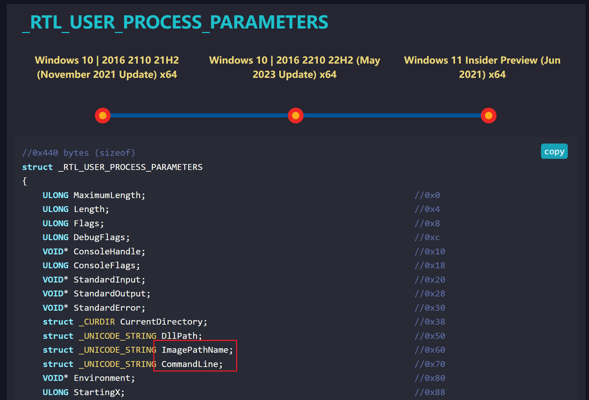

# PEB 及其武器化 - 先知社区

PEB 及其武器化

- - -

在 Windows 操作系统中，PEB 是指" Process Environment Block "，它是一个数据结构，用于存储有关进程的信息，每个进程都有一个对应的 PEB 结构体。PEB 提供了许多关于进程状态和环境的信息，它是用户模式和内核模式之间的一个关键接口。  
我们利用 PEB 可以完成很多事情，比如说动态获取 api，进程伪装，反调试等等。

## TEB

在了解 PEB 之前我们要先了解什么是 TEB，TEB 指的是线程环境块" Thread Environment Block "，用于存储线程状态信息和线程所需的各种数据。每个线程都有一个对应的 TEB 结构体，并且 TEB 结构的其中一个成员就是 PEB。

## 分析过程

接下来我们以 32 位为例进行 TEB 和 PEB 的分析，关于 64 位的结论会在下面一并给出。  
我们可以通过 [https://www.vergiliusproject.com/](https://www.vergiliusproject.com/) 这个网站来进行理论分析，也可以选择使用 windbg 来进行动手实践。

### 理论学习

我们首先在 vp 中找到 TEB 结构  
[](https://cdn.nlark.com/yuque/0/2024/png/40360538/1706859694222-7dd38936-2cdb-472c-aa50-5cea8da466af.png#averageHue=%23161c33&clientId=ubd58fc0a-f8b3-4&from=paste&height=911&id=u02f7982e&originHeight=1367&originWidth=2549&originalType=binary&ratio=1.5&rotation=0&showTitle=false&size=746217&status=done&style=none&taskId=u55762136-13c0-40e8-afd1-489b230a4e3&title=&width=1699.3333333333333)  
下图可以看到，TEB 偏移 0x30 就可以得到 PEB  
[](https://cdn.nlark.com/yuque/0/2024/png/40360538/1706859868639-7fda793e-1d48-48d4-9a83-8168cabded91.png#averageHue=%23262936&clientId=ubd58fc0a-f8b3-4&from=paste&height=831&id=u96113abf&originHeight=1247&originWidth=1665&originalType=binary&ratio=1.5&rotation=0&showTitle=false&size=184816&status=done&style=none&taskId=u2c67daa2-114c-4f64-89ed-5e53474495c&title=&width=1110)  
所以我们得到一个结论

> pTEB->0x30 = PEB

我们继续看 PEB 结构，这里我们先关注 0x0c 处的 Ldr，里面存储着有关模块加载的信息。  
[](https://cdn.nlark.com/yuque/0/2024/png/40360538/1706861007976-8a0460c7-f034-4ba5-a32e-34b725178287.png#averageHue=%23282b38&clientId=ubd58fc0a-f8b3-4&from=paste&height=895&id=u0feaa908&originHeight=1342&originWidth=1664&originalType=binary&ratio=1.5&rotation=0&showTitle=false&size=204252&status=done&style=none&taskId=u72378770-92d0-4eb3-9c64-0f214c55751&title=&width=1109.3333333333333)  
点进去看看，又看到三个结构体  
[](https://cdn.nlark.com/yuque/0/2024/png/40360538/1706861052482-c0204332-f06a-42f9-8c92-65656a493d95.png#averageHue=%23282c38&clientId=ubd58fc0a-f8b3-4&from=paste&height=392&id=u0d5175f9&originHeight=588&originWidth=1668&originalType=binary&ratio=1.5&rotation=0&showTitle=false&size=89416&status=done&style=none&taskId=u9e92090d-2031-4b2b-bd3e-d946d149543&title=&width=1112) 这三个结构体的结构都是一样的，都是双向链表，不同之处是加载的模块的顺序不同  
[](https://cdn.nlark.com/yuque/0/2024/png/40360538/1706862141471-c3d300da-9919-4b97-9894-5a402768a4a0.png#averageHue=%23282b37&clientId=ubd58fc0a-f8b3-4&from=paste&height=207&id=u893b7c6a&originHeight=311&originWidth=1663&originalType=binary&ratio=1.5&rotation=0&showTitle=false&size=27522&status=done&style=none&taskId=u15dae09d-1808-4191-bff0-0ed3f0fd14a&title=&width=1108.6666666666667)  
第一个成员 Flink 指向下一个节点，Blink 指向上一个节点，所以这是一个双向链表，当我们从\_PEB\_LDR\_DATA 结构中取到 InInitializationOrderModuleList 结构时，这个结构中的 Flink 指向真正的模块链表，这个真正的链表的每个成员都是一个 LDR\_DATA\_TABLE\_ENTRY 结构。  
之前的 \_PEB\_LDR\_DATA 只是一个入口，这个结构只有一个，它不是链表节点，真正的链表节点结构如下图：  
[](https://cdn.nlark.com/yuque/0/2024/png/40360538/1706865374607-1efa9c09-3559-4324-9c5a-2b1d60130984.png#averageHue=%23292c38&clientId=ubd58fc0a-f8b3-4&from=paste&height=776&id=u08630847&originHeight=1164&originWidth=1655&originalType=binary&ratio=1.5&rotation=0&showTitle=false&size=185172&status=done&style=none&taskId=u4100cb68-30ce-4343-9ba5-9b8d82073ae&title=&width=1103.3333333333333)  
他们之间的对应关系可以由下图来表示，如果学习过链表的概念还是挺好理解的（图片来自[https://bbs.kanxue.com/thread-266678.htm](https://bbs.kanxue.com/thread-266678.htm)）  
[](https://cdn.nlark.com/yuque/0/2024/png/40360538/1706865878253-89250045-cab2-4f3b-8e55-6357ef224ff3.png#averageHue=%23fcfbfa&clientId=ubd58fc0a-f8b3-4&from=paste&height=787&id=ucceb7bf8&originHeight=1181&originWidth=2535&originalType=binary&ratio=1.5&rotation=0&showTitle=false&size=711396&status=done&style=none&taskId=uc48e0624-0882-4703-9a3b-d50ae67f14d&title=&width=1690)  
简化版如下：  
[](https://cdn.nlark.com/yuque/0/2024/png/40360538/1706865951453-84f60af8-960a-477c-b6a2-61a1edc3d222.png#averageHue=%23fefefe&clientId=ubd58fc0a-f8b3-4&from=paste&height=365&id=u6bd1b312&originHeight=547&originWidth=1195&originalType=binary&ratio=1.5&rotation=0&showTitle=false&size=92319&status=done&style=none&taskId=u713f9238-231f-45a7-8a65-3ea918eb35a&title=&width=796.6666666666666)  
可以看到这是一个以 PEB\_LDR\_DATA 为起点的一个闭合环形双向链表。  
每个\_LDR\_DATA\_TABLE\_ENTRY 节点结构中偏移为 0x30 处的成员为 dllName，偏移为 0x18 处的成员为 DllBase。  
通过遍历链表，比较 dllName 字符串内容可以找到目标模块的所属节点。  
通过节点成员 DllBase 可以定位该模块的 DOS 头起始处。  
通过对 PE 结构的解析可以搜索导出表，从而可以取到指定的导出函数地址。

### 动手调试

我们接下来利用 windbg 手动走一遍定位 dll 过程。  
我们先启动一个程序，我这里启动的是 notepad，然后在 windbg 中附加上去。  
[](https://cdn.nlark.com/yuque/0/2024/png/40360538/1706866403340-a9738f1f-bb4e-40a3-b486-b2d386485965.png#averageHue=%23d1b585&clientId=ubd58fc0a-f8b3-4&from=paste&height=694&id=u2a8fe9fa&originHeight=1041&originWidth=1332&originalType=binary&ratio=1.5&rotation=0&showTitle=false&size=178663&status=done&style=none&taskId=uc5a3d526-364c-4087-91c0-9c28b2325e6&title=&width=888)  
附加之后，使用`dt _TEB @$teb`可以查看当前线程 TEB 相关的信息，并且得到 PEB 相关的信息。  
[](https://cdn.nlark.com/yuque/0/2024/png/40360538/1706866751101-bfe285b1-01c7-4c63-b44d-dc8e8ad4c423.png#averageHue=%2368c56c&clientId=ubd58fc0a-f8b3-4&from=paste&height=694&id=ub57ccda5&originHeight=1041&originWidth=1332&originalType=binary&ratio=1.5&rotation=0&showTitle=false&size=211055&status=done&style=none&taskId=u85f7591d-49d2-4d54-8217-2bcabbb5ce2&title=&width=888)  
这里直接点过来就可以得到 PEB 相关的信息  
[](https://cdn.nlark.com/yuque/0/2024/png/40360538/1706866906607-f5de48ff-2220-4b0d-806b-da2e876dd3c4.png#averageHue=%23f3f1ef&clientId=ubd58fc0a-f8b3-4&from=paste&height=350&id=u26b3443f&originHeight=525&originWidth=1270&originalType=binary&ratio=1.5&rotation=0&showTitle=false&size=175240&status=done&style=none&taskId=u34814005-ac87-43c3-be90-ec153669c4a&title=&width=846.6666666666666)  
这里注意到上图最下方的 Ldr，点一下就可以得到 Ldr 相关的信息  
[](https://cdn.nlark.com/yuque/0/2024/png/40360538/1706866975661-70e2337c-f8c0-45be-934b-2f04ae901f89.png#averageHue=%236bc570&clientId=ubd58fc0a-f8b3-4&from=paste&height=694&id=ua98aee9f&originHeight=1041&originWidth=1332&originalType=binary&ratio=1.5&rotation=0&showTitle=false&size=253093&status=done&style=none&taskId=u576e4458-356e-4e6a-8584-1e21a28e0be&title=&width=888)  
我们以第一个链表进行分析，直接点进去，得到 Flink 和 Blink  
[](https://cdn.nlark.com/yuque/0/2024/png/40360538/1706867152060-10566b98-aeea-4ff3-932c-2c20273dd08c.png#averageHue=%23eeedeb&clientId=ubd58fc0a-f8b3-4&from=paste&height=350&id=udfef21d9&originHeight=525&originWidth=1270&originalType=binary&ratio=1.5&rotation=0&showTitle=false&size=165938&status=done&style=none&taskId=u271a7327-09e4-46a5-b75c-57dc23ee3c7&title=&width=846.6666666666666)  
同样也可以看到内存地址，我们接下来直接去看内存地址 `dt 0x1b678806dc0 _LDR_DATA_TABLE_ENTRY`  
[](https://cdn.nlark.com/yuque/0/2024/png/40360538/1706867389487-5e436eb7-d9c8-4071-b2ed-5295702ad15b.png#averageHue=%236ec872&clientId=ubd58fc0a-f8b3-4&from=paste&height=694&id=uef4f956f&originHeight=1041&originWidth=1332&originalType=binary&ratio=1.5&rotation=0&showTitle=false&size=245417&status=done&style=none&taskId=u5de354cb-5447-46a9-a92b-0de65ab3c7a&title=&width=888)  
这里第一个 FullDllName 是 notepad 的路径，我们接着看下一个节点，直接点击下图红框位置  
[](https://cdn.nlark.com/yuque/0/2024/png/40360538/1706867608904-9a965106-0407-4675-a4d5-8b3cd6e62234.png#averageHue=%23f6f5f3&clientId=ubd58fc0a-f8b3-4&from=paste&height=350&id=u1c48b635&originHeight=525&originWidth=1270&originalType=binary&ratio=1.5&rotation=0&showTitle=false&size=159668&status=done&style=none&taskId=ubbf744c6-9c8d-4331-ba39-c0adbfa7127&title=&width=846.6666666666666)  
点进去得到如下：  
[](https://cdn.nlark.com/yuque/0/2024/png/40360538/1706867641230-4d8c1271-9310-44c1-a822-c49b95a9742a.png#averageHue=%23eae9e7&clientId=ubd58fc0a-f8b3-4&from=paste&height=76&id=u5611fda5&originHeight=114&originWidth=1261&originalType=binary&ratio=1.5&rotation=0&showTitle=false&size=40627&status=done&style=none&taskId=ub858f9e9-8777-4d17-aa9e-1c33b03358b&title=&width=840.6666666666666)  
然后用该命令`dt 0x1b678806c70 _LDR_DATA_TABLE_ENTRY`看下一个节点  
[](https://cdn.nlark.com/yuque/0/2024/png/40360538/1706867706902-5d7105e0-ec34-4d0a-83fe-50d21a3f5a73.png#averageHue=%23f5f4f2&clientId=ubd58fc0a-f8b3-4&from=paste&height=350&id=u32dda1b2&originHeight=525&originWidth=1270&originalType=binary&ratio=1.5&rotation=0&showTitle=false&size=158823&status=done&style=none&taskId=u644d2473-e1b7-4556-a687-f8942df3562&title=&width=846.6666666666666)  
已经得到 ntdll.dll

### 获取 PEB 的几种方式

还有一个小问题需要解决，那就是我们如何获得 TEB 的内存地址呢，在上面分析时我们直接用的是 windbg 中的命令，并没有提到这个问题。  
其实，在 x86 下 TEB 结构指针存储在 fs 寄存器中，在 x64 下 TEB 结构指针存储在 gs 寄存器中。另外我们在前面提到过的 x64 和 x86 的区别主要是 TEB 到 PEB 的偏移量不同，在 x64 下该偏移量位 0x60。  
也有文章说 fs:\[0x18\] 是 PEB，接下来我们来看一下该说法原理：  
这里我们关注第一个结构体，TIB（线程信息块）  
[](https://cdn.nlark.com/yuque/0/2024/png/40360538/1706868979356-be98a108-c6f1-42d6-b4b0-a3445cdc8080.png#averageHue=%23292c39&clientId=ubd58fc0a-f8b3-4&from=paste&height=511&id=p79uN&originHeight=766&originWidth=1609&originalType=binary&ratio=1.5&rotation=0&showTitle=false&size=134520&status=done&style=none&taskId=ua38988c7-e78b-462b-84ae-806d5eff690&title=&width=1072.6666666666667)  
点进去可以看到里面的一些成员，标出来的 self 就是指向自身的指针，也就是指向 0x0 的 ExceptionList  
[](https://cdn.nlark.com/yuque/0/2024/png/40360538/1706870026607-e27d5e02-be0c-40d1-acbb-8d91490a1f0a.png#averageHue=%23282b38&clientId=ubd58fc0a-f8b3-4&from=paste&height=429&id=UjzIH&originHeight=644&originWidth=1646&originalType=binary&ratio=1.5&rotation=0&showTitle=false&size=70441&status=done&style=none&taskId=ue0ff9d8a-1962-4aa3-88ce-7efec3033b3&title=&width=1097.3333333333333)  
`0x0+0x18=0x18`，所以说 fs:\[0x18\] 是 PEB。  
下面简单介绍一下获取 PEB 的几种方式

#### 汇编调用

在 x86 下可以直接内联汇编

```plain
__asm
{
    mov eax, dword ptr fs : [00000030h]
    mov peb, eax
}
```

在 x64 下则需要一个单独的 asm 文件并且进行一些配置，可以参考博客：[vs2022 x64 C/C++ 和汇编混编\_vs 嵌入汇编-CSDN 博客](https://blog.csdn.net/qq_29176323/article/details/129145326)，代码 demo 如下：

```plain
.code
GetPEB PROC
mov rax, gs:[30h] ; TEB from gs in 64 bit only
mov rax, [rax+60h] ; PEB
ret
GetPEB ENDP
end
```

#### **readfsdword 与** readgsqword

可以直接通过 **readfsdword(0x30) 或者** readgsqword(0x60) 来获取 PEB，demo 如下：

```plain
#include <windows.h>
#include <winternl.h>

#ifndef _WIN64
    PPEB pPeb = (PPEB)__readfsdword(0x30);
#else
    PPEB pPeb = (PPEB)__readgsqword(0x60);
#endif
```

#### NtQueryInformationProcess

NtQueryInformationProcess 是一个内核函数，用来查看进程信息，其结构体如下：

```plain
__kernel_entry NTSTATUS NtQueryInformationProcess(
  [in]            HANDLE           ProcessHandle,
  [in]            PROCESSINFOCLASS ProcessInformationClass,
  [out]           PVOID            ProcessInformation,
  [in]            ULONG            ProcessInformationLength,
  [out, optional] PULONG           ReturnLength
);
```

它的第二个参数可以是一个**PROCESS\_BASIC\_INFORMATION**的结构体：

```plain
typedef struct _PROCESS_BASIC_INFORMATION {
    NTSTATUS ExitStatus;
    PPEB PebBaseAddress;
    ULONG_PTR AffinityMask;
    KPRIORITY BasePriority;
    ULONG_PTR UniqueProcessId;
    ULONG_PTR InheritedFromUniqueProcessId;
} PROCESS_BASIC_INFORMATION;
```

第二个值**PebBaseAddress** 指向 PEB 结构。据此我们可以有如下 demo：

```plain
#include <windows.h>
#include <winternl.h>

// Define the PROCESS_BASIC_INFORMATION structure
typedef struct _PROCESS_BASIC_INFORMATION {
    PVOID Reserved1;
    PPEB PebBaseAddress;
    PVOID Reserved2[2];
    ULONG_PTR UniqueProcessId;
    PVOID Reserved3;
} PROCESS_BASIC_INFORMATION;

// Define the NtQueryInformationProcess function
typedef NTSTATUS (NTAPI *PNtQueryInformationProcess)(
    HANDLE ProcessHandle,
    PROCESSINFOCLASS ProcessInformationClass,
    PVOID ProcessInformation,
    ULONG ProcessInformationLength,
    PULONG ReturnLength
);

int main() {
    // Open the current process
    HANDLE hProcess = GetCurrentProcess();

    // Define a buffer to hold the information
    PROCESS_BASIC_INFORMATION pbi;

    // Load NtQueryInformationProcess dynamically
    HMODULE hNtDll = GetModuleHandle(L"ntdll.dll");
    PNtQueryInformationProcess pNtQueryInformationProcess = 
        (PNtQueryInformationProcess)GetProcAddress(hNtDll, "NtQueryInformationProcess");

    // Call NtQueryInformationProcess to get the PEB address
    NTSTATUS status = pNtQueryInformationProcess(hProcess, ProcessBasicInformation, &pbi, sizeof(pbi), NULL);

    if (NT_SUCCESS(status)) {
        // Access PEB address from the structure
        PPEB pebAddress = pbi.PebBaseAddress;
        wprintf(L"PEB Address: %p\n", pebAddress);
    } else {
        wprintf(L"Error: NtQueryInformationProcess failed with status 0x%X\n", status);
    }

    // Close the process handle
    CloseHandle(hProcess);

    return 0;
}
```

### 小结：

通过上述学习，我们已经成功通过 PEB 得到了 ntdll.dll，当然也可以获取 kerndl32.dll，下面是三个双向链表加载 dll 的顺序：

> -   InLoadOrderModuleList 模块加载顺序
> 
> notepad.exe ntdll.dll kernel32.dll kernelbase.dll
> 
> -   InMemoryOrderModuleList 模块在内存加载顺序
> 
> notepad.exe ntdll.dll kernel32.dll kernelbase.dll
> 
> -   InInitializationOrderLinks 模块初始化装载顺序
> 
> ntdll.dll kernelbase.dll kernel32.dll

还有一张神图：  
[](https://cdn.nlark.com/yuque/0/2024/jpeg/40360538/1706951605661-20fb188d-4983-4af8-a4eb-c3ebbeea6045.jpeg#averageHue=%23eeeac8&from=url&id=mv3PU&originHeight=1512&originWidth=3192&originalType=binary&ratio=1.5&rotation=0&showTitle=false&status=done&style=none&title=)

## 武器化

接下来介绍 PEB 在免杀中的一些应用。

### 动态获取 api

我们通过上述的学习已经可以在 windbg 中获取 kerndl32.dll 的地址，接下来要做的就是遍历导出表找到所需要的函数，这里需要一些 PE 格式的相关知识，这里不再赘述。  
我们的汇编代码如下：  
[](https://cdn.nlark.com/yuque/0/2024/png/40360538/1706880495427-9da076a7-b245-4cfa-b88d-bae143a634dc.png#averageHue=%231f1f1f&clientId=u9dc3f71c-40a2-4&from=paste&height=681&id=uab4a3a33&originHeight=1022&originWidth=2190&originalType=binary&ratio=1.5&rotation=0&showTitle=false&size=72063&status=done&style=none&taskId=ud41ae8f5-a5b9-437b-859c-96d98b7229f&title=&width=1460)  
这是 x64 下的，所以偏移量和 x86 下不同，建议大家对照 vp 再去看一遍，其中 `mov rax,[rax]`是为了获取下一个节点。  
下面是我们验证的代码，比较一下我们获取的函数地址和 GetModuleHandle 函数获取的地址有区别吗，另外不要忘记导出函数。  
[](https://cdn.nlark.com/yuque/0/2024/png/40360538/1706880787957-10df3e6c-8a4d-4ab0-a5f2-9e79bf64a69b.png#averageHue=%23212121&clientId=u9dc3f71c-40a2-4&from=paste&height=681&id=u3ff58424&originHeight=1022&originWidth=2190&originalType=binary&ratio=1.5&rotation=0&showTitle=false&size=269986&status=done&style=none&taskId=u047dc1e2-fdba-447d-91ff-ab26bcbf279&title=&width=1460)  
可以看到结果是没有问题的  
[](https://cdn.nlark.com/yuque/0/2024/png/40360538/1706880937494-431cd080-8993-4e9b-88f0-464f00d09b45.png#averageHue=%230e0e0d&clientId=u9dc3f71c-40a2-4&from=paste&height=43&id=ud4c68ec0&originHeight=65&originWidth=1200&originalType=binary&ratio=1.5&rotation=0&showTitle=false&size=5656&status=done&style=none&taskId=u78f03461-fc7f-484e-8fc8-272d71b41ba&title=&width=800)  
接下来要做的就是遍历导出表了

```plain
PVOID GetAddressFromExportTable(PVOID pBaseAddress, PCHAR pszFunctionName)
{
    PVOID get_address = 0;
    DWORD ulFunctionIndex = 0;
    // DOS 头
    PIMAGE_DOS_HEADER pDosHeader = (PIMAGE_DOS_HEADER)pBaseAddress;
    // NT 头
    PIMAGE_NT_HEADERS pNtHeaders = (PIMAGE_NT_HEADERS)((PUCHAR)pDosHeader + pDosHeader->e_lfanew);
    // 导出表
    PIMAGE_EXPORT_DIRECTORY pExportTable = (PIMAGE_EXPORT_DIRECTORY)((PUCHAR)pDosHeader + pNtHeaders->OptionalHeader.DataDirectory[0].VirtualAddress);
    //导出表有名字的函数的个数
    ULONG NumberOfFunctions = pExportTable->NumberOfFunctions;
    //导出函数名称地址表
    PULONG AddressOfNamesTable = (PULONG)((PUCHAR)pDosHeader + pExportTable->AddressOfNames);
    PCHAR Name = NULL;
    //循环导出函数名称地址表
    for (ULONG i = 0; i < NumberOfFunctions; i++) {
        Name = (PCHAR)((PUCHAR)pDosHeader + AddressOfNamesTable[i]);
        //如果找到了
        if (0 == _strnicmp(pszFunctionName, Name, strlen(pszFunctionName))) {
            //找到对应序号
            USHORT ordinal = *(USHORT*)((PUCHAR)pDosHeader + pExportTable->AddressOfNameOrdinals + 2 * i);
            //根据序号找到 RVA
            ULONG FuncAddr = *(PULONG)((PUCHAR)pDosHeader + pExportTable->AddressOfFunctions + 4 * ordinal);
            get_address = (PVOID)((PUCHAR)pDosHeader + FuncAddr);
            return get_address;
        }
    }
    return 0;

}
```

然后用一小段代码进行验证

```plain
typedef VOID(WINAPI* pSleep)(DWORD);
    pSleep mySleep = (pSleep)GetAddressFromExportTable(GetKernel32(), (PCHAR)"Sleep");
    mySleep(5000);
```

或者将获取的地址和 GetProcAddress 获取的函数的地址进行比较

```plain
pVirtualAlloc alloc = (pVirtualAlloc)GetAddressFromExportTable(getKernel32(), (PCHAR)"Sleep");
    pVirtualAlloc a = (pVirtualAlloc)GetProcAddress(GetModuleHandle(L"kernel32"), "Sleep");
```

由下图可以看到是一样的，所以说实现的并没有问题  
[](https://cdn.nlark.com/yuque/0/2024/png/40360538/1706933994732-5779fad7-6035-42d4-be64-2e8ac099d11a.png#averageHue=%23232222&clientId=u3df26b48-566b-4&from=paste&height=861&id=u9ca60c95&originHeight=1291&originWidth=2082&originalType=binary&ratio=1.5&rotation=0&showTitle=false&size=263816&status=done&style=none&taskId=ubcfea9cb-8805-4538-96d8-cf79fdaedcd&title=&width=1388)

### 进程伪装

我们现在随便启动一个 notepad 的进程，然后用 ProcessExplorer 去观察  
[](https://cdn.nlark.com/yuque/0/2024/png/40360538/1706951404255-54b68b9f-3932-4bf7-9550-ff1c013c261f.png#averageHue=%23f6f5f4&clientId=u3df26b48-566b-4&from=paste&height=605&id=ub856b4e2&originHeight=908&originWidth=725&originalType=binary&ratio=1.5&rotation=0&showTitle=false&size=51799&status=done&style=none&taskId=ufea6ebd8-c5d4-45ba-b079-e84b6565480&title=&width=483.3333333333333)  
其实我们要做的很简单，就是在 peb 中找到对应的数据结构，然后对其进行修改就实现了我们的进程伪装。  
首先是进程映像路径和命令行。  
还是在上面 vp 的网站上  
[](https://cdn.nlark.com/yuque/0/2024/png/40360538/1706946584169-91a02ee3-f2d1-46fc-b14c-26239c5845fc.png#averageHue=%23282c38&clientId=u3df26b48-566b-4&from=paste&height=814&id=u5598a1ba&originHeight=1221&originWidth=1625&originalType=binary&ratio=1.5&rotation=0&showTitle=false&size=193784&status=done&style=none&taskId=u46894486-f335-4110-a174-12e26d494b1&title=&width=1083.3333333333333)  
我们找到 ProcessParameters，然后点进去就可以发现 ImagePathName 和 CommandLine 两项，就对应着进程映像路径和命令行，  
[](https://cdn.nlark.com/yuque/0/2024/png/40360538/1706946627130-0e163212-76de-44c7-b7e3-aa908eb82de7.png#averageHue=%23272b38&clientId=u3df26b48-566b-4&from=paste&height=767&id=u13c5dcad&originHeight=1151&originWidth=1694&originalType=binary&ratio=1.5&rotation=0&showTitle=false&size=180682&status=done&style=none&taskId=ue90470e3-8d99-4226-bac7-4e4e49c7e39&title=&width=1129.3333333333333)  
我们红框框了 3 项，还有一个进程当前目录，我们要用 SetCurrentDirectoryW 这个 api 来进行修改，下面是一个简单的 demo

```plain
#include <stdlib.h>
#include <stdio.h>
#include <windows.h>
#include <winternl.h>

int main()
{

    // 获取TEB中PEB指针的偏移
#ifdef _M_IX86 
    PPEB PEB = (PPEB)__readfsdword(0x30);
#else
    PPEB PEB = (PPEB)__readgsqword(0x60);
#endif

    // 改变进程当前目录  注意：路径 必须是存在的，否则会报错
    int result = SetCurrentDirectoryW(L"C:\\Users\\James\\");

    //改变进程映像路径和命令行
    WCHAR path[] = L"c:\\windows\\system32\\notepad.exe\0";
    PEB->ProcessParameters->ImagePathName.Buffer = path;
    PEB->ProcessParameters->CommandLine.Buffer = path;

    getchar();

}
```

可以看到 ProcessExplorer 的图标已经变成记事本，点进去查看发现已经修改成功，实现了进程伪装。（但是有一点，我使用 Process Hacker2 去查看，并没有修改成功）  
[](https://cdn.nlark.com/yuque/0/2024/png/40360538/1706951253779-5a544c68-0ef5-4e7a-8183-6abae0c432e3.png#averageHue=%23f7f5f3&clientId=u3df26b48-566b-4&from=paste&height=262&id=udc9d4da3&originHeight=393&originWidth=1176&originalType=binary&ratio=1.5&rotation=0&showTitle=false&size=32916&status=done&style=none&taskId=u056b1657-cf36-45e6-8fc5-5aa33350304&title=&width=784)  
[](https://cdn.nlark.com/yuque/0/2024/png/40360538/1706951278428-250a6964-d0ce-4df8-b1ff-4126090578bd.png#averageHue=%23f6f5f4&clientId=u3df26b48-566b-4&from=paste&height=600&id=ude0cb1b8&originHeight=900&originWidth=719&originalType=binary&ratio=1.5&rotation=0&showTitle=false&size=50376&status=done&style=none&taskId=uefe23609-06c3-4ef6-a0f5-743f5868787&title=&width=479.3333333333333)

### 反调试

关于 PEB 反调试的内容，主要涉及的有

-   BeingDebugged：当有调试器附加的时候该位被置为 1
-   NtGlobalFlag：当有调试器附加的时候该位被置为 0x70
-   Heap Flags：在 PEB 的 ProcessHeap 位指向\_HEAP 结构体，该结构体中有俩个字段（HeapFlags 和 ForceFlags）会受到调试器的影响，如果 HeapFlags 的值大于 2，或 ForceFlags 的值大于 0 时，说明被调试。
-   堆 Magic 标志：当进程被调试器调试时该进程堆会被一些特殊的标志填充，这些特殊标记分别是 0xABABABAB , 0xFEEEFEEE。在调试模式下，NtGlobalFlag 的 HEAP\_TAIL\_CHECKING\_ENABLED 标志将被默认设置，堆内存分配会在末尾追加 0xABABABAB 标志进行安全检查，如果 NtGlobalFlag 设置了 HEAP\_FREE\_CHECKING\_ENABLED 标志，那么当需要额外的字节来填充堆块尾部时，就会使用 0xFEEEFEEE (或一部分) 来填充。

有一篇文章已经总结的很好了，demo 上面都有，这里就不再过多赘述了，地址：[https://anti-debug.checkpoint.com/techniques/debug-flags.html#manual-checks-peb-beingdebugged-flag](https://anti-debug.checkpoint.com/techniques/debug-flags.html#manual-checks-peb-beingdebugged-flag)
