# Public-CMS 漏洞分析 - 先知社区

Public-CMS 漏洞分析

- - -

# 任意文件上传

## 漏洞详情

[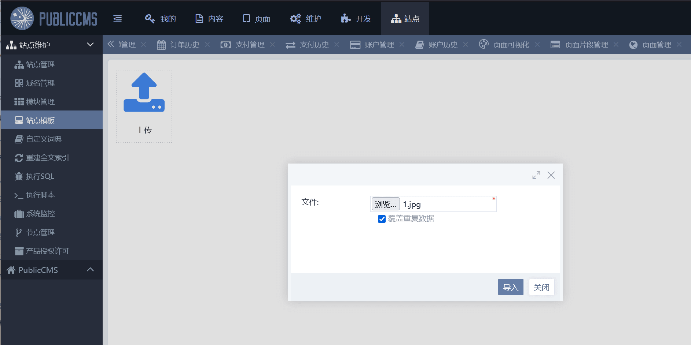](https://cdn.nlark.com/yuque/0/2024/png/21762749/1705301151497-715b2a94-ebff-4943-a065-5ad339eae984.png#averageHue=%23c3bba5&clientId=uc5119311-f769-4&from=paste&height=629&id=u388668b3&originHeight=943&originWidth=1885&originalType=binary&ratio=1.5&rotation=0&showTitle=false&size=91124&status=done&style=none&taskId=uddcd90d3-17bf-4884-9816-c0d58238069&title=&width=1256.6666666666667)  
抓包 修改后缀为-site.zip  
[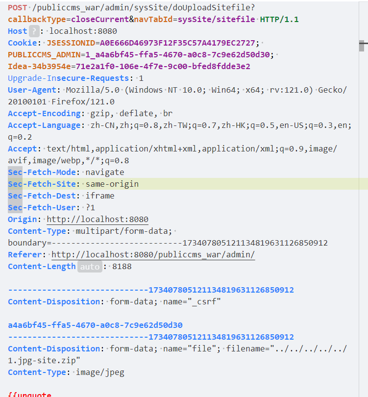](https://cdn.nlark.com/yuque/0/2024/png/21762749/1705301192164-0b587bb9-1a20-41d5-83da-3e6f8c90bc0c.png#averageHue=%23e8edf3&clientId=uc5119311-f769-4&from=paste&height=540&id=uff9156bc&originHeight=810&originWidth=751&originalType=binary&ratio=1.5&rotation=0&showTitle=false&size=122881&status=done&style=none&taskId=ue145ca1b-f50a-40b2-a322-df5cedb444c&title=&width=500.6666666666667)  
即可目录穿越上传到任意位置

## 漏洞代码分析

V4.0.202302.c 版本  
`src/main/java/com/publiccms/controller/admin/sys/SysSiteAdminController.java`  
[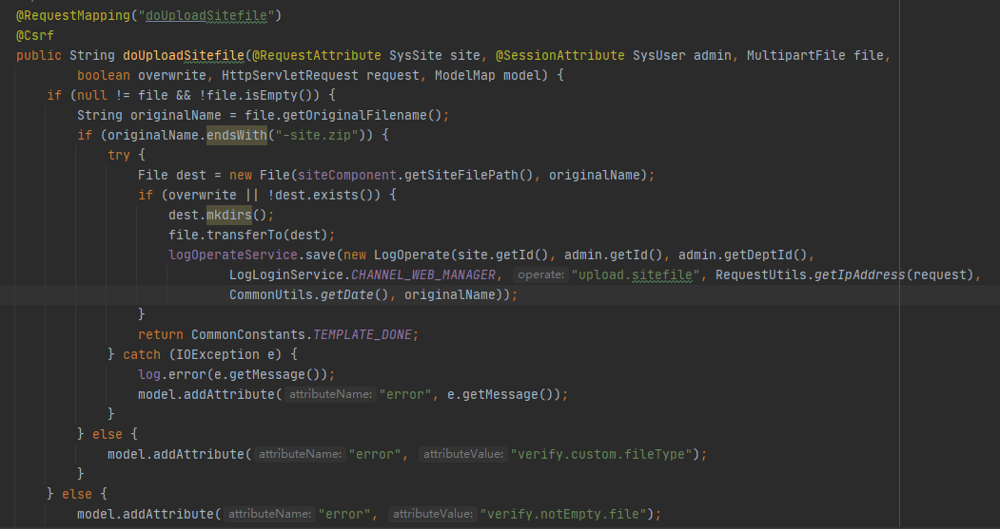](https://cdn.nlark.com/yuque/0/2024/png/21762749/1705300954913-fdc09e0d-6f38-4320-a8cd-5a0606bce06a.png#averageHue=%232d2c2b&clientId=ud659498e-6e05-4&from=paste&id=u6b385cf3&originHeight=557&originWidth=1051&originalType=url&ratio=1.5&rotation=0&showTitle=false&status=done&style=none&taskId=u4987f186-4a88-48aa-bd08-f590a686bf8&title=)  
查看代码就能看出没做任何校验  
要求结尾必须是-size.zip ,之后文件就被拼接写入了

## 新版修复方法

[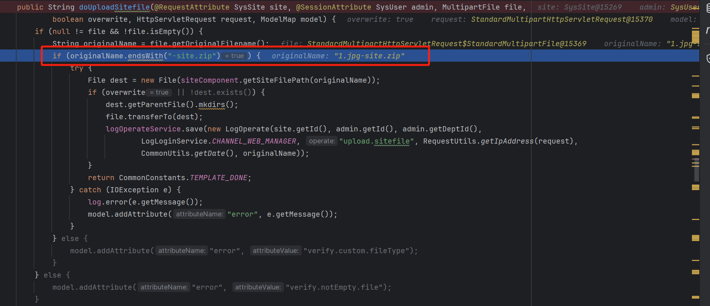](https://cdn.nlark.com/yuque/0/2024/png/21762749/1705300631144-ef35b9b0-2dc6-4616-a913-3fde34b2e289.png#averageHue=%23202329&clientId=ud659498e-6e05-4&from=paste&height=553&id=u0f2dced1&originHeight=829&originWidth=1923&originalType=binary&ratio=1.5&rotation=0&showTitle=false&size=197630&status=done&style=none&taskId=u8b8f07db-c3dd-4246-b58e-ef2ba2a5e9c&title=&width=1282)  
[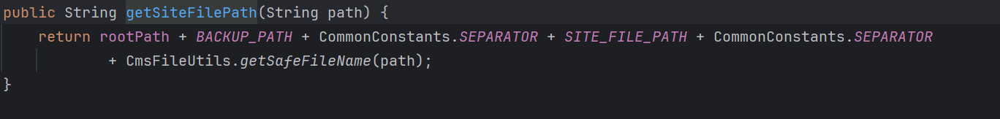](https://cdn.nlark.com/yuque/0/2024/png/21762749/1705301047541-b6bf0ca5-363f-49cd-bc69-13427457bea3.png#averageHue=%23212327&clientId=ud659498e-6e05-4&from=paste&height=109&id=u2bb5c023&originHeight=163&originWidth=1368&originalType=binary&ratio=1.5&rotation=0&showTitle=false&size=25979&status=done&style=none&taskId=ufb0e7268-1d23-48a7-9a53-f9d11634045&title=&width=912)  
[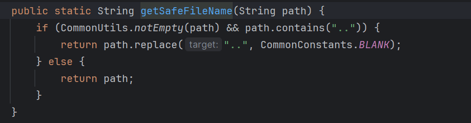](https://cdn.nlark.com/yuque/0/2024/png/21762749/1705301098307-2280c428-559d-46ec-a19b-14674b4fe9d3.png#averageHue=%23212327&clientId=uc5119311-f769-4&from=paste&height=160&id=ua570037e&originHeight=240&originWidth=919&originalType=binary&ratio=1.5&rotation=0&showTitle=false&size=30539&status=done&style=none&taskId=ud2445ee0-28ef-4f84-b169-6547be418c2&title=&width=612.6666666666666)  
对目录穿越进行了限制

# 组合拳 RCE

## 代码执行

[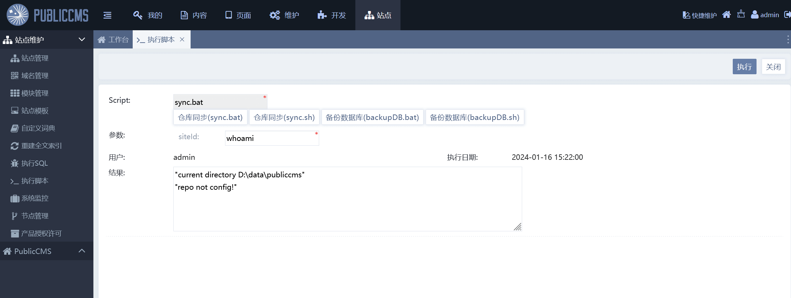](https://cdn.nlark.com/yuque/0/2024/png/21762749/1705391457355-5dd913e2-7c09-4531-a1eb-b417dbccc3b3.png#averageHue=%23d3c5a3&clientId=uf332a152-58d9-4&from=paste&height=578&id=u843fb655&originHeight=867&originWidth=2295&originalType=binary&ratio=1.5&rotation=0&showTitle=false&size=98148&status=done&style=none&taskId=u1bf264dc-14fc-4ab8-92c4-037bfb34865&title=&width=1530)  
[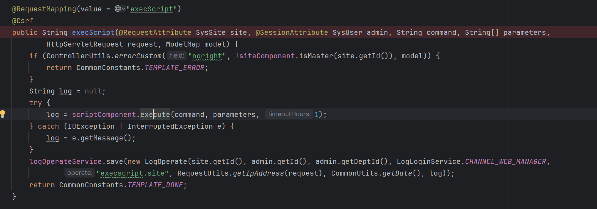](https://cdn.nlark.com/yuque/0/2024/png/21762749/1705390395442-5106452b-2aa6-4a2e-935c-094f72297471.png#averageHue=%23202226&clientId=uf332a152-58d9-4&from=paste&height=392&id=ueef48135&originHeight=588&originWidth=1677&originalType=binary&ratio=1.5&rotation=0&showTitle=false&size=116888&status=done&style=none&taskId=ua09b5bd7-2e44-449f-82d1-dde380ccb8b&title=&width=1118)  
跟入 execute 方法  
[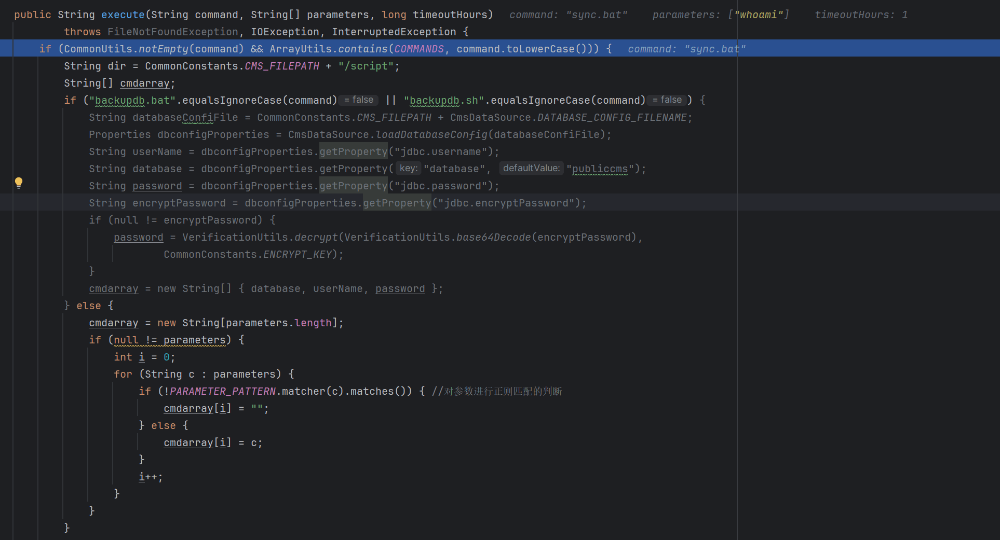](https://cdn.nlark.com/yuque/0/2024/png/21762749/1705390557102-8370d3b8-7c04-46f1-ac12-03c687d685b7.png#averageHue=%23202228&clientId=uf332a152-58d9-4&from=paste&height=694&id=ua76e3342&originHeight=1041&originWidth=1926&originalType=binary&ratio=1.5&rotation=0&showTitle=false&size=200692&status=done&style=none&taskId=ub3e05653-07c9-48a1-b816-1fda1d66bc9&title=&width=1284)  
这里首先对传入的执行脚本的名字进行判断，是否为空，是否是`"sync.bat", "sync.sh", "backupdb.bat", "backupdb.sh"`四个其中一个  
如果是 backup 的话，就会去获取数据库的配置信息，写入到 cmdarray 中。不是的话 就把 parameters（输入的参数）判断是否符合正则匹配的要求，然后写入到 cmdarray 的第一位中  
[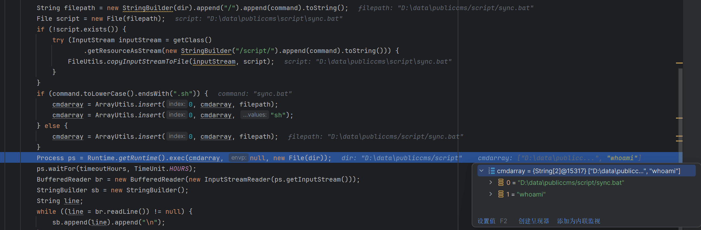](https://cdn.nlark.com/yuque/0/2024/png/21762749/1705391018869-3463567d-1fb9-44c9-bf24-81e74ab2cbb4.png#averageHue=%2322262c&clientId=uf332a152-58d9-4&from=paste&height=472&id=ud84294d4&originHeight=708&originWidth=2158&originalType=binary&ratio=1.5&rotation=0&showTitle=false&size=201569&status=done&style=none&taskId=u97812ba9-20ee-4b36-b692-fec788e04dc&title=&width=1438.6666666666667)  
这里对脚本进行判断 存在就写入路径到 cmdarray 的第一位，不存在就新建再写，之后使用 Runtime.getRuntime().exec 执行。  
可是脚本都是固定的 前端输入的是脚本的名字和调用的参数（参数也进行了过滤）。无法修改内容

## 任意文件替换

[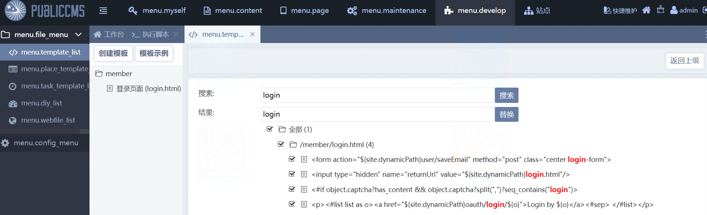](https://cdn.nlark.com/yuque/0/2024/png/21762749/1705391627778-d580034a-3bee-4596-bb97-f8945a6d5889.png#averageHue=%23eff3f0&clientId=uf332a152-58d9-4&from=paste&height=365&id=u0ee0078c&originHeight=547&originWidth=1788&originalType=binary&ratio=1.5&rotation=0&showTitle=false&size=461207&status=done&style=none&taskId=uc17e5133-3e06-4a34-bcac-c2d5b5bada9&title=&width=1192)  
查看替换方法 发现对`../`并未检测  
[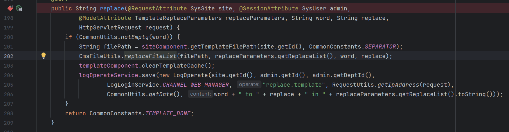](https://cdn.nlark.com/yuque/0/2024/png/21762749/1705391933978-0fd24ac0-2e1a-4184-8062-41aaa56a9207.png#averageHue=%23212327&clientId=uf332a152-58d9-4&from=paste&height=305&id=ueaf2f379&originHeight=457&originWidth=1753&originalType=binary&ratio=1.5&rotation=0&showTitle=false&size=120398&status=done&style=none&taskId=uf39e11f4-7d2a-4a93-b821-43979bdbb2a&title=&width=1168.6666666666667)  
[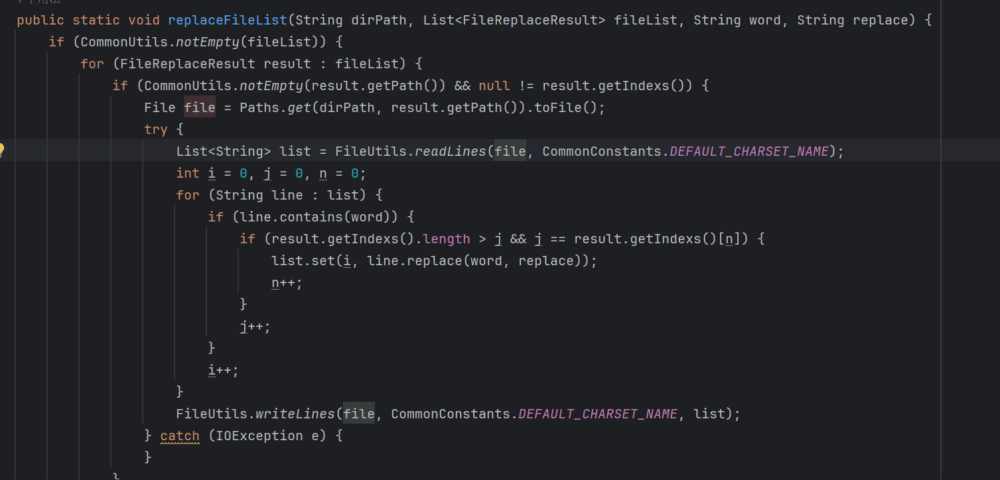](https://cdn.nlark.com/yuque/0/2024/png/21762749/1705391920896-5c9deb79-d912-4962-b412-ef5a2d3755de.png#averageHue=%23202125&clientId=uf332a152-58d9-4&from=paste&height=483&id=ue621cee6&originHeight=724&originWidth=1507&originalType=binary&ratio=1.5&rotation=0&showTitle=false&size=107470&status=done&style=none&taskId=uc7635b7e-9309-4ec0-b626-1652a15debb&title=&width=1004.6666666666666)
