# QuasarRAT 与 AsyncRAT 同源对比及分析 - 先知社区

QuasarRAT 与 AsyncRAT 同源对比及分析

- - -

## 概述

前段时间，笔者针对 AsyncRAT 开源远控工具开展了一系列研究分析，从加解密技术、通信模型、攻防技术等角度发布了一系列文章，在对 AsyncRAT 开源远控工具进行配置信息解密的时候，笔者就一直感觉 AsyncRAT 反编译代码中的加密配置信息有一种似曾相识的感觉。因此，笔者就尝试查找了以前的一些资料，发现原来是 QuasarRAT 开源远控工具的加密配置信息与 AsyncRAT 开源远控工具的加密配置信息的格式很像。

为了打消疑惑，笔者尝试对 QuasarRAT 开源远控工具与 AsyncRAT 开源远控工具进行了对比分析，发现：

-   QuasarRAT 开源远控工具与 AsyncRAT 开源远控工具使用的配置信息解密算法相同，因此其反编译代码中的加密配置信息很相似。
-   由于 QuasarRAT 与 AsyncRAT 均是开源远控，且 QuasarRAT 早于 AsyncRAT 开源，因此，很可能是 AsyncRAT 在模仿学习 QuasarRAT 工具的配置信息加密技术。
-   为了便于对开源远控工具进行通信模型研究，笔者在 TLS 通信数据解密尝试过程中，发现了一种**疑似可适用于 NET 程序研究场景下的密钥套件自定义方法**（由于笔者只是进行了简单尝试，确定当前可适用于 QuasarRAT 开源远控工具，但至于能否通用所有 NET 程序？笔者目前也不清楚，待后续研究清楚后，笔者会基于此写一篇研究分析文章供大家一起交流学习），此方法可从系统底层修改配置密钥套件，然后使用私钥对 QuasarRAT 的 TLS 通信数据进行解密。
-   通过对 TLS 解密后的通信载荷进行分析，发现 QuasarRAT 开源远控工具与 AsyncRAT 开源远控工具使用的通信模型不同，QuasarRAT 开源远控工具使用了 protobuf 序列化数据加密。

## 开源 QuasarRAT 利用分析

由于 QuasarRAT 开源远控工具开源时间较早，因此网络中存在不少 QuasarRAT 木马的攻击案例，不少 APT 组织均会使用此款远控木马作为最终控制程序。

网络中 QuasarRAT 木马利用案例如下：

[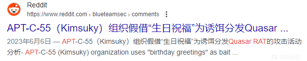](https://xzfile.aliyuncs.com/media/upload/picture/20240205191455-ca8a62d6-c417-1.png)

[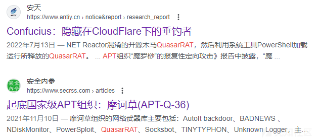](https://xzfile.aliyuncs.com/media/upload/picture/20240205191509-d2e3c3f0-c417-1.png)

[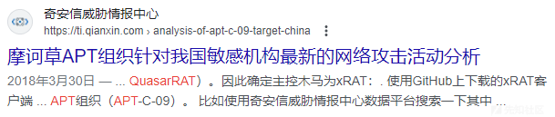](https://xzfile.aliyuncs.com/media/upload/picture/20240205191522-da47a940-c417-1.png)

进一步对 QuasarRAT 开源远控工具进行分析，发现：

-   开源地址：[https://github.com/quasar/Quasar](https://github.com/quasar/Quasar)
-   QuasarRAT 工具的早期版本名称为 xRAT，xRAT 于 2014 年 7 月 8 日发布 xRAT v2.0.0.0 RELEASE1 版本，后续于 2015 年 8 月 23 日发布 Quasar v1.0.0.0 版本；
-   QuasarRAT 工具的当前最新版本为 2023 年 3 月 13 日发布的 Quasar v1.4.1 版本；
-   QuasarRAT 开源项目的维护人员较多，有 15 人维护，7900 余个标星，2400 余个账号 forks 拷贝项目；
-   QuasarRAT远控工具的所有模块均为C#代码编写，比较核心的模块为Client端、Server端、Common模块；
-   在实际使用过程中，发现 QuasarRAT 远控工具在 Win7 环境下可能无法上线（github 上说支持 Win7，推测可能是.NET 库不对应），建议使用 Win10 环境进行测试使用；

相关截图如下：

[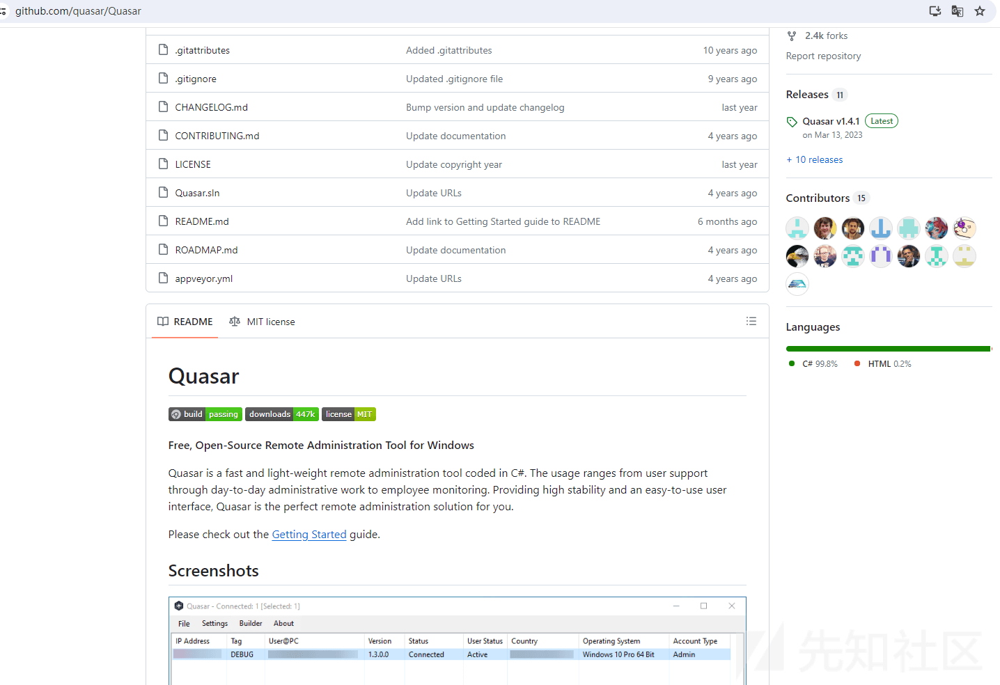](https://xzfile.aliyuncs.com/media/upload/picture/20240205191541-e5a7f420-c417-1.png)

### 生成 Client 端木马

下载 release 版本程序并直接运行即可打开 QuasarRAT 控制端的 GUI 界面，QuasarRAT 的使用逻辑与 AsyncRAT 的使用逻辑完全相同。

QuasarRAT 控制端首次运行时，可在当前目录中生成 quasar.p12 文件，此文件与 AsyncRAT 生成的 ServerCertificate.p12 文件的功能相同，均是用于存放安全加密通信的密钥和证书；

在 GUI 界面中选择【Builder】菜单即可对 Client 端木马进行自定义配置，相关截图如下：

[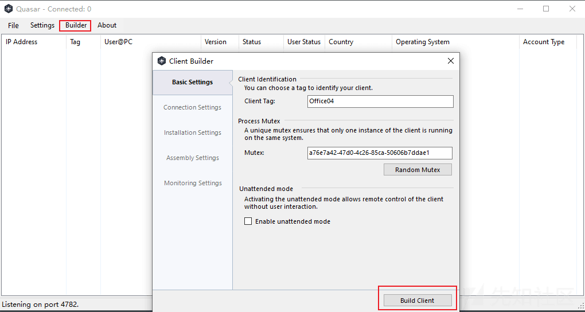](https://xzfile.aliyuncs.com/media/upload/picture/20240205191559-f05134f4-c417-1.png)

### 木马上线

在 QuasarRAT 控制端的 GUI 界面中选择【Settings】菜单即可开启监听，然后在受控主机中运行 Client 端木马程序，即可成功实现木马上线，上线后即可实现对受控主机的远控管理，相关截图如下：

[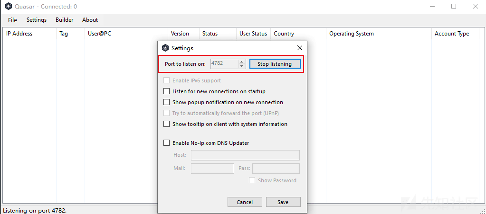](https://xzfile.aliyuncs.com/media/upload/picture/20240205191611-f7dc46be-c417-1.png)

[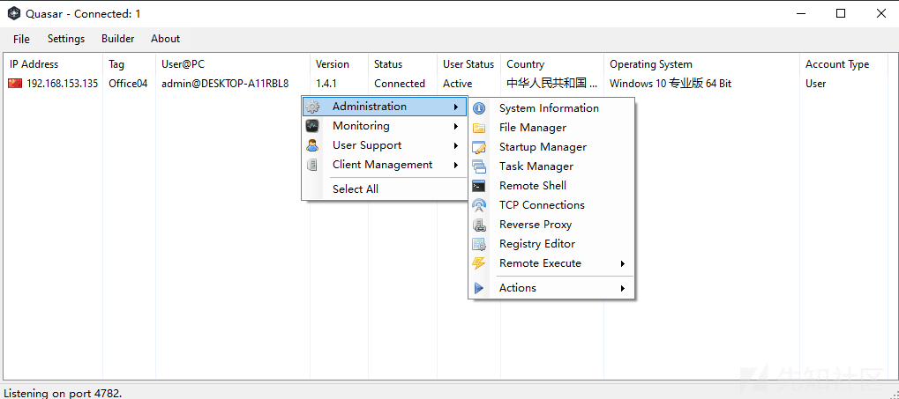](https://xzfile.aliyuncs.com/media/upload/picture/20240205191625-0042d98a-c418-1.png)

## 与 AsyncRAT 同源

在对 QuasarRAT 进行同源对比前，需要先尝试对 QuasarRAT 木马进行反编译，通过分析，笔者发现：

-   QuasarRAT 默认生成的 Client 端木马被混淆处理，若要进一步分析，需要先对木马端去混淆才能看到反编译代码；
-   使用 de4dot 工具可有效的对 Client 端木马进行去混淆处理；

去混淆前代码截图如下：

[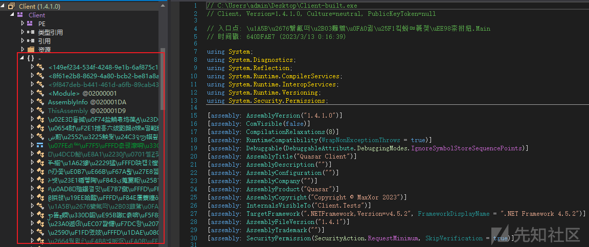](https://xzfile.aliyuncs.com/media/upload/picture/20240205191810-3eeccb64-c418-1.png)

去混淆后代码截图如下：

[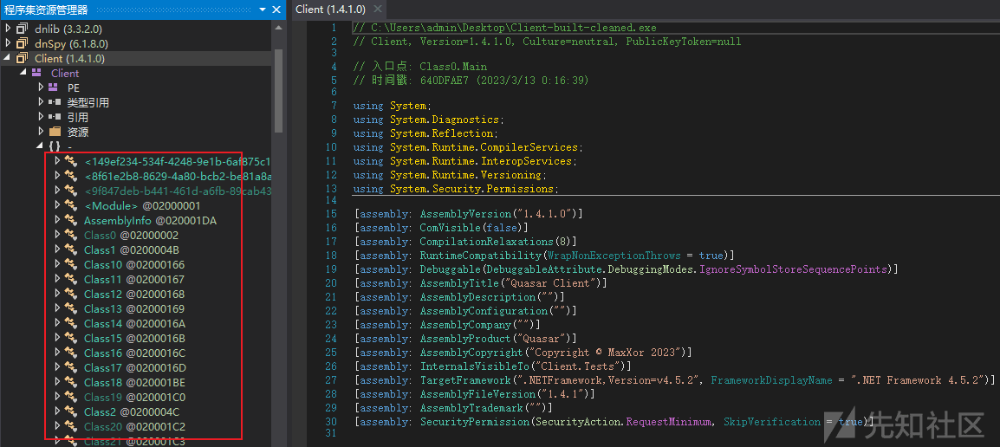](https://xzfile.aliyuncs.com/media/upload/picture/20240205191825-479454bc-c418-1.png)

### 相同配置信息解密方法

在对 QuasarRAT 加密配置信息进行解密的过程中，笔者发现 QuasarRAT 木马与 AsyncRAT 木马的配置信息解密算法，除密钥生成阶段有部分不同，其余算法阶段均相同：

-   不同点：QuasarRAT 将配置信息中的密钥字符串直接作为密钥初始化的输入，AsyncRAT 将配置信息中密钥字符串 base64 解码后的字符串作为密钥初始化的输入。
-   相同点：其他解密代码均相同。

QuasarRAT 木马配置信息截图如下：

[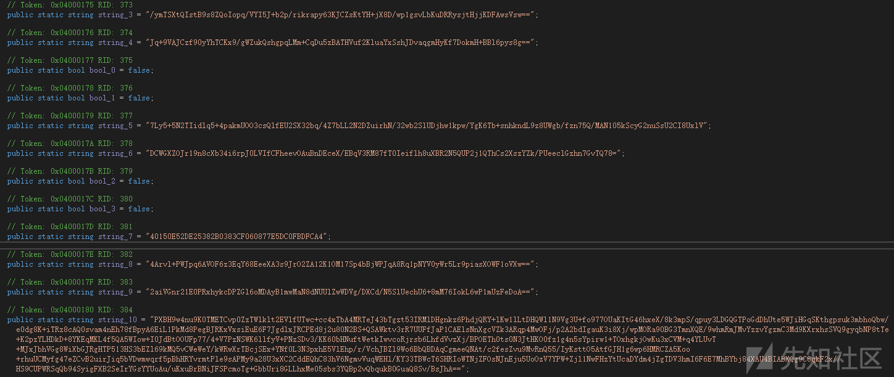](https://xzfile.aliyuncs.com/media/upload/picture/20240205191840-5051721a-c418-1.png)

AsyncRAT 木马配置信息截图如下：

[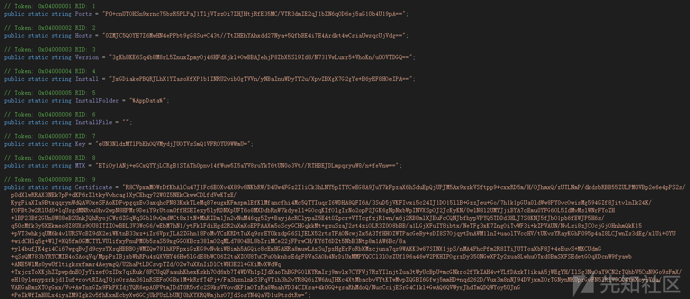](https://xzfile.aliyuncs.com/media/upload/picture/20240205191853-587b1ff4-c418-1.png)

QuasarRAT 木马密钥初始化代码截图如下：

[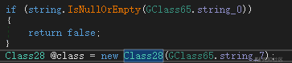](https://xzfile.aliyuncs.com/media/upload/picture/20240205191910-62771292-c418-1.png)

[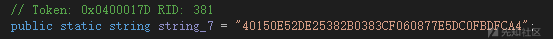](https://xzfile.aliyuncs.com/media/upload/picture/20240205191924-6aec39f2-c418-1.png)

[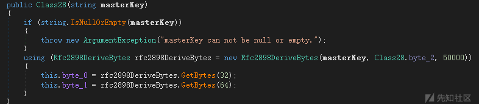](https://xzfile.aliyuncs.com/media/upload/picture/20240205191942-75842dc0-c418-1.png)

AsyncRAT 木马密钥初始化代码截图如下：

[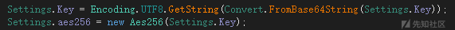](https://xzfile.aliyuncs.com/media/upload/picture/20240205191957-7e476f6c-c418-1.png)

[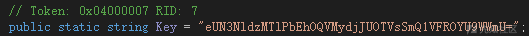](https://xzfile.aliyuncs.com/media/upload/picture/20240205192011-86d26c04-c418-1.png)

[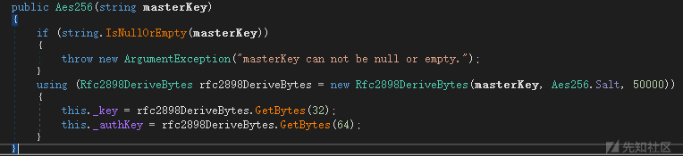](https://xzfile.aliyuncs.com/media/upload/picture/20240205192029-91a70b8a-c418-1.png)

QuasarRAT 木马解密算法截图如下：

[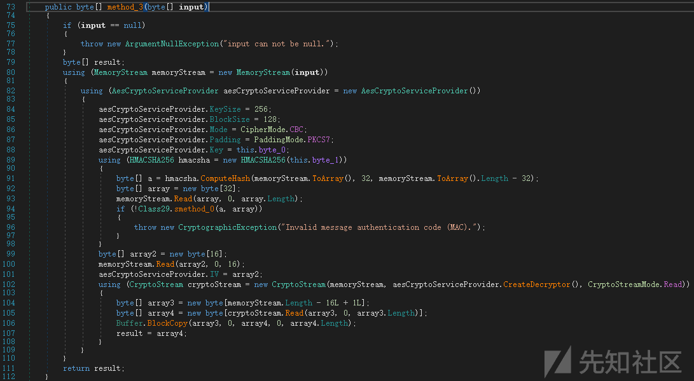](https://xzfile.aliyuncs.com/media/upload/picture/20240205192044-9a85ecda-c418-1.png)

AsyncRAT 木马解密算法截图如下：

[](https://xzfile.aliyuncs.com/media/upload/picture/20240205192059-a373ca56-c418-1.png)

### 自动化解密脚本实现

由于 QuasarRAT 与 AsyncRAT 的配置信息解密算法相同，因此可直接基于笔者《AsyncRAT 加解密技术剖析》文章中的配置信息解密脚本进行简单修改，即可实现 QuasarRAT 木马的配置信息自动化解密。

考虑到 QuasarRAT 木马中配置信息的命名与 AsyncRAT 木马的配置信息命名不同，同时，经过对比分析，发现 QuasarRAT 木马中配置信息字符串的顺序基本不变，因此，笔者基于 QuasarRAT 木马特性，又对自动化解密脚本做了定制化修改，解密效果如下：

```plain
F:\GolandProjects\awesomeProject3>awesomeProject3.exe
Version:1.4.1
Hosts:192.168.153.136:4782;
Install Subdirectory:SubDir
Install Name:Client.exe
Mutex：a76e7a42-47d0-4c26-85ca-50606b7ddae1
Startup Name: Quasar Client Startup
Client Tag:Office04
Log Directory Name:Logs
Serversignature:Bf7z8xtWtve7ucSffPkW+Xcr9w/hBPrwz7mbXwja4CNNNkBUuNisTZ0jQnI5IE+3iviHkjeF/K6ncuDRyoWrjCgjgeSi0IjzCUC9ug8a2ejYZRAW8Fru2bYBI34jO7koCUBBoowhyqnMCa1EdxZ3vhP+5Sfhkpm0fiAMW4/9XEyzoAcbNUeZW7jiNDNkkSyQnpUcX8qjtO2XNfm/5CfxqAZ3oSsY4AXSeByyOSg6z+14TI1CwdVwsg/CjDNR0e4cQcxYGLJRcWithb48KRz1DerpCajNXYU85Nd7ZqJL+lxlcBaHtfJ47DUZPhaEY0gA9OqEN3sV1PsYYrf5LAzBRxlRqlne10mL0vMgsqTA/9AoaBj+a1rLHap8pz2a9/mFhxbDVT7RPlKBCqLz627dV7SL40G1plxRSbLFYQLTUnR5GhFUll7qVTQpAB6Xr9Db0ZBDM6XvNRQittZhx4+DJpVxBiBB7MYUcDnbmngah6kgHxoxDRo0KcrXX2z134PkiRq5f+Bg4cUiqGHp9CkkZRNdzAAKgMKmKiNmRsvVfc/Hm0NZJRxG1sMnwPKTW5eJC/KLQb2KrrrUNj5E0gD+bg+P85Jsik4k6ZXoU5iT7FrYpcb+1QwxFUH5smwj0s/waTDgXZEi8D4gemUIZ8fO1k/vB0ZYINi4LWUV9Rwxcw0=
Certificate:MIIE9DCCAtygAwIBAgIQAIsBNmAKsDFbWAT7Z3kSAzANBgkqhkiG9w0BAQ0FADAbMRkwFwYDVQQDDBBRdWFzYXIgU2VydmVyIENBMCAXDTI0MDIwMjA2NDAxNFoYDzk5OTkxMjMxMjM1OTU5WjAbMRkwFwYDVQQDDBBRdWFzYXIgU2VydmVyIENBMIICIjANBgkqhkiG9w0BAQEFAAOCAg8AMIICCgKCAgEAhwxJ2t6TIIvmFxUgYAhkgiWTWpNt5XloFAIujZGsA2nmc2gjADu/I4/9vsL9ZkH2WZtUuWIyZNj6kciqcDLXUEs0vinaT32sVdTBmL44d5FYE2+0Qkok68faI0cDktF84B67s/WbHuRItPcBDzc/669wSBAmUjh0M+jPPLDARw6uGxafAB04BZz5e6XHp+F014rj2uUTLLTs13NACUUxyug+FmRqLljbc/sRPru7aTgsR7yEZP1/iBHTJhT56Hpujq53sKguecpVeKTdI6KjHZxKcFsM/0fOuHteWCwVqPOvHqfyoqIENSg6RKqxjrRCq2wh6u/mR8KIN9463cqgdURyVHF2B6QbmPyvj24EvkiVm1HiaBnGh1wKfAz1HsqI+w52Cj55u3UOewRBKwkBYww7qoABMuVoKk4OVEJNwF8X5FyXMc6A6jJp4h/7f9SNvD7KJwAemMJoK07JaY0o+WUcdZRQ6YKjj3knHveyxTQPa2B68ajFcskoPnAAYL5NCBQQtwctbwitD7iqwuaN7NCwVnb62hGJP+WAPaFD9viYP1JBnJMACOmAvpi8aGE2i4JxtdWXkJpuLXKlTJ42Xx3x+cs7OCdtS09AcYAUDhSdvZAhTqU7cV7Iucyd1WeJ0b6QIZZjBCLjIE4OXNy56RtPVOAa4WREZq7s67OzjVECAwEAAaMyMDAwHQYDVR0OBBYEFFtrRJmFngOkloZemoOYRn52r84vMA8GA1UdEwEB/wQFMAMBAf8wDQYJKoZIhvcNAQENBQADggIBAHU//zXLI6lJI56CSzJKwEpd0DHVxmSWYolpEh6lVHbEirkXtIVwq42oBWOnRrWlXHTjd0XFMSh3pnpMGDly4OCoeKmo6l5BRanyW7WXpLAUSz9HNXFjkAVCNLGCt3IkRoN6C1sKRTqQmYznUyP4FxVrWuqcB96GD3Gtcd0rCEMNQrnlym3WTa9MAQSbpDgOtS2X0GiuZR6ddA39AewmgenwpS+gBXlfGXeeBiGrPptWPwD+6tXdK6UHRak/WcdFuXznNL/PN6Vy/0LWC027MIDJ69LgwkSB/jDfUlqzo3RH6Uva0odmUao49jhxtLC3Fg+JvOkMspMSE0CH0EFVdxVY/5smzYaYgniSNunYSH0aKBmMSYlBWjNsTY3/vXktgxN57hiwZPzD90AGkjx8Qcf3a9Oi8IB14EdeRxQkRT8YAiUiy5jnTEVEEdGLizF2+EGdr4LqdQthmeahfVxSv3w/bdZv8hMphHDfrlAyQKkR0toKy5cT2fb2isgefH/JRVRPkSguF7Qsy/lbY6QK8CaL9GGPqaYVKuyUgER3QDiiVMJx9Gv9+0xGJ+16H0p8EiHzkb+ki+RNmDi9a6MKNAJSQaMliVhmuWziq0N+6WdosNjHTulSBZTZAZvS7LqrHENYpyLrTHj3e8cVhpdG5cRLQk09a93I2JrZDe8MHIcX

F:\GolandProjects\awesomeProject3>
```

解密效果截图如下：

[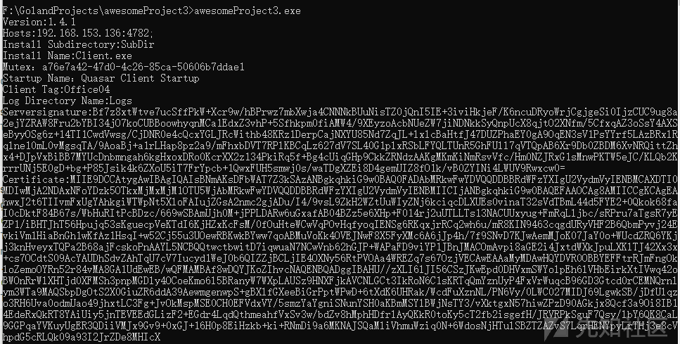](https://xzfile.aliyuncs.com/media/upload/picture/20240205192117-adf0c5d8-c418-1.png)

代码结构截图如下：**（备注：common.go 代码内容不变，具体代码内容请参考《AsyncRAT 加解密技术剖析》文章）**

[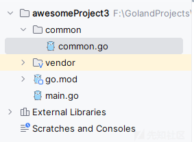](https://xzfile.aliyuncs.com/media/upload/picture/20240205192130-b60c9aee-c418-1.png)

-   main.go

```plain
package main

import (
    "awesomeProject3/common"
    "encoding/hex"
    "fmt"
    "strings"
)

func main() {
    key := ""

    strs := common.FileToSlice("C:\\Users\\admin\\Desktop\\11.txt")
    for _, str := range strs {
        if strings.Contains(str, "public static string string_7 = ") {
            key = strings.Split(strings.Split(str, ` = "`)[1], `";`)[0]
        }
    }
    for _, str := range strs {
        if strings.Contains(str, "public static string string_0 = ") {
            Version := strings.Split(strings.Split(str, ` = "`)[1], `";`)[0]
            fmt.Print("Version:")
            decrypt_QuasarRAT_str(key, Version)
        } else if strings.Contains(str, "public static string string_1 = ") {
            Hosts := strings.Split(strings.Split(str, ` = "`)[1], `";`)[0]
            fmt.Print("Hosts:")
            decrypt_QuasarRAT_str(key, Hosts)
        } else if strings.Contains(str, "public static string string_3 = ") {
            Install_Subdirectory := strings.Split(strings.Split(str, ` = "`)[1], `";`)[0]
            fmt.Print("Install Subdirectory:")
            decrypt_QuasarRAT_str(key, Install_Subdirectory)
        } else if strings.Contains(str, "public static string string_4 = ") {
            Install_Name := strings.Split(strings.Split(str, ` = "`)[1], `";`)[0]
            fmt.Print("Install Name:")
            decrypt_QuasarRAT_str(key, Install_Name)
        } else if strings.Contains(str, "public static string string_5 = ") {
            Mutex := strings.Split(strings.Split(str, ` = "`)[1], `";`)[0]
            fmt.Print("Mutex：")
            decrypt_QuasarRAT_str(key, Mutex)
        } else if strings.Contains(str, "public static string string_6 = ") {
            Startup_Name := strings.Split(strings.Split(str, ` = "`)[1], `";`)[0]
            fmt.Print("Startup Name：")
            decrypt_QuasarRAT_str(key, Startup_Name)
        } else if strings.Contains(str, "public static string string_8 = ") {
            Client_Tag := strings.Split(strings.Split(str, ` = "`)[1], `";`)[0]
            fmt.Print("Client Tag:")
            decrypt_QuasarRAT_str(key, Client_Tag)
        } else if strings.Contains(str, "public static string string_9 = ") {
            Log_Directory_Name := strings.Split(strings.Split(str, ` = "`)[1], `";`)[0]
            fmt.Print("Log Directory Name:")
            decrypt_QuasarRAT_str(key, Log_Directory_Name)
        } else if strings.Contains(str, "public static string string_10 = ") {
            Serversignature := strings.Split(strings.Split(str, ` = "`)[1], `";`)[0]
            fmt.Print("Serversignature:")
            decrypt_QuasarRAT_str(key, Serversignature)
        } else if strings.Contains(str, "public static string string_11 = ") {
            Certificate := strings.Split(strings.Split(str, ` = "`)[1], `";`)[0]
            fmt.Print("Certificate:")
            decrypt_QuasarRAT_str(key, Certificate)
        }
    }
}

func decrypt_QuasarRAT_str(key string, input_str string) {
    input := common.Base64_Decode(input_str)
    hmacsha := input[:32]
    aes_iv := input[32:48]
    encode_data := input[48:]

    //代码不同
    rfc2898DeriveBytes := common.Pbkdf2_Rfc2898DeriveBytes([]byte(key))
    //fmt.Println(hex.EncodeToString(rfc2898DeriveBytes))
    aeskey := rfc2898DeriveBytes[:32]
    _authKey := rfc2898DeriveBytes[32:]

    if hex.EncodeToString(common.HMACSHA256(_authKey, input[32:])) != hex.EncodeToString(hmacsha) {
        fmt.Println("Error")
        return
    }
    output, _ := common.Aes_decrypt_cbc(encode_data, aeskey, aes_iv)
    fmt.Println(string(output))
}
```

## 通信数据解密对比

对 QuasarRAT 木马上线过程及远程控制过程进行流量抓取分析，发现其通信数据主要分为两层：

-   第一层加密：调用 TLS1.2 对通信数据进行加密，密钥套件带 DH 算法；
-   第二层加密：调用 protobuf 序列化对通信载荷进行加密；

相关截图如下：

[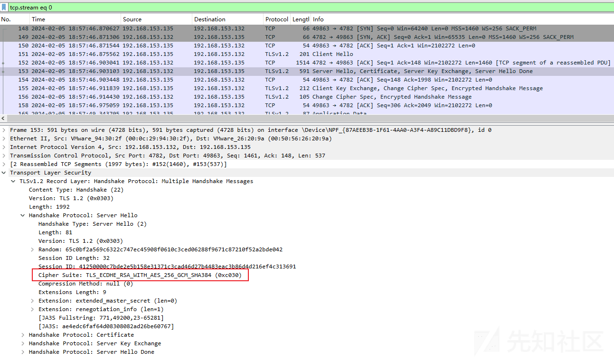](https://xzfile.aliyuncs.com/media/upload/picture/20240205192152-c2fe125a-c418-1.png)

### TLS 解密

由于必须成功解密最外层 TLS 通信数据才能对底层通信载荷进行详细的对比研究，因此，笔者花了不少时间对其进行琢磨研究，最终发现了一种**疑似可适用于 NET 程序研究场景下的密钥套件自定义方法**，通过自定义密钥套件配置，笔者可成功基于私钥对最外层 TLS 通信数据进行解密。

备注：私钥提取过程可参考《AsyncRAT 加解密技术剖析》文章“TLS 解密 - 私钥提取”章节。

相关截图如下：

[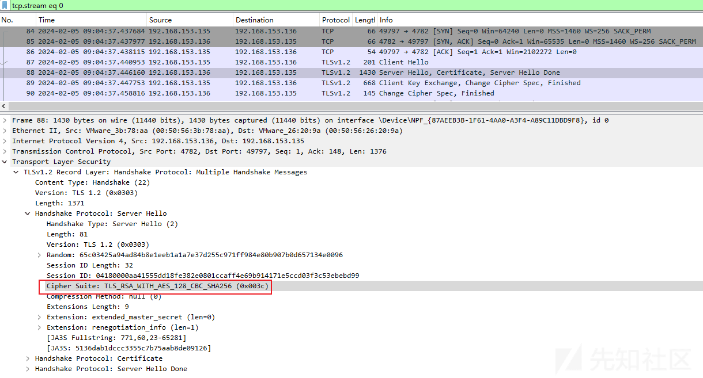](https://xzfile.aliyuncs.com/media/upload/picture/20240205192209-cd37c752-c418-1.png)

TLS 解密后数据载荷截图如下：

[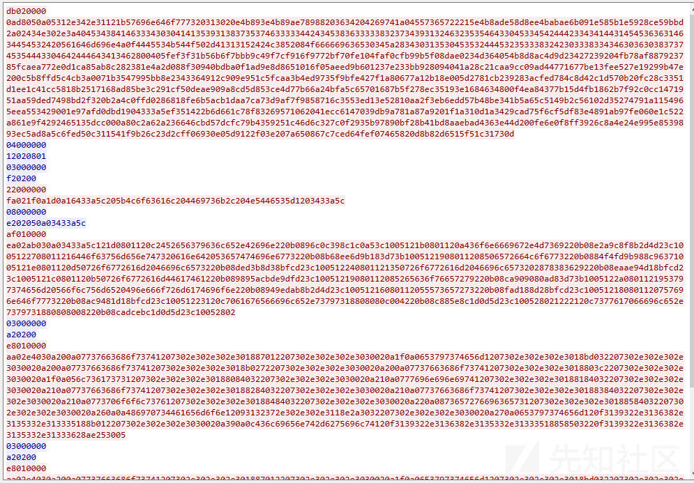](https://xzfile.aliyuncs.com/media/upload/picture/20240205192227-d7ae6902-c418-1.png)

### 反序列化通信数据

成功解密 TLS 通信数据后，即可对底层通信数据进行分析，通过动态调试及对比分析，笔者发现 TLS 解密后的通信载荷为 protobuf 序列化数据。

相关 protobuf 序列化调用 dll 截图如下：

[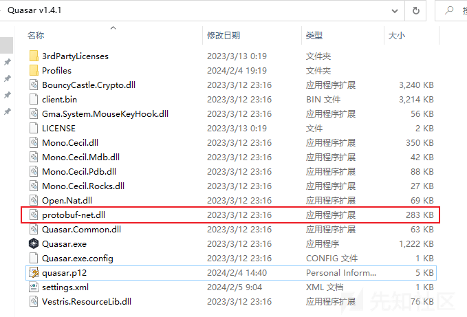](https://xzfile.aliyuncs.com/media/upload/picture/20240205192244-e1bfcbac-c418-1.png)

相关调用代码截图如下：

[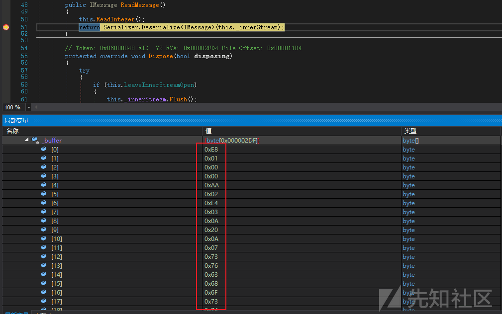](https://xzfile.aliyuncs.com/media/upload/picture/20240205192302-eca05712-c418-1.png)

解密数据包截图如下：**（解密数据包中的载荷数据与调用代码中的载荷数据相同）**

[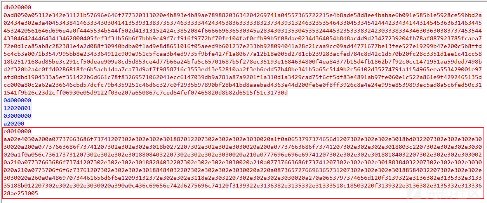](https://xzfile.aliyuncs.com/media/upload/picture/20240205192319-f6b9721a-c418-1.png)

为了能够有效的对protobuf序列化数据进行反序列化，笔者进行了多种尝试（编写C#脚本、编写golang脚本、使用在线工具等），最终，笔者找到了一种比较便捷的方法，即使用CyberChef在线平台解密protobuf序列化数据。

在线工具解密截图如下：

[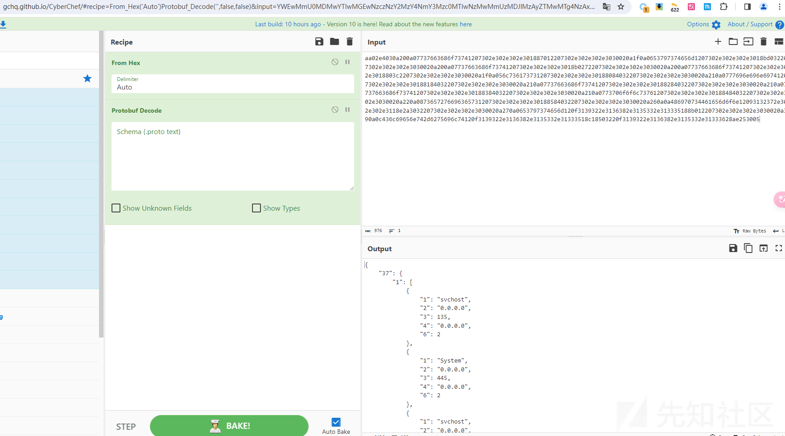](https://xzfile.aliyuncs.com/media/upload/picture/20240205192334-ffd3786e-c418-1.png)

解密效果如下：

```plain
{
    "37": {
        "1": [
            {
                "1": "svchost",
                "2": "0.0.0.0",
                "3": 135,
                "4": "0.0.0.0",
                "6": 2
            },
            {
                "1": "System",
                "2": "0.0.0.0",
                "3": 445,
                "4": "0.0.0.0",
                "6": 2
            },
            {
                "1": "svchost",
                "2": "0.0.0.0",
                "3": 5040,
                "4": "0.0.0.0",
                "6": 2
            },
            {
                "1": "svchost",
                "2": "0.0.0.0",
                "3": 7680,
                "4": "0.0.0.0",
                "6": 2
            },
            {
                "1": "lsass",
                "2": "0.0.0.0",
                "3": 49664,
                "4": "0.0.0.0",
                "6": 2
            },
            {
                "1": "wininit",
                "2": "0.0.0.0",
                "3": 49665,
                "4": "0.0.0.0",
                "6": 2
            },
            {
                "1": "svchost",
                "2": "0.0.0.0",
                "3": 49666,
                "4": "0.0.0.0",
                "6": 2
            },
            {
                "1": "svchost",
                "2": "0.0.0.0",
                "3": 49667,
                "4": "0.0.0.0",
                "6": 2
            },
            {
                "1": "spoolsv",
                "2": "0.0.0.0",
                "3": 49668,
                "4": "0.0.0.0",
                "6": 2
            },
            {
                "1": "services",
                "2": "0.0.0.0",
                "3": 49669,
                "4": "0.0.0.0",
                "6": 2
            },
            {
                "1": "HipsDaemon",
                "2": {
                    "6": 3543822931722123300
                },
                "3": 53730,
                "4": "0.0.0.0",
                "6": 2
            },
            {
                "1": "System",
                "2": "192.168.153.135",
                "3": 139,
                "4": "0.0.0.0",
                "6": 2
            },
            {
                "1": "Client-built",
                "2": "192.168.153.135",
                "3": 49857,
                "4": "192.168.153.136",
                "5": 4782,
                "6": 5
            }
        ]
    }
}
```

对应 QuasarRAT 控制端 GUI 界面截图如下：

[](https://xzfile.aliyuncs.com/media/upload/picture/20240205192352-0a53f28c-c419-1.png)

使用在线平台 CyberChef 解密 protobuf 序列化数据的案例网页地址如下：

```plain
#使用 CyberChef 在线平台解密 protobuf 序列化数据的案例网页地址

https://gchq.github.io/CyberChef/#recipe=From_Hex('Auto')Protobuf_Decode('',false,false)&input=YWEwMmU0MDMwYTIwMGEwNzczNzY2MzY4NmY3Mzc0MTIwNzMwMmUzMDJlMzAyZTMwMTg4NzAxMjIwNzMwMmUzMDJlMzAyZTMwMzAwMjBhMWYwYTA2NTM3OTczNzQ2NTZkMTIwNzMwMmUzMDJlMzAyZTMwMThiZDAzMjIwNzMwMmUzMDJlMzAyZTMwMzAwMjBhMjAwYTA3NzM3NjYzNjg2ZjczNzQxMjA3MzAyZTMwMmUzMDJlMzAxOGIwMjcyMjA3MzAyZTMwMmUzMDJlMzAzMDAyMGEyMDBhMDc3Mzc2NjM2ODZmNzM3NDEyMDczMDJlMzAyZTMwMmUzMDE4ODAzYzIyMDczMDJlMzAyZTMwMmUzMDMwMDIwYTFmMGEwNTZjNzM2MTczNzMxMjA3MzAyZTMwMmUzMDJlMzAxODgwODQwMzIyMDczMDJlMzAyZTMwMmUzMDMwMDIwYTIxMGEwNzc3Njk2ZTY5NmU2OTc0MTIwNzMwMmUzMDJlMzAyZTMwMTg4MTg0MDMyMjA3MzAyZTMwMmUzMDJlMzAzMDAyMGEyMTBhMDc3Mzc2NjM2ODZmNzM3NDEyMDczMDJlMzAyZTMwMmUzMDE4ODI4NDAzMjIwNzMwMmUzMDJlMzAyZTMwMzAwMjBhMjEwYTA3NzM3NjYzNjg2ZjczNzQxMjA3MzAyZTMwMmUzMDJlMzAxODgzODQwMzIyMDczMDJlMzAyZTMwMmUzMDMwMDIwYTIxMGEwNzczNzA2ZjZmNmM3Mzc2MTIwNzMwMmUzMDJlMzAyZTMwMTg4NDg0MDMyMjA3MzAyZTMwMmUzMDJlMzAzMDAyMGEyMjBhMDg3MzY1NzI3NjY5NjM2NTczMTIwNzMwMmUzMDJlMzAyZTMwMTg4NTg0MDMyMjA3MzAyZTMwMmUzMDJlMzAzMDAyMGEyNjBhMGE0ODY5NzA3MzQ0NjE2NTZkNmY2ZTEyMDkzMTMyMzcyZTMwMmUzMDJlMzExOGUyYTMwMzIyMDczMDJlMzAyZTMwMmUzMDMwMDIwYTI3MGEwNjUzNzk3Mzc0NjU2ZDEyMGYzMTM5MzIyZTMxMzYzODJlMzEzNTMzMmUzMTMzMzUxODhiMDEyMjA3MzAyZTMwMmUzMDJlMzAzMDAyMGEzOTBhMGM0MzZjNjk2NTZlNzQyZDYyNzU2OTZjNzQxMjBmMzEzOTMyMmUzMTM2MzgyZTMxMzUzMzJlMzEzMzM1MThjMTg1MDMyMjBmMzEzOTMyMmUzMTM2MzgyZTMxMzUzMzJlMzEzMzM2MjhhZTI1MzAwNQ
```
