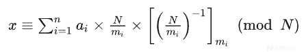
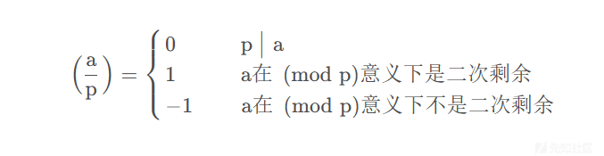
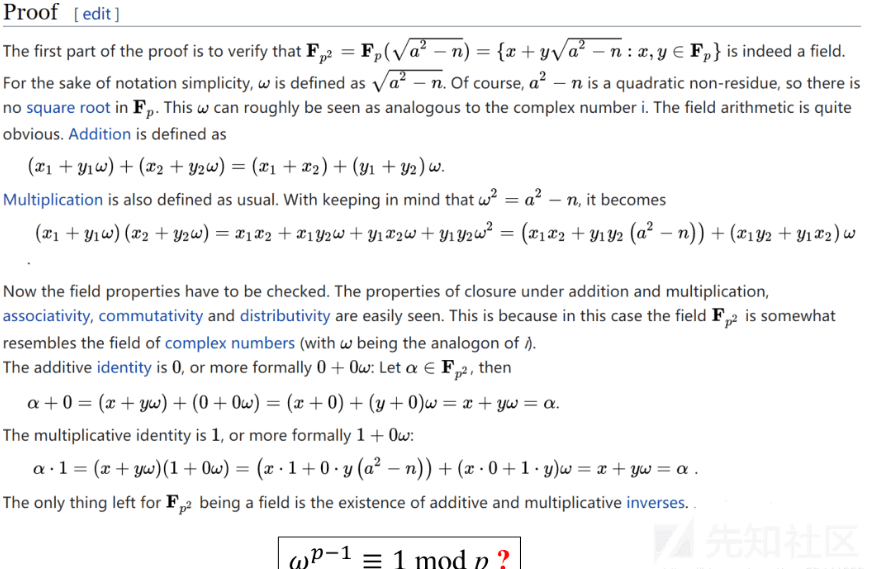
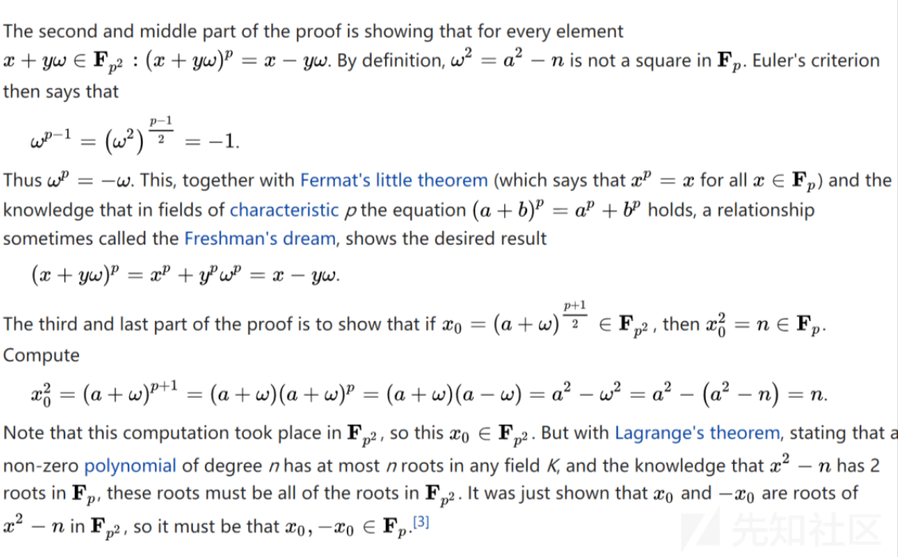
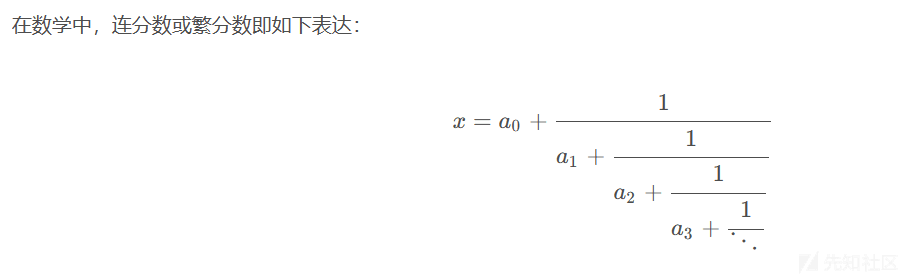
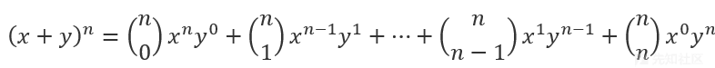

# RSA 系列之《数论下》 - 先知社区

RSA 系列之《数论下》

- - -

### 前言：

RSA 系列关于数论的内容很多，我每一个都是较为详细地介绍，算是一种总结和梳理。《数论上》更多的是入门，对熟悉的师傅来讲查漏补缺，对刚入门的师傅也是不错的整理规划。这篇《数论下》我将会整理几类较为复杂的算法，希望能给大家带来帮助。

## 数论十：中国剩余定理（CRT）

中国剩余定理 (Chinese remainder theorem, CRT) ，也叫孙子定理，要让它当孙子而不是我们当孙子。

既然它被称为“孙子定理”，它来自于《孙子算经》，是中国古代重要的数学著作，共三卷，成书约在四、五世纪，作者生平和具体编写年不详。其卷下的第 26 题为：

今有物不知其数，三三数之剩二，五五数之剩三，七七数之剩二，问物几何？  
答曰：‘二十三’。  
术曰：三三数之剩二，置一百四十；五五数之剩三，置六十三，七七数之剩二，置三十，并之。得二百三十三，以二百一十减之，即得。凡三三数之剩一，则置七十；五五数之剩一，则置二十一；七七数之剩一，则置十五；一百六以上以一百五减之即得。

一个整数除以 3 余 2、除以 5 余 3、除以 7 余 2，求这个整数。  
答案：23

解法：由于除以 3 余 2，因此加上一个 140；由于除以 5 余 3，因此加上一个 63；由于除以 7 余 2，因此加上一个 30；这三个数的和是 140+63+30=233，再减去 210，就得到了 23 了。  
而按照后文的操作，只要是除以 3 余了一个 1，就加上一个 70；只要是除以 5 余了一个 1，就加上一个 21；只要是除以 7 余了一个 1，就加上一个 15。然后累加。超过了 106 就减去 105 就行了。

该问题称之为“**物不知数**”问题。

古人是很有智慧的，这个问题在千把年前就被解决了，那么几千年后的今天，我们也要有自信去解决，并以自己的方式去理解创新。

那么我们用现代数学语言来理解《孙子算经》中的这道题：

计算一个整数 x，使得它满足除以 3 余 2、除以 5 余 3、除以 7 余 2  
如果能找到三个整数 x1，x2，x3，使得：

x1 除以 3 余 2、除以 5 余 0、除以 7 余 0；  
x2 除以 3 余 0、除以 5 余 3、除以 7 余 0；  
x3 除以 3 余 0、除以 5 余 0、除以 7 余 2；

那令 x=x1+x2+x3，很容易验证 x 就是会满足除以 3 余 2、除以 5 余 3、除以 7 余 2。好的，下面我们再拓展思考一下：

y1 除以 3 余 1、除以 5 余 0、除以 7 余 0；  
y2 除以 3 余 0、除以 5 余 1、除以 7 余 0；  
y3 除以 3 余 0、除以 5 余 0、除以 7 余 1；

以第一个为例，y1 和 x1 之间能够存在什么关系？我们先令 x1=2×y1，即已知 y1 时以该关系式得到 x1，那么这时 x1 就会满足除以 3 余 2、除以 5 余 0、除以 7 余 0。按这个思路下去，如果我们找到了 y1，y2，y3，那么就可以取 x=2×y1+3×y2+2×y3.

对数学敏感的同学想必已经发现了什么不对劲，那就抱着这个疑问，我们继续：

下面就以问题 1-1-1 为例：寻找整数 z 使得除以 3 余 1、除以 5 余 0、除以 7 余 0。于是 z 一定是 5×7=35 的倍数，假设 z=35k，那么就有 35k≡1(mod3) ，而这时的 k 就是 5×7 模 3 的逆元，将这个 k 记作\[35^(-1)\]3，那么 z 就等于 5×7×\[35^(-1)\]3，恰好就是 5×7×2=70，对应“凡三三数之剩一，则置七十”一句及“三人同行七十稀”一句。

于是类推得到：

问题 1-1-2 的解答是 3×7×\[(3×7)^-1\]5，恰好就是 3×7×1=21  
对应“五五数之剩一，则置二十一”一句及“五树梅花廿一枝”一句；

问题 1-1-3 的解答是 3×5×\[(3×5)^-1\]7，恰好就是 3×5×1=15  
对应“七七数之剩一，则置十五”一句及“七子团圆月正半”一句。

所以将分解的问题复原，可得：

x=2×(5×7×\[(5×7)^-1\]3)+3×(3×7×\[(3×7)^-1\]5)+2×(3×5×\[(3×5)^-1\]7) 。

最后，注意到，如果 x 满足除以 3 余 2、除以 5 余 3、除以 7 余 2，那么 x +3×5×7 也同样满足。因此要计算满足要求的最小的非负整数，就只需要计算总和除以 105 的余数即可，够减那就多减几次，或者用 mod 105 的形式来减去相除。  
——对应“除百零五便得知”一句。

在我们引入古文，并用现代数学语言解释完毕后，我们反过头来看现代的中国剩余定理的介绍：

[](https://xzfile.aliyuncs.com/media/upload/picture/20240128134154-f146d70c-bd9f-1.png)

1.  计算所有模数的积 N，即所有除数的积得到 N；
2.  计算第 i 个方程 ci=N/mi；
3.  计算 ci 在模 mi 意义下的逆元 ci^-1

首先要明确在这里的 m1-mi 都必须两两互质，然后我们继续分析公式，从左往右分别由“ai”，“N/mi”，“ci^(-1)”，(mod M)  
“ai”：这很好理解，就是对应的余数，因为我们用到了逆元，逆元是有着 1(mod) 的特征，犹如上文 y1 对 x1 的关系一般  
“N/mi”：即是除了该对应项以外的所有数之积，上文提到的 z 就是这样的，满足了除了该项以外都能被整除。  
“ci^(-1)”：这是最关键的逆元算法，由此我们将模数和余数联系在了一起。  
(mod M) ：就是一个求最小的非负整数的过程。

这样看其实也不难是吧？那我们举一个例子：

-   x≡2(mod 3)
-   x≡3(mod 4)
-   x≡1(mod 5)

那么就有：

1.  M=3×4×5=60
2.  c1=20，c1^-1=2  
    c2=15，c1^-1=3  
    c3=12，c1^-1=3
3.  x=(2×20×2+3×15×3+1×12×3)%60=251%60 =11  
    就此，结束。

同样，还有代码实现，熟悉代码的大佬也可以选择用代码来理解

```plain
def Get_Mi(m_list, M):
    M_list = []
    for mi in m_list:
        M_list.append(M // mi)
    return M_list

def Get_ei_list(M_list, m_list):
    ei_list = []
    for i in range(len(M_list)):
        ei_list.append(Get_ei(M_list[i], m_list[i])[0])
    return ei_list

def Get_ei(a, b):
    if 0 == b:
        x = 1;
        y = 0;
        q = a
        return x, y, q
    xyq = Get_ei(b, a % b)
    x = xyq[0];
    y = xyq[1];
    q = xyq[2]
    temp = x;
    x = y;
    y = temp - a // b * y
    return x, y, q

def crt(a_list, m_list):
    M = 1
    for mi in m_list:
        M *= mi
    Mi_list = Get_Mi(m_list, M)
    Mi_inverse = Get_ei_list(Mi_list, m_list)
    x = 0
    for i in range(len(a_list)): 
        x += Mi_list[i] * Mi_inverse[i] * a_list[i]
        x %= M
    return x

if __name__ == '__main__':
    a_list = list(map(int, input().split(",")))
    m_list = list(map(int, input().split(",")))
    print(crt(a_list, m_list))
```

应该理解了吧，那行，咱就下一步，怎么用呢？那就是当你在 RSA 中能发现或总结出的两队甚至多对关系，这个时候你就可以选择使用 CTR 直接秒了

-   x = a1 mod m1
-   x = a2 mod m2
-   x = a3 mod m3
-   ……
-   x = an mod mn

选择常用的脚本即是：

```plain
def exgcd(a, b) :
    if b == 0 :
    return 1, 0, a
    x, y, d = exgcd(b, a % b)
    return y, x - (a // b) * y, d
def CRT(a, b) : #a, b 分别是模数和余数
    M = 1
    X = 0
    for i in a :
        M *= i
    for i in zip(a, b) :
        w = M // i[0]
        x, y, d = exgcd(w, i[0])
        X = (X + x * w * i[1]) % M  
    return (X % M + M) % M
```

## 数论十一：拓展中国剩余定理（EXCRT）

在研究该定理前，我们要回忆一下拓展欧几里得算法：

拓展欧几里得算法（Extended Euclidean Algorithm）是求解两个整数的最大公约数（GCD）以及求解贝祖等式的一种方法。该算法的名称来自于古希腊数学家欧几里得。

算法描述如下：

假设我们要求解整数 a 和 b 的最大公约数，可以使用下面的递归形式：

1.  如果 b 等于 0，则返回 a 作为最大公约数。
2.  否则，用 a 除以 b 得到商 q 和余数 r。
3.  对于 a 和 b 的最大公约数，可以递归地通过求解 b 和 r 的最大公约数来确定，即 gcd(a, b) = gcd(b, r)。
4.  使用递归的结果，我们可以找到满足贝祖等式的一组整数 x 和 y，即 ax + by = gcd(a, b)。

那么回到 CRT，前提是要求所有的 mi 互素。

-   x = a1 mod m1
-   x = a2 mod m2
-   x = a3 mod m3
-   ……
-   x = an mod mn

但是，也有方程组模数不再满足两两互质，甚至还有可能无解。那么我们别的思路进行拓展，利用拓展欧几里得算法。

-   构造 x = a1 mod m1 和 x = a2 mod m2
-   等价于 x = a1 + k1 *m1 和 x = a2 + k2* m2
-   消去 x 有：k1 *m1 − k2* m2 = a2 − a1

显然想到 ax + by = gcd(a, b)，那么如果 gcd ( m1 , m2 ) | a2 − a1，有一组解，我们设这一组解 y1 y2

那么对于这一组方程，有了一个通解：

k1 = y1 + t *m2 / ( gcd ( m1 , m2 ))  
k2 = y2 + t* m1 / ( gcd ( m1 , m2 ))

互相带入有 x = a1 + y1 *m1 + t* m1 *m2 / d = a1 + y1* m1 + t \* \[ m1 , m2\]

令 x0 = a1 + k1 *m1，发现两个方程式相互转化得 x = x0 + t* \[ m1 , m2\]

从而，我们可以通过 n-1 次循环把 n 个方程并为 一个方程，最后通过解这一个方程得到整个方程的解。

注：在算法实现过程中，我们为了让结果溢出且恒为正，我们需要做一些预处理：令 t = m2 / d 然后 k1 = ( k1 % t + t ) % t

最后实现结果方程就是 x = a1 + t \* m1，解为：( a1 % m1 + m1 ) % m1

或者我们换个思路解决：

构造 b1 x1+b2 x2 = c2 − c1，这个式子可视为 b1 x1 ≡ c2 − c1 ( mod b2)，利用拓展 gcd 进行求解可以得到一个解 x′，g 为他们的 gcd 结果，即最大公约数。

那么 x1 的解集就可以表示为 ( ( c2 - c1 ) / g ) x ' + t \* b2 / g

代回式子 x = c1 mod b1 有 x = c1 +{ ( ( c2 - c1 ) / g ) x ' + t *b2 / g }* b1

也就是 x = c1 +{ ( ( c2 - c1 ) / g ) x ' } *b1 ( mod b1* b2 / g )

所以每一次都以当前的 ci 减去之前的答案和 ans 作为新的 c，当前的 bi 作为新的 b，之前的 b 的 lcm（简称 M）作为新的 a

代码实现：

```plain
n = int(input())
def exgcd(a, b) :
    if b == 0 :
        return 1, 0, a
    x, y, g = exgcd(b, a % b)
    return y, x - (a // b) * y, g
x = 0
m1, a1 = map(int, input().split())

for i in range(n - 1):
    m2, a2 =  map(int, input().split())
    k1, k2, d = exgcd(m1, m2)
    k1 *= (a2 - a1) // d
    k1 = (k1 % (m2 // d) + (m2 // d)) % (m2 // d) ###求最小正整数
    x = k1 * m1 + a1
    m1 = abs(m1 * m2 // d)
    a1 = x
if x != -1 :
    x = (a1 % m1 + m1) % m1
```

## 数论十二：二次剩余

二次剩余是数论基本概念之一。它是初等数论中非常重要的结果。俗称模意义开根、二次同余等等。

二次剩余定义：若存在整数 x，对于整数 d 满足  
$$  
x^2 ≡ a ( mod p )  
$$  
，称 a 是模 p 意义下的二次剩余。

下面探讨 p 为奇素数的情况（因为 p = 2 时没什么意义）。使用 Cipolla 算法求解。当 a = 0 时显然 x = 0，下面就不讨论了。

**定理 1：**二次剩余满足关于 p 对称，即  
$$  
x^2 = (p-x)^2 mod p  
$$  
**定理 2：**对于奇素数 p，二次剩余 a 的个数为 (p-1)/2，二次非剩余的也为 (p-1)/2

**定理 3**（欧拉准则）**：** 对于奇素数 p：

a 是模 p 的二次剩余的充要条件为：  
$$  
a^ (p-1)/2 = 1 mod p  
$$  
a 是模 p 的二次非剩余的充要条件为：  
$$  
a^ (p-1)/2 = -1 mod p  
$$

勒让德符号：

[](https://xzfile.aliyuncs.com/media/upload/picture/20240128134256-16986f0c-bda0-1.png)

欧拉准则：（证明：由费马小定理得 a^(p − 1) ≡ 1 ( mod p ) 式子变换得到）  
$$  
(a/p)≡a^(p−1 /2)(modp)  
$$  
这里再复习一下欧拉定理以免混淆

欧拉定理（Euler’s theorem）是数论中一个重要的定理，它与模运算和指数运算有关。也被称为费马 - 欧拉定理或欧拉 - 费马定理。

对于任意正整数 a 和模 m，如果 a 和 m 互质，即它们的最大公因数为 1，则 n 的欧拉函数 φ(n) 可以让等式成立：  
$$  
a^ϕ(n) ≡ 1(modn)  
$$  
也就是说，**a 的φ(n) 次方被 n 除的余数为 1。或者说，a 的φ(n) 次方减去 1，可以被 n 整除。**比如，3 和 7 互质，而 7 的欧拉函数φ(7) 等于 6，所以 3 的 6 次方（729）减去 1，可以被 7 整除（728/7=104）。欧拉定理的证明比较复杂，这里就省略了。我们只要记住它的结论就行了。欧拉定理可以大大简化某些运算。

x^2 = n ( mod p ) :

Cipolla 算法（奇波拉）：若 p 为奇素数，求二次剩余可用 Cipolla 算法。

-   找出一个 x，使得 x^2 - a 是 p 的二次非剩余。
-   令 i^2 ≡ x^2 − a ( mod p ) ，则 ( x + i ) ^ ( p+1 / 2 ) 为方程的一个跟，其相反数为方程的另一个根

证明：首先要明白，这里的 i 它应当理解为 一个虚数概念中的“虚数单位”。我们对实数域进行扩充，所有数都能表示成 a + b \* i 的形式，其中 a,b 是实数。

( x + 1) ^ ( p + 1 ) ≡ ( x + i )( x + i ) ^ p (mod p ) ≡ ( x + i ) ( x^p + i ^p )( mod p )

根据费马小定理，x ^ p ≡ x ( mod p )，对 i^p 进行变形 即对 p = 2 \* ( p - 1 / 2 ) 而 i^2 = x^2 - a

由于 x^2 - a 是 p 的非二次剩余，所以 (x^2 - a ) ^ (p-1 / 2 ) = -1 ( mod p )

可得：i^p = -i ( mod p )

那么：  
$$  
(x^2 + i ) ^ (p-1 ) = x^2 - i^ 2 = a ( mod p )  
$$  
所以 方程的根为：(x+i)^(p+1 / 2)

参考文献：

[](https://xzfile.aliyuncs.com/media/upload/picture/20240128134325-27ac93c2-bda0-1.png)

[](https://xzfile.aliyuncs.com/media/upload/picture/20240128134339-2ff80264-bda0-1.png)

## 数论十三：连分数

[](https://xzfile.aliyuncs.com/media/upload/picture/20240128134432-4fb5d220-bda0-1.png)

这里的 a0 是某个整数，而所有其他的数 an 都是正整数，可依样定义出更长的表达式。如果部分分子（partial numerator）和部分分母（partial denominator）允许假定任意的值，在某些上下文中可以包含函数，则最终的表达式是广义连分数（Generalized continued fraction）。在需要把上述标准形式与广义连分数相区别的时候，可称它为简单或正规连分数，或称为是规范形式的。

连分数的定义很容易理解，在佩尔方程、维纳攻击等地方用得很多，具体请看我其他的文章

## 数论十四：二项式定理

定义根据此定理，可以将的任意次幂展开成和的形式：

[](https://xzfile.aliyuncs.com/media/upload/picture/20240128135409-a7b57b46-bda1-1.png)

应用：二项式定理主要应用在 RSA 中的取模运算中：  
$$  
(a+c)^n = b mod c  
$$  
根据上面的二项式定理，除了第一项以外其余项都能被 c 整除，于是可以化解为  
$$  
a^n = b mod c  
$$
